# vLLM 架构总览

> **定位**：本文档从架构层面深度分析 vLLM 源码，建立全局认知。涵盖六层分层架构、v0→v1 演进、核心数据结构与设计原则。

## 总体架构图

```mermaid
graph TB
    subgraph L6["🔧 第6层: 内核层 csrc/"]
        CUDAK["CUDA Kernels<br/>cutlass/flashinfer/triton"]
        CustomOps["Custom Ops<br/>vllm._custom_ops"]
    end

    subgraph L5["🎯 第5层: 模型执行器 model_executor/"]
        ModelReg["Model Registry<br/>150+ 模型架构"]
        ModelRunner["ModelRunner<br/>GPU/CPU/XPU/TPU"]
        QuantBackend["量化后端<br/>FP8/GPTQ/AWQ/NVFP4"]
    end

    subgraph L4["⚙️ 第4层: 执行器层 v1/executor/"]
        UniProc["UniProcExecutor<br/>单进程"]
        MultiProc["MultiprocExecutor<br/>多进程"]
        RayExec["RayExecutor<br/>Ray 分布式"]
        WorkerBase["WorkerBase<br/>Worker 抽象"]
    end

    subgraph L3["📋 第3层: 调度核心 v1/core/sched/"]
        Scheduler["Scheduler<br/>调度算法"]
        AsyncSched["AsyncScheduler<br/>异步调度"]
        ReqQueue["RequestQueue<br/>请求队列"]
        BlockPool["BlockPool<br/>KV Cache 块池"]
    end

    subgraph L2["🔧 第2层: 引擎层 engine/ + v1/engine/"]
        EngineCore["EngineCore<br/>核心引擎循环"]
        LLMEngine["LLMEngine<br/>兼容包装"]
        InputProc["InputProcessor<br/>输入处理"]
        OutputProc["OutputProcessor<br/>输出处理"]
        Detokenizer["Detokenizer<br/>解码器"]
    end

    subgraph L1["🌐 第1层: 服务层 entrypoints/"]
        OpenAIAPI["OpenAI API Server"]
        AnthropicAPI["Anthropic API"]
        ChatCompletion["Chat Completion"]
        Embedding["Embedding/Pooling"]
        BatchServing["Batch Serving"]
    end

    L1 -->|"HTTP/gRPC"| L2
    L2 -->|"EngineCoreRequest"| L3
    L3 -->|"SchedulerOutput"| L4
    L4 -->|"collective_rpc"| L5
    L5 -->|"CUDA Kernel"| L6

    style L6 fill:#fff3e0,stroke:#e65100,color:#000
    style L5 fill:#e8f5e9,stroke:#2e7d32,color:#000
    style L4 fill:#fce4ec,stroke:#c62828,color:#000
    style L3 fill:#f3e5f5,stroke:#7b1fa2,color:#000
    style L2 fill:#e1f5fe,stroke:#01579b,color:#000
    style L1 fill:#e0f2f1,stroke:#00695c,color:#000
```

---

## 一、分层架构详解

### 1.1 第 1 层：服务层（entrypoints/）

**职责**：对外提供 API 接口，负责协议转换、请求路由与负载均衡。

| 子模块 | 职责 | 关键文件 |
|--------|------|----------|
| `openai/` | OpenAI 兼容 API（chat/completion/embedding） | [api_server.py](../vllm/entrypoints/openai/api_server.py), [serving.py](../vllm/entrypoints/openai/chat_completion/serving.py) |
| `anthropic/` | Anthropic Messages API 兼容 | [api_router.py](../vllm/entrypoints/anthropic/api_router.py) |
| `pooling/` | Embedding / Classification / Scoring | [embed/io_processor.py](../vllm/entrypoints/pooling/embed/) |
| `cli/` | CLI 入口（serve/benchmark） | [serve.py](../vllm/entrypoints/cli/serve.py) |
| `grpc_server.py` | gRPC 服务入口 | [grpc_server.py](../vllm/entrypoints/grpc_server.py) |

**接口定义**：服务层通过 [llm.py](../vllm/entrypoints/llm.py) 将 HTTP 请求转化为对 `LLMEngine` 的调用，使用 [protocol.py](../vllm/engine/protocol.py) 定义数据契约。

### 1.2 第 2 层：引擎层（engine/ + v1/engine/）

**职责**：编排输入预处理、调度执行、输出后处理的完整流水线。

#### 核心组件

- **[LLMEngine](../vllm/v1/engine/llm_engine.py)** (v1)：面向用户的引擎接口，负责：
  - 输入转换 (`InputProcessor`)：`EngineInput` → `EngineCoreRequest`
  - 输出转换 (`OutputProcessor`)：`EngineCoreOutputs` → `RequestOutput`
  - 统计日志 (`StatLoggerManager`)
  - LoRA 管理

- **[EngineCore](../vllm/v1/engine/core.py)**：解耦后的核心引擎，包含：
  - 模型执行器管理 (`model_executor`)
  - 调度器管理 (`scheduler`)
  - KV Cache 初始化与管理
  - 核心步进循环 (`step()` / `step_with_batch_queue()`)
  - 多模态缓存管理 (`mm_receiver_cache`)
  - 结构化输出管理 (`structured_output_manager`)

- **[EngineCoreProc](../vllm/v1/engine/core.py)**：基于 ZMQ 的进程内通信封装，支持：
  - 后台进程运行 EngineCore
  - Socket IO 线程（input/output）
  - 握手协议（handshake）
  - Data Parallel 协调（DPEngineCoreProc）
  - Elastic EP 扩缩容

#### 层间数据流

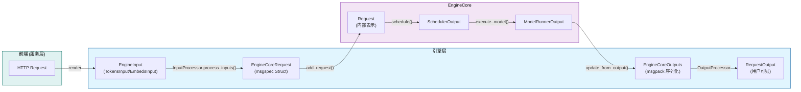

### 1.3 第 3 层：调度核心（v1/core/sched/）

**职责**：决定每个 step 中各请求的 token 数量，管理 KV Cache 分配。

| 组件 | 文件 | 职责 |
|------|------|------|
| **SchedulerInterface** | [interface.py](../vllm/v1/core/sched/interface.py) | 调度器抽象基类，定义 schedule/add_request/update_from_output 等核心方法 |
| **Scheduler** | [scheduler.py](../vllm/v1/core/sched/scheduler.py) | 默认调度器实现，FCFS + 连续 batching |
| **AsyncScheduler** | [async_scheduler.py](../vllm/v1/core/sched/async_scheduler.py) | 异步调度实现，支持 scheduling 与 execution 重叠 |
| **RequestQueue** | [request_queue.py](../vllm/v1/core/sched/request_queue.py) | 优先级队列，支持 priority/arrival_time 排序 |
| **BlockPool** | [block_pool.py](../vllm/v1/core/block_pool.py) | KV Cache 物理块分配器 |
| **KVCacheManager** | [kv_cache_manager.py](../vllm/v1/core/kv_cache_manager.py) | KV Cache 逻辑管理，含 prefix caching |

**关键调度决策流程**：

```python
# 来自 interface.py L52-L75
def schedule(self) -> "SchedulerOutput":
    """Schedule the requests to process in this scheduling step.
    
    The scheduler produces a dictionary of {req_id: num_tokens}
    that specifies how many tokens to process for each request.
    num_tokens can be:
    - prompt token count for new requests (prefill)
    - 1 for auto-regressive decoding
    - somewhere between for chunked prefills / speculative decoding
    """
```

### 1.4 第 4 层：执行器层（v1/executor/）

**职责**：管理分布式 worker 进程，屏蔽单机/多机/Ray 差异。

#### Executor 类层次

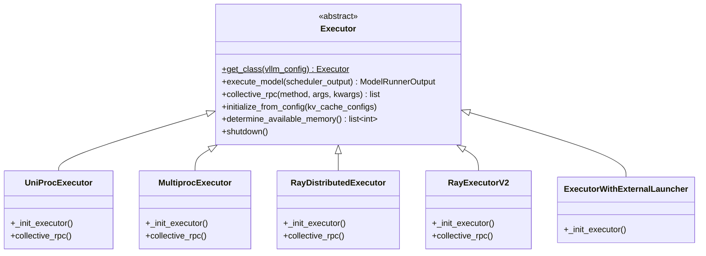

**工厂方法** —— [Executor.get_class()](../vllm/v1/executor/abstract.py#L48-L92) 根据 `distributed_executor_backend` 配置选择具体实现：

```python
# abstract.py L48-L92
@staticmethod
def get_class(vllm_config: VllmConfig) -> type["Executor"]:
    distributed_executor_backend = parallel_config.distributed_executor_backend
    if isinstance(distributed_executor_backend, type):
        executor_class = distributed_executor_backend  # 用户自定义
    elif distributed_executor_backend == "ray":
        executor_class = RayExecutorV2 or RayDistributedExecutor
    elif distributed_executor_backend == "mp":
        executor_class = MultiprocExecutor
    elif distributed_executor_backend == "uni":
        executor_class = UniProcExecutor
    elif distributed_executor_backend == "external_launcher":
        executor_class = ExecutorWithExternalLauncher
    return executor_class
```

### 1.5 第 5 层：模型执行器（model_executor/）

**职责**：加载模型权重、构建计算图、执行前向传播。

| 子模块 | 职责 |
|--------|------|
| **models/** | 150+ 模型架构实现（Llama/Qwen/Gemma/Mistral 等），通过 [registry.py](../vllm/model_executor/models/registry.py) 注册 |
| **models/interfaces.py** | 模型能力接口定义（supports_multimodal / supports_pp / is_attention_free 等） |
| **kernels/** | 自定义 CUDA/Triton kernel 封装 |
| **layers/** | 通用算子层（Linear / Attention / RMSNorm 等） |
| **warmup/** | 模型 warmup 逻辑 |

**Worker 类型**：

| Worker 类 | 用途 | 文件位置 |
|-----------|------|----------|
| `GPUModelRunner` | GPU 上模型执行主逻辑 | [gpu/model_runner.py](../vllm/v1/worker/gpu/model_runner.py) |
| `CPUModelRunner` | CPU 推理 | [cpu_model_runner.py](../vllm/v1/worker/cpu_model_runner.py) |
| `XPUModelRunner` | Intel XPU | [xpu_model_runner.py](../vllm/v1/worker/xpu_model_runner.py) |
| `TPUModelRunner` | Google TPU | [tpu_input_batch.py](../vllm/v1/worker/tpu_input_batch.py) |

### 1.6 第 6 层：内核层（csrc/ + kernels/）

**职责**：高性能 GPU kernel 实现。

| 组件 | 技术 | 用途 |
|------|------|------|
| **FlashAttention** | flash-attn | 高效注意力计算 |
| **FlashInfer** | flashinfer | Paged Attention / 解码优化 |
| **Cutlass MLA** | CUTLASS | DeepSeek MLA 注意力 |
| **Triton Kernels** | Triton | 自定义融合 kernel（attention / rms_norm / silu_mul） |
| **Custom Ops** | C++/CUDA | FP8 量化、AllReduce 融合等 |

---

## 二、v0 → v1 架构演进

### 2.1 演进总览

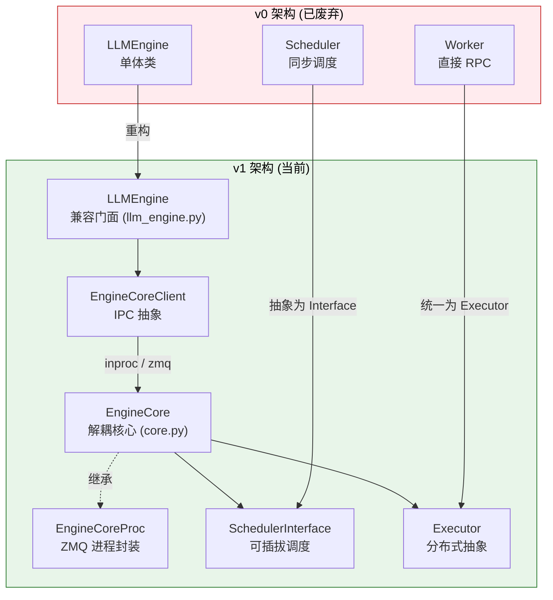

### 2.2 v0 LLMEngine → v1 包装策略

**关键发现**：当前 [vllm/engine/llm_engine.py](../vllm/engine/llm_engine.py) 仅是一个 **重导出别名**：

```python
# vllm/engine/llm_engine.py (全文，仅 6 行)
from vllm.v1.engine.llm_engine import LLMEngine as V1LLMEngine

LLMEngine = V1LLMEngine  # type: ignore
"""The `LLMEngine` class is an alias of vllm.v1.engine.llm_engine.LLMEngine."""
```

这意味着 **v0 版本已被完全移除**，当前代码库中不存在旧的 LLMEngine 实现。所有调用方使用的 `LLMEngine` 实际上都是 v1 版本。

### 2.3 EngineCore 解耦设计

[EngineCore](../vllm/v1/engine/core.py#L91-L229) 是 v1 架构的核心创新，实现了以下解耦：

#### 初始化流程

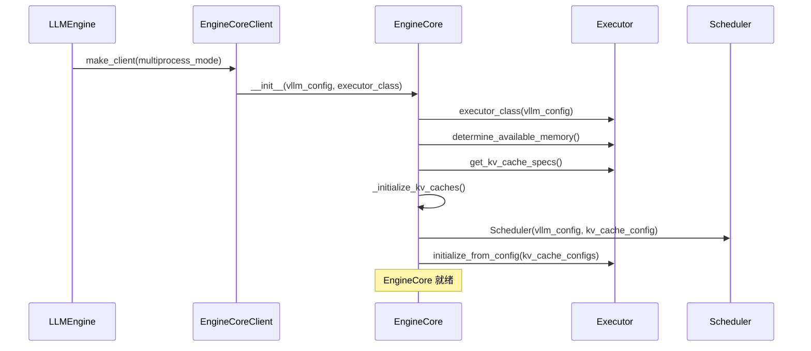

#### 核心步进循环

[EngineCore.step()](../vllm/v1/engine/core.py#L402-L431) 是引擎的心跳：

```python
# core.py L402-L431
def step(self) -> tuple[dict[int, EngineCoreOutputs], bool]:
    """Schedule, execute, and make output.

    Returns tuple of outputs and a flag indicating whether the model
    was executed.
    """
    # 1. 检查是否有待处理请求
    if not self.scheduler.has_requests():
        return {}, False

    # 2. 调度决策：决定每个请求处理多少 token
    scheduler_output = self.scheduler.schedule()

    # 3. 异步执行模型前向传播
    future = self.model_executor.execute_model(scheduler_output, non_block=True)

    # 4. 获取结构化输出的 grammar bitmask
    grammar_output = self.scheduler.get_grammar_bitmask(scheduler_output)

    # 5. 等待模型输出 & 采样
    with self.log_error_detail(scheduler_output), \
         self.log_iteration_details(scheduler_output):
        model_output = future.result()
        if model_output is None:
            model_output = self.model_executor.sample_tokens(grammar_output)

    # 6. 处理异步 abort
    self._process_aborts_queue()

    # 7. 更新调度器状态并生成输出
    engine_core_outputs = self.scheduler.update_from_output(
        scheduler_output, model_output
    )

    return engine_core_outputs, scheduler_output.total_num_scheduled_tokens > 0
```

#### Pipeline Parallelism 优化：batch_queue

当 `max_concurrent_batches > 1` 时（即 PP > 1），EngineCore 使用 [step_with_batch_queue()](../vllm/v1/engine/core.py#L443-L559) 替代 `step()`：

- 使用双端队列 `deque` 缓冲多个 batch
- **优先填满 batch queue**（消除 pipeline bubble）
- 阻塞等待最早完成的 batch 结果
- 支持 deferred sampling（结构化输出 + speculative decoding 场景）

### 2.4 v1 LLMEngine：向后兼容的门面

[v1 LLMEngine](../vllm/v1/engine/llm_engine.py) 作为公共 API 门面，职责包括：

#### 组合模式

```python
# llm_engine.py L90-L111 (精简)
class LLMEngine:
    def __init__(self, vllm_config, executor_class, log_stats, ...):
        # 1. Renderer: 处理 chat template / multimodal inputs
        self.renderer = renderer_from_config(self.vllm_config)

        # 2. InputProcessor: EngineInput → EngineCoreRequest
        self.input_processor = InputProcessor(self.vllm_config, renderer)

        # 3. OutputProcessor: EngineCoreOutputs → RequestOutput
        self.output_processor = OutputProcessor(
            renderer.tokenizer,
            log_stats=self.log_stats,
            stream_interval=...,
        )

        # 4. EngineCoreClient: 通过 IPC 访问 EngineCore
        self.engine_core = EngineCoreClient.make_client(
            multiprocess_mode=multiprocess_mode,
            asyncio_mode=False,
            ...
        )
```

#### add_request 流水线

```python
# llm_engine.py L209-L285 (精简)
def add_request(self, request_id, prompt, params, ...):
    # 1. 输入预处理：EngineInput → EngineCoreRequest
    request = self.input_processor.process_inputs(
        request_id, prompt, params, ...
    )

    # 2. n>1 时 fan-out子请求（beam search）
    if n > 1:
        for idx in range(n):
            child_request = copy(request)
            child_request.sampling_params = child_params
            self.output_processor.add_request(child_request, ...)
            self.engine_core.add_request(child_request)
    else:
        self.output_processor.add_request(request, ...)
        self.engine_core.add_request(request)
```

#### step 流水线

```python
# llm_engine.py L287-L325 (精简)
def step(self) -> list[RequestOutput | PoolingRequestOutput]:
    # 1. 从 EngineCore 获取原始输出
    outputs = self.engine_core.get_output()

    # 2. 后处理：EngineCoreOutputs → RequestOutput
    processed_outputs = self.output_processor.process_outputs(
        outputs.outputs, engine_core_timestamp=outputs.timestamp, ...
    )

    # 3. 中止 stop string 触发的请求
    self.engine_core.abort_requests(processed_outputs.reqs_to_abort)

    # 4. 记录统计信息
    if self.logger_manager is not None:
        self.logger_manager.record(...)

    return processed_outputs.request_outputs
```

### 2.5 v1 核心改进点总结

| 改进维度 | v0 | v1 |
|----------|----|----|
| **核心循环** | 单体 LLMEngine.step() | EngineCore.step() 解耦 |
| **进程模型** | 同步多进程 | 可选 inproc/multiproc/ZMQ |
| **调度器** | 硬编码 Scheduler | SchedulerInterface 可插拔 |
| **执行器** | RayWorkerWrapper 固定 | Executor 抽象 + 工厂方法 |
| **序列表示** | Sequence / SequenceGroup | 简化为 Request（无 group 概念） |
| **数据序列化** | pickle | msgspec Struct（零拷贝友好） |
| **异步调度** | 不支持 | AsyncScheduler（scheduling ∥ execution） |
| **Data Parallel** | 不支持 | DPEngineCoreProc + DP Coordinator |
| **Elastic EP** | 不支持 | 完整扩缩容支持 |

### 2.6 向后兼容策略

虽然 v0 已被移除，但 vLLM 通过以下机制保持 API 兼容性：

1. **模块级别名**：`vllm.engine.llm_engine.LLMEngine` 直接指向 v1 实现
2. **属性透传**：`self.model_executor = self.engine_core.engine_core.model_executor`（v0 兼容访问路径，见 [llm_engine.py:L124](../vllm/v1/engine/llm_engine.py#L124)）
3. **接口签名保留**：`add_request()` / `step()` / `abort_request()` 签名不变

---

## 三、核心数据结构

### 3.1 请求生命周期数据结构

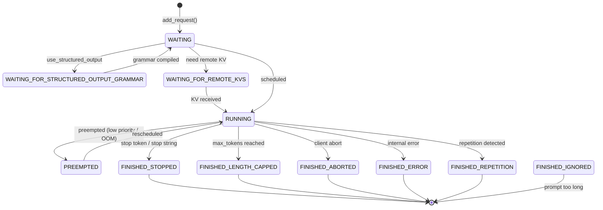

### 3.2 Request（内部请求表示）

来源：[v1/request.py](../vllm/v1/request.py#L59-L308)

```python
# request.py L59-L100 (精简)
class Request:
    def __init__(
        self,
        request_id: str,
        prompt_token_ids: list[int] | None,
        sampling_params: SamplingParams | None,
        pooling_params: PoolingParams | None,
        client_index: int = 0,
        arrival_time: float | None = None,
        prompt_embeds: torch.Tensor | None = None,
        mm_features: list[MultiModalFeatureSpec] | None = None,
        lora_request: LoRARequest | None = None,
        block_hasher: Callable | None = None,
        ...
    ):
        self.request_id = request_id
        self.status = RequestStatus.WAITING          # 初始状态
        self.sampling_params = sampling_params
        self.prompt_token_ids = prompt_token_ids
        self._output_token_ids: list[int] = []       # 生成的 token
        self.num_computed_tokens = 0                  # 已计算 token 数
        self.block_hashes: list[BlockHash] = []       # prefix caching hash
        self.events: list[EngineCoreEvent] = []      # 事件追踪
        self.num_preemptions = 0                      # 被抢占次数
```

**关键字段语义**：

| 字段 | 类型 | 说明 |
|------|------|------|
| `status` | `RequestStatus` | 请求状态机（见上图） |
| `output_token_ids` | `ConstantList[int]` | 只读视图，防止外部直接 append |
| `all_token_ids` | `ConstantList[int]` | 包含 prompt + 所有生成 token |
| `num_output_tokens` | `int` | 当前已生成 token 数 |
| `block_hashes` | `list[BlockHash]` | 每个 full block 的 hash，用于 prefix caching |
| `is_prefill_chunk` | `bool` | 是否处于非最终 prefill chunk |
| `num_nans_in_logits` | `int` | logits 中 NaN 数量（用于检测异常） |
| `streaming_queue` | `deque` | streaming session 续传队列 |

### 3.3 EngineInput → EngineCoreRequest → Request 转换链

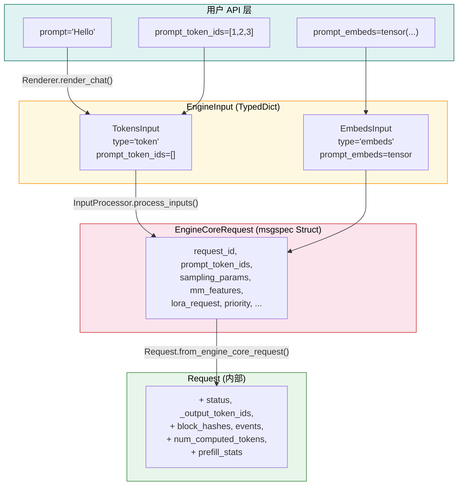

**EngineCoreRequest 定义** ([engine/__init__.py](../vllm/v1/engine/__init__.py#L80-L131))：

```python
# __init__.py L80-L131
class EngineCoreRequest(
    msgspec.Struct,
    array_like=True,
    omit_defaults=True,
    gc=False,           # 禁用 GC 追踪（性能关键）
):
    request_id: str
    prompt_token_ids: list[int] | None
    mm_features: list[MultiModalFeatureSpec] | None
    sampling_params: SamplingParams | None
    pooling_params: PoolingParams | None
    arrival_time: float
    lora_request: LoRARequest | None
    cache_salt: str | None
    data_parallel_rank: int | None
    prompt_embeds: torch.Tensor | None = None
    prompt_is_token_ids: list[bool] | None = None
    client_index: int = 0
    current_wave: int = 0
    priority: int = 0
    trace_headers: Mapping[str, str] | None = None
    resumable: bool = False
    external_req_id: str | None = None
    reasoning_ended: bool | None = None
    reasoning_parser_kwargs: dict[str, Any] | None = None
```

**转换函数** ([request.py L186-L209](../vllm/v1/request.py#L186-L209))：

```python
@classmethod
def from_engine_core_request(cls, request: EngineCoreRequest, block_hasher) -> "Request":
    return cls(
        request_id=request.request_id,
        client_index=request.client_index,
        prompt_token_ids=request.prompt_token_ids,
        prompt_embeds=request.prompt_embeds,
        mm_features=request.mm_features,
        sampling_params=request.sampling_params,
        pooling_params=request.pooling_params,
        arrival_time=request.arrival_time,
        lora_request=request.lora_request,
        block_hasher=block_hasher,
        resumable=request.resumable,
        ...
    )
```

### 3.4 输出数据结构体系

来源：[v1/outputs.py](../vllm/v1/outputs.py)

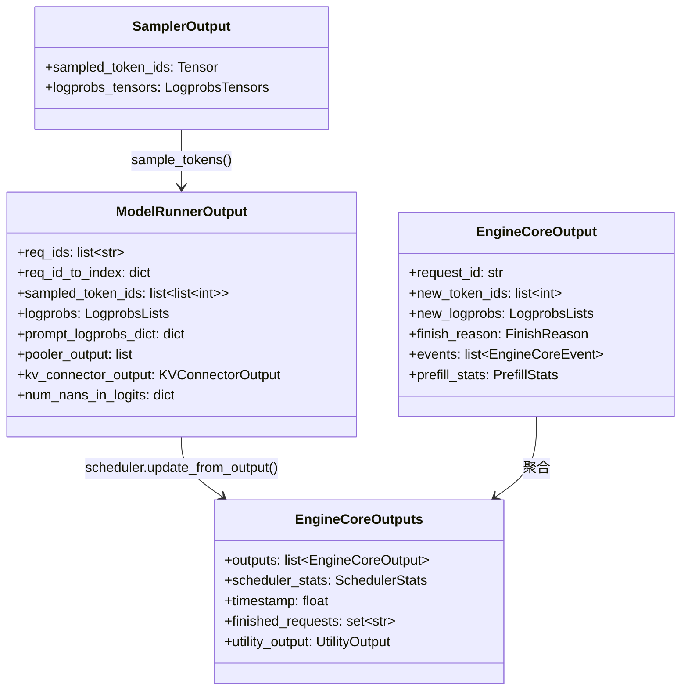

**关键数据结构详解**：

**SamplerOutput** ([outputs.py L118-L124](../vllm/v1/outputs.py#L118-L124))：
```python
@dataclass
class SamplerOutput:
    sampled_token_ids: torch.Tensor     # [num_reqs, max_num_generated_tokens]
    logprobs_tensors: LogprobsTensors | None  # logprob 信息
```

**ModelRunnerOutput** ([outputs.py L166-L206](../vllm/v1/outputs.py#L166-L206))：
```python
@dataclass
class ModelRunnerOutput:
    req_ids: list[str]                    # 请求 ID 列表
    req_id_to_index: dict[str, int]       # ID → 索引映射
    sampled_token_ids: list[list[int]]     # 每个请求生成的 token IDs
    logprobs: LogprobsLists | None         # log probability
    prompt_logprobs_dict: dict             # prompt 阶段 logprob
    pooler_output: list[Tensor | None]     # pooling 模型输出
    kv_connector_output: KVConnectorOutput | None  # KV transfer 信息
    num_nans_in_logits: dict | None        # NaN 检测
```

**EngineCoreOutput** ([engine/__init__.py L161-L191](../vllm/v1/engine/__init__.py#L161-L191))：
```python
class EngineCoreOutput(msgspec.Struct, array_like=True, omit_defaults=True, gc=False):
    request_id: str
    new_token_ids: list[int]
    new_logprobs: LogprobsLists | None
    finish_reason: FinishReason | None   # STOP/LENGTH/ABORT/ERROR/REPETITION
    events: list[EngineCoreEvent] | None
    prefill_stats: PrefillStats | None
```

### 3.5 FinishReason 状态机

```python
# engine/__init__.py L42-L64
class FinishReason(enum.IntEnum):
    STOP = 0        # stop string / stop token emitted
    LENGTH = 1      # max_tokens consumed or max_model_len reached
    ABORT = 2       # aborted by client
    ERROR = 3       # retryable internal error (→ 500)
    REPETITION = 4  # repetitive pattern (hallucination)
```

---

## 四、设计原则

### 4.1 配置驱动（Configuration-Driven）

vLLM 通过 **28+ 配置模块** 驱动全部行为，核心配置聚合在 [VllmConfig](../vllm/config/vllm.py)：

```mermaid
graph TB
    VC["VllmConfig<br/>聚合根"] --> MC["ModelConfig<br/>模型配置"]
    VC --> CC["CacheConfig<br/>KV Cache 配置"]
    VC --> PC["ParallelConfig<br/>并行配置"]
    VC --> SC["SchedulerConfig<br/>调度配置"]
    VC --> DC["DeviceConfig<br/>设备配置"]
    VC --> LC["LoadConfig<br/>加载配置"]
    VC --> AC["AttentionConfig<br/>注意力配置"]
    VC --> KC["KernelConfig<br/>Kernel 配置"]
    VC --> CoC["CompilationConfig<br/>编译配置"]
    VC --> SpC["SpeculativeConfig<br/>推测解码配置"]
    VC --> OC["ObservabilityConfig<br/>可观测性"]
    VC --> QCfg["QuantizationConfig<br/>量化配置"]
    VC --> RC["ReasoningConfig<br/>推理配置"]
    VC --> SOC["StructuredOutputsConfig<br/>结构化输出"]
    VC --> KvTC["KVTransferConfig<br/>KV Transfer"]
    VC --> LCfg["LoRAConfig<br/>LoRA 配置"]
    VC --> OffCfg["OffloadConfig<br/>Offload 配置"]
    VC --> PrCfg["ProfilerConfig<br/>Profiler"]
    VC --> MamCfg["MambaConfig<br/>Mamba 配置"]
    VC --> MMCfg["MultimodalConfig<br/>多模态配置"]

    style VC fill:#e1f5fe,stroke:#01579b,color:#000,stroke-width:2px
    style MC fill:#e8f5e9,stroke:#2e7d32,color:#000
    style CC fill:#e8f5e9,stroke:#2e7d32,color:#000
    style PC fill:#e8f5e9,stroke:#2e7d32,color:#000
    style SC fill:#e8f5e9,stroke:#2e7d32,color:#000
    style DC fill:#e8f5e9,stroke:#2e7d32,color:#000
    style LC fill:#e8f5e9,stroke:#2e7d32,color:#000
    style AC fill:#e8f5e9,stroke:#2e7d32,color:#000
    style KC fill:#e8f5e9,stroke:#2e7d32,color:#000
    style CoC fill:#e8f5e9,stroke:#2e7d32,color:#000
    style SpC fill:#e8f5e9,stroke:#2e7d32,color:#000
    style OC fill:#e8f5e9,stroke:#2e7d32,color:#000
    style QCfg fill:#e8f5e9,stroke:#2e7d32,color:#000
    style RC fill:#e8f5e9,stroke:#2e7d32,color:#000
    style SOC fill:#e8f5e9,stroke:#2e7d32,color:#000
    style KvTC fill:#e8f5e9,stroke:#2e7d32,color:#000
    style LCfg fill:#e8f5e9,stroke:#2e7d32,color:#000
    style OffCfg fill:#e8f5e9,stroke:#2e7d32,color:#000
    style PrCfg fill:#e8f5e9,stroke:#2e7d32,color:#000
    style MamCfg fill:#e8f5e9,stroke:#2e7d32,color:#000
    style MMCfg fill:#e8f5e9,stroke:#2e7d32,color:#000
```

**VllmConfig.__post_init__()** ([vllm.py L758-L1401](../vllm/config/vllm.py#L758-L1401)) 在初始化时执行大量交叉验证和默认值推导：

- 优化级别应用（O0/O1/O2/O3）
- async scheduling 自动启用判断
- cudagraph capture sizes 计算
- SP (Sequence Parallelism) 阈值推导
- platform-specific defaults 应用
- KV transfer 兼容性检查

**优化级别系统**：

```python
# vllm.py L68-L265
class OptimizationLevel(IntEnum):
    O0 = 0   # 无优化，最快启动
    O1 = 1   # Dynamo+Inductor + Piecewise CUDAGraph
    O2 = 2   # Full + Piecewise CUDAGraph（默认）
    O3 = 3   # O2 + FlashInfer autotune
```

### 4.2 注册表模式（Registry Pattern）

#### 模型注册表

[model_executor/models/registry.py](../vllm/model_executor/models/registry.py) 维护了 **150+ 模型架构**的注册表：

```python
# registry.py L70-L221 (精简)
_TEXT_GENERATION_MODELS = {
    "LlamaForCausalLM": ("llama", "LlamaForCausalLM"),
    "Qwen3ForCausalLM": ("qwen3", "Qwen3ForCausalLM"),
    "DeepseekV3ForCausalLM": ("deepseek_v2", "DeepseekV3ForCausalLM"),
    "Gemma4ForCausalLM": ("gemma4", "Gemma4ForCausalLM"),
    # ... 共 200+ 条目
}

_EMBEDDING_MODELS = { ... }       # Embedding 模型
_MULTIMODAL_MODELS = { ... }      # 多模态模型
_SPECULATIVE_DECODING_MODELS = {...}  # 推测解码模型

_VLLM_MODELS = {
    **_TEXT_GENERATION_MODELS,
    **_EMBEDDING_MODELS,
    **_MULTIMODAL_MODELS,
    **_SPECULATIVE_DECODING_MODELS,
    ...
}

ModelRegistry = _ModelRegistry({
    model_arch: _LazyRegisteredModel(   # 懒加载！避免 import 时初始化 CUDA
        module_name=f"vllm.model_executor.models.{mod_relname}",
        class_name=cls_name,
    )
    for model_arch, (mod_relname, cls_name) in _VLLM_MODELS.items()
})
```

**关键设计**：使用 `_LazyRegisteredModel` 实现延迟导入，避免在非 GPU 进程中初始化 CUDA context。

#### 多模态处理器注册表

[multimodal/registry.py](../vllm/multimodal/registry.py) 使用装饰器模式注册处理器：

```python
# registry.py L142-L174 (精简)
class MultiModalRegistry:
    def register_processor(
        self,
        processor: MultiModalFactory[_I],
        *,
        info: ProcessingInfoFactory[_I],
        dummy_inputs: DummyInputsBuilderFactory[_I],
    ):
        def wrapper(model_cls: N) -> N:
            model_cls._processor_factory = _ProcessorFactories(
                info=info, dummy_inputs=dummy_inputs, processor=processor,
            )
            return model_cls
        return wrapper

# 使用示例（在模型文件中）：
# @MULTIMODAL_REGISTRY.register_processor(MyProcessor.factory, ...)
# class MyModel(nn.Module): ...
```

### 4.3 策略模式（Strategy Pattern）

#### 注意力后端选择器

[v1/attention/selector.py](../vllm/v1/attention/selector.py) 根据运行时参数选择最优注意力后端：

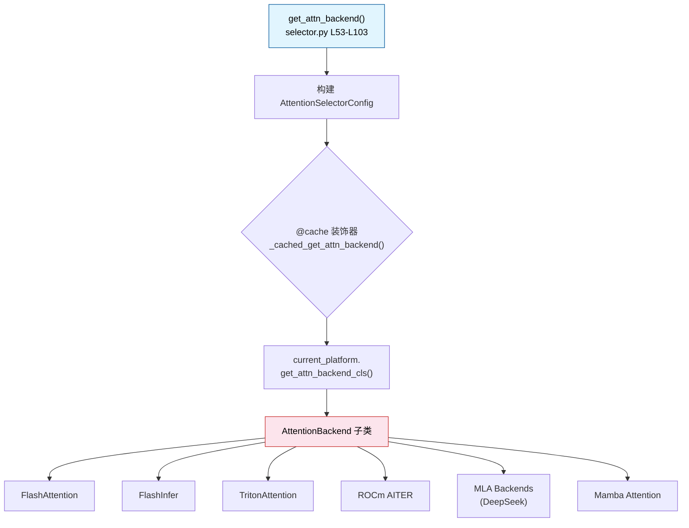

**选择参数空间** ([selector.py L22-L50](../vllm/v1/attention/selector.py#L22-L50))：

```python
class AttentionSelectorConfig(NamedTuple):
    head_size: int
    dtype: torch.dtype
    kv_cache_dtype: CacheDType | None
    block_size: int | None
    use_mla: bool = False              # DeepSeek MLA
    has_sink: bool = False              # Sink attention
    use_sparse: bool = False            # Sparse attention
    use_mm_prefix: bool = False         # Multimodal prefix
    use_per_head_quant_scales: bool = False
    attn_type: str = AttentionType.DECODER
    use_non_causal: bool = False
    use_batch_invariant: bool = False   # Batch invariant mode
```

#### 量化后端选择

量化配置通过 [QuantizationConfig](../vllm/config/quantization.py) 及其子类驱动不同量化后端的选择：
- **FP8**: `Fp8Config` → `Fp8Linear`
- **GPTQ**: `GptqConfig` → `GptqMarlinLinear`
- **AWQ**: `AwqConfig` → `AwqLinear`
- **NVFP4**: `Nvfp4Config` → `Nvfp4Linear`

### 4.4 工厂模式（Factory Pattern）

#### Executor 工厂

如 [4.1 节](#41-执行器层v1executor-) 所述，`Executor.get_class()` 是经典的工厂方法：

```python
# abstract.py L48-L92
@staticmethod
def get_class(vllm_config: VllmConfig) -> type["Executor"]:
    backend = parallel_config.distributed_executor_backend
    match backend:
        case "ray": return RayExecutorV2 or RayDistributedExecutor
        case "mp": return MultiprocExecutor
        case "uni": return UniProcExecutor
        case "external_launcher": return ExecutorWithExternalLauncher
        case type(): return backend  # 用户自定义子类
        case str(): return resolve_obj_by_qualname(backend)  # 按限定名加载
```

#### EngineCoreClient 工厂

[core_client.py](../vllm/v1/engine/core_client.py) 中的 `make_client()` 根据 `multiprocess_mode` 和 `asyncio_mode` 创建不同的客户端实现：

- **inproc 模式**：直接持有 EngineCore 引用
- **multiproc 模式**：通过 ZMQ socket 与 EngineCoreProc 通信
- **asyncio 模式**：异步版本客户端

#### KV Cache Offload 工厂

[kv_offload/factory.py](../vllm/v1/kv_offload/factory.py) 根据 `kv_transfer_config.kv_connector` 选择不同的 KV offload 后端：
- `"OffloadingConnector"`: CPU offloading
- `"LMCacheConnectorV1"`: LMCache 集成
- NIXL Connector: RDMA-based transfer

### 4.5 其他重要设计模式

| 模式 | 应用场景 | 位置 |
|------|----------|------|
| **观察者模式** | 统计日志 / metrics 收集 | [metrics/](../vllm/v1/metrics/) |
| **适配器模式** | 不同平台（CUDA/ROCm/XPU/TPU）差异 | [platforms/](../vllm/platforms/) |
| **装饰器模式** | 编译 pass 注入 / tracing | [compilation/](../vllm/compilation/) |
| **原型模式** | Dummy input 构建 | [multimodal/processing/](../vllm/multimodal/processing/) |
| **命令模式** | Utility method 远程调用 | [EngineCoreProc._handle_client_request()](../vllm/v1/engine/core.py#L1266-L1299) |

---

## 五、关键交互时序

### 5.1 完整推理请求生命周期

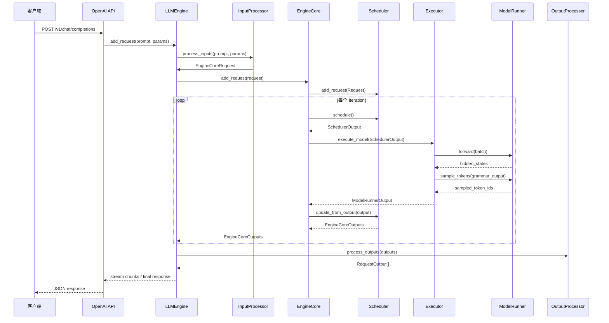

### 5.2 多进程架构下的 IPC 流程

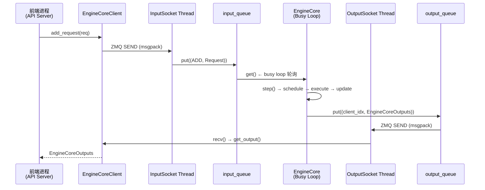

---

## 六、目录导航速查

| 目录 | 层次 | 核心文件 | 一句话说明 |
|------|------|----------|------------|
| `entrypoints/` | L1 | `openai/api_server.py` | HTTP API 入口 |
| `engine/` | L2 | `llm_engine.py` | 别名重导出到 v1 |
| `v1/engine/` | L2 | `llm_engine.py`, `core.py` | 引擎门面 + 核心循环 |
| `v1/core/sched/` | L3 | `scheduler.py`, `interface.py` | 调度算法 |
| `v1/executor/` | L4 | `abstract.py`, `uniproc_executor.py` | 分布式执行 |
| `v1/worker/` | L4-L5 | `gpu/model_runner.py`, `worker_base.py` | Worker 抽象与 GPU 执行 |
| `model_executor/` | L5 | `models/registry.py`, `models/llama.py` | 模型加载与执行 |
| `v1/attention/` | L5-L6 | `selector.py`, `backends/` | 注意力后端选择 |
| `kernels/` | L6 | `vllm_c.py` | Custom ops 入口 |
| `config/` | 横切 | `vllm.py` | 全局配置聚合 |
| `multimodal/` | 横切 | `registry.py` | 多模态处理器注册 |
| `distributed/` | 横切 | `parallel_state.py` | 分布式通信原语 |

---

## 七、扩展阅读指引

阅读完本文档后，建议按以下顺序深入源码：

1. **[EngineCore.step()](../vllm/v1/engine/core.py#L402-L431)** — 理解单步执行的完整流程
2. **[Scheduler.schedule()](../vllm/v1/core/sched/scheduler.py)** — 理解调度算法细节（chunked prefill / continuous batching / preempt）
3. **[GPUModelRunner.execute_model()](../vllm/v1/worker/gpu/model_runner.py)** — 理解模型前向传播的完整链路
4. **[InputProcessor.process_inputs()](../vllm/v1/engine/input_processor.py)** — 理解从 HTTP request 到 EngineCoreRequest 的完整转换
5. **[AttentionSelectorConfig](../vllm/v1/attention/selector.py)** — 理解注意力后端的策略选择机制
