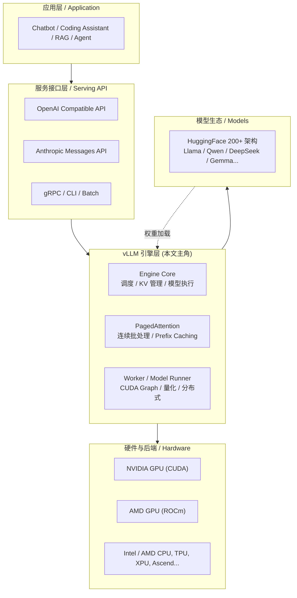
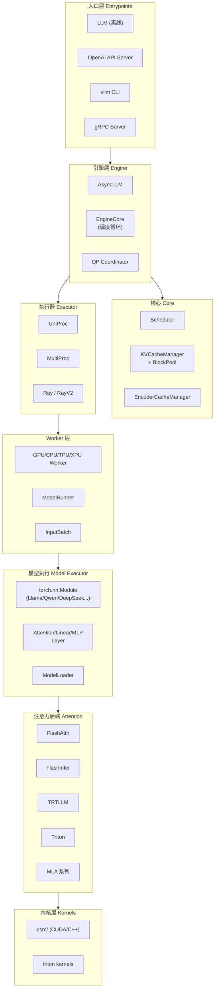
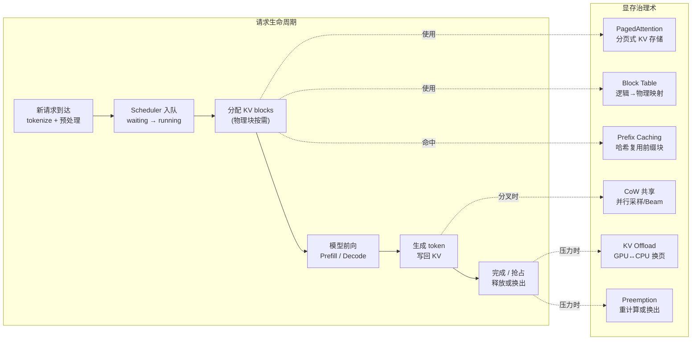
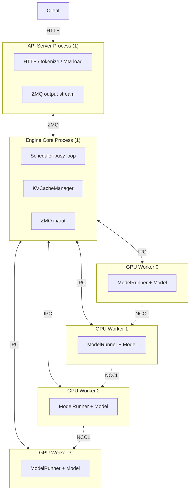
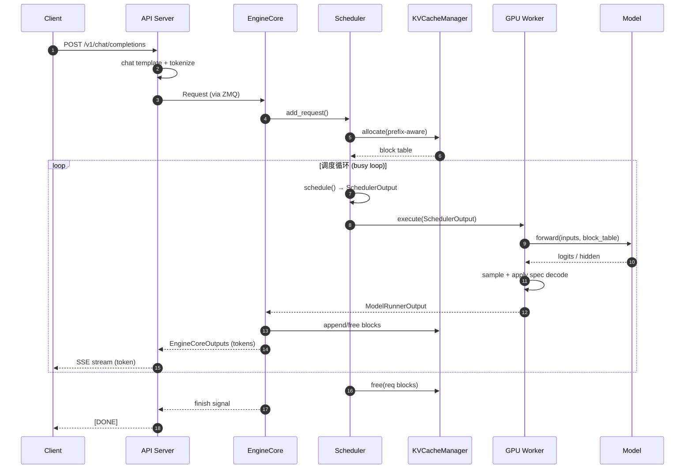
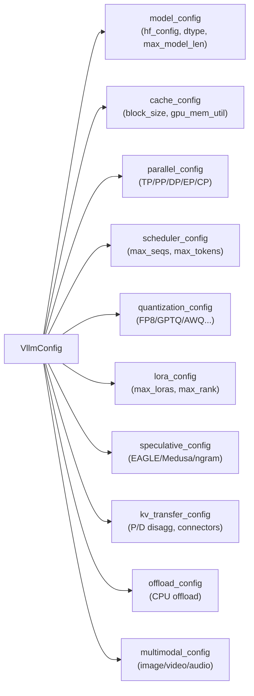

# vLLM 深度解析 · 第一篇：从生态定位到整体架构的全景总观

> **写作维度**：本文承担"总观"之职，从 vLLM 的生态定位出发，层层下沉到代码结构、设计理念、原理骨架与端到端流程，力求让读者在读完之后，对 vLLM 是什么、为什么这样设计、如何运转起来，形成一个完整而立体的"整体观"。
>
> **行文风格**：总—分—总，层层递进。先立全局之"总"，再分模块之"细"，最后收束为可记忆的整体图景。
>
> **配套关系**：本文是三篇系列的开篇。第二篇《具体观》聚焦算法与论文原理；第三篇《深刻观》升华设计哲学与算法框架。

---

## 一、总起：vLLM 在 LLM 推理生态中的坐标

### 1.1 一句话定位

**vLLM 是一个高吞吐、低内存浪费、易扩展的大语言模型（LLM）推理与服务引擎。**

它把"操作系统里的虚拟内存分页思想"搬进了注意力计算，用一个叫做 **PagedAttention** 的算法，把 KV Cache 的内存浪费从 60%–80% 压到不足 4%，从而在同等的 GPU 显存下，把可并发处理的请求数提升 2–4 倍。这一奠基性工作发表在 SOSP 2023（论文 *Efficient Memory Management for Large Language Model Serving with PagedAttention*, Kwon et al., 2023）。

### 1.2 生态定位：它处在 LLM 应用栈的哪一层？

为了让读者一眼看清 vLLM 的生态坐标，下面这张图把 LLM 应用栈自上而下地铺开，并标出 vLLM 守护的关键层。



**图 1.1 说明**：vLLM 处于"服务接口层"与"硬件后端"之间的关键夹层。它向上承接 OpenAI 兼容等标准协议，向下屏蔽多硬件差异，并向横向的 HuggingFace 模型生态提供统一接入点。这种"中间件式"定位，决定了它的设计必须同时回答三个问题：**接口标准化、内存高效化、硬件普适化**。

### 1.3 核心价值主张（来自 README）

根据 [README.md](file:///workspace/README.md) 的官方描述，vLLM 的核心能力可凝练为：

- **PagedAttention**：类 OS 分页的 KV Cache 内存管理（[设计文档](file:///workspace/docs/design/paged_attention.md)）。
- **Continuous Batching**：连续批处理，支持 chunked prefill 与 prefix caching。
- **高性能执行**：CUDA/HIP Graphs、`torch.compile`、piecewise 静态图。
- **广泛模型支持**：200+ HuggingFace 架构，覆盖 Dense / MoE / Hybrid SSM / 多模态 / Embedding / Reward。
- **多硬件支持**：NVIDIA / AMD / CPU / TPU / XPU / Ascend / Apple Silicon 等。
- **量化支持**：FP8 / MXFP8 / MXFP4 / NVFP4 / INT8 / INT4 / GPTQ / AWQ / GGUF / compressed-tensors 等。
- **投机解码**：n-gram、suffix、EAGLE、DFlash。
- **分布式**：Tensor / Pipeline / Data / Expert / Context Parallelism。
- **分离式部署**：Prefill / Decode / Encode 解耦。

这些能力并非简单堆叠，而是围绕一条主线——**"把稀缺的 GPU 显存用到极致"**——彼此咬合。下文将顺着这条主线，把整体架构拆开来看。

---

## 二、分述一：代码结构的全景地图

### 2.1 顶层目录与职责

vLLM 的源码组织非常清晰地反映了它的分层架构。下表把顶层目录与职责一一对应：

| 目录 | 职责 | 关键文件 |
| --- | --- | --- |
| `vllm/entrypoints/` | 服务入口：OpenAI API、gRPC、CLI、离线 `LLM` 类 | [llm.py](file:///workspace/vllm/entrypoints/llm.py), [api_server.py](file:///workspace/vllm/entrypoints/api_server.py) |
| `vllm/engine/` | 引擎抽象层（v1 别名包装） | [llm_engine.py](file:///workspace/vllm/engine/llm_engine.py) |
| `vllm/v1/engine/` | V1 引擎核心：AsyncLLM、EngineCore、协调器 | [core.py](file:///workspace/vllm/v1/engine/core.py), [async_llm.py](file:///workspace/vllm/v1/engine/async_llm.py) |
| `vllm/v1/core/` | 调度器与 KV Cache 管理器 | [scheduler.py](file:///workspace/vllm/v1/core/sched/scheduler.py), [kv_cache_manager.py](file:///workspace/vllm/v1/core/kv_cache_manager.py) |
| `vllm/v1/worker/` | Worker 与 ModelRunner（GPU/CPU/TPU/XPU） | [gpu_worker.py](file:///workspace/vllm/v1/worker/gpu_worker.py), [gpu_model_runner.py](file:///workspace/vllm/v1/worker/gpu_model_runner.py) |
| `vllm/model_executor/` | 模型实现、层、加载器 | [models/](file:///workspace/vllm/model_executor/models/), [layers/](file:///workspace/vllm/model_executor/layers/) |
| `vllm/v1/attention/` | 注意力后端与算子（FlashAttn/FlashInfer/TRTLLM/Triton/MLA...） | [backends/](file:///workspace/vllm/v1/attention/backends/) |
| `vllm/attention/` | 旧版注意力接口（向后兼容） | — |
| `vllm/config/` | 全局配置体系 `VllmConfig` 及各子配置 | [vllm.py](file:///workspace/vllm/config/vllm.py) |
| `vllm/distributed/` | 分布式通信、KV 迁移、EP 重平衡 | [parallel_state.py](file:///workspace/vllm/distributed/parallel_state.py) |
| `vllm/lora/` | 多 LoRA 支持（Dense + MoE） | [lora_model.py](file:///workspace/vllm/lora/lora_model.py) |
| `vllm/multimodal/` | 多模态输入处理与注册表 | [registry.py](file:///workspace/vllm/multimodal/registry.py) |
| `vllm/v1/spec_decode/` | 投机解码：EAGLE/Medusa/n-gram/suffix/DFlash | [eagle.py](file:///workspace/vllm/v1/spec_decode/eagle.py) |
| `vllm/v1/structured_output/` | 结构化输出：xgrammar/outlines/guidance | [backend_xgrammar.py](file:///workspace/vllm/v1/structured_output/backend_xgrammar.py) |
| `vllm/v1/kv_offload/` | KV Cache 卸载到 CPU（LRU/ARC 策略） | [manager.py](file:///workspace/vllm/v1/kv_offload/cpu/manager.py) |
| `vllm/platforms/` | 硬件平台抽象（CUDA/ROCm/CPU/TPU/XPU） | [interface.py](file:///workspace/vllm/platforms/interface.py) |
| `vllm/compilation/` | `torch.compile` 集成、CUDA Graph、piecewise 后端 | [cuda_graph.py](file:///workspace/vllm/compilation/cuda_graph.py) |
| `csrc/` | C++/CUDA 内核源码 | [cache_kernels.cu](file:///workspace/csrc/cache_kernels.cu), [attention/](file:///workspace/csrc/attention/) |
| `docs/` | 设计文档与用户文档 | [design/](file:///workspace/docs/design/) |

### 2.2 结构图谱可视化

下面这张 Mermaid 图把 vLLM 的核心源码模块按"调用层次"绘制出来，便于一眼把握依赖方向。



**图 2.2 说明**：箭头方向即"上层调用下层"的方向。注意三点：① 入口层（`LLM` / OpenAI API / CLI / gRPC）都汇聚到同一个 V1 引擎；② EngineCore 是调度循环的宿主，它持有 Scheduler 与 KVCacheManager；③ ModelRunner 是模型执行的"翻译官"，把调度器输出的逻辑请求翻译成 GPU 上的张量与 kernel 调用。

### 2.3 V0 → V1 的架构演进

vLLM 正经历一次重要的架构升级。从代码可清晰看到：

- [vllm/engine/llm_engine.py](file:///workspace/vllm/engine/llm_engine.py) 现在是 V1 的别名包装：
  ```python
  from vllm.v1.engine.llm_engine import LLMEngine as V1LLMEngine
  LLMEngine = V1LLMEngine  # type: ignore
  ```
- [vllm/engine/async_llm_engine.py](file:///workspace/vllm/engine/async_llm_engine.py) 同样是 V1 的包装：
  ```python
  from vllm.v1.engine.async_llm import AsyncLLM
  AsyncLLMEngine = AsyncLLM  # type: ignore
  ```

这意味着 V1 已成为默认引擎。V1 相对 V0 的核心改进是**多进程架构**：把 API 服务器、EngineCore、GPU Worker 拆成独立进程，用 ZMQ 通信，从而让 CPU 调度与 GPU 计算真正解耦，避免 GIL 互锁造成的吞吐损失。

---

## 三、分述二：设计理念与原理骨架

### 3.1 三大设计理念

通读 [arch_overview.md](file:///workspace/docs/design/arch_overview.md) 与源码后，可提炼出 vLLM 的三大设计理念：

#### 理念一：把"显存"当一等公民

LLM 推理的瓶颈不是算力，而是显存带宽与显存容量。vLLM 的所有核心机制——PagedAttention、Continuous Batching、Prefix Caching、KV Offload——本质上都是"显存治理术"。

#### 理念二：用"操作系统思维"治理 GPU

vLLM 最深刻的借鉴来自 OS：

- **分页（Paging）** → PagedAttention 把 KV Cache 切成固定大小的 block，用 block table 做"逻辑块→物理块"映射。
- **写时复制（Copy-on-Write）** → 并行采样、beam search 时，多个序列共享前缀的物理块，只在分叉时复制。
- **调度（Scheduling）** → Scheduler 像 OS 调度器一样决定"哪些请求下一拍跑、哪些被抢占"。
- **换页（Swapping）** → KV Offload 把冷 KV Cache 换出到 CPU 内存，必要时再换回。

#### 理念三：统一配置、统一接口、统一构造

为了让 200+ 模型能被同一套引擎驱动，vLLM 强制所有模型的构造签名统一为：

```python
def __init__(self, *, vllm_config: VllmConfig, prefix: str = ""):
    ...
```

`VllmConfig` 是一个"引擎级全局状态"，所有类（Engine → Worker → ModelRunner → Model）都接收它。这样做的代价是单元测试稍麻烦，但收益巨大：新增功能只需在 `VllmConfig` 里加字段，全栈自动可见；权重分片与量化可以在初始化时完成，避免"先加载完整权重再分片"的显存爆炸。

### 3.2 原理骨架：KV Cache 是如何被治理的

下文用一张图概括 vLLM 治理 KV Cache 的完整原理骨架，作为后续两篇文档的"地图索引"。



**图 3.2 说明**：横向是请求的六阶段生命周期；纵向是 vLLM 应用于 KV Cache 的六种治理手段。每个阶段都对应一种或多种治理术。读者可以记住这张图，它将在第二篇被逐一拆解。

### 3.3 多进程架构：V1 的关键跃迁

V1 引擎的多进程架构是理解 vLLM 现代形态的钥匙。根据 [arch_overview.md](file:///workspace/docs/design/arch_overview.md)，关键进程如下：

| 进程类型 | 数量 | 职责 |
| --- | --- | --- |
| API Server | `A`（默认 `=DP`） | 处理 HTTP 请求、tokenize、多模态加载、流式回传 |
| Engine Core | `DP`（默认 1） | 调度器、KV Cache 管理、协调 Worker |
| GPU Worker | `N = DP×PP×TP` | 每 GPU 一个进程，加载权重、执行前向 |
| DP Coordinator | 1（仅 `DP>1`） | 跨 DP rank 负载均衡、MoE 同步 |

下图展示典型的 `vllm serve -tp=4` 单节点部署的进程拓扑：



**图 3.3 说明**：单节点 4 卡部署共 6 个进程（1 API + 1 EngineCore + 4 Worker）。API Server 与 EngineCore 之间用 ZMQ 双向通信；EngineCore 与 Worker 之间用 IPC（共享内存 + pipe）；Worker 之间用 NCCL 做 tensor-parallel 通信。这种解耦让 CPU 端的调度循环不会被 GPU 端的 GIL 阻塞，是 V1 性能跃迁的关键。

---

## 四、分述三：端到端执行流程

### 4.1 一次请求的完整旅程

把上面所有部件串起来，看一个请求从 HTTP 进入到 token 流出的全过程：



**图 4.1 说明**：这是 vLLM V1 一次在线请求的核心时序。注意几个关键点：① tokenize 在 API Server 进程完成，不阻塞 EngineCore；② 调度是一个 busy loop，每一步都会重新决策"谁进 batch"；③ token 生成是流式的，每个 step 都会向客户端推送；④ KV Cache 的分配/释放与模型前向紧密耦合。

### 4.2 离线推理：更简单的入口

对于不需要 HTTP 服务的场景，vLLM 提供了 `LLM` 类作为离线入口。它的本质是把 API Server 与 EngineCore 合并到同一进程内，调用更直接：

```python
from vllm import LLM, SamplingParams

prompts = [
    "Hello, my name is",
    "The capital of France is",
    "The largest ocean is",
]
sampling_params = SamplingParams(temperature=0.8, top_p=0.95)
llm = LLM(model="facebook/opt-125m")
outputs = llm.generate(prompts, sampling_params)
for output in outputs:
    print(output.outputs[0].text)
```

这段代码来自 [arch_overview.md](file:///workspace/docs/design/arch_overview.md) 的示例，是最快速的"上手"路径。

---

## 五、分述四：配置体系与扩展点

### 5.1 VllmConfig：全局状态的"中枢神经"

`VllmConfig` 是 vLLM 的"引擎级全局状态"。它的字段覆盖了模型、缓存、并行、调度、量化、LoRA、投机解码等所有方面。下面是一张配置与子系统对应图：



**图 5.1 说明**：所有子系统都从同一个 `VllmConfig` 取自己关心的字段。新增功能只需加字段，无需修改构造链路。这是 vLLM 能在 LLM 飞速演进中保持代码可控的核心原因。

### 5.2 三大扩展点

vLLM 的可扩展性主要体现在三处：

1. **模型注册**：在 [vllm/model_executor/models/registry.py](file:///workspace/vllm/model_executor/models/registry.py) 注册新架构，即可被 `LLM(model=...)` 自动识别。
2. **注意力后端**：在 [vllm/v1/attention/backends/registry.py](file:///workspace/vllm/v1/attention/backends/registry.py) 注册新后端（如自研 kernel）。
3. **插件系统**：通过 [vllm/plugins/](file:///workspace/vllm/plugins/) 注入自定义 platform / scheduler / KV connector / IO processor。

---

## 六、总收：三句话记住 vLLM 的整体观

把全文压成三句话，作为读者带走的"整体观"：

1. **定位之总**：vLLM 是 LLM 推理与服务生态的"中间件式守门员"——上承 OpenAI 等标准协议，下屏蔽多硬件差异，横向统一 200+ 模型，纵向贯穿 API → 调度 → 执行 → 内核。
2. **结构之总**：它的代码用"分层 + 多进程"组织——V1 把 API Server / EngineCore / GPU Worker 拆成独立进程，靠 ZMQ 与 IPC 解耦，让 CPU 调度与 GPU 计算并行不悖。
3. **理念之总**：它把"显存"当一等公民，用"操作系统思维"治理 GPU——分页、写时复制、调度、换页四件套，全部为"把稀缺显存用到极致"服务。

---

## 七、使用指南与案例

### 7.1 安装

按 [AGENTS.md](file:///workspace/AGENTS.md) 的规范，开发环境用 `uv`：

```bash
curl -LsSf https://astral.sh/uv/install.sh | sh
uv venv --python 3.12
source .venv/bin/activate
VLLM_USE_PRECOMPILED=1 uv pip install -e . --torch-backend=auto
```

普通用户安装：

```bash
uv pip install vllm
```

### 7.2 案例 1：OpenAI 兼容服务（在线）

```bash
vllm serve Qwen/Qwen2.5-7B-Instruct \
    --tensor-parallel-size 2 \
    --max-model-len 32768 \
    --enable-prefix-caching
```

然后即可用任何 OpenAI SDK 调用：

```python
from openai import OpenAI
client = OpenAI(base_url="http://localhost:8000/v1", api_key="EMPTY")
resp = client.chat.completions.create(
    model="Qwen/Qwen2.5-7B-Instruct",
    messages=[{"role": "user", "content": "用一句话解释 PagedAttention"}],
)
print(resp.choices[0].message.content)
```

### 7.3 案例 2：离线批量推理

```python
from vllm import LLM, SamplingParams

llm = LLM(model="Qwen/Qwen2.5-7B-Instruct", tensor_parallel_size=1)
sp = SamplingParams(temperature=0.0, max_tokens=128)
outs = llm.generate(["写一首关于秋天的诗", "解释量子纠缠"], sp)
for o in outs:
    print(o.outputs[0].text)
```

### 7.4 案例 3：开启投机解码（EAGLE）

```bash
vllm serve meta-llama/Llama-3.1-8B-Instruct \
    --speculative-model "[eagle]" \
    --num-speculative-tokens 5 \
    --use-v2-block-manager
```

### 7.5 案例 4：多模态推理

```python
from vllm import LLM, SamplingParams
llm = LLM(model="Qwen/Qwen2-VL-7B-Instruct")
sp = SamplingParams(temperature=0.0, max_tokens=512)
from vllm.multimodal import MultiModalDataDict
# 详细多模态输入构造见 docs/features/multimodal_inputs.md
```

---

## 八、本篇小结与下篇预告

本篇以"总观"为题，从生态定位、代码结构、设计理念、原理骨架、端到端流程、配置体系六个角度，给读者绘制了 vLLM 的整体地图。读者至此应能回答三个问题：

- vLLM 在 LLM 生态中处于什么位置？
- 它的代码是如何分层组织的？
- 一个请求从进入引擎到输出 token 经历了哪些阶段？

但这张"地图"还停留在"是什么"的层面。第二篇《具体观》将带着放大镜，深入到 PagedAttention 的 block 寻址、FlashAttention 的 tiling 与 online softmax、Continuous Batching 的调度算法、Prefix Caching 的哈希链、EAGLE 的特征级投机——逐一用论文与例子讲透"怎么做到的"。

> **下一篇**：[02_具体观_核心算法与原理.md](file:///workspace/ReadCode/02_具体观_核心算法与原理.md)

---

## 参考资料

- vLLM 论文：Kwon et al., *Efficient Memory Management for Large Language Model Serving with PagedAttention*, SOSP 2023. [arXiv:2309.06180](https://arxiv.org/abs/2309.06180)
- vLLM 官方博客：[blog.vllm.ai/2023/06/20/vllm.html](https://blog.vllm.ai/2023/06/20/vllm.html)
- vLLM 设计文档：[docs/design/](file:///workspace/docs/design/)
- vLLM README：[README.md](file:///workspace/README.md)
