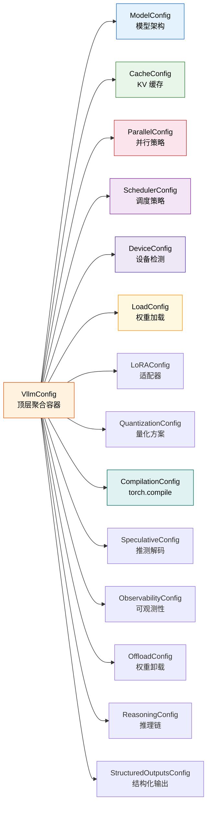

# vLLM 配置系统 (Config System) 深度分析

> **定位**: vLLM 的配置系统是整个推理引擎的核心骨架，采用**层级化聚合设计**，以 `VllmConfig` 为顶层容器，统筹管理模型、缓存、并行、调度、设备、编译优化等 20+ 子配置域。本文档基于 `vllm/config/` 目录源码进行完整分析。



---

## 目录

- [一、VllmConfig 主配置类](#一-vllmconfig-主配置类)
  - [1.1 设计理念：聚合容器模式](#11-设计理念聚合容器模式)
  - [1.2 完整子配置字段清单](#12-完整子配置字段清单)
  - [1.3 Config Hash 与缓存机制](#13-config-hash-与缓存机制)
  - [1.4 __post_init__ 验证流程](#14-__post_init__-验证流程)
- [二、各子配置详解](#二-各子配置详解)
  - [2.1 ModelConfig — 模型架构与 dtype](#21-modelconfig--模型架构与-dtype)
  - [2.2 CacheConfig — KV 缓存管理](#22-cacheconfig--kv-缓存管理)
  - [2.3 ParallelConfig — 并行执行](#23-parallelconfig--并行执行)
  - [2.4 SchedulerConfig — 调度策略](#24-schedulerconfig--调度策略)
  - [2.5 DeviceConfig — 设备检测](#25-deviceconfig--设备检测)
  - [2.6 LoadConfig — 权重加载](#26-loadconfig--权重加载)
  - [2.7 LoRAConfig — LoRA 适配器](#27-loraconfig--lora-适配器)
  - [2.8 QuantizationConfig — 量化方案](#28-quantizationconfig--量化方案)
  - [2.9 CompilationConfig — torch.compile 与 CUDA Graphs](#29-compilationconfig--torchcompile-与-cuda-graphs)
  - [2.10 SpeculativeConfig — 推测解码](#210-speculativeconfig--推测解码)
  - [2.11 ObservabilityConfig — 可观测性](#211-observabilityconfig--可观测性)
  - [2.12 OffloadConfig / ReasoningConfig / StructuredConfigs 等](#212-offloadconfig--reasoningconfig--structuredconfigs-等)
- [三、配置验证与合并逻辑](#三-配置验证与合并逻辑)
  - [3.1 model_validator 方法](#31-model_validator-方法)
  - [3.2 device 配置如何影响其他配置](#32-device-配置如何影响其他配置)
- [四、环境变量覆盖机制](#四-环境变量覆盖机制)
- [五、OptimizationLevel (O0-O3) 各级别详解](#五-optimizationlevel-o0-o3-各级别详解)

---

## 一、VllmConfig 主配置类

### 1.1 设计理念：聚合容器模式

`VllmConfig` 采用 **"上帝对象"（God Object）聚合模式**，作为唯一顶层配置入口，将所有子配置域组合为一个扁平化的命名空间。这种设计的好处是：

- **单点传递**：整个代码库只需传递一个 `vllm_config` 对象
- **跨域验证**：可以在 `__post_init__` 中实现跨配置域的约束检查
- **Hash 一致性**：通过统一的 `compute_hash()` 确保编译缓存的正确性

**源码位置**: [vllm.py:269-354](file:///workspace/vllm/config/vllm.py#L269-L354)

```python
@config(config=ConfigDict(arbitrary_types_allowed=True))
class VllmConfig:
    """Dataclass which contains all vllm-related configuration.
    This simplifies passing around the distinct configurations in the codebase."""
    
    model_config: ModelConfig = None
    cache_config: CacheConfig = Field(default_factory=CacheConfig)
    parallel_config: ParallelConfig = Field(default_factory=ParallelConfig)
    scheduler_config: SchedulerConfig = Field(
        default_factory=SchedulerConfig.default_factory,
    )
    device_config: DeviceConfig = Field(default_factory=DeviceConfig)
    load_config: LoadConfig = Field(default_factory=LoadConfig)
    # ... 更多子配置字段
```

### 1.2 完整子配置字段清单

下表列出了 `VllmConfig` 中所有子配置引用字段：

| 字段名 | 类型 | 默认值 | 必需 | 用途 |
|--------|------|--------|------|------|
| `model_config` | `ModelConfig` | `None` | ✅ | 模型架构、dtype、tokenizer |
| `cache_config` | `CacheConfig` | `Factory` | — | KV 缓存块大小、GPU 内存比例 |
| `parallel_config` | `ParallelConfig` | `Factory` | — | TP/PP/DP 并行度 |
| `scheduler_config` | `SchedulerConfig` | `Factory` | — | 调度策略、延迟阈值 |
| `device_config` | `DeviceConfig` | `Factory` | — | 设备检测与选择 |
| `load_config` | `LoadConfig` | `Factory` | — | 权重加载方式 |
| `offload_config` | `OffloadConfig` | `Factory` | — | 模型权重卸载到 CPU |
| `attention_config` | `AttentionConfig` | `Factory` | — | Attention 后端选择 |
| `mamba_config` | `MambaConfig` | `Factory` | — | Mamba SSM 缓存配置 |
| `kernel_config` | `KernelConfig` | `Factory` | — | 自定义算子配置 |
| `lora_config` | `LoRAConfig \| None` | `None` | — | LoRA 适配器 |
| `speculative_config` | `SpeculativeConfig \| None` | `None` | — | 推测解码参数 |
| `structured_outputs_config` | `StructuredOutputsConfig` | `Factory` | — | 结构化输出 |
| `observability_config` | `ObservabilityConfig` | `Factory` | — | 可观测性设置 |
| `quant_config` | `QuantizationConfig \| None` | `None` | — | 量化方案（运行时解析） |
| `compilation_config` | `CompilationConfig` | `Factory` | — | torch.compile / CUDA Graphs |
| `profiler_config` | `ProfilerConfig` | `Factory` | — | 性能分析器 |
| `kv_transfer_config` | `KVTransferConfig \| None` | `None` | — | 分布式 KV 缓存传输 |
| `kv_events_config` | `KVEventsConfig \| None` | `None` | — | KV 事件发布 |
| `ec_transfer_config` | `ECTransferConfig \| None` | `None` | — | 分布式 EC 缓存传输 |
| `reasoning_config` | `ReasoningConfig \| None` | `None` | — | 推理模型（CoT） |
| `weight_transfer_config` | `WeightTransferConfig \| None` | `None` | — | RL 训练权重传输 |

**全局控制字段**:

| 字段名 | 类型 | 默认值 | 用途 |
|--------|------|--------|------|
| `instance_id` | `str` | `""` (自动生成) | 实例唯一标识 |
| `optimization_level` | `OptimizationLevel` | `O2` | 优化级别 O0-O3 |
| `performance_mode` | `str` | `"balanced"` | balanced/interactivity/throughput |
| `shutdown_timeout` | `int` | `0` | 关闭宽限期(秒) |

### 1.3 Config Hash 与缓存机制

每个配置类都实现了 `compute_hash()` 方法，用于生成该配置的唯一哈希值。`VllmConfig.compute_hash()` 聚合所有子配置的 hash，最终生成一个 **10 位十六进制字符串**，作为编译缓存的 key。

**核心原则**（见 [vllm.py:362-468](file:///workspace/vllm/config/vllm.py#L362-L468)）：

> 只纳入**影响计算图结构**的因子，排除运行时参数（如 `gpu_memory_utilization`、`num_gpu_blocks`）和纯调试参数。

```python
def compute_hash(self) -> str:
    factors: list[Any] = []
    from vllm import __version__
    vllm_factors = []
    vllm_factors.append(__version__)  # 版本号
    
    if self.model_config:
        vllm_factors.append(self.model_config.compute_hash())
    if self.cache_config:
        vllm_factors.append(self.cache_config.compute_hash())
    # ... 聚合所有子配置的 hash
    factors.append(vllm_factors)
    
    hash_str = safe_hash(str(factors).encode(), usedforsecurity=False).hexdigest()[:10]
    return hash_str
```

**Hash 因子排除示例**（以 ModelConfig 为例，见 [model.py:355-398](file:///workspace/vllm/config/model.py#L355-L398)）：

```python
ignored_factors = {
    "convert", "tokenizer", "tokenizer_mode", "seed",
    "hf_config_path", "allowed_local_media_path",
    "enforce_eager", "logprobs_mode", "disable_cascade_attn",
    "skip_tokenizer_init", "served_model_name",
    # ... 这些不影响计算图结构
}
```

### 1.4 `__post_init__` 验证流程

`VllmConfig.__post_init__()` 是整个配置系统的**核心验证枢纽**（约 **650 行**），位于 [vllm.py:758-1401](file:///workspace/vllm/config/vllm.py#L758-L1401)，按顺序执行以下关键步骤：

```
1. 生成 instance_id (时间戳)
2. try_verify_and_update_config() — 模型特定校验
3. model_config.verify_with_parallel_config() — TP 头数整除校验
4. LoRA 配置校验
5. Mamba stochastic rounding 校验
6. 量化配置解析 (_get_quantization_config)
7. DeepGemm 自动禁用检测
8. 异步调度 (async_scheduling) 兼容性判断
9. NCCL DP 同步策略决定
10. Cascade attention 与 async spec 解码互斥
11. 编译模式决定 (enforce_eager / TORCH_COMPILE_DISABLE)
12. quant_fp8 自定义算子启用
13. 平台默认值应用 (current_platform.apply_config_platform_defaults)
14. OptimizationLevel 默认应用
15. Kernel IR op priority 设置
16. CUDA Graph sizes 计算 (_set_cudagraph_sizes)
17. Compile ranges 计算 (_set_compile_ranges)
18. Splitting ops 设置 for V1
19. Sequence Parallelism 配置
20. Hybrid KV cache manager 规则
21. KV transfer config 后处理
22. 最终兼容性检查
```

---

## 二、各子配置详解

### 2.1 ModelConfig — 模型架构与 dtype

**源码位置**: [model.py:109-2200](file:///workspace/vllm/config/model.py#L109-L2200)

ModelConfig 是最复杂的子配置类，负责：
- 从 HuggingFace 加载模型配置 (`hf_config`)
- 推断数据类型 (`dtype`)
- 确定 tokenizer 模式和最大序列长度
- 判断模型属性（MoE、多模态、encoder-decoder、混合注意力等）

#### 关键字段表

| 字段 | 类型 | 默认值 | 说明 |
|------|------|--------|------|
| `model` | `str` | `"Qwen/Qwen3-0.6B"` | 模型名称或路径 |
| `tokenizer` | `str \| None` | `None` (= model) | Tokenizer 路径 |
| `tokenizer_mode` | `str` | `"auto"` | auto/hf/slow/mistral/deepseek_v32/v4/fastokens |
| `trust_remote_code` | `bool` | `False` | 是否信任远程代码 |
| `dtype` | `str/torch.dtype` | `"auto"` | auto/half/float16/bfloat16/float32 |
| `seed` | `int` | `0` | 随机种子 |
| `max_model_len` | `int \| None` | `None` | 最大上下文长度（自动推导） |
| `quantization` | `str \| None` | `None` | 量化方法 |
| `enforce_eager` | `bool` | `False` | 强制 eager 模式 |
| `revision` | `str \| None` | `None` | 模型版本（branch/tag/commit） |
| `runner` | `str` | `"auto"` | generate/pooling/draft |
| `convert` | `str` | `"auto"` | 模型转换类型 |
| `enable_sleep_mode` | `bool` | `False` | 启用 GPU sleep 模式 |
| `max_logprobs` | `int` | `20` | 最大 logprobs 返回数 |
| `disable_sliding_window` | `bool` | `False` | 禁用滑动窗口 |
| `disable_cascade_attn` | `bool` | `True` | 禁用级联注意力 |
| `skip_tokenizer_init` | `bool` | `False` | 跳过 tokenizer 初始化 |
| `enable_prompt_embeds` | `bool` | `False` | 启用 prompt embeddings 输入 |
| `served_model_name` | `str\|list\|None` | `None` | API 服务名 |
| `model_impl` | `str` | `"auto"` | vllm/transformers/terratorch |
| `renderer_num_workers` | `int` | `1` | 渲染线程池大小 |

#### dtype 解析逻辑

**源码**: [model.py:1992-2037](file:///workspace/vllm/config/model.py#L1992-L2037)

```python
_STR_DTYPE_TO_TORCH_DTYPE = {
    "half": torch.float16,
    "float16": torch.float16,
    "float": torch.float32,
    "float32": torch.float32,
    "bfloat16": torch.bfloat16,
}

_FLOAT16_NOT_SUPPORTED_MODELS = {
    "gemma2": "Numerical instability.",
    "gemma3": "Numerical instability.",
    "plamo2": "Numerical instability.",
    "glm4": "Numerical instability.",
}
```

当 `dtype="auto"` 时：
1. FP32/BF16 模型 → 优先 BF16（pooling 模型优先 FP16）
2. 根据平台支持的 dtype 列表降级
3. 特定模型（Gemma2/3, PLaMo2, GLM4）禁止使用 FP16

#### max_model_len 推导

**源码**: [model.py:2064-2200](file:///workspace/vllm/config/model.py#L2064-L2200)

优先级链：
1. 用户显式指定 → 直接使用
2. HF config 中的 `model_max_length` / `max_position_embeddings`
3. RoPE scaling factor 修正
4. Tokenizer config 中的 `model_max_length`（取较小值）
5. 若推导值为 `inf` → 回退到 2048 并警告

#### 重要属性（Properties）

| 属性 | 类型 | 说明 |
|------|------|------|
| `is_moe` | `bool` | 是否为 MoE 模型（num_experts > 0） |
| `is_quantized` | `bool` | 是否量化（hf_config 有 quantization_config） |
| `is_encoder_decoder` | `bool` | 是否为 encoder-decoder 架构 |
| `is_multimodal_model` | `bool` | 是否为多模态模型 |
| `is_hybrid` | `bool` | 是否为混合注意力模型（attention + mamba/linear attention） |
| `use_mla` | `bool` | 是否使用 MLA（DeepSeek V3 系列） |
| `is_nvfp4_quantized` | `bool` | 是否为 NVFP4 量化 |
| `attn_type` | `str` | decoder/encoder/encoder_decoder/hybrid/attention_free |
| `head_dtype` | `torch.dtype` | 头部层 dtype（pooling 模型默认 fp32） |

---

### 2.2 CacheConfig — KV 缓存管理

**源码位置**: [cache.py:42-268](file:///workspace/vllm/config/cache.py#L42-L268)

#### 关键字段表

| 字段 | 类型 | 默认值 | 说明 |
|------|------|--------|------|
| `block_size` | `int` | `16` (DEFAULT_BLOCK_SIZE) | KV 缓存块大小（token 数） |
| `gpu_memory_utilization` | `float` | `0.92` | GPU 内存利用率（0-1） |
| `cache_dtype` | `str` | `"auto"` | KV 缓存数据类型 |
| `enable_prefix_caching` | `bool` | `True` | 启用前缀缓存 |
| `prefix_caching_hash_algo` | `str` | `"sha256"` | 前缀缓存哈希算法 |
| `num_gpu_blocks_override` | `int \| None` | `None` | 覆盖 GPU 块数（测试用） |
| `sliding_window` | `int \| None` | `None` | 滑动窗口大小 |
| `kv_cache_memory_bytes` | `int \| None` | `None` | KV 缓存内存字节数 |
| `kv_offloading_size` | `float \| None` | `None` | KV 卸载到 CPU 的大小(GiB) |
| `kv_offloading_backend` | `str` | `"native"` | native/lmcache |
| `mamba_block_size` | `int \| None` | `None` | Mamba 缓存块大小 |
| `mamba_cache_dtype` | `str` | `"auto"` | Mamba 缓存 dtype |
| `mamba_ssm_cache_dtype` | `str` | `"auto"` | Mamba SSM 状态 dtype |
| `mamba_cache_mode` | `str` | `"none"` | all/align/none |
| `kv_sharing_fast_prefill` | `bool` | `False` | KV 共享快速 prefill |

#### 支持的 KV Cache 数据类型

**源码**: [cache.py:18-34](file:///workspace/vllm/config/cache.py#L18-L34)

```python
CacheDType = Literal[
    "auto",           # 自动选择（通常跟随模型 dtype）
    "float16",        # FP16
    "bfloat16",       # BF16
    "fp8",            # FP8 E4M3 (CUDA 11.8+)
    "fp8_e4m3",       # FP8 E4M3 显式指定
    "fp8_e5m2",       # FP8 E5M2
    "fp8_inc",        # Intel GPU FP8
    "fp8_ds_mla",     # DeepSeek MLA 专用 FP8
    "turboquant_k8v4",   # TurboQuant K8V4
    "turboquant_4bit_nc", # TurboQuant 4-bit
    "turboquant_3bit_nc", # TurboQuant 3-bit
    "int8_per_token_head", # Per-token-head INT8
    "fp8_per_token_head",  # Per-token-head FP8
    "nvfp4",          # NVFP4 (Blackwell 专用)
]
```

#### block_size 默认值与验证

**源码**: [cache.py:223-236](file:///workspace/vllm/config/cache.py#L223-L236)

```python
@model_validator(mode="after")
def _apply_block_size_default(self) -> "CacheConfig":
    if self._block_size_resolved:
        return self
    object.__setattr__(self, "_block_size_resolved", True)
    if self.block_size is None:
        object.__setattr__(self, "block_size", self.DEFAULT_BLOCK_SIZE)  # 16
    else:
        object.__setattr__(self, "user_specified_block_size", True)
    return self
```

---

### 2.3 ParallelConfig — 并行执行

**源码位置**: [parallel.py:108-957](file:///workspace/vllm/config/parallel.py#L108-L957)

这是配置系统中第二复杂的类，管理多种并行维度及其交互。

#### 关键字段表

| 字段 | 类型 | 默认值 | 说明 |
|------|------|--------|------|
| `pipeline_parallel_size` | `int` | `1` | 流水线并行度 (PP) |
| `tensor_parallel_size` | `int` | `1` | 张量并行度 (TP) |
| `prefill_context_parallel_size` | `int` | `1` | Prefill 上下文并行度 (PCP) |
| `data_parallel_size` | `int` | `1` | 数据并行度 (DP) |
| `data_parallel_size_local` | `int` | `1` | 本地 DP 度 |
| `data_parallel_rank` | `int` | `0` | DP rank |
| `data_parallel_backend` | `str` | `"mp"` | ray/mp |
| `data_parallel_external_lb` | `bool` | `False` | 外部负载均衡模式 |
| `data_parallel_hybrid_lb` | `bool` | `False` | 混合 LB 模式 |
| `enable_expert_parallel` | `bool` | `False` | 专家并行 (EP) |
| `enable_ep_weight_filter` | `bool` | `False` | EP 权重过滤（减少 I/O） |
| `enable_eplb` | `bool` | `False` | EP 负载均衡 |
| `expert_placement_strategy` | `str` | `"linear"` | linear/round_robin |
| `all2all_backend` | `str` | `"allgather_reducescatter"` | All2All 后端 |
| `enable_dbo` | `bool` | `False` | 双批重叠 (Dual Batch Overlap) |
| `ubatch_size` | `int` | `0` | 微批次大小 |
| `decode_context_parallel_size` | `int` | `1` | Decode 上下文并行 (DCP) |
| `dcp_comm_backend` | `str` | `"ag_rs"` | DCP 通信后端 |
| `distributed_executor_backend` | `str` | `None` (自动选择) | ray/mp/uni/external_launcher |
| `worker_cls` | `str` | `"auto"` | Worker 类 |
| `master_addr` | `str` | `"127.0.0.1"` | 多节点主地址 |
| `master_port` | `int` | `29501` | 多节点主端口 |
| `nnodes` | `int` | `1` | 节点数 |
| `numa_bind` | `bool` | `False` | NUMA 绑定 |
| `disable_custom_all_reduce` | `bool` | `False` | 禁用自定义 AllReduce |

#### world_size 计算

**源码**: [parallel.py:760-770](file:///workspace/vllm/config/parallel.py#L760-L770)

```python
def __post_init__(self) -> None:
    self.world_size = (
        self.pipeline_parallel_size
        * self.tensor_parallel_size
        * self.prefill_context_parallel_size
    )
    if self.distributed_executor_backend == "external_launcher":
        self.world_size *= self.data_parallel_size
```

注意：DCP 不改变 world_size，它复用 TP 组内的 GPU。TP 必须能被 DPC 整除：

```python
if self.tensor_parallel_size % self.decode_context_parallel_size != 0:
    raise ValueError(f"tp_size={...} must be divisible by dcp_size={...}")
```

#### All2All 后端选项

**源码**: [parallel.py:40-51](file:///workspace/vllm/config/parallel.py#L40-L51)

```python
All2AllBackend = Literal[
    "naive",                          # 朴素实现
    "pplx",                           # PPLX (已移除)
    "deepep_high_throughput",         # DeepEP 高吞吐
    "deepep_low_latency",              # DeepEP 低延迟
    "mori",                           # MORI 内核
    "nixl_ep",                        # NIXL EP
    "allgather_reducescatter",         # AG + RS (默认)
    "flashinfer_all2allv",            # FlashInfer A2A (NVLink 双向)
    "flashinfer_nvlink_two_sided",     # FlashInfer NVLink 双向
    "flashinfer_nvlink_one_sided",     # FlashInfer NVLink 单向
]
```

#### DCP (Decode Context Parallel) 约束

**源码**: [parallel.py:310-343](file:///workspace/vllm/config/parallel.py#L310-L343)

DCP 用于将 decode 阶段的 KV cache 计算分散到多个 GPU 上，仅适用于非 MLA 的 GQA/MQA 模型：

```python
# TP > total_kv_heads（MQA/GQA 条件）
# DCP <= TP // total_kv_heads
# q_per_kv % dcp_size == 0
```

---

### 2.4 SchedulerConfig — 调度策略

**源码位置**: [scheduler.py:26-307](file:///workspace/vllm/config/scheduler.py#L26-L307)

#### 关键字段表

| 字段 | 类型 | 默认值 | 说明 |
|------|------|--------|------|
| `runner_type` | `str` | `"generate"` | generate/pooling/draft |
| `max_num_batched_tokens` | `int` | `2048` | 单次迭代最大 token 数 |
| `max_num_scheduled_tokens` | `int \| None` | `None` | 调度器最大发出 token 数 |
| `max_num_seqs` | `int` | `128` | 最大并发序列数 |
| `max_num_partial_prefills` | `int` | `1` | chunked prefill 并发数 |
| `max_long_partial_prefills` | `int` | `1` | 长 prompt 并发 prefill 数 |
| `long_prefill_token_threshold` | `int` | `0` | 长 prompt 阈值 |
| `enable_chunked_prefill` | `bool` | `True` | 启用分块 prefill |
| `policy` | `str` | `"fcfs"` | fcfs/priority 调度策略 |
| `disable_chunked_mm_input` | `bool` | `False` | 禁用多模态分块输入 |
| `scheduler_cls` | `str/type \| None` | `None` | 自定义调度器类 |
| `disable_hybrid_kv_cache_manager` | `bool \| None` | `None` | 禁用混合 KV 管理 |
| `scheduler_reserve_full_isl` | `bool` | `True` | 保留完整输入序列长度 |
| `async_scheduling` | `bool \| None` | `None` | 异步调度 |
| `stream_interval` | `int` | `1` | 流式间隔（token 数）|

#### InitVar 参数

`SchedulerConfig` 使用两个 `InitVar` 参数，它们不存储在实例中，仅在初始化时使用：

```python
max_model_len: InitVar[int]      # 来自 ModelConfig
is_encoder_decoder: InitVar[bool] # 来自 ModelConfig
```

#### 验证规则

**源码**: [scheduler.py:259-306](file:///workspace/vllm/config/scheduler.py#L259-L306)

1. `max_num_batched_tokens < max_model_len` 且未启用 chunked prefill → **报错**
2. `max_num_batched_tokens < max_num_seqs` → **报错**
3. `max_num_batched_tokens > max_num_seqs * max_model_len` → **警告**
4. `max_num_partial_prefills > 1` 需要 `enable_chunked_prefill=True`
5. Encoder-decoder 模型自动禁用 chunked prefill 和 prefix caching

---

### 2.5 DeviceConfig — 设备检测

**源码位置**: [device.py:17-73](file:///workspace/vllm/config/device.py#L17-L73)

#### 关键字段表

| 字段 | 类型 | 默认值 | 说明 |
|------|------|--------|------|
| `device` | `Device \| torch.device \| None` | `"auto"` | 设备类型 |
| `device_type` | `str` | (自动推断) | 运行时设备类型 |

#### 设备类型选项

```python
Device = Literal["auto", "cuda", "cpu", "tpu", "xpu"]
```

当 `device="auto"` 时（默认），通过 `current_platform.device_type` 自动检测。对于 TPU 等特殊设备，会将 `device` 设为 `None`（因为 TPU 在 CPU 上处理输入）。

---

### 2.6 LoadConfig — 权重加载

**源码位置**: [load.py:23-137](file:///workspace/vllm/config/load.py#L23-L137)

#### 关键字段表

| 字段 | 类型 | 默认值 | 说明 |
|------|------|--------|------|
| `load_format` | `str` | `"auto"` | 权重格式 |
| `download_dir` | `str \| None` | `None` | 下载目录 |
| `safetensors_load_strategy` | `str \| None` | `None` | safetensors 加载策略 |
| `model_loader_extra_config` | `dict` | `{}` | 模型加载器额外配置 |
| `device` | `str \| None` | `None` | 加载目标设备 |
| `ignore_patterns` | `list[str]` | `["original/**/*"]` | 忽略的文件模式 |
| `use_tqdm_on_load` | `bool` | `True` | 显示进度条 |
| `pt_load_map_location` | `str/dict` | `"cpu"` | PyTorch checkpoint map_location |

#### 支持的加载格式

- `"auto"`: 自动尝试 safetensors → pt
- `"pt"`: PyTorch bin 格式
- `"safetensors"`: Safetensors 格式
- `"instanttensor"`: InstantTensor（CUDA Direct I/O + 分布式预取）
- `"npcache"`: NumPy 缓存加速
- `"dummy"`: 随机初始化（性能分析用）
- `"tensorizer"`: CoreWeave Tensorizer
- `"runai_streamer"` / `"runai_streamer_sharded"`: RunAI 流式加载
- `"bitsandbytes"`: BitsAndBytes 量化加载
- `"sharded_state"`: 预分片 checkpoint
- `"gguf"`: GGUF 格式
- `"mistral"`: Mistral 整合 safetensors

#### safetensors 加载策略

| 策略 | 说明 |
|------|------|
| `None` (默认) | 内存映射懒加载；NFS 上自动预取 |
| `"lazy"` | 内存映射，无 NFS 预取 |
| `"eager"` | 全部读入 CPU 内存（适合网络文件系统） |
| `"prefetch"` | 预取到 OS 页缓存 |
| `"torchao"`: TorchAO 重建张量子类 |

---

### 2.7 LoRAConfig — LoRA 适配器

**源码位置**: [lora.py:31-124](file:///workspace/vllm/config/lora.py#L31-L124)

#### 关键字段表

| 字段 | 类型 | 默认值 | 说明 |
|------|------|--------|------|
| `max_lora_rank` | `int` | `16` | 最大 LoRA rank (1/8/16/32/64/128/256/320/512) |
| `max_loras` | `int` | `1` | 单批次最大 LoRA 数 |
| `fully_sharded_loras` | `bool` | `False` | 全分片 LoRA（高序列长度时更快） |
| `max_cpu_loras` | `int \| None` | `None` (= max_loras) | CPU 内存中最大 LoRA 数 |
| `lora_dtype` | `torch.dtype/str` | `"auto"` | LoRA 数据类型（默认跟随模型） |
| `target_modules` | `list[str] \| None` | `None` | 限制 LoRA 目标模块 |
| `default_mm_loras` | `dict \| None` | `None` | 多模态默认 LoRA 映射 |
| `enable_tower_connector_lora` | `bool` | `False` | 启用视觉编码器/连接器 LoRA |
| `specialize_active_lora` | `bool` | `False` | 按活跃 LoRA 数量特化 CUDA Graph |

#### 验证规则

1. `max_cpu_loras >= max_loras`
2. `VLLM_LORA_ENABLE_DUAL_STREAM` 仅支持 CUDA 平台
3. `fully_sharded_loras` 与双流不兼容

---

### 2.8 QuantizationConfig — 量化方案

**源码位置**: [quantization.py:12-125](file:///workspace/vllm/config/quantization.py#L12-L125)

vLLM 的量化配置分为两部分：
1. **离线量化**：通过 `ModelConfig.quantization` 指定（如 awq, gptq, fp8）
2. **在线量化**：通过 `OnlineQuantizationConfigArgs` 在运行时对权重进行量化

#### 在线量化方案枚举

```python
class OnlineQuantScheme(Enum):
    FP8_PER_TENSOR = "fp8_per_tensor"           # FP8 按张量缩放
    FP8_PER_BLOCK = "fp8_per_block"               # FP8 按块缩放 (DeepSeek 风格)
    INT8_PER_CHANNEL_WEIGHT_ONLY = "int8_per_channel_weight_only"  # INT8 仅权重量化
    MXFP8 = "mxfp8"                               # MicroScaling FP8
```

#### OnlineQuantizationConfigArgs

| 字段 | 类型 | 默认值 | 说明 |
|------|------|--------|------|
| `global_scheme` | `OnlineQuantScheme \| None` | `None` | 全局量化方案 |
| `linear_scheme_override` | `OnlineQuantScheme \| None` | `None` | Linear 层覆盖 |
| `moe_scheme_override` | `OnlineQuantScheme \| None` | `None` | MoE 层覆盖 |
| `ignore` | `list[str]` | `[]` | 跳过量化的层（支持正则）|

#### 量化配置解析流程

在 `VllmConfig.__post_init__` 中调用 `_get_quantization_config()`：

```python
@staticmethod
def _get_quantization_config(model_config, load_config):
    if model_config.quantization is not None:
        quant_config = get_quant_config(model_config, load_config)
        # 1. 检查 GPU compute capability 最低要求
        # 2. 检查 dtype 兼容性
        # 3. 调用 maybe_update_config() 更新 hf_config
        return quant_config
    return None
```

---

### 2.9 CompilationConfig — torch.compile 与 CUDA Graphs

**源码位置**: [compilation.py:372-1499](file:///workspace/vllm/config/compilation.py#L372-L1499)

这是第三复杂的配置类，控制模型编译优化的方方面面。

#### CompilationMode 枚举

```python
class CompilationMode(IntEnum):
    NONE = 0                # 无编译，纯 eager 模式
    STOCK_TORCH_COMPILE = 1 # 标准 torch.compile
    DYNAMO_TRACE_ONCE = 2    # 单次 Dynamo trace
    VLLM_COMPILE = 3         # vLLM 自定义 Inductor 后端（推荐）
```

#### CUDAGraphMode 枚举

```python
class CUDAGraphMode(Enum):
    NONE = 0                              # 无 CUDA Graph
    PIECEWISE = 1                         # 仅分段 CUDA Graph
    FULL = 2                               # 全量 CUDA Graph
    FULL_DECODE_ONLY = (FULL, NONE)        # 仅 decode 阶段全量
    FULL_AND_PIECEWISE = (FULL, PIECEWISE) # decode 全量 + prefill 分段（默认最优）
```

#### 关键字段表

| 字段 | 类型 | 默认值 | 说明 |
|------|------|--------|------|
| `mode` | `CompilationMode` | `None` (→ O2 决定) | 编译模式 |
| `backend` | `str` | `""` (→ inductor) | 编译后端 |
| `custom_ops` | `list[str]` | `[]` | 自定义算子开关 (+op/-op/all/none) |
| `splitting_ops` | `list[str] \| None` | `None` | 从 CUDA Graph 排除的算子 |
| `cudagraph_mode` | `CUDAGraphMode` | `None` (→ O2 决定) | CUDA Graph 模式 |
| `cudagraph_capture_sizes` | `list[int] \| None` | `None` | CUDA Graph 捕获尺寸 |
| `max_cudagraph_capture_size` | `int` | `None` | 最大捕获尺寸 |
| `cudagraph_num_of_warmups` | `int` | `0` | Warmup 次数 |
| `debug_dump_path` | `Path \| None` | `None` | 调试信息转储路径 |
| `cache_dir` | `str` | `""` | 编译缓存目录 |
| `compile_sizes` | `list[int\|str] \| None` | `None` | Inductor 编译尺寸 |
| `compile_ranges_endpoints` | `list[int] \| None` | `None` | 编译范围端点 |
| `inductor_compile_config` | `dict` | `{}` | Inductor 额外配置 |
| `inductor_passes` | `dict` | `{}` | 自定义 Inductor pass |
| `ir_enable_torch_wrap` | `bool \| None` | `None` | IR torch wrap 开关 |
| `use_inductor_graph_partition` | `bool \| None` | `None` | Inductor 图分区 |
| `pass_config` | `PassConfig` | `Factory` | 自定义融合 pass 配置 |
| `dynamic_shapes_config` | `DynamicShapesConfig` | `Factory` | 动态形状配置 |
| `fast_moe_cold_start` | `bool \| None` | `None` | MOE 快速冷启动 |
| `compile_mm_encoder` | `bool` | `False` | 编码多模态 encoder |
| `cudagraph_specialize_lora` | `bool` | `True` | LoRA 特化 CUDA Graph |

#### PassConfig（自定义融合 Pass）

**源码**: [compilation.py:107-305](file:///workspace/vllm/config/compilation.py#L107-L305)

| 字段 | 类型 | 默认值 | 说明 |
|------|------|--------|------|
| `fuse_norm_quant` | `bool` | `None` | RMSNorm + 量化融合 |
| `fuse_act_quant` | `bool` | `None` | SiLU+Mul + 量化融合 |
| `fuse_attn_quant` | `bool` | `None` | Attention + 量化融合 |
| `enable_sp` | `bool` | `None` | 序列并行（Sequence Parallelism） |
| `fuse_gemm_comms` | `bool` | `None` | 异步 TP（GEMM + 通信融合） |
| `fuse_allreduce_rms` | `bool` | `None` | AllReduce + RMSNorm 融合 |
| `eliminate_noops` | `bool` | `True` | 消除空操作 |
| `fuse_act_padding` | `bool` | `None` | RMSNorm + padding 融合（ROCm） |
| `fuse_mla_dual_rms_norm` | `bool` | `None` | MLA 双 RMSNorm 融合 |
| `fuse_rope_kvcache` | `bool` | `None` | RoPE + KV cache 融合（ROCm） |
| `sp_min_token_num` | `int \| None` | `None` | SP 最小 token 数阈值 |

> 注意：值为 `None` 表示"由 OptimizationLevel 决定"，而非禁用。

#### DynamicShapesConfig

| 字段 | 类型 | 默认值 | 说明 |
|------|------|--------|------|
| `type` | `DynamicShapesType` | `BACKED` | backed/unbacked/backed_size_oblivious |
| `evaluate_guards` | `bool` | `False` | 调试动态形状 guard |
| `assume_32_bit_indexing` | `bool` | `False` | 假设 32 位索引 |

---

### 2.10 SpeculativeConfig — 推测解码

**源码位置**: [speculative.py:73-1063](file:///workspace/vllm/config/speculative.py#L73-L1063)

推测解码（Speculative Decoding / Spec Decode）通过小型草稿模型（draft model）提前预测多个 token，再由目标模型（target model）并行验证，从而提升吞吐。

#### 推测方法类型

```python
SpeculativeMethod = Literal[
    "ngram",                  # N-gram 模式匹配
    "medusa",                 # Medusa head
    "mlp_speculator",         # MLP Speculator
    "draft_model",            # 独立草稿模型
    "suffix",                 # Suffix decoding (Arctic)
    "eagle", "eagle3",        # EAGLE/EAGLE3
    "dflash",                 # DFlash
    MTPModelTypes,           # Multi-Token Prediction (20+ 变体)
    NgramGPUTypes,            # Ngram GPU
]
```

#### 关键字段表

| 字段 | 类型 | 默认值 | 说明 |
|------|------|--------|------|
| `num_speculative_tokens` | `int` | `None` (必需) | 推测 token 数 |
| `model` | `str \| None` | `None` | 草稿模型路径 |
| `method` | `SpeculativeMethod \| None` | `None` (自动检测) | 推测方法 |
| `draft_tensor_parallel_size` | `int \| None` | `None` | 草稿模型 TP |
| `quantization` | `str \| None` | `None` | 草稿模型量化 |
| `max_model_len` | `int \| None` | `None` | 草稿模型最大长度 |
| `disable_padded_drafter_batch` | `bool` | `False` | 禁用填充草稿批次 |
| `use_local_argmax_reduction` | `bool` | `False` | 局部 argmax 减少通信 |
| `prompt_lookup_max/min` | `int \| None` | `None` | N-gram 窗口大小 |
| `parallel_drafting` | `bool` | `False` | 并行 drafting |
| `rejection_sample_method` | `str` | `"standard"` | standard/synthetic |
| `draft_sample_method` | `str` | `"greedy"` | greedy/gumbel |
| `suffix_decoding_max_tree_depth` | `int` | `24` | Suffix 解码树深度 |

#### MTP (Multi-Token Prediction) 支持的模型

vLLM 支持 20+ 种 MTP 模型变体，包括：
- **DeepSeek 系列**: deepseek_mtp, deepseek_v32 (→ mtp), deepseek_v4 (→ mtp)
- **Qwen 系列**: qwen3_next_mtp, qwen3_5_mtp
- **GLM 系列**: glm4_moe_mtp, glm4_moe_lite_mtp, glm_ocr_mtp
- **其他**: ernie_mtp, nemotron_h_mtp, gemma4_mtp, hy_v3_mtp, step3p5_mtp 等

**完整列表见**: [speculative.py:34-53](file:///workspace/vllm/config/speculative.py#L34-L53)

---

### 2.11 ObservabilityConfig — 可观测性

**源码位置**: [observability.py:17-152](file:///workspace/vllm/config/observability.py#L17-L152)

#### 关键字段表

| 字段 | 类型 | 默认值 | 说明 |
|------|------|--------|------|
| `show_hidden_metrics_for_version` | `str \| None` | `None` | 显示某版本起隐藏的指标 |
| `otlp_traces_endpoint` | `str \| None` | `None` | OpenTelemetry traces 目标 URL |
| `collect_detailed_traces` | `list[str] \| None` | `None` | 详细追踪模块 (model/worker/all) |
| `kv_cache_metrics` | `bool` | `False` | KV 缓存驻留指标 |
| `kv_cache_metrics_sample` | `float` | `0.01` | KV 指标采样率 (0-1] |
| `cudagraph_metrics` | `bool` | `False` | CUDA Graph 指标 |
| `enable_layerwise_nvtx_tracing` | `bool` | `False` | 逐层 NVTX 追踪 |
| `enable_mfu_metrics` | `bool` | `False` | MFU (Model FLOPs Utilization) |
| `enable_mm_processor_stats` | `bool` | `False` | 多模态处理器统计 |
| `enable_logging_iteration_details` | `bool` | `False` | 迭代详情日志 |

---

### 2.12 OffloadConfig / ReasoningConfig / StructuredConfigs 等

#### OffloadConfig — 权重卸载

**源码**: [offload.py:80-138](file:///workspace/vllm/config/offload.py#L80-L138)

| 字段 | 类型 | 默认值 | 说明 |
|------|------|--------|------|
| `offload_backend` | `str` | `"auto"` | auto/uva/prefetch |
| `uva.cpu_offload_gb` | `float` | `0` | UVA 卸载量 (GiB/GPU) |
| `uva.cpu_offload_params` | `set[str]` | `set()` | UVA 目标参数名 |
| `prefetch.offload_group_size` | `int` | `0` | 每 N 层一组 |
| `prefetch.offload_num_in_group` | `int` | `1` | 每组卸载数 |
| `prefetch.offload_prefetch_step` | `int` | `1` | 预取步进 |

#### ReasoningConfig — 推理链 (Chain-of-Thought)

**源码**: [reasoning.py:13-107](file:///workspace/vllm/config/reasoning.py#L13-L107)

| 字段 | 类型 | 默认值 | 说明 |
|------|------|--------|------|
| `reasoning_parser` | `str` | `""` | ReasoningParser 名称 |
| `reasoning_start_str` | `str` | `""` | 推理开始标记 (如 `") | `""`) | 推理结束标记 (如 `") | `False` | 是否已启用（自动初始化后） |

Token IDs 通过 `initialize_token_ids()` 从字符串自动推导。

#### StructuredOutputsConfig — 结构化输出

**源码**: [structured_outputs.py:18-74](file:///workspace/vllm/config/structured_outputs.py#L18-L74)

| 字段 | 类型 | 默认值 | 说明 |
|------|------|--------|------|
| `backend` | `str` | `"auto"` | auto/xgrammar/guidance/outlines/lm-format-enforcer |
| `disable_any_whitespace` | `bool` | `False` | 紧凑 JSON 输出 |
| `disable_additional_properties` | `bool` | `False` | 禁用 additionalProperties |
| `reasoning_parser` | `str` | `""` | 推理解析器 |
| `enable_in_reasoning` | `bool` | `False` | 在推理中使用结构化输入 |

#### 其他配置类简表

| 配置类 | 文件 | 核心用途 |
|--------|------|----------|
| `AttentionConfig` | [attention.py](file:///workspace/vllm/config/attention.py) | Attention 后端选择 (FLASH_ATTN/XFORMERS etc.) |
| `MambaConfig` | [mamba.py](file:///workspace/vllm/config/mamba.py) | Mamba SSM 缓存与状态管理 |
| `KernelConfig` | [kernel.py](file:///workspace/vllm/config/kernel.py) | 自定义算子配置 (FlashInfer autotune 等) |
| `ProfilerConfig` | [profiler.py](file:///workspace/vllm/config/profiler.py) | 性能分析器配置 |
| `KVTransferConfig` | [kv_transfer.py](file:///workspace/vllm/config/kv_transfer.py) | 分布式 KV 缓存传输 |
| `KVEventsConfig` | [kv_events.py](file:///workspace/vllm/config/kv_events.py) | KV 事件发布 |
| `ECTransferConfig` | [ec_transfer.py](file:///workspace/vllm/config/ec_transfer.py) | EC 缓存传输 |
| `PoolerConfig` | [pooler.py](file:///workspace/vllm/config/pooler.py) | Pooling 模型输出配置 |
| `MultiModalConfig` | [multimodal.py](file:///workspace/vllm/config/multimodal.py) | 多模态输入配置 |
| `WeightTransferConfig` | [weight_transfer.py](file:///workspace/vllm/config/weight_transfer.py) | RL 训练权重传输 |

---

## 三、配置验证与合并逻辑

### 3.1 model_validator 方法

`VllmConfig` 定义了两个 `@model_validator(mode="after")` 方法：

#### validate_nvfp4_kv_cache_with_mla

**源码**: [vllm.py:1995-2004](file:///workspace/vllm/config/vllm.py#L1995-L2004)

```python
@model_validator(mode="after")
def validate_nvfp4_kv_cache_with_mla(self) -> "VllmConfig":
    if self.model_config is None:
        return self
    if self.cache_config.cache_dtype == "nvfp4" and self.model_config.use_mla:
        raise ValueError(
            "nvfp4 KV cache is not supported with MLA "
            "(Multi-head Latent Attention) backends."
        )
    return self
```

**约束**: NVFP4 KV 缓存与 MLA（DeepSeek V3 系列的多头潜在注意力）不兼容。

#### validate_mamba_block_size

**源码**: [vllm.py:2007-2018](file:///workspace/vllm/config/vllm.py#L2007-L2018)

```python
@model_validator(mode="after")
def validate_mamba_block_size(self) -> "VllmConfig":
    mamba_block_size_is_set = (
        self.cache_config.mamba_block_size is not None
        and self.cache_config.mamba_block_size != self.model_config.max_model_len
    )
    if mamba_block_size_is_set and not self.cache_config.enable_prefix_caching:
        raise ValueError(
            "--mamba-block-size can only be set with --enable-prefix-caching"
        )
    return self
```

**约束**: Mamba block_size 仅在启用前缀缓存时有意义。

### 3.2 device 配置如何影响其他配置

DeviceConfig 在 `__post_init__` 中通过 `current_platform` 自动检测设备类型，这个信息会传播影响到：

1. **ParallelConfig**: 
   - 非 CUDA 设备自动禁用 custom all-reduce
   - TPU 且 `VLLM_XLA_USE_SPMD` 时使用 `uni` 后端
   - 多节点时强制 `mp` 后端

2. **CompilationConfig**:
   - ROCm 平台启用 AITER 特定融合 pass
   - 非 CUDA-like 平台禁用 CUDA Graph
   - Intel GPU 使用 `fp8_inc` 作为默认 KV cache dtype

3. **ModelConfig**:
   - `sleep_mode` 仅在 cuda/hip 平台可用
   - encoder-decoder + ROCm 自动 enforce eager

4. **CacheConfig**:
   - 不同平台的默认 block_size 可能不同
   - KV cache dtype 的可用选项因平台而异

**平台检测入口**: [vllm.py:983](file:///workspace/vllm/config/vllm.py#L983)

```python
current_platform.apply_config_platform_defaults(self)
```

---

## 四、环境变量覆盖机制

**源码位置**: [env_override.py](file:///workspace/vllm/env_override.py) (全文件，约 760 行)

`env_override.py` 在 `import vllm` 时立即执行，主要功能包括：

### 4.1 CUDA 兼容性路径设置

**源码**: [env_override.py:39-85](file:///workspace/vllm/env_override.py#L39-L85)

通过 `VLLM_ENABLE_CUDA_COMPATIBILITY` 环境变量设置 `LD_LIBRARY_PATH`，使旧版 CUDA 驱动能运行新版 PyTorch 编译的程序。查找优先级：

1. `VLLM_CUDA_COMPATIBILITY_PATH` 显式指定
2. `$CONDA_PREFIX/cuda-compat`
3. `/usr/local/cuda-{version}/compat`

### 4.2 PyTorch 环境变量预设

**源码**: [env_override.py:101-113](file:///workspace/vllm/env_override.py#L101-L113)

```python
os.environ["PYTORCH_NVML_BASED_CUDA_CHECK"] = "1"  # 避免 CUDA 初始化
os.environ["TORCHINDUCTOR_COMPILE_THREADS"] = "1"  # 单线程编译
os.environ.setdefault("TRITON_CACHE_AUTOTUNING", "1")  # Triton 自动调优缓存
os.environ.setdefault("TILELANG_CLEANUP_TEMP_FILES", "1")  # TileLang 清理
```

### 4.3 PyTorch 版本特定 Monkey-Patch

`env_override.py` 包含大量针对特定 PyTorch 版本的 monkey-patch，修复上游 bug：

| 版本 | Patch 内容 | 上游 Issue/PR |
|------|-----------|---------------|
| 2.9.0 | `memory_plan_reuse` 修复 | [pytorch/pytorch#165514](https://github.com/pytorch/pytorch/pull/165514) |
| 2.9.0 | `get_graph_partition_signature` 修复 | [pytorch/pytorch#165815](https://github.com/pytorch/pytorch/pull/165815) |
| 2.9.0 | `should_partition` 修复（origin_node 访问） | vLLM [#26678](https://github.com/vllm-project/vllm/issues/26678) |
| 2.9.0+ | `get_raw_stream` 缺失 workaround | vLLM [#30905](https://github.com/vllm-project/vllm/issues/30905) |
| 2.10.0 | `FxGraphCachePickler.dumps` ValueError 修复 | [pytorch/pytorch#176557](https://github.com/pytorch/pytorch/pull/176557) |
| 2.11-2.11.x | `constrain_to_fx_strides` FakeScriptObject 修复 | [pytorch/pytorch#175973](https://github.com/pytorch/pytorch/issues/175973) |
| 2.11-2.11.x | `indirect_assert` VecMask 构造修复 | [pytorch/pytorch#178148](https://github.com/pytorch/pytorch/pull/178148) |

这些 patch 通过 `is_torch_equal_or_newer()` 进行版本守卫，只在匹配的 PyTorch 版本上生效。

---

## 五、OptimizationLevel (O0-O3) 各级别详解

**源码位置**: [vllm.py:68-265](file:///workspace/vllm/config/vllm.py#L68-L265)

OptimizationLevel 是 vLLM 的**一键优化旋钮**，在启动时间和推理性能之间提供 4 个级别的权衡。每个级别对应一组预定义的 `compilation_config` 和 `kernel_config` 默认值。

### 5.1 OptimizationLevel 枚举定义

```python
class OptimizationLevel(IntEnum):
    O0 = 0  # 无优化，最快启动
    O1 = 1  # 快速优化 (Dynamo + Piecewise CG)
    O2 = 2  # 完整优化 (O1 + Full + Piecewise CG) ← 默认
    O3 = 3  # 目前等同于 O2 + FlashInfer autotune
```

### 5.2 各级别详细配置

#### O0 — 无优化（极速启动）

**适用场景**: 开发调试、快速实验、首次验证

```python
OPTIMIZATION_LEVEL_00 = {
    "compilation_config": {
        "pass_config": {
            "fuse_norm_quant": False,       # ❌ 不融合 Norm+Quant
            "fuse_act_quant": False,        # ❌ 不融合 Act+Quant
            "fuse_allreduce_rms": False,   # ❌ 不融合 AR+RMS
            "fuse_attn_quant": False,       # ❌ 不融合 Attn+Quant
            "enable_sp": False,             # ❌ 不启用序列并行
            "fuse_gemm_comms": False,       # ❌ 不融合 GEMM+Comms
            "fuse_act_padding": False,      # ❌ 不融合 Act+Padding
            "fuse_mla_dual_rms_norm": False,# ❌ 不融合 MLA Dual-RMS
            "fuse_rope_kvcache": False,     # ❌ 不融合 RoPE+KVC
        },
        "cudagraph_mode": CUDAGraphMode.NONE,          # 🚫 无 CUDA Graph
        "use_inductor_graph_partition": False,            # 🚫 无图分区
    },
    "kernel_config": {
        "enable_flashinfer_autotune": False,           # 🚫 无 FlashInfer autotune
    },
}
```

**特征总结**:
- ✅ 最快启动速度（无需编译预热）
- ✅ 最小内存占用（无 CUDA Graph 缓冲区）
- ❌ 无任何 kernel fusion
- ❌ 无 CUDA Graph 加速
- ❌ 吞吐量最低

#### O1 — 快速优化

**适用场景**: 对延迟敏感但需要基本性能的场景

```python
OPTIMIZATION_LEVEL_01 = {
    "compilation_config": {
        "pass_config": {
            "fuse_norm_quant": enable_norm_fusion,    # ⚡ 条件启用
            "fuse_act_quant": enable_act_fusion,     # ⚡ 条件启用
            "fuse_allreduce_rms": False,            # ❌
            "fuse_attn_quant": False,                # ❌
            "enable_sp": False,                      # ❌
            "fuse_gemm_comms: False,                 # ❌
            "fuse_act_padding": enable_norm_pad_fusion,  # ⚡ 条件启用
            "fuse_mla_dual_rms_norm": enable_mla_dual_rms_norm_fusion,  # ⚡ 条件启用
            "fuse_rope_kvcache: False,               # ❌
        },
        "cudagraph_mode": CUDAGraphMode.PIECEWISE,     # 🔶 分段 CUDA Graph
        "use_inductor_graph_partition": False,           # 🚫
    },
    "kernel_config": {
        "enable_flashinfer_autotune": False,           # 🚫
    },
}
```

**条件启用的 fusion 函数**（根据实际配置动态决定）:

| Fusion 函数 | 启用条件 |
|------------|----------|
| `enable_norm_fusion` | RMSNorm 或 FP8 quant 自定义 op 启用时 |
| `enable_act_fusion` | SiLU+Mul 或 FP8 quant 自定义 op 启用时；或 FP4 模型 |
| `enable_norm_pad_fusion` | AITER RMSNorm + hidden_size==288 (gpt-oss) 时 |
| `enable_mla_dual_rms_norm_fusion` | AITER 有 fused_qk_rmsnorm 时 |

**特征总结**:
- ✅ 启用 `torch.compile` (VLLM_COMPILE mode)
- ✅ 分段 CUDA Graph（Piecewise）— prefill 灵活，decode 加速
- ✅ 基本 kernel fusion（Norm+Quant, Act+Quant）
- ❌ 无 Full CUDA Graph
- ❌ 无 Sequence Parallelism
- ❌ 无 FlashInfer autotune

#### O2 — 完整优化（**默认级别**）

**适用场景**: 生产部署，平衡启动时间和吞吐量

```python
OPTIMIZATION_LEVEL_02 = {
    "compilation_config": {
        "pass_config": {
            "fuse_norm_quant": enable_norm_fusion,     # ✅
            "fuse_act_quant": enable_act_fusion,      # ✅
            "fuse_allreduce_rms": enable_allreduce_rms_fusion,  # ✅ 新增!
            "fuse_attn_quant": IS_QUANTIZED,        # ✅ 量化模型
            "enable_sp": IS_DENSE,                   # ✅ 密集模型
            "fuse_gemm_comms": IS_DENSE,              # ✅ 密集模型
            "fuse_act_padding": enable_norm_pad_fusion,  # ✅
            "fuse_mla_dual_rms_norm": ...,            # ✅
            "fuse_rope_kvcache`: enable_rope_kvcache_fusion,  # ✅ 新增!
        },
        "cudagraph_mode": CUDAGraphMode.FULL_AND_PIECEWISE,  # 🔶🔶 全量+分段
        "use_inductor_graph_partition": False,
    },
    "kernel_config": {
        "enable_flashinfer_autotune": False,         # 🚫 (留待 O3)
    },
}
```

**相比 O1 新增的优化**:
- ✅ `fuse_allreduce_rms`: AllReduce + RMSNorm 融合（Hopper+ + TP>1 + FlashInfer）
- ✅ `fuse_attn_quant`: Attention + 量化融合（量化模型）
- ✅ `enable_sp`: 序列并行（密集模型 + TP>1）
- ✅ `fuse_gemm_comms`: 异步 TP（GEMM + NCCL 通信融合）
- ✅ `fuse_rope_kvcache`: RoPE + KV cache 更新融合（ROCm/AITER）
- ✅ **Full + Piecewise CUDA Graph**: decode 阶段全量 capture，prefill/mixed 阶段分段

**特征总结**:
- ✅ 所有 O1 的优化
- ✅ Full CUDA Graph for decode（最大程度减少 decode 阶段开销）
- ✅ Sequence Parallelism（减少 TP 通信瓶颈）
- ✅ Async TP（隐藏 AllReduce 延迟）
- ✅ 适用于大多数生产工作负载
- ⚠️ 启动时间较长（需要 capture 更多尺寸的 CUDA Graph）

#### O3 — 激进优化

**适用场景**: 对吞吐量极其敏感的离线推理、benchmark

```python
OPTIMIZATION_LEVEL_03 = {
    "compilation_config": {
        # 与 O2 完全相同的 pass_config ...
        "cudagraph_mode": CUDAGraphMode.FULL_AND_PIECEWISE,
        "use_inductor_graph_partition": False,
    },
    "kernel_config": {
        "enable_flashinfer_autotune": True,          # ✅ 唯一区别！
    },
}
```

**相比 O2 唯一新增**:
- ✅ **FlashInfer Autotune**: 自动搜索最优的 FlashInfer kernel 配置（如 tile 大小）

**特征总结**:
- ✅ 所有 O2 的优化
- ✅ FlashInfer autotune（可能显著提升 attention 性能）
- ⚠️ 最长启动时间（autotune 需要额外 benchmark 时间）
- ⚠️ autotune 过程中可能有正确性问题（[FlashInfer #3197](https://github.com/flashinfer-ai/flashinfer/issues/3197)）

### 5.3 OptimizationLevel 应用机制

**源码**: [vllm.py:1012-1013](file:///workspace/vllm/config/vllm.py#L1012-L1013), [vllm.py:647-674](file:///workspace/vllm/config/vllm.py#L647-L674)

```python
# 在 __post_init__ 中应用
default_config = OPTIMIZATION_LEVEL_TO_CONFIG[self.optimization_level]
self._apply_optimization_level_defaults(default_config)
```

**应用策略**（`_apply_optimization_level_defaults`）：

1. **递归遍历**配置字典，匹配嵌套的 dataclass 字段
2. **仅覆盖仍为 `None`** 的字段（用户显式设置的值优先级更高）
3. **支持 callable 值**：若默认值是函数，则以 `self` 为 root 调用以获取运行时决策

```python
def _set_config_default(self, config_obj, key, value):
    if getattr(config_obj, key) is None:
        setattr(config_obj, key, value(self) if callable(value) else value)
```

这意味着像 `enable_sp: IS_DENSE` 这样的配置会在运行时根据模型是否为 dense 模型来决定是否启用。

### 5.4 Performance Mode 交互

除了 OptimizationLevel，vLLM 还提供 `performance_mode` 参数（[vllm.py:346-351](file:///workspace/vllm/config/vllm.py#L346-L351)）：

```python
performance_mode: PerformanceMode = "balanced"
# "balanced"      # 平衡模式（默认）
# "interactivity"  # 交互优先（细粒度 CG，低延迟 kernel）
# "throughput"     # 吞吐优先（大 CG，激进 batching）
```

**Performance Mode 影响**（[vllm.py:1561-1587](file:///workspace/vllm/config/vllm.py#L1561-L1587)）：

当 `performance_mode == "interactivity"` 时：
- CUDA Graph capture 尺寸变为 `[1, 2, ..., interactivity_max]`（更细粒度，减少 padding 开销）
- `interactivity_max = min(max_cudagraph_capture_size, 32)`

当 `performance_mode == "throughput"` 时：
- 使用标准尺寸表 `[1, 2, 4, 8, 16, ..., 256, ...]`（更大步长，减少 capture 数量）

### 5.5 各级别对比总览

| 特性 | O0 | O1 | O2 (默认) | O3 |
|------|----|----|-----|-----|
| torch.compile | ❌ | ✅ VLLM | ✅ VLLM | ✅ VLLM |
| CUDA Graph | ❌ | ✅ Piecewise | ✅ Full+Piece | ✅ Full+Piece |
| Norm+Quant Fusion | ❌ | ⚡ 条件 | ✅ | ✅ |
| Act+Quant Fusion | ❌ | ⚡ 条件 | ✅ | ✅ |
| AllReduce+RMS Fusion | ❌ | ❌ | ✅ (Hopper+) | ✅ |
| Attn+Quant Fusion | ❌ | ❌ | ⚡ 量化时 | ⚡ 量化时 |
| Sequence Parallelism | ❌ | ❌ | ⚡ Dense | ⚡ Dense |
| Async TP (GEMM+Comms) | ❌ | ❌ | ⚡ Dense | ⚡ Dense |
| RoPE+KVCache Fusion | ❌ | ❌ | ✅ (ROCm) | ✅ (ROCm) |
| FlashInfer Autotune | ❌ | ❌ | ❌ | ✅ |
| 启动速度 | ⭐⭐⭐⭐ fastest | ⭐⭐⭐ fast | ⭐⭐ slow | ⭐ slowest |
| 吞吐潜力 | ⭐ lowest | ⭐⭐ low | ⭐⭐⭐⭐ high | ⭐⭐⭐⭐ highest |
| 延迟表现 | ⭐⭐⭐ good | ⭐⭐⭐ good | ⭐⭐ best | ⭐⭐ best |
| 内存占用 | ⭐⭐⭐⭐ least | ⭐⭐⭐ low | ⭐⭐ medium | ⭐⭐ medium |
| 适用场景 | 开发/调试 | 低延迟服务 | 生产部署（推荐） | 高吞吐 benchmark |

---

## 附录：配置类汇总速查表

| 配置类 | 文件 | 核心职责 | 关键决策 |
|--------|------|----------|----------|
| **VllmConfig** | [vllm.py](file:///workspace/vllm/config/vllm.py) | 顶层聚合容器 | Hash 计算、跨域验证、优化级别应用 |
| **ModelConfig** | [model.py](file:///workspace/vllm/config/model.py) | 模型定义 | dtype、max_len、架构推断、tokenizer |
| **CacheConfig** | [cache.py](file:///workspace/vllm/config/cache.py) | KV 缓存 | block_size、dtype、prefix caching、offloading |
| **ParallelConfig** | [parallel.py](file:///workspace/vllm/config/parallel.py) | 并行拓扑 | TP/PP/DP/DCP/EP、world_size、All2All |
| **SchedulerConfig** | [scheduler.py](file:///workspace/vllm/config/scheduler.py) | 请求调度 | batch tokens、chunked prefill、policy |
| **DeviceConfig** | [device.py](file:///workspace/vllm/config/device.py) | 设备抽象 | 自动检测 cuda/cpu/tpu/xpu |
| **LoadConfig** | [load.py](file:///workspace/vllm/config/load.py) | 权重加载 | format、strategy、download_dir |
| **LoRAConfig** | [lora.py](file:///workspace/vllm/config/lora.py) | LoRA 适配 | rank、数量、dtype、目标模块 |
| **QuantizationConfig** | [quantization.py](file:///workspace/vllm/config/quantization.py) | 量化 | 在线/离线方案、per-tensor/per-block |
| **CompilationConfig** | [compilation.py](file:///workspace/vllm/config/compilation.py) | 编译优化 | mode/backend/cudagraph/pass/fusion |
| **SpeculativeConfig** | [speculative.py](file:///workspace/vllm/config/speculative.py) | 推测解码 | method/draft model/MTP/EAGLE/Ngram |
| **ObservabilityConfig** | [observability.py](file:///workspace/vllm/config/observability.py) | 可观测性 | traces/metrics/NVTX/MFU |
| **OffloadConfig** | [offload.py](file:///workspace/vllm/config/offload.py) | 权重卸载 | UVA zero-copy / prefetch |
| **ReasoningConfig** | [reasoning.py](file:///workspace/vllm/config/reasoning.py) | 推理链 | CoT start/end token |
| **StructuredOutputsConfig** | [structured_outputs.py](file:///workspace/vllm/config/structured_outputs.py) | 结构化输出 | JSON schema / regex backend |

---

*文档生成时间: 2026-05-10 | 基于 vLLM 最新源码*
