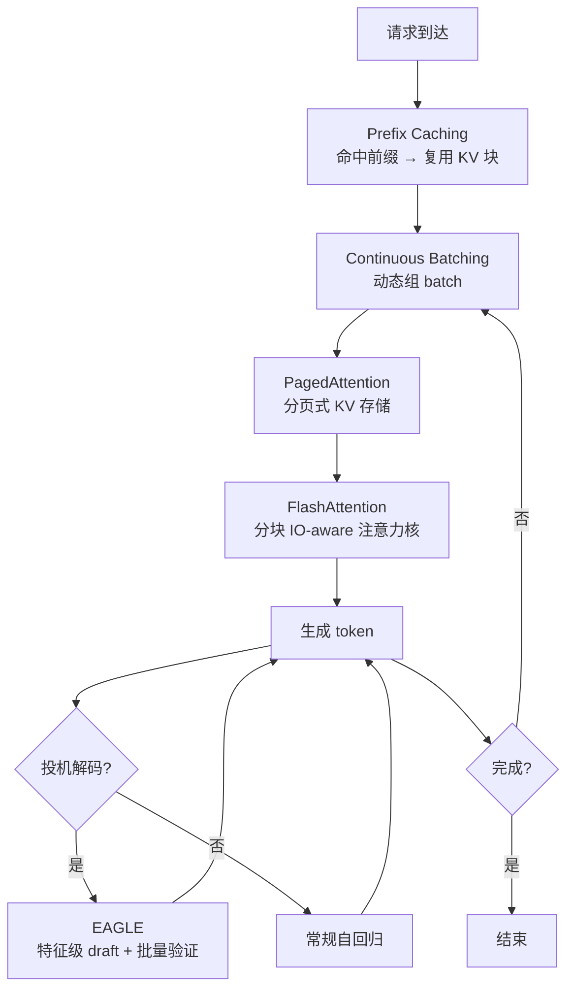
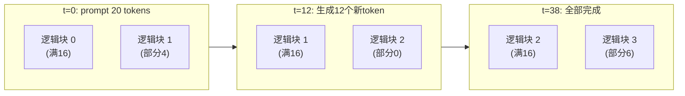
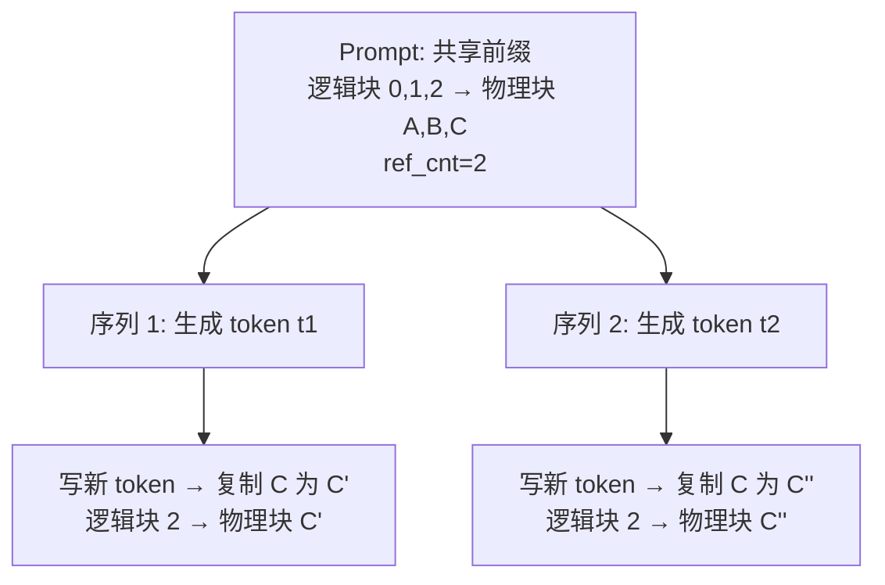
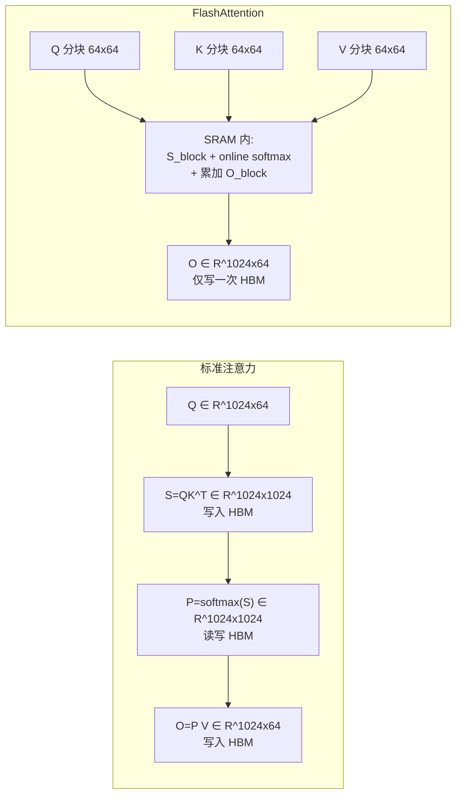
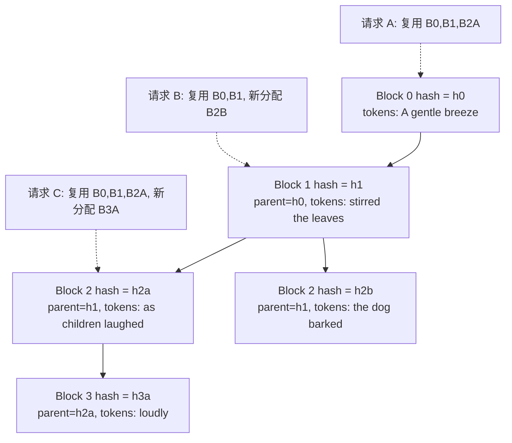
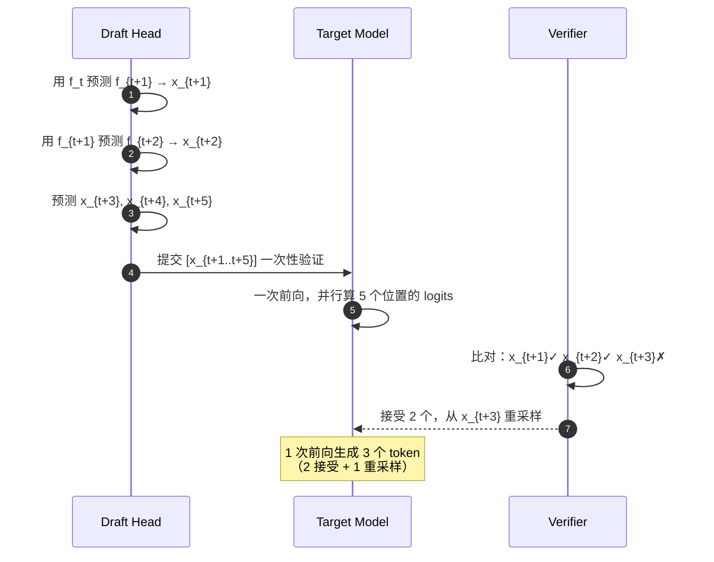
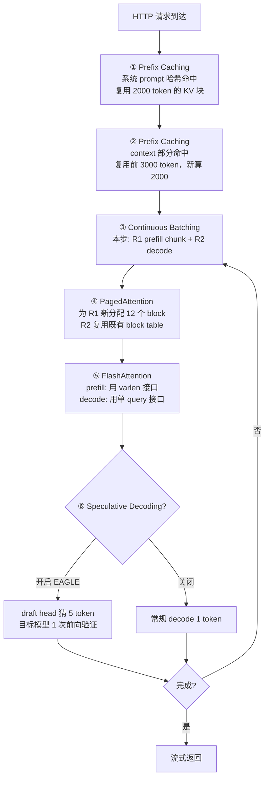

# vLLM 深度解析 · 第二篇：核心算法与原理的具象拆解

> **写作维度**：本文承担"具体观"之职。如果说第一篇是地图，本篇就是放大镜。我们将带着论文与例子，逐一拆解 vLLM 的五大核心算法：PagedAttention、FlashAttention、Continuous Batching / Chunked Prefill、Prefix Caching、Speculative Decoding（EAGLE）。每节都遵循"论文出处 → 核心原理 → 具体例子 → vLLM 代码落点"的递进结构。
>
> **行文风格**：总—分—总，层层递进。先给出五大算法的"原理之总"，再分头深入，最后用一张端到端例子把所有算法串起来。
>
> **配套关系**：本文是三篇系列的中篇。上承第一篇《总观》的整体架构，下启第三篇《深刻观》的设计哲学升华。

---

## 一、总起：五大算法的"原理之总"

vLLM 的性能神话不是单一算法的功劳，而是五条算法脉络的协同。先用一张表把它们的位置和原理概括出来：

| 算法 | 论文出处 | 解决的核心问题 | 一句话原理 |
| --- | --- | --- | --- |
| **PagedAttention** | Kwon et al., SOSP 2023 | KV Cache 的内存碎片与浪费 | 把 KV Cache 切成固定 block，用 block table 做"逻辑→物理"映射，按需分配 |
| **FlashAttention** | Tri Dao et al., NeurIPS 2022 | 注意力计算的 HBM 读写瓶颈 | 分块（tiling）+ online softmax，避免实例化 N×N 注意力矩阵 |
| **Continuous Batching** | Orca (Yu et al., OSDI 2022) | 静态批处理的 GPU 空转 | 每步都可"换人"，请求完成即让位，新请求即时填入 |
| **Prefix Caching** | vLLM design doc | 重复前缀的冗余计算 | 用"父哈希 + 块 token + 附加哈希"做块级哈希链，命中即复用 |
| **Speculative Decoding (EAGLE)** | Li et al., ICML 2024 | 自回归解码的逐 token 串行 | 用轻量 draft head 在特征层预测多 token，目标模型一次前向批量验证 |

它们的协同关系如下图所示：



**图 1.1 说明**：五大算法并非孤立。Prefix Caching 在请求入口就尝试命中；Continuous Batching 决定哪些请求进入下一步 batch；PagedAttention 为它们提供分页式 KV 存储；FlashAttention 是真正执行注意力计算的内核；Speculative Decoding 则在解码阶段加速 token 生成。下面逐一拆解。

---

## 二、PagedAttention：把 OS 分页搬进 GPU

### 2.1 论文与问题

**论文**：*Efficient Memory Management for Large Language Model Serving with PagedAttention* (Kwon et al., SOSP 2023, [arXiv:2309.06180](https://arxiv.org/abs/2309.06180))。

**问题**：在 vLLM 之前，KV Cache 是按"每个请求预分配一段连续显存"管理的。这导致三种浪费：

1. **预留浪费（Reservation waste）**：为最大可能输出长度预留，但多数请求用不满。
2. **内部碎片（Internal fragmentation）**：输出长度不等于预留块大小，留下空隙。
3. **外部碎片（External fragmentation）**：连续分配导致显存空洞。

论文实测：传统系统中 KV Cache 的实际利用率只有 **20.4%–38.2%**，即 60%–80% 被浪费。

### 2.2 核心原理：分页 + 块表

PagedAttention 的灵感直接来自操作系统的虚拟内存分页：

- 把 KV Cache 切成固定大小的 **block**（如 16 个 token 一块）。
- 每个序列维护一张 **block table**：逻辑块号 → 物理块号。
- 物理块在显存中**不需要连续**，按需分配、按需释放。
- 注意力 kernel 根据 block table 随机访问物理块。

类比关系：

| OS 概念 | PagedAttention 对应 |
| --- | --- |
| 页面（Page） | KV Cache block |
| 字节（Byte） | token |
| 进程（Process） | 序列（Sequence/Request） |
| 页表（Page Table） | block table |
| 物理内存 | GPU 显存池 |
| 缺页（Page Fault） | 按需分配新 block |

### 2.3 具体例子：一个序列的 KV 增长

假设 block_size=16，一个请求要生成 38 个 token 的输出。它的 KV Cache 增长过程如下：



**图 2.1 说明**：物理块只在需要时分配。最后一个 block 只用了 6/16，浪费仅此一处——这就是论文说的"近零浪费（<4%）"。注意：在 vLLM v1 中，**只有写满的 block 才会参与 prefix caching 的哈希**（见 [prefix_caching.md](file:///workspace/docs/design/prefix_caching.md) Note 1）。

### 2.4 vLLM 代码落点

PagedAttention 在 vLLM 中由两个层面实现：

- **逻辑层**：[vllm/v1/core/kv_cache_manager.py](file:///workspace/vllm/v1/core/kv_cache_manager.py) 与 [vllm/v1/core/block_pool.py](file:///workspace/vllm/v1/core/block_pool.py) 管理 block 的分配/释放/共享。
- **物理层**：注意力 kernel 读取 block table，访问非连续物理块。kernel 源码在 [csrc/attention/](file:///workspace/csrc/attention/)。

KVCacheBlock 数据结构（[prefix_caching.md](file:///workspace/docs/design/prefix_caching.md) 中简化版）：

```python
class KVCacheBlock:
    block_id: int               # 物理块 ID（不可变）
    block_hash: BlockHash        # 块哈希（写满时赋值，淘汰时重置）
    ref_cnt: int                 # 当前引用计数（CoW 共享的关键）
    prev_free_block: ...         # 空闲链表前驱
    next_free_block: ...         # 空闲链表后继
```

### 2.5 内存共享：Copy-on-Write

PagedAttention 的另一个杀手锏是 **Copy-on-Write（CoW）**。在并行采样中，同一个 prompt 生成多个输出序列，它们的前缀 KV Cache 完全相同。这些序列的 block table 可以指向同一批物理块（`ref_cnt` 加 1）。只有当某个序列要"分叉"写新 token 时，才复制对应物理块。



**图 2.2 说明**：两个序列共享 prompt 的物理块 A、B、C。当它们各自要写新 token 时，C 被复制为 C' 和 C''，A、B 仍共享。这就是 OS 里 fork() 后 CoW 的精确复刻。

---

## 三、FlashAttention：让注意力计算 IO-aware

### 3.1 论文与问题

**论文**：*FlashAttention: Fast and Memory-Efficient Exact Attention with IO-Awareness* (Tri Dao et al., NeurIPS 2022, [arXiv:2205.14135](https://arxiv.org/abs/2205.14135))。

**问题**：标准注意力的计算是：

$$
\text{Attention}(Q, K, V) = \text{softmax}\!\left(\frac{QK^\top}{\sqrt{d_k}}\right)V
$$

中间矩阵 $S = QK^\top$ 和 $P = \text{softmax}(S)$ 都是 $N \times N$，要写到 HBM 再读回来。GPU 的 HBM 带宽（约 1.5–3 TB/s）远低于片上 SRAM（约 19 TB/s），所以注意力是**内存带宽瓶颈**而非算力瓶颈。

### 3.2 核心原理：Tiling + Online Softmax + Recomputation

FlashAttention 用三招破解：

#### 招式一：Tiling（分块）

把 Q、K、V 切成能放进 SRAM 的小块，在片上完成 $QK^\top$ 与 softmax，避免把 $N \times N$ 矩阵落盘到 HBM。

#### 招式二：Online Softmax（在线 softmax）

softmax 需要整行的 max 与 sum。FlashAttention 用一个 trick——**增量式 softmax**——让分块计算成为可能。定义：

$$
m(x) := \max_i x_i, \quad f(x) := [e^{x_1 - m(x)}, \ldots, e^{x_B - m(x)}], \quad \ell(x) := \sum_i f(x)_i
$$

当合并两个分块的统计量 $[x^{(1)}, x^{(2)}]$ 时：

$$
m(x) = \max(m(x^{(1)}), m(x^{(2)}))
$$
$$
f(x) = [e^{m(x^{(1)}) - m(x)} f(x^{(1)}), \; e^{m(x^{(2)}) - m(x)} f(x^{(2)})]
$$
$$
\ell(x) = e^{m(x^{(1)}) - m(x)} \ell(x^{(1)}) + e^{m(x^{(2)}) - m(x)} \ell(x^{(2)})
$$

这样每处理一个新分块，只需更新 $m$ 与 $\ell$ 两个标量，无需回头读历史分块。

#### 招式三：Recomputation（反向重算）

反向传播时不存 $S$、$P$，只存 $m$ 与 $\ell$，反向时在 SRAM 里重算注意力。用计算换显存，且因为 SRAM 极快，反而更快。

### 3.3 具体例子：分块前向

假设 seq_len=1024，head_dim=64，SRAM 能装 64×64 的块。标准注意力要写一个 1024×1024 的 $S$ 到 HBM；FlashAttention 把它切成 16 个 64×64 的小块，全部在 SRAM 内完成 softmax 累加，HBM 上只留下最终的 $O$（1024×64）和两个标量统计量。



**图 3.1 说明**：标准注意力要在 HBM 上反复读写 $N \times N$ 矩阵；FlashAttention 把所有中间结果留在 SRAM，HBM 读写降为 $O(N)$ 量级。这就是它"既快又省显存"的根源。

### 3.4 vLLM 代码落点

vLLM 把 FlashAttention 作为默认注意力后端之一。相关代码：

- 后端实现：[vllm/v1/attention/backends/flash_attn.py](file:///workspace/vllm/v1/attention/backends/flash_attn.py)
- 后端选择器：[vllm/v1/attention/selector.py](file:///workspace/vllm/v1/attention/selector.py)
- 算子封装：[vllm/v1/attention/ops/prefix_prefill.py](file:///workspace/vllm/v1/attention/ops/prefix_prefill.py)

vLLM 在 FlashAttention 之上做了**PagedAttention 适配**——把 block table 传给 kernel，让 FlashAttention 能直接访问分页式 KV。这是两者协同的关键。

---

## 四、Continuous Batching 与 Chunked Prefill

### 4.1 论文与问题

**论文**：*Orca: A Distributed Serving System for Transformer-Based Generative Models* (Yu et al., OSDI 2022)。vLLM 的连续批处理思想直接继承自 Orca。

**问题**：传统静态批处理要等一个 batch 里所有请求都生成完才换下一批。但请求长度差异大——有的 20 token 就结束，有的要 2000 token。短请求会被长请求"绑架"，GPU 大量空转。

### 4.2 核心原理：iteration-level scheduling

Orca 的核心创新是 **iteration-level scheduling**（迭代级调度）：

- 不在"请求级"组 batch，而在"迭代级"组 batch。
- 每一次前向（生成一个 token）后都重新决策：哪些请求继续、哪些请求退出、哪些新请求加入。
- 配合 PagedAttention，新加入的请求只需分配 KV block，无需预留整段显存。

### 4.3 Chunked Prefill：长 prompt 的进一步优化

vLLM 在 Orca 之上又加了 **Chunked Prefill**：长 prompt 被切成多个 chunk，分多步 prefill。这样可以：

- 避免一个超长 prompt 独占整步 GPU，让 decode 请求穿插进来。
- 平衡 prefill（compute-bound）与 decode（memory-bound）的混合执行。

### 4.4 具体例子：动态 batch 的演化

假设 t=0 时刻有 3 个请求同时到达，长度各异。下图展示 batch 在 6 个迭代步中的演化：

```mermaid
gantt
    title 连续批处理：请求随迭代步进出 batch
    dateFormat X
    axisFormat %s
    section R1-短
    在batch : 0, 2
    section R2-中
    在batch : 0, 5
    section R3-长
    在batch : 1, 6
    section R4-新到
    在batch : 3, 6
    section R5-新到
    在batch : 4, 6
```



**图 4.1 说明**：R1 在第 2 步完成退出，R4 在第 3 步加入，R5 在第 4 步加入。整个过程中 GPU 始终保持高占用，没有"等齐"的浪费。这正是连续批处理的精髓。

### 4.5 vLLM 代码落点

连续批处理的核心在 [vllm/v1/core/sched/scheduler.py](file:///workspace/vllm/v1/core/sched/scheduler.py) 的 `Scheduler` 类。从源码可看到它维护了几个关键队列：

```python
# 伪代码（简化自 scheduler.py）
class Scheduler:
    def __init__(self, ...):
        self.waiting: RequestQueue          # 等待 prefill 的请求
        self.running: list[Request]         # 正在 decode 的请求
        self.max_num_running_reqs: int      # 最大并发
        self.max_num_scheduled_tokens: int  # 单步最大 token 数

    def schedule(self) -> SchedulerOutput:
        # 1. 检查 running 中已完成的请求，移出
        # 2. 抢占超限的请求（preemption）
        # 3. 把 waiting 中的请求尽可能塞进 running
        # 4. 计算每个请求本步要跑多少 token（chunked prefill）
        ...
```

调度结果 `SchedulerOutput` 会被送到 Worker 执行。这套机制让 vLLM 在每一步都能动态重组 batch。

---

## 五、Prefix Caching：哈希链复用前缀

### 5.1 论文与问题

**论文/文档**：vLLM 的 prefix caching 没有独立论文，但设计文档 [docs/design/prefix_caching.md](file:///workspace/docs/design/prefix_caching.md) 描述得很详细。同类思想见 SGLang 的 RadixAttention。

**问题**：很多请求共享相同前缀——比如同一个 system prompt、同一段文档、同一个 few-shot 示例。重复计算这些前缀的 KV Cache 是巨大浪费。

### 5.2 核心原理：基于哈希链的块复用

vLLM 选择**哈希链**方案。每个 block 的哈希由三部分组成：

1. **父块哈希**：上一个块的哈希值（构成链）。
2. **块内 token 序列**：本块内的 token id 元组。
3. **附加哈希**：LoRA ID、多模态哈希、cache_salt 等。

即 `block_hash = hash(tuple(parent_hash, block_tokens, extra_hashes))`。

这种链式哈希保证了：**前缀相同 → 哈希链相同 → 物理块可复用**。

### 5.3 具体例子：三个共享前缀的请求

假设有三个请求，前缀如下：

```text
Block 1            Block 2            Block 3
[A gentle breeze] [stirred the leaves] [as children laughed]
```

- 请求 A 的 prompt = `[A gentle breeze stirred the leaves as children laughed]`
- 请求 B 的 prompt = `[A gentle breeze stirred the leaves the dog barked]`
- 请求 C 的 prompt = `[A gentle breeze stirred the leaves as children laughed loudly]`

它们的哈希链与物理块复用情况：



**图 5.1 说明**：请求 A 完全命中三个块；请求 B 命中前两个块，第三个块因 token 不同需新计算；请求 C 命中三个块，第四个块是部分块（未写满，不参与哈希），需新计算。这就是"只缓存满块"的设计。

### 5.4 多模态与安全增强

prefix caching 还支持两个增强：

- **多模态**：图像/视频被替换为 placeholder token，但哈希中包含 image_hash，确保不同图像不混淆。
- **cache_salt**：用户可在请求中传入 `cache_salt`，注入第一个块的哈希，实现**租户隔离**——防止通过延迟差推断他人缓存内容（时序攻击）。

### 5.5 vLLM 代码落点

- 数据结构：[vllm/v1/core/kv_cache_manager.py](file:///workspace/vllm/v1/core/kv_cache_manager.py) 中的 `KVCacheBlock`。
- 哈希计算：[vllm/v1/core/kv_cache_utils.py](file:///workspace/vllm/v1/core/kv_cache_utils.py)。
- 全局命中查询：通过 `BlockPool` 维护 `cached_block_hash_to_block` 字典。
- 配置：`--prefix-caching-hash-algo` 可选 `sha256` / `sha256_cbor` / `xxhash` / `xxhash_cbor`。

---

## 六、Speculative Decoding 与 EAGLE：让解码并行

### 6.1 论文与问题

**论文**：*EAGLE: Speculative Sampling Requires Rethinking Feature Uncertainty* (Li et al., ICML 2024, [arXiv:2401.15077](https://arxiv.org/abs/2401.15077))。

**问题**：自回归解码每个前向只生成 1 个 token，GPU 算力严重浪费（decode 是 memory-bound）。能否让一个前向生成多个 token？

**投机解码（Speculative Decoding）** 的基本思路：

1. 用一个轻量 **draft model** 先猜 γ 个 token。
2. 用 **target model** 一次前向验证这 γ 个 token（并行，因为已知位置）。
3. 接受最长正确前缀，从第一个错误处重新采样。

它是**无损**的——输出分布与目标模型完全一致。

### 6.2 EAGLE 的核心创新：Feature-level Autoregression

EAGLE 的关键洞察是：**token 级预测不确定性高，但 feature 级（倒数第二层隐状态）预测相对确定**。

直觉：下一个 token 可能是 "cat" 也可能是 "dog"，但它们的 feature 向量在高维空间里很接近。所以预测下一个 feature 比预测下一个 token 容易得多。

EAGLE 的 draft head 结构：

$$
\mathbf{h}_t = \text{FC}([\mathbf{f}_t; \mathbf{e}(x_t)])
$$
$$
\mathbf{f}_{t+1}^{\text{draft}} = \text{TransformerBlock}(\mathbf{h}_t)
$$

其中 $\mathbf{f}_t$ 是目标模型的特征，$\mathbf{e}(x_t)$ 是 token embedding。draft head 复用目标模型的 embedding 与 LM head，只训练中间一个 FC + 1 个 Transformer block。

### 6.3 具体例子：5-token 投机

假设 γ=5，目标模型当前在 $x_t$：



**图 6.1 说明**：若 draft 全对，1 次目标前向得到 6 个 token（5 接受 + 1 续接）；若有错，至少也能拿到正确前缀。论文实测 EAGLE 在 LLaMA-2-Chat 70B 上达到 **2.7x–3.5x** 延迟加速。

### 6.4 EAGLE-2 / EAGLE-3 的演进

- **EAGLE-2**（EMNLP 2024）：把静态 draft 树改成**动态 draft 树**，用 draft logprob 的置信度做 beam search 调整树结构。
- **EAGLE-3**（NeurIPS 2025）：放弃 feature 预测，改用**多层语义融合 + 直接 token 预测**，加速比进一步提升到 6.5x。

### 6.5 vLLM 代码落点

- 通用框架：[vllm/v1/spec_decode/](file:///workspace/vllm/v1/spec_decode/)
- EAGLE 实现：[vllm/v1/spec_decode/eagle.py](file:///workspace/vllm/v1/spec_decode/eagle.py)
- Worker 端验证：[vllm/v1/worker/spec_decode/eagle/](file:///workspace/vllm/v1/worker/spec_decode/eagle/)
- 拒绝采样：[vllm/v1/sample/rejection_sampler.py](file:///workspace/vllm/v1/sample/rejection_sampler.py)
- 其他变体：[ngram_proposer.py](file:///workspace/vllm/v1/spec_decode/ngram_proposer.py)、[medusa.py](file:///workspace/vllm/v1/spec_decode/medusa.py)、[suffix_decoding.py](file:///workspace/vllm/v1/spec_decode/suffix_decoding.py)、[dflash.py](file:///workspace/vllm/v1/spec_decode/dflash.py)

---

## 七、五大算法协同的端到端例子

把五大算法放在一个真实场景里看它们如何协同。假设用户向 vLLM 服务发起一个 RAG 请求：

```text
[System: 你是一个医学问答助手...（2000 token 固定前缀）]
[Context: 某医学文献摘要...（5000 token，与上一用户共享）]
[User: 这种病的早期症状是什么？]
```

它的处理流程：



**图 7.1 说明**：① ② Prefix Caching 在入口就省下大量计算；③ Continuous Batching 让 R1 的 prefill 与 R2 的 decode 同步进行；④ PagedAttention 让两者的 KV block 共存于同一显存池；⑤ FlashAttention 真正执行注意力；⑥ EAGLE 把 decode 的"1 token/前向"提升到"3-5 token/前向"。五大算法层层叠加，才有了 vLLM 的吞吐神话。

---

## 八、使用指南：如何开启这些算法

### 8.1 开启 Prefix Caching

```bash
vllm serve Qwen/Qwen2.5-7B-Instruct \
    --enable-prefix-caching \
    --prefix-caching-hash-algo sha256
```

API 请求中可加 `cache_salt` 实现租户隔离：

```json
{
  "messages": [{"role": "user", "content": "..."}],
  "cache_salt": "tenant-A-secure-key"
}
```

### 8.2 控制 Continuous Batching 参数

```bash
vllm serve ... \
    --max-num-seqs 256 \
    --max-num-batched-tokens 8192 \
    --enable-chunked-prefill
```

- `--max-num-seqs`：最大并发请求数。
- `--max-num-batched-tokens`：单步最大 token 数（含 prefill + decode）。
- `--enable-chunked-prefill`：开启 chunked prefill（默认开启）。

### 8.3 开启 EAGLE 投机解码

```bash
vllm serve meta-llama/Llama-3.1-8B-Instruct \
    --speculative-model "[eagle]" \
    --num-speculative-tokens 5 \
    --speculative-draft-tensor-parallel-size 1
```

### 8.4 选择注意力后端

通过环境变量强制指定：

```bash
VLLM_ATTENTION_BACKEND=FLASH_ATTN vllm serve ...
# 或 FLASHINFER / TRTLLM / TIK / XFORMERS
```

### 8.5 监控指标

vLLM 暴露 Prometheus 指标，关键项：

- `vllm:time_to_first_token_seconds`：首 token 延迟。
- `vllm:time_per_output_token_seconds`：每 token 延迟。
- `vllm:request_inference_time_seconds`：请求总耗时。
- `vllm:num_preemption`：抢占次数（过高说明显存压力）。
- `vllm:gpu_cache_usage_perc`：KV Cache 占用率。
- `vllm:spec_decode_accepted_tokens` / `vllm:spec_decode_draft_tokens`：投机解码命中率。

---

## 九、总收：五句话记住五大算法

把全文压成五句话，作为读者带走的"具体观"：

1. **PagedAttention** 把 KV Cache 切成 block，用 block table 做"逻辑→物理"映射，把显存浪费从 60%–80% 压到 <4%。
2. **FlashAttention** 用 tiling + online softmax，把 N×N 注意力矩阵留在 SRAM，让 HBM 读写从 $O(N^2)$ 降到 $O(N)$。
3. **Continuous Batching** 用迭代级调度，每步都可换人，让短请求不再被长请求绑架，GPU 持续满载。
4. **Prefix Caching** 用"父哈希 + 块 token + 附加哈希"的链式哈希，让共享前缀的请求免算 KV。
5. **EAGLE** 用特征级 draft + 批量验证，把 decode 的"1 token/前向"提升到"3–5 token/前向"，且无损。

---

## 十、本篇小结与下篇预告

本篇以"具体观"为题，逐一拆解了 PagedAttention、FlashAttention、Continuous Batching、Prefix Caching、EAGLE 五大算法的论文出处、核心原理、具体例子与 vLLM 代码落点。读者至此应能回答：

- 每个算法解决什么问题？
- 它的原理是什么？用一个例子怎么讲清？
- 在 vLLM 代码里它落在哪个文件？

但"具体"还不够。第三篇《深刻观》将从这些具体算法中抽离出 vLLM 的设计哲学——为什么是 OS 思维？为什么是显存优先？为什么是分层抽象？——并把核心主题升华到让人"永不忘记"的程度。

> **上一篇**：[01_总观_vLLM项目定位与整体架构.md](file:///workspace/ReadCode/01_总观_vLLM项目定位与整体架构.md)
> **下一篇**：[03_深刻观_设计哲学与升华.md](file:///workspace/ReadCode/03_深刻观_设计哲学与升华.md)

---

## 参考资料

- PagedAttention: Kwon et al., *Efficient Memory Management for Large Language Model Serving with PagedAttention*, SOSP 2023. [arXiv:2309.06180](https://arxiv.org/abs/2309.06180)
- FlashAttention: Tri Dao et al., *FlashAttention: Fast and Memory-Efficient Exact Attention with IO-Awareness*, NeurIPS 2022. [arXiv:2205.14135](https://arxiv.org/abs/2205.14135)
- Orca: Yu et al., *Orca: A Distributed Serving System for Transformer-Based Generative Models*, OSDI 2022.
- EAGLE: Li et al., *EAGLE: Speculative Sampling Requires Rethinking Feature Uncertainty*, ICML 2024. [arXiv:2401.15077](https://arxiv.org/abs/2401.15077)
- EAGLE-2: Li et al., *EAGLE-2: Faster Inference of Language Models with Dynamic Draft Trees*, EMNLP 2024. [arXiv:2406.16858](https://arxiv.org/abs/2406.16858)
- vLLM Prefix Caching 设计文档：[docs/design/prefix_caching.md](file:///workspace/docs/design/prefix_caching.md)
- vLLM PagedAttention 设计文档：[docs/design/paged_attention.md](file:///workspace/docs/design/paged_attention.md)
