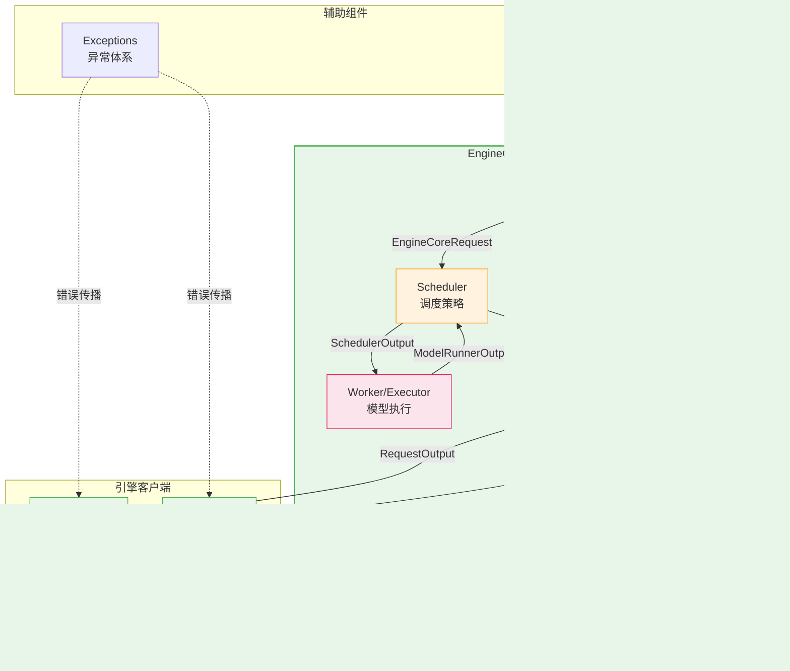
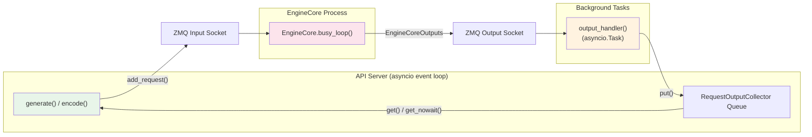
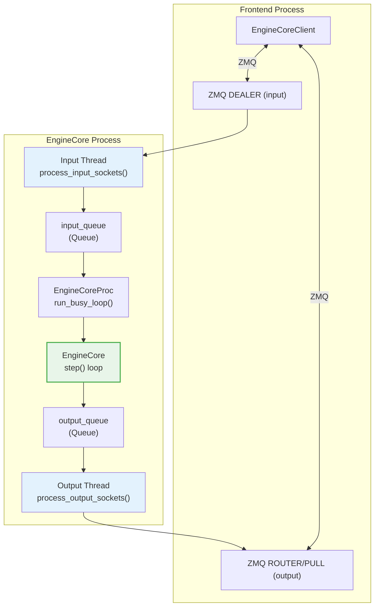
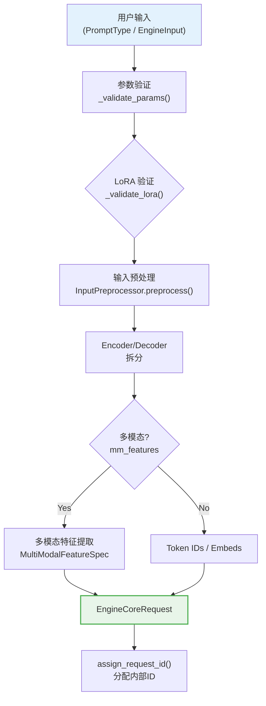
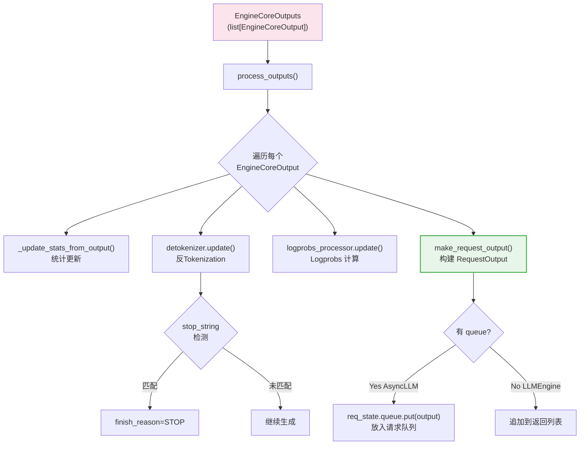
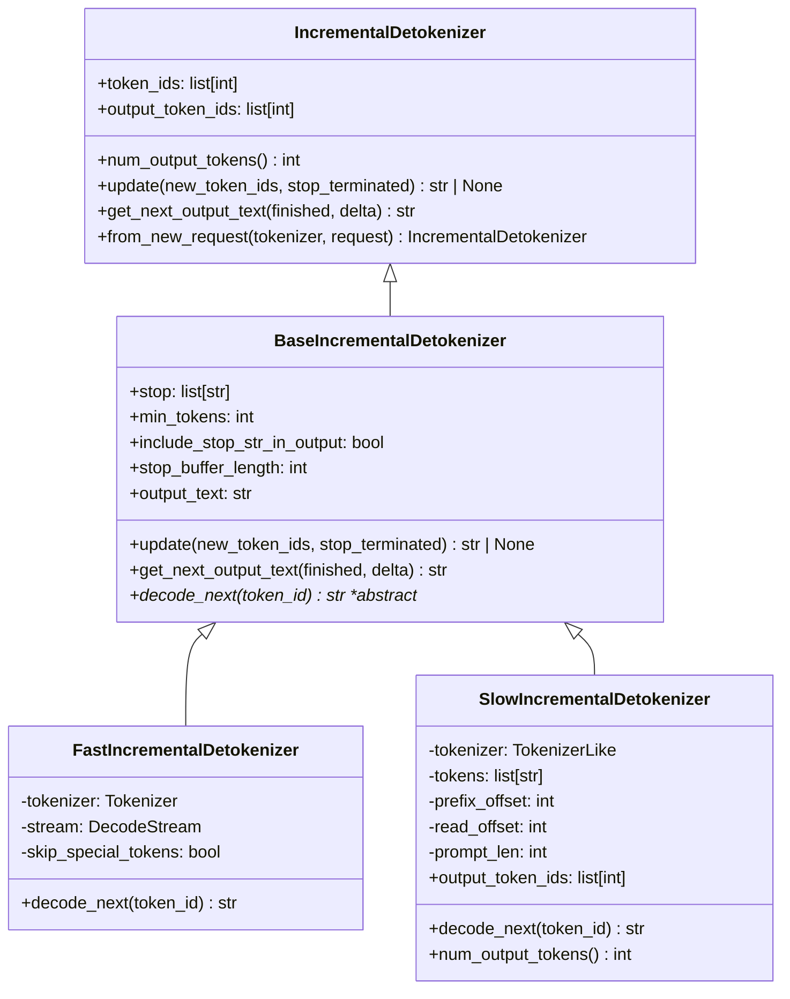
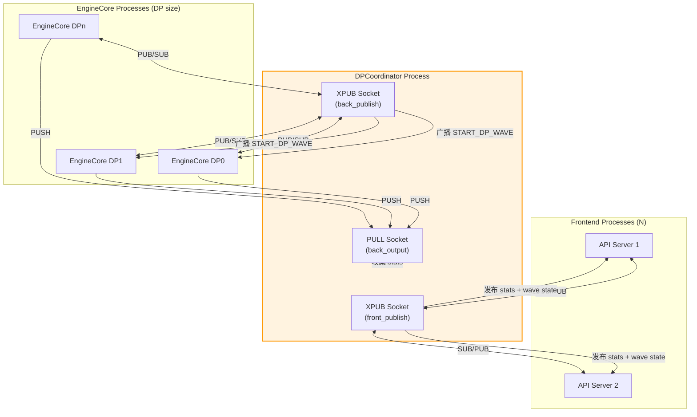
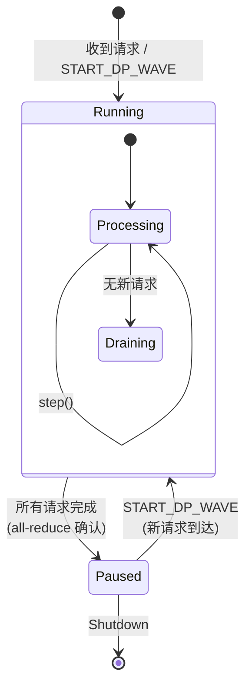
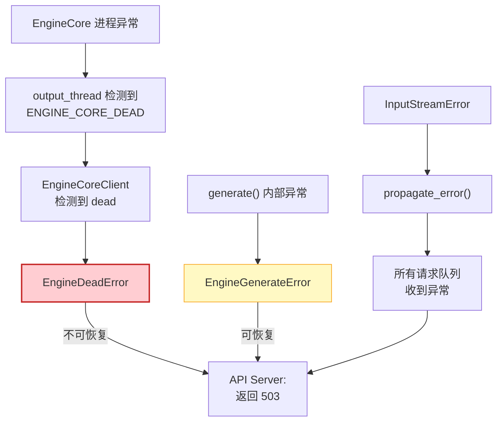
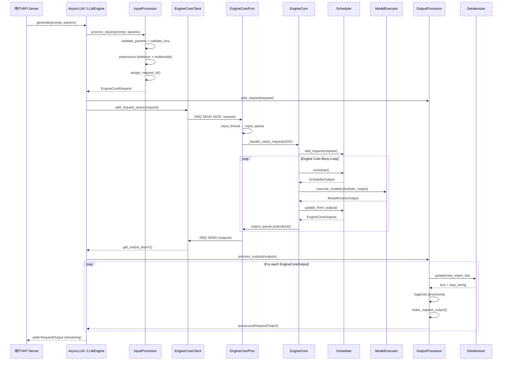

# vLLM 引擎核心（Engine Core）深度分析

> **定位**：本文档深入分析 vLLM V1 架构中引擎层（Engine Layer）的核心实现，涵盖从请求输入到模型推理再到输出返回的完整数据流管线。引擎层是 vLLM 的中枢神经，负责协调调度器（Scheduler）、执行器（Executor）、输入预处理器（InputProcessor）和输出后处理器（OutputProcessor）等关键组件。



---

## 目录

- [一、LLMEngine 类](#一llmengine-类)
  - [1.1 初始化流程](#11-初始化流程)
  - [1.2 核心方法分析](#12-核心方法分析)
  - [1.3 与 EngineCoreClient 的交互](#13-与-enginecoreclient-的交互)
- [二、AsyncLLM 异步引擎](#二asyncllm-异步引擎)
  - [2.1 异步架构设计](#21-异步架构设计)
  - [2.2 高级 API 封装](#22-高级-api-封装)
  - [2.3 Output Handler 后台循环](#23-output-handler-后台循环)
- [三、EngineCore 解耦执行循环](#三enginecore-解耦执行循环)
  - [3.1 EngineCore 基类](#31enginecore-基类)
  - [3.2 EngineCoreProc 进程封装](#32enginecoreproc-进程封装)
  - [3.3 核心调度-执行循环](#33-核心调度-执行循环)
  - [3.4 数据流详解](#34-数据流详解)
- [四、InputProcessor 请求预处理](#四inputprocessor-请求预处理)
- [五、OutputProcessor 输出后处理](#五outputprocessor-输出后处理)
- [六、Detokenizer 异步反 Tokenization](#六detokenizer-异步反-tokenization)
- [七、Coordinator 多节点协调](#七coordinator-多节点协调)
- [八、异常处理机制](#八异常处理机制)
- [附录：处理管线完整数据流图](#附录处理管线完整数据流图)

---

## 一、LLMEngine 类

**源码文件**：[llm_engine.py](file:///workspace/vllm/v1/engine/llm_engine.py)

`LLMEngine` 是 vLLM V1 向后兼容的**同步引擎入口**，对外暴露与 V0 兼容的 API 接口，内部通过 `EngineCoreClient` 与运行在独立进程中的 `EngineCore` 通信。

### 1.1 初始化流程

初始化遵循 **配置解析 → Executor 选择 → Worker 创建 → 组件装配** 的链路：

```python
# llm_engine.py L50-132
class LLMEngine:
    """Legacy LLMEngine for backwards compatibility."""

    def __init__(self, vllm_config, executor_class, log_stats, ...):
        # ① 配置解析
        self.vllm_config = vllm_config
        self.model_config = vllm_config.model_config

        # ② 初始化 tracing（可选）
        tracing_endpoint = self.observability_config.otlp_traces_endpoint
        if tracing_endpoint is not None:
            init_tracer("vllm.llm_engine", tracing_endpoint)

        # ③ Data Parallel 组初始化（非 multiprocess 模式）
        if (not multiprocess_mode and parallel_config.data_parallel_size > 1
                and not self.external_launcher_dp):
            self.dp_group = parallel_config.stateless_init_dp_group()

        # ④ 创建 Renderer（负责 tokenization 和 multimodal 处理）
        self.renderer = renderer_from_config(self.vllm_config)

        # ⑤ 创建 InputProcessor —— 将 EngineInput 转换为 EngineCoreRequest
        self.input_processor = InputProcessor(self.vllm_config, renderer)   # L93

        # ⑥ 创建 OutputProcessor —— 将 EngineCoreOutputs 转换为 RequestOutput
        self.output_processor = OutputProcessor(                               # L96
            renderer.tokenizer,
            log_stats=self.log_stats,
            stream_interval=...,
            tracing_enabled=...,
        )

        # ⑦ 创建 EngineCoreClient —— 与后台 EngineCore 进程通信
        self.engine_core = EngineCoreClient.make_client(                      # L104
            multiprocess_mode=multiprocess_mode,
            asyncio_mode=False,
            vllm_config=vllm_config,
            executor_class=executor_class,
            log_stats=self.log_stats,
        )

        # ⑧ 统计日志管理器（可选）
        if self.log_stats:
            self.logger_manager = StatLoggerManager(...)
```

**初始化组件关系图**：

| 组件 | 职责 | 对应源码位置 |
|------|------|-------------|
| `Renderer` | Tokenization + Multimodal 输入渲染 | [L90](file:///workspace/vllm/v1/engine/llm_engine.py#L90) |
| `InputProcessor` | 原始输入 → `EngineCoreRequest` | [L93](file:///workspace/vllm/v1/engine/llm_engine.py#L93) |
| `OutputProcessor` | `EngineCoreOutputs` → `RequestOutput` | [L96](file:///workspace/vllm/v1/engine/llm_engine.py#L96) |
| `EngineCoreClient` | 与后台 EngineCore 进程的 IPC 通信 | [L104](file:///workspace/vllm/v1/engine/llm_engine.py#L104) |
| `StatLoggerManager` | 性能指标收集与日志 | [L114](file:///workspace/vllm/v1/engine/llm_engine.py#L114) |

### 1.2 核心方法分析

#### 1.2.1 `add_request()` — 添加推理请求

这是用户提交推理请求的入口点。完整流程包含**输入验证 → 预处理 → 请求分发**：

```python
# llm_engine.py L209-285
def add_request(self, request_id, prompt, params, arrival_time=None, ...):
    # ① 验证 request_id 类型
    if not isinstance(request_id, str):
        raise TypeError(f"request_id must be a string...")

    # ② 如果传入的是已处理的 EngineCoreRequest（已废弃方式）
    if isinstance(prompt, EngineCoreRequest):
        request = prompt   # L233
    else:
        # ③ 通过 InputProcessor 将原始输入转换为 EngineCoreRequest
        request = self.input_processor.process_inputs(     # L241
            request_id, prompt, params,
            supported_tasks=self.get_supported_tasks(),
            arrival_time=arrival_time,
            lora_request=lora_request,
            ...
        )

    # ④ 分配内部 request_id（追加随机后缀保证唯一性）
    self.input_processor.assign_request_id(request)         # L254

    # ⑤ 获取采样参数
    params = request.params
    n = params.n if isinstance(params, SamplingParams) else 1

    if n == 1:
        # ⑥ 单采样：直接添加到 OutputProcessor 和 EngineCore
        self.output_processor.add_request(request, ...)     # L265
        self.engine_core.add_request(request)               # L267
        return req_id

    # ⑦ n>1 并行采样：Fan-out 为多个子请求
    parent_req = ParentRequest(request)                     # L271
    for idx in range(n):
        request_id, child_params = parent_req.get_child_info(idx)
        child_request = request if idx == n - 1 else copy(request)
        child_request.request_id = request_id
        child_request.sampling_params = child_params
        self.output_processor.add_request(child_request, ...)
        self.engine_core.add_request(child_request)          # L283
    return req_id
```

**关键设计要点**：
- **n>1 并行采样**通过 [`ParentRequest`](file:///workspace/vllm/v1/engine/parallel_sampling.py) 实现 Fan-out 模式，每个子请求拥有独立的 sampling seed
- 内部 request_id 通过 [`assign_request_id()`](file:///workspace/vllm/v1/engine/input_processor.py#L214-L232) 追加 8 位随机 UUID，避免外部 ID 冲突

#### 1.2.2 `step()` — 执行一步推理

`step()` 是引擎的核心调度循环方法，每次调用完成一次完整的 **schedule → execute → output** 流水线：

```python
# llm_engine.py L287-325
def step(self) -> list[RequestOutput | PoolingRequestOutput]:
    # ① Dummy batch 处理（DP 场景下某些 rank 可能需要空转）
    if self.should_execute_dummy_batch:
        self.should_execute_dummy_batch = False
        self.engine_core.execute_dummy_batch()
        return []

    # ② 从 EngineCore 获取输出
    with record_function_or_nullcontext("llm_engine step: get_output"):
        outputs = self.engine_core.get_output()              # L295

    # ③ 通过 OutputProcessor 处理输出（detokenize + logprobs + 构建 RequestOutput）
    with record_function_or_nullcontext("llm_engine step: process_outputs"):
        iteration_stats = IterationStats() if self.log_stats else None
        processed_outputs = self.output_processor.process_outputs(  # L300
            outputs.outputs,
            engine_core_timestamp=outputs.timestamp,
            iteration_stats=iteration_stats,
        )
        self.output_processor.update_scheduler_stats(outputs.scheduler_stats)

    # ④ 中止因 stop string 匹配而完成的请求
    with record_function_or_nullcontext("llm_engine step: abort_requests"):
        self.engine_core.abort_requests(processed_outputs.reqs_to_abort)  # L309

    # ⑤ 记录统计信息
    with record_function_or_nullcontext("llm_engine step: record_stats"):
        if self.logger_manager is not None and ...:
            self.logger_manager.record(...)

    return processed_outputs.request_outputs                    # L325
```

#### 1.2.3 `abort_request()` — 中止请求

```python
# llm_engine.py L203-207
def abort_request(self, request_ids: list[str], internal: bool = False) -> None:
    """Remove request_ids from EngineCore and Detokenizer."""
    # 先在 OutputProcessor 中清理状态并生成 abort 输出
    request_ids = self.output_processor.abort_requests(request_ids, internal)
    # 再通知 EngineCore 中止对应请求
    self.engine_core.abort_requests(request_ids)
```

中止操作是**双轨制**的：同时在 OutputProcessor（前端状态机）和 EngineCore（后端调度器）中清理。

### 1.3 与 EngineCoreClient 的交互

`LLMEngine` 不直接操作 `EngineCore`，而是通过 [`EngineCoreClient`](file:///workspace/vllm/v1/engine/core_client.py) 抽象层进行通信。根据运行模式不同，`EngineCoreClient` 有三种实现：

| Client 类型 | 使用场景 | 通信方式 |
|------------|---------|---------|
| `InprocClient` | 进程内调试 | 直接函数调用 |
| `SyncMPClient` | `LLMEngine` 同步模式 | ZMQ + 后台进程 |
| `AsyncMPClient` | `AsyncLLM` 异步模式 | ZMQ + asyncio |

```python
# core_client.py L69-78 (节选)
class EngineCoreClient(ABC):
    """
    Subclasses:
    * InprocClient: In process EngineCore (for V0-style LLMEngine use)
    * SyncMPClient: ZMQ + background proc EngineCore (for LLM)
    * AsyncMPClient: ZMQ + background proc EngineCore w/ asyncio (for AsyncLLM)
    """
```

---

## 二、AsyncLLM 异步引擎

**源码文件**：[async_llm.py](file:///workspace/vllm/v1/engine/async_llm.py)

`AsyncLLM` 是 vLLM V1 的**异步引擎实现**，实现了 [`EngineClient`](file:///workspace/vllm/engine/protocol.py) 协议，专为高并发 API 服务场景设计。

### 2.1 异步架构设计



**初始化核心差异**（对比 `LLMEngine`）：

```python
# async_llm.py L73-153 (节选)
class AsyncLLM(EngineClient):
    def __init__(self, vllm_config, executor_class, log_stats, ...):
        # ...（配置初始化与 LLMEngine 类似）

        # 关键差异：使用 make_async_mp_client 创建异步客户端
        self.engine_core = EngineCoreClient.make_async_mp_client(  # L146
            vllm_config=vllm_config,
            executor_class=executor_class,
            log_stats=self.log_stats,
            client_addresses=client_addresses,
            client_count=client_count,
            client_index=client_index,
        )

        # output_handler: 后台 asyncio task，持续从 EngineCore 拉取输出
        self.output_handler: asyncio.Task | None = None
        try:
            asyncio.get_running_loop()
            self._run_output_handler()      # L174: 立即启动
        except RuntimeError:
            pass                            # event loop 未就绪时延迟启动
```

### 2.2 高级 API 封装

#### 2.2.1 `generate()` — 流式生成 API

[`generate()`](file:///workspace/vllm/v1/engine/async_llm.py#L524-L636) 是 AsyncLLM 最核心的方法，封装了**请求提交 → 流式输出 → 异常处理**的完整生命周期：

```python
# async_llm.py L524-636
async def generate(self, prompt, sampling_params, request_id, *,
                   lora_request=None, ...) -> AsyncGenerator[RequestOutput, None]:
    q: RequestOutputCollector | None = None
    try:
        # ① 提交请求（内部调用 add_request）
        q = await self.add_request(request_id, prompt, sampling_params, ...)  # L559

        # ② 从队列中流式拉取输出
        finished = False
        while not finished:
            # 优先非阻塞读取（避免不必要的 task switch）
            out = q.get_nowait() or await q.get()       # L579

            assert isinstance(out, RequestOutput)
            finished = out.finished
            if out is not STREAM_FINISHED:
                yield out                                  # L586: yield 给调用方

    except (asyncio.CancelledError, GeneratorExit):         # L591
        # 客户端断开连接 → 自动 abort
        if q is not None:
            await self.abort(q.request_id, internal=True)
        raise

    except EngineDeadError:                                 # L599
        # EngineCore 死亡 → 不可恢复
        raise

    except InputStreamError as e:                           # L611
        # 输入流异常 → 直接传播原始原因
        raise e.cause from e

    except Exception as e:                                  # L619
        # 其他异常 → 包装为 EngineGenerateError（可恢复）
        raise EngineGenerateError() from e
    finally:
        if q is not None:
            q.close()                                      # L635: 清理资源
```

**异常处理层次**：

| 异常类型 | 含义 | 可恢复性 | 处理方式 |
|---------|------|---------|---------|
| `CancelledError` | 客户端断开 | - | abort 请求 |
| `EngineDeadError` | EngineCore 进程崩溃 | 不可恢复 | 直接抛出 |
| `InputStreamError` | 输入流生成器异常 | - | 传播原始异常 |
| `ValueError` | 参数校验失败 | - | 直接抛出 |
| `EngineGenerateError` | 推理过程异常 | 可恢复 | 包装后抛出 |

#### 2.2.2 `add_request()` — 异步请求添加

支持**普通请求**和**流式输入（Streaming Input）**两种模式：

```python
# async_llm.py L280-398
async def add_request(self, request_id, prompt, params, ...) -> RequestOutputCollector:
    if self.errored:
        raise EngineDeadError()

    # 流式输入场景：prompt 是 AsyncGenerator[StreamingInput]
    if isinstance(prompt, AsyncGenerator):                  # L316
        return await self._add_streaming_input_request(...)

    # 普通请求：通过 InputProcessor 预处理
    request = self.input_processor.process_inputs(...)      # L349

    # 创建该请求专用的输出收集队列
    queue = RequestOutputCollector(params.output_kind, request.request_id)  # L376

    # n>1 时 fan-out 子请求
    if is_pooling or params.n == 1:
        await self._add_request(request, ..., queue)
        return queue

    parent_request = ParentRequest(request)
    for idx in range(parent_params.n):
        ...
        await self._add_request(child_request, ..., queue)
    return queue
```

**流式输入（Streaming Input）**是一种高级特性，允许在模型推理过程中逐步提供输入（如逐 chunk 发送长文档）。其实现通过 `_add_streaming_input_request()` 方法创建一个后台 task 来消费输入流：

```python
# async_llm.py L417-501
async def _add_streaming_input_request(self, input_stream, ...):
    async def handle_inputs():
        cancelled = False
        try:
            async for input_chunk in input_stream:           # L461: 逐步消费
                req = self.input_processor.process_inputs(
                    request_id=internal_req_id,
                    prompt=input_chunk.prompt,               # 每个 chunk 独立处理
                    ...
                )
                await self._add_request(req, ..., queue)
        except Exception as error:
            queue.put(InputStreamError(error))               # L489: 错误传播
        finally:
            # 发送最终空请求标记输入结束
            await self._add_request(final_req, None, None, 0, queue)  # L495

    queue._input_stream_task = asyncio.create_task(handle_inputs())  # L500
    return queue
```

### 2.3 Output Handler 后台循环

[`_run_output_handler()`](file:///workspace/vllm/v1/engine/async_llm.py#L637-L707) 是 AsyncLLM 的**心脏**——一个在后台持续运行的 asyncio Task，负责从 EngineCore 拉取输出并分发给各请求的输出队列：

```python
# async_llm.py L637-707
def _run_output_handler(self):
    """Background loop: pulls from EngineCore and pushes to AsyncStreams."""
    if self.output_handler is not None:
        return

    # 捕获引用避免循环引用（确保可被 GC 回收）
    engine_core = self.engine_core
    output_processor = self.output_processor
    logger_ref = [self.logger_manager]        # 可变引用，支持 elastic EP 更新
    chunk_size = envs.VLLM_V1_OUTPUT_PROC_CHUNK_SIZE

    async def output_handler():
        try:
            while True:
                # ① 异步从 EngineCore 获取一批输出
                outputs = await engine_core.get_output_async()    # L660

                # ② 分片处理（避免长时间阻塞事件循环）
                engine_core_outputs = outputs.outputs
                for start in range(0, num_outputs, chunk_size):
                    end = start + chunk_size
                    outputs_slice = engine_core_outputs[start:end]

                    # ③ 处理输出：detokenize + logprobs + 分发到各请求队列
                    processed_outputs = output_processor.process_outputs(
                        outputs_slice, outputs.timestamp, iteration_stats
                    )
                    # 注意：processed_outputs.request_outputs 为空
                    # 因为输出已被 put 到各请求的 RequestOutputCollector 队列

                    # ④ 让出控制权给其他 asyncio task
                    if end < num_outputs:
                        await asyncio.sleep(0)                    # L683

                    # ⑤ 中止 stop string 匹配的请求
                    if processed_outputs.reqs_to_abort:
                        await engine_core.abort_requests_async(
                            processed_outputs.reqs_to_abort
                        )

                # ⑥ 记录统计日志
                if logger_ref[0]:
                    logger_ref[0].record(...)
        except Exception as e:
            logger.exception("AsyncLLM output_handler failed.")
            output_processor.propagate_error(e)                 # L705: 广播错误

    self.output_handler = asyncio.create_task(output_handler())  # L707
```

**关键设计**：
- **分片处理**（chunk_size）：防止单次 `process_outputs()` 处理过多输出导致事件循环阻塞
- **无循环引用**：通过局部变量捕获 + mutable list 引用实现
- **错误广播**：`propagate_error()` 将错误放入所有活跃请求的队列

---

## 三、EngineCore 解耦执行循环

**源码文件**：[core.py](file:///workspace/vllm/v1/engine/core.py)

`EngineCore` 是 vLLM V1 的**解耦执行循环核心**，实现了 schedule → execute → update 的完整推理管线。它被设计为运行在独立进程中（通过 `EngineCoreProc` 包装），通过 ZMQ 与前端通信。

### 3.1 EngineCore 基类

```python
# core.py L91-229 (节选)
class EngineCore:
    """Inner loop of vLLM's Engine."""

    def __init__(self, vllm_config, executor_class, log_stats, ...):
        # ① 加载插件
        load_general_plugins()                                   # L103

        # ② 创建 ModelExecutor（决定分布式执行策略）
        self.model_executor = executor_class(vllm_config)        # L118

        # ③ 初始化 KV Cache（含 memory profiling）
        kv_cache_config = self._initialize_kv_caches(vllm_config)# L128

        # ④ 创建 Scheduler（调度策略）
        Scheduler = vllm_config.scheduler_config.get_scheduler_cls()
        self.scheduler: SchedulerInterface = Scheduler(          # L145
            vllm_config=vllm_config,
            kv_cache_config=kv_cache_config,
            ...
        )

        # ⑤ Pipeline Parallelism 批次队列
        self.batch_queue_size = self.model_executor.max_concurrent_batches
        if self.batch_queue_size > 1:
            self.batch_queue = deque(maxlen=self.batch_queue_size)# L194

        # ⑥ 选择 step 函数（普通 vs batch_queue 模式）
        self.step_fn = (
            self.step if self.batch_queue is None
            else self.step_with_batch_queue                       # L214
        )
```

#### KV Cache 初始化流程

[`_initialize_kv_caches()`](file:///workspace/vllm/v1/engine/core.py#L232-L310) 是引擎启动中最关键的步骤之一：

```python
# core.py L232-310
@instrument(span_name="Prepare model")
def _initialize_kv_caches(self, vllm_config) -> KVCacheConfig:
    # ① 获取模型所需的 KV cache 规格
    kv_cache_specs = self.model_executor.get_kv_cache_specs()    # L236

    # ② Memory profiling：确定可用 GPU 内存
    available_gpu_memory = self.model_executor.determine_available_memory()  # L250
    self.available_gpu_memory_for_kv_cache = available_gpu_memory[0]

    # ③ 计算 KV cache 配置（可能触发 auto-fit 降低 max_model_len）
    kv_cache_configs = get_kv_cache_configs(
        vllm_config, kv_cache_specs, available_gpu_memory
    )
    # auto-fit 后需要同步 max_model_len 到 workers
    if max_model_len_after != max_model_len_before:
        self.collective_rpc("update_max_model_len", args=(max_model_len_after,))

    # ④ 初始化 KV cache 并 warmup
    self.model_executor.initialize_from_config(kv_cache_configs)  # L283
```

### 3.2 EngineCoreProc 进程封装

[`EngineCoreProc`](file:///workspace/vllm/v1/engine/core.py#L806-L1619) 将 `EngineCore` 包装为可在后台进程中运行的实体，通过 **ZMQ socket** 实现进程间通信：



**核心组件**：

| 组件 | 类型 | 职责 |
|------|------|------|
| `input_queue` | `Queue[tuple[RequestType, Any]]` | 存储来自 ZMQ 的待处理请求 |
| `output_queue` | `Queue[tuple[int, EngineCoreOutputs]]` | 存储待发送给前端的输出 |
| `input_thread` | `Thread` (`daemon=True`) | 运行 `process_input_sockets()`，处理 ZMQ 输入 |
| `output_thread` | `Thread` (`daemon=True`) | 运行 `process_output_sockets()`，处理 ZMQ 输出 |
| `aborts_queue` | `Queue[list[str]]` | 高优先级 abort 请求队列 |

### 3.3 核心调度-执行循环

#### 3.3.1 Busy Loop 主循环

[`run_busy_loop()`](file:///workspace/vllm/v1/engine/core.py#L1164-L1172) 是 EngineCore 的主事件循环：

```python
# core.py L1164-1172
def run_busy_loop(self):
    """Core busy loop of the EngineCore."""
    while self._handle_shutdown():                          # L1166: shutdown 检查
        # ① 处理输入队列中的请求
        self._process_input_queue()                         # L1168
        # ② 执行一步 engine core（schedule + execute + output）
        self._process_engine_step()                         # L1170
    raise SystemExit                                        # L1172: 正常退出
```

#### 3.3.2 `step()` — 单步调度执行

[`step()`](file:///workspace/vllm/v1/engine/core.py#L402-L431) 实现了最核心的 **Schedule → Execute → Update** 三阶段流水线：

```python
# core.py L402-431
def step(self) -> tuple[dict[int, EngineCoreOutputs], bool]:
    """Schedule, execute, and make output."""

    # ① 空检查：无请求则直接返回
    if not self.scheduler.has_requests():
        return {}, False

    # ② SCHEDULE：调度器决定哪些请求被执行
    scheduler_output = self.scheduler.schedule()             # L413

    # ③ EXECUTE：将调度结果发送给 model_executor 执行
    future = self.model_executor.execute_model(
        scheduler_output, non_block=True
    )                                                       # L414

    # ④ 获取 grammar bitmask（structured output 场景）
    grammar_output = self.scheduler.get_grammar_bitmask(scheduler_output)  # L415

    # ⑤ 等待模型执行完成
    with (
        self.log_error_detail(scheduler_output),             # 错误详情记录
        self.log_iteration_details(scheduler_output),        # 迭代统计记录
    ):
        model_output = future.result()                       # L420
        if model_output is None:
            model_output = self.model_executor.sample_tokens(grammar_output)  # L422

    # ⑥ 处理执行期间收到的 abort 请求
    self._process_aborts_queue()                             # L426

    # ⑦ UPDATE：用模型输出更新调度器状态，生成 EngineCoreOutputs
    engine_core_outputs = self.scheduler.update_from_output(
        scheduler_output, model_output
    )                                                       # L428

    return engine_core_outputs, scheduler_output.total_num_scheduled_tokens > 0
```

#### 3.3.3 `step_with_batch_queue()` — Pipeline Parallelism 模式

当启用 Pipeline Parallelism（PP）且 `max_concurrent_batches > 1` 时，使用 [`step_with_batch_queue()`](file:///workspace/vllm/v1/engine/core.py#L443-L559) 以消除 pipeline bubble：

```python
# core.py L443-559 (简化逻辑)
def step_with_batch_queue(self):
    """
    执行流程：
    1. 若 batch_queue 未满 → 尝试调度新 batch（高优先级）
    2. batch_queue 已满或无可调度请求 → 阻塞等待最早 batch 完成
    3. 用完成的 batch 输出更新 scheduler
    """

    # 尝试填充 batch_queue
    if self.scheduler.has_requests():
        scheduler_output = self.scheduler.schedule()
        exec_future = self.model_executor.execute_model(scheduler_output, non_block=True)
        # ... sample_tokens 或 deferred sampling ...

        # 加入队列
        batch_queue.appendleft((future, scheduler_output, exec_future))  # L499

        # 队列未满且有新请求 → 立即返回（优先填满队列）
        if model_executed and len(batch_queue) < self.batch_queue_size and ...:
            return None, True

    # 阻塞等待最早的 batch 完成
    future, scheduler_output, exec_model_fut = batch_queue.pop()  # L516
    model_output = future.result()
    # ... 处理输出 ...
```

### 3.4 数据流详解

#### EngineCoreEvent / EngineCoreOutput 数据结构

定义在 [`__init__.py`](file:///workspace/vllm/v1/engine/__init__.py) 中：

```python
# __init__.py L134-L158
class EngineCoreEventType(enum.IntEnum):
    QUEUED = 1      # 请求进入队列
    SCHEDULED = 2   # 请求被调度执行
    PREEMPTED = 3   # 请求被抢占

class EngineCoreEvent(msgspec.Struct):
    type: EngineCoreEventType
    timestamp: float   # 单调时间戳

# __init__.py L161-191
class EngineCoreOutput(msgspec.Struct):
    request_id: str
    new_token_ids: list[int]              # 新生成的 token IDs
    new_logprobs: LogprobsLists | None    # token 级 logprobs
    new_prompt_logprobs_tensors: ...      # prompt logprobs（仅 prefill）
    pooling_output: torch.Tensor | None   # pooling 模型输出
    finish_reason: FinishReason | None    # 完成原因
    stop_reason: int | str | None         # 停止原因（stop string 等）
    events: list[EngineCoreEvent] | None  # 事件时间线
    kv_transfer_params: dict | None       # KV transfer 参数
    prefill_stats: PrefillStats | None    # Prefill 统计
    routed_experts: np.ndarray | None     # MoE routing 信息

    @property
    def finished(self) -> bool:
        return self.finish_reason is not None
```

#### EngineCoreRequestType 请求类型枚举

```python
# __init__.py L237-250
class EngineCoreRequestType(enum.Enum):
    ADD  = b"\x00"    # 添加请求
    ABORT = b"\x01"   # 中止请求
    START_DP_WAVE = b"\x02"  # DP wave 启动通知
    UTILITY = b"\x03" # 工具方法调用（collective_rpc 等）
    EXECUTOR_FAILED = b"\x04"  # Executor 失败标记
    WAKEUP = b"\x05"  # 唤醒空闲引擎（shutdown 时使用）
```

#### 请求处理分发

[`_handle_client_request()`](file:///workspace/vllm/v1/engine/core.py#L1266-L1299) 根据请求类型进行分发：

```python
# core.py L1266-1299
def _handle_client_request(self, request_type, request):
    if request_type == EngineCoreRequestType.WAKEUP:
        return
    elif request_type == EngineCoreRequestType.ADD:
        req, request_wave = request
        if self._reject_add_in_shutdown(req):
            return
        self.add_request(req, request_wave)                  # L1277
    elif request_type == EngineCoreRequestType.ABORT:
        self.abort_requests(request)                          # L1279
    elif request_type == EngineCoreRequestType.UTILITY:
        # 工具方法调用（profile, reset_cache, lora 操作等）
        client_idx, call_id, method_name, args = request
        output = UtilityOutput(call_id)
        get_result = lambda: (
            (method := getattr(self, method_name))
            and method(*self._convert_msgspec_args(method, args))
        )
        self._invoke_utility_method(method_name, get_result, output, enqueue_output)  # L1293
```

---

## 四、InputProcessor 请求预处理

**源码文件**：[input_processor.py](file:///workspace/vllm/v1/engine/input_processor.py)

`InputProcessor` 负责**将用户原始输入转换为 EngineCore 可以处理的标准化请求**（`EngineCoreRequest`），是引擎管线的第一环。

### 核心职责



### `process_inputs()` 主方法

[`process_inputs()`](file:///workspace/vllm/v1/engine/input_processor.py#L234-L377) 是 InputProcessor 的核心方法：

```python
# input_processor.py L234-377
def process_inputs(
    self, request_id, prompt, params, supported_tasks,
    arrival_time=None, lora_request=None, ...
) -> EngineCoreRequest:

    # ① 参数验证
    self._validate_params(params, supported_tasks)             # L248
    self._validate_lora(lora_request)                          # L249

    # ② Data Parallel rank 校验
    parallel_config = self.vllm_config.parallel_config
    dp_size = parallel_config.data_parallel_size
    ...
    if data_parallel_rank is not None and not (0 <= data_parallel_rank < num_ranks):
        raise ValueError(...)

    # ③ 输入预处理（tokenization + multimodal）
    if isinstance(prompt, dict) and "type" in prompt:
        processed_inputs = prompt                              # L272: 已预处理
    else:
        processed_inputs = self.input_preprocessor.preprocess(  # L283
            prompt, tokenization_kwargs=tokenization_kwargs,
        )

    # ④ 平台级验证
    current_platform.validate_request(processed_inputs, params)  # L288

    # ⑤ Encoder/Decoder 输入拆分
    encoder_inputs, decoder_inputs = split_enc_dec_input(processed_inputs)  # L290
    self._validate_model_inputs(encoder_inputs, decoder_inputs)            # L291

    # ⑥ 提取 prompt tokens / embeds
    if decoder_inputs["type"] == "embeds":
        prompt_embeds = decoder_inputs["prompt_embeds"]
        prompt_token_ids = decoder_inputs.get("prompt_token_ids")
    else:
        prompt_token_ids = decoder_inputs["prompt_token_ids"]
        prompt_embeds = None

    # ⑦ 处理 SamplingParams / PoolingParams
    if isinstance(params, SamplingParams):
        sampling_params = params.clone()
        if sampling_params.max_tokens is None:
            # 自动计算 max_tokens = max_model_len - prompt_length
            seq_len = length_from_prompt_token_ids_or_embeds(
                prompt_token_ids, prompt_embeds
            )
            sampling_params.max_tokens = self.model_config.max_model_len - seq_len
        sampling_params.update_from_generation_config(...)
        sampling_params.update_from_tokenizer(self.tokenizer)
    else:
        pooling_params = params.clone()

    # ⑧ 多模态特征处理
    mm_features = None
    if decoder_inputs["type"] == "multimodal":
        # 按 position 排序多模态输入
        sorted_mm_idxs = argsort_mm_positions(decoder_mm_positions)
        mm_features = []
        for modality, idx in sorted_mm_idxs:
            base_mm_hash = decoder_mm_hashes[modality][idx]
            mm_features.append(MultiModalFeatureSpec(
                data=decoder_mm_inputs[modality][idx],
                modality=modality,
                identifier=self._get_mm_identifier(base_mm_hash, lora_request),
                mm_position=decoder_mm_positions[modality][idx],
                mm_hash=base_mm_hash,
            ))

    # ⑨ 构造并返回 EngineCoreRequest
    return EngineCoreRequest(                                # L362
        request_id=request_id,
        prompt_token_ids=prompt_token_ids,
        prompt_embeds=prompt_embeds,
        mm_features=mm_features,
        sampling_params=sampling_params,
        pooling_params=pooling_params,
        arrival_time=arrival_time,
        lora_request=lora_request,
        priority=priority,
        data_parallel_rank=data_parallel_rank,
        trace_headers=trace_headers,
        resumable=resumable,
    )
```

### `assign_request_id()` — 请求 ID 分配

```python
# input_processor.py L215-L232
@staticmethod
def assign_request_id(request: EngineCoreRequest):
    """Replace the externally supplied request ID with an internal request ID
    that adds 8 random characters in order to ensure uniqueness."""
    if request.external_req_id is not None:
        raise ValueError(...)

    request.external_req_id = request.request_id              # L224: 保存原始 ID
    if envs.VLLM_DISABLE_REQUEST_ID_RANDOMIZATION:
        # 仅用于调试/测试
        request.request_id = f"{request.external_req_id}"
    else:
        # 追加 8 位十六进制随机 UUID
        request.request_id = f"{request.external_req_id}-{random_uuid():.8}"  # L232
```

**设计意图**：外部 request_id 由用户指定，可能不唯一；内部 request_id 保证全局唯一性。外部 ID 用于 abort 查询时的用户友好接口。

---

## 五、OutputProcessor 输出后处理

**源码文件**：[output_processor.py](file:///workspace/vllm/v1/engine/output_processor.py)

`OutputProcessor` 是引擎管线的最后一环，负责将 `EngineCoreOutput` 转化为面向用户的 `RequestOutput`，包括 detokenization、logprobs 计算、stop string 检测和统计信息收集。

### 架构概览



### 核心数据结构

#### RequestState — 请求状态跟踪

[`RequestState`](file:///workspace/vllm/v1/engine/output_processor.py#L132-L209) 维护每个活跃请求的完整状态：

```python
# output_processor.py L132-209
class RequestState:
    def __init__(self, request_id, external_req_id, parent_req,
                 request_index, lora_request, output_kind, prompt,
                 prompt_token_ids, prompt_embeds, logprobs_processor,
                 detokenizer, max_tokens_param, arrival_time, queue, ...):

        # 身份信息
        self.request_id = request_id
        self.external_req_id = external_req_id
        self.parent_req = parent_req          # n>1 时的父请求

        # Prompt 信息
        self.prompt = prompt
        self.prompt_token_ids = prompt_token_ids
        self.prompt_embeds = prompt_embeds
        self.prompt_len = length_from_prompt_token_ids_or_embeds(...)

        # 处理器
        self.logprobs_processor = logprobs_processor
        self.detokenizer = detokenizer

        # 状态标志
        self.is_prefilling = True            # 是否仍在 prefill 阶段
        self.streaming_input = False         # 是否为流式输入

        # 输出控制
        self.stream_interval = stream_interval  # 流式输出间隔
        self.sent_tokens_offset = 0          # 已发送 token 偏移量

        # 输出目标
        self.queue = queue                   # AsyncLLM: RequestOutputCollector
                                           # LLMEngine: None（直接返回列表）
```

#### RequestOutputCollector — 异步输出收集器

[`RequestOutputCollector`](file:///workspace/vllm/v1/engine/output_processor.py#L48-L109) 为 AsyncLLM 模式下的每个请求提供**异步生产者-消费者队列**：

```python
# output_processor.py L48-109
class RequestOutputCollector:
    def __init__(self, output_kind, request_id):
        self.aggregate = output_kind == RequestOutputKind.DELTA  # DELTA 模式需聚合
        self.request_id = request_id
        self.output = None                                       # 当前输出
        self.ready = asyncio.Event()                             # 就绪信号

    def put(self, output):              # 非阻塞写入
        if self.output is None or isinstance(output, Exception):
            self.output = output
            self.ready.set()
        elif isinstance(output, RequestOutput):
            self.output.add(output, aggregate=self.aggregate)   # DELTA 模式聚合

    async def get(self):                 # 阻塞读取
        while (output := self.output) is None:
            await self.ready.wait()
        self.output = None
        self.ready.clear()
        if isinstance(output, Exception):
            raise output
        return output

    def get_nowait(self):               # 非阻塞读取
        ...
```

### `process_outputs()` — 核心处理方法

[`process_outputs()`](file:///workspace/vllm/v1/engine/output_processor.py#L597-L712) 是 OutputProcessor 的主处理循环，也是 vLLM V1 中**唯一定义了遍历整个 batch 循环**的位置：

```python
# output_processor.py L597-712
def process_outputs(self, engine_core_outputs, engine_core_timestamp, iteration_stats):
    """
    NOTE FOR DEVELOPERS:
    vLLM V1 minimizes the number of python loops over the full batch to ensure
    system overheads are minimized. This is the only function that should loop
    over EngineCoreOutputs.
    """

    request_outputs = []
    reqs_to_abort = []

    for engine_core_output in engine_core_outputs:              # L627: 唯一的 batch 遍历
        req_id = engine_core_output.request_id
        req_state = self.request_states.get(req_id)
        if req_state is None:
            continue                                            # 已 abort 的请求

        # ① 更新统计信息
        self._update_stats_from_output(req_state, engine_core_output, ...)  # L635

        # ② 处理 prefill→decode 过渡
        if req_state.is_prefilling:
            if engine_core_output.prefill_stats is not None:
                req_state.num_cached_tokens = ...               # L648: prefix cache 命中数
            req_state.is_prefilling = False                     # L651

        # ③ Detokenization + Stop String 检测
        if engine_core_output.pooling_output is None:
            stop_string = req_state.detokenizer.update(         # L657
                new_token_ids, finish_reason == FinishReason.STOP
            )
            if stop_string:
                finish_reason = FinishReason.STOP               # L661: stop string 匹配
                stop_reason = stop_string

            # ④ Logprobs 计算
            req_state.logprobs_processor.update_from_output(engine_core_output)  # L666

        # ⑤ 构建输出对象
        if request_output := req_state.make_request_output(...): # L669
            if req_state.streaming_input:
                request_output.finished = False                  # L678: 流式输入未结束

            if req_state.queue is not None:
                # AsyncLLM 模式：放入请求专属队列
                req_state.queue.put(request_output)             # L682
            else:
                # LLMEngine 模式：追加到返回列表
                request_outputs.append(request_output)           # L685

        # ⑥ 清理已完成请求
        if finish_reason is not None:
            if req_state.streaming_input:
                # 流式输入：应用下一个 chunk
                ...                                             # L689-694
            else:
                self._finish_request(req_state)                 # L696
                if not engine_core_output.finished:
                    # EngineCore 未结束但 detokenizer 检测到 stop string
                    reqs_to_abort.append(req_id)                # L700: 需要 abort

    return OutputProcessorOutput(request_outputs, reqs_to_abort)
```

### Stream Interval 控制

`stream_interval` 参数控制流式输出的**最小 token 间隔**，减少高频小包传输的开销：

```python
# output_processor.py L272-301 (RequestState.make_request_output 中)
def make_request_output(self, new_token_ids, pooling_output, finish_reason, ...):
    if self.stream_interval > 1:
        # 仅在以下条件满足时发送输出：
        # 1. 请求已完成，或
        # 2. 是第一个 token，或
        # 3. 已达到 stream_interval 间隔
        if not (
            finished
            or self.sent_tokens_offset == 0
            or self.detokenizer.num_output_tokens() - self.sent_tokens_offset >= self.stream_interval
        ):
            return None                                         # 跳过本次输出

        if self.output_kind == RequestOutputKind.DELTA:
            # DELTA 模式：只发送增量 token
            new_token_ids = self.detokenizer.output_token_ids[self.sent_tokens_offset:]
            self.sent_tokens_offset = self.detokenizer.num_output_tokens()
```

---

## 六、Detokenizer 异步反 Tokenization

**源码文件**：[detokenizer.py](file:///workspace/vllm/v1/engine/detokenizer.py)

Detokenizer 负责将模型输出的 **token IDs 序列增量转换为可读文本**，同时检测 stop string 匹配。

### 类层次结构



### 工厂方法：自动选择策略

[`from_new_request()`](file:///workspace/vllm/v1/engine/detokenizer.py#L49-L65) 根据 tokenizer 类型自动选择最优实现：

```python
# detokenizer.py L49-65
@classmethod
def from_new_request(cls, tokenizer, request):
    assert request.sampling_params is not None

    if tokenizer is None:
        # 无 tokenizer → 跳过 detokenization
        return IncrementalDetokenizer()

    # 条件：tokenizers >= 0.22.0 且使用 PreTrainedTokenizerFast
    USE_FAST_DETOKENIZER = version.parse(tokenizers.__version__) >= version.parse("0.22.0")

    if USE_FAST_DETOKENIZER and isinstance(tokenizer, PreTrainedTokenizerFast):
        # 快速路径：使用 tokenizers 库原生 DecodeStream（Rust 实现）
        return FastIncrementalDetokenizer(tokenizer, request)   # L62

    # 慢速回退：纯 Python 增量 detokenization
    return SlowIncrementalDetokenizer(tokenizer, request)       # L65
```

### FastIncrementalDetokenizer — 快速路径

利用 Huggingface `tokenizers` 库（Rust 加速）的 [`DecodeStream`](file:///workspace/vllm/v1/engine/detokenizer.py#L167-L247)：

```python
# detokenizer.py L167-247
class FastIncrementalDetokenizer(BaseIncrementalDetokenizer):
    def __init__(self, tokenizer, request):
        super().__init__(request)
        self.tokenizer: Tokenizer = tokenizer._tokenizer

        # 使用 native prefill 用 prompt tokens 初始化 decode stream
        self.stream = tokenizers.decoders.DecodeStream(
            ids=request.prompt_token_ids,                    # L184: 预填充 prompt
            skip_special_tokens=self.skip_special_tokens,
        )

    def decode_next(self, next_token_id: int) -> str:
        token = self._protected_step(next_token_id)           # L211

        # 处理 special tokens 之间的空格控制
        if not self.spaces_between_special_tokens:
            special_token = self.added_token_ids.get(next_token_id)
            is_special = special_token is not None
            if is_special and self.last_special:
                token = special_token                          # L218: 不加前缀空格
            self.last_special = is_special

        return token or ""

    def _protected_step(self, next_token_id):
        try:
            token = self.stream.step(self.tokenizer, next_token_id)
        except (OverflowError, TypeError):
            # 无效 token ID 处理
            ...
        except Exception as e:
            if not str(e).startswith(INVALID_PREFIX_ERR_MSG):
                raise e
            # 恢复无效 UTF-8 前缀导致的 DecodeStream 状态损坏
            self.stream = tokenizers.decoders.DecodeStream(...)
            token = self.stream.step(self.tokenizer, next_token_id)
        return token
```

### Stop String 检测机制

[`check_stop_strings()`](file:///workspace/vllm/v1/engine/detokenizer.py#L309-L344) 在每次 detokenize 后检查是否匹配停止字符串：

```python
# detokenizer.py L309-344
def check_stop_strings(output_text, new_char_count, stop, include_in_output):
    """Check if any stop strings are matched and truncate sequence.

    Returns tuple (stop_string, offset) if matched or else None.
    offset: length to truncate to, or -1 for no truncation.
    """
    if not new_char_count or not stop:
        return None

    for stop_str in stop:
        stop_string_len = len(stop_str)
        # 只搜索新增文本区域（避免重复搜索）
        stop_index = output_text.find(stop_str, 1 - new_char_count - stop_string_len)
        if stop_index == -1:
            continue

        if include_in_output:
            stop_index += stop_string_len                     # 截取到 stop string 末尾
            if stop_index >= len(output_text):
                return stop_str, -1                           # 无需截断

        return stop_str, stop_index                           # 截取到 stop string 起始

    return None
```

**BaseIncrementalDetokenizer.update()` 整合了增量 detokenize + stop check：

```python
# detokenizer.py L95-142
def update(self, new_token_ids, stop_terminated) -> str | None:
    # ① 处理 stop token 排除
    if stop_terminated and not self.include_stop_str_in_output:
        skipped_stop_token_id = new_token_ids[-1]
        new_token_ids = new_token_ids[:-1]                   # L111: 排除最后一个 token
    else:
        skipped_stop_token_id = None

    # ② 增量 detokenize
    stop_check_offset = len(self.output_text)
    for new_token_id in new_token_ids:
        self.token_ids.append(new_token_id)
        self.output_text += self.decode_next(new_token_id)    # L119: 逐 token 解码
        if self.min_tokens and self.num_output_tokens() <= self.min_tokens:
            stop_check_offset = len(self.output_text)        # L122: min_tokens 保护

    # ③ Stop string 检测
    stop_string = None
    if self.stop and self.num_output_tokens() > self.min_tokens:
        stop = check_stop_strings(
            output_text=self.output_text,
            new_char_count=len(self.output_text) - stop_check_offset,
            stop=self.stop,
            include_in_output=self.include_stop_str_in_output,
        )
        if stop is not None:
            stop_string, truncate_to = stop
            if truncate_to != -1:
                self.output_text = self.output_text[:truncate_to]  # L140: 截断

    return stop_string
```

---

## 七、Coordinator 多节点协调

**源码文件**：[coordinator.py](file:///workspace/vllm/v1/engine/coordinator.py)

`DPCoordinator`（Data Parallel Coordinator）是 DP > 1 部署场景下的**中央协调进程**，位于多个 Engine Core 进程和前端 API Server 之间。

### 架构角色



### DPCoordinator 类

[`DPCoordinator`](file:///workspace/vllm/v1/engine/coordinator.py#L23-L143) 是 coordinator 进程的包装类，负责进程生命周期管理：

```python
# coordinator.py L23-143
class DPCoordinator:
    """Coordinator process used for data-parallel deployments (DP>1).

    职责：
    * 收集各 DP engine 的负载统计（waiting/running queue lengths），
      发布给所有 front-end 用于负载均衡决策。
    * 跟踪当前 DP "request wave" 编号和 engines 运行状态。
      通过 all-reduce 操作在 DPEngineCoreProc._has_global_unfinished_reqs
      中同步。
    * 广播 START_DP_WAVE 消息唤醒处于 paused 状态的 engines。
    """

    def __init__(self, parallel_config, enable_wave_coordination=True):
        dp_size = parallel_config.data_parallel_size
        host = parallel_config.data_parallel_master_ip

        # 绑定地址（区分 local 和 remote）
        front_publish_address = bind_address(local_only)      # → Frontend PUB
        back_output_address = bind_address(local_only_eng)    # ← Engine PUSH
        back_publish_address = bind_address(local_only_eng)   # → Engine PUB

        # 启动 coordinator 子进程
        self.proc = context.Process(
            target=DPCoordinatorProc.run_coordinator,
            name="VLLM_DP_Coordinator",
            kwargs={...},
            daemon=True,
        )
        self.proc.start()
```

### DPCoordinatorProc — 核心协调逻辑

[`DPCoordinatorProc`](file:///workspace/vllm/v1/engine/coordinator.py#L151-L465) 运行在 coordinator 进程内，维护三个 ZMQ socket 的事件循环：

```python
# coordinator.py L194-447 (简化)
def process_input_socket(self, front_publish_address, back_output_address,
                         back_publish_address, zmq_addr_pipe=None):
    decoder = MsgpackDecoder(EngineCoreOutputs)
    current_wave = 0
    engines_running = False

    with (
        make_zmq_socket(front_publish_address, zmq.XPUB, bind=True) as publish_front,   # → Frontend
        make_zmq_socket(back_output_address, zmq.PULL, bind=True) as output_back,       # ← Engine
        make_zmq_socket(back_publish_address, zmq.XPUB, bind=True) as publish_back,     # → Engine
    ):
        poller = zmq.Poller()
        poller.register(publish_front, zmq.POLLIN)
        poller.register(publish_back, zmq.POLLIN)
        poller.register(output_back, zmq.POLLIN)

        while True:
            events = poller.poll(timeout=max(min_timeout, wait_for - elapsed))

            if not events:
                # 超时：发布当前统计到 front-end
                publish_front.send(msgpack.encode((engine_counts, current_wave, engines_running)))
                continue

            if publish_back in events:
                # Engine 订阅消息（新 engine 加入等）
                ...

            if publish_front in events:
                # Frontend 新请求到达（wave 协调）：广播 START_DP_WAVE
                engine_to_exclude, wave = decoded
                engines_running = True
                self._send_start_wave(publish_back, current_wave, engine_to_exclude)

            if output_back in events:
                # Engine 统计/wave 状态更新
                outputs = decoder.decode(buffer)
                eng_index = outputs.engine_index
                scheduler_stats = outputs.scheduler_stats
                if scheduler_stats:
                    # 更新本地负载统计
                    self.engines[eng_index].request_counts = [
                        scheduler_stats.num_waiting_reqs,
                        scheduler_stats.num_running_reqs,
                    ]

                # Wave 协调
                if (wave := outputs.wave_complete) is not None:
                    current_wave = wave + 1
                    engines_running = False                       # 所有 engine 进入 paused
```

### Wave 协议机制

Wave 协议是 DP 场景下**同步各 engine 生命周期的核心机制**：

1. **Running 阶段**：engines 处理当前 wave 的所有请求
2. **Pause 阶段**：所有请求完成后，通过 all-reduce 确认全局完成，engines 进入 paused
3. **Wave Complete 通知**：rank 0 engine 通过 coordinator 通知 front-end
4. **Wake Up**：新请求到达时，coordinator 广播 `START_DP_WAVE`，engines 重新进入 running



---

## 八、异常处理机制

**源码文件**：[exceptions.py](file:///workspace/vllm/v1/engine/exceptions.py)

vLLM V1 定义了两层异常体系，精确区分**可恢复**和**不可恢复**的错误：

```python
# exceptions.py L1-18
class EngineGenerateError(Exception):
    """Raised when a AsyncLLM.generate() fails. Recoverable."""
    pass


class EngineDeadError(Exception):
    """Raised when the EngineCore dies. Unrecoverable."""

    def __init__(self, *args, suppress_context: bool = False, **kwargs):
        ENGINE_DEAD_MESSAGE = (
            "EngineCore encountered an issue. "
            "See stack trace (above) for the root cause."
        )
        super().__init__(ENGINE_DEAD_MESSAGE, *args, **kwargs)
        # 抑制无关的 ZMQError 堆栈（使 LLMMode 下的报错更清晰）
        self.__suppress_context__ = suppress_context
```

### 异常传播路径



### 异常在 AsyncLLM.generate() 中的处理

参考 [async_llm.py L588-635](file:///workspace/vllm/v1/engine/async_llm.py#L588-L635) 中的异常分层处理：

| 异常来源 | 异常类型 | 触发条件 | 处理方式 |
|---------|---------|---------|---------|
| 客户端断开 | `CancelledError` | 客户端关闭连接 | abort 请求，re-raise |
| EngineCore 崩溃 | `EngineDeadError` | 后台进程死亡 | 直接 re-raise（不可恢复） |
| 输入流错误 | `InputStreamError` | 用户输入生成器异常 | 传播原始 cause |
| 参数校验 | `ValueError` | 无效参数 | 直接 re-raise |
| 推理过程 | `Exception` | 未知运行时错误 | 包装为 `EngineGenerateError` |

### Error Propagation — 广播到所有请求

[`OutputProcessor.propagate_error()`](file:///workspace/vllm/v1/engine/output_processor.py#L464-L469) 在 output_handler 捕获到异常时调用，将错误广播到所有活跃请求：

```python
# output_processor.py L464-469
def propagate_error(self, e: Exception):
    """Propagate error to all generate() tasks."""
    for _, state in self.request_states.items():
        assert state.queue is not None
        state.queue.put(e)                    # 放入每个请求的输出队列
```

这使得所有正在 `await generate()` 的调用方都能收到错误通知并优雅退出。

### EngineCore 进程内的错误处理

在 [`EngineCoreProc.run_engine_core()`](file:///workspace/vllm/v1/engine/core.py#L1064-L1147) 中，异常会被捕获并通过 ZMQ 通知前端：

```python
# core.py L1064-1147
@staticmethod
def run_engine_core(*args, dp_rank=0, **kwargs):
    engine_core = None
    try:
        ...                                     # 初始化
        engine_core.run_busy_loop()              # L1129: 主循环
    except SystemExit:
        raise
    except Exception as e:
        if engine_core is None:
            logger.exception("EngineCore failed to start.")
        else:
            logger.exception("EngineCore encountered a fatal error.")
        engine_core._send_engine_dead()          # L1139: 发送 ENGINE_CORE_DEAD
        raise e
    finally:
        signal.signal(signal.SIGTERM, signal.SIG_DFL)
        if engine_core is not None:
            engine_core.shutdown()
```

[`_send_engine_dead()`](file:///workspace/vllm/v1/engine/core.py#L1358-L1365) 确保 DEAD 消息在进程退出前发出：

```python
# core.py L1358-1365
def _send_engine_dead(self):
    self.output_queue.put_nowait(EngineCoreProc.ENGINE_CORE_DEAD)  # L1362
    # 等待 output_thread 发送完毕
    self.output_thread.join(timeout=5.0)
    if self.output_thread.is_alive():
        logger.fatal("vLLM shutdown signal failed to send...")
```

---

## 附录：处理管线完整数据流图

以下是 vLLM V1 Engine Core 从请求接入到响应返回的**端到端数据流**：



### 各阶段数据格式转换总结

| 阶段 | 输入格式 | 输出格式 | 关键转换 |
|------|---------|---------|---------|
| **InputProcessing** | `PromptType` / `EngineInput` | `EngineCoreRequest` | Tokenization, Multimodal encoding |
| **Schedule** | `EngineCoreRequest` → `Request` | `SchedulerOutput` | Batching, Priority sorting |
| **Execute** | `SchedulerOutput` | `ModelRunnerOutput` | GPU kernel launch |
| **Update** | `ModelRunnerOutput` | `EngineCoreOutputs` | Sampling, Finish detection |
| **OutputProcessing** | `EngineCoreOutputs` | `RequestOutput` | Detokenization, Logprobs, Stop check |

---

> **文档版本**：基于 vLLM V1 engine core 源码分析  
> **涉及核心文件**：
> - [`llm_engine.py`](file:///workspace/vllm/v1/engine/llm_engine.py) — 同步引擎入口
> - [`async_llm.py`](file:///workspace/vllm/v1/engine/async_llm.py) — 异步引擎实现
> - [`core.py`](file:///workspace/vllm/v1/engine/core.py) — EngineCore 执行循环
> - [`input_processor.py`](file:///workspace/vllm/v1/engine/input_processor.py) — 请求预处理
> - [`output_processor.py`](file:///workspace/vllm/v1/engine/output_processor.py) — 输出后处理
> - [`detokenizer.py`](file:///workspace/vllm/v1/engine/detokenizer.py) — 反 Tokenization
> - [`coordinator.py`](file:///workspace/vllm/v1/engine/coordinator.py) — 多节点协调
> - [`exceptions.py`](file:///workspace/vllm/v1/engine/exceptions.py) — 异常定义
> - [`__init__.py`](file:///workspace/vllm/v1/engine/__init__.py) — 数据结构定义
