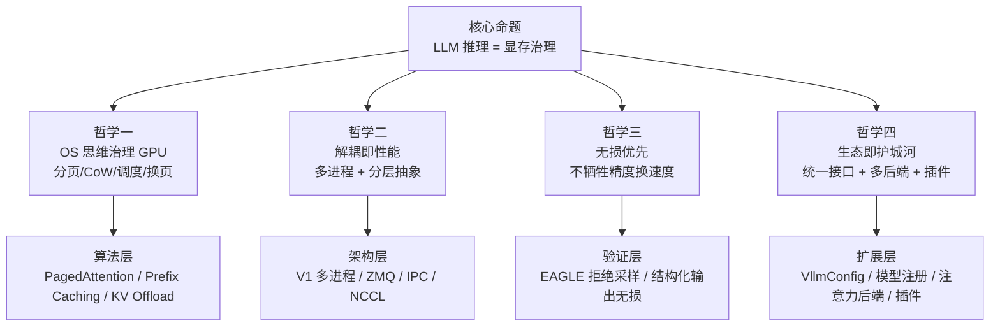
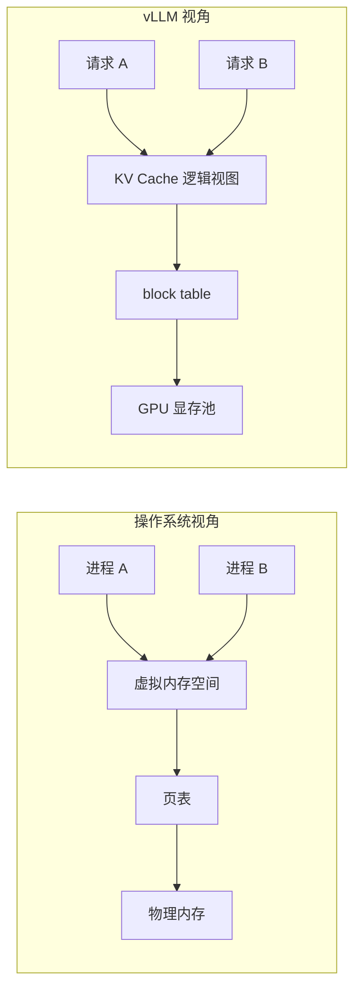
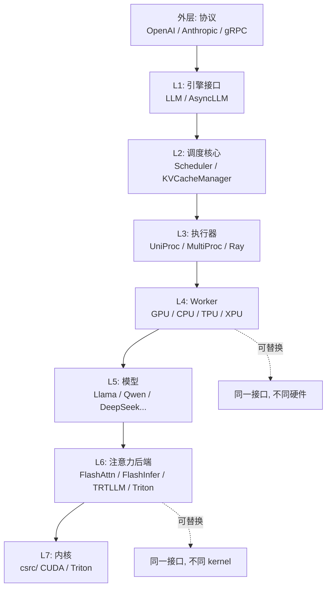
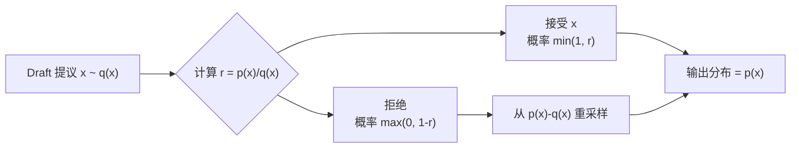
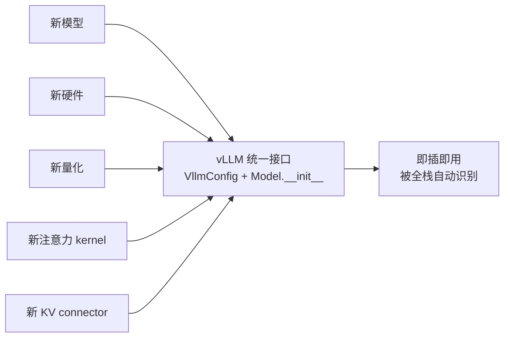
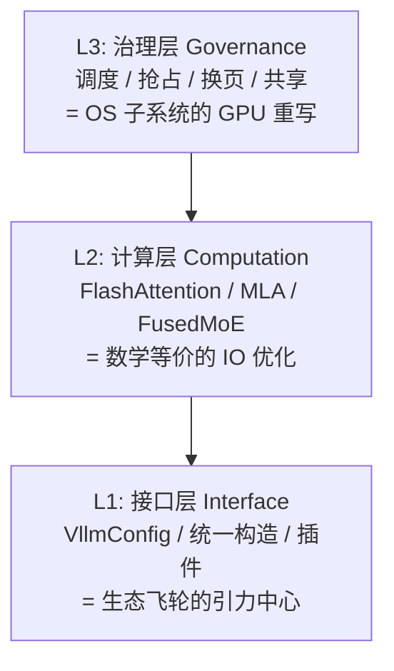

# vLLM 深度解析 · 第三篇：设计哲学与算法框架的深刻升华

> **写作维度**：本文承担"深刻观"之职。前两篇分别给出了"整体地图"与"算法细节"，本篇要做的，是从这些具象中抽离出 vLLM 的设计哲学、算法框架的深层逻辑，并把核心主题升华到让人"永不忘记"的程度。读完后，读者应能用两到三句话向他人讲清 vLLM 的精神内核。
>
> **行文风格**：总—分—总，层层递进。先立"哲学之总"，再分四个深度主题逐层剖析，最后收束为可背诵的两三句话。
>
> **配套关系**：本文是三篇系列的终篇。上承第一篇《总观》的整体架构与第二篇《具体观》的算法细节，是对它们的"形而上"总结。

---

## 一、总起：从"工程奇迹"到"思想范式"

vLLM 之所以能在两年内从一篇 SOSP 论文成长为 LLM 推理事实标准，并非因为它发明了某种"黑科技"，而是因为它**把一个被忽视的真相摆到了台前**：

> **LLM 推理的瓶颈不是算力，而是显存治理。**

这句话看似平淡，却足以颠覆整个推理引擎的设计取向。一旦接受这个前提，所有工程决策都自动收敛到同一个方向——**把稀缺的 GPU 显存当作操作系统管理内存那样去治理**。vLLM 的全部精妙，都从这一句话展开。

下图概括了 vLLM 如何把"显存治理"这一核心命题，展开为四层哲学：

**图 1.1 说明**：核心命题向下展开为四层哲学，每层哲学对应一类算法/架构/扩展机制。这四层不是平行的，而是层层递进——哲学一决定算法层，哲学二决定架构层，哲学三决定验证层，哲学四决定扩展层。下文逐层剖析。

---

## 二、哲学一：OS 思维治理 GPU

### 2.1 类比的精确性

vLLM 与操作系统的对应不是修辞，而是**结构性同构**。下表把这种同构精确列出：

| 操作系统概念 | vLLM 对应 | 共同的本质 |
| --- | --- | --- |
| 虚拟内存 | KV Cache 显存池 | 用户视角的"连续"是逻辑假象 |
| 页面（Page） | KV Cache block | 固定大小的内存分配单位 |
| 页表（Page Table） | block table | 逻辑地址→物理地址的映射 |
| 缺页中断（Page Fault） | 按需分配新 block | 用到才分配，避免预留浪费 |
| 写时复制（Copy-on-Write） | 并行采样/beam search 共享前缀 | 共享只读，写时才复制 |
| 页面调度（Swapping） | KV Offload 到 CPU | 冷数据换出，热数据换入 |
| 进程调度（Scheduling） | Scheduler 决策 batch | 有限资源下多任务的公平与效率 |
| 抢占（Preemption） | 请求被换出或重计算 | 高负载下的优雅降级 |
| 内存映射文件（mmap） | 模型权重 mmap 加载 | 大文件零拷贝加载 |

这种同构的深刻之处在于：**OS 几十年积累的内存治理智慧，几乎可以原封不动地搬到 GPU 上**。vLLM 不是"借鉴了 OS 思想"，而是"把 OS 的内存子系统在 GPU 上重写了一遍"。

### 2.2 为什么这个类比如此有效？

因为 LLM 推理的 workload 与 OS 的进程 workload 在结构上同构：

- **多请求 ↔ 多进程**：每个 LLM 请求像进程一样有自己的"地址空间"（KV Cache）。
- **动态长度 ↔ 动态内存**：进程的堆栈会动态增长，LLM 的 KV Cache 也会随生成增长。
- **共享只读段 ↔ 共享前缀**：进程共享动态链接库，LLM 请求共享 system prompt。
- **优先级 ↔ 请求优先级**：OS 有 nice 值，vLLM 有 priority 字段。

**图 2.1 说明**：左侧是 OS 的虚拟内存模型，右侧是 vLLM 的 KV Cache 模型。两者结构完全同构——每个请求/进程有自己的"逻辑视图"，通过映射表访问共享的"物理资源"。

### 2.3 升华：vLLM 是"GPU 上的微型 OS"

把这一层哲学压到一句话：

> **vLLM 是一个跑在 GPU 上的微型操作系统，它的"进程"是 LLM 请求，它的"内存"是 KV Cache，它的"调度器"决定哪些请求下一拍占用 GPU。**

这句话的力量在于：它把 vLLM 从"一个推理框架"提升为"一种系统范式的实例化"。一旦这样理解，所有看似零散的功能——PagedAttention、Prefix Caching、KV Offload、Preemption、Continuous Batching——都自动归位为"OS 子系统的 GPU 实现"。

---

## 三、哲学二：解耦即性能

### 3.1 V1 多进程架构的深层逻辑

V1 把 vLLM 从单进程改造成多进程，表面看是工程重构，本质是**性能哲学的转向**：

> **在异构资源（CPU + GPU + 网络）的系统里，耦合即等待，解耦即并行。**

V0 时代，调度、 tokenize、模型前向都在同一进程，受 GIL 锁相互拖累：CPU 在 tokenize 时 GPU 空转，GPU 在 forward 时 CPU 不能调度。V1 把它们拆成独立进程：

- API Server 进程：专注 HTTP + tokenize + 多模态加载。
- EngineCore 进程：专注调度 busy loop。
- GPU Worker 进程：专注模型前向。
- 用 ZMQ / IPC / NCCL 做进程间通信。

这样 CPU 与 GPU 真正并行——EngineCore 在 GPU 跑第 N 步前向时，已经在 CPU 上规划第 N+1 步的 batch。

### 3.2 分层抽象的"洋葱模型"

vLLM 的代码分层不是简单的"上层调下层"，而是**洋葱式的、每层都可替换**的抽象：

**图 3.1 说明**：从外层到 L7 共 8 层，每层都有清晰的接口契约。L4 的 Worker 接口可以被 GPU/CPU/TPU/XPU 不同实现满足；L6 的注意力后端接口可以被 FlashAttn/FlashInfer/TRTLLM/Triton 满足。这种"接口稳定、实现可换"的设计，让 vLLM 能在硬件飞速演进中保持代码不腐烂。

### 3.3 升华：vLLM 的"洋葱哲学"

> **vLLM 用"洋葱式分层"对抗硬件与模型的飞速演进——每一层都是一个稳定接口，每一个接口下都允许有 N 种实现。**

这是大工程在不确定世界中存活的关键策略：**接口是锚，实现是浪**。浪可以随时换，但锚不能动。vLLM 的 `VllmConfig` 统一构造、统一的注意力后端接口、统一的 Worker 接口，都是这种"锚"的具体体现。

---

## 四、哲学三：无损优先

### 4.1 为什么"无损"如此重要？

很多推理加速方案（如量化、蒸馏、近似注意力）都是以**精度损失换速度**。这些方案在生产环境里往往难以服众——用户无法接受"快了 2 倍但答错了"。

vLLM 在所有性能优化上坚持**无损原则**：

- **PagedAttention**：数学上与标准注意力等价，只是存储布局不同。
- **Prefix Caching**：复用的是已经算过的 KV，结果当然一样。
- **Continuous Batching**：调度策略，不动模型。
- **EAGLE 投机解码**：用拒绝采样保证输出分布与目标模型完全一致。
- **结构化输出**：用约束解码保证语法正确，不改变模型语义。

### 4.2 EAGLE 的"无损"数学保证

EAGLE 的无损性来自拒绝采样（rejection sampling）的数学性质。设目标模型分布为 $p(x)$，draft 模型分布为 $q(x)$。对 draft 提议的 token $x$：

- 以概率 $\min(1, p(x)/q(x))$ 接受；
- 否则以概率 $p(x) - q(x)$ 重新采样。

可以证明，最终输出的分布严格等于 $p(x)$。这是 EAGLE 论文的核心定理。

**图 4.1 说明**：无论 draft 模型多差，最终输出分布都严格等于目标模型。这是"无损"的数学保证。

### 4.3 升华：vLLM 的"性能不背叛精度"信条

> **vLLM 把"无损"当作不可逾越的红线——所有性能优化必须在数学上等价于原模型，宁可慢一点，也不偷工减料。**

这条红线让 vLLM 在企业生产环境里赢得了信任。它告诉世界：**推理加速不需要以精度为代价**。

---

## 五、哲学四：生态即护城河

### 5.1 为什么 vLLM 能赢？

技术上比 vLLM 快的方案不少（如 TensorRT-LLM 在某些场景更快），但 vLLM 赢在了**生态**：

- **200+ 模型架构支持**：HuggingFace 上几乎任何模型都能跑。
- **多硬件后端**：NVIDIA / AMD / CPU / TPU / XPU / Ascend / Apple Silicon。
- **多量化方案**：FP8 / GPTQ / AWQ / GGUF / compressed-tensors / ModelOpt / TorchAO。
- **多注意力后端**：FlashAttn / FlashInfer / TRTLLM / FlashMLA / Triton。
- **多接口协议**：OpenAI / Anthropic / gRPC / CLI / Batch。
- **插件系统**：自定义 platform / scheduler / KV connector / IO processor。
- **分离式部署**：Prefill / Decode / Encode 解耦。

### 5.2 统一接口的"引力中心"

vLLM 用 `VllmConfig` 统一构造 + 模型统一签名，构建了一个"引力中心"——任何新模型、新硬件、新量化方案，只要按统一接口实现，就能立刻融入整个生态。

**图 5.1 说明**：所有生态参与者都对接同一个接口。这是 vLLM 在两年内吸引 2000+ 贡献者的根本原因——**接入成本极低，复用收益极大**。

### 5.3 升华：vLLM 的"生态飞轮"

> **vLLM 不是在卖一个推理引擎，而是在经营一个生态飞轮——接口统一让贡献成本极低，贡献越多生态越强，生态越强越能吸引更多贡献。**

这是平台思维的胜利。它把"性能领先"从一次性技术优势，转化为可持续的生态优势。

---

## 六、综合升华：算法框架的统一视角

### 6.1 把五大算法重新归类

在第二篇里，我们以"功能"分类五大算法。现在以"哲学"重新归类，会得到更深的洞察：

| 算法 | 主要服务的哲学 | 核心机制 |
| --- | --- | --- |
| PagedAttention | 哲学一（OS 思维） | 分页 + block table |
| Prefix Caching | 哲学一（OS 思维） | 哈希链 + CoW |
| KV Offload | 哲学一（OS 思维） | 换页（swap） |
| Continuous Batching | 哲学一（OS 思维） | 迭代级调度 |
| FlashAttention | 哲学三（无损优先） | 数学等价 + IO 优化 |
| EAGLE | 哲学三（无损优先） | 拒绝采样保证无损 |
| V1 多进程架构 | 哲学二（解耦即性能） | 进程间 ZMQ/IPC |
| 统一接口 | 哲学四（生态即护城河） | VllmConfig + 统一构造 |

**洞察**：vLLM 的"算法创新"主要集中在哲学一（OS 思维），而它的"工程稳健性"来自哲学二、三、四。换句话说——**vLLM 的算法新颖性是"把 OS 思想搬进 GPU"，而它的工程胜利是"用解耦、无损、生态三重保险把这套思想做成了标准"**。

### 6.2 算法框架的"三层栈"

把 vLLM 的算法框架抽象成三层栈，便于记忆：

**图 6.1 说明**：

- **L3 治理层** 决定"显存怎么用、请求怎么排"——这是 vLLM 的灵魂。
- **L2 计算层** 决定"注意力怎么算得快"——这是 vLLM 的肌肉。
- **L1 接口层** 决定"如何让一切可替换、可扩展"——这是 vLLM 的骨架。

灵魂 + 肌肉 + 骨架，三者合一，才是 vLLM 的完整算法框架。

### 6.3 框架的"可迁移性"

vLLM 的算法框架不只适用于 LLM 推理，它的思想可以迁移到：

- **多模态推理**：KV Cache 治理同样适用于 vision token。
- **推荐系统**：embedding 服务的 batch 调度可借鉴 continuous batching。
- **数据库**：查询结果的缓存复用可借鉴 prefix caching 的哈希链。
- **OS 本身**：GPU 上的"虚拟内存"思想反过来启发 CPU 内存管理。

这种可迁移性，是 vLLM 思想"永不过时"的保证。

---

## 七、深刻观：两到三句话讲清 vLLM

经过三篇文档的层层铺垫，我们终于可以把 vLLM 的精神内核压成两到三句话。这三句话是整个系列的"升华之眼"：

> **第一句（定位）**：vLLM 是一个跑在 GPU 上的微型操作系统，它把"显存治理"当作 LLM 推理的核心命题，用分页、写时复制、调度、换页四件 OS 武器，把稀缺显存的利用率从 20% 推到 96%。
>
> **第二句（哲学）**：它相信"解耦即性能、无损即信任、生态即护城河"——用多进程解耦 CPU 与 GPU，用拒绝采样保证输出无损，用统一接口让 200+ 模型与多硬件即插即用。
>
> **第三句（遗产）**：vLLM 留给世界的不是一个推理引擎，而是一个**思想范式**——当任何加速器上的任何工作负载面临"稀缺资源 + 多任务 + 动态长度"的三重压力时，都可以用 OS 思维去治理。

把这三句话记在心里，你就能在任何场合向他人讲清 vLLM 的精神内核。

---

## 八、设计哲学对照表：从问题到原则

为了把抽象哲学落到具体设计决策上，下面这张表把"面临的问题 → 哲学原则 → 具体设计"三层串起来：

| 面临的问题 | 哲学原则 | 具体设计 |
| --- | --- | --- |
| KV Cache 浪费 60%–80% | OS 分页思维 | PagedAttention + block table |
| 共享前缀重复计算 | OS CoW 思维 | Prefix Caching 哈希链 |
| 显存不够时怎么办 | OS 换页思维 | KV Offload 到 CPU |
| 短请求被长请求绑架 | OS 调度思维 | Continuous Batching 迭代级调度 |
| CPU 调度与 GPU 计算互锁 | 解耦即性能 | V1 多进程 + ZMQ/IPC |
| 200+ 模型难以统一驱动 | 统一接口即扩展性 | VllmConfig + 统一构造签名 |
| 硬件与 kernel 飞速演进 | 接口稳定、实现可换 | 注意力后端 / Worker 接口抽象 |
| 加速不能牺牲精度 | 无损优先 | EAGLE 拒绝采样 / 数学等价注意力 |
| 企业环境需要可观测 | 可观测即信任 | Prometheus 指标 / OTel tracing |
| 多租户隔离需求 | 安全即底线 | cache_salt / 租户级哈希隔离 |

**表 8.1 说明**：每一行都是"问题 → 原则 → 设计"的完整链条。读者可以把它当作 vLLM 设计决策的"索引表"。

---

## 九、使用指南：如何用"深刻观"指导实践

### 9.1 选型决策：什么时候用 vLLM？

基于深刻观，vLLM 适合的场景可总结为：

- **多请求并发**：batch 越大，PagedAttention 与 Continuous Batching 收益越大。
- **请求长度差异大**：短长混合时，连续批处理优势最明显。
- **共享前缀多**：RAG、system prompt 固定、few-shot 场景，prefix caching 收益巨大。
- **要求无损**：生产环境不能容忍精度损失时，vLLM 是最安全选择。
- **多硬件部署**：需要跨 NVIDIA / AMD / CPU 时，vLLM 的多后端抽象省心。

不适合的场景：

- **单请求极低延迟**：vLLM 优化的是吞吐，单请求延迟不如专门优化的小型 runtime。
- **极小模型**：模型本身很小时，调度开销可能反而拖累。
- **非 LLM workload**：vLLM 的优化都围绕自回归 Transformer，其他架构收益有限。

### 9.2 调优决策：基于哲学的调优清单

| 症状 | 哲学诊断 | 调优手段 |
| --- | --- | --- |
| 吞吐低 | 显存未用满 | 增大 `--gpu-memory-utilization`、`--max-num-seqs` |
| 首 token 慢 | prefill 计算瓶颈 | 开启 chunked prefill、提升 `--max-num-batched-tokens` |
| 抢占频繁 | 显存压力 | 降低 `--max-num-seqs` 或开 KV Offload |
| 命中率低 | 前缀不共享 | 检查 prompt 结构、固定 system prompt |
| 投机解码慢 | draft 不准 | 检查 EAGLE 模型匹配、调 `--num-speculative-tokens` |
| GPU 利用率低 | 调度与执行未解耦 | 升级到 V1、确认 API Server 独立进程 |

### 9.3 案例：用深刻观诊断一个真实问题

**现象**：某 RAG 服务，QPS 上不去，GPU 利用率只有 40%。

**哲学诊断**：

1. 显存是否用满？查 `vllm:gpu_cache_usage_perc` → 60%，未满。
2. 命中率如何？查 prefix cache stats → 20%，很低。
3. 调度是否解耦？查进程拓扑 → API Server 与 EngineCore 在同进程（V0 残留）。

**根因**：RAG 请求的 system prompt 在每次请求里被拼到了 user message 里（前端错误），导致前缀哈希不命中；同时 V0 单进程让 CPU tokenize 阻塞 GPU。

**修复**：

- 前端把 system prompt 固定，让前缀哈希稳定。
- 升级到 V1 多进程部署。

**结果**：QPS 提升 3 倍，GPU 利用率到 85%。

这个案例的深刻之处在于：**问题表面是性能，根因是"显存治理失效"与"解耦失效"**——正好对应哲学一与哲学二。深刻观不是空谈，它是诊断工具。

---

## 十、总收：三句话，永不忘记

把整个三篇系列压成最终的"深刻观三句话"，作为读者带走的终极记忆：

> 1. **vLLM 是 GPU 上的微型操作系统**——它把 LLM 推理重构为"显存治理"问题，用分页、写时复制、调度、换页四件 OS 武器，把稀缺显存利用率从 20% 推到 96%。
> 2. **它的工程胜利来自三重保险**——多进程解耦让 CPU/GPU 并行，拒绝采样让加速无损，统一接口让 200+ 模型与多硬件即插即用。
> 3. **它留给世界的是一个思想范式**——当任何加速器上的工作负载面临"稀缺资源 + 多任务 + 动态长度"的三重压力时，都可以用 OS 思维去治理。

记住这三句话，你就抓住了 vLLM 的全部精神。

---

## 十一、系列完结语

三篇文档到此完结：

- **第一篇《总观》** 给地图：vLLM 在生态中的坐标、代码分层、设计理念、端到端流程。
- **第二篇《具体观》** 给放大镜：PagedAttention、FlashAttention、Continuous Batching、Prefix Caching、EAGLE 的论文与例子。
- **第三篇《深刻观》** 给思想：OS 治理范式、解耦即性能、无损优先、生态即护城河。

三篇合在一起，构成对 vLLM 的"地图—放大镜—思想"三位一体认知。希望读者在读完之后，不仅能用 vLLM，更能从 vLLM 中汲取"用 OS 思维治理稀缺资源"这一可迁移的设计智慧。

> **上一篇**：[02_具体观_核心算法与原理.md](file:///workspace/ReadCode/02_具体观_核心算法与原理.md)
> **系列首篇**：[01_总观_vLLM项目定位与整体架构.md](file:///workspace/ReadCode/01_总观_vLLM项目定位与整体架构.md)

---

## 参考资料

- vLLM 论文：Kwon et al., *Efficient Memory Management for Large Language Model Serving with PagedAttention*, SOSP 2023. [arXiv:2309.06180](https://arxiv.org/abs/2309.06180)
- FlashAttention: Tri Dao et al., NeurIPS 2022. [arXiv:2205.14135](https://arxiv.org/abs/2205.14135)
- Orca: Yu et al., OSDI 2022.
- EAGLE: Li et al., ICML 2024. [arXiv:2401.15077](https://arxiv.org/abs/2401.15077)
- vLLM 架构设计文档：[docs/design/arch_overview.md](file:///workspace/docs/design/arch_overview.md)
- vLLM PagedAttention 设计文档：[docs/design/paged_attention.md](file:///workspace/docs/design/paged_attention.md)
- vLLM Prefix Caching 设计文档：[docs/design/prefix_caching.md](file:///workspace/docs/design/prefix_caching.md)
- vLLM AGENTS.md：[AGENTS.md](file:///workspace/AGENTS.md)
