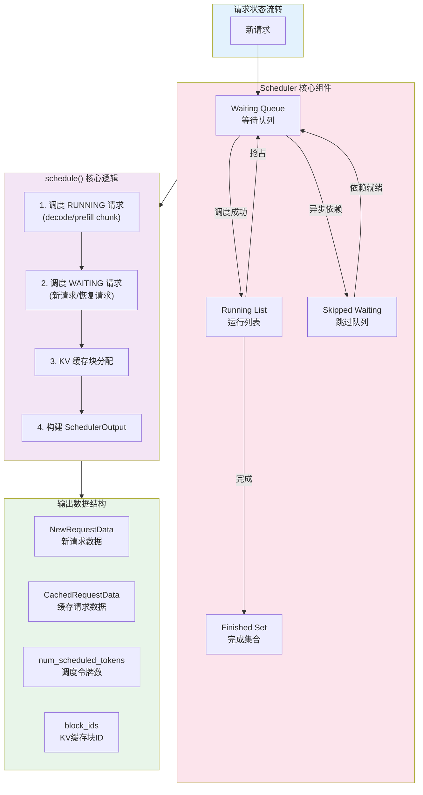
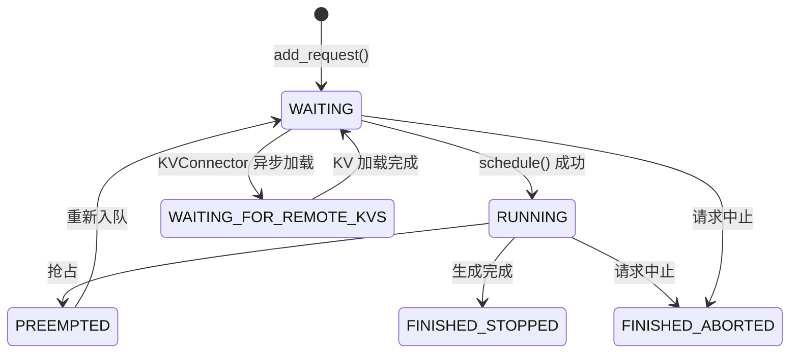
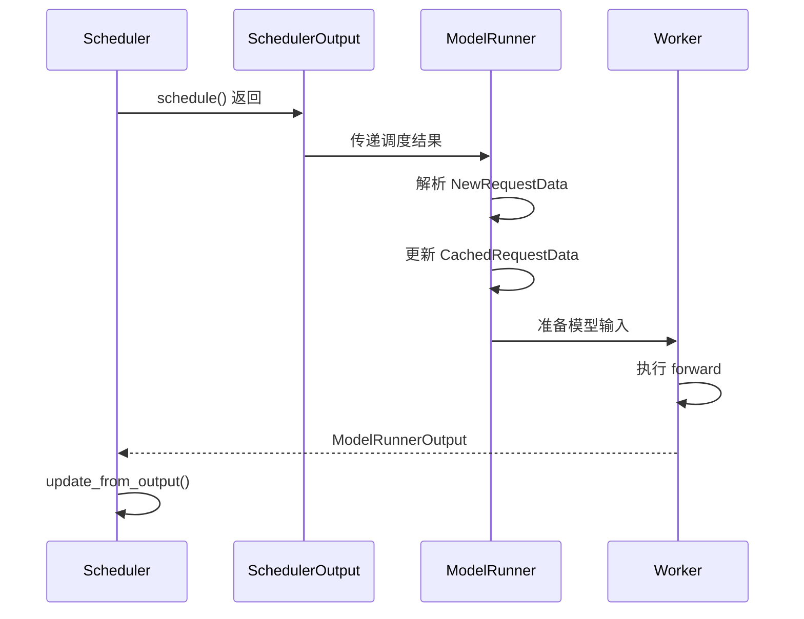
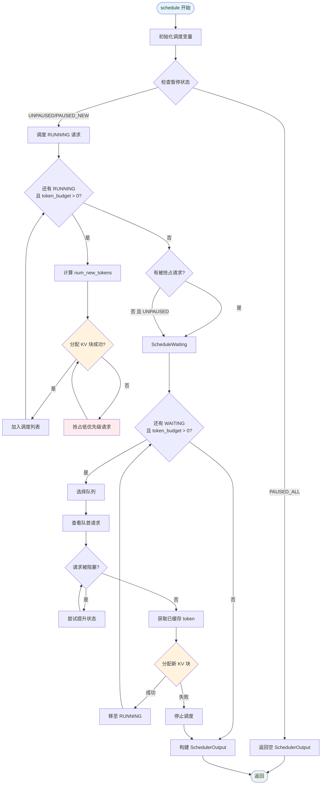

# vLLM 调度系统深度分析

**定位**: 本文档深入剖析 vLLM v1 架构中的调度系统，涵盖 Scheduler 核心逻辑、Continuous Batching 原理、调度策略、请求生命周期管理等关键机制。

---

## 📌 调度系统架构总览



---

## 一、Scheduler 类核心逻辑

### 1.1 类定义与核心属性

Scheduler 类位于 [scheduler.py:62](file:///workspace/vllm/v1/core/sched/scheduler.py#L62)，是 vLLM v1 调度系统的核心实现。

```python
class Scheduler(SchedulerInterface):
    def __init__(
        self,
        vllm_config: VllmConfig,
        kv_cache_config: KVCacheConfig,
        structured_output_manager: StructuredOutputManager,
        block_size: int,
        hash_block_size: int | None = None,
        mm_registry: MultiModalRegistry = MULTIMODAL_REGISTRY,
        include_finished_set: bool = False,
        log_stats: bool = False,
    ) -> None:
```

**核心数据结构**:

| 属性 | 类型 | 说明 |
|------|------|------|
| `self.requests` | `dict[str, Request]` | 所有请求的映射表 (req_id -> Request) |
| `self.waiting` | `RequestQueue` | 等待调度的请求队列 |
| `self.skipped_waiting` | `RequestQueue` | 因异步依赖被跳过的请求队列 |
| `self.running` | `list[Request]` | 正在运行的请求列表 |
| `self.finished_req_ids` | `set[str]` | 已完成请求ID集合 |
| `self.policy` | `SchedulingPolicy` | 调度策略 (FCFS/PRIORITY) |

**调度约束参数** ([scheduler.py:100-107](file:///workspace/vllm/v1/core/sched/scheduler.py#L100-L107)):

```python
self.max_num_running_reqs = self.scheduler_config.max_num_seqs
self.max_num_scheduled_tokens = (
    self.scheduler_config.max_num_scheduled_tokens
    if self.scheduler_config.max_num_scheduled_tokens
    else self.scheduler_config.max_num_batched_tokens
)
self.max_model_len = vllm_config.model_config.max_model_len
```

### 1.2 schedule() 方法完整逻辑

`schedule()` 方法是调度器的核心入口，位于 [scheduler.py:310-903](file:///workspace/vllm/v1/core/sched/scheduler.py#L310-L903)。

#### 1.2.1 方法签名与返回值

```python
def schedule(self) -> SchedulerOutput:
```

返回 `SchedulerOutput` 对象，包含本次调度的所有信息。

#### 1.2.2 调度算法核心思想

源码注释 ([scheduler.py:311-320](file:///workspace/vllm/v1/core/sched/scheduler.py#L311-L320)) 清晰阐述了设计理念:

> **NOTE(woosuk) on the scheduling algorithm**:
> There's no "decoding phase" nor "prefill phase" in the scheduler.
> Each request just has the `num_computed_tokens` and `num_tokens_with_spec`.
> At each step, the scheduler tries to assign tokens to the requests
> so that each request's `num_computed_tokens` can catch up its `num_tokens_with_spec`.
> This is general enough to cover chunked prefills, prefix caching,
> speculative decoding, and the "jump decoding" optimization.

**核心洞察**: 调度器不区分 "prefill 阶段" 和 "decode 阶段"，而是统一处理——每个请求都有 `num_computed_tokens`（已计算 token 数）和 `num_tokens_with_spec`（目标 token 数），调度器的目标就是让前者追赶后者。

#### 1.2.3 调度流程详解

**阶段一: 调度 RUNNING 请求** ([scheduler.py:345-514](file:///workspace/vllm/v1/core/sched/scheduler.py#L345-L514))

```python
while req_index < len(self.running) and token_budget > 0:
    request = self.running[req_index]
    
    # 计算需要调度的新 token 数
    num_new_tokens = (
        request.num_tokens_with_spec
        + request.num_output_placeholders
        - request.num_computed_tokens
    )
    
    # 长预填充阈值限制
    if 0 < self.scheduler_config.long_prefill_token_threshold < num_new_tokens:
        num_new_tokens = self.scheduler_config.long_prefill_token_threshold
    
    num_new_tokens = min(num_new_tokens, token_budget)
    
    # 分配 KV 缓存块
    new_blocks = self.kv_cache_manager.allocate_slots(
        request, num_new_tokens,
        num_lookahead_tokens=self.num_lookahead_tokens,
    )
    
    if new_blocks is None:
        # 需要抢占低优先级请求
        preempted_req = self.running.pop()
        self._preempt_request(preempted_req, scheduled_timestamp)
        preempted_reqs.append(preempted_req)
        continue
    
    # 成功调度
    scheduled_running_reqs.append(request)
    num_scheduled_tokens[request_id] = num_new_tokens
    token_budget -= num_new_tokens
```

**阶段二: 调度 WAITING 请求** ([scheduler.py:525-804](file:///workspace/vllm/v1/core/sched/scheduler.py#L525-L804))

```python
while (self.waiting or self.skipped_waiting) and token_budget > 0:
    if len(self.running) == self.max_num_running_reqs:
        break
    
    request_queue = self._select_waiting_queue_for_scheduling()
    request = request_queue.peek_request()
    
    # 获取已缓存的 token (prefix caching)
    if request.num_computed_tokens == 0:
        new_computed_blocks, num_new_local_computed_tokens = (
            self.kv_cache_manager.get_computed_blocks(request)
        )
        # KVConnector: 获取远程缓存的 token
        if self.connector is not None:
            ext_tokens, load_kv_async = (
                self.connector.get_num_new_matched_tokens(
                    request, num_new_local_computed_tokens
                )
            )
    
    # 分配 KV 缓存块
    new_blocks = self.kv_cache_manager.allocate_slots(
        request, num_new_tokens,
        num_new_computed_tokens=num_new_local_computed_tokens,
        new_computed_blocks=new_computed_blocks,
    )
    
    if new_blocks is None:
        break  # 无法分配，停止调度
    
    # 请求从 WAITING 状态转为 RUNNING
    self.running.append(request)
    request.status = RequestStatus.RUNNING
```

#### 1.2.4 请求队列选择策略

`_select_waiting_queue_for_scheduling()` 方法 ([scheduler.py:1529-1539](file:///workspace/vllm/v1/core/sched/scheduler.py#L1529-L1539)):

```python
def _select_waiting_queue_for_scheduling(self) -> RequestQueue | None:
    if self.policy == SchedulingPolicy.FCFS:
        return self.skipped_waiting or self.waiting or None
    
    # PRIORITY mode: 比较两个队列头部请求的优先级
    if self.waiting and self.skipped_waiting:
        waiting_req = self.waiting.peek_request()
        skipped_req = self.skipped_waiting.peek_request()
        return self.waiting if waiting_req < skipped_req else self.skipped_waiting
    
    return self.waiting or self.skipped_waiting or None
```

### 1.3 请求状态管理

#### 1.3.1 RequestStatus 枚举

定义于 [request.py:310-319](file:///workspace/vllm/v1/request.py#L310-L319):

```python
class RequestStatus(enum.IntEnum):
    WAITING = enum.auto()
    WAITING_FOR_STRUCTURED_OUTPUT_GRAMMAR = enum.auto()
    WAITING_FOR_REMOTE_KVS = enum.auto()
    WAITING_FOR_STREAMING_REQ = enum.auto()
    RUNNING = enum.auto()
    PREEMPTED = enum.auto()
    # FINISHED_* 状态...
```

#### 1.3.2 状态转换图



### 1.4 请求抢占机制

`_preempt_request()` 方法 ([scheduler.py:910-930](file:///workspace/vllm/v1/core/sched/scheduler.py#L910-L930)):

```python
def _preempt_request(self, request: Request, timestamp: float) -> None:
    """Preempt a request and put it back to the waiting queue."""
    assert request.status == RequestStatus.RUNNING
    
    # 释放 KV 缓存块
    self.kv_cache_manager.free(request)
    self.encoder_cache_manager.free(request)
    
    # 重置请求状态
    request.status = RequestStatus.PREEMPTED
    request.num_computed_tokens = 0
    request.num_preemptions += 1
    
    # 放回等待队列头部
    self.waiting.prepend_request(request)
```

**抢占触发条件**:
1. KV 缓存不足，无法为新请求分配块
2. 优先级调度时，高优先级请求需要资源

---

## 二、Continuous Batching 原理

### 2.1 静态批处理 vs Continuous Batching

| 特性 | 静态批处理 | Continuous Batching |
|------|-----------|---------------------|
| 批次组成 | 固定请求集合 | 动态增减请求 |
| 请求加入 | 批次开始时一次性加入 | 任意时刻可加入新请求 |
| 请求退出 | 批次结束时统一退出 | 完成即退出 |
| GPU 利用率 | 请求长度差异导致浪费 | 持续保持高利用率 |
| 延迟 | 等待最慢请求完成 | 完成即返回 |

### 2.2 Chunked Prefill 实现

**配置参数** ([scheduler.py:84](file:///workspace/vllm/config/scheduler.py#L84)):

```python
enable_chunked_prefill: bool = True
```

**核心机制**: 将长 prefill 请求分块处理，每次调度只处理部分 token。

```python
# scheduler.py:636-638
num_new_tokens = request.num_tokens - num_computed_tokens
threshold = self.scheduler_config.long_prefill_token_threshold
if 0 < threshold < num_new_tokens:
    num_new_tokens = threshold
```

**Chunked Prefill 的优势**:

1. **降低首 token 延迟**: 长请求不会阻塞短请求
2. **提高 GPU 利用率**: prefill 和 decode 可以混合执行
3. **更好的公平性**: 避免长请求独占资源

### 2.3 Prefill-Decode 混合调度

vLLM v1 不显式区分 prefill 和 decode 阶段，而是通过 `num_computed_tokens` 统一处理:

```python
# scheduler.py:946-948
request.is_prefill_chunk = request.num_computed_tokens < (
    request.num_tokens + request.num_output_placeholders
)
```

**判断逻辑**:
- `is_prefill_chunk = True`: 请求仍处于 prefill 阶段
- `is_prefill_chunk = False`: 请求处于 decode 阶段

---

## 三、调度策略细节

### 3.1 SchedulingPolicy 枚举

定义于 [request_queue.py:13-17](file:///workspace/vllm/v1/core/sched/request_queue.py#L13-L17):

```python
class SchedulingPolicy(Enum):
    """Enum for scheduling policies."""
    FCFS = "fcfs"
    PRIORITY = "priority"
```

### 3.2 FCFS (First-Come-First-Served) 策略

**FCFSRequestQueue 实现** ([request_queue.py:75-128](file:///workspace/vllm/v1/core/sched/request_queue.py#L75-L128)):

```python
class FCFSRequestQueue(deque[Request], RequestQueue):
    """A first-come-first-served queue that supports deque operations."""
    
    def add_request(self, request: Request) -> None:
        self.append(request)
    
    def pop_request(self) -> Request:
        return self.popleft()
    
    def peek_request(self) -> Request:
        return self[0]
    
    def prepend_request(self, request: Request) -> None:
        self.appendleft(request)
```

**特点**:
- 基于 `deque` 实现，O(1) 的队首/队尾操作
- 按请求到达时间 (`arrival_time`) 顺序处理
- 简单高效，适合大多数场景

### 3.3 PRIORITY 策略

**PriorityRequestQueue 实现** ([request_queue.py:131-198](file:///workspace/vllm/v1/core/sched/request_queue.py#L131-L198)):

```python
class PriorityRequestQueue(RequestQueue):
    """
    A priority queue that supports heap operations.
    
    Respects the ordering defined in the Request class, where
    requests with a smaller value of `priority` are processed first.
    If multiple requests have the same priority, the one with the earlier
    `arrival_time` is processed first.
    """
    
    def __init__(self) -> None:
        self._heap: list[Request] = []
    
    def add_request(self, request: Request) -> None:
        heapq.heappush(self._heap, request)
    
    def pop_request(self) -> Request:
        return heapq.heappop(self._heap)
```

**Request 比较方法** ([request.py:296-307](file:///workspace/vllm/v1/request.py#L296-L307)):

```python
def __lt__(self, other: "Request") -> bool:
    """
    Compare two requests based on priority, arrival time, and request ID.
    Used in priority scheduling.
    """
    if self.priority != other.priority:
        return self.priority < other.priority
    if self.arrival_time != other.arrival_time:
        return self.arrival_time < other.arrival_time
    if self.request_id != other.request_id:
        return self.request_id < other.request_id
    return id(self) < id(other)
```

**优先级排序规则**:
1. 首先按 `priority` 值升序（值越小优先级越高）
2. 相同优先级按 `arrival_time` 升序
3. 相同到达时间按 `request_id` 字典序

### 3.4 双策略调度权衡

| 策略 | 优势 | 劣势 | 适用场景 |
|------|------|------|----------|
| FCFS | 实现简单、公平性好、延迟可预测 | 无法区分请求重要性 | 通用场景 |
| PRIORITY | 支持业务优先级、SLA 控制 | 可能导致低优先级请求饥饿 | 多租户、付费优先级 |

### 3.5 抢占与恢复机制

**抢占场景** ([scheduler.py:436-468](file:///workspace/vllm/v1/core/sched/scheduler.py#L436-L468)):

```python
# 当无法分配 KV 缓存块时触发抢占
while True:
    new_blocks = self.kv_cache_manager.allocate_slots(...)
    
    if new_blocks is not None:
        break
    
    # 抢占最低优先级请求
    if self.policy == SchedulingPolicy.PRIORITY:
        preempted_req = max(
            self.running,
            key=lambda r: (r.priority, r.arrival_time),
        )
    else:
        preempted_req = self.running.pop()
    
    self._preempt_request(preempted_req, scheduled_timestamp)
```

**恢复机制**: 被抢占的请求被放回 `waiting` 队列头部，下次调度时优先处理。

---

## 四、SchedulerOutput 数据结构

### 4.1 类定义

位于 [output.py:180-256](file:///workspace/vllm/v1/core/sched/output.py#L180-L256):

```python
@dataclass
class SchedulerOutput:
    # 新调度的请求列表
    scheduled_new_reqs: list[NewRequestData]
    
    # 已缓存请求的调度数据
    scheduled_cached_reqs: CachedRequestData
    
    # req_id -> num_scheduled_tokens
    num_scheduled_tokens: dict[str, int]
    
    # 总调度 token 数
    total_num_scheduled_tokens: int
    
    # req_id -> spec_token_ids (推测解码)
    scheduled_spec_decode_tokens: dict[str, list[int]]
    
    # req_id -> encoder input indices (多模态)
    scheduled_encoder_inputs: dict[str, list[int]]
    
    # 公共前缀块数 (用于 cascade attention)
    num_common_prefix_blocks: list[int]
    
    # 已完成请求 ID
    finished_req_ids: set[str]
    
    # 需释放的 encoder 缓存
    free_encoder_mm_hashes: list[str]
    
    # 被抢占请求 ID
    preempted_req_ids: set[str] | None = None
    
    # 结构化输出相关
    has_structured_output_requests: bool = False
    pending_structured_output_tokens: bool = False
    
    # KV Connector 元数据
    kv_connector_metadata: KVConnectorMetadata | None = None
```

### 4.2 NewRequestData 结构

```python
@dataclass
class NewRequestData:
    req_id: str
    prompt_token_ids: list[int] | None
    mm_features: list[MultiModalFeatureSpec]
    sampling_params: SamplingParams | None
    pooling_params: PoolingParams | None
    block_ids: tuple[list[int], ...]  # KV 缓存块 ID
    num_computed_tokens: int
    lora_request: LoRARequest | None
    prompt_embeds: torch.Tensor | None = None
```

### 4.3 CachedRequestData 结构

```python
@dataclass
class CachedRequestData:
    req_ids: list[str]
    resumed_req_ids: set[str]  # 从抢占中恢复的请求
    new_token_ids: list[list[int]]  # 仅 PP 使用
    all_token_ids: dict[str, list[int]]
    new_block_ids: list[tuple[list[int], ...] | None]
    num_computed_tokens: list[int]
    num_output_tokens: list[int]
```

### 4.4 下游消费流程



---

## 五、AsyncScheduler 异步调度变体

### 5.1 类定义

位于 [async_scheduler.py:12-60](file:///workspace/vllm/v1/core/sched/async_scheduler.py#L12-L60):

```python
class AsyncScheduler(Scheduler):
    def __init__(self, *args, **kwargs) -> None:
        super().__init__(*args, **kwargs)
        # 可复用的推测解码占位符
        self._spec_token_placeholders: list[int] = [-1] * self.num_spec_tokens
```

### 5.2 核心差异

**异步调度启用条件** ([scheduler.py:168-176](file:///workspace/vllm/config/scheduler.py#L168-L176)):

```python
def get_scheduler_cls(self) -> type["SchedulerInterface"]:
    if self.scheduler_cls is None:
        if self.async_scheduling:
            from vllm.v1.core.sched.async_scheduler import AsyncScheduler
            return AsyncScheduler
        from vllm.v1.core.sched.scheduler import Scheduler
        return Scheduler
```

### 5.3 关键方法重写

**_update_after_schedule()** ([async_scheduler.py:18-35](file:///workspace/vllm/v1/core/sched/async_scheduler.py#L18-L35)):

```python
def _update_after_schedule(self, scheduler_output: SchedulerOutput) -> None:
    super()._update_after_schedule(scheduler_output)
    spec_decode_tokens = scheduler_output.scheduled_spec_decode_tokens
    
    for req_id in scheduler_output.num_scheduled_tokens:
        request = self.requests[req_id]
        if request.is_prefill_chunk:
            continue
        
        # 异步调度: 预先为下一个 token 分配占位符
        cur_num_spec_tokens = len(spec_decode_tokens.get(req_id, ()))
        request.num_output_placeholders += 1 + cur_num_spec_tokens
        request.spec_token_ids = self._spec_token_placeholders
```

**_update_request_with_output()** ([async_scheduler.py:37-60](file:///workspace/vllm/v1/core/sched/async_scheduler.py#L37-L60)):

```python
def _update_request_with_output(
    self, request: Request, new_token_ids: list[int]
) -> tuple[list[int], bool]:
    # 处理强制抢占时丢弃异步 token
    if request.discard_latest_async_tokens:
        request.discard_latest_async_tokens = False
        return [], False
    
    new_token_ids, stopped = super()._update_request_with_output(
        request, new_token_ids
    )
    
    # 更新占位符计数
    request.num_output_placeholders -= len(new_token_ids)
    
    # 缓存新 token 的 KV 块
    if status_before_update == RequestStatus.RUNNING:
        self.kv_cache_manager.cache_blocks(
            request, request.num_computed_tokens - request.num_output_placeholders
        )
    
    return new_token_ids, stopped
```

### 5.4 异步调度优势

1. **减少 GPU 空闲**: 在等待模型输出时预先调度下一步
2. **更好的流水线**: 重叠调度计算与模型执行
3. **推测解码优化**: 提前准备 draft token 占位符

---

## 六、调度决策流程图



---

## 七、关键配置参数

### 7.1 SchedulerConfig 核心参数

| 参数 | 类型 | 默认值 | 说明 |
|------|------|--------|------|
| `max_num_batched_tokens` | int | 2048 | 单次迭代最大处理 token 数 |
| `max_num_scheduled_tokens` | int | None | 调度器单次最大发出 token 数 |
| `max_num_seqs` | int | 128 | 单次迭代最大序列数 |
| `enable_chunked_prefill` | bool | True | 启用 chunked prefill |
| `long_prefill_token_threshold` | int | 0 | 长预填充阈值 |
| `policy` | str | "fcfs" | 调度策略 |
| `async_scheduling` | bool | None | 启用异步调度 |

### 7.2 参数验证逻辑

```python
# scheduler.py:259-278
def verify_max_model_len(self, max_model_len: int):
    if (
        self.max_num_batched_tokens < max_model_len
        and not self.enable_chunked_prefill
    ):
        raise ValueError(
            f"max_num_batched_tokens ({self.max_num_batched_tokens}) is "
            f"smaller than max_model_len ({max_model_len})."
        )
```

---

## 八、总结

vLLM v1 的调度系统通过以下核心设计实现了高效的 LLM 推理服务:

1. **统一的调度抽象**: 不区分 prefill/decode 阶段，通过 `num_computed_tokens` 统一处理
2. **Continuous Batching**: 动态增减请求，最大化 GPU 利用率
3. **Chunked Prefill**: 长请求分块处理，降低首 token 延迟
4. **灵活的调度策略**: 支持 FCFS 和 PRIORITY 两种策略
5. **抢占与恢复机制**: 在资源不足时优雅降级
6. **异步调度优化**: 减少 GPU 空闲时间

这些设计使得 vLLM 能够在高吞吐量和低延迟之间取得良好平衡，适用于各种生产场景。
