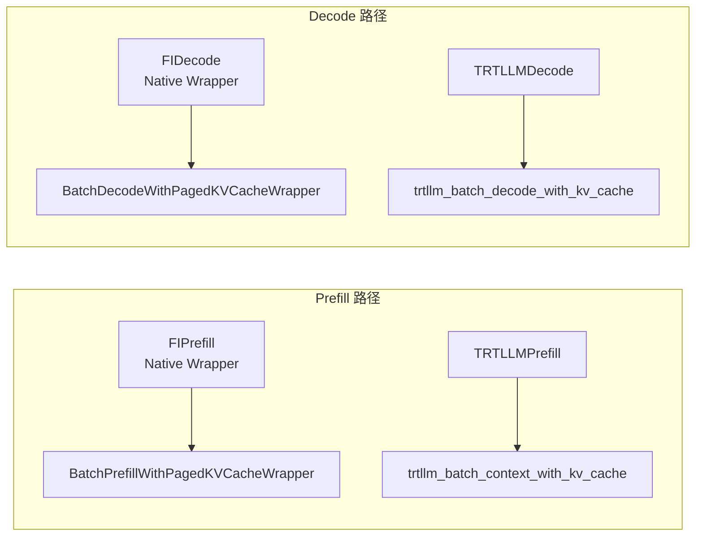

# vLLM 注意力后端实现详细分析

## 📍 定位

本文档深入分析 vLLM 的**注意力（Attention）后端架构**，涵盖从高层选择器到底层算子的完整实现链路。vLLM 通过模块化的后端设计，支持多种硬件平台（NVIDIA CUDA、AMD ROCm、CPU）和多种注意力变体（标准 Attention、MLA、Mamba SSM 等），实现了高性能推理服务。

### 架构总览

```mermaid
graph TB
    subgraph "Selector 层"
        AS[AttentionSelector<br/>selector.py]
    end

    subgraph "标准注意力后端"
        FA[FlashAttention<br/>flash_attn.py]
        FI[FlashInfer<br/>flashinfer.py]
        TA[Triton Attention<br/>triton_attn.py]
        RA[ROCm Attention<br/>rocm_attn.py]
        CA[CPU Attention<br/>cpu_attn.py]
    end

    subgraph "MLA 后端群"
        MLA_FI[FlashInfer MLA<br/>flashinfer_mla.py]
        MLA_FA[FlashAttn MLA<br/>flashattn_mla.py]
        MLA_TT[Triton MLA<br/>triton_mla.py]
        MLA_CL[Cutlass MLA<br/>cutlass_mla.py]
        MLA_FL[FlashMLA<br/>flashmla.py]
        MLA_RA[ROCm AIter MLA<br/>rocm_aiter_mla.py]
    end

    subgraph "SSM/特殊注意力"
        M1[Mamba1 Attention<br/>mamba1_attn.py]
        M2[Mamba2 Attention<br/>mamba2_attn.py]
        LA[Linear Attention<br/>linear_attn.py]
        SC[Short Conv Attention<br/>short_conv_attn.py]
        GA[GDN Attention<br/>gdn_attn.py]
    end

    subgraph "底层算子 (ops/)"
        PA[paged_attn.py<br/>分页注意力核心]
        CPD[chunked_prefill_paged_decode.py<br/>Chunked Prefill + Paged Decode]
        TPA[triton_prefill_attention.py<br/>Triton Prefill Kernel]
        TDA[triton_decode_attention.py<br/>Triton Decode Kernel]
        TUA[triton_unified_attention.py<br/>统一 Triton Kernel]
        MAS[merge_attn_states.py<br/>状态合并]
        DCP[dcp_alltoall.py<br/>DCP 通信]
    end

    AS --> FA & FI & TA & RA & CA
    AS --> MLA_FI & MLA_FA & MLA_TT & MLA_CL & MLA_FL & MLA_RA
    AS --> M1 & M2 & LA & SC & GA

    FA --> PA & TPA & TDA
    FI --> PA
    TA --> TUA
    RA --> CPD
    CA --> PA

    style AS fill:#e0f7fa,stroke:#006064,color:#000
    style FA fill:#fff3e0,stroke:#e65100,color:#000
    style FI fill:#e8f5e9,stroke:#2e7d32,color:#000
    style TA fill:#f3e5f5,stroke:#7b1fa2,color:#000
    style RA fill:#fce4ec,stroke:#c62828,color:#000
    style CA fill:#e0e0e0,stroke:#424242,color:#000
    style MLA_FI fill:#e1f5fe,stroke:#0277bd,color:#000
    style M1 fill:#fff9c4,stroke:#f9a825,color:#000
    style PA fill:#ffebee,stroke:#b71c1c,color:#000
```



---

## 一、注意力后端选择器

### 1.1 核心入口：`get_attn_backend()`

**文件位置**: [selector.py](file:///workspace/vllm/v1/attention/selector.py#L53-L103)

```python
def get_attn_backend(
    head_size: int,
    dtype: torch.dtype,
    kv_cache_dtype: str | None,
    use_mla: bool = False,
    has_sink: bool = False,
    use_sparse: bool = False,
    use_mm_prefix: bool = False,
    use_per_head_quant_scales: bool = False,
    attn_type: str | None = None,
    num_heads: int | None = None,
) -> type[AttentionBackend]:
```

选择器的核心职责：

1. **配置收集**：从 `VllmConfig` 提取 `cache_config`、`attention_config` 等信息
2. **构建 SelectorConfig**：将所有参数封装为 `AttentionSelectorConfig` 数据类
3. **委托给平台层**：调用 `current_platform.get_attn_backend_cls()` 进行实际的后端选择

#### AttentionSelectorConfig 结构

**文件位置**: [selector.py](file:///workspace/vllm/v1/attention/selector.py#L22-L50)

```python
class AttentionSelectorConfig(NamedTuple):
    head_size: int                    # 头维度大小
    dtype: torch.dtype               # 计算数据类型
    kv_cache_dtype: CacheDType | None # KV 缓存数据类型
    block_size: int | None            # 分页块大小
    use_mla: bool = False             # 是否使用 MLA
    has_sink: bool = False            # 是否使用 attention sinks
    use_sparse: bool = False          # 是否使用稀疏注意力
    use_mm_prefix: bool = False       # 是否使用 multi-modal prefix
    use_per_head_quant_scales: bool = False  # 每头量化 scale
    attn_type: str = AttentionType.DECODER   # 注意力类型
    use_non_causal: bool = False      # 非因果注意力
    use_batch_invariant: bool = False # batch invariant 模式
```

### 1.2 缓存机制

**文件位置**: [selector.py](file:///workspace/vllm/v1/attention/selector.py#L106-L137)

```python
@cache
def _cached_get_attn_backend(
    backend,
    attn_selector_config: AttentionSelectorConfig,
    num_heads: int | None = None,
) -> type[AttentionBackend]:
```

- 使用 `@cache` 装饰器实现**单例缓存**，相同配置只解析一次
- 调用平台特定的 `get_attn_backend_cls()` 方法获取后端类
- 自动调整 KV cache 布局（如 HND/NHD）

### 1.3 Mamba 后端选择器

**文件位置**: [selector.py](file:///workspace/vllm/v1/attention/selector.py#L140-L168)

```python
def get_mamba_attn_backend(mamba_type: str) -> type[AttentionBackend]:
```

Mamba 类型的映射关系（定义在 [registry.py](file:///workspace/vllm/v1/attention/backends/registry.py#L196-L203)）：

| mamba_type | 后端枚举 |
|------------|----------|
| `mamba1` | `MAMBA1` |
| `mamba2` | `MAMBA2` |
| `short_conv` | `SHORT_CONV` |
| `linear_attention` | `LINEAR` |
| `gdn_attention` | `GDN_ATTN` |

---

## 二、FlashAttention 后端

### 2.1 后端定义与能力声明

**文件位置**: [flash_attn.py](file:///workspace/vllm/v1/attention/backends/flash_attn.py#L69-L223)

```python
class FlashAttentionBackend(AttentionBackend):
    supported_dtypes: ClassVar[list[torch.dtype]] = [torch.float16, torch.bfloat16]
    supported_kv_cache_dtypes: ClassVar[list[CacheDType]] = [
        "auto", "float16", "bfloat16",
    ]
```

**关键能力**：

| 方法 | 返回值 | 说明 |
|------|--------|------|
| `supports_compute_capability()` | ≥ sm_80 | 需要 Ampere+ GPU |
| `supports_head_size()` | 8 整除且 ≤256 (FA4≤512) | 头维度约束 |
| `supports_kv_cache_dtype()` | auto/fp16/bf16/fp8 | FP8 需要特定支持 |
| `supports_sink()` | FA3 且支持 sinks | Attention sink token |
| `supports_non_causal()` | True | 支持非因果注意力 |

### 2.2 KV Cache 布局

**文件位置**: [flash_attn.py](file:///workspace/vllm/v1/attention/backends/flash_attn.py#L140-L171)

```python
@staticmethod
def get_kv_cache_shape(...) -> tuple[int, ...]:
    return (2, num_blocks, block_size, num_kv_heads, head_size)
```

布局格式：`(kv_half, num_blocks, block_size, num_kv_heads, head_size)`

支持的 stride order：
- **NHD**: `(0, 1, 2, 3, 4)` - 默认布局
- **HND**: `(0, 1, 3, 2, 4)` - 交换 block_size 和 num_kv_heads 维度

### 2.3 Metadata Builder

**文件位置**: [flash_attn.py](file:///workspace/vllm/v1/attention/backends/flash_attn.py#L279-L594)

#### FlashAttentionMetadata 结构

```python
@dataclass
class FlashAttentionMetadata:
    num_actual_tokens: int           # 实际 token 数（排除 padding）
    max_query_len: int               # 最大查询长度
    query_start_loc: torch.Tensor    # 查询起始位置 [batch+1]
    max_seq_len: int                 # 最大序列长度
    seq_lens: torch.Tensor           # 各序列长度
    block_table: torch.Tensor        # 分页表
    slot_mapping: torch.Tensor       # slot 映射

    # Cascade Attention 支持
    use_cascade: bool
    common_prefix_len: int
    cu_prefix_query_lens: torch.Tensor | None
    prefix_kv_lens: torch.Tensor | None
    suffix_kv_lens: torch.Tensor | None

    # DCP（Decode Context Parallelism）
    max_dcp_context_kv_len: int | None
    dcp_context_kv_lens: torch.Tensor | None

    # FA3 AOT Scheduling
    scheduler_metadata: torch.Tensor | None
    prefix_scheduler_metadata: torch.Tensor | None
    max_num_splits: int = 0

    causal: bool = True
```

#### CUDA Graph 支持

**文件位置**: [flash_attn.py](file:///workspace/vllm/v1/attention/backends/flash_attn.py#L298-L302)

```python
_cudagraph_support = (
    AttentionCGSupport.ALWAYS
    if get_flash_attn_version() == 3
    else AttentionCGSupport.UNIFORM_BATCH
)
```

- **FA3**: 完全支持所有 CUDA Graph 场景
- **FA2**: 仅支持 uniform batch（由于 packed-GQA 特殊处理）

### 2.4 核心前向传播

**文件位置**: [flash_attn.py](file:///workspace/vllm/v1/attention/backends/flash_attn.py#L677-L861)

#### 主 forward 流程

```python
def forward(self, layer, query, key, value, kv_cache,
            attn_metadata, output, ...):
    # 1. Encoder attention 直接处理（无 KV cache）
    if attn_type in (ENCODER_ONLY, ENCODER):
        return self._forward_encoder_attention(...)

    # 2. 解包 KV cache 并修正 strides
    key_cache, value_cache = kv_cache.unbind(0)
    fixed_k = canonicalize_singleton_dim_strides(key_cache)

    # 3. FP8 量化处理
    if is_quantized_kv_cache(self.kv_cache_dtype):
        key_cache = key_cache.view(fp8_dtype)

    # 4. 正常注意力 / Cascade 注意力 / DCP 分支
    if not attn_metadata.use_cascade:
        flash_attn_varlen_func(
            q=query[:num_actual_tokens],
            k=key_cache,
            v=value_cache,
            out=output[:num_actual_tokens],
            cu_seqlens_q=cu_seqlens_q,
            seqused_k=seqused_k,
            ...
        )
    else:
        cascade_attention(...)
```

#### 关键特性

1. **Cascade Attention**（[flash_attn.py#L1067-L1236](file:///workspace/vllm/v1/attention/backends/flash_attn.py#L1067-L1236)）：
   - 当 `common_prefix_len >= 256` 时启用
   - 将共享前缀和后缀分别处理以节省带宽
   - 使用 `merge_attn_states()` 合并两部分结果

2. **DCP（Decode Context Parallelism）**（[flash_attn.py#L898-L995](file:///workspace/vllm/v1/attention/backends/flash_attn.py#L898-L995)）：
   - context KV 在多个 rank 间分区
   - 使用 all-gather 收集 queries
   - 通过 LSE reduce 合并结果

3. **Encoder Attention**（[flash_attn.py#L997-L1064](file:///workspace/vllm/v1/attention/backends/flash_attn.py#L997-L1064)）：
   - 无需 KV cache，直接在 Q/K/V 上计算
   - 双向（非因果）注意力

### 2.5 KV Cache 更新

**文件位置**: [flash_attn.py](file:///workspace/vllm/v1/attention/backends/flash_attn.py#L863-L896)

```python
def do_kv_cache_update(self, layer, key, value, kv_cache, slot_mapping):
    reshape_and_cache_flash(
        key, value,
        key_cache, value_cache,
        slot_mapping,
        self.kv_cache_dtype,
        layer._k_scale, layer._v_scale,
    )
```

使用 FlashAttention 库提供的 `reshape_and_cache_flash` 操作进行 scatter 写入。

---

## 三、FlashInfer 后端

### 3.1 后端概述

**文件位置**: [flashinfer.py](file:///workspace/vllm/v1/attention/backends/flashinfer.py#L327-L437)

```python
class FlashInferBackend(AttentionBackend):
    supported_dtypes = [torch.float16, torch.bfloat16]
    supported_kv_cache_dtypes = [
        "auto", "float16", "bfloat16",
        "fp8", "fp8_e4m3", "fp8_e5m2",  # 扩展的 FP8 支持
        "nvfp4",                          # NVFP4 量化支持
    ]
```

**独特优势**：
- 原生支持 **NVFP4** 量化（4-bit 量化）
- 内置 **TRT-LLM** kernel 集成（Blackwell SM100）
- 高效的 **Page-level** 注意力操作

### 3.2 KV Cache 形状差异

**文件位置**: [flashinfer.py](file:///workspace/vllm/v1/attention/backends/flashinfer.py#L358-L369)

```python
def get_kv_cache_shape(...):
    if cache_dtype_str == "nvfp4":
        last_dim = nvfp4_kv_cache_full_dim(head_size)  # 打包维度
        return (num_blocks, 2, block_size, num_kv_heads, last_dim)
    return (num_blocks, 2, block_size, num_kv_heads, head_size)
```

注意：FlashInfer 的 KV cache shape 以 **num_blocks** 为第一维（不同于 FlashAttention 的 `(2, num_blocks, ...)`）。

### 3.3 双路径架构：Native vs TRT-LLM

**文件位置**: [flashinfer.py](file:///workspace/vllm/v1/attention/backends/flashinfer.py#L440-L537)

FlashInfer 后端维护两套并行的执行路径：



#### Metadata 结构

```python
@dataclass
class FlashInferMetadata:
    num_actual_tokens: int
    slot_mapping: torch.Tensor
    q_data_type: torch.dtype              # Query 数据类型（可能为 FP8）
    num_decodes: int
    num_decode_tokens: int
    num_prefills: int
    num_prefill_tokens: int

    prefill: FIPrefill | TRTLLMPrefill | None
    decode: FIDecode | TRTLLMDecode | None

    use_cascade: bool
    cascade_wrapper: MultiLevelCascadeAttentionWrapper | None
```

### 3.4 TRT-LLM 路由决策

**文件位置**: [flashinfer.py](file:///workspace/vllm/v1/attention/backends/flashinfer.py#L915-L934)

```python
# Prefill TRT-LLM 决策
prefill_use_trtllm = use_trtllm_attention(
    self.num_qo_heads, self.num_kv_heads,
    num_prefill_tokens, max_seq_len,
    self.dcp_world_size, self.cache_dtype,
    self.q_data_type, is_prefill=True,
    has_sinks=self.has_sinks,
)

# Decode TRT-LLM 决策（优先使用）
decode_use_trtllm = (
    self.use_trtllm_decode_attention and self.dcp_world_size <= 1
)
```

**TRT-LLM 启用条件**：
- Blackwell GPU (SM100)
- 支持 NVFP4/FP8 量化
- 更高效的 kernel 实现

### 3.5 NVFP4 量化处理

**文件位置**: [flashinfer.py](file:///workspace/vllm/v1/attention/backends/flashinfer.py#L1500-L1507)

```python
if self.is_kvcache_nvfp4:
    nvfp4_kv_data, nvfp4_kv_block_scales = nvfp4_kv_cache_split_views(
        kv_cache_permute
    )
```

NVFP4 格式将数据和 block-scale 打包在同一维度中，需要特殊拆分视图。

### 3.6 DCP 支持

**文件位置**: [flashinfer.py](file:///workspace/vllm/v1/attention/backends/flashinfer.py#L213-L324)

```python
class BatchDCPPrefillWrapper:
    def __init__(self, workspace_buffer, dcp_a2a=False):
        self._context = BatchPrefillWithPagedKVCacheWrapper(workspace_buffer, ...)
        self._new_tokens = BatchPrefillWithRaggedKVCacheWrapper(workspace_buffer, ...)
```

DCP 模式下：
- Context 部分：跨 rank 收集 queries → paged attention
- New tokens 部分：ragged KV attention
- LSE reduce 合并结果

### 3.7 Fast Plan for CUDA Graph

**文件位置**: [flashinfer.py](file:///workspace/vllm/v1/attention/backends/flashinfer.py#L1857-L1947)

```python
def fast_plan_decode(self, indptr_cpu, indices, last_page_len_cpu, ...):
    if not self.is_cuda_graph_enabled or getattr(self, "vllm_first_call", True):
        self.plan(...)  # Warm-up
        return

    fast_decode_plan(self, ...)  # CUDA Graph 优化路径
```

优化点：
- 仅 host-to-device copy of indptr/last_page_len
- 避免 device-to-device copy of indices buffer

---

## 四、MLA (Multi-head Latent Attention)

### 4.1 MLA 概述

MLA 是 DeepSeek-V3/V4 引入的新型注意力机制，通过 **KV 压缩** 显著减少 KV cache 内存占用。

**核心思想**：
- 将 Key/Value 压缩到低维 latent space
- 分离 content（no-pe）和 positional（pe）信息
- 支持稀疏注意力模式

### 4.2 MLA 后端家族

**目录位置**: [mla/](file:///workspace/vllm/v1/attention/backends/mla/)

| 后端 | 文件 | 适用场景 |
|------|------|----------|
| **FlashInfer MLA** | [flashinfer_mla.py](file:///workspace/vllm/v1/attention/backends/mla/flashinfer_mla.py) | Blackwell GPU，推荐 |
| **FlashAttn MLA** | [flashattn_mla.py](file:///workspace/vllm/v1/attention/backends/mla/flashattn_mla.py) | Ampere/Hopper GPU |
| **Triton MLA** | [triton_mla.py](file:///workspace/vllm/v1/attention/backends/mla/triton_mla.py) | 通用 CUDA GPU |
| **Cutlass MLA** | [cutlass_mla.py](file:///workspace/vllm/v1/attention/backends/mla/cutlass_mla.py) | Cutlass 实现 |
| **FlashMLA** | [flashmla.py](file:///workspace/vllm/v1/attention/backends/mla/flashmla.py) | FlashMLA 库 |
| **ROCm AIter MLA** | [rocm_aiter_mla.py](file:///workspace/vllm/v1/attention/backends/mla/rocm_aiter_mla.py) | AMD GPU |
| **Sparse 变体** | `*_sparse.py` | DeepSeek-V4 稀疏模式 |

### 4.3 FlashInfer MLA 实现

**文件位置**: [flashinfer_mla.py](file:///workspace/vllm/v1/attention/backends/mla/flashinfer_mla.py#L38-L97)

```python
class FlashInferMLABackend(MLACommonBackend):
    supported_kv_cache_dtypes = ["auto", "float16", "bfloat16", "fp8", "fp8_e4m3"]

    @staticmethod
    def get_supported_kernel_block_sizes() -> list[int | MultipleOf]:
        return [32, 64]  # 仅支持 32 和 64

    @classmethod
    def supports_compute_capability(cls, capability):
        return capability.major == 10  # 仅 Blackwell
```

**约束条件**：
- `qk_nope_head_dim` 必须在 `[64, 128, 192]`
- 要求 HND KV cache 布局
- 不支持 ALiBi、sliding_window、logits_soft_cap

### 4.4 MLA Forward 流程

**文件位置**: [flashinfer_mla.py](file:///workspace/vllm/v1/attention/backends/mla/flashinfer_mla.py#L155-L209)

```python
def forward_mqa(self, q, kv_c_and_k_pe_cache, attn_metadata, layer):
    # 1. 合并 no-pe 和 pe query
    if isinstance(q, tuple):
        q_nope, q_pe = q
        q = torch.cat([q_nope, q_pe], dim=-1)

    # 2. 重塑为 [num_decodes, q_len, heads, dim]
    q = q.view(attn_metadata.num_decodes, -1, q.shape[-2], q.shape[-1])

    # 3. 调用 TRT-LLM MLA decode kernel
    o = trtllm_batch_decode_with_kv_cache_mla(
        query=q,
        kv_cache=kv_c_and_k_pe_cache.unsqueeze(1),
        workspace_buffer=self._workspace_buffer,
        qk_nope_head_dim=self.qk_nope_head_dim,
        kv_lora_rank=self.kv_lora_rank,
        qk_rope_head_dim=self.qk_rope_head_dim,
        block_tables=attn_metadata.decode.block_table,
        seq_lens=attn_metadata.decode.seq_lens,
        ...
    )
```

### 4.5 MLA Sparse 变体

DeepSeek-V4 引入了稀疏 MLA，相关实现位于：

- [flashinfer_mla_sparse.py](file:///workspace/vllm/v1/attention/backends/mla/flashinfer_mla_sparse.py)：FlashInfer 稀疏 MLA
- [sparse_utils.py](file:///workspace/vllm/v1/attention/backends/mla/sparse_utils.py)：稀疏工具函数
- [sparse_swa.py](file:///workspace/vllm/v1/attention/backends/mla/sparse_swa.py)：Sliding Window Attention

### 4.6 MLA Prefill 选择器

**文件位置**: [mla/prefill/selector.py](file:///workspace/vllm/v1/attention/backends/mla/prefill/selector.py)

MLA prefill 阶段有独立的选择逻辑，支持：
- FlashInfer prefill
- FlashAttention prefill
- TRT-LLM ragged prefill

---

## 五、Triton 注意力

### 5.1 后端定义

**文件位置**: [triton_attn.py](file:///workspace/vllm/v1/attention/backends/triton_attn.py#L265-L388)

```python
class TritonAttentionBackend(AttentionBackend):
    supported_dtypes = [torch.float16, torch.bfloat16, torch.float32]
    supported_kv_cache_dtypes = [
        "auto", "float16", "bfloat16",
        "fp8", "fp8_e4m3", "fp8_e5m2",
        "int8_per_token_head",     # Per-token-head 量化
        "fp8_per_token_head",      # Per-token-head FP8
    ]
```

**独特优势**：
- 最广泛的数据类型支持（包括 float32）
- 支持 **per-token-head 量化**
- 完全自定义的 Triton kernel
- 支持 **ALiBi sqrt** 变体

### 5.2 Per-Token-Head 量化支持

**文件位置**: [triton_attn.py#L307-L328](file:///workspace/vllm/v1/attention/backends/triton_attn.py#L307-L328)

```python
def get_kv_cache_shape(...):
    if kv_cache_uses_per_token_head_scales(cache_dtype_str):
        # 在 head_size 后追加 padding 存放 scale
        scale_pad = get_dtype_size(torch.float32) // get_dtype_size(cache_dtype)
        return (num_blocks, 2, block_size, num_kv_heads, head_size + scale_pad)
    return (num_blocks, 2, block_size, num_kv_heads, head_size)
```

Scale 提取机制（[triton_attn.py#L395-L445](file:///workspace/vllm/v1/attention/backends/triton_attn.py#L395-L445)）：

```python
def _ensure_scale_caches(self, kv_cache):
    # 使用 as_strided 创建零拷贝视图
    self._k_scale_cache = torch.as_strided(
        base_f32,
        size=(num_blocks, block_size, nkv),
        stride=(full_block_f32, slot_f32, head_f32),
        storage_offset=scale_off_f32,
    )
```

### 5.3 统一 Kernel 入口

**文件位置**: [triton_attn.py#L609-L641](file:///workspace/vllm/v1/attention/backends/triton_attn.py#L609-L641)

```python
unified_attention(
    q=query[:num_actual_tokens],
    k=key_cache,
    v=value_cache,
    out=output[:num_actual_tokens],
    cu_seqlens_q=cu_seqlens_q,
    max_seqlen_q=max_query_len,
    seqused_k=seqused_k,
    max_seqlen_k=max_seq_len,
    softmax_scale=self.scale,
    causal=True,
    alibi_slopes=self.alibi_slopes,
    window_size=self.sliding_window,
    block_table=block_table,
    softcap=self.logits_soft_cap,
    seq_threshold_3D=seq_threshold_3D,     # 2D/3D kernel 切换阈值
    num_par_softmax_segments=num_par_softmax_segments,  # 并行 softmax 分段数
    sinks=self.sinks,
    mm_prefix_range=mm_prefix_range_tensor,
    kv_quant_mode=self._kv_quant_mode,
    chunk_lookback=self.chunk_lookback,
)
```

### 5.4 2D/3D Kernel 自适应选择

**文件位置**: [triton_attn.py#L125-L176](file:///workspace/vllm/v1/attention/backends/triton_attn.py#L125-L176)

```python
MIN_LAUNCH_GRID_SIZE_2D = 128  # 2D kernel 最小启动网格大小

# 计算阈值
self.seq_threshold_3D = MIN_LAUNCH_GRID_SIZE_2D // self.num_heads_kv
```

- **2D Kernel**: grid = `(num_q_blocks, num_kv_heads)` — 适合大批量
- **3D Kernel**: grid = `(num_seqs, num_heads_q, num_kv_heads)` — 适合小批量

### 5.5 RoPE 融合支持

**文件位置**: [triton_attn.py#L740-L773](file:///workspace/vllm/v1/attention/backends/triton_attn.py#L740-L773)

```python
def fused_rope_kvcache_supported(self):
    if self._is_per_token_head_quant:
        return False
    return rocm_aiter_ops.is_enabled()

def do_rope_and_kv_cache_update(self, layer, query, key, value,
                                positions, cos_sin_cache, is_neox,
                                kv_cache, layer_slot_mapping):
    rocm_aiter_ops.triton_rope_and_cache(
        query, key, value, positions, cos_sin_cache, is_neox,
        key_cache, value_cache, layer_slot_mapping,
        layer._k_scale, layer._v_scale, flash_layout, is_fp8_kv_cache,
    )
```

支持 RoPE + KV cache 写入的融合操作。

---

## 六、ROCm 后端 — AMD GPU 支持

### 6.1 后端定义

**文件位置**: [rocm_attn.py](file:///workspace/vllm/v1/attention/backends/rocm_attn.py#L164-L253)

```python
class RocmAttentionBackend(AttentionBackend):
    supported_dtypes = [torch.float16, torch.bfloat16, torch.float32]
    supported_kv_cache_dtypes = ["auto", "float16", "bfloat16",
                                  "fp8", "fp8_e4m3", "fp8_e5m2"]

    @staticmethod
    def get_supported_kernel_block_sizes() -> list[int | MultipleOf]:
        return [MultipleOf(16)]  # 支持任意 16 的倍数

    @classmethod
    def get_supported_head_sizes(cls) -> list[int]:
        return [32, 64, 80, 96, 128, 160, 192, 224, 256]
```

### 6.2 双 Kernel 策略

**文件位置**: [rocm_attn.py#L453-L496](file:///workspace/vllm/v1/attention/backends/rocm_attn.py#L453-L496)

ROCm 后端根据 block_size 选择不同的底层实现：

```python
def do_kv_cache_update(self, layer, key, value, kv_cache, slot_mapping):
    block_size = value_cache.shape[3]

    if block_size in (16, 32):
        # 标准 block sizes：使用 HIP C++ kernel
        PagedAttention.write_to_paged_cache(key, value, ...)
    else:
        # 非标准 blocks（如 Qwen3-Next 的 544）：使用 Triton kernel
        triton_reshape_and_cache_flash(key, value, ...)
```

### 6.3 Chunked Prefill + Paged Decode

**文件位置**: [rocm_attn.py#L353-L450](file:///workspace/vllm/v1/attention/backends/rocm_attn.py#L353-L450)

ROCm 后端使用统一的 `chunked_prefill_paged_decode` 函数：

```python
def forward(self, layer, query, key, value, kv_cache,
            attn_metadata, output, ...):
    chunked_prefill_paged_decode(
        query=query[:num_actual_tokens],
        key=key[:num_actual_tokens],
        value=value[:num_actual_tokens],
        output=output[:num_actual_tokens],
        kv_cache_dtype=self.kv_cache_dtype,
        key_cache=key_cache,
        value_cache=value_cache,
        block_table=block_table,
        query_start_loc=cu_seqlens_q,
        seq_lens=seqused_k,
        max_seq_len=max_seqlen_k,
        max_query_len=max_seqlen_q,
        causal=attn_metadata.causal,
        ...
    )
```

这个函数同时处理 prefill 和 decode 阶段。

### 6.4 AIter 集成

**文件位置**: [rocm_aiter_unified_attn.py](file:///workspace/vllm/v1/attention/backends/rocm_aiter_unified_attn.py)、[rocm_aiter_fa.py](file:///workspace/vllm/v1/attention/backends/rocm_aiter_fa.py)

ROCm 平台还提供 AIter（AMD Iteration Compiler）加速版本：
- `RocmAiterUnifiedAttentionBackend`: 统一 AIter 后端
- `AiterFlashAttentionBackend`: AIter FlashAttention 兼容层
- `AiterMLABackend`: AIter MLA 实现

---

## 七、CPU 注意力 — CPU fallback 实现

### 7.1 后端定义

**文件位置**: [cpu_attn.py](file:///workspace/vllm/v1/attention/backends/cpu_attn.py#L41-97)

```python
class CPUAttentionBackend(AttentionBackend):
    supported_dtypes = [torch.float16, torch.bfloat16, torch.float32]
    supported_kv_cache_dtypes = ["auto", "fp8", "fp8_e4m3", "fp8_e5m2"]

    @classmethod
    def get_supported_head_sizes(cls) -> list[int]:
        return [32, 64, 80, 96, 112, 128, 160, 192, 224, 256, 512]
```

### 7.2 ISA 自适应选择

**文件位置**: [cpu_attn.py#L509-545](file:///workspace/vllm/v1/attention/backends/cpu_attn.py#L509-545)

```python
def _get_attn_isa(dtype, block_size, head_size=None, kv_cache_dtype=None):
    supports_amx = torch.cpu._is_amx_tile_supported()
    arch = current_platform.get_cpu_architecture()

    if supports_amx and dtype in (torch.bfloat16,) and block_size % 32 == 0:
        return "amx"           # Intel AMX 指令集
    elif block_size % 32 == 0:
        if arch == CpuArchEnum.ARM:
            return "neon"       # ARM NEON
        elif arch == CpuArchEnum.S390X:
            return "vxe"        # IBM Z Vector Extensions
        elif arch == CpuArchEnum.POWERPC:
            return "vsx"        # PowerPC VSX
        else:
            return "vec"        # 通用 SIMD
    else:
        return "vec16"          # 16字节对齐向量
```

### 7.3 SDPA 混合策略

**文件位置**: [cpu_attn.py#L120-162](file:///workspace/vllm/v1/attention/backends/cpu_attn.py#L120-162)

对于 x86/ARM/PowerPC 等架构，使用混合策略：

```python
if current_platform.get_cpu_architecture() not in _CPU_ARCH_PREFER_MIXED_BATCH:
    reorder_batch_threshold = 1
    self.use_sdpa_prefill = True
    # Decode tokens 排到前面 → SDPA for prefill
    # cpu_attention_with_kv_cache for decode
```

### 7.4 CPU Attention 执行流程

**文件位置**: [cpu_attn.py#L285-391](file:///workspace/vllm/v1/attention/backends/cpu_attn.py#L285-L391)

```python
def forward(self, layer, query, key, value, kv_cache,
            attn_metadata, output, ...):
    # 1. Encoder attention → SDPA
    if self.attn_type in (ENCODER_ONLY, ENCODER):
        return self._run_sdpa_forward(...)

    # 2. KV cache 更新
    ops.cpu_attn_reshape_and_cache(key, value, key_cache, value_cache, ...)

    # 3. SDPA prefill（如果启用）
    if attn_metadata.use_sdpa_prefill:
        self._run_sdpa_forward(query[num_decode:], key[num_decode:], ...)

    # 4. CPU paged attention for decode
    if num_actual_tokens > 0:
        ops.cpu_attention_with_kv_cache(
            query=query[:num_actual_tokens],
            key_cache=key_cache,
            value_cache=value_cache,
            output=output[:num_actual_tokens],
            ...
        )
```

---

## 八、其他特殊注意力

### 8.1 Mamba/Mamba2 注意力（SSM）

#### Mamba1 Attention

**文件位置**: [mamba1_attn.py](file:///workspace/vllm/v1/attention/backends/mamba1_attn.py#L14-L36)

```python
class Mamba1AttentionBackend(AttentionBackend):
    @staticmethod
    def get_name() -> str:
        return "MAMBA1_ATTN"

    @classmethod
    def is_ssm(cls) -> bool:
        return True  # 标记为 State Space Model
```

Mamba1 使用 **selective scan** 替代传统注意力，具有 O(L) 复杂度而非 O(L²)。

#### Mamba2 Attention

**文件位置**: [mamba2_attn.py](file:///workspace/vllm/v1/attention/backends/mamba2_attn.py)

Mamba2 是 Mamba 的改进版本，引入了更高效的 SSM 实现。

### 8.2 Linear Attention

**文件位置**: [linear_attn.py](file:///workspace/vllm/v1/attention/backends/linear_attn.py#L21-32)

```python
class LinearAttentionBackend(AttentionBackend):
    @classmethod
    def is_ssm(cls) -> bool:
        return True
```

Linear Attention 将 softmax 注意力替换为线性复杂度变体：
- 使用 feature map 映射避免 softmax
- 复杂度从 O(N²d) 降低到 O(Nd²)

**Metadata 结构**：
```python
@dataclass
class LinearAttentionMetadata:
    state_indices_tensor: torch.Tensor  # 状态索引
    query_start_loc: torch.Tensor
    seq_lens: torch.Tensor
```

### 8.3 Short Conv Attention

**文件位置**: [short_conv_attn.py](file:///workspace/vllm/v1/attention/backends/short_conv_attn.py#L12-33)

```python
class ShortConvAttentionBackend(AttentionBackend):
    @classmethod
    def is_ssm(cls) -> bool:
        return True
```

Short Convolution Attention 使用短卷积替代全局注意力，适用于局部依赖建模。

### 8.4 GDN (Gated DeltaNet) Attention

**文件位置**: [gdn_attn.py](file:///workspace/vllm/v1/attention/backends/gdn_attn.py#L25-36)

```python
class GDNAttentionBackend(AttentionBackend):
    @classmethod
    def is_ssm(cls) -> bool:
        return True
```

GDN 是 **Gated DeltaNet** 注意力，结合了门控机制和 DeltaNet 的并行扫描。

**高级特性**（[gdn_attn.py#L76-100](file:///workspace/vllm/v1/attention/backends/gdn_attn.py#L76-100)）：

```python
@dataclass
class GDNAttentionMetadata:
    # Speculative decoding 支持
    spec_query_start_loc: torch.Tensor | None
    non_spec_query_start_loc: torch.Tensor | None
    spec_state_indices_tensor: torch.Tensor | None
    non_spec_state_indices_tensor: torch.Tensor | None
    num_accepted_tokens: torch.Tensor | None

    # FLA chunk metadata（预计算避免 GPU→CPU sync）
    chunk_indices: torch.Tensor | None
    chunk_offsets: torch.Tensor | None

    # Triton causal_conv1d 元数据
    nums_dict: dict | None
    batch_ptr: torch.Tensor | None
```

GDN 后端完整支持 **speculative decoding**，包括：
- Spec/non-spec 请求分离处理
- FLA（Fast Linear Attention）chunk 操作
- Causal convolution 1D 的 Triton 实现

---

## 九、注意力操作层（底层算子）

### 9.1 Ops 目录结构

```
vllm/v1/attention/ops/
├── paged_attn.py                    # 分页注意力核心
├── chunked_prefill_paged_decode.py  # Chunked prefill + paged decode
├── triton_prefill_attention.py     # Triton prefill kernel
├── triton_decode_attention.py      # Triton decode kernel
├── triton_unified_attention.py      # 统一 Triton kernel
├── triton_reshape_and_cache_flash.py # KV cache 写入
├── merge_attn_states.py            # 注意力状态合并
├── common.py                        # 公共工具（LSE reduce）
├── dcp_alltoall.py                  # DCP AllToAll 通信
├── prefix_prefill.py                # Prefix prefill
├── flashmla.py                      # FlashMLA 操作
└── deepseek_v4_ops/                 # DeepSeek-V4 专用操作
    ├── fused_indexer_q.py
    ├── fused_compress_quant_cache.py
    ├── fused_inv_rope_fp8_quant.py
    └── fused_qk_rmsnorm.py
```

### 9.2 Paged Attention 核心

**文件位置**: [paged_attn.py](file:///workspace/vllm/v1/attention/ops/paged_attn.py)

`PagedAttention` 类提供底层的分页注意力原语：

```python
class PagedAttention:
    @staticmethod
    def split_kv_cache(kv_cache, num_kv_heads, head_size):
        """解包 KV cache 为 key 和 value"""

    @staticmethod
    def write_to_paged_cache(key, value, key_cache, value_cache,
                              slot_mapping, kv_cache_dtype, ...):
        """写入 KV cache（HIP/CUDA 实现）"""
```

### 9.3 Chunked Prefill + Paged Decode

**文件位置**: [chunked_prefill_paged_decode.py](file:///workspace/vllm/v1/attention/ops/chunked_prefill_paged_decode.py)

这是 ROCm 后端使用的统一入口函数：

```python
def chunked_prefill_paged_decode(
    query, key, value, output,
    kv_cache_dtype, key_cache, value_cache,
    block_table, query_start_loc, seq_lens,
    max_seq_len, max_query_len, ..., causal=True
):
```

特点：
- 同时处理 prefill 和 decode tokens
- 内部根据 `max_query_len` 自动选择 prefill 或 decode kernel
- 支持 sliding window、alibi slopes、soft cap

### 9.4 Triton Prefill Attention

**文件位置**: [triton_prefill_attention.py](file:///workspace/vllm/v1/attention/ops/triton_prefill_attention.py)

```python
def context_attention_fwd(
    q, k, v, o,
    b_start_loc, b_seq_len, max_input_len,
    is_causal, softmax_scale,
    sliding_window_q, sliding_window_k,
    abli_slopes=None, softcap=0.0
):
```

Triton 实现的 prefill attention kernel，用于：
- ROCm encoder attention
- Triton backend 的 prefill 阶段

### 9.5 Triton Unified Attention

**文件位置**: [triton_unified_attention.py](file:///workspace/vllm/v1/attention/ops/triton_unified_attention.py)

```python
def unified_attention(
    q, k, v, out,
    cu_seqlens_q, max_seqlen_q,
    seqused_k, max_seqlen_k,
    softmax_scale, causal, ...,
    seq_threshold_3D,           # 2D/3D 切换阈值
    num_par_softmax_segments,   # 并行 softmax 分段
    sinks=None,                 # Attention sinks
    mm_prefix_range=None,       # Multi-modal prefix
    chunk_lookback=-1,          # Chunk lookback
):
```

这是 Triton backend 的**统一入口**，内部包含：
- **2D decode kernel**: 高吞吐量解码
- **3D prefill/prompt kernel**: 灵活的前缀填充
- **并行分段 Softmax**: 大批次数值稳定性

### 9.6 Merge Attention States

**文件位置**: [merge_attn_states.py](file:///workspace/vllm/v1/attention/ops/merge_attn_states.py)

```python
def merge_attn_states(output, prefix_output, prefix_lse,
                     suffix_output, suffix_lse):
```

用于 **Cascade Attention** 中合并共享前缀和后缀的注意力结果。基于 log-sum-exp 的数学恒等式：

$$\text{output} = \frac{e^{O_{prefix}} \cdot e^{lse_{prefix}} + e^{O_{suffix}} \cdot e^{lse_{suffix}}}{e^{lse_{prefix}} + e^{lse_{suffix}}}$$

### 9.7 DCP AllToAll 通信

**文件位置**: [dcp_alltoall.py](file:///workspace/vllm/v1/attention/ops/dcp_alltoall.py)

```python
def dcp_a2a_lse_reduce(output, lse, group, return_lse=False, ...):
def cp_lse_ag_out_rs(output, lse, group, return_lse=False, ...):
```

两种 DCP reduce 策略：
- **AllToAll**: 适合大规模并行
- **Collective Reduce Scatter**: 通信量更小

### 9.8 DeepSeek-V4 专用操作

**目录位置**: [deepseek_v4_ops/](file:///workspace/vllm/v1/attention/ops/deepseek_v4_ops/)

| 文件 | 功能 |
|------|------|
| `fused_indexer_q.py` | 融合 Q 索引操作 |
| `fused_compress_quant_cache.py` | 融合压缩+量化 cache |
| `fused_inv_rope_fp8_quant.py` | 融合逆 RoPE + FP8 量化 |
| `fused_qk_rmsnorm.py` | 融合 Q/K RMSNorm |

这些融合操作显著减少 kernel launch 开销和内存访问。

---

## 十、后端选择决策流程

```mermaid
flowchart TD
    START[get_attn_backend 调用] --> CHECK_PLATFORM{检测平台}

    CHECK_PLATFORM -->|NVIDIA CUDA| CHECK_MLA{use_mla?}
    CHECK_PLATFORM -->|AMD ROCm| ROCM_PATH[ROCm 后端<br/>rocm_attn.py]
    CHECK_PLATFORM -->|CPU| CPU_PATH[CPU 后端<br/>cpu_attn.py]

    CHECK_MLA -->|Yes| MLA_SELECT{选择 MLA 变体}
    CHECK_MLA -->|No| CHECK_BACKEND{backend 配置}

    MLA_SELECT -->|Blackwell SM100| MLA_FI[FlashInfer MLA]
    MLA_SELECT -->|Ampere/Hopper| MLA_FA[FlashAttn MLA]
    MLA_SELECT -->|通用| MLA_TT[Triton MLA]
    MLA_SELECT -->|AMD| MLA_RA[ROCm AIter MLA]

    CHECK_BACKEND -->|"FLASH_ATTN"| FA_PATH[FlashAttention<br/>flash_attn.py]
    CHECK_BACKEND -->|"FLASHINFER"| FI_PATH[FlashInfer<br/>flashinfer.py]
    CHECK_BACKEND -->|"TRITON_ATTN"| TT_PATH[Triton Attention<br/>triton_attn.py]
    CHECK_BACKEND -->|Auto/未指定| AUTO_SELECT{自动选择}

    AUTO_SELECT -->|FA 可用& sm>=80| FA_PATH
    AUTO_SELECT -->|FI 可用& sm>=75| FI_PATH
    AUTO_SELECT -->|否则| TT_PATH

    FA_PATH --> VERIFY_CAP{验证 capability}
    FI_PATH --> VERIFY_HEAD{验证 head_size}
    TT_PATH --> FALLBACK_OK[Triton 兼容所有 GPU]

    VERIFY_CAP -->|不满足| FALLBACK_FI[回退到 FlashInfer]
    VERIFY_CAP -->|满足| FA_DONE[✓ FlashAttention]
    VERIFY_HEAD -->|不在 [64,128,256]| FALLBACK_FA[回退到 FlashAttention]
    VERIFY_HEAD -->|满足| FI_DONE[✓ FlashInfer]

    style START fill:#e0f7fa,stroke:#006064
    style FA_PATH fill:#fff3e0,stroke:#e65100
    style FI_PATH fill:#e8f5e9,stroke:#2e7d32
    style TT_PATH fill:#f3e5f5,stroke:#7b1fa2
    style ROCM_PATH fill:#fce4ec,stroke:#c62828
    style CPU_PATH fill:#e0e0e0,stroke:#424242
    style MLA_FI fill:#e1f5fe,stroke:#0277bd
```

---

## 十一、Registry 系统

### 11.1 后端注册表

**文件位置**: [registry.py](file:///workspace/vllm/v1/attention/backends/registry.py#L34-131)

```python
class AttentionBackendEnum(Enum):
    FLASH_ATTN = "vllm.v1.attention.backends.flash_attn.FlashAttentionBackend"
    FLASHINFER = "vllm.v1.attention.backends.flashinfer.FlashInferBackend"
    TRITON_ATTN = "vllm.v1.attention.backends.triton_attn.TritonAttentionBackend"
    ROCM_ATTN = "vllm.v1.attention.backends.rocm_attn.RocmAttentionBackend"
    CPU_ATTN = "vllm.v1.attention.backends.cpu_attn.CPUAttentionBackend"
    # ... 更多后端
```

### 11.2 动态覆盖机制

**文件位置**: [registry.py#L210-L261](file:///workspace/vllm/v1/attention/backends/registry.py#L210-L261)

```python
def register_backend(backend, class_path=None, is_mamba=False):
    """注册或覆盖后端实现"""
    def decorator(cls):
        if is_mamba:
            _MAMBA_ATTN_OVERRIDES[backend] = f"{cls.__module__}.{cls.__qualname__}"
        else:
            _ATTN_OVERRIDES[backend] = f"{cls.__module__}.{cls.__qualname__}"
        return cls
    return decorator
```

允许第三方或用户自定义后端实现。

---

## 十二、性能优化要点总结

### 12.1 各后端适用场景

| 后端 | 最佳场景 | GPU 要求 | 特色功能 |
|------|----------|----------|----------|
| **FlashAttention** | 通用 NVIDIA GPU | sm_80+ | FA3 AOT scheduling, Cascade Attn |
| **FlashInfer** | 高吞吐/低延迟 | sm_75+ | NVFP4, TRT-LLM, Page-level ops |
| **Triton** | 特殊 dtype/head_size | 任意 CUDA | Per-token-head quant, ALiBi sqrt |
| **ROCm** | AMD GPU | CDNA | AIter 加速, 双 kernel 策略 |
| **CPU** | CPU 推理/调试 | x86/ARM/PPC | 多 ISA 适配, SDPA 混合 |
| **MLA 系列** | DeepSeek-V3/V4 | 取决于变体 | KV 压缩, 稀疏注意力 |

### 12.2 关键优化技术

1. **CUDA Graph 支持**: 所有主要后端都支持 CUDA Graph capture
2. **Cascade Attention**: 共享前缀优化（FlashAttention/FlashInfer）
3. **DCP（Decode Context Parallelism）**: 跨 rank KV 分区
4. **FP8/NVFP4 量化**: 减少内存带宽需求
5. **Fused Operations**: RoPE+Cache write, Quant+Attention
6. **Batch Invariant Mode**: 固定形状提升利用率
7. **Speculative Decoding**: GDN/Mamba 完整支持

---

## 附录：关键文件索引

| 文件路径 | 核心内容 |
|----------|----------|
| [v1/attention/selector.py](file:///workspace/vllm/v1/attention/selector.py) | 后端选择器入口 |
| [v1/attention/backend.py](file:///workspace/vllm/v1/attention/backend.py) | 抽象基类定义 |
| [v1/attention/backends/registry.py](file:///workspace/vllm/v1/attention/backends/registry.py) | 后端枚举与注册 |
| [v1/attention/backends/flash_attn.py](file:///workspace/vllm/v1/attention/backends/flash_attn.py) | FlashAttention 后端 |
| [v1/attention/backends/flashinfer.py](file:///workspace/vllm/v1/attention/backends/flashinfer.py) | FlashInfer 后端 |
| [v1/attention/backends/triton_attn.py](file:///workspace/vllm/v1/attention/backends/triton_attn.py) | Triton 后端 |
| [v1/attention/backends/rocm_attn.py](file:///workspace/vllm/v1/attention/backends/rocm_attn.py) | ROCm 后端 |
| [v1/attention/backends/cpu_attn.py](file:///workspace/vllm/v1/attention/backends/cpu_attn.py) | CPU 后端 |
| [v1/attention/backends/mla/](file:///workspace/vllm/v1/attention/backends/mla/) | MLA 后端家族 |
| [v1/attention/ops/paged_attn.py](file:///workspace/vllm/v1/attention/ops/paged_attn.py) | 分页注意力核心 |
| [v1/attention/ops/chunked_prefill_paged_decode.py](file:///workspace/vllm/v1/attention/ops/chunked_prefill_paged_decode.py) | Chunked prefill + decode |
| [v1/attention/ops/triton_unified_attention.py](file:///workspace/vllm/v1/attention/ops/triton_unified_attention.py) | 统一 Triton kernel |
