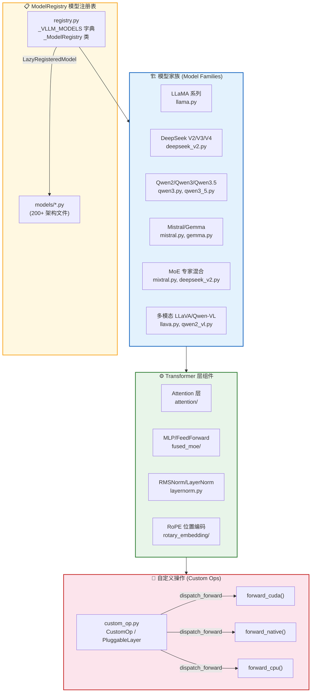
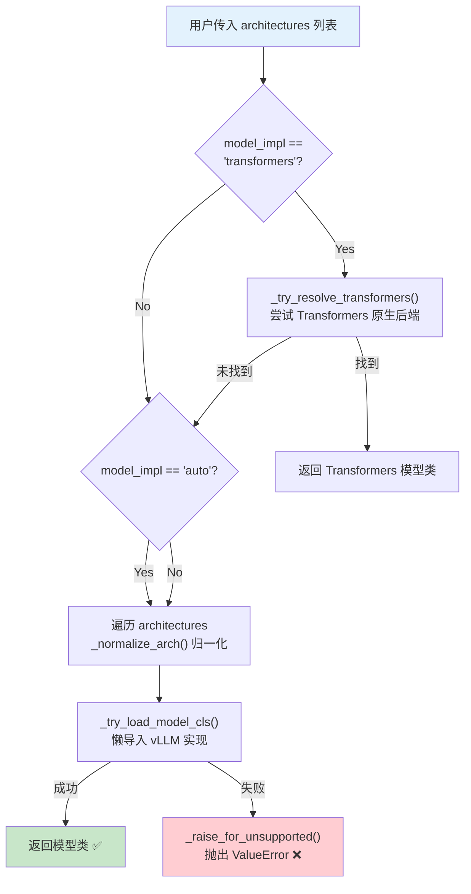
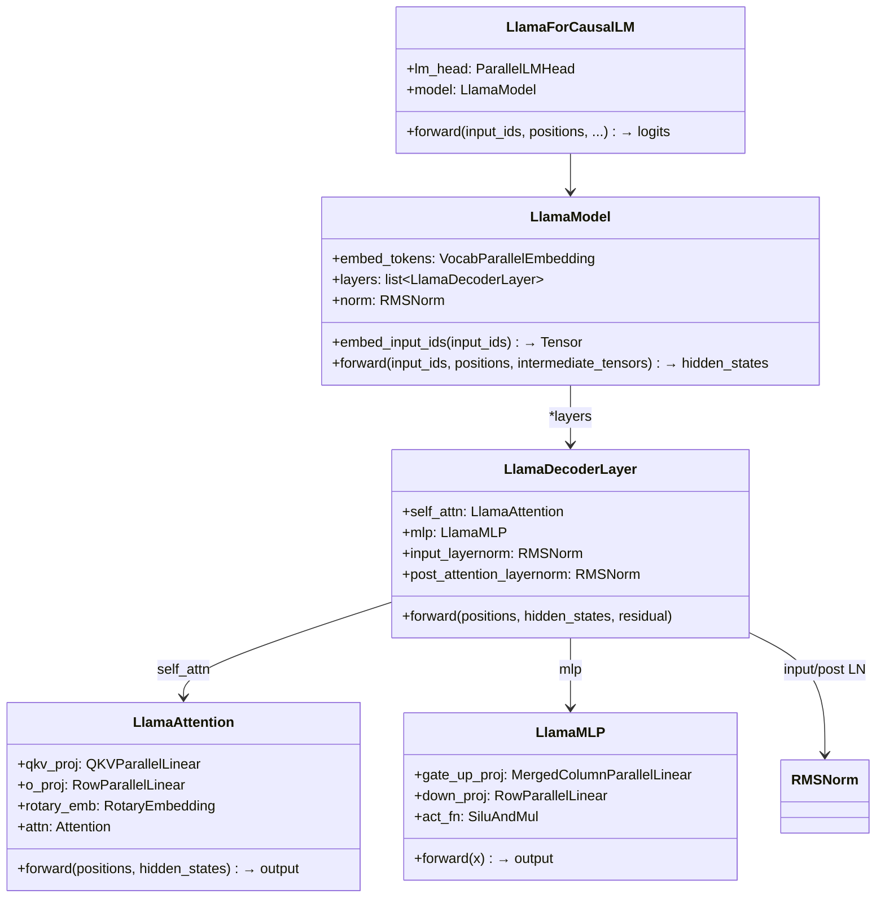
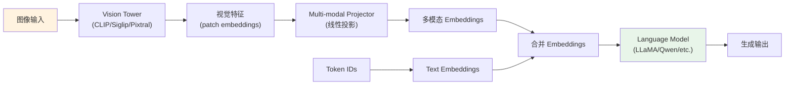
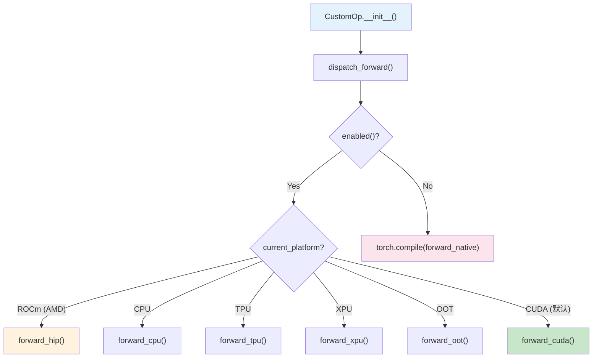
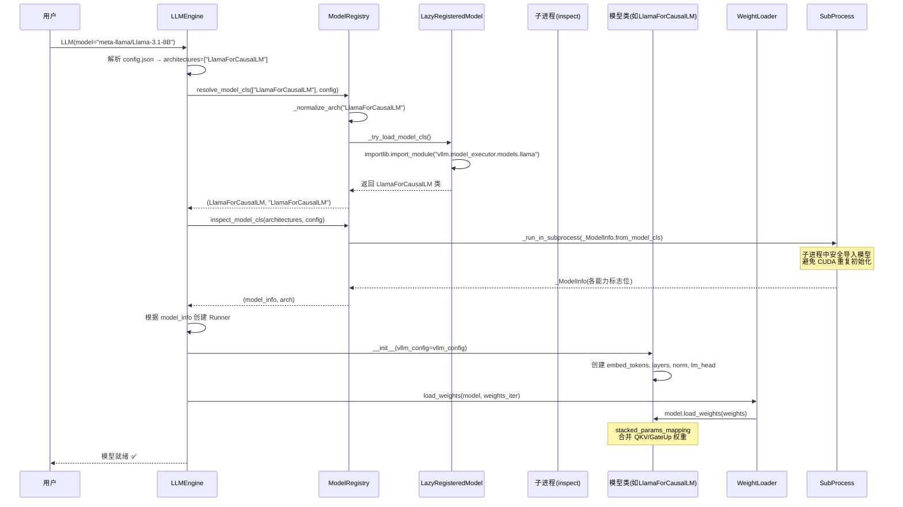

# 07 模型执行器层（Model Executor）全貌分析

> **定位**：vLLM 的 `model_executor` 是模型推理的核心层，负责**模型注册、架构定义、权重加载、前向计算**的完整链路。它向上对接 Engine/Scheduler，向下封装 Attention/MLP/Norm 等基础算子，是理解 vLLM 如何支持 200+ 模型的关键入口。



---

## 一、ModelRegistry 模型注册表机制

### 1.1 核心数据结构

vLLM 的模型注册中心位于 [registry.py](file:///workspace/vllm/model_executor/models/registry.py)，采用**字典映射 + 懒加载**模式：

**`_VLLM_MODELS` 超级字典**（[registry.py:671-682](file:///workspace/vllm/model_executor/models/registry.py#L671-L682)）将所有支持的 HuggingFace 模型类名映射到 vLLM 内部实现：

```python
_VLLM_MODELS = {
    **_TEXT_GENERATION_MODELS,       # ~150 个文本生成模型
    **_EMBEDDING_MODELS,              # ~35 个嵌入模型
    **_LATE_INTERACTION_MODELS,       # ~10 个 Late Interaction 模型
    **_REWARD_MODELS,                 # 奖励模型
    **_TOKEN_CLASSIFICATION_MODELS,   # Token 分类模型
    **_SEQUENCE_CLASSIFICATION_MODELS,# 序列分类模型
    **_MULTIMODAL_MODELS,             # ~120 个多模态模型
    **_SPECULATIVE_DECODING_MODELS,   # 推测解码模型
    **_TRANSFORMERS_SUPPORTED_MODELS, # Transformers 原生支持
    **_TRANSFORMERS_BACKEND_MODELS,   # Transformers 后端透传
}
```

### 1.2 注册流程：Lazy Loading

全局单例 `ModelRegistry` 在初始化时（[registry.py:1319-1327](file:///workspace/vllm/model_executor/models/registry.py#L1319-L1327)）将所有条目包装为 `_LazyRegisteredModel`，**避免启动时导入所有模型模块触发 CUDA 初始化**：

```python
ModelRegistry = _ModelRegistry(
    {
        model_arch: _LazyRegisteredModel(
            module_name=f"vllm.model_executor.models.{mod_relname}",
            class_name=cls_name,
        )
        for model_arch, (mod_relname, cls_name) in _VLLM_MODELS.items()
    }
)
```

### 1.3 模型解析流程

当用户加载一个模型时，`ModelRegistry.resolve_model_cls()` 执行以下解析链路（[registry.py:1176-1228](file:///workspace/vllm/model_executor/models/registry.py#L1176-L1228)）：



### 1.4 子进程 inspect 机制

为避免在主进程导入模型时触发 CUDA 初始化（导致 fork 后无法重新初始化 CUDA），`_LazyRegisteredModel.inspect_model_cls()` 使用**子进程执行**模式（[registry.py:862-897](file:///workspace/vllm/model_executor/models/registry.py#L862-L897)）：

- 通过 `_run_in_subprocess()` 将 inspect 逻辑序列化后发送到子进程执行
- 结果通过 pickle + 临时文件回传
- 支持 JSON 文件缓存（基于源码 hash），避免重复子进程调用

---

## 二、支持的模型架构全景（200+）

> 以下按**模型家族**分类整理，数据来源：[registry.py](file:///workspace/vllm/model_executor/models/registry.py) 中 `_TEXT_GENERATION_MODELS`、`_EMBEDDING_MODELS`、`_MULTIMODAL_MODELS` 等字典，以及 `models/` 目录下的实际实现文件。

### 2.1 文本生成模型（Text Generation / Decoder-only）

| 家族 | HF 类名 → vLLM 映射 | 实现文件 | 特性 |
|------|---------------------|----------|------|
| **LLaMA** | `LlamaForCausalLM` → `LlamaForCausalLM` | [llama.py](file:///workspace/vllm/model_executor/models/llama.py) | 最广泛的基础架构，GQA+RoPE+SwiGLU |
| **LLaMA 4** | `Llama4ForCausalLM` → `Llama4ForCausalLM` | [llama4.py](file:///workspace/vllm/model_executor/models/llama4.py) | 新一代 LLaMA |
| **Mistral** | `MistralForCausalLM` → `MistralForCausalLM` | [mistral.py](file:///workspace/vllm/model_executor/models/mistral.py) | 继承 LLaMA，Sliding Window Attention |
| **Mistral Large 3** | `MistralLarge3ForCausalLM` | [mistral_large_3.py](file:///workspace/vllm/model_executor/models/mistral_large_3.py) | 大规模 Mistral |
| **Mixtral (MoE)** | `MixtralForCausalLM` → `MixtralForCausalLM` | [mixtral.py](file:///workspace/vllm/model_executor/models/mixtral.py) | 8×7B/8×22B 稀疏 MoE |
| **DeepSeek V1/V2** | `DeepseekForCausalLM/V2ForCausalLM` | [deepseek_v2.py](file:///workspace/vllm/model_executor/models/deepseek_v2.py) | MHA + Dense |
| **DeepSeek V3** | `DeepseekV3ForCausalLM` | [deepseek_v2.py](file:///workspace/vllm/model_executor/models/deepseek_v2.py) | MLA + MoE |
| **DeepSeek V4** | `DeepseekV4ForCausalLM` | [deepseek_v4.py](file:///workspace/vllm/model_executor/models/deepseek_v4.py) | MLA + MTP |
| **Qwen2** | `Qwen2ForCausalLM` → `Qwen2ForCausalLM` | [qwen2.py](file:///workspace/vllm/model_executor/models/qwen2.py) | 阿里通义千问二代 |
| **Qwen2-MoE** | `Qwen2MoeForCausalLM` | [qwen2_moe.py](file:///workspace/vllm/model_executor/models/qwen2_moe.py) | Qwen2 MoE 变体 |
| **Qwen3** | `Qwen3ForCausalLM` | [qwen3.py](file:///workspace/vllm/model_executor/models/qwen3.py) | 阿里通义千问三代 |
| **Qwen3-MoE** | `Qwen3MoeForCausalLM` | [qwen3_moe.py](file:///workspace/vllm/model_executor/models/qwen3_moe.py) | Qwen3 MoE 变体 |
| **Qwen3.5** | `Qwen3_5ForCausalLM` | [qwen3_5.py](file:///workspace/vllm/model_executor/models/qwen3_5.py) | 阿里通义千问3.5代 |
| **Gemma** | `GemmaForCausalLM` | [gemma.py](file:///workspace/vllm/model_executor/models/gemma.py) | Google Gemma (GeLU+RMSNorm) |
| **Gemma 2** | `Gemma2ForCausalLM` | [gemma2.py](file:///workspace/vllm/model_executor/models/gemma2.py) | Gemma 2 代 |
| **Gemma 3/4** | `Gemma3/4ForCausalLM` | [gemma3.py](file:///workspace/vllm/model_executor/models/gemma3.py), [gemma4.py](file:///workspace/vllm/model_executor/models/gemma4.py) | 多模态 Gemma |
| **Phi / Phi3** | `PhiForCausalLM / Phi3ForCausalLM` | [phi.py](file:///workspace/vllm/model_executor/models/phi.py), [phi3.py](file:///workspace/vllm/model_executor/models/phi3.py) | Microsoft Phi 系列 |
| **Phi-MoE** | `PhiMoEForCausalLM` | [phimoe.py](file:///workspace/vllm/model_executor/models/phimoe.py) | Microsoft Phi MoE |
| **GPT-2 / GPT-J / GPT-NeoX** | 各自 ForCausalLM | [gpt2.py](file:///workspace/vllm/model_executor/models/gpt2.py), [gpt_j.py](file:///workspace/vllm/model_executor/models/gpt_j.py), [gpt_neox.py](file:///workspace/vllm/model_executor/models/gpt_neox.py) | 经典架构 |
| **Bloom** | `BloomForCausalLM` | [bloom.py](file:///workspace/vllm/model_executor/models/bloom.py) | BigScience Bloom |
| **OPT** | `OPTForCausalLM` | [opt.py](file:///workspace/vllm/model_executor/models/opt.py) | Meta OPT |
| **Falcon** | `FalconForCausalLM` | [falcon.py](file:///workspace/vllm/model_executor/models/falcon.py) | TII Falcon |
| **Baichuan** | `BaiChuan/BaichuanForCausalLM` | [baichuan.py](file:///workspace/vllm/model_executor/models/baichuan.py) | 百川系列 |
| **ChatGLM / GLM** | `ChatGLM/GLM/Glm4ForCausalLM` | [chatglm.py](file:///workspace/vllm/model_executor/models/chatglm.py), [glm.py](file:///workspace/vllm/model_executor/models/glm.py), [glm4.py](file:///workspace/vllm/model_executor/models/glm4.py) | 智谱 GLM 系列 |
| **InternLM** | `InternLM/2/3ForCausalLM` | [internlm2.py](file:///workspace/vllm/model_executor/models/internlm2.py) | 书生 InternLM |
| **OLMo / OLMo2** | `Olmo/Olmo2ForCausalLM` | [olmo.py](file:///workspace/vllm/model_executor/models/olmo.py), [olmo2.py](file:///workspace/vllm/model_executor/models/olmo2.py) | AllenAI OLMo |
| **Mamba / Mamba2** | `Mamba/Mamba2ForCausalLM` | [mamba.py](file:///workspace/vllm/model_executor/models/mamba.py), [mamba2.py](file:///workspace/vllm/model_executor/models/mamba2.py) | SSM 架构 (无 Attention) |
| **Jamba** | `JambaForCausalLM` | [jamba.py](file:///workspace/vllm/model_executor/models/jamba.py) | Hybrid (Mamba+Attention) |
| **StableLM** | `StableLMEpoch/StableLmForCausalLM` | [stablelm.py](file:///workspace/vllm/model_executor/models/stablelm.py) | Stability AI |
| **StarCoder2** | `Starcoder2ForCausalLM` | [starcoder2.py](file:///workspace/vllm/model_executor/models/starcoder2.py) | 代码生成 |
| **Granite / Granite-MoE** | `Granite/GraniteMoeForCausalLM` | [granite.py](file:///workspace/vllm/model_executor/models/granite.py), [granitemoe.py](file:///workspace/vllm/model_executor/models/granitemoe.py) | IBM Granite |
| **Cohere Command-R** | `Cohere/Cohere2ForCausalLM` | [commandr.py](file:///workspace/vllm/model_executor/models/commandr.py), [cohere2_moe.py](file:///workspace/vllm/model_executor/models/cohere2_moe.py) | Cohere 系列 |
| **DBRX** | `DbrxForCausalLM` | [dbrx.py](file:///workspace/vllm/model_executor/models/dbrx.py) | Databricks MoE |
| **Arctic** | `ArcticForCausalLM` | [arctic.py](file:///workspace/vllm/model_executor/models/arctic.py) | Snowflake Arctic |
| **Nemotron** | `Nemotron/HForCausalLM` | [nemotron.py](file:///workspace/vllm/model_executor/models/nemotron.py), [nemotron_h.py](file:///workspace/vllm/model_executor/models/nemotron_h.py) | NVIDIA Nemotron |
| **Grok** | `Grok1ForCausalLM` | [grok1.py](file:///workspace/vllm/model_executor/models/grok1.py) | xAI Grok-1 |
| **Exaone** | `Exaone/4/MoEForCausalLM` | [exaone.py](file:///workspace/vllm/model_executor/models/exaone.py), [exaone_moe.py](file:///workspace/vllm/model_executor/models/exaone_moe.py) | LG AI Research |
| **MiniCPM** | `MiniCPM/3ForCausalLM` | [minicpm.py](file:///workspace/vllm/model_executor/models/minicpm.py), [minicpm3.py](file:///workspace/vllm/model_executor/models/minicpm3.py) | 面壁 MiniCPM |
| **HunYuan** | `HunYuanMoEV1/DenseV1ForCausalLM` | [hunyuan_v1.py](file:///workspace/vllm/model_executor/models/hunyuan_v1.py) | 腾讯混元 |
| **TeleChat** | `TeleChat/2/3ForCausalLM` | [telechat2.py](file:///workspace/vllm/model_executor/models/telechat2.py) | 中国电信 |
| **Step** | `Step1/3Text/3p5ForCausalLM` | [step1.py](file:///workspace/vllm/model_executor/models/step1.py), [step3_text.py](file:///workspace/vllm/model_executor/models/step3_text.py) | 阶跃星辰 |
| **Solar** | `SolarForCausalLM` | [solar.py](file:///workspace/vllm/model_executor/models/solar.py) | Upstage Solar |
| **Plamo** | `Plamo2/3ForCausalLM` | [plamo2.py](file:///workspace/vllm/model_executor/models/plamo2.py), [plamo3.py](file:///workspace/vllm/model_executor/models/plamo3.py) | NAVER Plamo |
| **其他** | RW/FlexOlmo/Persimmon/Orion/Laguna/Zamba2... | 各自 .py 文件 | 30+ 其他架构 |

### 2.2 嵌入模型（Embedding Models）

| 家族 | HF 类名 | 实现文件 | 用途 |
|------|---------|----------|------|
| **BERT** | `BertModel` | [bert.py](file:///workspace/vllm/model_executor/models/bert.py) | 文本嵌入 |
| **RoBERTa** | `RobertaModel` | [roberta.py](file:///workspace/vllm/model_executor/models/roberta.py) | 文本嵌入 |
| **BGE-M3** | `BgeM3EmbeddingModel` | [roberta.py](file:///workspace/vllm/model_executor/models/roberta.py) | 多功能嵌入 |
| **GTE** | `GteModel/NewModel` | [bert_with_rope.py](file:///workspace/vllm/model_executor/models/bert_with_rope.py) | 阿里 GTE |
| **Jina** | `JinaEmbeddingsV5Model` | [jina.py](file:///workspace/vllm/model_executor/models/jina.py) | Jina Embeddings |
| **ModernBERT** | `ModernBertModel` | [modernbert.py](file:///workspace/vllm/model_executor/models/modernbert.py) | 现代化 BERT |
| **NomicBERT** | `NomicBertModel` | [bert_with_rope.py](file:///workspace/vllm/model_executor/models/bert_with_rope.py) | Nomic |
| **CLIP / Siglip** | `CLIPModel / SiglipModel` | [clip.py](file:///workspace/vllm/model_executor/models/clip.py), [siglip.py](file:///workspace/vllm/model_executor/models/siglip.py) | 视觉嵌入 |
| **ColPali** | `ColPaliForRetrieval` | [colpali.py](file:///workspace/vllm/model_executor/models/colpali.py) | Late Interaction |
| **ColBERT** | `HF_ColBERT` | [colbert.py](file:///workspace/vllm/model_executor/models/colbert.py) | Late Interaction |

### 2.3 多模态模型（Multimodal Models）

| 家族 | HF 类名 | 实现文件 | 模态 |
|------|---------|----------|------|
| **LLaVA** | `LlavaForConditionalGeneration` | [llava.py](file:///workspace/vllm/model_executor/models/llava.py) | 图像 |
| **LLaVA-NeXT** | `LlavaNextForConditionalGeneration` | [llava_next.py](file:///workspace/vllm/model_executor/models/llava_next.py) | 图像(动态分辨率) |
| **LLaVA-OneVision** | `LlavaOnevisionForConditionalGeneration` | [llava_onevision.py](file:///workspace/vllm/model_executor/models/llava_onevision.py) | 图像+视频 |
| **Qwen-VL** | `QwenVLForConditionalGeneration` | [qwen_vl.py](file:///workspace/vllm/model_executor/models/qwen_vl.py) | 图像 |
| **Qwen2-VL** | `Qwen2VLForConditionalGeneration` | [qwen2_vl.py](file:///workspace/vllm/model_executor/models/qwen2_vl.py) | 图像(动态分辨率) |
| **Qwen2.5-VL** | `Qwen2_5_VLForConditionalGeneration` | [qwen2_5_vl.py](file:///workspace/vllm/model_executor/models/qwen2_5_vl.py) | 图像 |
| **Qwen3-VL** | `Qwen3VLForConditionalGeneration` | [qwen3_vl.py](file:///workspace/vllm/model_executor/models/qwen3_vl.py) | 图像 |
| **Qwen2-Audio** | `Qwen2AudioForConditionalGeneration` | [qwen2_audio.py](file:///workspace/vllm/model_executor/models/qwen2_audio.py) | 音频 |
| **Qwen2.5-Omni** | `Qwen2_5OmniForConditionalGeneration` | [qwen2_5_omni_thinker.py](file:///workspace/vllm/model_executor/models/qwen2_5_omni_thinker.py) | 全模态 |
| **InternVL** | `InternVLChatModel` | [internvl.py](file:///workspace/vllm/model_executor/models/internvl.py) | 图像 |
| **DeepSeek-VL** | `DeepseekVLV2ForCausalLM` | [deepseek_vl2.py](file:///workspace/vllm/model_executor/models/deepseek_vl2.py) | 图像 |
| **DeepSeek-OCR** | `DeepseekOCR/OCR2ForCausalLM` | [deepseek_ocr.py](file:///workspace/vllm/model_executor/models/deepseek_ocr.py) | OCR |
| **Phi3-V / Phi4-MM** | `Phi3VForCausalLM / Phi4MMForCausalLM` | [phi3v.py](file:///workspace/vllm/model_executor/models/phi3v.py), [phi4mm.py](file:///workspace/vllm/model_executor/models/phi4mm.py) | 视觉语言 |
| **Gemma 3 MM** | `Gemma3ForConditionalGeneration` | [gemma3_mm.py](file:///workspace/vllm/model_executor/models/gemma3_mm.py) | 图像 |
| **Pixtral** | `PixtralForConditionalGeneration` | [pixtral.py](file:///workspace/vllm/model_executor/models/pixtral.py) | 图像(原生多图像) |
| **Molmo / Molmo2** | `MolmoForCausalLM / Molmo2ForConditionalGeneration` | [molmo.py](file:///workspace/vllm/model_executor/models/molmo.py), [molmo2.py](file:///workspace/vllm/model_executor/models/molmo2.py) | 图像 |
| **MiniCPM-V / -O** | `MiniCPMV / MiniCPMO` | [minicpmv.py](file:///workspace/vllm/model_executor/models/minicpmv.py), [minicpmo.py](file:///workspace/vllm/model_executor/models/minicpmo.py) | 图像 |
| **GLM-4V** | `GLM4VForCausalLM` | [glm4v.py](file:///workspace/vllm/model_executor/models/glm4v.py) | 视觉 |
| **Whisper** | `WhisperForConditionalGeneration` | [whisper.py](file:///workspace/vllm/model_executor/models/whisper.py) | 语音识别(ASR) |
| **Ultravox** | `UltravoxModel` | [ultravox.py](file:///workspace/vllm/model_executor/models/ultravox.py) | 语音+文本 |
| **NVLM-D** | `NVLM_D_Model` | [nvlm_d.py](file:///workspace/vllm/model_executor/models/nvlm_d.py) | 多模态 |
| **H2OVL** | `H2OVLChatModel` | [h2ovl.py](file:///workspace/vllm/model_executor/models/h2ovl.py) | 视觉 |
| **Ovis** | `Ovis / Ovis2_5` | [ovis.py](file:///workspace/vllm/model_executor/models/ovis.py), [ovis2_5.py](file:///workspace/vllm/model_executor/models/ovis2_5.py) | 视觉 |
| **MiMo / MiMo-V2** | `MiMo/MoM/V2ForCausalLM` | [mimo.py](file:///workspace/vllm/model_executor/models/mimo.py), [mimo_v2.py](file:///workspace/vllm/model_executor/models/mimo_v2.py) | 全模态 |
| **其他** | Idefics3/Fuyu/Chameleon/Aria/SmolVLM/Tarsier/... | 各自 .py 文件 | 50+ 其他多模态 |

### 2.4 推测解码 / Speculative Decoding 模型

| 类型 | HF 类名 | 实现文件 | 说明 |
|------|---------|----------|------|
| **EAGLE-1/2** | `EagleLlama/Mistral/CohereForCausalLM` | [llama_eagle.py](file:///workspace/vllm/model_executor/models/llama_eagle.py) 等 | EAGLE 推测解码 |
| **EAGLE-3** | `Eagle3Llama/Qwen/DeepSeekForCausalLM` | [llama_eagle3.py](file:///workspace/vllm/model_executor/models/llama_eagle3.py) 等 | EAGLE-3 推测解码 |
| **Medusa** | `MedusaModel` | [medusa.py](file:///workspace/vllm/model_executor/models/medusa.py) | Medusa 头部 |
| **MTP (Multi-Token)** | `DeepSeekMTP/V4MTP/Gemma4MTP` | [deepseek_mtp.py](file:///workspace/vllm/model_executor/models/deepseek_mtp.py) 等 | 多 Token Prediction |
| **DFlash** | `DFlashDraftModel` | [qwen3_dflash.py](file:///workspace/vllm/model_executor/models/qwen3_dflash.py) | Qwen3 DFlash Draft |
| **Extract Hidden States** | `ExtractHiddenStatesModel` | [extract_hidden_states.py](file:///workspace/vllm/model_executor/models/extract_hidden_states.py) | 提取隐状态 |

---

## 三、模型接口定义体系

### 3.1 核心接口：VllmModel

位于 [interfaces_base.py:47-57](file:///workspace/vllm/model_executor/models/interfaces_base.py#L47-L57)，这是**所有 vLLM 模型必须实现的最低契约**：

```python
@runtime_checkable
class VllmModel(Protocol[T_co]):
    """The interface required for all models in vLLM."""

    def __init__(self, vllm_config: VllmConfig, prefix: str = "") -> None: ...

    def embed_input_ids(self, input_ids: torch.Tensor) -> torch.Tensor:
        """Apply token embeddings to `input_ids`."""
        ...

    def forward(self, input_ids: torch.Tensor,
                positions: torch.Tensor) -> T_co: ...
```

**三个核心方法签名约定**：
- `__init__(vllm_config, prefix)` — 统一构造入口
- `embed_input_ids(input_ids)` — Token → Embedding 映射
- `forward(input_ids, positions)` — 前向推理

### 3.2 文本生成接口：VllmModelForTextGeneration

位于 [interfaces_base.py:114-124](file:///workspace/vllm/model_executor/models/interfaces_base.py#L114-L124)：

```python
@runtime_checkable
class VllmModelForTextGeneration(VllmModel[T], Protocol[T]):
    def compute_logits(self, hidden_states: T) -> T | None:
        """Return `None` if TP rank > 0."""
        ...
```

额外要求 `compute_logits()` 方法用于 logits 计算（TP rank > 0 时返回 None）。

### 3.3 Pooling 接口：VllmModelForPooling

位于 [interfaces_base.py:148-213](file:///workspace/vllm/model_executor/models/interfaces_base.py#L148-L213)：

```python
@runtime_checkable
class VllmModelForPooling(VllmModel[T_co], Protocol[T_co]):
    is_pooling_model: ClassVar[Literal[True]] = True
    default_seq_pooling_type: ClassVar[SequencePoolingType] = "LAST"
    default_tok_pooling_type: ClassVar[TokenPoolingType] = "ALL"
    attn_type: ClassVar[AttnTypeStr] = "decoder"
    score_type: ClassVar[ScoreType] = "bi-encoder"
    pooler: Pooler  # The pooler is only called on TP rank 0.
```

### 3.4 扩展能力接口一览（interfaces.py）

[interfaces.py](file:///workspace/vllm/model_executor/models/interfaces.py) 定义了丰富的可选能力接口：

| 接口名 | 标志位 | 功能说明 |
|--------|--------|----------|
| `SupportsMultiModal` | `supports_multimodal = True` | 多模态输入支持（图像/音频/视频） |
| `SupportsLoRA` | `supports_lora = True` | LoRA 适配器支持 |
| `SupportsPP` | `supports_pp = True` | Pipeline Parallelism 支持 |
| `MixtureOfExperts` | (属性检查) | MoE 专家混合架构 |
| `HasInnerState` | `has_inner_state = True` | 内部状态（如 Mamba SSM） |
| `IsAttentionFree` | `is_attention_free = True` | 无 Attention（纯 SSM） |
| `IsHybrid` | `is_hybrid = True` | 混合架构（Attention + SSM） |
| `SupportsTranscription` | `supports_transcription = True` | 语音转文字（ASR） |
| `SupportsRealtime` | `supports_realtime = True` | 实时流式 ASR |
| `SupportsEagle` | `supports_eagle = True` | EAGLE-1/2 推测解码 |
| `SupportsEagle3` | `supports_eagle3 = True` | EAGLE-3 推测解码 |
| `SupportsMRoPE` | `supports_mrope = True` | 多维度 RoPE（3D 位置） |
| `SupportsXDRoPE` | `supports_xdrope = True` | 扩展维 RoPE（4D 位置） |
| `SupportsScoreTemplate` | `supports_score_template = True` | Score Template 支持 |
| `SupportsEncoderCudaGraph` | `supports_encoder_cudagraph = True` | 编码器 CUDA Graph 加速 |
| `SupportsQuant` | (基类继承) | 量化配置自动绑定 |
| `SupportsMambaPrefixCaching` | `supports_mamba_prefix_caching = True` | Mamba 前缀缓存 |
| `HasNoOps` | `has_noops = True` | 含 No-op 占位层 |
| `SupportsCrossEncoding` | `score_type = "cross-encoder"` | Cross-Encoder 打分 |
| `SupportsLateInteraction` | `score_type = "late-interaction"` | Late Interaction (ColBERT) |

---

## 四、主要模型家族深入分析

### 4.1 LLaMA 系列 — 最广泛的基础架构

**文件**: [llama.py](file:///workspace/vllm/model_executor/models/llama.py)

LLaMA 是 vLLM 中**被最多模型复用的基础架构**。从 registry 可以看到，Aquila、InternLM、CWM、Xverse、TeleChat3、IQuestCoder 等大量模型都直接复用 `("llama", "LlamaForCausalLM")`。

#### 核心组件结构



#### 关键代码：LlamaMLP — SwiGLU 激活函数（[llama.py:81-121](file:///workspace/vllm/model_executor/models/llama.py#L81-L121)）

```python
class LlamaMLP(nn.Module):
    def __init__(self, hidden_size, intermediate_size, hidden_act, ...):
        super().__init__()
        self.gate_up_proj = MergedColumnParallelLinear(
            input_size=hidden_size,
            output_sizes=[intermediate_size] * 2,  # gate 和 up 合并
            ...
        )
        self.down_proj = RowParallelLinear(
            input_size=intermediate_size,
            output_size=hidden_size,
            ...
        )
        self.act_fn = SiluAndMul()  # SwiGLU: x * SiLU(gate(x)) * up(x)

    def forward(self, x):
        x, _ = self.gate_up_proj(x)
        x = self.act_fn(x)
        x, _ = self.down_proj(x)
        return x
```

#### 关键代码：LlamaAttention — GQA + RoPE（[llama.py:124-233](file:///workspace/vllm/model_executor/models/llama.py#L124-L233)）

```python
class LlamaAttention(nn.Module):
    def __init__(self, config, hidden_size, num_heads, num_kv_heads, ...):
        # ... TP 分片逻辑 ...
        self.qkv_proj = QKVParallelLinear(...)  # Q/K/V 合并投影
        self.o_proj = RowParallelLinear(...)
        self.rotary_emb = get_rope(self.head_dim, max_position=...)
        self.attn = Attention(...)

    def forward(self, positions, hidden_states):
        qkv, _ = self.qkv_proj(hidden_states)
        q, k, v = qkv.split([self.q_size, self.kv_size, self.kv_size], dim=-1)
        q, k = self.rotary_emb(positions, q, k)  # RoPE 旋转位置编码
        attn_output = self.attn(q, k, v)         # 注意力计算
        output, _ = self.o_proj(attn_output)
        return output
```

#### 关键代码：LlamaModel.forward — PP 支持与 EAGLE 输出（[llama.py:395-434](file:///workspace/vllm/model_executor/models/llama.py#L395-L434)）

```python
def forward(self, input_ids, positions, intermediate_tensors,
            inputs_embeds=None, **extra_layer_kwargs):
    # PP first rank: embed tokens
    if get_pp_group().is_first_rank:
        if inputs_embeds is not None:
            hidden_states = inputs_embeds
        else:
            hidden_states = self.embed_input_ids(input_ids)
        residual = None
    else:
        # PP non-first rank: receive from previous stage
        hidden_states = intermediate_tensors["hidden_states"]
        residual = intermediate_tensors["residual"]

    aux_hidden_states = self._maybe_add_hidden_state([], 0, hidden_states, residual)

    for idx, layer in enumerate(islice(self.layers, self.start_layer, self.end_layer)):
        hidden_states, residual = layer(positions, hidden_states, residual, ...)
        self._maybe_add_hidden_state(aux_hidden_states, idx + 1, hidden_states, residual)

    if not get_pp_group().is_last_rank:
        return IntermediateTensors({"hidden_states": hidden_states, "residual": residual})

    hidden_states, _ = self.norm(hidden_states, residual)

    if len(aux_hidden_states) > 0:
        return hidden_states, aux_hidden_states  # EAGLE 需要 auxiliary hidden states
    return hidden_states
```

### 4.2 DeepSeek V2/V3 — MoE + MLA（多头潜在注意力）

**文件**: [deepseek_v2.py](file:///workspace/vllm/model_executor/models/deepseek_v2.py)

DeepSeek V3 引入了两大创新：**MLA（Multi-head Latent Attention）** 和 **MoE（Mixture of Experts）**。

#### DeepSeekV2MoE — 共享专家 + 路由专家（[deepseek_v2.py:245-318+](file:///workspace/vllm/model_executor/models/deepseek_v2.py#L245-L318)）

```python
class DeepseekV2MoE(nn.Module):
    def __init__(self, config, parallel_config, quant_config, prefix=""):
        super().__init__()
        self.n_routed_experts = config.n_routed_experts   # 被路由的专家数
        self.n_shared_experts = config.n_shared_experts     # 共享专家数

        # Router: 决定 token 发送给哪些专家
        self.gate = GateLinear(config.hidden_size, config.n_routed_experts, ...)

        # EPLB (Expert Parallel Load Balancing) 配置
        self.enable_eplb = parallel_config.enable_eplb
        self.n_redundant_experts = eplb_config.num_redundant_experts
        self.n_logical_experts = self.n_routed_experts
        self.n_physical_experts = self.n_logical_experts + self.n_redundant_experts

        # Routed experts: 使用 FusedMoE 高性能 kernel
        self.experts = FusedMoE(...)
        # Shared experts: 可选的共享全连接层
        if config.n_shared_experts is not None:
            self.shared_experts = DeepseekV2MLP(...)
```

#### DeepSeek V4 — MTP（Multi-Token Prediction）

**文件**: [deepseek_v4.py](file:///workspace/vllm/model_executor/models/deepseek_v4.py), [deepseek_v4_mtp.py](file:///workspace/vllm/model_executor/models/deepseek_v4_mtp.py)

DeepSeek V4 进一步引入了 Multi-Token Prediction 能力，支持一次前向推理预测多个后续 token。

### 4.3 Qwen2/Qwen3/Qwen3.5 — 国产大模型代表

**文件**: [qwen2.py](file:///workspace/vllm/model_executor/models/qwen2.py), [qwen3.py](file:///workspace/vllm/model_executor/models/qwen3.py), [qwen3_5.py](file:///workspace/vllm/model_executor/models/qwen3_5.py)

#### Qwen3 — 复用 Qwen2 架构（[qwen3.py:52-53](file:///workspace/vllm/model_executor/models/qwen3.py#L52-L53)）

```python
from .qwen2 import Qwen2MLP as Qwen3MLP      # 直接复用 Qwen2 的 MLP
from .qwen2 import Qwen2Model                   # 直接复用 Qwen2 的 Model
```

Qwen3 的 Attention 层做了独立实现以支持 **Dual Chunk Attention**（双块注意力）等新特性（[qwen3.py:59-100](file:///workspace/vllm/model_executor/models/qwen3.py#L59-L100)）：

```python
class Qwen3Attention(nn.Module):
    def __init__(self, hidden_size, num_heads, num_kv_heads,
                 rope_parameters, max_position=4096*32,
                 dual_chunk_attention_config=None, ...):
        # ... 标准 GQA 设置 ...
        self.dual_chunk_attention_config = dual_chunk_attention_config
        self.qkv_proj = QKVParallelLinear(hidden_size, self.head_dim, ...)
```

#### Qwen3.5 — 混合架构（Hybrid）（[qwen3_5.py:39-44](file:///workspace/vllm/model_executor/models/qwen3_5.py#L39-L44)）

```python
from vllm.model_executor.layers.mamba.gdn_linear_attn import GatedDeltaNetAttention
from vllm.model_executor.layers.mamba.mamba_utils import (
    MambaStateCopyFunc, MambaStateShapeCalculator, ...
)

from .interfaces import HasInnerState, IsHybrid, MixtureOfExperts, ...
```

Qwen3.5 是 **IsHybrid** 模型——同时包含 Attention 层和 Mamba (SSM) 层，实现了两者的优势互补。

### 4.4 Mistral / Gemma — 开源主流架构

**文件**: [mistral.py](file:///workspace/vllm/model_executor/models/mistral.py), [gemma.py](file:///workspace/vllm/model_executor/models/gemma.py)

#### Mistral — LLaMA 的精简变体（[mistral.py:77-79](file:///workspace/vllm/model_executor/models/mistral.py#L77-L79)）

```python
class MistralAttention(LlamaAttention):  # 直接继承 LLaMA 的 Attention!
    ...

class MistralMLP(nn.Module):              # 与 LLaMA MLP 结构相同
    ...
```

Mistral 几乎完全复用 LLaMA 的实现，主要差异在于 **Sliding Window Attention**（滑动窗口注意力）和 **RoPE 缩放策略**。

#### Gemma — GeLU 替代 SwiGLU（[gemma.py:33-33](file:///workspace/vllm/model_executor/models/gemma.py#L33-L33), [gemma.py:60-80](file:///workspace/vllm/model_executor/models/gemma.py#L60-L80)）

```python
from vllm.model_executor.layers.activation import GeluAndMul  # GeLU 而非 SiLU!
from vllm.model_executor.layers.layernorm import GemmaRMSNorm  # Gemma 专用 Norm

@cache
def _get_gemma_act_fn(hidden_act, hidden_activation):
    if hidden_activation is None:
        return GeluAndMul(approximate="tanh")  # 近似 GeLU
    elif hidden_activation == "gelu_pytorch_tanh":
        return GeluAndMul(approximate="tanh")
    ...
```

Gemma 的核心区别：
- **激活函数**: GeLU (近似 tanh) 替代 LLaMA 的 SwiGLU (SiLU)
- **归一化**: `GemmaRMSNorm`（归一化前先乘以 weight）
- **支持 GGUF 量化**

### 4.5 MoE 模型 — 专家混合架构

#### Mixtral（[mixtral.py:77-100+](file:///workspace/vllm/model_executor/models/mixtral.py#L77-L100)）

```python
class MixtralMoE(nn.Module):
    """A tensor-parallel MoE implementation for Mixtral that shards each expert
    across all ranks."""
    def __init__(self, num_experts, top_k, hidden_size, intermediate_size, ...):
        super().__init__()
        # 使用 FusedMoE 进行高性能 MoE 计算
        self.experts = FusedMoE(
            num_experts=num_experts,
            top_k=top_k,
            hidden_size=hidden_size,
            intermediate_size=intermediate_size,
            ...
        )
```

#### MoE 模型通用接口（[interfaces.py:844-926](file:///workspace/vllm/model_executor/models/interfaces.py#L844-L926)）

```python
@runtime_checkable
class MixtureOfExperts(Protocol):
    expert_weights: MutableSequence[Sequence[Tensor]]  # 各层专家权重
    num_moe_layers: int                                  # MoE 层数
    num_expert_groups: int                               # 专家组数
    num_logical_experts: int                             # 逻辑专家数
    num_physical_experts: int                            # 物理专家数
    num_local_physical_experts: int                      # 本地物理专家数
    num_routed_experts: int                              # 被路由专家数
    num_shared_experts: int                              # 共享专家数
    num_redundant_experts: int                           # 冗余专家数(EPLB)
    moe_layers: Iterable[nn.Module]                      # MoE 层列表

    def set_eplb_state(self, expert_load_view, logical_to_physical_map,
                        logical_replica_count) -> None: ...
    def update_physical_experts_metadata(self, num_physical_experts,
                                         num_local_physical_experts) -> None: ...
```

### 4.6 多模态模型 — 视觉语言模型

#### LLaVA 架构（[llava.py:75-80](file:///workspace/vllm/model_executor/models/llava.py#L75-L80)）

```python
class LlavaImagePixelInputs(TensorSchema):
    """Dimensions: bn(batch*images), c(channels=3), h(height), w(width)"""
    ...

class LlavaForConditionalGeneration(nn.Module, SupportsMultiModal, ...):
    supports_multimodal: ClassVar[Literal[True]] = True

    def __init__(self, *, vllm_config: VllmConfig, prefix: str = ""):
        # Vision Tower: CLIP ViT encoder
        self.vision_tower = CLIPVisionModel(...)
        # Multi-modal Projector: 将视觉特征投影到 LLM 空间
        self.multi_modal_projector = nn.Sequential(
            ColumnParallelLinear(...),
            nn.GELU(),
            RowParallelLinear(...),
        )
        # Language Model: 基于 LLaMA
        self.language_model = LlamaForCausalLM(vllm_config=vllm_config, ...)
```

多模态模型的核心流程：



---

## 五、Transformer 层组件详解

### 5.1 Attention 层

位于 `model_executor/layers/attention/` 目录，提供多种注意力实现：

| 文件 | 类名 | 用途 |
|------|------|------|
| [attention.py](file:///workspace/vllm/model_executor/layers/attention/attention.py) | `Attention` | 标准 Decoder-only 注意力（核心） |
| [encoder_only_attention.py](file:///workspace/vllm/model_executor/layers/attention/encoder_only_attention.py) | `EncoderOnlyAttention` | 双向注意力（嵌入模型用） |
| [mla_attention.py](file:///workspace/vllm/model_executor/layers/attention/mla_attention.py) | `MLAAttention` | DeepSeek MLA 多头潜在注意力 |
| [chunked_local_attention.py](file:///workspace/vllm/model_executor/layers/attention/chunked_local_attention.py) | `ChunkedLocalAttention` | 分块局部注意力 |
| [cross_attention.py](file:///workspace/vllm/model_executor/layers/attention/cross_attention.py) | `CrossAttention` | 交叉注意力（多模态用） |
| [mm_encoder_attention.py](file:///workspace/vllm/model_executor/layers/attention/mm_encoder_attention.py) | `MMEncoderAttention` | 多模态编码器注意力 |
| [static_sink_attention.py](file:///workspace/vllm/model_executor/layers/attention/static_sink_attention.py) | `StaticSinkAttention` | 静态 Sink 注意力 |

导出列表（[__init__.py](file:///workspace/vllm/model_executor/layers/attention/__init__.py)）：

```python
__all__ = [
    "Attention", "ChunkedLocalAttention", "CrossAttention",
    "EncoderOnlyAttention", "MLAAttention",
    "MMEncoderAttention", "StaticSinkAttention",
]
```

### 5.2 MLP / FeedForward 层

#### 标准 MLP（SwiGLU）

如 [llama.py:81-121](file:///workspace/vllm/model_executor/models/llama.py#L81-L121) 所示，使用 `MergedColumnParallelLinear` 合并 gate/up 投影 + `SiluAndMul` 激活 + `RowParallelLinear` 下投影。

#### MoE 层（FusedMoE）

位于 `model_executor/layers/fused_moe/`，是 vLLM MoE 推理的核心：

- **主入口**: [fused_moe/__init__.py](file:///workspace/vllm/model_executor/layers/fused_moe/__init__.py) — `FusedMoE` 类
- **Expert 实现**: `experts/` 目录下有 15+ 种专家 kernel 实现
  - `cutlass_moe.py` — NVIDIA CUTLASS MoE
  - `deep_gemm_moe.py` — DeepGEMM MoE
  - `flashinfer_cutlass_moe.py` — FlashInfer + CUTLASS
  - `trtllm_fp8_moe.py`, `trtllm_bf16_moe.py` — TensorRT-LLM MoE
  - `aiter_mxfp4_w4a8_moe.py` — AMD AITER MXFP4 MoE
  - `cpu_moe.py`, `xpu_moe.py` — CPU/XPU 回退
- **配置文件**: `configs/` 目录含数百个针对不同 GPU 型号/E/dtype 的预调优配置

### 5.3 RMSNorm / LayerNorm

**文件**: [layernorm.py](file:///workspace/vllm/model_executor/layers/layernorm.py)

RMSNorm 作为 CustomOp 注册（[layernorm.py:37-38](file:///workspace/vllm/model_executor/layers/layernorm.py#L37-L38)）：

```python
@CustomOp.register("rms_norm")
class RMSNorm(CustomOp):
    """Root mean square normalization.
    Computes x -> w * x / sqrt(E[x^2] + eps)"""
    def __init__(self, hidden_size, eps=1e-6, var_hidden_size=None,
                 has_weight=True, dtype=None):
        super().__init__()
        self.hidden_size = hidden_size
        self.variance_epsilon = eps
        self.weight = nn.Parameter(torch.ones(hidden_size, dtype=weight_dtype))
```

RMSNorm 提供**多后端分发**：
- `forward_cuda()` — CUDA kernel（高性能）
- `forward_native()` — PyTorch 原生实现（fallback / torch.compile 兼容）
- `forward_cpu()` / `forward_xpu()` / `forward_tpu()` — 其他平台

此外还有 `GemmaRMSNorm`（Gemma 专用，先乘 weight 再 normalize）、`LayerNorm`（标准 LayerNorm）、`PolyNorm`（多项式归一化）等变体。

### 5.4 RoPE 位置编码

**目录**: `model_executor/layers/rotary_embedding/`（19 个文件）

vLLM 实现了**极其丰富的 RoPE 变体**，覆盖主流模型的所有位置编码方案：

| 文件 | RoPE 变体 | 使用模型 |
|------|-----------|----------|
| [base.py](file:///workspace/vllm/model_executor/layers/rotary_embedding/base.py) | 基础 RoPE | LLaMA, 多数模型 |
| [linear_scaling_rope.py](file:///workspace/vllm/model_executor/layers/rotary_embedding/linear_scaling_rope.py) | 线性缩放 | LLaMA 2 长版本 |
| [ntk_scaling_rope.py](file:///workspace/vllm/model_executor/layers/rotary_embedding/ntk_scaling_rope.py) | NTK-aware 缩放 | Code LLaMA |
| [dynamic_ntk_scaling_rope.py](file:////workspace/vllm/model_executor/layers/rotary_embedding/dynamic_ntk_scaling_rope.py) | 动态 NTK | Grok-1 |
| [dynamic_ntk_alpha_rope.py](file:///workspace/vllm/model_executor/layers/rotary_embedding/dynamic_ntk_alpha_rope.py) | 动态 NTK-α | DeepSeek |
| [yarn_scaling_rope.py](file:///workspace/vllm/model_executor/layers/rotary_embedding/yarn_scaling_rope.py) | YaRN 缩放 | Mistral, Suno |
| [llama3_rope.py](file:///workspace/vllm/model_executor/layers/rotary_embedding/llama3_rope.py) | LLaMA 3 RoPE | LLaMA 3 |
| [mrope.py](file:///workspace/vllm/model_executor/layers/rotary_embedding/mrope.py) | M-RoPE (3D) | Qwen2-VL |
| [xdrope.py](file:///workspace/vllm/model_executor/layers/rotary_embedding/xdrope.py) | XD-RoPE (4D) | Qwen2.5-VL |
| [deepseek_scaling_rope.py](file:///workspace/vllm/model_executor/layers/rotary_embedding/deepseek_scaling_rope.py) | DeepSeek 缩放 | DeepSeek V2/V3 |
| [gemma4_rope.py](file:///workspace/vllm/model_executor/layers/rotary_embedding/gemma4_rope.py) | Gemma 4 RoPE | Gemma 4 |
| [fope.py](file:///workspace/vllm/model_executor/layers/rotary_embedding/fope.py) | FOPE | 某些新模型 |
| [telechat3_scaling_rope.py](file:///workspace/vllm/model_executor/layers/rotary_embedding/telechat3_scaling_rope.py) | TeleChat3 缩放 | TeleChat 3 |
| [dual_chunk_rope.py](file:///workspace/vllm/model_executor/layers/rotary_embedding/dual_chunk_rope.py) | Dual Chunk | Qwen3 |
| [llama4_vision_rope.py](file:///workspace/vllm/model_executor/layers/rotary_embedding/llama4_vision_rope.py) | LLaMA 4 Vision | LLaMA 4 |
| [ernie45_vl_rope.py](file:///workspace/vllm/model_executor/layers/rotary_embedding/ernie45_vl_rope.py) | Ernie 4.5 VL | Ernie 4.5 |
| [phi3_long_rope_scaled_rope.py](file:///workspace/vllm/model_executor/layers/rotary_embedding/phi3_long_rope_scaled_rope.py) | Phi3 Long RoPE | Phi-3 |
| [mrope_interleaved.py](file:///workspace/vllm/model_executor/layers/rotary_embedding/mrope_interleaved.py) | M-RoPE Interleaved | 某些 VL 模型 |

统一入口 `get_rope()` 根据配置自动选择对应的 RoPE 实现。

---

## 六、自定义操作注册（Custom Op）

**文件**: [custom_op.py](file:///workspace/vllm/model_executor/custom_op.py)

### 6.1 CustomOp — 基础设施

`CustomOp` 是 vLLM 所有自定义操作的基类（[custom_op.py:103-107](file:///workspace/vllm/model_executor/custom_op.py#L103-L107)）：

```python
class CustomOp(nn.Module):
    """
    Base class for custom ops.
    Dispatches the forward method to the appropriate backend.
    """
```

**核心设计理念**：通过装饰器注册 + 运行时分发，实现**一套代码适配多硬件后端**。

### 6.2 注册机制

```python
op_registry: dict[str, type["CustomOp"] | type["PluggableLayer"]] = {}
op_registry_oot: dict[str, type["CustomOp"] | type["PluggableLayer"]] = {}
```

两种注册方式：

**1. `@CustomOp.register(name)`**（[custom_op.py:307-320](file:///workspace/vllm/model_executor/custom_op.py#L307-L320)）— 注册到 `op_registry`：

```python
@classmethod
def register(cls, name: str, dynamic_arg_dims=None):
    def decorator(op_cls):
        assert name not in op_registry, f"Duplicate op name: {name}"
        op_cls.name = name
        op_cls._dynamic_arg_dims = dynamic_arg_dims
        op_registry[name] = op_cls
        return op_cls
    return decorator
```

**2. `@CustomOp.register_oot(name)`**（[custom_op.py:332-350](file:///workspace/vllm/model_executor/custom_op.py#L332-L350)）— 注册到 `op_registry_OOT`（Out-of-Tree 替换）：

```python
@classmethod
def register_oot(cls, _decorated_op_cls=None, name=None):
    def decorator(op_cls):
        reg_name = name or cls.__name__
        op_registry_oot[reg_name] = op_cls
        return op_cls
    ...
```

### 6.3 后端分发机制

`dispatch_forward()` 方法（[custom_op.py:174-207](file:///workspace/vllm/model_executor/custom_op.py#L174-L207)）根据当前运行平台选择对应的前向方法：



### 6.4 启用/禁用控制

`enabled()` 类方法（[custom_op.py:272-289](file:///workspace/vllm/model_executor/custom_op.py#L272-L289)）通过 `CompilationConfig.custom_ops` 控制：

```python
@classmethod
def enabled(cls) -> bool:
    compilation_config = get_cached_compilation_config()
    custom_ops = compilation_config.custom_ops
    enabled = f"+{cls.name}" in custom_ops
    disabled = f"-{cls.name}" in custom_ops
    return (CustomOp.default_on() or enabled) and not disabled
```

用户可通过 `--enforce-eager` 或自定义 op 配置来精细控制每个 custom op 的启用状态。

### 6.5 PluggableLayer — 可插拔层

`PluggableLayer`（[custom_op.py:32-100](file:///workspace/vllm/model_executor/custom_op.py#L32-L100)）与 `CustomOp` 不同：

- **CustomOp**: 同一个类，**不同 forward 方法**分派到不同后端（适合 kernel 级别的替换）
- **PluggableLayer**: **整个类可以被 OOT 替换**（适合架构级别的替换，如替换整个 attention 层）

两者均支持 `register_OOT` 用于第三方插件替换内置实现。

---

## 七、模型注册与加载完整流程



---

## 八、架构总结

### 8.1 设计亮点

1. **Lazy Loading + 子进程 Inspect**：避免启动时导入 200+ 模型文件，同时绕过 CUDA fork 限制
2. **架构复用**：LLaMA 作为"元架构"，被 Aquila/InternLM/TeleChat/Qwen 等 20+ 模型直接复用
3. **接口协议驱动**：通过 Python `Protocol`（structural typing）定义能力接口，无需强制继承
4. **CustomOp 多后端分发**：一套代码自动适配 CUDA/ROCm/CPU/TPU/XPU/OOT
5. **PluggableLayer OOT 扩展**：支持第三方插件零侵入式替换任意层组件
6. **MoE 丰富生态**：15+ 种 Expert Kernel 实现 + 数百个预调优配置 + EPLB 负载均衡

### 8.2 模型执行器的角色定位

```
┌─────────────────────────────────────────────────────┐
│                    vLLM Engine                       │
│  ┌──────────┐  ┌───────────┐  ┌──────────────────┐  │
│  │ Scheduler │  │ Cache Eng │  │ Model Runner     │  │
│  └────┬─────┘  └─────┬─────┘  └────────┬─────────┘  │
│       │              │                  │             │
│  ┌────▼──────────────▼──────────────────▼─────────┐  │
│  │           Model Executor (本层分析)             │  │
│  │  ┌────────────┐  ┌──────────┐  ┌────────────┐  │  │
│  │  │ ModelReg.  │→ │ Model Fam│→ │Layer Comps │  │  │
│  │  │ (200+模型) │  │(LLaMA等) │  │(Attn/MLP)  │  │  │
│  │  └────────────┘  └──────────┘  └─────┬──────┘  │  │
│  │                                       │         │  │
│  │  ┌────────────────────────────────────▼──────┐  │  │
│  │  │          Custom Op (多后端分发)           │  │  │
│  │  │  CUDA / ROCm / CPU / TPU / XPU / OOT     │  │  │
│  │  └──────────────────────────────────────────-┘  │  │
│  └─────────────────────────────────────────────────┘  │
│       │                                              │
│  ┌────▼───────────────────────────────────────────┐  │
│  │           Kernels (CUDA/Triton/Custom Ops)      │  │
│  │  vllm._custom_ops / attention kernels / etc.   │  │
│  └─────────────────────────────────────────────────┘  │
└─────────────────────────────────────────────────────┘
```
