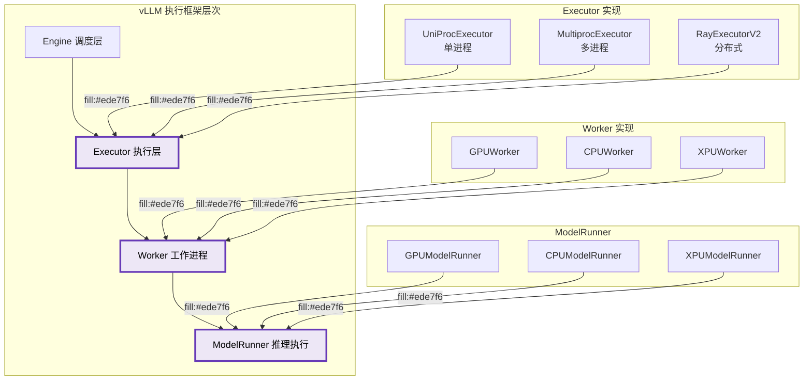
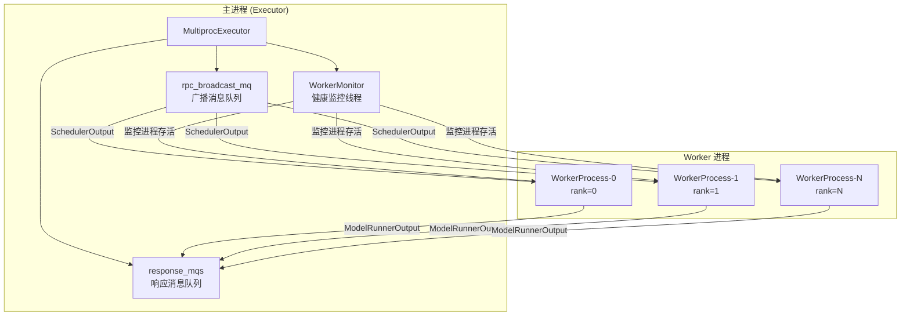
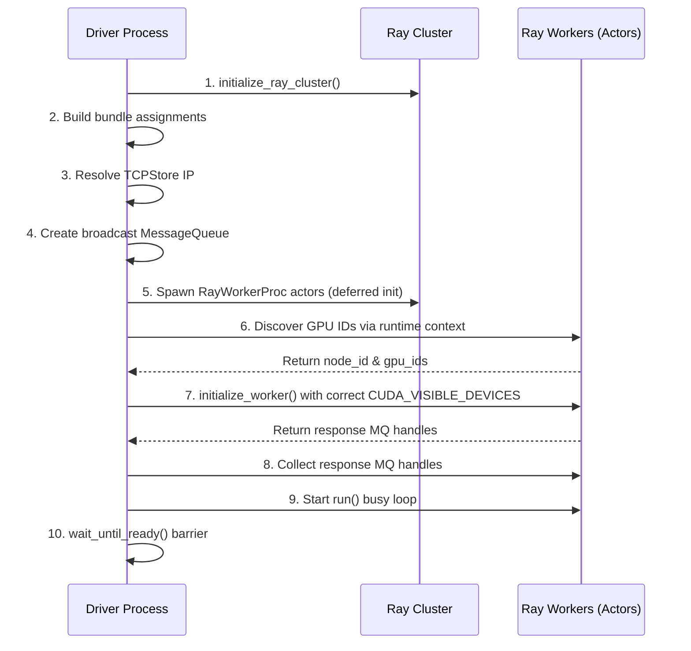
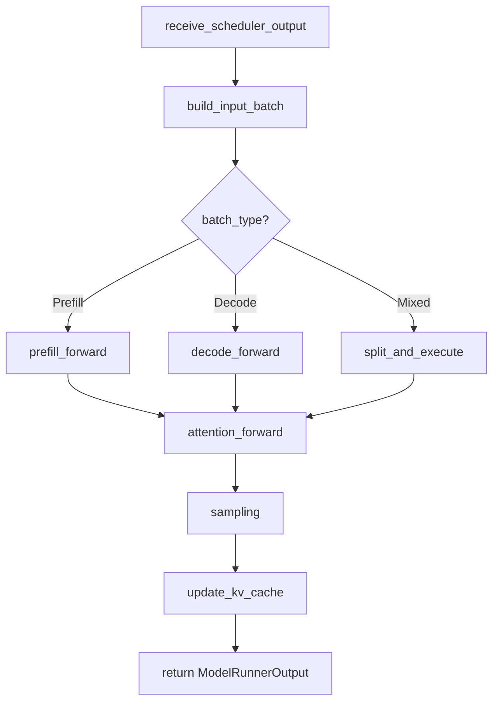
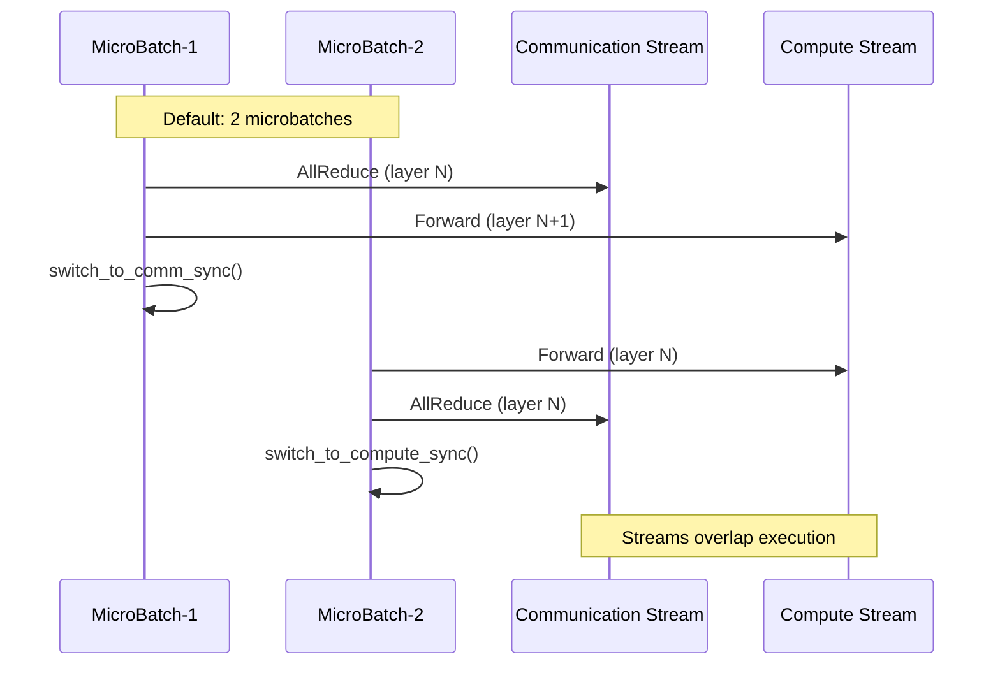
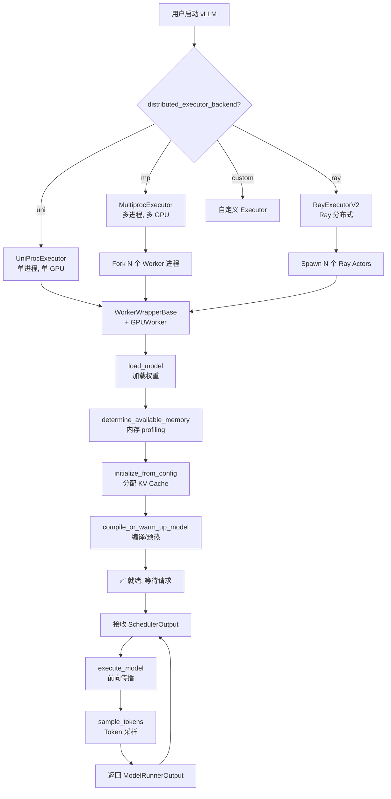
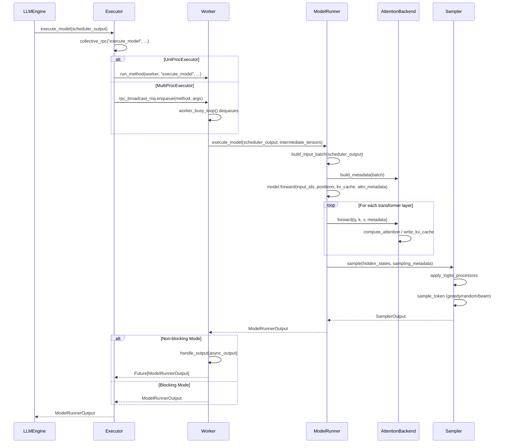

# vLLM Worker 与执行框架分析

## 定位

本文档深入分析 vLLM v1 架构中的 **执行框架（Executor）** 和 **Worker** 层次结构。执行框架负责模型在不同硬件设备上的调度与执行，是 vLLM 推理引擎的核心基础设施。该框架采用分层设计，通过 **Executor → Worker → ModelRunner** 三层抽象，实现了对单 GPU、多 GPU、多节点以及异构硬件的统一管理。



---

## 一、Executor 抽象基类

### 1.1 核心职责

`Executor` 是所有执行器的抽象基类，定义了统一的执行接口。它负责：
- **生命周期管理**：初始化、健康检查、关闭
- **RPC 通信**：向所有 Worker 广播控制消息
- **模型执行**：协调模型前向传播和采样
- **资源管理**：KV Cache、LoRA、内存休眠/唤醒

**源码位置**: [abstract.py](file:///workspace/vllm/v1/executor/abstract.py)

### 1.2 类定义与关键属性

```python
class Executor(ABC):
    """Abstract base class for vLLM executors.

    An executor is responsible for executing the model on one device,
    or it can be a distributed executor that can execute the model on multiple devices.
    """

    uses_ray: bool = False  # whether the executor uses Ray for orchestration.
    supports_pp: bool = False  # whether the executor supports PP
```

- [第 37-46 行](file:///workspace/vllm/v1/executor/abstract.py#L37-L46)：定义类级别属性标识是否使用 Ray 以及是否支持 Pipeline Parallelism。

### 1.3 Executor 选择策略

`get_class()` 方法根据配置动态选择 Executor 实现：

```python
@staticmethod
def get_class(vllm_config: VllmConfig) -> type["Executor"]:
    executor_class: type[Executor]
    parallel_config = vllm_config.parallel_config
    distributed_executor_backend = parallel_config.distributed_executor_backend
    if isinstance(distributed_executor_backend, type):
        if not issubclass(distributed_executor_backend, Executor):
            raise TypeError(...)
        executor_class = distributed_executor_backend
    elif distributed_executor_backend == "ray":
        if envs.VLLM_USE_RAY_V2_EXECUTOR_BACKEND:
            from vllm.v1.executor.ray_executor_v2 import RayExecutorV2
            executor_class = RayExecutorV2
        else:
            from vllm.v1.executor.ray_executor import RayDistributedExecutor
            executor_class = RayDistributedExecutor
    elif distributed_executor_backend == "mp":
        from vllm.v1.executor.multiproc_executor import MultiprocExecutor
        executor_class = MultiprocExecutor
    elif distributed_executor_backend == "uni":
        from vllm.v1.executor.uniproc_executor import UniProcExecutor
        executor_class = UniProcExecutor
    # ... 其他分支
```

- [第 47-92 行](file:///workspace/vllm/v1/executor/abstract.py#L47-L92)：支持以下后端选择：
  - `"uni"` → `UniProcExecutor`（单进程）
  - `"mp"` → `MultiprocExecutor`（多进程）
  - `"ray"` → `RayExecutorV2` / `RayDistributedExecutor`（Ray 分布式）
  - 自定义类或字符串限定名

### 1.4 统一接口定义

#### 初始化与配置

```python
def __init__(self, vllm_config: VllmConfig) -> None:
    self.vllm_config = vllm_config
    self.model_config = vllm_config.model_config
    self.cache_config = vllm_config.cache_config
    self.lora_config = vllm_config.lora_config
    self.load_config = vllm_config.load_config
    self.parallel_config = vllm_config.parallel_config
    self.scheduler_config = vllm_config.scheduler_config
    self.device_config = vllm_config.device_config
    self.speculative_config = vllm_config.speculative_config
    self.observability_config = vllm_config.observability_config
    self._init_executor()
    self.is_sleeping = False
    self.sleeping_tags: set[str] = set()
    self.kv_output_aggregator: KVOutputAggregator | None = None
```

- [第 94-112 行](file:///workspace/vllm/v1/executor/abstract.py#L94-L112)：存储完整配置并调用子类实现的 `_init_executor()`。

#### 核心 RPC 接口

```python
@abstractmethod
def collective_rpc(
    self,
    method: str | Callable[[WorkerBase], _R],
    timeout: float | None = None,
    args: tuple = (),
    kwargs: dict | None = None,
    non_block: bool = False,
):
    raise NotImplementedError
```

- [第 198-202 行](file:///workspace/vllm/v1/executor/abstract.py#L198-L202)：这是 Executor 的核心抽象方法，用于向所有 Worker 发送 RPC 调用。
- 支持**同步**和**异步**（返回 Future）两种模式。
- `method` 可以是方法名字符串或可序列化的 Callable。

#### 模型执行接口

```python
def execute_model(
    self, scheduler_output: SchedulerOutput, non_block: bool = False
) -> ModelRunnerOutput | None | Future[ModelRunnerOutput | None]:
    output = self.collective_rpc(
        "execute_model", args=(scheduler_output,), non_block=non_block
    )
    return output[0]

def sample_tokens(
    self, grammar_output: GrammarOutput | None, non_block: bool = False
) -> ModelRunnerOutput | Future[ModelRunnerOutput]:
    output = self.collective_rpc(
        "sample_tokens", args=(grammar_output,), non_block=non_block
    )
    return output[0]
```

- [第 221-247 行](file:///workspace/vllm/v1/executor/abstract.py#L221-L247)：将 Scheduler 的输出分发给 Worker 执行，并收集结果。

#### 其他管理接口

| 方法名 | 功能 | 行号 |
|--------|------|------|
| `initialize_from_config()` | 初始化 KV Cache 并编译模型 | [118-137](file:///workspace/vllm/v1/executor/abstract.py#L118-L137) |
| `determine_available_memory()` | 确定可用 GPU 内存 | [146-147](file:///workspace/vllm/v1/executor/abstract.py#L146-L147) |
| `check_health()` | 健康检查 | [274-278](file:///workspace/vllm/v1/executor/abstract.py#L274-L278) |
| `shutdown()` | 关闭 Executor | [280-282](file:///workspace/vllm/v1/executor/abstract.py#L280-L282) |
| `sleep()` / `wake_up()` | 内存休眠/唤醒 | [322-360](file:///workspace/vllm/v1/executor/abstract.py#L322-L360) |
| `add_lora()` / `remove_lora()` | LoRA 管理 | [296-306](file:///workspace/vllm/v1/executor/abstract.py#L296-L306) |

---

## 二、UniProcExecutor 单进程执行器

### 2.1 适用场景

**适用场景**：单 GPU 推理、开发调试、简单部署场景。

**特点**：
- 在**主进程**中直接创建 Worker，无额外进程开销
- 支持异步调度（async_scheduling）
- 适用于 `tensor_parallel_size=1` 且无 Pipeline Parallelism 的场景

**源码位置**: [uniproc_executor.py](file:///workspace/vllm/v1/executor/uniproc_executor.py)

### 2.2 实现细节

#### 初始化流程

```python
class UniProcExecutor(Executor):
    def _init_executor(self) -> None:
        """Initialize the worker and load the model."""
        self.driver_worker = WorkerWrapperBase(rpc_rank=0)
        distributed_init_method, rank, local_rank = self._distributed_args()
        kwargs = dict(
            vllm_config=self.vllm_config,
            local_rank=local_rank,
            rank=rank,
            distributed_init_method=distributed_init_method,
            is_driver_worker=True,
            shared_worker_lock=Lock(),
        )

        self.driver_worker.init_worker(all_kwargs=[kwargs])
        self.driver_worker.init_device()

        if envs.VLLM_ELASTIC_EP_SCALE_UP_LAUNCH:
            self.driver_worker.elastic_ep_execute("load_model")
        else:
            self.driver_worker.load_model()
        current_platform.update_block_size_for_backend(self.vllm_config)
```

- [第 46-66 行](file:///workspace/vllm/v1/executor/uniproc_executor.py#L46-L66)：创建单个 `WorkerWrapperBase` 实例并在当前进程初始化。

#### 分布式参数获取

```python
def _distributed_args(self) -> tuple[str, int, int]:
    """Return (distributed_init_method, rank, local_rank)."""
    distributed_init_method = get_distributed_init_method(get_ip(), get_open_port())
    device_info = self.vllm_config.device_config.device.__str__().split(":")
    local_rank = int(device_info[1]) if len(device_info) > 1 else 0
    return distributed_init_method, 0, local_rank
```

- [第 68-74 行](file:///workspace/vllm/v1/executor/uniproc_executor.py#L68-L74)：单进程模式下 rank 始终为 0。

#### RPC 实现（直接函数调用）

```python
def collective_rpc(
    self,
    method: str | Callable,
    timeout: float | None = None,
    args: tuple = (),
    kwargs: dict | None = None,
    non_block: bool = False,
    single_value: bool = False,
) -> Any:
    if kwargs is None:
        kwargs = {}

    if not non_block:
        result = run_method(self.driver_worker, method, args, kwargs)
        return result if single_value else [result]

    try:
        result = run_method(self.driver_worker, method, args, kwargs)
        if isinstance(result, AsyncModelRunnerOutput):
            return AsyncOutputFuture(result, single_value)
        future = Future[Any]()
        future.set_result(result if single_value else [result])
    except Exception as e:
        future = Future[Any]()
        future.set_exception(e)
    return future
```

- [第 80-105 行](file:///workspace/vllm/v1/executor/uniproc_executor.py#L80-L105)：**关键点**：UniProcExecutor 的 RPC 是直接函数调用，无需序列化或进程间通信。

#### 异步输出封装

```python
class AsyncOutputFuture(Future):
    def __init__(self, async_output: AsyncModelRunnerOutput, single_value: bool):
        self.async_output = async_output
        self.single_value = single_value
        super().__init__()

    def result(self, timeout=None):
        if timeout is not None:
            raise RuntimeError("timeout not implemented")

        if not super().done():
            try:
                output = self.async_output.get_output()
                self.set_result(output if self.single_value else [output])
            except Exception as e:
                self.set_exception(e)
        return super().result()
```

- [第 26-42 行](file:///workspace/vllm/v1/executor/uniproc_executor.py#L26-L42)：封装异步输出为标准 `Future` 接口。

### 2.3 ExecutorWithExternalLauncher

```python
class ExecutorWithExternalLauncher(UniProcExecutor):
    """An executor that uses external launchers to launch engines,
    specially designed for torchrun-compatible launchers...
    """
```

- [第 149-195 行](file:///workspace/vllm/v1/executor/uniproc_executor.py#L149-L195)：支持 torchrun 等外部启动器，使用环境变量 `RANK`、`LOCAL_RANK`、`MASTER_ADDR` 进行分布式初始化。

---

## 三、MultiProcExecutor 多进程执行器

### 3.1 适用场景

**适用场景**：多 GPU 单机推理、Tensor Parallelism、Pipeline Parallelism。

**特点**：
- 使用 Python `multiprocessing` 创建多个 Worker 进程
- 基于 **ZMQ MessageQueue** 进行进程间通信
- 支持跨节点扩展（通过 NCCL 数据平面）

**源码位置**: [multiproc_executor.py](file:///workspace/vllm/v1/executor/multiproc_executor.py)

### 3.2 进程架构



### 3.3 初始化流程详解

```python
def _init_executor(self) -> None:
    self._finalizer = weakref.finalize(self, self.shutdown)
    self.is_failed = False
    self.failure_callback: FailureCallback | None = None

    tp_size, pp_size, pcp_size = self._get_parallel_sizes()
    assert self.world_size == tp_size * pp_size * pcp_size, (...)

    set_multiprocessing_worker_envs()

    distributed_init_method = get_distributed_init_method(
        get_loopback_ip(), get_open_port()
    )
    self.rpc_broadcast_mq: MessageQueue | None = None
    scheduler_output_handle: Handle | None = None
```

- [第 109-131 行](file:///workspace/vllm/v1/executor/multiproc_executor.py#L109-L131)：初始化并行参数和通信基础设施。

#### 并行尺寸计算

```python
def _get_parallel_sizes(self) -> tuple[int, int, int]:
    self.world_size = self.parallel_config.world_size
    assert self.world_size % self.parallel_config.nnodes_within_dp == 0, (...)
    self.local_world_size = self.parallel_config.local_world_size
    tp_size = self.parallel_config.tensor_parallel_size
    pp_size = self.parallel_config.pipeline_parallel_size
    pcp_size = self.parallel_config.prefill_context_parallel_size
    return tp_size, pp_size, pcp_size
```

- [第 248-259 行](file:///workspace/vllm/v1/executor/multiproc_executor.py#L248-L259)：计算 TP、PP、PCP 尺寸，world_size 必须等于三者的乘积。

#### Worker 进程创建

```python
for local_rank in range(self.local_world_size):
    global_rank = global_start_rank + local_rank
    is_driver_worker = self._is_driver_worker(global_rank)
    with cpu_omp_manager.configure_omp_envs(
        rank=global_rank, local_rank=local_rank
    ):
        unready_worker_handle = WorkerProc.make_worker_process(
            vllm_config=self.vllm_config,
            local_rank=local_rank,
            rank=global_rank,
            distributed_init_method=distributed_init_method,
            input_shm_handle=scheduler_output_handle,
            shared_worker_lock=shared_worker_lock,
            is_driver_worker=is_driver_worker,
            inherited_fds=inherited_fds,
        )
    unready_workers.append(unready_worker_handle)
```

- [第 175-191 行](file:///workspace/vllm/v1/executor/multiproc_executor.py#L175-L191)：为每个 local_rank 创建 Worker 进程。

### 3.4 进程间通信机制（MessageQueue）

#### 消息队列架构

```python
# Leader node 初始化广播 MQ
if self.parallel_config.node_rank_within_dp == 0:
    max_chunk_bytes = envs.VLLM_MQ_MAX_CHUNK_BYTES_MB * 1024 * 1024
    mq_connect_ip = get_ip()
    self.rpc_broadcast_mq = MessageQueue(
        self.world_size,
        self.local_world_size,
        max_chunk_bytes=max_chunk_bytes,
        connect_ip=mq_connect_ip,
    )
    scheduler_output_handle = self.rpc_broadcast_mq.export_handle()
```

- [第 134-156 行](file:///workspace/vllm/v1/executor/multiproc_executor.py#L134-L156)：Leader 节点创建共享内存广播队列。

#### RPC 调用流程

```python
def collective_rpc(
    self,
    method: str | Callable,
    timeout: float | None = None,
    args: tuple = (),
    kwargs: dict | None = None,
    non_block: bool = False,
    unique_reply_rank: int | None = None,
    kv_output_aggregator: KVOutputAggregator | None = None,
) -> Any:
    assert self.rpc_broadcast_mq is not None, (...)

    deadline = None if timeout is None else time.monotonic() + timeout
    kwargs = kwargs or {}

    # 序列化方法
    if isinstance(method, str):
        send_method = method
    else:
        send_method = cloudpickle.dumps(method, protocol=pickle.HIGHEST_PROTOCOL)

    # 入队到广播队列
    self.rpc_broadcast_mq.enqueue((send_method, args, kwargs, output_rank))

    # 从响应队列获取结果
    def get_response():
        responses = []
        for mq in response_mqs:
            dequeue_timeout = (
                None if deadline is None else (deadline - time.monotonic())
            )
            status, result = mq.dequeue(timeout=dequeue_timeout)
            if status != WorkerProc.ResponseStatus.SUCCESS:
                raise RuntimeError(...)
            responses.append(result)
        return responses[0] if output_rank is not None else responses

    future = FutureWrapper(
        self.futures_queue,
        get_response=get_response,
        aggregate=aggregate,
    )
    return future if non_block else future.result()
```

- [第 339-403 行](file:///workspace/vllm/v1/executor/multiproc_executor.py#L339-L403)：完整的 RPC 调用链路：
  1. 将方法调用信息入队到 `rpc_broadcast_mq`
  2. 所有 Worker 从该队列接收消息
  3. Worker 执行后将结果写入各自的 `worker_response_mq`
  4. Executor 从响应队列收集结果

### 5. WorkerProc 内部实现

#### Worker 主循环

```python
@staticmethod
def worker_main(*args, **kwargs):
    shutdown_requested = threading.Event()

    def signal_handler(signum, frame):
        nonlocal shutdown_requested
        if not shutdown_requested.is_set():
            shutdown_requested.set()
            raise SystemExit()

    signal.signal(signal.SIGTERM, signal_handler)
    signal.signal(signal.SIGINT, signal_handler)

    worker = None
    ready_writer = kwargs.pop("ready_pipe")
    death_pipe = kwargs.pop("death_pipe", None)

    try:
        worker = WorkerProc(*args, **kwargs)
        worker.monitor_death_pipe(death_pipe, shutdown_requested)

        ready_writer.send({
            "status": WorkerProc.READY_STR,
            "handle": worker.worker_response_mq.export_handle(),
            "peer_response_handles": worker.peer_response_handles,
        })

        worker.rpc_broadcast_mq.wait_until_ready()
        worker.worker_response_mq.wait_until_ready()
        ready_writer.close()

        worker.worker_busy_loop()
    except Exception:
        logger.exception("WorkerProc failed.")
    finally:
        if worker is not None:
            worker.shutdown()
```

- [第 792-896 行](file:////workspace/vllm/v1/executor/multiproc_executor.py#L792-L896)：Worker 进程的主入口函数。

#### Busy Loop 消息处理

```python
def worker_busy_loop(self):
    """Main busy loop for Multiprocessing Workers"""
    assert self.rpc_broadcast_mq is not None
    while True:
        method, args, kwargs, output_rank = self.rpc_broadcast_mq.dequeue(
            indefinite=True
        )
        try:
            if isinstance(method, str):
                func = getattr(self.worker, method)
            elif isinstance(method, bytes):
                func = partial(cloudpickle.loads(method), self.worker)

            output = func(*args, **kwargs)
        except Exception as e:
            if hasattr(e, "add_note"):
                e.add_note(traceback.format_exc())
            logger.exception("WorkerProc hit an exception.")
            if output_rank is None or self.rank == output_rank:
                self.handle_output(e)
            continue

        if output_rank is None or self.rank == output_rank:
            self.handle_output(output)
```

- [第 944-970 行](file:///workspace/vllm/v1/executor/multiproc_executor.py#L944-L970)：Worker 的核心事件循环，持续从广播队列接收 RPC 调用并执行。

#### 异步输出处理

```python
def async_output_busy_loop(self):
    """Entrypoint for the thread which handles outputs asynchronously."""
    from vllm.platforms import current_platform

    if hasattr(self.worker, "device"):
        current_platform.set_device(self.worker.device)

    while True:
        output = self.async_output_queue.get()
        self.enqueue_output(output)
```

- [第 926-942 行](file:///workspace/vllm/v1/executor/multiproc_executor.py#L926-L942)：当启用 async_scheduling 时，使用独立线程处理异步输出以避免阻塞。

### 3.6 健康监控机制

```python
def start_worker_monitor(self, inline=False) -> None:
    workers = self.workers
    self_ref = weakref.ref(self)

    def monitor_workers():
        sentinels = [h.proc.sentinel for h in workers]
        died = multiprocessing.connection.wait(sentinels)
        _self = self_ref()
        if not _self or getattr(_self, "shutting_down", False):
            return
        _self.is_failed = True
        proc_name = next(h.proc.name for h in workers if h.proc.sentinel == died[0])
        logger.error("Worker proc %s died unexpectedly...", proc_name)
        _self.shutdown()
        callback = _self.failure_callback
        if callback is not None:
            _self.failure_callback = None
            callback()

    Thread(target=monitor_workers, daemon=True, name="MultiprocWorkerMonitor").start()
```

- [第 267-298 行](file:///workspace/vllm/v1/executor/multiproc_executor.py#L267-298)：使用后台线程监控 Worker 进程存活状态，任何 Worker 异常退出都会触发 Executor 关闭。

---

## 四、RayExecutorV2 Ray 分布式执行器

### 4.1 适用场景

**适用场景**：多节点集群推理、弹性扩缩容、资源隔离。

**特点**：
- 基于 **Ray Actor** 实现真正的分布式执行
- 复用 MultiprocExecutor 的 MessageQueue 通信机制
- 支持 Placement Group 进行资源调度
- 自动发现 GPU 分配

**源码位置**: [ray_executor_v2.py](file:///workspace/vllm/v1/executor/ray_executor_v2.py)

### 4.2 类继承关系

```python
class RayExecutorV2(MultiprocExecutor):
    """Ray-based distributed executor using MessageQueue communication.

    Inherits from MultiprocExecutor to reuse the MQ-based control plane
    and NCCL data plane. Workers are Ray actors.

    Async scheduling is enabled, inherited from MultiprocExecutor.
    This is critical for RayExecutorV2 to be performant.
    """

    uses_ray: bool = True
    supports_pp: bool = True
```

- [第 205-217 行](file:///workspace/vllm/v1/executor/ray_executor_v2.py#L205-L217)：继承自 `MultiprocExecutor`，复用其通信和控制逻辑。

### 4.3 初始化流程（10 步）



#### 步骤 1-4：集群与通信初始化

```python
def _init_executor(self) -> None:
    self._finalizer = weakref.finalize(self, self.shutdown)
    self.is_failed = False
    self.failure_callback = None
    self.shutting_down = False
    self.shutdown_lock = threading.Lock()

    # Step 1: Initialize Ray cluster and retrieve placement group
    initialize_ray_cluster(self.parallel_config, require_gpu_on_driver=False)
    placement_group = self.parallel_config.placement_group

    # Step 2: Build bundle assignments
    if envs.VLLM_RAY_BUNDLE_INDICES:
        bundle_to_node_id = get_bundles_for_indices(...)
    else:
        bundle_to_node_id = get_bundles_sorted_by_node(placement_group)

    # Step 3: Resolve IP for torch.distributed TCPStore
    dist_ip = bundle_assignments[0]["node_ip"]
    distributed_init_method = get_distributed_init_method(dist_ip, get_open_port())

    # Step 4: Create broadcast MessageQueue
    max_chunk_bytes = envs.VLLM_MQ_MAX_CHUNK_BYTES_MB * 1024 * 1024
    n_local = sum(1 for a in bundle_assignments if a["node_id"] == driver_node)
    self.rpc_broadcast_mq = MessageQueue(
        self.world_size, n_local,
        max_chunk_bytes=max_chunk_bytes,
        connect_ip=ray.util.get_node_ip_address(),
    )
```

- [第 249-310 行](file:///workspace/vllm/v1/executor/ray_executor_v2.py#L249-L310)：初始化 Ray 集群和消息队列基础设施。

#### 步骤 5：创建 Ray Actor（延迟初始化）

```python
for bundle_idx in range(self.world_size):
    bundle = bundle_assignments[bundle_idx]
    is_driver_worker = self._is_driver_worker(bundle["rank"])
    is_driver_node = bundle["node_id"] == driver_node

    scheduling_strategy = PlacementGroupSchedulingStrategy(
        placement_group=placement_group,
        placement_group_bundle_index=bundle["bundle_id_idx"],
    )

    actor_name = build_actor_name(
        instance_id, bundle["rank"], tp_size, pp_size, pcp_size
    )

    actor = (
        ray.remote(RayWorkerProc)
        .options(
            name=actor_name,
            num_cpus=0,
            **resource_kwargs,
            scheduling_strategy=scheduling_strategy,
            runtime_env=runtime_env,
        )
        .remote(
            vllm_config=self.vllm_config,
            rank=bundle["rank"],
            distributed_init_method=distributed_init_method,
            input_shm_handle=scheduler_output_handle,
            is_driver_worker=is_driver_worker,
            is_driver_node=is_driver_node,
        )
    )
```

- [第 326-357 行](file:///workspace/vllm/v1/executor/ray_executor_v2.py#L326-L357)：使用 Placement Group 调度策略创建 Actor，但此时不完成完整初始化。

#### 步骤 6-7：GPU 发现与 Worker 初始化

```python
# Step 6: Discover GPU IDs assigned to each worker via Ray runtime context.
worker_node_and_gpu_ids = ray.get(
    [h.actor.get_node_and_gpu_ids.remote() for h in self.ray_worker_handles]
)

# Step 7: Initialize workers with correct local_rank and CUDA_VISIBLE_DEVICES
init_worker_refs = []
for i, (node_id, _) in enumerate(worker_node_and_gpu_ids):
    local_rank = node_workers[node_id].index(i)
    worker_env_vars = {
        current_platform.device_control_env_var: ",".join(
            map(str, node_gpus[node_id])
        ),
    }
    self.ray_worker_handles[i].local_rank = local_rank
    init_worker_refs.append(
        self.ray_worker_handles[i].actor.initialize_worker.remote(
            local_rank, worker_env_vars, self.driver_env_vars
        )
    )
ray.get(init_worker_refs)
```

- [第 369-398 行](file:///workspace/vllm/v1/executor/ray_executor_v2.py#L369-L398)：**关键设计**：先让 Actor 运行以获取实际分配的 GPU ID，再设置正确的 `CUDA_VISIBLE_DEVICES` 并完成初始化。这允许多个 vLLM 实例在同一节点共存。

### 4.4 RayWorkerProc 实现

```python
class RayWorkerProc(WorkerProc):
    """Worker process that runs inside a Ray actor.

    Initialization is split into two phases:
    1. __init__: lightweight setup, stores init args (no device/model init)
    2. initialize_worker: called after GPU IDs are discovered, completes
       the full WorkerProc initialization with the correct local_rank and
       CUDA_VISIBLE_DEVICES.
    """
```

- [第 75-101 行](file:///workspace/vllm/v1/executor/ray_executor_v2.py#L75-L101)：两阶段初始化设计。

#### GPU 发现

```python
def get_node_and_gpu_ids(self) -> tuple[str, list[int]]:
    """Return (node_id, gpu_ids) assigned to this actor by Ray."""
    node_id = ray.get_runtime_context().get_node_id()
    device_key = current_platform.ray_device_key
    gpu_ids = ray.get_runtime_context().get_accelerator_ids()[device_key]
    return node_id, [int(x) for x in gpu_ids]
```

- [第 123-132 行](file:///workspace/vllm/v1/executor/ray_executor_v2.py#L123-L132)：利用 Ray runtime context 获取分配的物理 GPU ID。

#### 完整初始化

```python
def initialize_worker(
    self,
    local_rank: int,
    env_vars: dict[str, str],
    driver_env_vars: dict[str, str] | None = None,
) -> None:
    if driver_env_vars:
        for key, value in driver_env_vars.items():
            os.environ.setdefault(key, value)
    for key, value in env_vars.items():
        os.environ[key] = value

    self.local_rank = local_rank
    super().__init__(
        local_rank=local_rank,
        **self._init_kwargs,
    )
```

- [第 134-156 行](file:///workspace/vllm/v1/executor/ray_executor_v2.py#L134-L156)：设置环境变量后调用父类的完整初始化。

### 4.5 健康监控（基于 ObjectRef）

```python
def start_worker_monitor(self, inline=False) -> None:
    run_refs = [h.run_ref for h in self.ray_worker_handles if h.run_ref is not None]

    def monitor_workers():
        while not _should_stop() and ray.is_initialized():
            try:
                done, _ = ray.wait(run_refs, num_returns=1, timeout=5.0)
            except Exception:
                return
            if not done or _should_stop():
                continue

            dead_ranks = [ref_to_rank[r] for r in done]
            executor.is_failed = True
            executor.shutdown()
            if executor.failure_callback is not None:
                callback = executor.failure_callback
                executor.failure_callback = None
                callback()
            return

    t = threading.Thread(target=monitor_workers, daemon=True, name="RayWorkerMonitor")
    t.start()
```

- [第 429-479 行](file:///workspace/vllm/v1/executor/ray_executor_v2.py#L429-L479)：通过 `ray.wait()` 监控 Actor 的 `run()` ObjectRef 来检测异常退出。

---

## 五、WorkerBase Worker 抽象基类

### 5.1 设计目标

`WorkerBase` 定义了所有硬件类型 Worker 的统一接口，实现了**硬件无关的抽象层**。具体 Worker 实现（GPU/CPU/XPU）只需关注硬件特定的初始化和执行逻辑。

**源码位置**: [worker_base.py](file:///workspace/vllm/v1/worker/worker_base.py)

### 5.2 核心接口定义

```python
class WorkerBase:
    """Worker interface that allows vLLM to cleanly separate implementations for
    different hardware. Also abstracts control plane communication, e.g., to
    communicate request metadata to other workers.
    """

    def __init__(
        self,
        vllm_config: VllmConfig,
        local_rank: int,
        rank: int,
        distributed_init_method: str,
        is_driver_worker: bool = False,
    ) -> None:
        self.vllm_config = vllm_config
        self.model_config = vllm_config.model_config
        # ... 存储所有配置子项
        self.device: torch.device | None = None
        self.model_runner: nn.Module | None = None
```

- [第 38-88 行](file:///workspace/vllm/v1/worker/worker_base.py#L38-L88)：基础构造函数存储配置并声明设备与模型运行器引用。

### 5.3 关键抽象方法

| 方法 | 功能描述 | 行号 |
|------|----------|------|
| `init_device()` | 初始化设备状态（GPU/CPU/XPU） | [106-110](file:///workspace/vllm/v1/worker/worker_base.py#L106-L110) |
| `load_model()` | 加载模型到目标设备 | [130-132](file:///workspace/vllm/v1/worker/worker_base.py#L130-L132) |
| `execute_model()` | 执行模型前向传播 | [134-143](file:///workspace/vllm/v1/worker/worker_base.py#L134-L143) |
| `sample_tokens()` | Token 采样 | [145-149](file:///workspace/vllm/v1/worker/worker_base.py#L145-L149) |
| `get_kv_cache_spec()` | 获取 KV Cache 规范 | [90-92](file:///workspace/vllm/v1/worker/worker_base.py#L90-L92) |
| `compile_or_warm_up_model()` | 编译/预热模型 | [94-100](file:///workspace/vllm/v1/worker/worker_base.py#L94-L100) |

### 5.4 execute_model() 接口详解

```python
def execute_model(
    self, scheduler_output: SchedulerOutput
) -> ModelRunnerOutput | AsyncModelRunnerOutput | None:
    """If this method returns None, sample_tokens should be called immediately after
    to obtain the ModelRunnerOutput.

    Note that this design may be changed in future if/when structured outputs
    parallelism is re-architected.
    """
    raise NotImplementedError
```

- [第 134-143 行](file:///workspace/vllm/v1/worker/worker_base.py#L134-L143)：**两阶段执行模式**：
  - 返回 `ModelRunnerOutput` 或 `AsyncModelRunnerOutput`：直接得到结果
  - 返回 `None`：需要立即调用 `sample_tokens()` 获取结果（用于分离采样逻辑的场景）

### 5.5 WorkerWrapperBase 代理类

```python
class WorkerWrapperBase:
    """
    This class represents one process in an executor/engine. It is responsible
    for lazily initializing the worker and handling the worker's lifecycle.
    """

    def __init__(self, rpc_rank: int = 0, global_rank: int | None = None) -> None:
        self.rpc_rank: int = rpc_rank
        self.global_rank: int = self.rpc_rank if global_rank is None else global_rank
        self.worker: WorkerBase
        self.vllm_config: VllmConfig
```

- [第 179-209 行](file:///workspace/vllm/v1/worker/worker_base.py#L179-L209)：WorkerWrapperBase 是 Worker 的包装器，负责延迟初始化和生命周期管理。

#### 动态 Worker 类加载

```python
def init_worker(self, all_kwargs: list[dict[str, Any]]) -> None:
    kwargs = all_kwargs[self.rpc_rank]
    vllm_config: VllmConfig | None = kwargs.get("vllm_config")

    parallel_config = vllm_config.parallel_config
    if isinstance(parallel_config.worker_cls, str):
        worker_class: type[WorkerBase] = resolve_obj_by_qualname(
            parallel_config.worker_cls
        )

    if parallel_config.worker_extension_cls:
        worker_extension_cls = resolve_obj_by_qualname(
            parallel_config.worker_extension_cls
        )
        # 动态注入扩展类
        worker_class.__bases__ = worker_class.__bases__ + (worker_extension_cls,)

    with set_current_vllm_config(self.vllm_config):
        self.worker = worker_class(**kwargs)
```

- [第 222-305 行](file:///workspace/vllm/v1/worker/worker_base.py#L222-L305)：**关键特性**：
  - 通过字符串限定名动态加载 Worker 类
  - 支持通过 `worker_extension_cls` 动态注入扩展功能（Mixin 模式）
  - 使用 `set_current_vllm_config` 确保配置在 Worker 初始化期间可用

#### 属性代理

```python
def __getattr__(self, attr: str):
    return getattr(self.worker, attr)
```

- [第 319-320 行](file:///workspace/vllm/v1/worker/worker_base.py#L319-L320)：将未定义的属性访问代理到底层的 `worker` 对象，使 WorkerWrapperBase 透明地表现为 Worker。

#### 多模态缓存处理

```python
def _apply_mm_cache(self, scheduler_output: SchedulerOutput) -> None:
    mm_cache = self.mm_receiver_cache
    if mm_cache is None:
        return

    for req_data in scheduler_output.scheduled_new_reqs:
        req_data.mm_features = mm_cache.get_and_update_features(
            req_data.mm_features
        )

def execute_model(
    self, scheduler_output: SchedulerOutput
) -> ModelRunnerOutput | AsyncModelRunnerOutput | None:
    self._apply_mm_cache(scheduler_output)
    return self.worker.execute_model(scheduler_output)
```

- [第 322-337 行](file:///workspace/vllm/v1/worker/worker_base.py#L322-L337)：在执行模型前自动应用多模态缓存。

---

## 六、GPUWorker GPU 工作进程

### 6.1 概述

`GPUWorker` 是 vLLM 最核心的 Worker 实现，负责 GPU 上的模型加载、执行和资源管理。它是生产环境中最常用的 Worker 类型。

**源码位置**: [gpu_worker.py](file:///workspace/vllm/v1/worker/gpu_worker.py)

### 6.2 初始化流程

```python
class Worker(WorkerBase):
    def __init__(
        self,
        vllm_config: VllmConfig,
        local_rank: int,
        rank: int,
        distributed_init_method: str,
        is_driver_worker: bool = False,
    ):
        super().__init__(...)

        precision = envs.VLLM_FLOAT32_MATMUL_PRECISION
        torch.set_float32_matmul_precision(precision)

        from vllm.distributed.elastic_ep.elastic_execute import ElasticEPScalingExecutor
        self.elastic_ep_executor = ElasticEPScalingExecutor(self)

        self._sleep_saved_buffers: dict[str, torch.Tensor] = {}
        self.weight_transfer_engine = WeightTransferEngineFactory.create_engine(...) if ... else None
        self.profiler: Any | None = None
        self.use_v2_model_runner = envs.VLLM_USE_V2_MODEL_RUNNER
        self._pp_send_work: list[Handle] = []
```

- [第 106-158 行](file:///workspace/vllm/v1/worker/gpu_worker.py#L106-L158)：初始化精度设置、弹性 EP 执行器、权重传输引擎等组件。

### 6.3 设备初始化

```python
@instrument(span_name="Init device")
def init_device(self):
    if self.device_config.device_type == "cuda":
        os.environ.pop("NCCL_ASYNC_ERROR_HANDLING", None)

        # DP 本地秩调整
        dp_local_rank = self.parallel_config.data_parallel_rank_local
        if dp_local_rank is None:
            dp_local_rank = self.parallel_config.data_parallel_index
        tp_pp_world_size = (
            self.parallel_config.pipeline_parallel_size
            * self.parallel_config.tensor_parallel_size
        )
        self.local_rank += dp_local_rank * tp_pp_world_size

        self.device = torch.device(f"cuda:{self.local_rank}")
        torch.accelerator.set_device_index(self.device)

        current_platform.check_if_supports_dtype(self.model_config.dtype)

        # 初始化分布式环境
        init_worker_distributed_environment(
            self.vllm_config, self.rank,
            self.distributed_init_method, self.local_rank,
            current_platform.dist_backend,
        )

        set_random_seed(self.model_config.seed)

        gc.collect()
        torch.accelerator.empty_cache()

        self.init_snapshot = MemorySnapshot(device=self.device)
        self.requested_memory = request_memory(init_snapshot, self.cache_config)
```

- [第 239-309 行](file:////workspace/vllm/v1/worker/gpu_worker.py#L239-L309)：**关键步骤**：
  1. 根据 DP 配置调整 local_rank
  2. 设置 CUDA 设备
  3. 初始化 NCCL 分布式环境
  4. 获取内存快照用于后续 profiling

#### ModelRunner 选择

```python
if self.use_v2_model_runner:
    from vllm.v1.worker.gpu.model_runner import GPUModelRunner as GPUModelRunnerV2
    self.model_runner: GPUModelRunner = GPUModelRunnerV2(
        self.vllm_config, self.device
    )
else:
    from vllm.v1.worker.gpu_model_runner import GPUModelRunner as GPUModelRunnerV1
    self.model_runner = GPUModelRunnerV1(self.vllm_config, self.device)
```

- [第 316-330 行](file:///workspace/vllm/v1/worker/gpu_worker.py#L316-L330)：根据环境变量选择 V1 或 V2 ModelRunner。

### 6.4 模型加载

```python
def load_model(self, *, load_dummy_weights: bool = False) -> None:
    with (
        self._maybe_get_memory_pool_context(tag="weights"),
        set_current_vllm_config(self.vllm_config),
        self._scoped_allocator_max_split(max_split_size_mb=20),
    ):
        self.model_runner.load_model(load_dummy_weights=load_dummy_weights)
```

- [第 338-345 行](file:///workspace/vllm/v1/worker/gpu_worker.py#L338-L345)：使用内存池上下文和优化的分配器设置来加载模型。

### 6.5 内存 Profiling

```python
@torch.inference_mode()
def determine_available_memory(self) -> int:
    """Profiles the peak memory usage of the model to determine how much
    memory can be used for KV cache without OOMs.
    """
    with memory_profiling(
        self.init_snapshot,
        weights_memory=int(self.model_runner.model_memory_usage),
    ) as profile_result:
        self.model_runner.profile_run()
        profile_torch_peak = torch.accelerator.memory_stats(self.device).get(
            "allocated_bytes.all.peak", 0
        )

        cudagraph_memory_estimate = 0
        if current_platform.is_cuda() and ...:
            cudagraph_memory_estimate = self.model_runner.profile_cudagraph_memory()

    # 计算可用 KV cache 内存
    free_gpu_memory = profile_result.after_profile.free_memory
    self.available_kv_cache_memory_bytes = (
        self.requested_memory
        - profile_result.non_kv_cache_memory
        - cudagraph_memory_estimate_applied
    )
    return int(self.available_kv_cache_memory_bytes)
```

- [第 354-506 行](file:///workspace/vllm/v1/worker/gpu_worker.py#L354-L506)：**核心功能**：通过 dummy forward pass 测量峰值内存，计算可用于 KV Cache 的内存量。

### 6.6 模型执行

```python
@torch.inference_mode()
def execute_model(
    self, scheduler_output: "SchedulerOutput"
) -> ModelRunnerOutput | AsyncModelRunnerOutput | None:
    # 确保 PP 非阻塞发送已完成
    if self._pp_send_work:
        for handle in self._pp_send_work:
            handle.wait()
        self._pp_send_work = []

    intermediate_tensors = None
    forward_pass = scheduler_output.total_num_scheduled_tokens > 0

    # PP 中间张量接收（非首 rank）
    if forward_pass and not get_pp_group().is_first_rank:
        tensor_dict, comm_handles, comm_postprocess = (
            get_pp_group().irecv_tensor_dict(...)
        )
        intermediate_tensors = AsyncIntermediateTensors(
            tensor_dict, comm_handles=comm_handles,
            comm_postprocess=comm_postprocess,
        )

    with self.annotate_profile(scheduler_output):
        output = self.model_runner.execute_model(
            scheduler_output, intermediate_tensors
        )

        # Pooling 模型特殊处理
        if self.use_v2_model_runner and self.model_runner.is_pooling_model and output is None:
            output = self.model_runner.pool()

        if isinstance(output, ModelRunnerOutput | AsyncModelRunnerOutput | NoneType):
            return output

    # PP 中间张量发送（非末尾 rank）
    assert isinstance(output, IntermediateTensors)
    self._pp_send_work = get_pp_group().isend_tensor_dict(
        output.tensors, ...
    )
    return None
```

- [第 783-871 行](file:///workspace/vllm/v1/worker/gpu_worker.py#L783-L871)：**执行流程**：
  1. 等待上一轮 PP 发送完成
  2. 如果非 PP 首 rank，接收中间张量（异步）
  3. 调用 ModelRunner 执行前向传播
  4. 如果非 PP 末尾 rank，异步发送中间张量给下一阶段

### 6.7 AsyncIntermediateTensors 异步通信

```python
class AsyncIntermediateTensors(IntermediateTensors):
    """IntermediateTensors with lazy comm synchronization"""

    def __init__(
        self,
        tensors: dict[str, torch.Tensor],
        comm_handles: list[Handle] | None = None,
        comm_postprocess: list[Callable[[], None]] | None = None,
    ) -> None:
        super().__init__(tensors)
        self._comm_handles = comm_handles
        self._comm_postprocess = comm_postprocess
        self._comm_waited = False

    def wait_for_comm(self) -> None:
        if self._comm_waited:
            return
        if self._comm_handles:
            for handle in self._comm_handles:
                handle.wait()
        if self._comm_postprocess:
            for fn in self._comm_postprocess:
                fn()
        self._comm_waited = True

    def __getattribute__(self, name: str):
        if name == "tensors" and not object.__getattribute__(self, "_comm_waited"):
            object.__getattribute__(self, "wait_for_comm")()
        return object.__getattribute__(self, name)
```

- [第 74-103 行](file:///workspace/vllm/v1/worker/gpu_worker.py#L74-L103)：**惰性同步**：只有在实际访问 `.tensors` 时才等待通信完成，实现计算与通信的重叠。

### 6.8 休眠/唤醒机制

```python
def sleep(self, level: int = 1) -> None:
    from vllm.device_allocator.cumem import CuMemAllocator

    free_bytes_before_sleep = torch.cuda.mem_get_info()[0]

    if level == 2:
        model = self.model_runner.model
        self._sleep_saved_buffers = {
            name: buffer.cpu().clone() for name, buffer in model.named_buffers()
        }

    allocator = CuMemAllocator.get_instance()
    allocator.sleep(offload_tags=("weights",) if level == 1 else tuple())
    ...

def wake_up(self, tags: list[str] | None = None) -> None:
    from vllm.device_allocator.cumem import CuMemAllocator

    allocator = CuMemAllocator.get_instance()
    allocator.wake_up(tags)

    if len(self._sleep_saved_buffers):
        model = self.model_runner.model
        for name, buffer in model.named_buffers():
            if name in self._sleep_saved_buffers:
                buffer.data.copy_(self._sleep_saved_buffers[name].data)
        self._sleep_saved_buffers = {}
```

- [第 160-199 行](file:///workspace/vllm/v1/worker/gpu_worker.py#L160-L199)：**CuMem 集成**：
  - Level 1：仅卸载权重
  - Level 2：同时保存 buffer 到 CPU 并卸载权重和 KV Cache
  - 唤醒时恢复 buffer 并重建 KV Cache 结构

### 6.9 编译与预热

```python
@instrument(span_name="Warmup (GPU)")
def compile_or_warm_up_model(self) -> CompilationTimes:
    warmup_sizes: list[int] = []

    if self.vllm_config.compilation_config.mode == CompilationMode.VLLM_COMPILE:
        compile_sizes = self.vllm_config.compilation_config.compile_sizes
        warmup_sizes = compile_sizes.copy() if compile_sizes is not None else []
        # ... 计算 warmup sizes

    for size in sorted(warmup_sizes, reverse=True):
        logger.info("Compile and warming up model for size %d", size)
        self.model_runner._dummy_run(size, skip_eplb=True, remove_lora=False)

    kernel_warmup(self)

    cuda_graph_memory_bytes = 0
    if not self.model_config.enforce_eager:
        cuda_graph_memory_bytes = self.model_runner.capture_model()

    # V2 ModelRunner 特殊处理
    if self.use_v2_model_runner:
        warmup_kernels(self.model_runner, self.execute_model, self.sample_tokens)
    elif get_pp_group().is_last_rank:
        # V1: Warm up sampler
        hidden_states, last_hidden_states = self.model_runner._dummy_run(num_tokens=max_num_reqs, ...)
        if self.model_runner.is_pooling_model:
            self.model_runner._dummy_pooler_run(hidden_states)
        else:
            self.model_runner._dummy_sampler_run(hidden_states=last_hidden_states)

    return CompilationTimes(
        language_model=self.compilation_config.compilation_time,
        encoder=self.compilation_config.encoder_compilation_time,
    )
```

- [第 574-727 行](file:///workspace/vllm/v1/worker/gpu_worker.py#L574-L727)：**预热流程**：
  1. 按指定 batch size 执行 dummy run 进行编译
  2. 内核预热（kernel_warmup）
  3. CUDA Graph 捕获
  4. Sampler 预热（分配最大形状缓冲区避免碎片化）

---

## 七、GPUModelRunner 模型运行器

### 7.1 概述

`GPUModelRunner` 是 GPU 上实际的模型执行引擎，负责：
- 模型前向传播编排
- Attention 计算
- Sampling（Token 采样）
- KV Cache 管理
- CUDA Graph 捕获与执行

**源码位置**: [gpu_model_runner.py](file:///workspace/vllm/v1/worker/gpu_model_runner.py)

### 7.2 核心依赖与导入

```python
from vllm.v1.attention.backend import (
    AttentionBackend, AttentionCGSupport,
    AttentionMetadata, AttentionMetadataBuilder, AttentionType,
    CommonAttentionMetadata,
)
from vllm.v1.sample.sampler import Sampler
from vllm.v1.sample.rejection_sampler import RejectionSampler
from vllm.v1.spec_decode.metadata import SpecDecodeMetadata
from vllm.v1.worker.gpu_input_batch import CachedRequestState, InputBatch
from vllm.v1.worker.gpu_ubatch_wrapper import UBatchWrapper
from vllm.v1.kv_cache_interface import (
    KVCacheConfig, KVCacheSpec, FullAttentionSpec, SlidingWindowSpec, ...
)
```

- [第 1-200 行](file:///workspace/vllm/v1/worker/gpu_model_runner.py#L1-L200)：导入注意力后端、采样器、推测解码、输入批处理等核心组件。

### 7.3 输入批处理（InputBatch）

#### CachedRequestState 缓存请求状态

```python
@dataclass
class CachedRequestState:
    req_id: str
    prompt_token_ids: list[int] | None
    mm_features: list[MultiModalFeatureSpec]
    sampling_params: SamplingParams | None
    generator: torch.Generator | None

    block_ids: tuple[list[int], ...]
    num_computed_tokens: int
    output_token_ids: list[int]

    mrope_positions: torch.Tensor | None = None
    lora_request: LoRARequest | None = None
    prompt_embeds: torch.Tensor | None = None
    pooling_params: PoolingParams | None = None

    @property
    def num_tokens(self) -> int:
        return self.num_prompt_tokens + len(self.output_token_ids)
```

- [gpu_input_batch.py 第 33-76 行](file:///workspace/vllm/v1/worker/gpu_input_batch.py#L33-L76)：维护每个请求的完整状态，包括 token IDs、block 表、采样参数等。

#### InputBatch 批处理容器

```python
class InputBatch:
    def __init__(
        self,
        max_num_reqs: int,
        max_model_len: int,
        max_num_batched_tokens: int,
        device: torch.device,
        pin_memory: bool,
        vocab_size: int,
        block_sizes: list[int],
        kernel_block_sizes: list[int],
        # ... 更多参数
    ):
        # Token ID 缓冲区
        self.token_ids_cpu_tensor = torch.zeros(
            (max_num_reqs, max_model_len),
            device="cpu", dtype=torch.int32, pin_memory=False,
        )

        # Block table
        self.block_table = MultiGroupBlockTable(...)

        # 采样相关缓冲区
        self.temperature = torch.empty((max_num_reqs,), dtype=torch.float32, device=device)
        self.top_p = torch.empty((max_num_reqs,), dtype=torch.float32, device=device)
```

- [gpu_input_batch.py 第 91-199 行](file:///workspace/vllm/v1/worker/gpu_input_batch.py#L91-L199)：预分配固定大小的缓冲区，避免动态分配带来的性能开销。

### 7.4 Micro-batching 策略（UBatching）

#### UBatchContext 微批次上下文

```python
class UBatchContext:
    """
    Context manager for micro-batching synchronization using threading events.
    """

    def __init__(
        self,
        id: int,
        comm_stream: torch.cuda.Stream,
        compute_stream: torch.cuda.Stream,
        forward_context: ForwardContext,
        ready_barrier: threading.Barrier,
        cpu_wait_event: threading.Event,
        cpu_signal_event: threading.Event,
        gpu_comm_done_event: torch.Event,
        gpu_compute_done_event: torch.Event,
        schedule: str = "default",
    ):
        self.id = id
        self.comm_stream = comm_stream
        self.compute_stream = compute_stream
        # ... 同步原语
```

- [ubatching.py 第 20-49 行](file:///workspace/vllm/v1/worker/ubatching.py#L20-L49)：使用双流（communication stream + compute stream）和线程事件实现微批次间的同步。

#### 流切换操作

```python
def switch_to_comm_sync(self):
    """Synchronize and switch from compute to communication stream."""
    self._signal_compute_done()
    self.update_stream(self.comm_stream)
    self._wait_compute_done()

def switch_to_compute_sync(self):
    """Synchronize and switch from communication to compute stream."""
    self._signal_comm_done()
    self.update_stream(self.compute_stream)
    self._wait_comm_done()

def yield_(self):
    """Yield control to another microbatch thread."""
    self.current_stream = current_stream()
    self._cpu_yield()
    self.update_stream(self.current_stream)
```

- [ubatching.py 第 113-131 行](file:///workspace/vllm/v1/worker/ubatching.py#L113-L131)：**流重叠优化**：通过显式的流切换和同步，实现通信与计算的流水线化。

### 7.5 模型前向传播编排

GPUModelRunner 的 `execute_model()` 方法是整个推理的核心入口，其典型流程如下：



#### 关键执行路径

1. **输入构建**：将 SchedulerOutput 转换为 InputBatch
2. **Attention Metadata 构建**：生成 attention backend 所需的 metadata
3. **前向传播**：调用模型的 forward 方法
4. **Sampling**：对最后一个位置的 logits 进行采样
5. **KV Cache 更新**：将新的 KV states 写入 cache blocks

### 7.6 Sampling 执行

```python
# Sampler 组件
from vllm.v1.sample.sampler import Sampler
from vllm.v1.sample.rejection_sampler import RejectionSampler
from vllm.v1.sample.logits_processor import LogitsProcessors, build_logitsprocs
```

- [第 167-171 行](file:///workspace/vllm/v1/worker/gpu_model_runner.py#L167-L171)：采样子系统包括：
  - **LogitsProcessor**：logits 后处理（温度、top-p、重复惩罚等）
  - **Sampler**：实际采样（greedy、beam_search、random 等）
  - **RejectionSampler**：推测解码时的验证采样

### 7.7 KV Cache 写入

KV Cache 的写入由 Attention Backend 负责，不同类型的 attention 有不同的实现：

```python
from vllm.v1.kv_cache_interface import (
    FullAttentionSpec,      # 标准 full attention
    SlidingWindowSpec,      # 滑动窗口 attention
    ChunkedLocalAttentionSpec,  # 分块局部 attention
    CrossAttentionSpec,      # 交叉 attention（encoder-decoder）
    EncoderOnlyAttentionSpec,  # 仅 encoder
)
```

- [第 140-152 行](file:///workspace/vllm/v1/worker/gpu_model_runner.py#L140-L152)：KV Cache 规范定义了不同的 attention 模式及其对应的 cache 结构。

---

## 八、CPUWorker / CPUModelRunner CPU 执行路径

### 8.1 CPUWorker 实现

**源码位置**: [cpu_worker.py](file:///workspace/vllm/v1/worker/cpu_worker.py)

```python
class CPUWorker(Worker):
    def __init__(
        self,
        vllm_config: VllmConfig,
        local_rank: int,
        rank: int,
        distributed_init_method: str,
        is_driver_worker: bool = False,
    ):
        # NUMA 绑定
        allowed_memory_nodes = get_visible_memory_node()
        allowed_cpu_list = get_allowed_cpu_list()
        cpu_core = allowed_cpu_list[0]

        torch.ops._C.init_cpu_memory_env([cpu_core.numa_node])

        memory_status = get_memory_node_info(cpu_core.numa_node)
        memory_fraction = vllm_config.cache_config.gpu_memory_utilization
        self.requested_cpu_memory = math.ceil(
            memory_status.total_memory * memory_fraction
        )

        super().__init__(vllm_config, local_rank, rank,
                        distributed_init_method, is_driver_worker)
        self.parallel_config.disable_custom_all_reduce = True
```

- [第 29-86 行](file:///workspace/vllm/v1/worker/cpu_worker.py#L29-L86)：**CPU 特有配置**：
  - NUMA 节点绑定
  - 基于 memory fraction 的 CPU 内存限制
  - 禁用自定义 all-reduce（CPU 使用 Gloo/oneCCL）

### 8.2 设备初始化差异

```python
def init_device(self):
    # 检查预加载库
    def check_preloaded_libs(name: str):
        ld_preload_list = os.environ.get("LD_PRELOAD", "")
        if name not in ld_preload_list:
            logger.warning("%s is not found in LD_PRELOAD...")

    if sys.platform.startswith("linux"):
        check_preloaded_libs("libtcmalloc")   # 内存分配器
        if current_platform.get_cpu_architecture() == CpuArchEnum.X86:
            check_preloaded_libs("libiomp")     # OpenMP 库

    # 禁用 torch.set_num_threads（已绑核）
    torch.set_num_threads = skip_set_num_threads

    # 分布式初始化
    os.environ["VLLM_DIST_IDENT"] = self.distributed_init_method.split(":")[-1]
    init_worker_distributed_environment(...)

    # 使用 CPUModelRunner
    self.model_runner: CPUModelRunner = CPUModelRunner(
        self.vllm_config, torch.device("cpu")
    )
```

- [第 100-143 行](file:///workspace/vllm/v1/worker/cpu_worker.py#L100-L143)：CPU 初始化的关键差异：
  - 检查 tcmalloc/iomp 等性能库
  - 使用 `CPUModelRunner` 替代 GPU 版本
  - 不进行 GPU 内存 profiling

### 8.3 限制

```python
def sleep(self, level: int = 1) -> None:
    logger.warning("sleep mode is not supported on CPU, ignore it.")

def wake_up(self, tags: list[str] | None = None) -> None:
    logger.warning("sleep mode is not supported on CPU, ignore it.")
```

- [第 145-150 行](file:///workspace/vllm/v1/worker/cpu_worker.py#L145-L150)：CPU 不支持休眠/唤醒机制。

---

## 九、XPUWorker 其他硬件支持

### 9.1 XPUWorker（Intel GPU）

**源码位置**: [xpu_worker.py](file:////workspace/vllm/v1/worker/xpu_worker.py)

```python
class XPUWorker(Worker):
    """A XPU worker class."""

    def __init__(self, vllm_config, local_rank, rank,
                 distributed_init_method, is_driver_worker=False):
        super().__init__(...)
        device_config = self.device_config
        assert device_config.device_type == "xpu"
        assert current_platform.is_xpu()

    def init_device(self):
        device = self.device_config.device
        if isinstance(device, torch.device) and device.type == "xpu":
            self.device = torch.device(f"xpu:{self.local_rank}")
            torch.accelerator.set_device_index(self.device)
            current_platform.check_if_supports_dtype(self.model_config.dtype)
            torch.accelerator.empty_cache()
            self.init_gpu_memory = torch.xpu.get_device_properties(
                self.local_rank
            ).total_memory

        # oneCCL 配置
        ENV_CCL_ATL_TRANSPORT = os.getenv("CCL_ATL_TRANSPORT", "ofi")
        os.environ["CCL_ATL_TRANSPORT"] = ENV_CCL_ATL_TRANSPORT
        os.environ["LOCAL_WORLD_SIZE"] = str(self.parallel_config.world_size)
        os.environ["LOCAL_RANK"] = str(self.local_rank)

        init_worker_distributed_environment(...)

        # oneCCL 全局 all_reduce 预热
        if torch.distributed.is_xccl_available():
            torch.distributed.all_reduce(torch.zeros(1).xpu())

        # 使用 XPUModelRunner
        self.model_runner: XPUModelRunner | XPUModelRunnerV2 = ...
```

- [第 25-100+ 行](file:///workspace/vllm/v1/worker/xpu_worker.py#L25-L100+)：**XPU 特性**：
  - 使用 Intel XPU 设备
  - 通过 oneCCL 进行分布式通信
  - 使用专用的 `XPUModelRunner` / `XPUModelRunnerV2`

### 9.2 硬件支持矩阵

| 硬件平台 | Worker 类 | ModelRunner | 通信后端 | 休眠支持 |
|----------|-----------|-------------|----------|----------|
| NVIDIA GPU | `GPUWorker` | `GPUModelRunner` (V1/V2) | NCCL | ✅ |
| CPU | `CPUWorker` | `CPUModelRunner` | Gloo/oneCCL | ❌ |
| Intel GPU (XPU) | `XPUWorker` | `XPUModelRunner` (V1/V2) | oneCCL | ❌ |
| Neuron (TPU) | 外部支持 | - | - | - |

---

## 十、输入批处理与优化

### 10.1 InputBatch 架构

**源码位置**: [gpu_input_batch.py](file:///workspace/vllm/v1/worker/gpu_input_batch.py)

InputBatch 是 GPU Worker 的核心数据结构，负责：

1. **请求状态管理**：维护所有活跃请求的状态
2. **张量缓冲区管理**：预分配 GPU/CPU 张量
3. **Block Table 维护**：管理 KV Cache 的物理块映射
4. **采样参数聚合**：合并各请求的采样配置

#### 缓冲区布局

```mermaid
graph LR
    subgraph "InputBatch 内存布局"
        A[token_ids_cpu<br/>max_num_reqs × max_model_len<br/>int32, CPU]
        B[num_tokens_no_spec<br/>max_num_reqs, int32]
        C[num_prompt_tokens<br/>max_num_reqs, int32]
        D[num_computed_tokens<br/>max_num_reqs, int32]
        E[block_table<br/>MultiGroupBlockTable]
        F[temperature<br/>max_num_reqs, float32, GPU]
        G[top_p<br/>max_num_reqs, float32, GPU]
        H[top_k<br/>max_num_reqs, int, GPU]
        I[min_p<br/>max_num_reqs, float32, GPU]
        J[presence_penalty<br/>max_num_reqs, float32, GPU]
        K[frequency_penalty<br/>max_num_reqs, float32, GPU]
        L[repetition_penalty<br/>max_num_reqs, float32, GPU]
    end
```



### 10.2 Padding 优化策略

InputBatch 采用**固定大小缓冲区 + 动态有效区域**的设计：

```python
# 固定分配（避免碎片化）
self.token_ids_cpu_tensor = torch.zeros(
    (max_num_reqs, max_model_len),
    device="cpu", dtype=torch.int32, pin_memory=False,
)

# 运行时只使用有效部分
# 有效请求数: 0 ~ actual_num_reqs
# 每个 request 的有效 token 数: 0 ~ req.num_tokens
```

- [gpu_input_batch.py 第 133-138 行](file:///workspace/vllm/v1/worker/gpu_input_batch.py#L133-L138)：**优化要点**：
  - 预分配最大可能大小的缓冲区
  - 使用 numpy 视图进行高效的 CPU 端操作
  - 可选的 pin_memory 加速 CPU→GPU 传输

### 10.3 MultiGroupBlockTable

```python
self.block_table = MultiGroupBlockTable(
    max_num_reqs=max_num_reqs,
    max_model_len=max_model_len,
    max_num_batched_tokens=max_num_batched_tokens,
    pin_memory=pin_memory,
    device=device,
    block_sizes=block_sizes,
    kernel_block_sizes=kernel_block_sizes,
    max_num_blocks=max_num_blocks_per_req,
    cp_kv_cache_interleave_size=cp_kv_cache_interleave_size,
)
```

- [gpu_input_batch.py 第 171-181 行](file:///workspace/vllm/v1/worker/gpu_input_batch.py#L171-L181)：支持多种 KV Cache 组（例如：full attention + sliding window + cross attention），每种组可能有不同的 block size。

### 10.4 Micro-batching 流水线

UBatching（Micro-batching）是 vLLM 的关键性能优化技术，将一个大的 batch 拆分为多个 micro-batch 以实现：

1. **通信-计算重叠**：在一个 micro-batch 计算的同时，另一个进行通信
2. **更好的缓存利用率**：较小的 batch 更适合 L1/L2 缓存
3. **内存节省**：减少激活值的峰值内存



---

## 十一、Executor 选择与请求处理流程

### 11.1 Executor 选择决策树



### 11.2 典型请求处理流程

以下是单次 `execute_model` 调用的完整流程：



### 11.3 性能关键路径

| 阶段 | 耗时占比 | 优化手段 |
|------|----------|----------|
| 输入构建 | 5-10% | 预分配缓冲区、numpy 操作 |
| Attention 计算 | 30-50% | FlashAttention、PagedAttention、CUDA Graph |
| FFN 计算 | 20-30% | MoE 路由优化、kernel fusion |
| Sampling | 5-15% | GPU sampling、speculative decoding |
| KV Cache 写入 | 10-20% | 非阻塞写、cache optimization |

---

## 总结

本文档全面分析了 vLLM v1 的执行框架架构，涵盖了从 Executor 抽象到具体硬件实现的完整链条：

### 架构亮点

1. **三层抽象**：Executor（调度）→ Worker（设备）→ ModelRunner（推理），职责清晰
2. **多后端支持**：UniProc / MultiProc / Ray 三种执行模式平滑切换
3. **高效 IPC**：基于 ZMQ MessageQueue 的零拷贝进程间通信
4. **异步执行**：支持 async_scheduling 实现更高的吞吐量
5. **硬件无关**：统一的 Worker 接口支持 GPU/CPU/XPU 等多种硬件
6. **性能优化**：CUDA Graph、Micro-batching、通信-计算重叠等

### 关键代码路径

- **Executor 选择**：[abstract.py:47-92](file:///workspace/vllm/v1/executor/abstract.py#L47-L92)
- **Worker 创建**：[worker_base.py:222-305](file:///workspace/vllm/v1/worker/worker_base.py#L222-305)
- **模型执行**：[gpu_worker.py:783-871](file:///workspace/vllm/v1/worker/gpu_worker.py#L783-L871)
- **RPC 通信**：[multiproc_executor.py:339-403](file:///workspace/vllm/v1/executor/multiproc_executor.py#L339-L403)
- **Ray 初始化**：[ray_executor_v2.py:249-427](file:////workspace/vllm/v1/executor/ray_executor_v2.py#L249-L427)

---

*文档版本: v1.0*
*基于 vLLM 最新源码分析*
