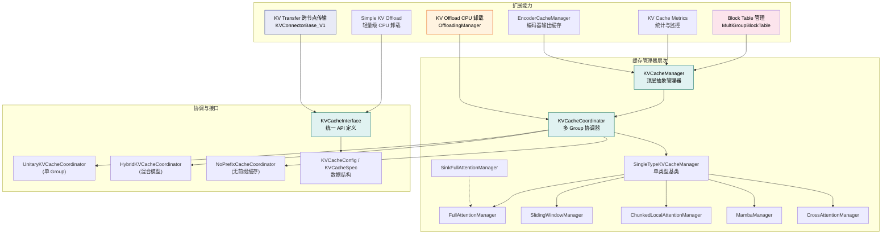
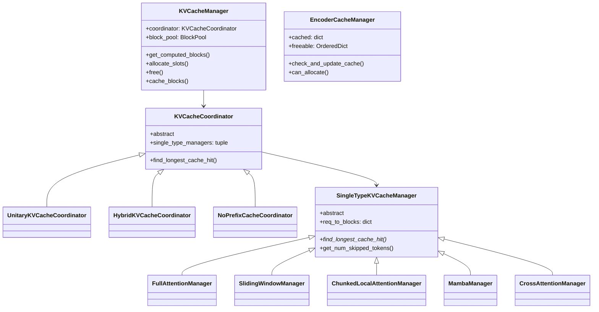
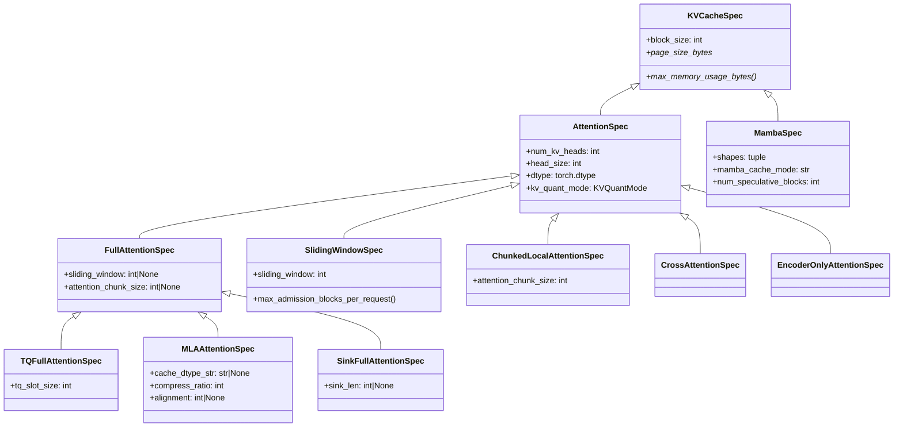
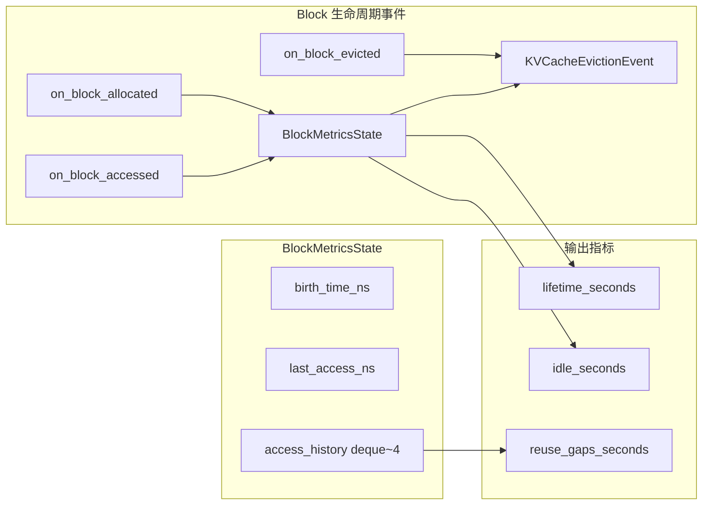
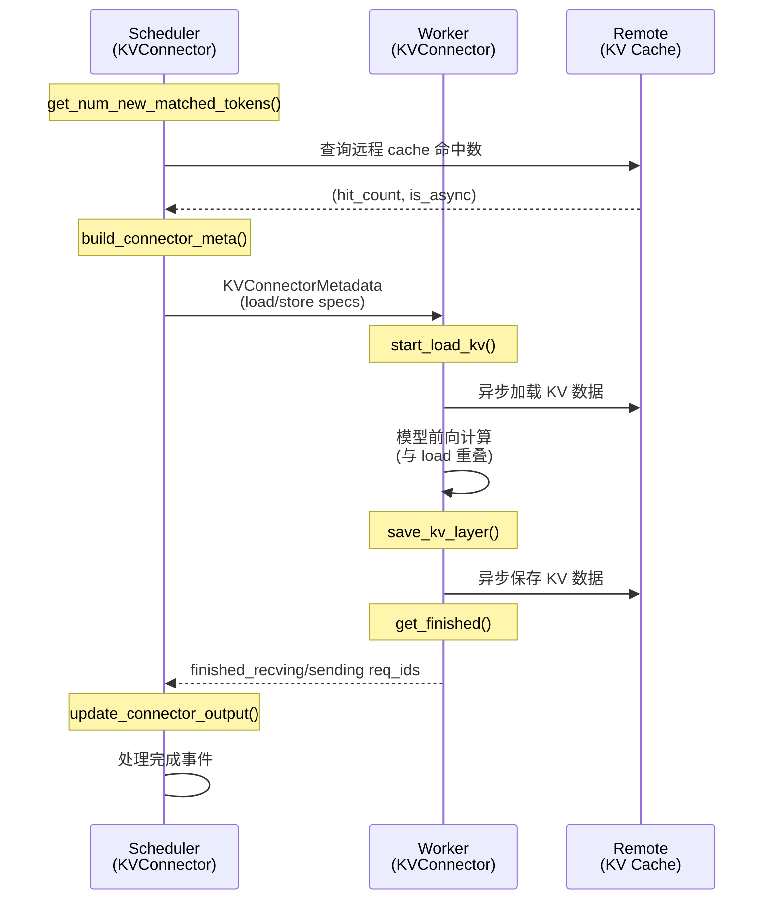
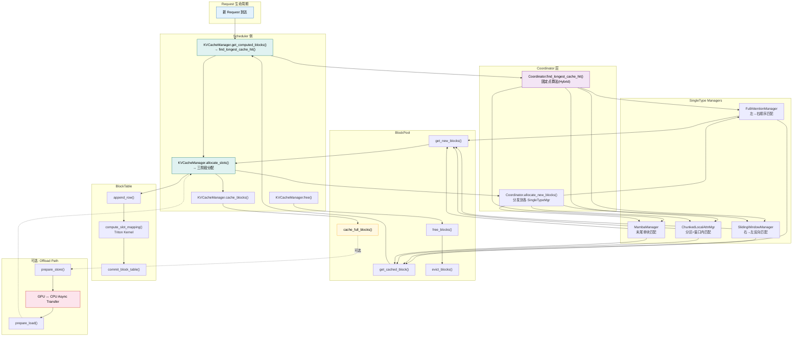

# vLLM KV Cache 系统完整分析

> **定位**：本文档系统性地分析 vLLM V1 架构下的 KV Cache 全栈实现，涵盖缓存管理层次、多 GPU 协调、接口定义、CPU 卸载、跨节点传输、Block Table 管理及前缀缓存机制。



---

## 目录

- [一、KV Cache Manager 层次](#一kv-cache-manager-层次)
  - [1.1 KVCacheManager — 顶层抽象](#11-kvcachemanager--顶层抽象)
  - [1.2 SingleTypeKVCacheManager — 单类型基类](#12-singletypekvcachemanager--单类型基类)
  - [1.3 具体管理器子类](#13-具体管理器子类)
  - [1.4 EncoderCacheManager — 编码器缓存](#14-encodercachemanager--编码器缓存)
  - [1.5 层次关系总览](#15-层次关系总览)
- [二、KV Cache Coordinator 多 GPU 缓存协调](#二kv-cache-coordinator-多-gpu-缓存协调)
- [三、KV Cache 接口定义](#三kv-cache-接口定义)
- [四、KV Cache Metrics 缓存使用统计](#四kv-cache-metrics-缓存使用统计)
- [五、KV Offload CPU 卸载](#五kv-offload-cpu-卸载)
- [六、Simple KV Offload](#六simple-kv-offload)
- [七、KV Transfer 跨节点传输](#七kv-transfer-跨节点传输)
- [八、Block Table 管理](#八block-table-管理)
- [九、前缀缓存 Prefix Caching](#九前缀缓存-prefix-caching)
- [十、数据流全景图](#十数据流全景图)

---

## 一、KV Cache Manager 层次

### 1.1 KVCacheManager — 顶层抽象

[KVCacheManager](file:///workspace/vllm/v1/core/kv_cache_manager.py#L106-L541) 是调度器 (Scheduler) 与底层缓存系统的唯一交互入口。它隐藏了内部数据结构细节，通过 `KVCacheBlocks` 数据类与 Scheduler 通信。

**核心职责：**

| 方法 | 功能 | 关键逻辑 |
|------|------|----------|
| `get_computed_blocks()` | 查询前缀缓存命中块 | 委托给 `coordinator.find_longest_cache_hit()` |
| `allocate_slots()` | 为请求分配新 slot | 三阶段：释放跳过块 → 分配已计算块 → 分配新块 |
| `free()` | 释放请求的所有块 | 反序释放，尾部优先 |
| `cache_blocks()` | 将计算完成的块标记为可复用 | 仅缓存 `num_tokens` 以内的"最终确定"token |

**`allocate_slots()` 的 Blocks 布局（源码注释原文）：**

```
----------------------------------------------------------------------
| < comp > | < new_comp > | < ext_comp >  | < new >  | < lookahead > |
----------------------------------------------------------------------
                                                  |   < to be computed >     |
----------------------------------------------------------------------
                                  |            < to be allocated >           |
----------------------------------------------------------------------
                                  | < to be cached (roughly, |
                                  | details below)>          |
----------------------------------------------------------------------
```

**初始化流程** ([kv_cache_manager.py:107-160](file:///workspace/vllm/v1/core/kv_cache_manager.py#L107-L160))：

```python
class KVCacheManager:
    def __init__(self, kv_cache_config, max_model_len, hash_block_size, ...):
        self.coordinator = get_kv_cache_coordinator(
            kv_cache_config=kv_cache_config,
            max_model_len=self.max_model_len,
            ...
        )
        self.block_pool = self.coordinator.block_pool
        self.num_kv_cache_groups = len(kv_cache_config.kv_cache_groups)
        # 预构建空 KVCacheBlocks，避免 GC 开销
        self.empty_kv_cache_blocks = KVCacheBlocks(
            tuple(() for _ in range(self.num_kv_cache_groups))
        )
```

**`KVCacheBlocks` 数据结构** ([kv_cache_manager.py:22-103](file:///workspace/vllm/v1/core/kv_cache_manager.py#L22-L103))：

```python
@dataclass
class KVCacheBlocks:
    """分配结果，作为 Scheduler 和 KVCacheManager 的接口。"""
    blocks: tuple[Sequence[KVCacheBlock], ...]
    # blocks[i][j] 表示第 i 个 kv_cache_group 的第 j 个 block

    def get_block_ids(self, allow_none=False):
        """转换为 block_id 列表"""
```

### 1.2 SingleTypeKVCacheManager — 单类型基类

[SingleTypeKVCacheManager](file:///workspace/vllm/v1/core/single_type_kv_cache_manager.py#L30-L443) 是一个抽象基类，处理**单一注意力类型**的 KV cache 管理逻辑。

**核心状态：**

```python
class SingleTypeKVCacheManager(ABC):
    def __init__(self, kv_cache_spec, block_pool, enable_caching, ...):
        self.block_size = kv_cache_spec.block_size
        self.kv_cache_spec = kv_cache_spec
        self.block_pool = block_pool
        # request_id -> 已分配的 blocks 列表
        self.req_to_blocks: defaultdict[str, list[KVCacheBlock]] = defaultdict(list)
        # request_id -> 已缓存的 block 数量
        self.num_cached_block: dict[str, int] = {}
```

**关键方法签名：**

| 方法 | 说明 |
|------|------|
| `get_num_blocks_to_allocate()` | 计算需要分配的 block 数量（考虑 admission cap） |
| `allocate_new_computed_blocks()` | 将前缀缓存命中的块追加到请求 |
| `allocate_new_blocks()` | 为待计算 token 分配新 block |
| `cache_blocks()` | 将满 block 标记为可复用 |
| `free()` | 释放请求的 blocks（反序） |
| `find_longest_cache_hit()` *(抽象)* | 查找最长公共前缀缓存命中 |
| `remove_skipped_blocks()` | 移除注意力窗口外的块 |
| `get_num_skipped_tokens()` *(虚方法)* | 计算需跳过的 token 数 |

**admission cap 机制** ([single_type_kv_cache_manager.py:88-167](file:///workspace/vllm/v1/core/single_type_kv_cache_manager.py#L88-L167))：

对于 SlidingWindow 和 ChunkedLocalAttention 这类**回收型 spec**，运行时会对每个请求的 block 预留数量施加上限 (`_max_admission_blocks_per_request`)，防止 chunked prefill 期间过度分配导致死锁：

```python
def get_num_blocks_to_allocate(self, ..., apply_admission_cap=False):
    num_required_blocks = cdiv(num_tokens, self.block_size)
    if apply_admission_cap and self._max_admission_blocks_per_request is not None:
        num_required_blocks = min(
            num_required_blocks, self._max_admission_blocks_per_request
        )
```

### 1.3 具体管理器子类

#### FullAttentionManager

[FullAttentionManager](file:///workspace/vllm/v1/core/single_type_kv_cache_manager.py#L446-L504) 用于全注意力层（含 ChunkedLocalAttention）。

**`find_longest_cache_hit` 实现** — 从左到右顺序扫描 block hash 链：

```python
@classmethod
def find_longest_cache_hit(cls, block_hashes, max_length, ...):
    computed_blocks = tuple([] for _ in range(len(kv_cache_group_ids)))
    for block_hash in itertools.islice(block_hashes, max_num_blocks):
        if cached_block := block_pool.get_cached_block(block_hash, kv_cache_group_ids):
            for computed, cached in zip(computed_blocks, cached_block):
                computed.append(cached)
        else:
            break  # hash 不匹配则终止
    if use_eagle and computed_blocks[0]:
        for computed in computed_blocks:
            computed.pop()  # EAGLE 需要丢弃最后一块以重算
```

**`get_num_common_prefix_blocks`** — 通过比较 `ref_cnt` 与请求数判断公共前缀：

```python
def get_num_common_prefix_blocks(self, running_request_id):
    blocks = self.req_to_blocks[running_request_id]
    num_common_blocks = 0
    for block in blocks:
        if block.ref_cnt == len(self.req_to_blocks):
            num_common_blocks += 1
        else:
            break
    return num_common_blocks
```

#### SlidingWindowManager

[SlidingWindowManager](file:///workspace/vllm/v1/core/single_type_kv_cache_manager.py#L507-L641) 处理滑动窗口注意力。

**核心特点 — 从右向左反向搜索**，找到满足滑动窗口连续性要求的最大匹配：

```python
@classmethod
def find_longest_cache_hit(cls, block_hashes, max_length, ...):
    sliding_window_contiguous_blocks = cdiv(kv_cache_spec.sliding_window - 1, ...)
    # 从右向左搜索，找到连续匹配后提前退出
    for i in range(max_num_blocks - 1, -1, -1):
        if cached_block := block_pool.get_cached_block(block_hashes[i], ...):
            computed[i] = cached_block
            num_contiguous_blocks += 1
            if num_contiguous_blocks >= sliding_window_contiguous_blocks:
                match_found = True
                break
        else:
            num_contiguous_blocks = 0  # 重置连续计数
```

**跳过 token 计算** ([single_type_kv_cache_manager.py:606-632](file:///workspace/vllm/v1/core/single_type_kv_cache_manager.py#L606-L632))：

```
sliding_window=4, num_computed_tokens=7
Tokens: [ 0  1  2  3  4  5  6  7 ]
         | ---- computed -----|
                                ^ next token
                     |-----------| sliding window
        |--skipped---|
→ get_num_skipped_tokens(7) == 4
```

```python
def get_num_skipped_tokens(self, num_computed_tokens):
    return max(0, num_computed_tokens - self.sliding_window + 1)
```

#### ChunkedLocalAttentionManager

[ChunkedLocalAttentionManager](file:///workspace/vllm/v1/core/single_type_kv_cache_manager.py#L644-L791) 处理分块局部注意力。

**策略**：窗口外的 block 直接标记为 null（视为已计算），窗口内按前缀缓存查找：

```python
@classmethod
def find_longest_cache_hit(cls, block_hashes, max_length, ...):
    local_attention_start_idx = (
        max_length // kv_cache_spec.attention_chunk_size * kv_cache_spec.attention_chunk_size
    )
    # 窗口外标记为 null
    computed_blocks = tuple(
        [block_pool.null_block] * local_attention_start_block_idx
        for _ in range(len(kv_cache_group_ids))
    )
    # 窗口内按 hash 查找
    for i in range(local_attention_start_block_idx, max_num_blocks):
        if cached_block := block_pool.get_cached_block(block_hashes[i], ...):
            computed.append(cached_block)
        else:
            break
```

#### MambaManager

[MambaManager](file:///workspace/vllm/v1/core/single_type_kv_cache_manager.py#L794-L1066) 处理 Mamba/SSM 线性注意力层。

**特殊之处**：
- **Align 模式**下只保留最近 2 个 block 的状态（`last_state_block_idx` 追踪）
- **不支持同步骤内复用其他请求产生的 block**（`cached_blocks_this_step` 过滤）
- 投机解码时分配额外的 speculative blocks

#### CrossAttentionManager

[CrossAttentionManager](file:///workspace/vllm/v1/core/single_type_kv_cache_manager.py#L1069-L1115) 处理 encoder-decoder 模型的交叉注意力。

**不参与前缀缓存**：编码器状态是每个请求唯一的，不存在可共享的前缀。

#### SinkFullAttentionManager

[SinkFullAttentionManager](file:///workspace/vllm/v1/core/single_type_kv_cache_manager.py#L1118-L1139) 继承自 `FullAttentionManager`，额外预分配 sink token 的常驻 block。

**Spec → Manager 映射表** ([single_type_kv_cache_manager.py:1142-1152](file:///workspace/vllm/v1/core/single_type_kv_cache_manager.py#L1142-L1152))：

```python
spec_manager_map: dict[type[KVCacheSpec], type[SingleTypeKVCacheManager]] = {
    FullAttentionSpec: FullAttentionManager,
    TQFullAttentionSpec: FullAttentionManager,
    MLAAttentionSpec: FullAttentionManager,
    SlidingWindowSpec: SlidingWindowManager,
    SlidingWindowMLASpec: SlidingWindowManager,
    ChunkedLocalAttentionSpec: ChunkedLocalAttentionManager,
    MambaSpec: MambaManager,
    CrossAttentionSpec: CrossAttentionManager,
    SinkFullAttentionSpec: SinkFullAttentionManager,
}
```

### 1.4 EncoderCacheManager — 编码器缓存

[EncoderCacheManager](file:///workspace/vllm/v1/core/encoder_cache_manager.py#L17-L266) 管理多模态模型中编码器输出的缓存。

**设计目标**：避免对相同的多模态输入（如图像）重复执行昂贵的编码器计算。

**核心数据结构：**

| 字段 | 类型 | 用途 |
|------|------|------|
| `cached` | `dict[str, set[str]]` | mm_hash → 引用该 entry 的 request ID 集合 |
| `freeable` | `OrderedDict[str, int]` | 无引用的 mm_hash → 编码器 embedding 数量 |
| `freed` | `list[str]` | 自上次调用后被实际驱逐的 mm_hash 列表 |
| `num_free_slots` | `int` | 当前可用容量 |
| `num_freeable_slots` | `int` | 可回收容量（含无引用条目） |

**关键操作流程：**

1. **`check_and_update_cache()`** — 检查是否已缓存，更新引用计数
2. **`can_allocate()`** — 容量检查，不足时从 `freeable` 中 LRU 驱逐
3. **`allocate()`** — 预留空间，更新 bookkeeping
4. **`free_encoder_input()`** — 释放引用，无引用时移入 `freeable`

**还有 EncoderDecoderCacheManager** ([encoder_cache_manager.py:323-381](file:///workspace/vllm/v1/core/encoder_cache_manager.py#L323-L381)) — encoder-decoder 模型的临时简化版本，仅用于调度目的。

### 1.5 层次关系总览



---

## 二、KV Cache Coordinator 多 GPU 缓存协调

[KVCacheCoordinator](file:///workspace/vllm/v1/core/kv_cache_coordinator.py#L28-L274) 是连接 `KVCacheManager` 与各 `SingleTypeKVCacheManager` 的中间协调层，负责在多个 KV cache group 之间统一调度。

### 2.1 三种 Coordinator 变体

| 类名 | 适用场景 | 特点 |
|------|---------|------|
| [NoPrefixCache](file:///workspace/vllm/v1/core/kv_cache_coordinator.py#L276-L321) | 前缀缓存禁用或不支持 | `find_longest_cache_hit` 始终返回空；支持任意数量 group |
| [Unitary](file:///workspace/vllm/v1/core/kv_cache_coordinator.py#L324-L389) | 单一 KV cache group | 直接委托给唯一的 manager；hash_block_size == block_size |
| [Hybrid](file:///workspace/vllm/v1/core/kv_cache_coordinator.py#L392-L591) | 多种注意力类型的混合模型 | **迭代固定点算法**协调多组 cache hit 长度 |

### 2.2 HybridKVCacheCoordinator — 固点算法

混合模型（如 Attention + Mamba、Attention + SlidingWindow）需要协调不同 attention type 对 cache hit 长度的约束。

**算法核心** ([kv_cache_coordinator.py:487-591](file:///workspace/vllm/v1/core/kv_cache_coordinator.py#L487-L591))：

```python
def find_longest_cache_hit(self, block_hashes, max_cache_hit_length):
    hit_length = max_cache_hit_length
    while True:
        curr_hit_length = hit_length
        for idx, (spec, group_ids, manager_cls) in enumerate(self.attention_groups):
            if isinstance(spec, FullAttentionSpec) and cached_blocks is not None:
                # FullAttn 是向下封闭的：只需查找一次，后续仅 trim
                curr_hit_length = curr_hit_length // spec.block_size * spec.block_size
                continue

            hit_blocks = manager_cls.find_longest_cache_hit(
                ..., max_length=_max_length, alignment_tokens=self.lcm_block_size
            )
            _new_hit_length = len(hit_blocks[0]) * spec.block_size
            curr_hit_length = _new_hit_length

        if curr_hit_length >= hit_length:
            break  # 收敛：长度不再缩减
        hit_length = curr_hit_length
        if is_simple_hybrid:
            break  # 简单混合（1 FullAttn + 1 其他）一次迭代即够
```

**关键设计决策：**

1. **Full Attention 优先**：将 `FullAttentionSpec` 组排在 `attention_groups` 首位，因其高效的左到右扫描可提供更紧的初始上界
2. **LCM 对齐**：`lcm_block_size = lcm(*all_block_sizes)` 确保 hit length 是所有 group block size 的公倍数
3. **EAGLE 处理**：每个 eagle group 最多执行一次 last-block-drop，通过 `eagle_verified` 集合去重

**Group 分组与验证** ([kv_cache_coordinator.py:436-470](file:///workspace/vllm/v1/core/kv_cache_coordinator.py#L436-L470))：

```python
def verify_and_split_kv_cache_groups(self):
    attention_groups = []
    for i, g in enumerate(self.kv_cache_config.kv_cache_groups):
        manager_cls = self.single_type_managers[i].__class__
        spec = g.kv_cache_spec
        # 按 (spec_type, manager_cls) 合并相同类型的 group
        for existing_spec, group_ids, existing_cls in attention_groups:
            if existing_spec == spec:
                group_ids.append(i)
                break
        else:
            attention_groups.append((spec, [i], manager_cls))
    # FullAttn 排第一
    self.attention_groups = sorted(attention_groups, key=lambda x: not isinstance(x[0], FullAttentionSpec))
```

### 2.3 Coordinator 工厂函数

[get_kv_cache_coordinator()](file:///workspace/vllm/v1/core/kv_cache_coordinator.py#L594-L642) 根据配置自动选择 Coordinator 类型：

```python
def get_kv_cache_coordinator(...):
    if not enable_caching:
        return KVCacheCoordinatorNoPrefixCache(...)
    if len(kv_cache_config.kv_cache_groups) == 1:
        return UnitaryKVCacheCoordinator(...)
    return HybridKVCacheCoordinator(...)
```

---

## 三、KV Cache 接口定义

### 3.1 KVCacheConfig — 全局配置

[KVCacheConfig](file:///workspace/vllm/v1/kv_cache_interface.py#L759-L783) 描述模型的整体 KV cache 配置：

```python
@dataclass
class KVCacheConfig:
    num_blocks: int                    # KV cache block 总数
    kv_cache_tensors: list[KVCacheTensor]  # 每个 tensor 的初始化信息
    kv_cache_groups: list[KVCacheGroupSpec]  # KV cache 分组

    @property
    def has_mamba_layers(self) -> bool: ...
    @property
    def needs_kv_cache_zeroing(self) -> bool: ...
```

### 3.2 KVCacheSpec 层次体系

[KVCacheSpec](file:///workspace/vllm/v1/kv_cache_interface.py#L81-L127) 是所有 cache spec 的基类：



**量化模式** ([kv_cache_interface.py:31-72](file:///workspace/vllm/v1/kv_cache_interface.py#L31-L72))：

```python
class KVQuantMode(IntEnum):
    NONE = 0                          # 无量化
    FP8_PER_TENSOR = 1               # per-tensor FP8
    INT8_PER_TOKEN_HEAD = 2          # per-token-head INT8
    FP8_PER_TOKEN_HEAD = 3           # per-token-head FP8
    NVFP4 = 4                         # NVFP4 打包量化
```

**KVCacheGroupSpec** ([kv_cache_interface.py#L744-756](file:///workspace/vllm/v1/kv_cache_interface.py#L744-L756))：

```python
@dataclass
class KVCacheGroupSpec:
    layer_names: list[str]      # 该组包含的层名列表
    kv_cache_spec: KVCacheSpec   # 该组的 cache spec
    is_eagle_group: bool = False # 是否包含 EAGLE/MTP 草稿层
```

### 3.3 UniformTypeKVCacheSpecs

[UniformTypeKVCacheSpecs](file:///workspace/vllm/v1/kv_cache_interface.py#L632-731) 用于处理同一类型但参数不同的多层合并（如 DeepSeekV4 的不同 head_size 层）。

---

## 四、KV Cache Metrics 缓存使用统计

[KVCacheMetricsCollector](file:///workspace/vllm/v1/core/kv_cache_metrics.py#L46-L96) 提供**采样式**的 Block 级别生命周期指标收集。

### 4.1 架构设计



### 4.2 核心实现

```python
class KVCacheMetricsCollector:
    def __init__(self, sample_rate=0.01):
        self.sample_rate = sample_rate          # 默认 1% 采样率
        self.block_metrics: dict[int, BlockMetricsState] = {}
        self._eviction_events: list[KVCacheEvictionEvent] = []

    def should_sample_block(self) -> bool:
        return random.random() < self.sample_rate

    def on_block_allocated(self, block): ...  # 记录创建时间
    def on_block_accessed(self, block): ...   # 更新访问时间和历史
    def on_block_evicted(self, block): ...    # 生成驱逐事件并移除追踪
    def drain_events(self) -> list: ...       # 取出并清空事件队列
```

**`BlockMetricsState`** ([kv_cache_metrics.py:16-43](file:///workspace/vllm/v1/core/kv_cache_metrics.py#L16-43))：

- `access_history` 使用 `deque(maxlen=4)` 有界记录，防止高频访问导致无限增长
- `get_reuse_gaps_seconds()` 返回相邻两次访问的时间间隔列表

---

## 五、KV Offload CPU 卸载

KV Offload 子系统提供将 GPU KV cache 块卸载到 CPU 内存的能力，支持可插拔的缓存策略。

### 5.1 整体架构

```mermaid
graph TB
    subgraph "Scheduler 侧"
        OS["OffloadingSpec<br/>(CPUOffloadingSpec)"]
        OM["OffloadingManager<br/>(CPUOffloadingManager)"]
        RM["FilterReusedOffloadingManager<br/>(复用频率门控装饰器)"]
    end

    subgraph "Worker 侧"
        OW["OffloadingWorker"]
        H_GPU_CPU["SingleDirectionHandler<br/>(GPU→CPU)"]
        H_CPU_GPU["SingleDirectionHandler<br/(CPU→GPU)"]
        SOR["SharedOffloadRegion<br/>(mmap 共享内存)"]
    end

    subgraph "策略层"
        POLICY["CachePolicy (ABC)"]
        LRU["LRUCachePolicy"]
        ARC["ARCCachePolicy"]
    end

    OS --> OM
    RM --> OM
    OM --> POLICY
    POLICY <|-- LRU
    POLICY <|-- ARC
    OW --> H_GPU_CPU
    OW --> H_CPU_GPU
    H_GPU_CPU --> SOR
    H_CPU_GPU --> SOR
```

### 5.2 OffloadingManager 抽象接口

[OffloadingManager](file:///workspace/vllm/v1/kv_offload/base.py#L110-L216) 定义了 Scheduler 侧的核心原语：

| 方法 | 功能 | 说明 |
|------|------|------|
| `lookup(key)` | 检查 block 是否已卸载且就绪 | 返回 True/False/None（None 表示需重试） |
| `prepare_load(keys)` | 准备读取 | 保护不被驱逐；返回 LoadStoreSpec |
| `touch(keys)` | 标记最近使用 | 更新 LRU 位置 |
| `complete_load(keys)` | 标记加载完成 | 解除保护 |
| `prepare_store(keys)` | 准备卸载写入 | 可能触发驱逐；返回 PrepareStoreOutput |
| `complete_store(keys)` | 标记存储完成 | block 变为可加载 |

**关键数据结构**：

- **`OffloadKey`** = `block_hash(字节) + group_idx(4字节大端)` — 唯一标识一个卸载块
- **`GPULoadStoreSpec`** — GPU 端 load/store 规格，含 `group_sizes` 和 `block_indices`
- **`CPULoadStoreSpec`** — CPU 端 load/store 规格

### 5.3 CPUOffloadingManager 实现

[CPUOffloadingManager](file:///workspace/vllm/v1/kv_offload/cpu/manager.py#L25-L204) 是 CPU 卸载的具体管理器。

**Block Pool 管理**：

```python
class CPUOffloadingManager(OffloadingManager):
    def __init__(self, num_blocks, cache_policy="lru"):
        self._num_blocks = num_blocks
        self._num_allocated_blocks = 0     # 已分配总数
        self._free_list: list[int] = []    # 可重用 block ID 列表
        self._policy: CachePolicy = policy_cls(cache_capacity=num_blocks)
```

**`prepare_store()` 流程** ([cpu/manager.py:119-172](file:///workspace/vllm/v1/kv_offload/cpu/manager.py#L119-L172))：

1. 过滤已存储的 blocks
2. 计算需要驱逐的数量 (`len(keys_to_store) - free_blocks`)
3. 调用 `policy.evict()` 执行驱逐（排除 protected set）
4. 从 block pool 分配新 block（优先重用 free_list）
5. 将 `(key, block)` 插入 policy

### 5.4 缓存策略

#### CachePolicy 抽象

[CachePolicy](file:///workspace/vllm/v1/kv_offload/cpu/policies/base.py#L36-76) 定义策略接口：

```python
class CachePolicy(ABC):
    @abstractmethod
    def get(self, key) -> BlockStatus | None: ...
    @abstractmethod
    def insert(self, key, block) -> None: ...
    @abstractmethod
    def remove(self, key) -> None: ...
    @abstractmethod
    def touch(self, keys) -> None: ...
    @abstractmethod
    def evict(self, n, protected) -> list | None: ...
```

**`BlockStatus`** 使用 ctypes Structure，含 `ref_cnt`（引用计数，-1 表示未就绪）和 `block_id`。

#### LRU 策略

[LRUCachePolicy](file:///workspace/vllm/v1/kv_offload/cpu/policies/lru.py#L10-46) 基于 `OrderedDict`：

- `touch()`: `move_to_end(key)` 移至末尾
- `evict()`: 从头部扫描 `ref_cnt == 0` 且非 protected 的候选者

#### ARC 策略

[ARCCachePolicy](file:///workspace/vllm/v1/kv_offload/cpu/policies/arc.py) 实现 Adaptive Replacement Cache，维护 T1（最近访问）、T2（频繁访问）和 ghost 列表。

### 5.5 FilterReusedOffloadingManager — 复用门控

[FilterReusedOffloadingManager](file:///workspace/vllm/v1/kv_offload/reuse_manager.py#L23-120) 是一个**装饰器**，包装任意 OffloadingManager，在 `prepare_store()` 前过滤低频 block。

**核心逻辑**：

```python
class FilterReusedOffloadingManager(OffloadingManager):
    def lookup(self, key, req_context):
        # 在 LRU tracker 中记录访问次数
        if key in self.counts:
            self.counts.move_to_end(key)
            self.counts[key] += 1
        else:
            self.counts[key] = 1
        return self._backing.lookup(key, req_context)

    def prepare_store(self, keys, req_context):
        # 只传递达到阈值的 keys
        eligible = [k for k in keys if self.counts.get(k, 0) >= self.store_threshold]
        return self._backing.prepare_store(eligible, req_context)
```

**参数说明**：
- `store_threshold`: 必须 ≥ 2（1 等于不过滤）
- `max_tracker_size`: LRU tracker 最大条目数（默认 64,000）

### 5.6 Worker 侧传输引擎

#### SingleDirectionOffloadingHandler

[SingleDirectionOffloadingHandler](file:///workspace/vllm/v1/kv_offload/cpu/gpu_worker.py#L111-373) 处理单向异步传输。

**核心机制**：
- 每个 transfer 使用独立 CUDA stream
- Transfer 严格按提交顺序串行执行（前一个完成后再开始下一个）
- 支持 **sub-block** 映射：当 offloaded block size > GPU block size 时自动拆分

**`compute_sub_block_ptrs()`** ([gpu_worker.py:39-86](file:///workspace/vllm/v1/kv_offload/cpu/gpu_worker.py#L39-86))：

```python
# 例: gpu_block_size=16, cpu_block_size=32 (block_size_factor=2)
# kv_manager_block_id 0 → kernel block [0, 1]
# kv_manager_block_id 1 → kernel block [2, 3]
kernel_block_ids = (
    kv_manager_block_ids.reshape(-1, 1) * blocks_per_kv_block
    + kernel_block_arange  # [0, 1, ..., factor-1]
).reshape(-1)
```

#### SharedOffloadRegion — mmap 共享内存

[SharedOffloadRegion](file:///workspace/vllm/v1/kv_offload/cpu/shared_offload_region.py#L27-192) 实现多 worker 间的共享 CPU 缓存区域。

**布局设计**：

```
文件路径: /dev/shm/vllm_offload_{instance_id}.mmap

物理布局 (interleaved):
worker0_block0 | worker1_block0 | ... | worker{M-1}_block0
worker0_block1 | worker1_block1 | ... | worker{M-1}_block1
...

row_stride = cpu_page_size * num_workers
每个 worker 通过 stride 视图访问自己的区域
```

**关键特性**：
- 第一个打开文件的 worker 成为 creator 并调用 `ftruncate`
- 其他 worker 等待文件大小达标后 `mmap`
- 使用 `MADV_POPULATE_WRITE` 预分配物理页
- 支持通过 `cudaHostRegister` 注册为 pinned memory 以加速 DMA

#### CPUOffloadingSpec — 规格工厂

[CPUOffloadingSpec](file:///workspace/vllm/v1/kv_offload/cpu/spec.py#L22-102) 将所有组件组装在一起：

```python
class CPUOffloadingSpec(OffloadingSpec):
    def get_manager(self) -> OffloadingManager:
        # 创建 CPUOffloadingManager (+ 可选 FilterReused 包装)
        ...

    def get_handlers(self, kv_caches):
        # 创建 CpuGpuOffloadingHandlers (GPU↔CPU 双向)
        yield GPULoadStoreSpec, CPULoadStoreSpec, handlers.gpu_to_cpu_handler
        yield CPULoadStoreSpec, GPULoadStoreSpec, handlers.cpu_to_gpu_handler
```

---

## 六、Simple KV Offload

[Simple KV Offload](file:///workspace/vllm/v1/simple_kv_offload/) 是一个**轻量级**的 CPU 卸载方案，不依赖完整的 OffloadingManager 抽象框架，直接基于 KVCacheCoordinator 的 CPU 副本工作。

### 6.1 架构对比

| 特性 | KV Offload (完整版) | Simple KV Offload |
|------|---------------------|-------------------|
| 复杂度 | 高（多抽象层） | 低（直接操作 BlockPool） |
| 缓存策略 | LRU / ARC | 继承 GPU prefix cache 行为 |
| Store 模式 | eager / lazy | eager + lazy 双模式 |
| 多节点支持 | ✅ (via connector) | ❌ 单机 |
| 适用场景 | 生产级部署 | 快速验证、原型 |

### 6.2 SimpleCPUOffloadScheduler

[SimpleCPUOffloadScheduler](file:///workspace/vllm/v1/simple_kv_offload/manager.py#L67-L741) 是调度器侧的管理器。

**初始化** — 从 GPU 配置派生 CPU 配置 ([simple_kv_offload/manager.py:160-187](file:///workspace/vllm/v1/simple_kv_offload/manager.py#L160-187))：

```python
@staticmethod
def _derive_cpu_config(gpu_config, cpu_capacity_bytes):
    gpu_total_bytes = sum(t.size for t in gpu_config.kv_cache_tensors)
    num_gpu_blocks = gpu_config.num_blocks
    num_cpu_blocks = max(1, num_gpu_blocks * cpu_capacity_bytes // gpu_total_bytes)
    # 保持相同的 kv_cache_groups，仅缩放 num_blocks
    return KVCacheConfig(num_blocks=num_cpu_blocks, ...)
```

**两种 Store 模式**：

#### Lazy Mode — 游标扫描

[_prepare_lazy_store_specs()](file:///workspace/vllm/v1/simple_kv_offload/manager.py#L378-444)：使用单遍游标扫描 GPU free queue，选择接近 eviction 边缘的 cached block 进行卸载。

```python
# 游标沿 free_queue 前进，覆盖 target_free 个位置
while covered < self._target_free and len(gpu_ids) < num_cpu_free:
    bhash = node.block_hash
    if bhash is not None and not node.is_null and cpu_pool 未缓存该 hash:
        gpu_ids.append(node.block_id)
        block_hashes.append(bhash)
    covered += 1
    node = node.next_free_block
```

#### Eager Mode — 请求驱动

[_prepare_eager_store_specs()](file:///workspace/vllm/v1/simple_kv_offload/manager.py#L446-582)：跟踪每个请求的新计算 block，确认 KV 数据已写回后批量卸载。

两阶段扫描：
1. **Phase 1**: 分类 block 为 cached vs to-store（跳过 null 和已缓存的）
2. **Phase 2**: 批量分配 CPU block 并 stamp hash

### 6.3 SimpleCPUOffloadWorker

[SimpleCPUOffloadWorker](file:///workspace/vllm/v1/simple_kv_offload/worker.py#L25-305) 是 Worker 侧处理器。

**KV Cache 注册** ([worker.py:66-182](file:///workspace/vllm/v1/simple_kv_offload/worker.py#L66-182))：
- 自动去重共享同一底层 storage 的多个层
- 推导物理 layout（FlashAttn 的 `(2, num_blocks, ...)` vs FlashInfer 的 `(num_blocks, ...)`）
- 分配 pinned CPU tensor（使用 `cudaHostRegister` 避免 PyTorch 的 2 幂向上取整）

**DmaCopyBackend** ([copy_backend.py](file:///workspace/vllm/v1/simple_kv_offload/copy_backend.py#L23-97))：
- 后台线程执行 `cuMemcpyBatchAsync`
- 低优先级 CUDA stream（不干扰模型计算）
- Event 驱动的完成通知

### 6.4 Metadata 定义

[SimpleCPUOffloadMetadata](file:///workspace/vllm/v1/simple_kv_offload/metadata.py#L16-38) (Scheduler → Worker):

```python
@dataclass
class SimpleCPUOffloadMetadata(KVConnectorMetadata):
    load_event: int              # 加载任务 ID (-1 = 无)
    load_gpu_blocks: list[int]
    load_cpu_blocks: list[int]
    store_event: int             # 存储任务 ID
    store_gpu_blocks: list[int]
    store_cpu_blocks: list[int]
    need_flush: bool             # 是否有请求被抢占
```

[SimpleCPUOffloadWorkerMetadata](file:///workspace/vllm/v1/simple_kv_offload/metadata.py#L41-60) (Worker → Scheduler)：

```python
@dataclass
class SimpleCPUOffloadWorkerMetadata(KVConnectorWorkerMetadata):
    completed_store_events: dict[int, int]  # event_idx → 完成计数
    # aggregate() 跨 worker 汇总
```

---

## 七、KV Transfer 跨节点传输

KV Transfer 子系统支持在** disaggregated 架构**中跨节点传输 KV cache 数据（如 Prefill 节点 → Decode 节点）。

### 7.1 KVConnectorBase_V1 核心接口

[KVConnectorBase_V1](file:///workspace/vllm/distributed/kv_transfer/kv_connector/v1/base.py#L170-654) 定义了双向通信协议：



**Scheduler 侧方法：**

| 方法 | 说明 |
|------|------|
| `get_num_new_matched_tokens()` | 查询远程 cache 可匹配的新 token 数 |
| `update_state_after_alloc()` | 分配后更新状态 |
| `build_connector_meta()` | 构建 metadata 发送给 worker |
| `update_connector_output()` | 处理 worker 回传的完成事件 |
| `request_finished()` | 请求结束时的清理，返回是否延迟释放 |
| `take_events()` | 收集 KV cache 事件 |

**Worker 侧方法：**

| 方法 | 说明 |
|------|------|
| `register_kv_caches()` | 注册本地 KV cache tensors |
| `bind_connector_metadata()` | 接收 scheduler 的 metadata |
| `start_load_kv()` | 启动异步加载 |
| `wait_for_layer_load()` | 等待指定层加载完成 |
| `save_kv_layer()` | 启动异步保存某层 |
| `wait_for_save()` | 等待所有保存完成 |
| `get_finished()` | 上报完成的异步传输 |
| `handle_preemptions()` | 抢占前的同步处理 |

### 7.2 连接器注册与发现

[KVConnectorFactory](file:///workspace/vllm/distributed/kv_transfer/kv_connector/factory.py) 通过名称注册制管理连接器类型：

```python
# 内置注册
OffloadingSpecFactory.register_spec(
    "CPUOffloadingSpec",
    "vllm.v1.kv_offload.cpu.spec",
    "CPUOffloadingSpec"
)
```

[kv_transfer_state.py](file:///workspace/vllm/distributed/kv_transfer/kv_transfer_state.py#L19-78) 管理全局连接器实例：

```python
_KV_CONNECTOR_AGENT: KVConnectorBaseType | None = None

def ensure_kv_transfer_initialized(vllm_config, kv_cache_config):
    global _KV_CONNECTOR_AGENT
    _KV_CONNECTOR_AGENT = KVConnectorFactory.create_connector(
        config=vllm_config, role=KVConnectorRole.WORKER, ...
    )
```

### 7.3 支持的连接器类型

`kv_connector/v1/` 目录下实现了多种连接器后端：

| 连接器 | 文件 | 用途 |
|--------|------|------|
| LMCache | [lmcache_connector.py](file:///workspace/vllm/distributed/kv_transfer/kv_connector/v1/lmcache_connector.py) | LMCache 集成 |
| NIXL | [nixl/connector.py](file:///workspace/vllm/distributed/kv_transfer/kv_connector/v1/nixl/connector.py) | NVIDIA NIXL 传输 |
| P2P NCCL | [p2p/p2p_nccl_connector.py](file:///workspace/vllm/distributed/kv_transfer/kv_connector/v1/p2p/p2p_nccl_connector.py) | 点对点 NCCL 传输 |
| Mooncake | [mooncake/mooncake_connector.py](file:///workspace/vllm/distributed/kv_transfer/kv_connector/v1/mooncake/mooncake_connector.py) | Mooncake 分离架构 |
| HF3FS | [hf3fs/hf3fs_connector.py](file:///workspace/vllm/distributed/kv_transfer/kv_connector/v1/hffs/hf3fs_connector.py) | HDFS/Federated FS |
| Moriio | [moriio/moriio_connector.py](file:///workspace/vllm/distributed/kv_transfer/kv_connector/v1/moriio/moriio_connector.py) | Moriio 分布式缓存 |
| Offloading | [offloading_connector.py](file:///workspace/vllm/distributed/kv_transfer/kv_connector/v1/offloading_connector.py) | 通用卸载连接器 |
| Simple CPU | [simple_cpu_offload_connector.py](file:///workspace/vllm/distributed/kv_transfer/kv_connector/v1/simple_cpu_offload_connector.py) | 简单 CPU 卸载 |

### 7.4 Disaggregated Prefill 工作流

在分离式架构中，Prefill 节点和 Decode 节点分别运行，KV cache 通过 Connector 传输：

```
┌──────────────┐     KV Transfer      ┌──────────────┐
│  Prefill 节点 │◄──────────────────►│  Decode 节点  │
│              │                     │              │
│ • Prefill    │  ──store─────►     │ • Load       │
│ • Cache Hit  │  ◄──load──────     │ • Decode     │
│ • Save KV    │                     │ • Evict      │
└──────────────┘                     └──────────────┘
```

**HMA (Hybrid Memory Allocator) 支持**：通过 `SupportsHMA` 接口标记支持混合内存分配的连接器，额外实现 `request_finished_all_groups()` 方法处理跨 group 的异步释放。

---

## 八、Block Table 管理

### 8.1 BlockTable

[BlockTable](file:///workspace/vllm/v1/worker/block_table.py#L18-220) 管理单个 KV cache group 的 block table，是 attention kernel 直接消费的数据结构。

**核心字段：**

```python
class BlockTable:
    def __init__(self, block_size, max_num_reqs, max_num_blocks_per_req,
                 max_num_batched_tokens, pin_memory, device,
                 kernel_block_size, cp_kv_cache_interleave_size):
        # hybrid block 支持：allocation block_size ≠ kernel block_size
        if kernel_block_size == block_size:
            self.blocks_per_kv_block = 1
            self.use_hybrid_blocks = False
        else:
            self.blocks_per_kv_block = block_size // kernel_block_size
            self.use_hybrid_blocks = True

        self.block_table = self._make_buffer(max_num_reqs, max_num_blocks_per_req, int32)
        self.slot_mapping = self._make_buffer(max_num_batched_tokens, int64)
        self.num_blocks_per_row = np.zeros(max_num_reqs, dtype=np.int32)
```

**Hybrid Block 映射** ([block_table.py:173-201](file:///workspace/vllm/v1/worker/block_table.py#L173-201))：

当 allocation block size 与 kernel block size 不同时（如混合模型），需要映射：

```python
@staticmethod
def map_to_kernel_blocks(kv_manager_block_ids, blocks_per_kv_block, kernel_block_arange):
    """
    例: kv_manager block size=32, kernel block size=16
    input:  [0, 1, 2]
    output: [0, 1, 2, 3, 4, 5]
    # 每个 manager block → blocks_per_kv_block 个 kernel blocks
    """
    kernel_block_ids = (
        kv_manager_block_ids.reshape(-1, 1) * blocks_per_kv_block
        + kernel_block_arange
    ).reshape(-1)
```

**主要操作：**

| 方法 | 功能 |
|------|------|
| `append_row(block_ids, row_idx)` | 向请求行追加 block IDs |
| `add_row(block_ids, row_idx)` | 设置请求行的 block IDs |
| `clear_row(row_idx)` | 清空请求行 |
| `move_row(src, tgt)` | 移动行（用于 swap） |
| `swap_row(src, tgt)` | 交换两行 |
| `compute_slot_mapping()` | Triton kernel 计算 slot mapping |
| `commit_block_table(num_reqs)` | 将 CPU 数据复制到 GPU |

### 8.2 MultiGroupBlockTable

[MultiGroupBlockTable](file:///workspace/vllm/v1/worker/block_table.py#L223-322) 为每个 KV cache group 维护一个独立的 `BlockTable`：

```python
class MultiGroupBlockTable:
    def __init__(self, max_num_reqs, max_model_len, max_num_batched_tokens,
                 pin_memory, device, block_sizes, kernel_block_sizes, ...):
        self.block_tables = [
            BlockTable(block_size, ..., kernel_block_size, ...)
            for block_size, kernel_block_size in zip(block_sizes, kernel_block_sizes)
        ]

    def append_row(self, block_ids, row_idx):
        for i, block_table in enumerate(self.block_tables):
            block_table.append_row(block_ids[i], row_idx)
```

**TRTLLM 对齐**：`max_num_blocks` 会向上对齐到 `128 / block_size` 的倍数以满足某些 attention 后端的要求。

### 8.3 Slot Mapping Kernel

[_compute_slot_mapping_kernel](file:///workspace/vllm/v1/worker/block_table.py#L325-380) 是一个 Triton kernel，将 token position 映射到物理 slot ID：

```python
@triton.jit
def _compute_slot_mapping_kernel(
    num_tokens, query_start_loc_ptr, positions_ptr,
    block_table_ptr, block_table_stride, block_size,
    slot_mapping_ptr,
    TOTAL_CP_WORLD_SIZE, TOTAL_CP_RANK,
    CP_KV_CACHE_INTERLEAVE_SIZE, PAD_ID, BLOCK_SIZE):
    # 对每个 request:
    #   virtual_block_size = block_size * TOTAL_CP_WORLD_SIZE
    #   block_index = pos // virtual_block_size
    #   判断是否属于当前 rank 的 local slot
    #   local_slot = block_number * block_size + local_offset
    #   不属于当前 rank 则填 PAD_SLOT_ID
```

**Context Parallel 支持**：通过 `TOTAL_CP_WORLD_SIZE` 和 `TOTAL_CP_RANK` 参数支持 Decode Context Parallel 和 Prefill Context Parallel。`CP_KV_CACHE_INTERLEAVE_SIZE` 控制 KV cache 在 rank 间的交错粒度。

---

## 九、前缀缓存 Prefix Caching

Prefix Caching 是 vLLM 的核心性能优化特性，通过检测并复用公共 prompt 前缀来避免重复计算。

### 9.1 查找最长缓存命中

**入口**：[KVCacheManager.get_computed_blocks()](file:///workspace/vllm/v1/core/kv_cache_manager.py#183-L223)

```python
def get_computed_blocks(self, request: Request) -> tuple[KVCacheBlocks, int]:
    if not self.enable_caching or request.skip_reading_prefix_cache:
        return self.empty_kv_cache_blocks, 0

    # 必须至少重算最后一个 token 以获取 logits
    max_cache_hit_length = request.num_tokens - 1
    computed_blocks, num_new_computed_tokens = (
        self.coordinator.find_longest_cache_hit(
            request.block_hashes, max_cache_hit_length
        )
    )

    if self.log_stats:
        self.prefix_cache_stats.record(
            num_tokens=request.num_tokens,
            num_hits=num_new_computed_tokens,
            preempted=request.num_preemptions > 0,
        )

    return self.create_kv_cache_blocks(computed_blocks), num_new_computed_tokens
```

### 9.2 各 Manager 的查找策略对比

| Manager | 搜索方向 | 匹配策略 | 特殊处理 |
|---------|---------|----------|----------|
| FullAttention | 左→右 | 顺序匹配直到 miss | EAGLE pop 最后一块 |
| SlidingWindow | 右→左 | 反向找连续 window 内匹配 | null padding; EAGLE |
| ChunkedLocal | 分区+顺序 | 窗口外=null, 窗口内=hash 查找 | 不支持 EAGLE |
| Mamba | 右→左 | 只取最后一个匹配块 | align mode 特殊处理 |

### 9.3 FullAttentionManager 详细流程

[find_longest_cache_hit](file:///workspace/vllm/v1/core/single_type_kv_cache_manager.py#L448-L494)：

```
输入: block_hashes=[H0, H1, H2, H3, H4, ...], max_length=20, block_size=16

Step 1: 检查 H0 → cache hit? → 是 → computed=[B0]
Step 2: 检查 H1 → cache hit? → 是 → computed=[B0, B1]
Step 3: 检查 H2 → cache miss! → break

返回: ([B0, B1], 32)  # 2 blocks × 16 tokens = 32 tokens
```

### 9.4 SlidingWindowManager 详细流程

[find_longest_cache_hit](file:///workspace/vllm/v1/core/single_type_kv_cache_manager.py#L512-L604)：

```
输入: sliding_window=8, block_size=4, max_length=20

需要连续匹配: ceil((8-1)/4) = 1 个 block (实际上需要更多以覆盖窗口)

从右向左搜索:
  i=4: H4 → hit? → [_, _, _, _, B4], contiguous=1
  i=3: H3 → hit? → [_, _, _, B3, B4], contiguous=2 ✓ 达标!
  → trim trailing → [_, _, _, B3, B4]

返回: ([NULL, NULL, NULL, B3, B4], 16)  # 4 blocks, 但前3个是null
```

### 9.5 缓存命中后的处理路径

**`allocate_slots()` 中的三阶段分配** ([kv_cache_manager.py:225-416](file:///workspace/vllm/v1/core/kv_cache_manager.py#L225-L416))：

```
阶段 1: remove_skipped_blocks()
  → 释放滑动窗口外的旧 block（替换为 null_block）

阶段 2: allocate_new_computed_blocks()
  → touch 前缀缓存命中的 block（防止被驱逐）
  → 追加到请求的 block 列表
  → 为 external computed token 分配新 block

阶段 3: allocate_new_blocks()
  → 为待计算的新 token 分配 block
  → 返回新分配的 block 列表

最后: cache_blocks()
  → 将满 block 标记为可复用（写入 block_hash → block 映射）
```

### 9.6 BlockPool 中的缓存数据结构

[BlockHashToBlockMap](file:///workspace/vllm/v1/core/block_pool.py#L34-) 维护 hash→block 的映射：

```python
class BlockHashToBlockMap:
    """block_hash → KVCacheBlock | dict[int, KVCacheBlock]"""
    def get_one_block(self, key) -> KVCacheBlock | None: ...
    def insert(self, key, block) -> None: ...
```

配合 `FreeKVCacheBlockQueue`（free list）实现：
- 新分配的 block 来自 free list
- 被 cache 的 block 进入 `cached_block_hash_to_block` 映射
- 当 ref_cnt 降为 0 时，cached block 可被重新利用或驱逐

### 9.7 与调度器的集成

Prefix Cache 与调度器的交互点：

1. **调度前查询**：`get_computed_blocks()` 告知调度器有多少 token 可以跳过
2. **全序列准入检查**：`full_sequence_must_fit=True` 时确保整个序列能放入
3. **Cascade Attention 优化**：`get_num_common_prefix_blocks()` 让调度器知道公共前缀长度，用于 cascade attention 的 KV fuse 优化
4. **统计报告**：`make_prefix_cache_stats()` 每 interval 辞出命中率等指标

---

## 十、数据流全景图



---

## 附录：关键文件索引

| 文件路径 | 核心内容 |
|---------|---------|
| [kv_cache_manager.py](file:///workspace/vllm/v1/core/kv_cache_manager.py) | KVCacheManager 顶层抽象、KVCacheBlocks 数据类 |
| [single_type_kv_cache_manager.py](file:///workspace/vllm/v1/core/single_type_kv_cache_manager.py) | 单类型基类及 6 种具体 Manager 实现 |
| [encoder_cache_manager.py](file:///workspace/vllm/v1/core/encoder_cache_manager.py) | 编码器输出缓存管理 |
| [kv_cache_coordinator.py](file:///workspace/vllm/v1/core/kv_cache_coordinator.py) | 三种 Coordinator (NoPrefix/Unitary/Hybrid) |
| [kv_cache_interface.py](file:///workspace/vllm/v1/kv_cache_interface.py) | KVCacheSpec 层次体系、KVCacheConfig、量化模式 |
| [kv_cache_metrics.py](file:///workspace/vllm/v1/core/kv_cache_metrics.py) | 采样式 Block 生命周期指标收集 |
| [kv_offload/base.py](file:///workspace/vllm/v1/kv_offload/base.py) | OffloadingManager 抽象接口、LoadStoreSpec |
| [kv_offload/reuse_manager.py](file:///workspace/vllm/v1/kv_offload/reuse_manager.py) | FilterReusedOffloadingManager 复用门控 |
| [kv_offload/cpu/manager.py](file:///workspace/vllm/v1/kv_offload/cpu/manager.py) | CPUOffloadingManager 具体实现 |
| [kv_offload/cpu/policies/](file:///workspace/vllm/v1/kv_offload/cpu/policies/) | LRU / ARC 缓存替换策略 |
| [kv_offload/cpu/gpu_worker.py](file:///workspace/vllm/v1/kv_offload/cpu/gpu_worker.py) | GPU↔CPU 异步传输 Handler |
| [kv_offload/cpu/shared_offload_region.py](file:///workspace/vllm/v1/kv_offload/cpu/shared_offload_region.py) | mmap 共享内存区域 |
| [kv_offload/cpu/spec.py](file:///workspace/vllm/v1/kv_offload/cpu/spec.py) | CPUOffloadingSpec 规格工厂 |
| [simple_kv_offload/manager.py](file:///workspace/vllm/v1/simple_kv_offload/manager.py) | SimpleCPUOffloadScheduler (lazy/eager) |
| [simple_kv_offload/worker.py](file:///workspace/vllm/v1/simple_kv_offload/worker.py) | SimpleCPUOffloadWorker |
| [simple_kv_offload/copy_backend.py](file:///workspace/vllm/v1/simple_kv_offload/copy_backend.py) | DMA Copy 后台线程 |
| [kv_connector/v1/base.py](file:///workspace/vllm/distributed/kv_transfer/kv_connector/v1/base.py) | KVConnectorBase_V1 完整接口定义 |
| [kv_transfer_state.py](file:///workspace/vllm/distributed/kv_transfer/kv_transfer_state.py) | 全局连接器实例管理 |
| [block_table.py](file:///workspace/vllm/v1/worker/block_table.py) | BlockTable / MultiGroupBlockTable + Triton slot mapping |
| [block_pool.py](file:///workspace/vllm/v1/core/block_pool.py) | BlockPool、BlockHashToBlockMap、FreeKVCacheBlockQueue |
