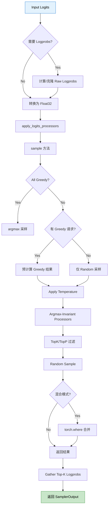
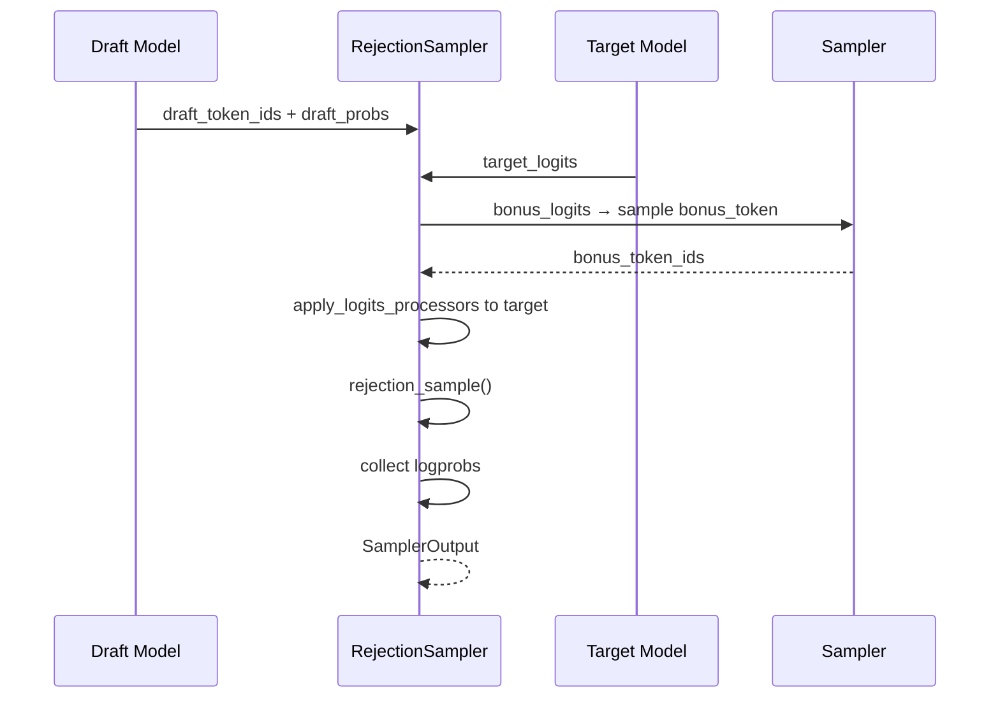
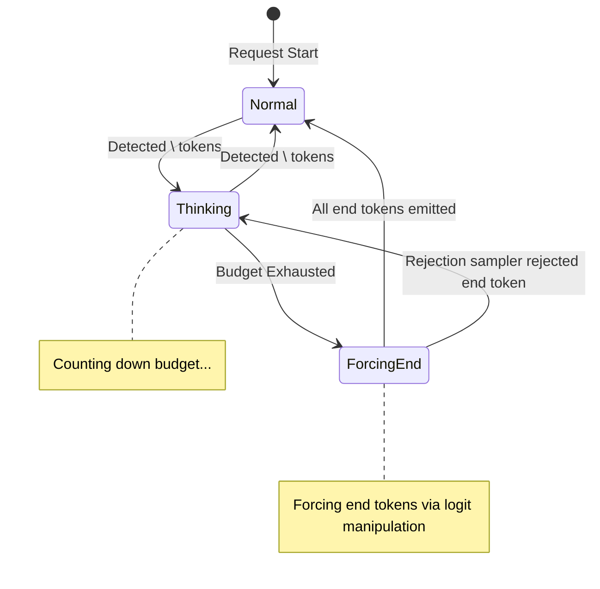
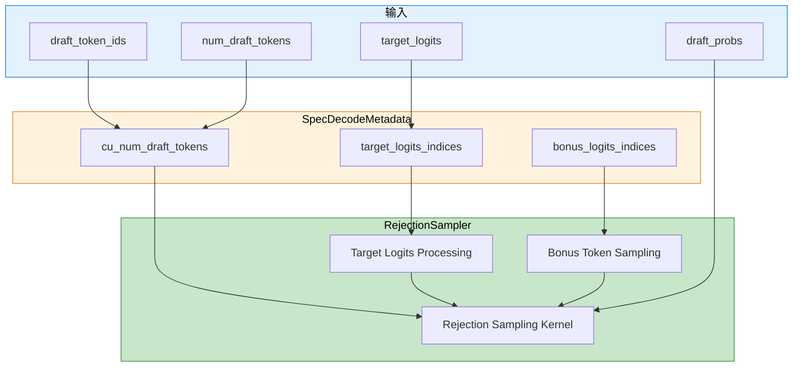
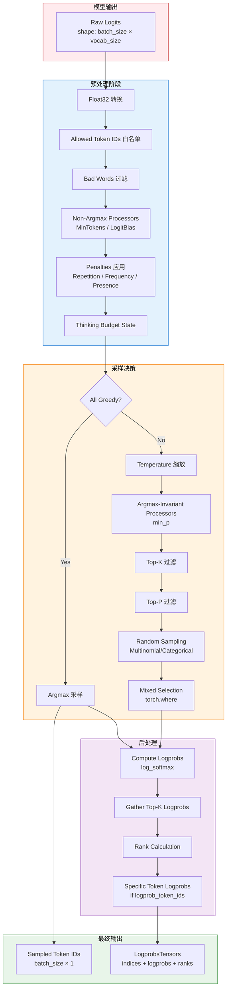
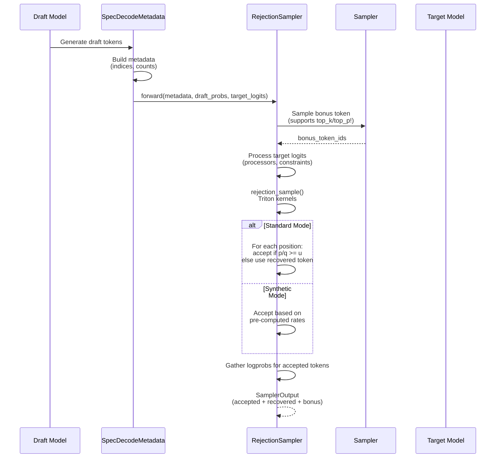

# 10. 采样与生成策略分析

> **定位**：本文档深入分析 vLLM 的采样（Sampling）与生成策略核心机制，涵盖从用户配置参数到最终 token 生成的完整数据流。

## 📌 总体架构概览

```mermaid
graph LR
    subgraph SamplingParams["SamplingParams<br/>采样参数"]
        A1[temperature]
        A2[top_p / top_k]
        A3[penalties]
        A4[stop sequences]
        A5[max_tokens]
    end

    subgraph Core["Sampler 采样核心"]
        B1[Logits Processors]
        B2[Temperature Scaling]
        B3[TopK/TopP Filtering]
        B4[Token Sampling]
    end

    subgraph Advanced["高级采样策略"]
        C1[RejectionSampler<br/>拒绝采样]
        C2[ParallelSampling<br/>并行采样]
        C3[Logprobs Tracking<br/>概率追踪]
        C4[ThinkingBudgetState<br/>推理预算控制]
    end

    SamplingParams --> Core
    Core --> Advanced

    style SamplingParams fill:#fbe9e7,stroke:#e64a19,color:#000
    style Core fill:#fff3e0,stroke:#f57c00,color:#000
    style Advanced fill:#fce4ec,stroke:#c62828,color:#000
```



---

## 一、SamplingParams 采样参数详解

**源码文件**: [sampling_params.py](file:///workspace/vllm/sampling_params.py)

`SamplingParams` 是 vLLM 中定义文本生成采样参数的核心数据类，遵循 OpenAI 文本补全 API 规范，并额外支持 beam search。

### 1.1 核心参数定义与默认值

```python
# 源码位置: sampling_params.py L168-174
class SamplingParams(
    PydanticMsgspecMixin,
    msgspec.Struct,
    omit_defaults=True,
    dict=True,
):
    """Sampling parameters for text generation."""
```

#### 基础采样参数

| 参数 | 类型 | 默认值 | 说明 |
|------|------|--------|------|
| `n` | int | 1 | 每个 prompt 返回的输出数量（最大受 `VLLM_MAX_N_SEQUENCES` 控制，默认 16384）|
| `temperature` | float | 1.0 | 控制随机性。0 表示贪婪解码；低值更确定性，高值更随机 |
| `top_p` | float | 1.0 | 核累积概率阈值 (0, 1]。1.0 表示考虑所有 token |
| `top_k` | int | 0 | 考虑的最高概率 token 数量。0 或 -1 表示禁用 |
| `min_p` | float | 0.0 | 最小概率阈值 [0, 1]，相对于最高概率 token |

**源码定义** ([sampling_params.py L205-218](file:///workspace/vllm/sampling_params.py#L205-L218)):

```python
temperature: float = 1.0
"""Controls the randomness of the sampling. Lower values make the model
more deterministic, while higher values make it more random. Zero
means greedy sampling."""
top_p: float = 1.0
"""Controls the cumulative probability of the top tokens to consider.
Must be in (0, 1]. Set to 1 to consider all tokens."""
top_k: int = 0
"""Controls the number of top tokens to consider. Set to 0 (or -1) to
consider all tokens."""
min_p: float = 0.0
"""Represents the minimum probability for a token to be considered,
relative to the probability of the most likely token. Must be in [0, 1].
Set to 0 to disable this."""
```

### 1.2 Penalty 惩罚机制参数

#### Presence Penalty（存在惩罚）

**源码**: [sampling_params.py L193-196](file:///workspace/vllm/sampling_params.py#L193-L196)

```python
presence_penalty: float = 0.0
"""Penalizes new tokens based on whether they appear in the generated text
so far. Values > 0 encourage the model to use new tokens, while values < 0
encourage the model to repeat tokens."""
```

- **取值范围**: [-2.0, 2.0]（在 `_verify_args` 中验证）
- **作用原理**: 如果 token 已出现在生成文本中，对其 logit 加上/减去该惩罚值
- **特点**: 只关注 token 是否出现，不关心出现次数

#### Frequency Penalty（频率惩罚）

**源码**: [sampling_params.py L197-200](file:///workspace/vllm/sampling_params.py#L197-L200)

```python
frequency_penalty: float = 0.0
"""Penalizes new tokens based on their frequency in the generated text so
far. Values > 0 encourage the model to use new tokens, while values < 0
encourage the model to repeat tokens."""
```

- **取值范围**: [-2.0, 2.0]
- **作用原理**: 根据 token 在已生成文本中的出现频率进行线性惩罚
- **特点**: 频率越高，惩罚越大

#### Repetition Penalty（重复惩罚）

**源码**: [sampling_params.py L201-204](file:///workspace/vllm/sampling_params.py#L201-L204)

```python
repetition_penalty: float = 1.0
"""Penalizes new tokens based on whether they appear in the prompt and the
generated text so far. Values > 1 encourage the model to use new tokens,
while values < 1 encourage the model to repeat tokens."""
```

- **取值范围**: (> 0)
- **作用原理**: 对已在 prompt 和生成文本中出现的 token 的 logit 进行乘法惩罚
- **特点**: 与前两个不同，这是乘法操作而非加法

### 1.3 Stop Sequences 与 Token 控制

**源码**: [sampling_params.py L221-234](file:///workspace/vllm/sampling_params.py#L221-L234)

```python
stop: str | list[str] | None = None
"""String(s) that stop the generation when they are generated."""

stop_token_ids: list[int] | None = None
"""Token IDs that stop the generation when they are generated."""

ignore_eos: bool = False
"""Whether to ignore the EOS token and continue generating."""

max_tokens: int | None = 16
"""Maximum number of tokens to generate per output sequence."""

min_tokens: int = 0
"""Minimum number of tokens to generate before EOS can be generated."""
```

### 1.4 Logprobs 相关参数

**源码**: [sampling_params.py L236-258](file:///workspace/vllm/sampling_params.py#L236-L258)

```python
logprobs: int | None = None
"""Number of log probabilities to return per output token.
When set to -1, return all vocab_size log probabilities."""

prompt_logprobs: int | None = None
"""Number of log probabilities to return per prompt token.
When set to -1, return all vocab_size log probabilities."""

logprob_token_ids: list[int] | None = None
"""Specific token IDs to return logprobs for. More efficient than
logprobs=-1 when you only need logprobs for a small set of tokens."""

flat_logprobs: bool = False
"""Whether to return logprobs in flatten format (FlatLogprob)."""
```

### 1.5 其他重要参数

| 参数 | 默认值 | 说明 |
|------|--------|------|
| `seed` | None | 随机种子，用于可复现生成 |
| `detokenize` | True | 是否对输出进行 detokenize |
| `skip_special_tokens` | True | 是否跳过特殊 token |
| `spaces_between_special_tokens` | True | 特殊 token 之间是否添加空格 |
| `include_stop_str_in_output` | False | 输出中是否包含停止字符串 |
| `output_kind` | RequestOutputKind.CUMULATIVE | 输出模式：CUMULATIVE/DELTA/FINAL_ONLY |
| `thinking_token_budget` | None | 推理阶段的最大 token 预算 |
| `repetition_detection` | None | N-gram 重复检测参数 |

### 1.6 参数验证逻辑

**源码**: [sampling_params.py L391-437](file:///workspace/vllm/sampling_params.py#L391-L437)

```python
def __post_init__(self) -> None:
    # 温度过低警告
    if 0 < self.temperature < _MAX_TEMP:  # _MAX_TEMP = 1e-2
        logger.warning(f"temperature {self.temperature} is less than {_MAX_TEMP}...")
        self.temperature = max(self.temperature, _MAX_TEMP)

    # 贪婪采样时强制重置相关参数
    if self.temperature < _SAMPLING_EPS:  # _SAMPLING_EPS = 1e-5
        self.top_p = 1.0
        self.top_k = 0
        self.min_p = 0.0
        self._verify_greedy_sampling()
```

### 1.7 采样类型判断

**源码**: [sampling_params.py L614-620](file:////workspace/vllm/sampling_params.py#L614-L620)

```python
@cached_property
def sampling_type(self) -> SamplingType:
    if self.temperature < _SAMPLING_EPS:
        return SamplingType.GREEDY      # 贪婪解码
    if self.seed is not None:
        return SamplingType.RANDOM_SEED  # 带种子的随机采样
    return SamplingType.RANDOM           # 纯随机采样
```

---

## 二、Sampler 采样核心

**源码文件**: [sampler.py](file:///workspace/vllm/v1/sample/sampler.py)

`Sampler` 是 vLLM v1 架构中的核心采样层，负责从模型输出的 logits 中采样下一个 token。

### 2.1 整体处理流程

**源码**: [sampler.py L22-60](file:///workspace/vllm/v1/sample/sampler.py#L22-L60)



### 2.2 forward() 主入口方法

**源码**: [sampler.py L68-143](file:///workspace/vllm/v1/sample/sampler.py#L68-L143)

```python
def forward(
    self,
    logits: torch.Tensor,              # [batch_size, vocab_size]
    sampling_metadata: SamplingMetadata,
    predict_bonus_token: bool = False,
    logprobs_mode_override: LogprobsMode | None = None,
) -> SamplerOutput:
    # 1. 保存原始 logits 用于 top-k logprobs 计算
    num_logprobs = sampling_metadata.max_num_logprobs
    if num_logprobs is not None:
        if logprobs_mode == "raw_logprobs":
            raw_logprobs = self.compute_logprobs(logits)
        elif logprobs_mode == "raw_logits":
            raw_logprobs = logits.clone() if logits.dtype == torch.float32 \
                           else logits.to(torch.float32)

    # 2. 转换为 float32
    logits = logits.to(torch.float32)

    # 3. 应用 logits processors
    logits = self.apply_logits_processors(logits, sampling_metadata, predict_bonus_token)

    # 4. 执行采样
    sampled, processed_logprobs = self.sample(logits, sampling_metadata)

    # 5. 处理特定 token IDs 的 logprobs（高效模式）
    if sampling_metadata.logprob_token_ids:
        logprob_token_ids_tensors = self.gather_specific_token_logprobs(...)

    # 6. 收集 top-k logprobs
    if num_logprobs is not None and num_logprobs != -1:
        logprobs_tensors = self.gather_logprobs(raw_logprobs, num_logprobs, sampled)

    # 7. 构建输出
    return SamplerOutput(
        sampled_token_ids=sampled.unsqueeze(-1),  # [batch_size, 1]
        logprobs_tensors=logprobs_tensors,
    )
```

### 2.3 apply_logits_processors() - Logits Processor 链

**源码**: [sampler.py L357-406](file:///workspace/vllm/v1/sample/sampler.py#L357-L406)

此方法按顺序应用所有 logits 处理器：

```python
def apply_logits_processors(self, logits, sampling_metadata, predict_bonus_token):
    # 1. 准备 output_token_ids（结合 spec tokens）
    output_token_ids = sampling_metadata.output_token_ids
    if predict_bonus_token and (any_penalties_or_bad_words or needs_thinking_combine):
        output_token_ids = self._combine_outputs_with_spec_tokens(
            output_token_ids, sampling_metadata.spec_token_ids
        )

    # 2. 应用 allowed token ids 白名单
    if sampling_metadata.allowed_token_ids_mask is not None:
        logits.masked_fill_(sampling_metadata.allowed_token_ids_mask, float("-inf"))

    # 3. 应用 bad words 排除
    if bad_words_token_ids:
        apply_bad_words(logits, bad_words_token_ids, output_token_ids)

    # 4. 应用非 argmax-invariant processors（影响贪婪采样）
    for processor in sampling_metadata.logitsprocs.non_argmax_invariant:
        logits = processor.apply(logits)

    # 5. 应用 penalties（repetition/frequency/presence）
    logits = self.apply_penalties(logits, sampling_metadata, output_token_ids)

    # 6. 应用 thinking budget state
    if holder is not None and holder.has_tracked_requests():
        holder.update_state(output_token_ids, spec_token_ids)
        logits = holder.apply_to_logits(logits, predict_bonus_token, spec_token_ids)

    return logits
```

**Processor 执行顺序**：
1. ✅ Allowed Token IDs 白名单过滤
2. ✅ Bad Words 排除
3. ✅ Non-argmax-invariant processors（如 MinTokens、LogitBias）
4. ✅ Penalties（Repetition/Frequency/Presence）
5. ✅ Thinking Budget State 强制 token

### 2.4 sample() 核心采样方法

**源码**: [sampler.py L232-288](file:///workspace/vllm/v1/sample/sampler.py#L232-L288)

```python
def sample(self, logits, sampling_metadata, logprobs_mode_override=None):
    """Sample logits based on sampling metadata."""

    assert not (sampling_metadata.all_greedy and sampling_metadata.all_random)

    # ====== 阶段 1: 处理贪婪采样请求 ======
    if sampling_metadata.all_random:
        greedy_sampled = None
    else:
        greedy_sampled = self.greedy_sample(logits)  # argmax
        if sampling_metadata.all_greedy:
            # 全部是贪婪采样，直接返回
            processed_logprobs = ...
            return greedy_sampled, processed_logprobs

    # ====== 阶段 2: Temperature 缩放 ======
    logits = self.apply_temperature(
        logits, sampling_metadata.temperature, sampling_metadata.all_random
    )

    # ====== 阶段 3: Argmax-invariant processors（仅影响随机采样）=====
    for processor in sampling_metadata.logitsprocs.argmax_invariant:
        logits = processor.apply(logits)  # 如 min_p processor

    # ====== 阶段 4: TopK/TopP 过滤 + 随机采样 ======
    random_sampled, processed_logprobs = self.topk_topp_sampler(
        logits,
        sampling_metadata.generators,
        sampling_metadata.top_k,
        sampling_metadata.top_p,
    )

    # ====== 阶段 5: 混合模式合并 ======
    if greedy_sampled is None:
        return random_sampled, processed_logprobs

    # 使用 torch.where 按 temperature 阈值选择贪婪或随机结果
    sampled = torch.where(
        sampling_metadata.temperature < _SAMPLING_EPS,  # 1e-5
        greedy_sampled,
        random_sampled,
        out=greedy_sampled,  # 复用 tensor 以节省内存
    )
    return sampled, processed_logprobs
```

### 2.5 Temperature 应用逻辑

**源码**: [sampler.py L216-226](file:///workspace/vllm/v1/sample/sampler.py#L216-L226)

```python
@staticmethod
def apply_temperature(logits, temp, all_random):
    """
    使用 in-place 除法避免创建新 tensor。
    对贪婪请求避免除以零。
    """
    if not all_random:
        temp = torch.where(temp < _SAMPLING_EPS, 1.0, temp)
    return logits.div_(temp.unsqueeze(dim=1))
```

**关键点**：
- 贪婪采样的请求 temperature 设为 1.0（相当于不缩放）
- 使用 `div_()` in-place 操作节省内存
- 实际公式：`logits_after = logits / temperature`

### 2.6 Logprobs 计算与收集

**源码**: [sampler.py L290-342](file:///workspace/vllm/v1/sample/sampler.py#L290-L342)

#### compute_logprobs()

```python
@staticmethod
def compute_logprobs(logits):
    """计算 log_softmax"""
    return logits.log_softmax(dim=-1, dtype=torch.float32)
```

#### gather_logprobs()

```python
@staticmethod
def gather_logprobs(logprobs, num_logprobs, token_ids):
    """
    收集 top-k 和采样 token 的 logprobs。

    Args:
      logprobs: [num_tokens, vocab_size]
      num_logprobs: 保留的最大 logprobs 数量
      token_ids: 采样/prompt token IDs [num_tokens]

    Returns:
      indices:   [num_tokens, num_logprobs+1] (采样 token + top-k)
      logprobs:  [num_tokens, num_logprobs+1]
      ranks:     [num_tokens]
    """
    # 1. 找到 top-k 值
    topk_logprobs, topk_indices = torch.topk(logprobs, num_logprobs, dim=-1)

    # 2. 获取采样 token 的 logprob
    token_ids = token_ids.unsqueeze(-1)
    token_logprobs = logprobs.gather(-1, token_ids)

    # 3. 计算采样 token 的 rank
    token_ranks = batched_count_greater_than(logprobs, token_logprobs)

    # 4. 拼接：[采样token, top-k tokens]
    indices = torch.cat((token_ids, topk_indices), dim=1)
    logprobs = torch.cat((token_logprobs, topk_logprobs), dim=1)

    return LogprobsTensors(indices, logprobs, token_ranks)
```

### 2.7 特定 Token ID 的 Logprobs 收集（高效模式）

**源码**: [sampler.py L145-214](file:///workspace/vllm/v1/sample/sampler.py#L145-L214)

当只需要少量特定 token 的 logprobs 时（如 scoring 任务），使用此高效方法：

```python
def gather_specific_token_logprobs(self, logits, logprob_token_ids, sampled):
    """
    使用 Triton kernel 高效计算特定 token IDs 的 logprobs。

    性能优势：
    - 比 sparse gather 快约 1.4x（batch size > 1）
    - 使用 fused kernel（log_softmax + gather）减少内存带宽需求
    """
    batch_size = logits.shape[0]
    max_num_tokens = max(len(tids) for tids in logprob_token_ids.values())

    # 创建 padded tensor: [batch_size, max_num_tokens + 1]
    # 第一列是采样的 token
    token_ids_tensor = torch.zeros(batch_size, max_num_tokens + 1, ...)
    token_ids_tensor[:, 0] = sampled

    # 使用 fused Triton kernel 计算
    logprobs = compute_token_logprobs(logits, token_ids_tensor)

    # 计算 rank
    sampled_logits = logits.gather(-1, sampled.unsqueeze(-1))
    token_ranks = (logits > sampled_logits).sum(dim=-1)

    return LogprobsTensors(token_ids_tensor, logprobs, token_ranks)
```

---

## 三、RejectionSampler 拒绝采样

**源码文件**: [rejection_sampler.py](file:///workspace/vllm/v1/sample/rejection_sampler.py)

`RejectionSampler` 实现 speculative decoding（推测解码）的核心算法，严格遵循论文 [Fast Inference from Transformers via Speculative Decoding](https://arxiv.org/abs/2211.17192)。

### 3.1 核心概念

**源码**: [rejection_sampler.py L37-58](file:///workspace/vllm/v1/sample/rejection_sampler.py#L37-L58)

```python
class RejectionSampler(nn.Module):
    """
    Terminology:
    - accepted tokens: 基于 draft/target 概率关系接受的 token
    - recovered tokens: 基于调整后概率分布采样的 token（被拒绝时）
    - bonus tokens: 所有 draft token 都接受时追加的 bonus token
    - output tokens: 最终输出 = accepted + recovered + bonus tokens
    """
```

### 3.2 forward() 主流程

**源码**: [rejection_sampler.py L87-195](file:///workspace/vllm/v1/sample/rejection_sampler.py#L87-L195)



```python
def forward(self, metadata, draft_probs, logits, sampling_metadata):
    # 1. 采样 Bonus Token
    bonus_logits = logits[metadata.bonus_logits_indices]
    bonus_sampler_output = self.sampler(
        logits=bonus_logits,
        sampling_metadata=replace(sampling_metadata, max_num_logprobs=-1),
        predict_bonus_token=True,
        logprobs_mode_override="processed_logits" if self.is_processed_logprobs_mode \
                                    else "raw_logits",
    )
    bonus_token_ids = bonus_sampler_output.sampled_token_ids

    # 2. 处理 Target Logits
    raw_target_logits = logits[metadata.target_logits_indices]
    target_logits = raw_target_logits.to(torch.float32)
    target_logits = self.apply_logits_processors(target_logits, sampling_metadata, metadata)
    target_logits = apply_sampling_constraints(target_logits, ...)

    # 3. 执行拒绝采样
    output_token_ids = rejection_sample(
        metadata.draft_token_ids,
        metadata.num_draft_tokens,
        metadata.max_spec_len,
        metadata.cu_num_draft_tokens,
        draft_probs,
        target_logits,
        bonus_token_ids,
        sampling_metadata,
        synthetic_mode=self.synthetic_mode,
        synthetic_conditional_rates=self.synthetic_conditional_rates,
    )

    # 4. 收集 logprobs（如果需要）
    if sampling_metadata.max_num_logprobs is not None:
        logprobs_tensors = self._get_logprobs_tensors(...)

    return SamplerOutput(sampled_token_ids=output_token_ids, logprobs_tensors=logprobs_tensors)
```

### 3.3 rejection_sample() 核心算法

**源码**: [rejection_sampler.py L392-503](file:///workspace/vllm/v1/sample/rejection_sampler.py#L392-L503)

```python
def rejection_sample(
    draft_token_ids,       # [num_tokens]
    num_draft_tokens,      # [batch_size]
    max_spec_len,
    cu_num_draft_tokens,   # [batch_size] cumulative
    draft_probs,           # [num_tokens, vocab_size] or None
    target_logits,         # [num_tokens, vocab_size]
    bonus_token_ids,       # [batch_size, 1]
    sampling_metadata,
    synthetic_mode=False,
    synthetic_conditional_rates=None,
) -> torch.Tensor:
    """
    Rejection Sampling 核心算法实现。

    Output shape: [batch_size, max_spec_len + 1]
    PLACEHOLDER_TOKEN_ID (-1) 表示被拒绝的位置
    """

    # 创建输出 buffer
    output_token_ids = torch.full(
        (batch_size, max_spec_len + 1),
        PLACEHOLDER_TOKEN_ID,  # -1
        dtype=torch.int32,
        device=device,
    )

    # ====== Phase 1: Greedy 采样请求的拒绝采样 ======
    if not sampling_metadata.all_random:
        target_argmax = target_logits.argmax(dim=-1)
        rejection_greedy_sample_kernel[(batch_size,)](
            output_token_ids, cu_num_draft_tokens, draft_token_ids,
            target_argmax, bonus_token_ids, is_greedy, max_spec_len,
            uniform_probs, synthetic_conditional_rates,
            SYNTHETIC_MODE=synthetic_mode,
        )
        if sampling_metadata.all_greedy:
            return output_token_ids

    # ====== Phase 2: 计算 Target 概率分布 ======
    target_probs = target_logits.softmax(dim=-1, dtype=torch.float32)

    # ====== Phase 3: 采样 Recovered Tokens ======
    recovered_token_ids = sample_recovered_tokens(...)

    # ====== Phase 4: Random 采样请求的拒绝采样 ======
    rejection_random_sample_kernel[(batch_size,)](
        output_token_ids, ..., draft_probs, target_probs,
        bonus_token_ids, recovered_token_ids, uniform_probs, ...
    )

    return output_token_ids
```

### 3.4 Triton Kernel 实现细节

#### rejection_greedy_sample_kernel（贪婪模式）

**源码**: [rejection_sampler.py L708-757](file:///workspace/vllm/v1/sample/rejection_sampler.py#L708-L757)

```python
@triton.jit(do_not_specialize=["max_spec_len"])
def rejection_greedy_sample_kernel(
    output_token_ids_ptr,     # [batch_size, max_spec_len + 1]
    cu_num_draft_tokens_ptr,  # [batch_size]
    draft_token_ids_ptr,      # [num_tokens]
    target_argmax_ptr,        # [num_tokens]
    bonus_token_ids_ptr,      # [batch_size]
    is_greedy_ptr,            # [batch_size] or None
    max_spec_len,
    ...):
    req_idx = tl.program_id(0)
    is_greedy = True if is_greedy_ptr is None else tl.load(is_greedy_ptr + req_idx)

    start_idx = 0 if req_idx == 0 else tl.load(cu_num_draft_tokens_ptr + req_idx - 1)
    end_idx = tl.load(cu_num_draft_tokens_ptr + req_idx)
    num_draft_tokens = end_idx - start_idx

    rejected = False
    for pos in range(num_draft_tokens):
        if not rejected:
            draft_token_id = tl.load(draft_token_ids_ptr + start_idx + pos)
            target_argmax_id = tl.load(target_argmax_ptr + start_idx + pos)

            if SYNTHETIC_MODE:
                # Synthetic mode: 基于预设接受率
                uniform_prob = tl.load(uniform_probs_ptr + start_idx + pos)
                rate = tl.load(synthetic_conditional_rates_ptr + pos)
                accepted = uniform_prob < rate
                token_id = draft_token_id if accepted else target_argmax_id
                rejected = not accepted
            else:
                # Standard mode: 比较 draft 和 target argmax
                token_id = target_argmax_id
                rejected = draft_token_id != target_argmax_id

            tl.store(output_token_ids_ptr + req_idx * (max_spec_len + 1) + pos, token_id)

    # 所有 token 都接受时，追加 bonus token
    if not rejected:
        bonus_token_id = tl.load(bonus_token_ids_ptr + req_idx)
        tl.store(output_token_ids_ptr + req_idx * (max_spec_len + 1) + num_draft_tokens,
                 bonus_token_id)
```

#### rejection_random_sample_kernel（随机模式）

**源码**: [rejection_sampler.py L762-827](file:///workspace/vllm/v1/sample/rejection_sampler.py#L762-L827)

```python
@triton.jit(do_not_specialize=["max_spec_len"])
def rejection_random_sample_kernel(...):
    """
    Standard Rejection Sampling:
    - 接受条件: u ~ Uniform(0,1), p(x)/q(x) >= u
      其中 p=target prob, q=draft prob
    - 拒绝时: 使用 pre-sampled recovered token
    """
    for pos in range(num_draft_tokens):
        if not rejected:
            draft_token_id = tl.load(draft_token_ids_ptr + start_idx + pos)
            uniform_prob = tl.load(uniform_probs_ptr + start_idx + pos)

            if SYNTHETIC_MODE:
                rate = tl.load(synthetic_conditional_rates_ptr + pos)
                accepted = uniform_prob < rate
            else:
                if NO_DRAFT_PROBS:
                    draft_prob = 1  # ngram mode
                else:
                    draft_prob = tl.load(draft_probs_ptr + ...)
                target_prob = tl.load(target_probs_ptr + ...)

                # 核心: 接受条件检查
                accepted = draft_prob > 0 and target_prob / draft_prob >= uniform_prob

            if accepted:
                token_id = draft_token_id
            else:
                rejected = True
                token_id = tl.load(recovered_token_ids_ptr + start_idx + pos)

            tl.store(...)
```

### 3.5 Recovered Token 采样

**源码**: [rejection_sampler.py L659-703](file:///workspace/vllm/v1/sample/rejection_sampler.py#L659-L703)

```python
def sample_recovered_tokens(max_spec_len, num_draft_tokens, ...):
    """
    从修正后的概率分布 q' = max(0, p - q) 中采样 recovered tokens。

    使用 Gumbel-Max trick 的变体进行高效采样：
    - 生成指数分布随机变量 q ~ Exp(1)
    - 选择 argmax(prob * inv_q) 作为 sampled token
    """
    # 为每个 request 生成指数分布变量
    q = torch.empty((batch_size, vocab_size), dtype=torch.float32, device=device)
    q.exponential_()

    # 使用指定 generator 保证可复现性
    for i, generator in sampling_metadata.generators.items():
        if num_draft_tokens[i] > 0:
            q[i].exponential_(generator=generator)

    inv_q = q.reciprocal()

    # Triton kernel: 对每个位置找到最大 score 的 token
    sample_recovered_tokens_kernel[(batch_size, max_spec_len)](
        recovered_token_ids, cu_num_draft_tokens, draft_token_ids,
        draft_probs, target_probs, inv_q, vocab_size, BLOCK_SIZE,
        NO_DRAFT_PROBS=draft_probs is None,
    )
    return recovered_token_ids
```

### 3.6 apply_sampling_constraints()

**源码**: [rejection_sampler.py L506-561](file:///workspace/vllm/v1/sample/rejection_sampler.py#L506-L561)

对 target logits 应用 temperature、top_k、top_p 约束：

```python
def apply_sampling_constraints(logits, cu_num_draft_tokens, sampling_metadata):
    """Process logits with temperature scaling and top_k/top_p filtering."""
    if sampling_metadata.all_greedy:
        return logits

    # 将 batch 级参数扩展到 token 级
    temperature = expand_batch_to_tokens(sampling_metadata.temperature, ...)
    logits.div_(temperature.unsqueeze(-1))

    top_k = expand_batch_to_tokens(sampling_metadata.top_k, ...) if needed
    top_p = expand_batch_to_tokens(sampling_metadata.top_p, ...) if needed

    return apply_top_k_top_p(logits, top_k, top_p)
```

---

## 四、ParallelSampling 并行采样

**源码文件**: [parallel_sampling.py](file:///workspace/vllm/v1/engine/parallel_sampling.py)

`ParentRequest` 类管理并行采样场景下的父子请求关系，主要用于 beam search 和 `n > 1` 场景。

### 4.1 ParentRequest 数据结构

**源码**: [parallel_sampling.py L13-51](file:///workspace/vllm/v1/engine/parallel_sampling.py#L13-L51)

```python
class ParentRequest:
    """Info, state & processing for parallel sampling request.

    Store parent request ID and sampling params.
    Facilitate generating child request sampling params.
    """
    request_id: str                    # 内部请求 ID
    external_req_id: str               # 外部请求 ID（面向客户端）
    sampling_params: SamplingParams    # 采样参数

    child_requests: set[str]           # 子请求集合（用于跟踪完成状态）
    output_aggregator: list[CompletionOutput]  # 聚合子输出（FINAL_ONLY 模式）
    max_num_generation_tokens: int     # 跨子请求的最大生成长度
    cached_child_sampling_params: SamplingParams | None  # 缓存的子参数
```

### 4.2 初始化逻辑

**源码**: [parallel_sampling.py L36-50](file:///workspace/vllm/v1/engine/parallel_sampling.py#L36-L50)

```python
def __init__(self, request: EngineCoreRequest) -> None:
    assert request.external_req_id is not None
    sampling_params = request.params

    self.request_id = request.request_id
    self.external_req_id = request.external_req_id
    self.sampling_params = sampling_params

    self.child_requests = set()

    # 根据输出模式初始化聚合器
    self.output_aggregator = (
        [cast(CompletionOutput, None)] * sampling_params.n
        if (sampling_params.output_kind == RequestOutputKind.FINAL_ONLY)
        else []
    )

    self.max_num_generation_tokens = 0
    self.cached_child_sampling_params = None
```

### 4.3 子请求参数生成

**源码**: [parallel_sampling.py L52-81](file:///workspace/vllm/v1/engine/parallel_sampling.py#L52-L81)

```python
def _get_child_sampling_params(self, index: int) -> SamplingParams:
    """Efficiently obtain child sampling_params.

    Optimization:
    - If seed is None: cache and reuse child params (all children identical)
    - If seed is set: each child gets unique seed (seed + index)
    """
    seed = self.sampling_params.seed
    if self.cached_child_sampling_params:
        return self.cached_child_sampling_params  # 复用缓存

    child_sampling_params = copy(self.sampling_params)
    child_sampling_params.n = 1  # 每个子请求只生成 1 个序列

    if seed is None:
        self.cached_child_sampling_params = child_sampling_params  # 缓存
    else:
        child_sampling_params.seed = seed + index  # 唯一种子

    return child_sampling_params
```

### 4.4 子请求信息获取

**源码**: [parallel_sampling.py L83-94](file:///workspace/vllm/v1/engine/parallel_sampling.py#L83-L94)

```python
def get_child_info(self, index: int) -> tuple[str, SamplingParams]:
    """Get child request ID and sampling params.

    Child request ID format: "{index}_{parent_request_id}"
    Example: "2_req_abc123"
    """
    child_req_id = f"{index}_{self.request_id}"
    self.child_requests.add(child_req_id)
    return child_req_id, self._get_child_sampling_params(index)
```

### 4.5 输出聚合与完成检测

**源码**: [parallel_sampling.py L100-126](file:///workspace/vllm/v1/engine/parallel_sampling.py#L100-L126)

```python
def get_outputs(self, child_request_id, completion_output):
    """
    处理子请求完成的输出。

    Returns:
      (outputs, finished): outputs 列表和是否全部完成
    """
    already_finished_and_returned: bool = False

    if completion_output.finished():
        if child_request_id in self.child_requests:
            self.child_requests.remove(child_request_id)
        else:
            already_finished_and_returned = True

    if self.sampling_params.output_kind != RequestOutputKind.FINAL_ONLY:
        # Streaming mode: 直接返回当前输出
        outputs = [] if already_finished_and_returned else [completion_output]
    else:
        # FINAL_ONLY mode: 聚合所有子输出
        self.output_aggregator[completion_output.index] = completion_output
        outputs = [] if self.child_requests else self.output_aggregator

    finished = not self.child_requests  # 所有子请求都完成
    return outputs, finished
```

### 4.6 统计信息记录

**源码**: [parallel_sampling.py L128-150](file:///workspace/vllm/v1/engine/parallel_sampling.py#L128-L150)

```python
def observe_num_generation_tokens(self, num_generation_tokens: int):
    """Track maximum generation tokens across children."""
    self.max_num_generation_tokens = max(
        num_generation_tokens, self.max_num_generation_tokens
    )
    return self.max_num_generation_tokens

@staticmethod
def observe_finished_request(parent_req, iteration_stats, num_generation_tokens):
    """Record stats when all children finished."""
    n_param = parent_req.n if parent_req is not None else 1

    if parent_req is not None:
        num_generation_tokens = parent_req.observe_num_generation_tokens(num_generation_tokens)

    if parent_req is None or not parent_req.child_requests:
        iteration_stats.max_num_generation_tokens_iter.append(num_generation_tokens)
        iteration_stats.n_params_iter.append(n_param)
```

---

## 五、Logprobs 计算与追踪

### 5.1 数据结构定义（v0 层）

**源码文件**: [logprobs.py](file:///workspace/vllm/logprobs.py)

#### Logprob 数据类

**源码**: [logprobs.py L12-25](file:///workspace/vllm/logprobs.py#L12-L25)

```python
@dataclass
class Logprob:
    """Infos for supporting OpenAI compatible logprobs and token ranks.

    Attributes:
        logprob: The logprob of chosen token
        rank: The vocab rank of chosen token (>=1)
        decoded_token: The decoded chosen token string
    """
    logprob: float
    rank: int | None = None
    decoded_token: str | None = None
```

#### FlatLogprobs 高性能数据结构

**源码**: [logprobs.py L31-153](file:///workspace/vllm/logprobs.py#L31-L153)

```python
@dataclass
class FlatLogprobs(MutableSequence[LogprobsOnePosition | None]):
    """
    Flat logprobs of a request into multiple primitive type lists.

    Performance Advantage:
    - Reduces GC overhead significantly vs list[dict[int, Logprob]]
    - Flattens logprob info into primitive type lists regardless of sequence length
    - Introduces constant amount of objects (O(1) vs O(n*topk))

    Structure:
    - start_indices/end_indices: ranges for each position
    - token_ids: flattened token IDs across all positions
    - logprobs: flattened logprob values
    - ranks: flattened rank information
    - decoded_tokens: flattened decoded strings
    """
    start_indices: list[int] = field(default_factory=list)
    end_indices: list[int] = field(default_factory=list)
    token_ids: list[int] = field(default_factory=list)
    logprobs: list[float] = field(default_factory=list)
    ranks: list[int | None] = field(default_factory=list)
    decoded_tokens: list[str | None] = field(default_factory=list)
```

**内存布局示例**：

```
Position 0: [sampled_tok, top1, top2] → indices[0:3]
Position 1: [sampled_tok, top1]      → indices[3:5]

Flattened:
  token_ids:     [tok_a, tok_b, tok_c, tok_d, tok_e]
  logprobs:      [-0.1, -1.2, -2.3, -0.5, -1.8]
  ranks:         [5, 1, 2, 3, 1]
  decoded_tokens: ["The", " a", "An", " cat", " dog"]
```

### 5.2 LogprobsProcessor（v1 Engine 层）

**源码文件**: [logprobs.py (v1)](file:///workspace/vllm/v1/engine/logprobs.py)

**源码**: [v1/engine/logprobs.py L29-67](file:///workspace/vllm/v1/engine/logprobs.py#L29-L67)

```python
@dataclass
class LogprobsProcessor:
    tokenizer: TokenizerLike | None
    logprobs: SampleLogprobs | None          # 采样 logprobs
    prompt_logprobs: PromptLogprobs | None   # prompt logprobs
    cumulative_logprob: float | None         # 累积 logprob
    num_logprobs: int | None                  # top-logprobs 数量
    num_prompt_logprobs: int | None           # prompt logprobs 数量
```

#### 初始化

**源码**: [v1/engine/logprobs.py L43-67](file:///workspace/vllm/v1/engine/logprobs.py#L43-L67)

```python
@classmethod
def from_new_request(cls, tokenizer, request):
    """Create LogprobsProcessor from engine core request."""
    sampling_params = request.sampling_params
    num_logprobs = sampling_params.num_logprobs
    num_prompt_logprobs = sampling_params.prompt_logprobs

    return cls(
        tokenizer=tokenizer,
        cumulative_logprob=(None if num_logprobs is None else 0.0),
        logprobs=(
            None if num_logprobs is None
            else create_sample_logprobs(sampling_params.flat_logprobs)
        ),
        prompt_logprobs=(
            None if num_prompt_logprobs is None
            else create_prompt_logprobs(sampling_params.flat_logprobs)
        ),
        num_prompt_logprobs=num_prompt_logprobs,
        num_logprobs=num_logprobs,
    )
```

#### 采样 Logprobs 更新

**源码**: [v1/engine/logprobs.py L69-119](file:///workspace/vllm/v1/engine/logprobs.py#L69-L119)

```python
def _update_sample_logprobs(self, logprobs_lists):
    """
    Update with sample logprobs from EngineCore.

    Processing steps:
    1. Extract token_ids, logprobs, ranks from GPU tensors
    2. Detokenize token IDs using tokenizer
    3. Verify/correct UTF-8 replacement characters
    4. Update cumulative logprob (sum of sampled token logprobs)
    5. Append to container using append_logprobs_for_next_position()
    """
    token_ids_lst, logprobs_lst, ranks_lst, _ = logprobs_lists

    for rank_np, logprobs_np, token_ids_np in zip(ranks_lst, logprobs_lst, token_ids_lst):
        rank = rank_np.tolist()
        logprobs = logprobs_np.tolist()
        token_ids = token_ids_np.tolist()

        # Detokenize
        if self.tokenizer is not None:
            decoded_tokens_list = convert_ids_list_to_tokens(self.tokenizer, token_ids)
            context_token_ids = self._get_sampled_context_ids(self.logprobs)
            decoded_tokens = self._verify_tokens(decoded_tokens_list, token_ids, context_token_ids)
        else:
            decoded_tokens = NONES

        # Update cumulative logprob (first entry is always sampled token)
        sampled_token_logprob = logprobs[0]
        self.cumulative_logprob += sampled_token_logprob

        # Append to container
        append_logprobs_for_next_position(
            self.logprobs, token_ids, logprobs, decoded_tokens, rank, self.num_logprobs
        )
```

#### Prompt Logprobs 更新

**源码**: [v1/engine/logprobs.py L121-187](file:///workspace/vllm/v1/engine/logprobs.py#L121-L187)

```python
def _update_prompt_logprobs(self, prompt_logprobs_tensors):
    """
    Update with prompt logprobs from EngineCore.

    Handles multi-chunk prefills by aggregating over chunks.
    Final output returned via pop_prompt_logprobs().
    """
    token_ids, logprobs, ranks, _ = prompt_logprobs_tensors
    num_prompt_tokens, num_logprobs = logprobs.shape

    # Detokenize all at once for efficiency
    all_decoded_tokens = (
        None if self.tokenizer is None
        else convert_ids_list_to_tokens(self.tokenizer, token_ids.flatten().tolist())
    )

    for pos in range(num_prompt_tokens):
        offset = pos * num_logprobs
        offset_end = offset + num_logprobs

        # Apply UTF-8 correction per position
        decoded_tokens_for_pos = self._verify_tokens(
            decoded_tokens_list=all_decoded_tokens[offset:offset_end],
            tokens=token_ids_list[pos],
            context_token_ids=self._get_sampled_context_ids(self.prompt_logprobs),
        )

        append_logprobs_for_next_position(
            self.prompt_logprobs, token_ids_list[pos],
            prompt_logprobs[pos], decoded_tokens_for_pos,
            prompt_token_ranks[pos], self.num_prompt_logprobs
        )
```

### 5.3 UTF-8 替换字符修正

**源码**: [v1/engine/logprobs.py L249-310](file:///workspace/vllm/v1/engine/logprobs.py#L249-L310)

当 byte-fallback tokenization 将多字节 UTF-8 字符拆分到不同 token 时，单独解码会产生替换字符 U+FFFD（�）。此机制使用上下文 token 重建正确文本：

```python
def _correct_decoded_token(self, token_id, context_token_ids):
    """Correct a decoded token containing replacement character.

    Algorithm:
    1. Try decoding with increasing context window (1-4 preceding tokens)
    2. Find boundary between clean context and byte-fallback tokens
    3. Extract suffix after clean prefix
    4. Handle normalization prefix mismatch via longest common prefix
    """
    max_ctx = min(len(context_token_ids), 4)

    for num_ctx in range(1, max_ctx + 1):
        context = context_token_ids[-num_ctx:]
        full_decoded = self.tokenizer.decode(context + [token_id])

        if full_decoded.endswith("�"):
            continue

        # Find clean/non-byte-fallback boundary
        clean_end = len(context)
        for j in range(len(context) - 1, -1, -1):
            if self.tokenizer.decode([context[j]]).endswith("�"):
                clean_end = j
            else:
                break

        # Extract correct suffix
        clean_prefix = self.tokenizer.decode(context[:clean_prefix]) if clean_end > 0 else ""
        if full_decoded.startswith(clean_prefix):
            return full_decoded[len(clean_prefix):]

        # Fallback: longest common prefix
        common_len = sum(1 for a, b in zip(clean_prefix, full_decoded) if a == b)
        return full_decoded[common_len:]

    return ""
```

### 5.4 Top-Logprobs 实现机制

**数据流图**：

```mermaid
flowchart LR
    subgraph GPU["GPU (Sampler)"]
        A[Model Logits] --> B[log_softmax]
        B --> C[topk k=logprobs]
        C --> D[gather sampled token]
        D --> E[LogprobsTensors<br/>indices + logprobs + ranks]
    end

    subgraph CPU["CPU (LogprobsProcessor)"]
        E --> F[Transfer to CPU]
        F --> G[Detokenize token_ids]
        G --> H[UTF-8 Correction]
        H --> I[Build Logprob objects]
        I --> J[Append to FlatLogprobs/list]
    end

    subgraph Output["API Response"]
        J --> K[top_logprobs array]
        K --> L[token_logprob<br/>+ top-k alternatives]
    end

    style GPU fill:#e3f2fd,stroke:#1976d2,color:#000
    style CPU fill:#fff3e0,stroke:#f57c00,color:#000
    style Output fill:#c8e6c9,stroke:#388e3c,color:#000
```



**OpenAI 兼容格式**：

```json
{
  "token": "The",
  "logprob": -0.1234,
  "top_logprobs": [
    {"token": " The", "logprob": -0.1234},
    {"token": " An", "logprob": -1.5678},
    {"token": " a", "logprob": -2.3456}
  ]
}
```

---

## 六、ThinkingBudgetState 推理预算控制

**源码文件**: [thinking_budget_state.py](file:///workspace/vllm/v1/sample/thinking_budget_state.py)

`ThinkingBudgetStateHolder` 管理 reasoning/thinking 模式下的 token 预算控制，用于限制模型"思考"阶段的 token 数量。

### 6.1 核心功能

**源码**: [thinking_budget_state.py L32-33](file:///workspace/vllm/v1/sample/thinking_budget_state.py#L32-L33)

```python
class ThinkingBudgetStateHolder:
    """Tracks thinking sections and forces end tokens when budget is exceeded."""
```

**主要职责**：
1. 🔍 检测 think start/end token 序列
2. ⏱️ 跟踪 thinking token 计数
3. 🛑 当预算耗尽时强制生成 end-of-thinking token
4. 🔄 处理 speculative decoding 下的预算计算

### 6.2 初始化

**源码**: [thinking_budget_state.py L38-83](file:///workspace/vllm/v1/sample/thinking_budget_state.py#L38-L83)

```python
def __init__(self, reasoning_config, max_num_seqs, num_spec_tokens, device, is_pin_memory):
    self.is_enabled = reasoning_config is not None

    if reasoning_config is not None:
        rs = reasoning_config.reasoning_start_token_ids
        re = reasoning_config.reasoning_end_token_ids
        self.think_start_token_ids = rs if rs else []
        self.think_end_token_ids = re if re else []

    self.device = device
    self._state: dict[int, dict[str, Any]] = {}  # per-request state
    self.in_spec_mode = num_spec_tokens > 0

    # Pre-allocate GPU tensors for masking and forcing
    if self.num_spec_tokens > 0:
        self.mask = torch.zeros(max_num_reqs * (num_spec_tokens + 1), dtype=torch.bool, device=device)
        self.force_token_ids = torch.full((max_num_reqs * (num_spec_tokens + 1),), -1, dtype=torch.long, device=device)
    else:
        self.mask = torch.zeros(max_num_reqs, dtype=torch.bool, device=device)
        self.force_token_ids = torch.full((max_num_reqs,), -1, dtype=torch.long, device=device)
```

### 6.3 Per-Request 状态初始化

**源码**: [thinking_budget_state.py L188-244](file:///workspace/vllm/v1/sample/thinking_budget_state.py#L188-L244)

```python
def _init_state_entry(self, prompt_tok_ids, thinking_token_budget):
    """Initialize per-request thinking budget state.

    State fields:
    - in_think: currently in thinking section
    - in_end: budget exhausted, forcing end tokens
    - check_count_down: remaining budget countdown
    - think_count: total thinking tokens generated
    - force_index: positions where forced tokens should be applied
    - continue_thinking: started in think mode from prompt
    """
    last_start = self._find_last_sequence_index(prompt_tok_ids, self.think_start_token_ids)
    last_end = self._find_last_sequence_index(prompt_tok_ids, self.think_end_token_ids)

    in_think = last_start > last_end

    if in_think:
        think_count = len(prompt_tok_ids) - (last_start + len(self.think_start_token_ids))
        countdown = thinking_token_budget - think_count
        in_end = countdown <= 0  # Already exhausted in prompt?
    else:
        think_count = 0
        countdown = thinking_token_budget

    return {
        "in_think": in_think,
        "in_end": in_end,
        "check_count_down": countdown,
        "think_count": think_count,
        "end_count": 0,
        "force_index": [],
        # ... other fields
    }
```

### 6.4 状态更新逻辑

**源码**: [thinking_budget_state.py L125-165](file:///workspace/vllm/v1/sample/thinking_budget_state.py#L125-L165)

```python
def update_state(self, output_token_ids, spec_token_ids, repeat_indices=None):
    """Refresh output/spec from sampling rows and recompute think state."""
    for seq_idx, state in list(self._state.items()):
        # Update output token IDs (handle repeat_indices for spec decode)
        if last_row_for_req is not None:
            state["output_tok_ids"] = output_token_ids[output_row]
        else:
            state["output_tok_ids"] = output_token_ids[seq_idx]

        # Strip spec draft suffix for accurate counting
        if len(state["spec_token_ids"]) > 0 and len(state["output_tok_ids"]) >= spec_len:
            state["output_tok_ids"] = state["output_tok_ids"][:-spec_len]

        # Recompute think state
        self._update_think_state(state)
```

### 6.5 Think State 更新核心逻辑

**源码**: [thinking_budget_state.py L246-449](file:///workspace/vllm/v1/sample/thinking_budget_state.py#L246-L449)

```python
def _update_think_state(self, state):
    """
    Complex state machine for tracking thinking sections:

    States:
    ┌─────────────┐     found <start>      ┌─────────────┐
    │  Normal     │ ──────────────────────► │  Thinking   │
    │             │ ◄────────────────────── │             │
    └─────────────┘     found <end>        └──────┬──────┘
                                               │
                                          budget exceeded
                                               │
                                               ▼
                                        ┌─────────────┐
                                        │  Forcing End │
                                        │  (in_end)    │
                                        └─────────────┘
    """
    # Detect start/end transitions
    if state["start_thinking"] == -1:
        start_thinking = self._find_last_sequence_index(state["output_tok_ids"], self.think_start_token_ids)
    if state["end_thinking"] == -1:
        end_thinking = self._find_last_sequence_index(state["output_tok_ids"], self.think_end_token_ids)

    # Handle various transition cases
    if absolute_start_pos >= 0 and absolute_end_pos >= 0:
        if absolute_start_pos > absolute_end_pos:
            # Case: ...<end>...<start>... entering think mode
            new_think_count = current_length - (absolute_start_pos + start_len)
            state["in_think"] = True
            state["think_count"] = new_think_count
        else:
            # Case: ...<start>...<end>... exiting think mode
            state["in_think"] = False
            state["think_count"] = 0

    # Check budget exhaustion
    if state["in_think"]:
        remaining_budget = max(0, state["thinking_token_budget"] - state["think_count"])
        total_thinking_tokens = state["think_count"] + len(state["spec_token_ids"]) + 1

        if total_thinking_tokens > state["thinking_token_budget"]:
            # Transition to forcing mode
            state["in_think"] = False
            state["in_end"] = True
            # Calculate force_index based on remaining budget vs spec tokens
            if 0 < remaining_budget < spec_len:
                state["force_index"] = [remaining_budget]
            elif remaining_budget <= 0:
                state["force_index"] = [0]
            else:
                state["force_index"] = [len(state["spec_token_ids"])]
```

### 6.6 Logits 强制应用

**源码**: [thinking_budget_state.py L451-527](file:///workspace/vllm/v1/sample/thinking_budget_state.py#L451-L527)

```python
def _apply_forcing_to_logits(self, logits, predict_bonus_token, spec_token_ids_for_layout):
    """Mask and bump logits for forced end-of-thinking tokens.

    When in_end=True and force_index is set:
    1. Mask out all tokens except the required end token
    2. Set end token logit to very high value (1e9) to force selection
    """
    self.mask[:] = False
    has_active_thinking = any(state.get("in_end", False) for state in self._state.values())

    if has_active_thinking:
        active_indices = self.mask.nonzero(as_tuple=False).view(-1)

        if len(active_indices) > 0:
            force_tokens = self.force_token_ids[active_indices]
            logits[active_indices, force_tokens] = 1e9  # Force selection

    return logits
```

**状态机可视化**：



---

## 七、Speculative Decode Metadata 推测解码元数据

**源码文件**: [metadata.py](file:///workspace/vllm/v1/spec_decode/metadata.py)

`SpecDecodeMetadata` 封装推测解码所需的所有元数据信息，用于协调 draft model 和 target model 之间的数据流转。

### 7.1 数据结构定义

**源码**: [metadata.py L10-24](file:///workspace/vllm/v1/spec_decode/metadata.py#L10-L24)

```python
@dataclass
class SpecDecodeMetadata:
    # Draft tokens (flattened across batch)
    draft_token_ids: torch.Tensor          # [num_tokens] - 所有 draft token IDs
    num_draft_tokens: list[int]             # [batch_size] - 每个 request 的 draft token 数
    cu_num_draft_tokens: torch.Tensor       # [batch_size] - 累积 draft token 数（用于索引）
    cu_num_sampled_tokens: torch.Tensor     # [batch_size] - 累积采样 token 数

    # Index into combined logits tensor
    target_logits_indices: torch.Tensor     # [num_tokens] - target model logits 索引
    bonus_logits_indices: torch.Tensor      # [batch_size] - bonus token logits 索引
    logits_indices: torch.Tensor            # [num_tokens + batch_size] - 完整 logits 索引

    def __post_init__(self):
        self.max_spec_len = max(self.num_draft_tokens)  # 最大推测长度
```

### 7.2 字段说明与用途

| 字段 | Shape | 说明 |
|------|-------|------|
| `draft_token_ids` | `[num_total_draft_tokens]` | Draft model 生成的所有 token IDs（展平） |
| `num_draft_tokens` | `[batch_size]` | 每个 request 的 draft token 数量 |
| `cu_num_draft_tokens` | `[batch_size]` | 累积数量，用于将 batch 维度映射到展平维度 |
| `cu_num_sampled_tokens` | `[batch_size]` | 累积采样数量（含 bonus token） |
| `target_logits_indices` | `[num_tokens]` | 在组合 logits tensor 中的 target logits 位置 |
| `bonus_logits_indices` | `[batch_size]` | Bonus token 的 logits 位置 |
| `logits_indices` | `[num_tokens + batch_size]` | 完整索引映射 |
| `max_spec_len` | scalar | batch 中最大的推测长度 |

### 7.3 Dummy Metadata 工厂方法

**源码**: [metadata.py L30-66](file:///workspace/vllm/v1/spec_decode/metadata.py#L30-L66)

```python
@classmethod
def make_dummy(cls, draft_token_ids: list[list[int]], device) -> "SpecDecodeMetadata":
    """
    Create dummy metadata for testing/debugging.

    Example:
        metadata = SpecDecodeMetadata.make_dummy(
            draft_token_ids=[[1, 2, 3], [4, 5]],
            device="cuda"
        )
        # batch_size=2, num_draft_tokens=[3, 2], max_spec_len=3
    """
    batch_size = len(draft_token_ids)
    num_draft_tokens = [len(ids) for ids in draft_token_ids]
    num_sampled_tokens = [len(ids) + 1 for ids in draft_token_ids]  # +1 for bonus
    flattened_draft_token_ids = sum(draft_token_ids, [])
    num_tokens = len(flattened_draft_token_ids)

    # Build cumulative sums for indexing
    cu_num_draft_tokens = np.cumsum(num_draft_tokens, dtype=np.int32)
    cu_num_sampled_tokens = np.cumsum(num_sampled_tokens, dtype=np.int32)

    # Initialize index tensors (zeros for dummy)
    target_logits_indices = torch.zeros(num_tokens, dtype=torch.int32, device=device)
    bonus_logits_indices = torch.zeros(batch_size, dtype=torch.int32, device=device)
    logits_indices = torch.zeros(num_tokens + batch_size, dtype=torch.int32, device=device)

    return cls(...)
```

### 7.4 在 RejectionSampler 中的使用

**数据流向**：



---

## 八、完整采样数据流图

### 8.1 从 Logits 到 Token 的端到端流程



### 8.2 Speculative Decoding 采样流程



### 8.3 关键数值常量

| 常量 | 值 | 定义位置 | 用途 |
|------|-----|----------|------|
| `_SAMPLING_EPS` | `1e-5` | [sampling_params.py L25](file:///workspace/vllm/sampling_params.py#L25) | 温度阈值，低于此值为贪婪采样 |
| `_MAX_TEMP` | `1e-2` | [sampling_params.py L26](file:///workspace/vllm/sampling_params.py#L26) | 最低有效温度警告阈值 |
| `MAX_LOGPROB_TOKEN_IDS` | `128` | [sampling_params.py L28](file:///workspace/vllm/sampling_params.py#L28) | `logprob_token_ids` 最大长度 |
| `PLACEHOLDER_TOKEN_ID` | `-1` | [rejection_sampler.py L30](file:///workspace/vllm/v1/sample/rejection_sampler.py#L30) | 被拒绝 token 的占位符 |
| `GREEDY_TEMPERATURE` | `0` | [rejection_sampler.py L31](file:///workspace/vllm/v1/sample/rejection_sampler.py#L31) | 贪婪采样温度值 |
| `MAX_SPEC_LEN` | `128` | [rejection_sampler.py L34](file:///workspace/vllm/v1/sample/rejection_sampler.py#L34) | 单步最大推测 token 数 |

---

## 九、性能优化要点

### 9.1 内存优化

1. **In-place Operations**: Temperature 使用 `div_()` 避免 tensor 复制
2. **Tensor Reuse**: `torch.where(out=greedy_sampled)` 复用输出 buffer
3. **FlatLogprobs**: 扁平化数据结构减少 GC 开销（O(1) vs O(n×k) 对象数）
4. **Int32 存储**: 采样 token IDs 使用 `int32` 减少 GPU→CPU 传输量

### 9.2 计算优化

1. **Fused Triton Kernels**: 拒绝采样使用自定义 Triton kernel 避免 Python 循环开销
2. **Gumbel-Max Trick**: Recovered token 采样使用指数分布变量优化
3. **Early Exit**: 贪婪采样请求跳过随机采样路径
4. **Batched Operations**: Penalties 和 processors 支持批量计算

### 9.3 缓存优化

1. **Child Params Cache**: ParallelSampling 缓存无 seed 场景的子参数
2. **Skip Clone**: `skip_clone=True` 时使用浅拷贝
3. **Prefix Cache**: `skip_reading_prefix_cache` 优化 prompt logprobs 的 cache 读取

---

## 十、总结

vLLM 的采样系统是一个高度优化的多层架构：

| 层级 | 组件 | 职责 |
|------|------|------|
| **配置层** | `SamplingParams` | 用户参数定义与验证 |
| **处理层** | `LogitsProcessors` | Logits 变换链（白名单、惩罚、约束等） |
| **采样层** | `Sampler` | 核心采样逻辑（贪婪/随机/混合） |
| **加速层** | `RejectionSampler` | Speculative decoding 拒绝采样 |
| **并行层** | `ParentRequest` | 多序列并行采样管理 |
| **追踪层** | `LogprobsProcessor` | Token 概率追踪与 API 格式化 |
| **控制层** | `ThinkingBudgetState` | Reasoning 模式预算控制 |
| **元数据层** | `SpecDecodeMetadata` | 推测解码协调信息 |

**设计亮点**：
- ✅ **模块化 Processor 链**: 清晰的 argmax-invariant / non-argmax-invariant 分类
- ✅ **高性能 Triton Kernels**: GPU 原生实现的拒绝采样算法
- ✅ **灵活的混合模式**: 同一 batch 内支持贪婪+随机混合采样
- ✅ **内存感知优化**: In-place 操作、tensor 复用、扁平化数据结构
- ✅ **OpenAI 兼容**: 完整支持 logprobs、token ranks、UTF-8 修正等特性
