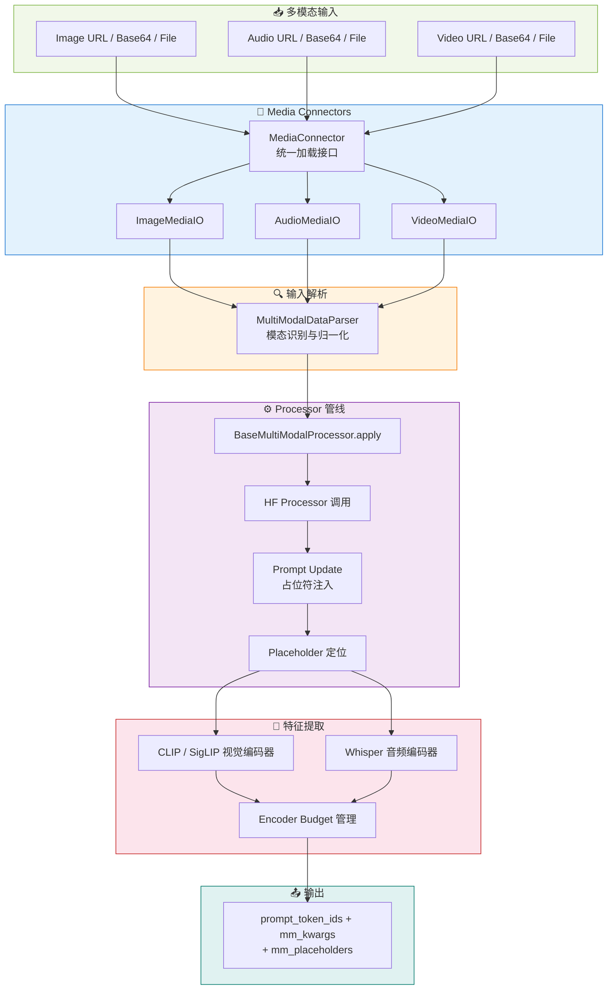
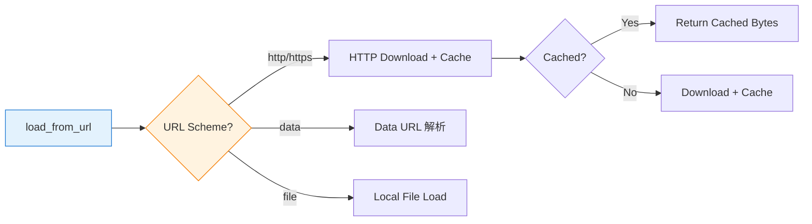
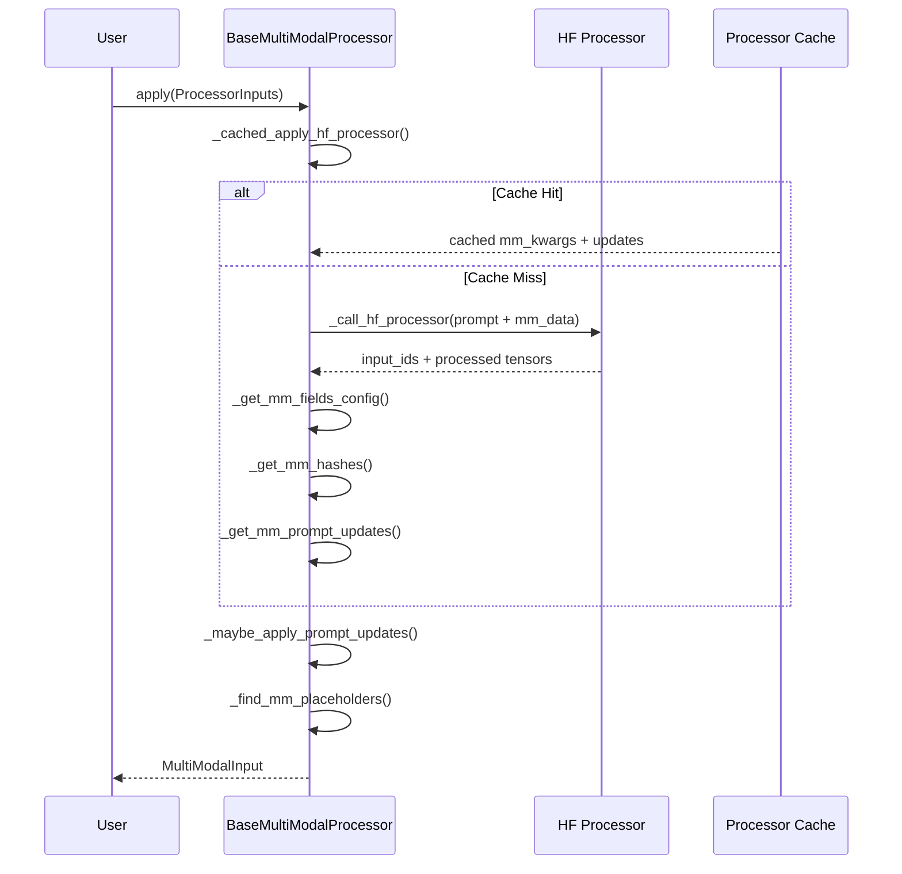
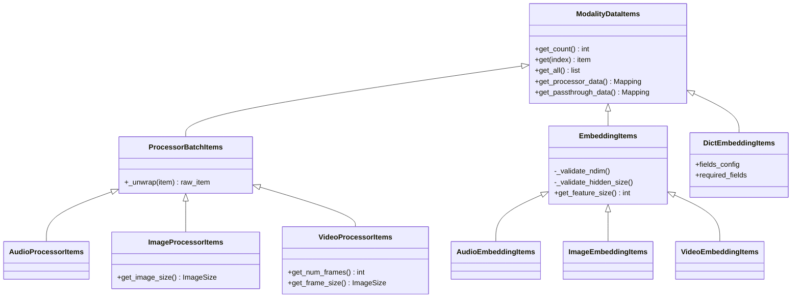
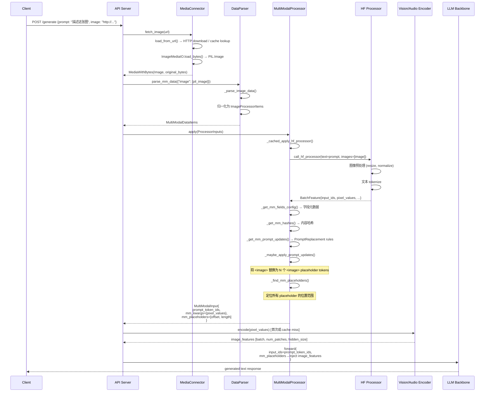

# vLLM 多模态处理管线分析

> **定位**: 本文档深入剖析 vLLM 的多模态（Multimodal）输入处理全流程，涵盖从原始媒体数据加载、解析、编码到最终注入 LLM 的完整管线。



---

## 目录

- [一、MultiModalRegistry 多模态处理器注册表](#一-multimodalregistry-多模态处理器注册表)
- [二、媒体连接器 Media Connectors](#二-媒体连接器-media-connectors)
- [三、处理器 Processors](#三-处理器-processors)
- [四、输入解析](#四-输入解析)
- [五、特征提取管线](#五-特征提取管线)
- [六、支持的多模态模型](#六-支持的多模态模型)
- [七、Assets 系统](#七-assets-系统)
- [八、端到端数据流](#八-端到端数据流)

---

## 一、MultiModalRegistry 多模态处理器注册表

**源码位置**: [`registry.py`](file:///workspace/vllm/multimodal/registry.py)

`MultiModalRegistry` 是整个多模态子系统的**中央调度枢纽**，负责：

1. 将模型类与对应的多模态处理器工厂绑定
2. 根据模型配置动态创建处理器实例
3. 管理多模态缓存策略
4. 提供 dummy inputs 生成能力（用于 profiling）

### 1.1 注册机制

采用**装饰器模式**，通过 `register_processor()` 方法将处理器工厂绑定到模型类：

```python
# registry.py:142-174
def register_processor(
    self,
    processor: MultiModalProcessorFactory[_I],
    *,
    info: ProcessingInfoFactory[_I],
    dummy_inputs: DummyInputsBuilderFactory[_I],
):
    """Register a multi-modal processor to a model class."""

    def wrapper(model_cls: N) -> N:
        if "_processor_factory" in model_cls.__dict__:
            logger.warning(
                "Model class %s already has a multi-modal processor "
                "registered to %s. It is overwritten by the new one.",
                model_cls,
                self,
            )

        model_cls._processor_factory = _ProcessorFactories(
            info=info,
            dummy_inputs=dummy_inputs,
            processor=processor,
        )

        return model_cls

    return wrapper
```

**核心数据结构 `_ProcessorFactories`** (第82-95行) 封装了三个工厂函数：

| 工厂 | 类型 | 职责 |
|------|------|------|
| `info` | `ProcessingInfoFactory` | 创建 `BaseProcessingInfo`，提供模型配置信息 |
| `dummy_inputs` | `DummyInputsBuilderFactory` | 创建 `BaseDummyInputsBuilder`，用于 profiling |
| `processor` | `MultiModalProcessorFactory` | 创建 `BaseMultiModalProcessor`，核心处理逻辑 |

### 1.2 处理器创建流程

```python
# registry.py:211-230
def create_processor(
    self,
    model_config: "ModelConfig",
    *,
    tokenizer: TokenizerLike | None = None,
    cache: BaseMultiModalProcessorCache | None = None,
) -> BaseMultiModalProcessor[BaseProcessingInfo]:
    """Create a multi-modal processor for a specific model and tokenizer."""
    if not model_config.is_multimodal_model:
        model_name = model_config.served_model_name or model_config.model
        raise ValueError(f"{model_name} is not a multimodal model")

    model_cls = self._get_model_cls(model_config)      # 获取模型架构类
    factories = model_cls._processor_factory             # 获取绑定的工厂

    ctx = self._create_processing_ctx(model_config, tokenizer)  # 构建上下文

    return factories.build_processor(ctx, cache=cache)     # 构建处理器
```

**调用链**: `create_processor()` → `_get_model_cls()` → 获取 `_processor_factory` → `build_processor()`

### 1.3 模态支持检查

```python
# registry.py:103-140
def supports_multimodal_inputs(self, model_config: "ModelConfig") -> bool:
    """
    Checks if the model supports multimodal inputs.
    Returns True if the model is multimodal with any non-zero supported modalities.
    """
    if not model_config.is_multimodal_model:
        return False

    mm_config = model_config.get_multimodal_config()
    try:
        info = self._create_processing_info(model_config, tokenizer=None)
    except ValueError:
        # 无已注册的 processor，回退到纯文本模式
        logger.warning_once(...)
        return False

    # 检查所有支持的模态 limit 是否都为 0
    if all(
        mm_config.get_limit_per_prompt(modality) == 0
        for modality in info.supported_mm_limits
    ):
        if mm_config.enable_mm_embeds:
            return True  # 预计算嵌入模式仍需 MM 基础设施
        return False

    return True
```

### 1.4 缓存管理

Registry 提供四种缓存策略（第268-347行）：

| 缓存类型 | 场景 | 说明 |
|----------|------|------|
| `None` | 禁用缓存 | 不使用任何缓存 |
| `processor_only` | 单进程 / DP + 外部 LB | 仅在 API 进程内缓存 |
| `lru` | IPC 支持 | 基于 LRU 的跨进程缓存 |
| `shm` | IPC 支持 | 基于共享内存的高性能缓存 |

### 1.5 Dummy Inputs 生成

用于启动时的内存 profiling：

```python
# registry.py:232-266
def get_dummy_mm_inputs(
    self,
    model_config: "ModelConfig",
    mm_counts: Mapping[str, int],
    *,
    cache: BaseMultiModalProcessorCache | None = None,
    processor: BaseMultiModalProcessor | None = None,
) -> MultiModalInput:
    """Create dummy data for profiling the memory usage of a model."""
    seq_len = model_config.max_model_len

    if processor is None:
        processor = self.create_processor(model_config, cache=cache)

    # 生成 dummy processor inputs 并应用处理
    processor_inputs = processor.dummy_inputs.get_dummy_processor_inputs(...)
    mm_inputs = processor.apply(processor_inputs, timing_ctx=TimingContext(enabled=False))

    # 补齐到 max_model_len
    prompt_token_ids = mm_inputs["prompt_token_ids"]
    total_len = len(prompt_token_ids)
    if total_len < seq_len:
        prompt_token_ids.extend([0] * (seq_len - total_len))

    return mm_inputs
```

---

## 二、媒体连接器 Media Connectors

**源码目录**: [`vllm/multimodal/media/`](file:///workspace/vllm/multimodal/media/)

Media Connectors 负责**从多种来源加载原始媒体数据**（HTTP URL、data URL、本地文件），并将其转换为统一的内部表示。

### 2.1 基类 MediaIO

**源码位置**: [`base.py`](file:///workspace/vllm/multimodal/media/base.py)

```python
# base.py:46-83
class MediaIO(ABC, Generic[_T]):
    """Configuration values can be user-provided either by --media-io-kwargs
    or by the runtime API field "media_io_kwargs"."""

    @classmethod
    def merge_kwargs(cls, default_kwargs, runtime_kwargs):
        """Merge config-level kwargs and request-level kwargs."""
        merged = dict(default_kwargs or {})
        if runtime_kwargs:
            merged.update(runtime_kwargs)
        return merged

    @abstractmethod
    def load_bytes(self, data: bytes) -> _T: ...

    @abstractmethod
    def load_base64(self, media_type: str, data: str) -> _T: ...

    @abstractmethod
    def load_file(self, filepath: Path) -> _T: ...
```

**关键辅助类 `MediaWithBytes`** (第14-43行)：将媒体对象与其原始字节绑定，确保缓存一致性。

### 2.2 Image Connector — 图像加载与预处理

**源码位置**: [`image.py`](file:///workspace/vllm/multimodal/media/image.py)

```python
# image.py:20-98
class ImageMediaIO(MediaIO[Image.Image]):
    def __init__(self, image_mode: str = "RGB", **kwargs) -> None:
        self.image_mode = image_mode
        self.kwargs = kwargs
        # RGBA → RGB 转换的背景色配置
        rgba_bg = kwargs.get("rgba_background_color", (255, 255, 255))
        self.rgba_background_color = rgba_bg

    def load_bytes(self, data: bytes) -> MediaWithBytes[Image.Image]:
        image = Image.open(BytesIO(data))
        image.load()
        image = self._convert_image_mode(image)  # 自动转换色彩空间
        return MediaWithBytes(image, data)

    def load_base64(self, media_type: str, data: str) -> MediaWithBytes[Image.Image]:
        return self.load_bytes(pybase64.b64decode(data, validate=True))
```

**特性**：
- 自动色彩空间转换（RGBA→RGB）
- 支持自定义背景色
- 返回 `MediaWithBytes` 包装以保留原始字节

**ImageEmbeddingMediaIO** (第101-139行): 专门处理预计算的图像嵌入，支持 numpy (.npy) 和 PyTorch 序列化格式。

### 2.3 Audio Connector — 音频处理

**源码位置**: [`audio.py`](file:///workspace/vllm/multimodal/media/audio.py)

音频加载采用**双后端降级策略**：

```python
# audio.py:132-160
def load_audio(path, *, sr=None, mono=True):
    try:
        return load_audio_soundfile(path, sr=sr, mono=mono)   # 优先: soundfile
    except ImportError as exc:
        logger.error("Failed to load audio via soundfile: %r", exc)
    except soundfile.LibsndfileError as exc:
        if exc.code not in _BAD_SF_CODES:
            raise  # 已知格式检测失败才降级
    # 降级到 PyAV (FFmpeg)
    try:
        return load_audio_pyav(path, sr=sr, mono=mono)
    except ImportError:
        raise  # 让 PlaceholderModule 的消息传播
```

**两种加载实现对比**:

| 后端 | 函数 | 特点 |
|------|------|------|
| `soundfile` | `load_audio_soundfile()` | 高精度，原生采样率 |
| `PyAV` | `load_audio_pyav()` | FFmpeg 后端，广泛格式支持 |

PyAV 实现细节 ([`audio.py:45-109`](file:///workspace/vllm/multimodal/media/audio.py#L45-L109))：
- 自动重采样 (`av.AudioResampler`)
- 多声道 → 单声道平均
- 流式解码避免内存爆炸

### 2.4 Video Connector — 视频帧提取

**源码位置**: [`video.py`](file:///workspace/vllm/multimodal/media/video.py)

```python
# video.py:19-147
class VideoMediaIO(MediaIO[tuple[npt.NDArray, dict[str, Any]]]):
    def __init__(self, image_io, num_frames=32, **kwargs):
        self.image_io = image_io
        self.num_frames = num_frames
        # 支持运行时覆盖视频后端
        video_loader_backend = (
            kwargs.pop("video_backend", None) or envs.VLLM_VIDEO_LOADER_BACKEND
        )
        self.video_loader = VIDEO_LOADER_REGISTRY.load(video_loader_backend)
```

**特殊功能 — JPEG 序列支持** ([`video.py:74-138`](file:///workspace/vllm/multimodal/media/video.py#L74-L138))：

当 `media_type` 为 `video/jpeg` 时，将 base64 编码的 JPEG 帧序列拼接为视频：

```python
if media_type.lower() == "video/jpeg":
    frame_parts = data.split(",", self.num_frames)[:self.num_frames]
    frames = np.stack([
        np.asarray(load_frame(frame_data)) for frame_data in frame_parts
    ])
    metadata = {
        "total_num_frames": total_num_frames,
        "fps": fps,
        "duration": duration,
        "video_backend": "jpeg_sequence",
        "frames_indices": frames_indices,
        "do_sample_frames": ...,
    }
    return frames, metadata
```

### 2.5 统一接口 MediaConnector

**源码位置**: [`connector.py`](file:///workspace/vllm/multimodal/media/connector.py)

`MediaConnector` 是面向用户的统一入口，协调各模态 IO 并提供：

#### URL 加载路由



```python
# connector.py:286-319
def load_from_url(self, url, media_io, *, fetch_timeout=None):
    url_spec = parse_url(url)

    if url_spec.scheme and url_spec.scheme.startswith("http"):
        self._assert_url_in_allowed_media_domains(url_spec)
        cached = self._get_cached_bytes(url)
        if cached is not None:
            return media_io.load_bytes(cached)
        data = connection.get_bytes(url_spec.url, timeout=fetch_timeout, ...)
        self._put_cached_bytes(url, data)
        return media_io.load_bytes(data)

    if url_spec.scheme == "data":
        return self._load_data_url(url_spec, media_io)
    if url_spec.scheme == "file":
        return self._load_file_url(url_spec, media_io)
```

#### 媒体下载缓存

[`connector.py:127-229`](file:///workspace/vllm/multimodal/media/connector.py#L127-L229) 实现了带 TTL 和大小限制的 LRU 缓存：

- **环境变量控制**: `VLLM_MEDIA_CACHE`, `VLLM_MEDIA_CACHE_MAX_SIZE_MB`, `VLLM_MEDIA_CACHE_TTL_HOURS`
- **淘汰策略**: 先淘汰过期条目，再按 LRU 淘汰直到低于大小限制
- **原子写入**: 通过临时文件 + rename 保证安全性

#### 异步支持

```python
# connector.py:321-368
async def load_from_url_async(self, url, media_io, *, fetch_timeout=None):
    """Asynchronously load media from a URL."""
    loop = asyncio.get_running_loop()
    # 使用 ThreadPoolExecutor 执行阻塞 IO
    cached = await loop.run_in_executor(global_thread_pool, self._get_cached_bytes, url)
    if cached is not None:
        future = loop.run_in_executor(global_thread_pool, media_io.load_bytes, cached)
        return await future
    # ... HTTP async download
```

#### 模态映射表

```python
# connector.py:43-47
MODALITY_IO_MAP: dict[str, type[MediaIO]] = {
    "audio": AudioMediaIO,
    "image": ImageMediaIO,
    "video": VideoMediaIO,
}
```

---

## 三、处理器 Processors

**源码目录**: [`vllm/multimodal/processing/`](file:///workspace/vllm/multimodal/processing/)

Processor 是多模态处理的**核心引擎**，负责将原始媒体数据转换为模型可消费的张量表示。

### 3.1 处理上下文 InputProcessingContext

**源码位置**: [`context.py`](file:///workspace/vllm/multimodal/processing/context.py)

```python
# context.py:89-109
@dataclass(frozen=True)
class InputProcessingContext:
    """Contains information about the model which may be used to modify the inputs."""
    model_config: ModelConfig
    tokenizer: TokenizerLike | None

    def get_hf_config(self, typ=None) -> PretrainedConfig: ...
    def get_hf_processor(self, typ=None, **kwargs) -> ProcessorMixin: ...
    def call_hf_processor(self, hf_processor, data, kwargs={}) -> BatchFeature: ...
```

**关键职责**：
- 封装模型配置和 tokenizer
- 提供类型安全的 HF config / processor 访问
- 统一调用 HF processor 并处理后处理（dtype 转换等）

### 3.2 BaseProcessingInfo — 模型特定信息

**源码位置**: [`context.py:295-488`](file:///workspace/vllm/multimodal/processing/context.py#L295-L488)

```python
class BaseProcessingInfo:
    def __init__(self, ctx: InputProcessingContext):
        self.ctx = ctx

    @property
    def model_id(self) -> str:
        return self.ctx.model_config.model

    @abstractmethod
    def get_supported_mm_limits(self) -> Mapping[str, int | None]:
        """返回每个模态支持的最大数量，None 表示无限制"""
        raise NotImplementedError

    @cached_property
    def allowed_mm_limits(self) -> Mapping[str, int]:
        """用户配置限制与模型固有限制的较小值"""
        ...

    def validate_num_items(self, modality: str, num_items: int) -> None:
        """验证输入项数是否超限"""
        ...

    def parse_mm_data(self, mm_data, *, validate=True) -> MultiModalDataItems:
        """解析并验证多模态数据字典"""
        ...
```

### 3.3 BaseMultiModalProcessor — 核心处理基类

**源码位置**: [`processor.py:972-1708`](file:///workspace/vllm/multimodal/processing/processor.py#L972-L1708)

这是最关键的类，定义了标准的多模态处理流水线。

#### 整体处理流程



#### apply() 主方法详解

```python
# processor.py:1663-1707
def apply(self, inputs: ProcessorInputs, timing_ctx: TimingContext) -> MultiModalInput:
    """
    Process multi-modal inputs to be used in vLLM.

    Main steps:
    1. Apply HF Processor on prompt text and multi-modal data together
    2. Find and update sequences with placeholder tokens
    3. Extract placeholder token information from processed token IDs
    """
    # Step 1: 应用 HF Processor（带缓存）
    prompt_ids, mm_info, is_update_applied = \
        self._cached_apply_hf_processor(inputs, timing_ctx)

    # Step 2: 应用 Prompt Updates（占位符替换/插入）
    prompt_ids, mm_placeholders = self._maybe_apply_prompt_updates(
        mm_items=inputs.mm_data_items,
        prompt_ids=prompt_ids,
        mm_kwargs=mm_info.kwargs,
        mm_prompt_updates=mm_info.prompt_updates,
        is_update_applied=is_update_applied,
    )

    # Step 3: 构建 PlaceholderRange
    mm_placeholder_ranges = {
        modality: [item.to_range() for item in placeholders]
        for modality, placeholders in mm_placeholders.items()
    }

    return mm_input(
        prompt_token_ids=prompt_ids,
        mm_kwargs=mm_info.kwargs,
        mm_hashes=mm_info.hashes,
        mm_placeholders=mm_placeholder_ranges,
    )
```

### 3.4 Prompt Update 机制

Prompt Update 是 vLLM 多模态系统的**核心创新**之一，用于在 token 序列中标记多模态特征的位置。

#### 两种更新模式

```python
# processor.py:292-295
class UpdateMode(str, Enum):
    INSERT = "insert"   # 在目标位置之后插入占位符
    REPLACE = "replace" # 替换目标内容为占位符
```

#### PromptInsertion — 插入模式

```python
# processor.py:353-419
@dataclass
class PromptInsertion(PromptUpdate):
    """Defines how to insert placeholder tokens into a prompt."""

    insertion: PromptUpdateContent  # 要插入的内容

    # 示例: 在 <s> token 后插入 N 个 <image> 占位符
    # PromptInsertion(
    #     modality="image",
    #     target="<s>",
    #     insertion="<image>" * image_feature_size,
    # )
```

#### PromptReplacement — 替换模式

```python
# processor.py:422-496
@dataclass
class PromptReplacement(PromptUpdate):
    """Defines how to replace portions of an input prompt with placeholder tokens."""

    replacement: PromptUpdateContent  # 替换后的内容

    # 示例: 将每个 <image> 替换为 feature_size 个 <image> token
    # PromptReplacement(
    #     modality="image",
    #     target="<image>",
    #     replacement="<image>" * image_feature_size,
    # )
```

#### PromptIndex — 位置定位

```python
# processor.py:141-186
class PromptIndexTargets:
    @staticmethod
    def start() -> PromptIndex:
        """解析为 prompt 开头（第一个 token 之前）"""

    @staticmethod
    def prefix(seq: PromptSeq) -> PromptIndex:
        """解析为给定前缀之后的位置"""

    @staticmethod
    def end() -> PromptIndex:
        """解析为 prompt 末尾（最后一个 token 之后）"""
```

#### PromptUpdateDetails — 细粒度控制

```python
# processor.py:205-269
@dataclass
class PromptUpdateDetails(Generic[_S]):
    full: _S                    # 完整内容
    is_embed: Callable | None   # 可选：选择哪些位置需要 embedding

    @staticmethod
    def select_text(seq, embed_text: str):
        """仅对匹配 embed_text 的位置分配 embedding"""

    @staticmethod
    def select_token_id(seq, embed_token_id: int):
        """仅对指定 token ID 的位置分配 embedding"""
```

### 3.5 HF Processor 集成

vLLM 的 Processor 层封装了 HuggingFace `ProcessorMixin`，提供多种调用模式：

| 方法 | 场景 | 说明 |
|------|------|------|
| `_apply_hf_processor_text_mm()` | 文本+多模态联合处理 | 标准 HF processor 调用 |
| `_apply_hf_processor_text_only()` | 仅文本 | 生成 dummy 多模态数据配合 |
| `_apply_hf_processor_tokens_only()` | 仅 token IDs | 大多数 HF processor 不支持 |
| `_apply_hf_processor_mm_only()` | 仅多模态数据 | 生成 dummy 文本配合 |

### 3.6 缓存感知处理

[`processor.py:1441-1510`](file:///workspace/vllm/multimodal/processing/processor.py#L1441-L1510) 实现了缓存感知的 HF Processor 调用：

```python
def _cached_apply_hf_processor(self, inputs, timing_ctx):
    cache = self.cache
    if cache is None or passthrough_data:
        return self._apply_hf_processor(inputs, timing_ctx)  # 无缓存时回退

    # 计算哈希
    mm_hashes = inputs.get_mm_hashes(self.info.model_id)

    # 筛选未缓存的项
    mm_is_cached, mm_missing_data_items = self._get_cache_missing_items(
        cache, inputs.mm_data_items, mm_hashes
    )

    # 仅对缺失项调用 HF Processor（不应用 prompt update）
    prompt_ids, mm_missing_processed_data, _ = self._apply_hf_processor_main(
        prompt=inputs.prompt,
        mm_items=mm_missing_data_items,
        enable_hf_prompt_update=False,  # 关键：延迟到合并后
    )

    # 合并缓存结果与新鲜计算结果
    mm_kwargs, mm_prompt_updates = self._merge_mm_kwargs(
        cache, mm_hashes, mm_is_cached,
        mm_missing_kwargs, mm_missing_prompt_updates
    )
```

### 3.7 Dummy Inputs Builder

**源码位置**: [`dummy_inputs.py`](file:///workspace/vllm/multimodal/processing/dummy_inputs.py)

用于生成 profiling 所需的虚拟输入数据：

```python
# dummy_inputs.py:28-92
class BaseDummyInputsBuilder(ABC, Generic[_I]):
    @abstractmethod
    def get_dummy_text(self, mm_counts) -> str:
        """构建对应 mm_counts 的文本输入"""
        raise NotImplementedError

    @abstractmethod
    def get_dummy_mm_data(self, seq_len, mm_counts, mm_options):
        """构建最大可能占位符数量的多模态输入"""
        raise NotImplementedError

    def get_dummy_processor_inputs(self, seq_len, mm_counts, mm_options):
        """组合文本和多模态数据为完整 ProcessorInputs"""
        ...
```

内置的辅助方法 ([`dummy_inputs.py:94-187`](file:///workspace/vllm/multimodal/processing/dummy_inputs.py#L94-L187))：

- `_get_dummy_audios()`: 生成零填充的音频波形
- `_get_dummy_images()`: 生成白色 PIL Image
- `_get_dummy_videos()`: 生成白色帧序列

### 3.8 ProcessorInputs — 输入数据结构

**源码位置**: [`inputs.py`](file:///workspace/vllm/multimodal/processing/inputs.py)

```python
# inputs.py:12-71
@dataclass
class ProcessorInputs:
    """Represents the keyword arguments to BaseMultiModalProcessor.apply()"""

    prompt: str | list[int]                    # 输入 prompt
    mm_data_items: MultiModalDataItems          # 解析后的多模态数据
    mm_uuid_items: MultiModalUUIDItems | None   # 用户提供的 UUID（可选）
    hf_processor_mm_kwargs: Mapping             # HF processor 额外参数
    tokenization_kwargs: Mapping                # 分词参数

    def get_mm_hashes(self, model_id: str) -> MultiModalHashes:
        """计算每个多模态项的内容哈希，用于缓存键"""
        ...
```

### 3.9 EncDecMultiModalProcessor

**源码位置**: [`processor.py:1710-1785`](file:///workspace/vllm/multimodal/processing/processor.py#L1710-L1785)

针对 **Encoder-Decoder 架构**（如 Whisper-based 模型）的特殊处理器：

```python
class EncDecMultiModalProcessor(BaseMultiModalProcessor[_I]):
    @abstractmethod
    def create_encoder_prompt(self, prompt, mm_items) -> str | list[int]:
        """创建编码器输入 prompt"""
        raise NotImplementedError

    def create_decoder_prompt(self, prompt, mm_items) -> str | list[int]:
        """创建解码器输入 prompt（默认直接使用原始 prompt）"""
        return prompt

    def apply(self, inputs, timing_ctx) -> MultiModalEncDecInput:
        encoder_prompt = self.create_encoder_prompt(inputs.prompt, inputs.mm_data_items)
        encoder_processor_inputs = ProcessorInputs(encoder_prompt, ...)
        encoder_inputs = super().apply(encoder_processor_inputs, timing_ctx)
        return self._get_enc_dec_inputs(prompt, mm_items, encoder_inputs)
```

---

## 四、输入解析

**源码位置**: [`parse.py`](file:///workspace/vllm/multimodal/parse.py)

### 4.1 MultiModalDataParser — 数据归一化引擎

`MultiModalDataParser` 是将用户传入的 `MultiModalDataDict` 归一化为结构化 `MultiModalDataItems` 的核心组件。

#### 支持的模态子解析器

```python
# parse.py:671-677
def _get_subparsers(self) -> Mapping[str, ModalityDataParser]:
    return {
        "audio": self._parse_audio_data,
        "image": self._parse_image_data,
        "video": self._parse_video_data,
        "vision_chunk": self._parse_vision_chunk_data,  # 统一图像/视频块
    }
```

#### 数据类型识别

[`parse.py:512-521`](file:///workspace/vllm/multimodal/parse.py#L512-L521) 的 `is_embeddings()` 方法自动检测预计算嵌入：

```python
@classmethod
def is_embeddings(cls, data: object) -> TypeGuard[torch.Tensor | list[torch.Tensor]]:
    if isinstance(data, torch.Tensor):
        return data.ndim == 3           # (batch, seq_len, hidden_size)
    if is_list_of(data, torch.Tensor) and len(data) > 0:
        return data[0].ndim == 2       # [(seq_len, hidden_size), ...]
    return False
```

### 4.2 各模态解析逻辑

#### 图像解析

```python
# parse.py:592-611
def _parse_image_data(self, data):
    if self.is_embeddings(data):
        return ImageEmbeddingItems(data, self.expected_hidden_size)

    # 单张图: PIL.Image / ndarray(3D) / tensor(3D)
    if isinstance(data, (PILImage.Image, MediaWithBytes)) or \
       (isinstance(data, (np.ndarray, torch.Tensor)) and data.ndim == 3):
        data_items = [data]
    # 多张图: list / ndarray(4D) / tensor(4D)
    elif isinstance(data, (np.ndarray, torch.Tensor)):
        data_items = [elem for elem in data]
    else:
        data_items = data

    return ImageProcessorItems(data_items)
```

#### 音频解析

```python
# parse.py:553-590
def _parse_audio_data(self, data):
    if self.is_embeddings(data):
        return AudioEmbeddingItems(data, self.expected_hidden_size)

    # 支持格式: tuple(waveform, sr) / list / np.ndarray(1D) / tensor(1D)
    # 自动重采样和声道归一化
    for data_item in data_items:
        audio, orig_sr = self._get_audio_with_sr(data_item)
        if orig_sr is not None:
            new_audio = self.audio_resampler.resample(audio, orig_sr=orig_sr)
        if self.target_channels is not None:
            new_audio = normalize_audio(new_audio, spec)
        new_audios.append(new_audio)

    return AudioProcessorItems(new_audios)
```

#### 视频解析

```python
# parse.py:613-653
def _parse_video_data(self, data):
    if self.is_embeddings(data):
        return VideoEmbeddingItems(data, self.expected_hidden_size)

    # 支持格式: list[PIL.Image] / ndarray(4D) / tensor(4D) / tuple(ndarray, metadata)
    # 可选 metadata 提取 (fps, duration, frames_indices 等)
    ...
    return VideoProcessorItems(new_videos, metadata=metadata_lst)
```

### 4.3 数据项类层次



### 4.4 嵌入验证

[`parse.py:128-215`](file:///workspace/vllm/multimodal/parse.py#L128-L215) 实现了严格的多模态嵌入验证：

```python
def validate_embedding_ndim(tensor, modality, index=None):
    """Single embeddings should be 2D, batched should be 3D."""
    if tensor.ndim < 2 or tensor.ndim > 3:
        raise ValueError(
            f"{modality.capitalize()} embedding must be 2D or 3D, "
            f"got {tensor.ndim}D with shape {tuple(tensor.shape)}"
        )
```

`EmbeddingItems` 类还会验证 hidden dimension 是否匹配模型预期，防止维度不一致导致的推理时崩溃。

---

## 五、特征提取管线

### 5.1 视觉编码器

vLLM 内置了优化的视觉编码器实现，用于将图像/视频像素转换为特征向量。

#### CLIP Vision Model

**源码位置**: [`model_executor/models/clip.py`](file:///workspace/vllm/model_executor/models/clip.py)

CLIP (Contrastive Language-Image Pre-training) 视觉编码器是 LLaVA 系列模型的核心组件。vLLM 的实现支持：
- 并行注意力优化
- 动态 patch 数量处理
- 特征选择策略 (`"full"`, `"patch"`, etc.)

#### SigLIP Vision Model

**源码位置**: [`model_executor/models/siglip.py`](file:///workspace/vllm/model_executor/models/siglip.py)

SigLIP (Sigmoid Loss for Language-Image Pre-training) 是 CLIP 的改进版本，被 LLaVA-NeXT 等新模型广泛采用。

在 LLaVA-NeXT 中 ([`llava_next.py:33`](file:///workspace/vllm/model_executor/models/llava_next.py#L33))：

```python
from .siglip import SiglipVisionModel
from .clip import CLIPVisionModel
# 根据模型配置选择视觉编码器
```

### 5.2 音频编码器

Whisper 系列音频编码器用于处理音频输入，将波形转换为语义特征向量。

### 5.3 Encoder Budget Management

**源码位置**: [`encoder_budget.py`](file:///workspace/vllm/multimodal/encoder_budget.py)

Encoder Budget 是 vLLM 多模态系统的**关键资源管理机制**，用于控制编码器的计算和内存开销。

#### MultiModalBudget 类

```python
# encoder_budget.py:44-192
class MultiModalBudget:
    """Helper class to calculate budget information for multi-modal models."""

    def __init__(self, vllm_config, mm_registry):
        self.model_config = model_config = vllm_config.model_config
        self.scheduler_config = scheduler_config = vllm_config.scheduler_config

        # 创建 processor 以获取 token 数信息
        cache = mm_registry.processor_only_cache_from_config(vllm_config)
        processor = mm_registry.create_processor(model_config, cache=cache)

        # 区分 tower modalities 和 embedding-only modalities
        tower_modalities = {modality for modality in supported_mm_limits
                           if mm_limits.get(modality, 0) > 0}
        embed_only_modalities = {modality for modality in supported_mm_limits
                                 if enable_mm_embeds and mm_limits.get(modality, 0) == 0}

        # 计算每个模态每项的最大 token 数
        all_mm_max_toks_per_item = get_mm_max_toks_per_item(...)

        # 计算编码器预算
        encoder_compute_budget, encoder_cache_size = compute_mm_encoder_budget(
            scheduler_config, active_mm_max_toks_per_item
        )
```

#### 预算计算策略

```python
# encoder_budget.py:140-180
def _get_max_items(self, modality, max_tokens_per_item):
    # 编码器预算限制
    max_encoder_items_per_batch = encoder_budget // max_tokens_per_item

    # 解码器预算限制（基于 sequence length）
    max_items_per_prompt = max(
        1, min(mm_limit, self.max_model_len // max_tokens_per_item)
    )

    # batch 级别限制
    max_decoder_items_per_batch = max_num_reqs * max_items_per_prompt

    # 取较小值
    max_items_per_batch = max(
        1, min(max_encoder_items_per_batch, max_decoder_items_per_batch)
    )

    return max_items_per_prompt, max_items_per_batch
```

#### Budget 组成

| 组件 | 来源 | 作用 |
|------|------|------|
| `encoder_compute_budget` | `compute_mm_encoder_budget()` | 基于调度器配置的计算预算 |
| `encoder_cache_size` | `compute_mm_encoder_budget()` | 缓存容量限制 |
| `mm_max_toks_per_item` | Dummy input profiling | 每个媒体项产生的最大 token 数 |
| `mm_max_items_per_prompt` | min(limit, seq_len/tokens) | 每个 prompt 最大媒体数 |
| `mm_max_items_per_batch` | min(encoder, decoder) | 每个 batch 最大媒体总数 |

---

## 六、支持的多模态模型

### 6.1 LLaVA-NeXT

**源码位置**: [`model_executor/models/llava_next.py`](file:///workspace/vllm/model_executor/models/llava_next.py)

LLaVA-NeXT 是 LLaVA 的增强版本，支持**任意分辨率图像处理**。

**核心特性**：
- 使用 `LlavaNextProcessor` 处理输入
- 支持 CLIP 或 SigLIP 作为视觉编码器
- dynamic resolution：根据图像尺寸动态调整 token 数量
- anyres grid：将大图像分割为多个 patch 处理

```python
# llava_next.py:88-101
class LlavaNextProcessingInfo(BaseLlavaProcessingInfo):
    def get_hf_config(self) -> LlavaNextLikeConfig:
        return self.ctx.get_hf_config(LlavaNextConfig)

    def get_hf_processor(self, **kwargs):
        hf_processor = self.ctx.get_hf_processor(LlavaNextProcessor, **kwargs)
        # 补充 patch_size（某些模型配置中缺失）
        if hf_processor.patch_size is None:
            patch_size = self.get_vision_encoder_info().get_patch_size()
            hf_processor.patch_size = patch_size
        return hf_processor
```

**Token 数计算** ([`llava_next.py:104-139`](file:///workspace/vllm/model_executor/models/llava_next.py#L104-L139))：

```python
def get_num_image_tokens(self, *, image_width, image_height):
    """Get the number of image tokens for the given image dimensions."""
    # 基础 feature size（基于 vision_feature_select_strategy）
    base_feature_size = get_num_selected_vision_tokens(
        vision_encoder_info.get_num_image_tokens(image_width, image_height),
        hf_config.vision_feature_select_strategy,
    )

    # AnyRes grid shape
    num_patch_height, num_patch_width = get_anyres_image_grid_shape(
        image_size=(image_height, image_width),
        grid_pinpoints=hf_config.image_grid_pinpoints,
        patch_size=vision_encoder_info.get_image_size(),
    )

    # Unpadded features + newline features
    unpadded_feature_size, newline_feature_size = self._get_num_unpadded_features(...)
    return unpadded_feature_size + newline_feature_size + base_feature_size
```

**相关模型文件**：
- [`llava.py`](file:///workspace/vllm/model_executor/models/llava.py) — LLaVA 1.5 基线
- [`llava_onevision.py`](file:///workspace/vllm/model_executor/models/llava_onevision.py) — LLaVA-OneVision（含视频理解）
- [`llava_next_video.py`](file:///workspace/vllm/model_executor/models/llava_next_video.py) — LLaVA-NeXT-Video

### 6.2 Qwen2-VL / Qwen-VL 系列

**源码位置**:
- [`qwen2_vl.py`](file:///workspace/vllm/model_executor/models/qwen2_vl.py) — Qwen2-VL
- [`qwen_vl.py`](file:///workspace/vllm/model_executor/models/qwen_vl.py) — Qwen-VL (第一代)
- [`qwen2_5_vl.py`](file:///workspace/vllm/model_executor/models/qwen2_5_vl.py) — Qwen2.5-VL
- [`qwen3_vl.py`](file:///workspace/vllm/model_executor/models/qwen3_vl.py) — Qwen3-VL
- [`qwen3_vl_moe.py`](file:///workspace/vllm/model_executor/models/qwen3_vl_moe.py) — Qwen3-VL-MoE

Qwen2-VL 是阿里通义千问团队开发的多模态大模型，具有以下特点：

**独特的输入表示** ([`qwen2_vl.py:120-145`](file:///workspace/vllm/model_executor/models/qwen2_vl.py#L120-L145))：

```python
class Qwen2VLImagePixelInputs(TensorSchema):
    """
    Dimensions:
        - np: Total number of patches over each image
        - ni: Number of images
        - cps: Number of channels * patch_size * patch_size
    """
    type: Literal["pixel_values"]
    pixel_values: Annotated[torch.Tensor, TensorShape("np", "cps")]
    image_grid_thw: Annotated[torch.Tensor, TensorShape("ni", 3)]
    # image_grid_thw: (num_images, 3) in (grid_t, grid_h, grid_w) format
```

**核心特性**：
- **M-RoPE (Multimodal Rotary Positional Embeddings)**: 统一处理 2D 空间和 1D 时间位置
- **动态分辨率**: naive/dynamic/smart 三种 resize 策略
- **原生视频支持**: 通过 temporal 维度扩展
- **视觉-语言统一架构**: 共享 transformer backbone

### 6.3 Pixtral

**源码位置**: [`model_executor/models/pixtral.py`](file:///workspace/vllm/model_executor/models/pixtral.py)

Pixtral 是 Mistral AI 发布的**开源多模态模型**，基于 Mistral 架构扩展。

**核心特性** ([`pixtral.py:1-99`](file:///workspace/vllm/model_executor/models/pixtral.py#L1-L99))：

```python
# 使用 MistralCommon 协议进行图像分块处理
from mistral_common.protocol.instruct.chunk import ImageChunk, TextChunk
from transformers.models.pixtral import (
    PixtralRotaryEmbedding,
    apply_rotary_pos_emb,
    position_ids_in_meshgrid,
)
```

- 基于 `mistral_common` 的图像分块协议
- 2D Rotary Embedding (meshgrid 式位置编码)
- 支持 xformers FlashAttention 加速
- 原生 Eagle3 推测解码支持

---

## 七、Assets 系统

**源码目录**: [`vllm/assets/`](file:///workspace/vllm/assets/)

Assets 系统提供**测试和示例用的多模态资源管理**，包括自动下载和本地缓存。

### 7.1 基础设施

**源码位置**: [`base.py`](file:///workspace/vllm/assets/base.py)

```python
# base.py:10-40
VLLM_S3_BUCKET_URL = "https://vllm-public-assets.s3.us-west-2.amazonaws.com"

def get_cache_dir() -> Path:
    """获取资源缓存目录路径"""
    path = Path(envs.VLLM_ASSETS_CACHE)
    path.mkdir(parents=True, exist_ok=True)
    return path

@lru_cache
def get_vllm_public_assets(filename: str, s3_prefix: str | None = None) -> Path:
    """从 S3 下载资源文件并返回本地路径"""
    asset_path = get_cache_dir() / "vllm_public_assets" / filename
    if not asset_path.exists():
        global_http_connection.download_file(
            f"{VLLM_S3_BUCKET_URL}/{filename}", asset_path, ...
        )
    return asset_path
```

### 7.2 图像资源

**源码位置**: [`image.py`](file:///workspace/vllm/assets/image.py)

```python
# image.py:15-62
ImageAssetName = Literal[
    "stop_sign", "cherry_blossom", "hato",
    "2560px-Gfp-wisconsin-madison-the-nature-boardwalk",
    "Grayscale_8bits_palette_sample_image",
    "1280px-Venn_diagram_rgb", "RGBA_comp",
    # ... 更多测试图像
]

@dataclass(frozen=True)
class ImageAsset:
    name: ImageAssetName

    @property
    def pil_image(self) -> Image.Image:
        return self.pil_image_ext(ext="jpg")

    @property
    def image_embeds(self) -> torch.Tensor:
        """预计算的图像嵌入（仅用于 LLaVA 1.5 测试）"""
        image_path = self.get_path("pt")
        return torch.load(image_path, map_location="cpu", weights_only=True)
```

### 7.3 音频资源

**源码位置**: [`audio.py`](file:///workspace/vllm/assets/audio.py)

```python
# audio.py:17-37
AudioAssetName = Literal["winning_call", "mary_had_lamb"]

@dataclass(frozen=True)
class AudioAsset:
    name: AudioAssetName

    @property
    def audio_and_sample_rate(self) -> tuple[npt.NDArray, float]:
        audio_path = get_vllm_public_assets(filename=self.filename, s3_prefix=ASSET_DIR)
        return load_audio(audio_path, sr=None)

    @property
    def url(self) -> str:
        return urljoin(VLLM_S3_BUCKET_URL, f"{ASSET_DIR}/{self.name}.ogg")
```

### 7.4 视频资源

**源码位置**: [`video.py`](file:///workspace/vllm/assets/video.py)

```python
# video.py:103-137
VideoAssetName = Literal["baby_reading"]

@dataclass(frozen=True)
class VideoAsset:
    name: VideoAssetName
    num_frames: int = -1  # -1 表示全部帧

    @property
    def pil_images(self) -> list[Image.Image]:
        return video_to_pil_images_list(self.video_path, self.num_frames)

    @property
    def np_ndarrays(self) -> npt.NDArray:
        return video_to_ndarrays(self.video_path, self.num_frames)

    @property
    def metadata(self) -> dict[str, Any]:
        return video_get_metadata(self.video_path, self.num_frames)
```

视频资源的特殊之处在于它从 **HuggingFace Dataset** 下载（而非 S3），并使用 OpenCV 进行帧提取。

---

## 八、端到端数据流

下面展示一个完整的图像理解请求在 vLLM 多模态管线中的流转过程：



### 关键设计原则总结

| 原则 | 实现方式 |
|------|----------|
| **懒加载** | Processor 工厂模式，按需创建 |
| **缓存优先** | 多级缓存（process / LRU / shm）减少重复计算 |
| **可扩展性** | 注册表模式 + Protocol 抽象，易于添加新模态 |
| **类型安全** | 泛型 + TypeGuard 确保编译期检查 |
| **容错降级** | soundfile → PyAV 双后端，优雅降级 |
| **安全验证** | 域名白名单、路径沙箱、embedding 维度校验 |
