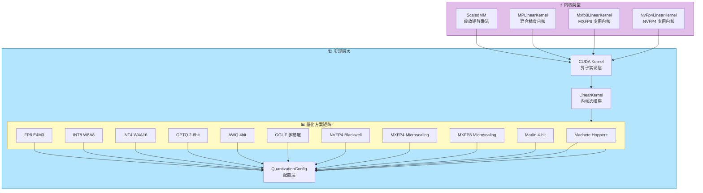
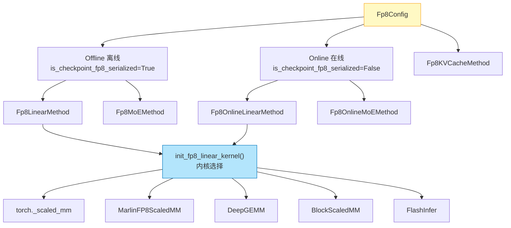
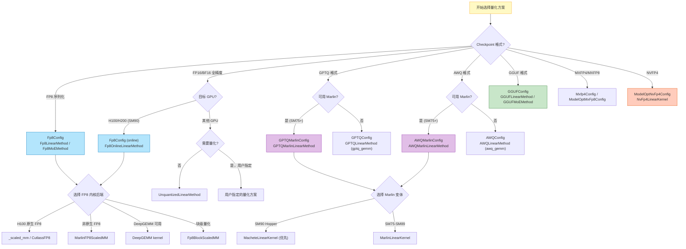
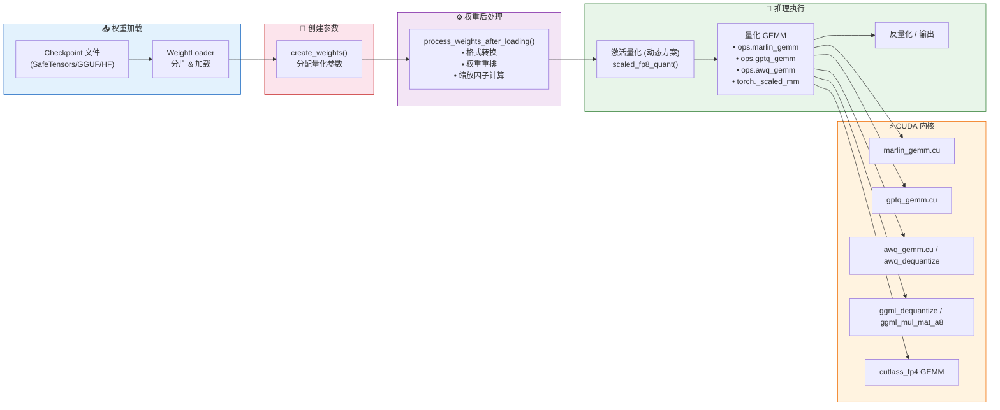

# vLLM 量化方案全面分析

> **定位**：vLLM 量化（Quantization）子系统的全面架构分析，涵盖从配置层到 CUDA 内核的完整技术栈。



---

## 目录

- [一、量化方案矩阵](#一量化方案矩阵)
- [二、FP8 量化](#二fp8-量化)
- [三、INT8 / INT4 量化（GPTQ / AWQ）](#三int8--int4-量化gptq--awq)
- [四、GGUF 格式](#四gguf-格式)
- [五、NVFP4 Blackwell 4-bit 浮点](#五nvfp4-blackwell-4-bit-浮点)
- [六、MXFP4 / MXFP8 块缩放浮点](#六mxfp4--mxfp8-块缩放浮点)
- [七、Marlin 高性能 4-bit 内核](#七marlin-高性能-4-bit-内核)
- [八、Machete 新一代量化内核](#八machete-新一代量化内核)
- [九、量化线性层与 GEMM 操作](#九量化线性层与gemm-操作)
- [十、量化配置体系](#十量化配置体系)
- [十一、量化方案选择决策树](#十一量化方案选择决策树)
- [十二、量化数据流全景](#十二量化数据流全景)

---

## 一、量化方案矩阵

vLLM 支持的量化方案覆盖了从浮点到整数的全谱系，下表为各方案的横向对比：

| 方案 | 权重精度 | 激活精度 | 用途/特点 | 最小 GPU 能力 | 配置类 | 关键文件 |
|------|---------|---------|-----------|-------------|--------|---------|
| **FP8** | float8_e4m3fn | BF16/FP16 (动态) | H100/H200 原生支持，在线/离线量化 | SM 75 (Turing) | `Fp8Config` | [fp8.py](../vllm/model_executor/layers/quantization/fp8.py) |
| **FP8 Per-Block** | float8_e4m3fn | 动态 128-block | DeepSeek 风格块级量化 | SM 75 | `Fp8Config` | [fp8.py:292-311](../vllm/model_executor/layers/quantization/fp8.py#L292-L311) |
| **MXFP8** | float8 + uint8 scale | BF16 | MicroScaling FP8，32 元素块缩放 | SM 80 | `ModelOptMxFp8Config` | [modelopt.py](../vllm/model_executor/layers/quantization/modelopt.py) |
| **GPTQ** | INT4/INT8 (packed int32) | FP16 | 训练后量化，支持 act-order | SM 60 | `GPTQConfig` | [gptq.py](../vllm/model_executor/layers/quantization/gptq.py) |
| **GPTQ-Marlin** | UINT4B8/UINT8B128 | FP16/BF16 | Marlin 加速的 GPTQ | SM 75 | `GPTQMarlinConfig` | [gptq_marlin.py](../vllm/model_executor/layers/quantization/gptq_marlin.py) |
| **AWQ** | UINT4 (packed int32) | FP16 | 激活感知量化 | SM 75 | `AWQConfig` | [awq.py](../vllm/model_executor/layers/quantization/awq.py) |
| **AWQ-Marlin** | UINT4 | FP16/BF16 | Marlin 加速的 AWQ | SM 75 | `AWQMarlinConfig` | [awq_marlin.py](../vllm/model_executor/layers/quantization/awq_marlin.py) |
| **GGUF** | Q2~Q8 (多精度) | FP16/BF16 | llama.cpp 兼容格式 | SM 60 | `GGUFConfig` | [gguf.py](../vllm/model_executor/layers/quantization/gguf.py) |
| **NVFP4** | float4_e2m1fn (uint8 packed) | FP8-E4M3 | Blackwell 架构原生 4-bit 浮点 | SM 100+ | `ModelOptNvFp4Config` | [modelopt.py](../vllm/model_executor/layers/quantization/modelopt.py), [nvfp4/base.py](../vllm/model_executor/kernels/linear/nvfp4/base.py) |
| **MXFP4** | uint8 (2×FP4/byte) | BF16 | MicroScaling FP4，MoE 专用 | SM 80 | `Mxfp4Config` | [mxfp4.py](../vllm/model_executor/layers/quantization/mxfp4.py) |
| **Marlin** | UINT4/UINT8/FP8 | FP16/INT8/FP8 | 高性能 4/8-bit GEMM 内核 | SM 75+ | — | [marlin_utils.py](../vllm/model_executor/layers/quantization/utils/marlin_utils.py) |
| **Machete** | UINT4/UINT8 | FP16/BF16 | Hopper (SM90) CUTLASS 内核 | SM 90 | — | [machete.py](../vllm/model_executor/kernels/linear/mixed_precision/machete.py), [machete_utils.py](../vllm/model_executor/layers/quantization/utils/machete_utils.py) |

### 在线量化（Online Quantization）

除上述离线量化方案外，vLLM 还支持**在线量化**——加载全精度 checkpoint 后在推理时动态量化：

```python
# config/quantization.py 中定义
class OnlineQuantScheme(Enum):
    FP8_PER_TENSOR = "fp8_per_tensor"           # FP8 per-tensor 缩放
    FP8_PER_BLOCK = "fp8_per_block"              # FP8 128×128 块缩放（DeepSeek 风格）
    INT8_PER_CHANNEL_WEIGHT_ONLY = "int8_per_channel_weight_only"  # MoE 专家权重 INT8
    MXFP8 = "mxfp8"                              # MicroScaling FP8
```

源码位置：[config/quantization.py:12-27](../vllm/config/quantization.py#L12-L27)

### 所有已注册量化方法

在 [__init__.py:12-47](../vllm/model_executor/layers/quantization/__init__.py#L12-L47) 中通过 `QuantizationMethods` Literal 类型统一注册：

```python
QuantizationMethods = Literal[
    "awq", "fp8", "fbgemm_fp8", "fp_quant", "modelopt",
    "modelopt_fp4", "modelopt_mxfp8", "modelopt_mixed",
    "gguf", "gptq_marlin", "awq_marlin", "gptq",
    "humming", "compressed-tensors", "bitsandbytes",
    "experts_int8", "quark", "moe_wna16", "torchao",
    "inc", "mxfp4", "gpt_oss_mxfp4", "deepseek_v4_fp8",
    "cpu_awq", "online",
    "fp8_per_tensor", "fp8_per_block",
    "int8_per_channel_weight_only", "mxfp8",
]
```

---

## 二、FP8 量化

### 2.1 架构概述

FP8 是 vLLM 中最重要的量化方案之一，充分利用 NVIDIA H100/H200 的原生 FP8 Tensor Core 支持。其核心设计围绕两个维度展开：

1. **离线 vs 在线**：是否以 FP8 格式存储 checkpoint
2. **激活策略**：static（静态）vs dynamic（动态）缩放



### 2.2 Fp8Config 核心配置

定义于 [fp8.py:97-225](../vllm/model_executor/layers/quantization/fp8.py#L97-L225)：

```python
class Fp8Config(QuantizationConfig):
    def __init__(
        self,
        is_checkpoint_fp8_serialized: bool = False,  # 是否为 FP8 序列化 checkpoint
        activation_scheme: str = "dynamic",            # "static" 或 "dynamic"
        ignored_layers: list[str] | None = None,       # 跳过量化的层
        weight_block_size: list[int] | None = None,     # 块级量化尺寸 [N, K]
    ) -> None:
```

关键属性说明：
- `is_checkpoint_fp8_serialized`：决定走 `Fp8LinearMethod`（离线）还是 `Fp8OnlineLinearMethod`（在线）
- `activation_scheme`：dynamic 模式下激活值每 token 动态计算缩放因子；static 模式使用预计算的固定缩放因子
- `weight_block_size`：当设置为 `[128, 128]` 时启用 DeepSeek V3/R1 风格的 128×128 块级量化

### 2.3 量化 Key 体系

FP8 的量化行为由 `QuantKey` 精确控制，定义于 [quant_utils.py:100-182](../vllm/model_executor/layers/quantization/utils/quant_utils.py#L100-L182)：

| QuantKey | 含义 | 使用场景 |
|----------|------|---------|
| `kFp8StaticTensorSym` | FP8 + 静态 per-tensor scale | 静态激活量化 |
| `kFp8DynamicTensorSym` | FP8 + 动态 per-tensor scale | 标准 dynamic 模式 |
| `kFp8DynamicTokenSym` | FP8 + 动态 per-token scale | Cutlass 支持时的高效模式 |
| `kFp8Dynamic128Sym` | FP8 + 动态 128-block scale | DeepSeek 块级量化（激活侧） |
| `kFp8Static128BlockSym` | FP8 + 静态 128×128 block scale | DeepSeek 块级量化（权重侧） |

### 2.4 离线 FP8 Linear 方法

[Fp8LinearMethod](../vllm/model_executor/layers/quantization/fp8.py#L258-L477) 的核心流程：

```python
class Fp8LinearMethod(LinearMethodBase):
    def create_weights(self, layer, ...):
        # 1. 创建 FP8 权重参数
        weight = create_fp8_weight_parameter(...)
        # 2. 创建权重量级缩放因子
        scale = create_fp8_scale_parameter(...)
        # 3. 初始化线性内核（自动选择最优后端）
        self.fp8_linear = init_fp8_linear_kernel(
            activation_quant_key=self.activation_quant_key,
            weight_quant_key=self.weight_quant_key,
            ...
        )

    def process_weights_after_loading(self, layer):
        # 处理融合模块（如 QKV）的多 shard 权重
        weight, weight_scale, input_scale = process_fp8_weight_tensor_strategy(
            weight, weight_scale, layer.logical_widths, ...
        )
        # 转置为 [K, N] 布局（scaled_mm 要求）
        weight = weight.t()
        # 交给选定的内核做后处理（如 Marlin 重排）
        self.fp8_linear.process_weights_after_loading(layer)

    def apply(self, layer, x, bias=None):
        if envs.VLLM_BATCH_INVARIANT:
            # batch invariant 模式：反量化到 BF16 再计算
            return self._bf16_fallback(layer, x, bias)
        if self.use_marlin:
            return self.fp8_linear.apply_weights(layer, x, bias)
        return self.fp8_linear.apply_weights(layer, x, bias)
```

### 2.5 在线 FP8 量化

[Fp8OnlineLinearMethod](../vllm/model_executor/layers/quantization/fp8.py#L482-L556) 的关键区别在于使用 **meta device** 延迟分配：

```python
class Fp8OnlineLinearMethod(Fp8LinearMethod):
    uses_meta_device: bool = True  # 标记：在 meta device 上创建权重

    def create_weights(self, layer, ...):
        # 权重在 meta device 上创建（不占实际显存）
        weight = ModelWeightParameter(
            data=torch.empty(..., device="meta", dtype=params_dtype),
            ...
        )
        initialize_online_processing(layer)

    def process_weights_after_loading(self, layer):
        # 加载完成后在线量化：BF16 → FP8
        qweight, weight_scale = ops.scaled_fp8_quant(layer.weight, scale=None)
        replace_parameter(layer, "weight", qweight.data)
        replace_parameter(layer, "weight_scale", weight_scale.data)
```

核心量化操作 `ops.scaled_fp8_quant` 将全精度权重动态转换为 FP8。

### 2.6 FP8 MoE 方法

[Fp8MoEMethod](../vllm/model_executor/layers/quantization/fp8.py#L559-L917) 和 [Fp8OnlineMoEMethod](../vllm/model_executor/layers/quantization/fp8.py#L922-L1043) 为 MoE 层提供 FP8 量化支持：

- 权重格式：`w13_weight`（gate_up 融合）和 `w2_weight`（down_proj），dtype 为 `float8_e4m3fn`
- 缩放因子：per-tensor（`w13_scale`, `w2_scale`）或 per-block（`w13_weight_scale_inv`）
- 后端选择：通过 `select_fp8_moe_backend()` 自动选择 FlashInfer/AITER/CUTLASS 等后端
- 权重重排：`convert_to_fp8_moe_kernel_format()` 将权重转换为各后端的运行时格式

### 2.7 MXFP8（MicroScaling FP8）

MXFP8 是 NVIDIA 推出的微缩放浮点格式，每 32 个元素共享一个 uint8 缩放因子。相关实现在 [modelopt.py](../vllm/model_executor/layers/quantization/modelopt.py) 和 [mxfp8/](../vllm/model_executor/kernels/linear/mxfp8/) 目录中。

支持的内核后端：
- `MarlinMxfp8LinearKernel` — Marlin 加速的 MXFP8
- `FlashInferCutlassMxfp8LinearKernel` — FlashInfer + CUTLASS
- `EmulationMxfp8LinearKernel` — 仿真模式（非 Blackwell 设备）

---

## 三、INT8 / INT4 量化（GPTQ / AWQ）

### 3.1 GPTQ 量化

[GPTQ](https://arxiv.org/abs/2210.17323) 是基于近似二阶信息的训练后量化方法。

#### GPTQConfig

定义于 [gptq.py:44-223](../vllm/model_executor/layers/quantization/gptq.py#L44-L223)：

```python
class GPTQConfig(QuantizationConfig):
    def __init__(
        self,
        weight_bits: int,          # 支持 2/3/4/8 bit
        group_size: int,           # 分组大小，-1 表示 per-channel
        desc_act: bool,            # 是否启用 activation ordering
        lm_head_quantized: bool,   # 是否量化 lm_head
        dynamic: dict,             # GPTQModel 的逐模块动态配置
        autoround_version: str="", # AutoRound 版本标识
        modules_in_block_to_quantize: list[str] | None = None,
        checkpoint_format: str="", # "gptq_v2" 或 ""
    ):
        self.pack_factor = Fraction(32, self.weight_bits)  # 打包因子
```

#### GPTQLinearMethod

[gptq.py:231-399](../vllm/model_executor/layers/quantization/gptq.py#L231-L399)：

```python
class GPTQLinearMethod(LinearMethodBase):
    def create_weights(self, layer, ...):
        # 量化权重：按行打包进 int32
        qweight = PackedvLLMParameter(
            data=torch.empty(
                input_size_per_partition // self.quant_config.pack_factor,
                output_size_per_partition,
                dtype=torch.int32,
            ),
            input_dim=0, output_dim=1,
            packed_dim=0,  # 沿输入维度打包
            packed_factor=self.quant_config.pack_factor,
        )
        # Activation order 索引
        g_idx = RowvLLMParameter(...)
        # 零点（打包）
        qzeros = PackedColumnParameter(...)
        # 缩放因子
        scales = ChannelQuantScaleParameter(...)  # or GroupQuantScaleParameter

    def process_weights_after_loading(self, layer):
        # Exllama shuffle：按 g_idx 重排权重
        if layer.exllama_state == ExllamaState.UNINITIALIZED:
            if self.quant_config.desc_act:
                layer.g_idx.data = torch.argsort(layer.g_idx).to(torch.int)
            ops.gptq_shuffle(layer.qweight, layer.g_idx, self.quant_config.weight_bits)

    def apply(self, layer, x, bias=None):
        output = ops.gptq_gemm(
            reshaped_x, layer.qweight, layer.qzeros,
            layer.scales, layer.g_idx,
            layer.exllama_state == ExllamaState.READY,
            self.use_v2_format,      # GPTQ v1/v2 格式差异
            self.quant_config.weight_bits,
        )
```

**GPTQ v1 vs v2 差异**：v2 格式对零点的处理方式不同，需要不同的 GEMM 内核。

#### GPTQ 动态配置

GPTQModel 引入的动态配置允许对模型的不同层使用不同量化参数：

```python
# gptq.py:61-83 中的示例
dynamic = {
    r"+:.*\.(?:1[0-5])\..*": {"bits": 8},         # 第 10-15 层用 8bit
    r"+:.*\.(?:1[6-9]|20|21)\..*": {"bits": 8, "group_size": 64},
    r"-:.*\.moe\..*": {},                            # 跳过所有 MoE 层
}
```

### 3.2 AWQ 量化

[AWQ (Activation-aware Weight Quantization)](https://arxiv.org/abs/2306.00978) 通过分析激活分布来保护重要权重。

#### AWQConfig

[awq.py:34-95](../vllm/model_executor/layers/quantization/awq.py#L34-L95)：

```python
class AWQConfig(QuantizationConfiguration):
    def __init__(self, weight_bits=4, group_size=128, zero_point=True,
                 modules_to_not_convert=None):
        # AWQ 固定为 4-bit
        assert self.weight_bits == 4
        self.pack_factor = 32 // self.weight_bits  # = 8
```

#### AWQLinearMethod

[awq.py:172-286](../vllm/model_executor/layers/quantization/awq.py#L172-L286)：

```python
class AWQLinearMethod(LinearMethodBase):
    def create_weights(self, layer, ...):
        # AWQ 沿输出维度打包（与 GPTQ 不同！）
        qweight = PackedvLLMParameter(
            data=torch.empty(
                input_size_per_partition,
                output_size_per_partition // self.quant_config.pack_factor,
                dtype=torch.int32,
            ),
            input_dim=0, output_dim=1,
            packed_dim=1,  # 沿输出维度打包（AWQ 特有）
            packed_factor=self.quant_config.pack_factor,
        )
        scales = GroupQuantScaleParameter(...)
        qzeros = PackedvLLMParameter(...)

    def apply(self, layer, x, bias=None):
        # 小 batch 启发式：直接反量化 + matmul
        if x.shape[:-1].numel() >= 256 or envs.VLLM_BATCH_INVARIANT:
            out = ops.awq_dequantize(qweight, scales, qzeros, 0, 0, 0)
            out = torch.matmul(reshaped_x, out)
        else:
            # 大 batch：使用优化的 AWQ GEMM kernel
            out = ops.awq_gemm(reshaped_x, qweight, scales, qzeros, pack_factor)
```

**AWQ vs GPTQ 打包方向对比**：
- GPTQ：`qweight` 形状 `[K//pack, N]`，沿输入维（dim 0）打包
- AWQ：`qweight` 形状 `[K, N//pack]`，沿输出维（dim 1）打包

### 3.3 AWQ → Marlin 格式转换

由于 AWQ 使用非标准的 bit 打包顺序，转换为 Marlin 格式需要特殊处理。

[awq_marlin.py:67-149](../vllm/model_executor/layers/quantization/awq_marlin.py#L67-L149) 定义了转换逻辑：

```python
_REVERSE_AWQ_PACK_ORDER = [0, 4, 1, 5, 2, 6, 3, 7]  # AWQ 特有的位排列

def _convert_awq_to_standard_format(layer, w_q_name, w_zp_name, size_bits):
    """将 AWQ 的非标准格式转换为 GPTQ-like 标准格式"""
    pack_factor = 32 // size_bits
    # 1. 解包 AWQ qweight，修复位顺序
    unpacked = (qw.unsqueeze(-1) >> shifts) & mask
    unpacked = unpacked[:, :, reverse_order]  # 修正 AWQ 位序
    # 2. 从沿输出维打包转为沿输入维打包
    new_qw = repack_along_input_dim(unpacked)
    # 3. 同样处理 qzeros
    new_qz = convert_and_repack_zeros(qz)
```

---

## 四、GGUF 格式

### 4.1 概述

GGUF 是 [llama.cpp](https://github.com/ggml-org/llama.cpp) 定义的单文件模型格式，支持多种量化精度。vLLM 通过 [gguf.py](../vllm/model_executor/layers/quantization/gguf.py) 提供完整的 GGUF 推理支持。

### 4.2 支持的量化类型

[gguf.py:166-198](../vllm/model_executor/layers/quantization/gguf.py#L166-L198)：

```python
UNQUANTIZED_TYPES = {WeightType.F32, WeightType.F16, WeightType.BF16}
STANDARD_QUANT_TYPES = {
    WeightType.Q4_0, WeightType.Q4_1,       # 标准 4-bit
    WeightType.Q5_0, WeightType.Q5_1,       # 标准 5-bit
    WeightType.Q8_0, WeightType.Q8_1,       # 标准 8-bit
}
KQUANT_TYPES = {                              # K-quantization（改进版）
    WeightType.Q2_K, WeightType.Q3_K,
    WeightType.Q4_K, WeightType.Q5_K, WeightType.Q6_K,
}
IMATRIX_QUANT_TYPES = {                        # I-Matrix 量化（重要性矩阵）
    WeightType.IQ1_M, WeightType.IQ1_S,
    WeightType.IQ2_XXS, WeightType.IQ2_XS, ...
}
```

### 4.3 GGUF GEMM 操作

[gguf.py:201-233](../vllm/model_executor/layers/quantization/gguf.py#L201-L233) 中的 `_fused_mul_mat_gguf` 实现了三级内核选择：

```python
def _fused_mul_mat_gguf(x, qweight, qweight_type):
    # 1. MMVQ（向量-矩阵量化乘法）：适合小 batch（batch_size <= 2~16）
    if x.shape[0] <= mmvq_safe and qweight_type in MMVQ_QUANT_TYPES:
        y = ops.ggml_mul_mat_vec_a8(qweight, x, qweight_type, ...)
    # 2. MMQ（矩阵-矩阵量化乘法）：标准批量推理
    elif qweight_type in MMQ_QUANT_TYPES:
        y = ops.ggml_mul_mat_a8(qweight, x, qweight_type, ...)
    # 3. 反量化回退：无专用 kernel 时先反量化再 matmul
    elif qweight_type in DEQUANT_TYPES:
        weight = ops.ggml_dequantize(qweight, qweight_type, ...)
        y = x @ weight.T
```

### 4.4 GGUF MoE 支持

[gguf.py:564-669](../vllm/model_executor/layers/quantization/gguf.py#L564-L669) 的 `GGUFMoEMethod`：

- 当两个权重都支持 MMQ 且 `x.shape[0] > 64` 时使用 fused MoE kernel（`ops.ggml_moe_a8`）
- 否则使用逐 expert 的向量 kernel（`ops.ggml_moe_a8_vec`）
- 最终回退到逐 token 逐 expert 的慢速路径

### 4.5 GGUF 工具函数

[gguf_utils.py](../vllm/transformers_utils/gguf_utils.py) 提供：
- `check_gguf_file()` — 检测文件是否为 GGUF 格式
- `is_remote_gguf()` — 检测远程 GGUF 模型（如 `repo_id:Q4_K_M` 格式）
- `is_valid_gguf_quant_type()` — 校验量化类型名称合法性

---

## 五、NVFP4 Blackwell 4-bit 浮点

### 5.1 概述

NVFP4 是 NVIDIA Blackwell 架构（SM100+，如 B200 GPU）引入的原生 4-bit 浮点格式 (`float4_e2m1fn`)，具有以下特征：

- **数据类型**：`float4_e2m1fn`，2 个 FP4 值打包在一个 `uint8` 中
- **缩放方式**：FP8-E4M3FN 格式的 block scale，默认 group size = 16
- **全局缩放**：额外的标量全局缩放因子用于权重和激活

### 5.2 数据结构

[nvfp4/base.py:10-19](../vllm/model_executor/kernels/linear/nvfp4/base.py#L10-L19)：

```python
@dataclass
class NvFp4LinearLayerConfig:
    """所有 NVFP4 层共享相同结构：
    - packed uint8 权重（每字节 2 个 FP4 值）
    - FP8-E4M3 per-block 权重缩放（group size 16）
    - 权重和激活的全局标量缩放
    """
    pass
```

### 5.3 量化 Key 定义

[quant_utils.py:138-146](../vllm/model_executor/layers/quantization/utils/quant_utils.py#L138-L146)：

```python
# 动态 NVFP4：激活侧动态计算 FP8 block scale
kNvfp4DynamicGroupScale = ScaleDesc(FP8_DTYPE, False, GroupShape(1, 16))
kNvfp4Dynamic = QuantKey(FP4_DTYPE, scale=kNvfp4DynamicGroupScale,
                         scale2=kStaticTensorScale)

# 静态 NVFP4：预计算的 FP8 block scale
kNvfp4StaticGroupScale = ScaleDesc(FP8_DTYPE, True, GroupShape(1, 16))
kNvfp4Static = QuantKey(FP4_DTYPE, scale=kNvfp4StaticGroupScale,
                        scale2=kStaticTensorScale)
```

### 5.4 NVFP4 内核后端

从 [linear/__init__.py:77-80](../vllm/model_executor/kernels/linear/__init__.py#L77-L80) 可见注册的后端：

| 内核类 | 文件 | 说明 |
|--------|------|------|
| `CutlassNvFp4LinearKernel` | [nvfp4/cutlass.py](../vllm/model_executor/kernels/linear/nvfp4/cutlass.py) | CUTLASS 实现（Blackwell 原生） |
| `MarlinNvFp4LinearKernel` | [nvfp4/marlin.py](../vllm/model_executor/kernels/linear/nvfp4/marlin.py) | Marlin 内核适配 |
| `FlashInferNvFp4LinearKernel` | [nvfp4/flashinfer.py](../vllm/model_executor/kernels/linear/nvfp4/flashinfer.py) | FlashInfer 后端 |
| `FBGemmNvFp4LinearKernel` | [nvfp4/fbgemm.py](../vllm/model_executor/kernels/linear/nvfp4/fbgemm.py) | FBGEMM（ROCm） |
| `EmulationNvFp4LinearKernel` | [nvfp4/emulation.py](../vllm/model_executor/kernels/linear/nvfp4/emulation.py) | 仿真模式（非 Blackwell） |

### 5.5 NVFP4 工具函数

[nvfp4_utils.py](../vllm/model_executor/layers/quantization/utils/nvfp4_utils.py) 提供关键工具：

```python
def swizzle_blockscale(scale: torch.Tensor) -> torch.Tensor:
    """Pad 并 block-interleave FP4 block-scale 以匹配 CUTLASS/FlashInfer 布局"""
    # reshape → permute → contiguos 匹配内核期望的数据排布

def pad_nvfp4_weight_for_cutlass(weight, alignment=32):
    """填充 NVFP4 权重以满足 CUTLASS 的 32 对齐要求"""

def cutlass_fp4_supported() -> bool:
    """检测当前设备是否支持 CUTLASS FP4"""
```

---

## 六、MXFP4 / MXFP8 块缩放浮点

### 6.1 MXFP4（MicroScaling FP4）

MXFP4 是面向 MoE 模型的 4-bit 微缩放浮点格式，主要服务于 GPT-OSS 和 DeepSeek-V4 等模型。

[mxfp4.py:42-101](../vllm/model_executor/layers/quantization/mxfp4.py#L42-L101)：

```python
class Mxfp4Config(QuantizationConfig):
    @classmethod
    def get_min_capability(cls) -> int:
        return 80  # 需要 Ampere (SM80) 及以上

    @classmethod
    def get_supported_act_dtypes(cls) -> list[torch.dtype]:
        return [torch.bfloat16]

    def get_quant_method(self, layer, prefix):
        if isinstance(layer, LinearBase):
            # Linear 层暂未实现 MXFP4，回退到 Unquantized
            return UnquantizedLinearMethod()
        elif isinstance(layer, FusedMoE):
            return GptOssMxfp4MoEMethod(layer.moe_config)
```

**MXFP4 权重布局**：
- `w13_weight`：形状 `[num_experts, 2*intermediate, hidden//2]`，dtype `uint8`
- 每 2 个 FP4 值打包在 1 个字节中
- `w13_weight_scale`：形状 `[num_experts, 2*intermediate, hidden//32]`，block size = 32

**MXFP4 后端选择**（通过 `select_mxfp4_moe_backend()`）：
- `AITER_MXFP4_BF16` — AITER 后端
- `FLASHINFER_TRTLLM_MXFP4_MXFP8` — FlashInfer TRTLLM（支持 padding skip）
- `TRITON_MXFP4_BF16` — Triton kernel

### 6.2 MXFP8（MicroScaling FP8）

MXFP8 每 32 个元素共享一个 `uint8` 缩放因子，是 DeepSeek-V3 等模型的关键量化技术。

量化 Key 定义于 [quant_utils.py:154-158](../vllm/model_executor/layers/quantization/utils/quant_utils.py#L154-L158)：

```python
kMxfp8StaticScale = ScaleDesc(torch.uint8, True, GroupShape(1, 32))
kMxfp8Static = QuantKey(FP8_DTYPE, kMxfp8StaticScale, symmetric=True)
kMxfp8DynamicScale = ScaleDesc(torch.uint8, False, GroupShape(1, 32))
kMxfp8Dynamic = QuantKey(FP8_DTYPE, kMxfp8DynamicScale, symmetric=True)
```

MXFP8 专用内核位于 [kernels/linear/mxfp8/](../vllm/model_executor/kernels/linear/mxfp8/) 目录：
- `MarlinMxfp8LinearKernel` — Marlin 加速
- `FlashInferCutlassMxfp8LinearKernel` — FlashInfer + CUTLASS
- `EmulationMxfp8LinearKernel` — 仿真回退

---

## 七、Marlin 高性能 4-bit 内核

### 7.1 概述

[Marlin](https://github.com/risomalik/marlin) 是专为 4-bit 权重量化设计的超高性能 GEMM 内核，vLLM 将其作为 GPTQ/AWQ/FP8 的首选加速后端。

### 7.2 支持的量化类型

[marlin_utils.py:41-79](../vllm/model_executor/layers/quantization/utils/marlin_utils.py#L41-L79)：

```python
def query_marlin_supported_quant_types(has_zp=None, include_fp_type=True, ...):
    """
    has_zp=True  (AWQ 风格):   [scalar_types.uint4]
    has_zp=False (GPTQ 风格):  [uint4b8, uint8b128] (+ FP8 types if include_fp_type)
    """
```

**完整支持列表**：
- 整数型：`uint4` (AWQ)、`uint4b8` (GPTQ 4-bit)、`uint8b128` (GPTQ 8-bit)
- 浮点型：`float8_e4m3fn` (FP8 权重)、`float4_e2m1f` (FP4 权重)

### 7.3 Marlin 约束条件

[marlin_utils.py:25-35](../vllm/model_executor/layers/quantization/utils/marlin_utils.py#L25-L35)：

```python
GPTQ_MARLIN_TILE = 16           # Marlin tile 尺寸
GPTQ_MARLIN_MIN_THREAD_N = 64    # 输出维度最小线程数
GPTQ_MARLIN_MIN_THREAD_K = 128   # 输入维度最小线程数
MARLIN_SUPPORTED_GROUP_SIZES = [-1, 32, 64, 128]  # 支持的分组大小
```

形状约束验证函数 `verify_marlin_supports_shape()` 检查：
- `output_size % 64 == 0`
- `input_size % 128 == 0`
- 如果 `group_size < input_size`：`input_size % group_size == 0`

### 7.4 Marlin 权重预处理

Marlin 内核要求权重经过特殊的重排（reordering）和置换（permutation）：

```python
# marlin_utils.py:292-312 — scale permutation
def marlin_permute_scales(s, size_k, size_n, group_size, is_a_8bit=False):
    scale_perm, scale_perm_single = get_scale_perms()
    # group quant: 使用 8×8 full permutation
    # channel quant: 使用 4×8 single permutation
    s = s.reshape((-1, len(scale_perm)))[:, scale_perm]
    return s.reshape((-1, size_n)).contiguous()

# marlin_utils.py:344-365 — zero-point permutation
def marlin_zero_points(zp, size_k, size_n, num_bits, is_a_8bit=False):
    # 1. 应用 scale permutation
    # 2. interleave 列维度
    # 3. pack 到 int32
```

### 7.5 Marlin Workspace

[marlin_utils.py:257-265](../vllm/model_executor/layers/quantization/utils/marlin_utils.py#L257-L265)：

```python
def marlin_make_workspace_new(device, max_blocks_per_sm=1):
    """创建 Marlin workspace tensor
    大小 = SM 数量 × max_blocks_per_sm
    用于原子操作的同步
    """
    sms = num_compute_units(device.index)
    return torch.zeros(sms * max_blocks_per_sm, dtype=torch.int, device=device)
```

### 7.6 Marlin GEMM 调用

[marlin_utils.py:506-570](../vllm/model_executor/layers/quantization/utils/marlin_utils.py#L506-L570)：

```python
def apply_gptq_marlin_linear(input, weight, weight_scale, weight_zp,
                               g_idx, g_idx_sort_indices, workspace,
                               wtype, ..., input_dtype=None):
    # 可选：W4A8 输入量化
    if input_dtype == torch.int8:
        reshaped_x, a_scales = marlin_quant_input(reshaped_x, torch.int8)
    elif input_dtype == torch.float8_e4m3fn:
        reshaped_x, a_scales = marlin_quant_input(reshaped_x, torch.float8_e4m3fn)

    output = ops.marlin_gemm(
        reshaped_x, None, weight, bias,
        weight_scale, a_scales, None,
        weight_zp, g_idx, g_idx_sort_indices, workspace,
        wtype, size_m=..., size_n=..., size_k=...,
        is_k_full=..., use_atomic_add=..., use_fp32_reduce=...,
    )
```

### 7.7 W4A8 扩展：INT8 / FP8 激活量化

Marlin 不仅支持 W4A16，还扩展支持低精度激活：

```python
# marlin_utils.py:474-493
def get_marlin_input_dtype(prefix=None):
    """通过环境变量 VLLM_MARLIN_INPUT_DTYPE 控制：
    - None: 标准 W4A16
    - "int8": W4A8-INT8（需 SM75+）
    - "fp8": W4A8-FP8（仅 SM89 H20 或 SM120 Blackwell）
    """
```

---

## 八、Machete 新一代量化内核

### 8.1 概述

Machete 是基于 CUTLASS 的新一代量化 GEMM 内核，专门针对 NVIDIA Hopper (SM90) 架构优化，提供比 Marlin 更高的吞吐量。

### 8.2 Machete 约束

[machete_utils.py:9-56](../vllm/model_executor/layers/quantization/utils/machete_utils.py#L9-L56)：

```python
MACHETE_PREPACKED_BLOCK_SHAPE = [64, 128]  # 预打包块形状

def query_machete_supported_quant_types(zero_points):
    if zero_points:
        return [scalar_types.uint4, scalar_types.uint8]
    else:
        return [scalar_types.uint4b8, scalar_types.uint8b128]

def query_machete_supported_group_sizes(act_type):
    if act_type in [torch.float16, torch.bfloat16]:
        return [-1, 64, 128]   # 支持 channel-wise / 64 / 128
    else:
        return [-1, 128]

def check_machete_supports_shape(in_features, out_features):
    # in_features % 64 == 0
    # out_features % 128 == 0
```

### 8.3 MacheteLinearKernel

[mixed_precision/machete.py:24-80](../vllm/model_executor/kernels/linear/mixed_precision/machete.py#L24-L80)：

```python
class MacheteLinearKernel(MPLinearKernel):
    @classmethod
    def get_min_capability(cls) -> int:
        return 90  # 仅支持 Hopper (SM90)

    @classmethod
    def can_implement(cls, c: MPLinearLayerConfig):
        # 1. 必须是 CUDA 平台
        # 2. 必须是 SM90
        # 3. 不支持 act_order + TP 分区
        # 4. 量化类型必须在支持列表中
        # 5. group_size 必须在支持列表中
        # 6. 形状必须满足 64/128 对齐
```

### 8.4 Marlin vs Machete 对比

| 特性 | Marlin | Machete |
|------|--------|---------|
| 最低架构 | SM 75 (Turing) | SM 90 (Hopper) |
| 底层实现 | 自定义 CUDA | CUTLASS |
| 对齐要求 | N%64, K%128 | N%128, K%64 |
| 支持 ZP | ✅ (uint4) | ✅ (uint4, uint8) |
| Act Order | ✅ | ❌ (TP 分区时) |
| FP8 权重 | ✅ | ❌ |
| W4A8 | ✅ (INT8/FP8) | ❌ |
| 典型场景 | 通用 4-bit 推理 | Hopper 高吞吐 |

---

## 九、量化线性层与 GEMM 操作

### 9.1 内核选择体系

vLLM 的量化 GEMM 内核采用分层选择架构，定义于 [kernels/linear/](../vllm/model_executor/kernels/linear/) 目录：

```mermaid
graph TB
    INIT["init_fp8_linear_kernel()"] --> SS["ScaledMM 子系统"]
    INIT --> INIT_NVFP4["init_nvfp4_linear_kernel()"]
    INIT --> INIT_MXFP8["init_mxfp8_linear_kernel()"]

    SS --> PY["PyTorch _scaled_mm"]
    SS --> CU["CutlassFP8ScaledMM"]
    SS --> FI["FlashInferFP8"]
    SS --> MR["MarlinFP8ScaledMM"]
    SS --> BS["Fp8BlockScaledMM"]
    SS --> DG["DeepGEMM"]
    SS --> AI["AiterInt8"]
    SS --> TR["TritonInt8"]
    SS --> ROCm["ROCmFP8"]
    SS --> CPU["CPUFp8BlockScaled"]

    MP["choose_mp_linear_kernel()"] --> ML["MarlinLinearKernel"]
    MP --> MC["MacheteLinearKernel"]
    MP --> EX["ExllamaLinearKernel"]
    MP --> CO["ConchLinearKernel"]
    MP --> AS["AllSparkLinearKernel"]
    MP --> CU_W4["CutlassW4A8LinearKernel"]
    MP --> DY4["Dynamic4bitLinearKernel"]
    MP --> TR4["TritonW4A16LinearKernel"]
    MP --> CPU_WNA["CPUWNA16LinearKernel"]

    style INIT fill:#fff9c4,stroke:#f9a825
    style SS fill:#b3e5fc,stroke:#0277bd
    style MP fill:#e1bee7,stroke:#8e24aa
```



### 9.2 ScaledMM 内核层次

[scaled_mm/__init__.py](../vllm/model_executor/kernels/linear/scaled_mm/__init__.py) 注册了以下 FP8/INT8 缩放矩阵乘法内核：

| 内核类 | 精度 | 后端 | 条件 |
|--------|------|------|------|
| `PerTensorTorchFP8ScaledMMLinearKernel` | W8A8 | PyTorch native | 通用 fallback |
| `ChannelWiseTorchFP8ScaledMMLinearKernel` | W8A8 | PyTorch native | per-channel |
| `RowWiseTorchFP8ScaledMMLinearKernel` | W8A8 | PyTorch native | per-row |
| `CutlassFP8ScaledMMLinearKernel` | W8A8 | CUTLASS | Ampere+ CUDA |
| `CutlassInt8ScaledMMLinearKernel` | W8A8 | CUTLASS | Ampere+ CUDA |
| `FlashInferFP8ScaledMMLinearKernel` | W8A8 | FlashInfer | Hopper+ |
| `MarlinFP8ScaledMMLinearKernel` | W8A8 | Marlin | Turing+, 非 FP8 原生设备 |
| `Fp8BlockScaledMMLinearKernel` | W8A8 Block | CUTLASS | 块级缩放 |
| `ROCmFP8ScaledMMLinearKernel` | W8A8 | ROCm | AMD GPU |
| `AiterInt8ScaledMMLinearKernel` | W8A8 | AITER | 华为昇腾 |
| `TritonInt8ScaledMMLinearKernel` | W8A8 | Triton | 通用 |
| `CPUFp8BlockScaledKernel` | W8A8 | CPU | CPU 推理 |

### 9.3 Mixed Precision 内核层次

[mixed_precision/](../vllm/model_executor/kernels/linear/mixed_precision/) 目录包含整数量化内核：

| 内核类 | 精度 | 后端 | 说明 |
|--------|------|------|------|
| `MarlinLinearKernel` | W4A16/W8A16 | Marlin CUDA | 主要 4/8-bit 内核 |
| `MacheteLinearKernel` | W4A16/W8A16 | CUTLASS | SM90 优化 |
| `ExllamaLinearKernel` | W4A16 | Exllama | GPTQ 原生格式 |
| `ConchLinearKernel` | W4A16/W8A16 | Conch | DeepSeek 内核 |
| `AllSparkLinearKernel` | W4A16 | AllSpark | 通义千问 |
| `CutlassW4A8LinearKernel` | W4A8 | CUTLASS | W4A8 精度 |
| `Dynamic4bitLinearKernel` | W4A16 | Dynamic | 动态 4-bit |
| `TritonW4A16LinearKernel` | W4A16 | Triton | 可移植 |
| `CPUWNA16LinearKernel` | W4A16 | CPU | CPU 推理 |

---

## 十、量化配置体系

### 10.1 基类层次

```
QuantizationConfig (ABC)          # base_config.py:70
├── get_name() → QuantizationMethods
├── get_supported_act_dtypes() → list[dtype]
├── get_min_capability() → int     # 最低 GPU compute capability
├── get_config_filenames() → list[str]
├── from_config(dict) → Self
└── get_quant_method(layer, prefix) → QuantizeMethodBase | None

QuantizeMethodBase (ABC)          # base_config.py:19
├── create_weights(layer, ...)    # 创建量化参数
├── apply(layer, x, bias) → Tensor # 前向计算
├── embedding(layer, x) → Tensor  # Embedding 查找（可选）
└── process_weights_after_loading(layer)  # 权重后处理（可选）
```

源码位置：[base_config.py](../vllm/model_executor/layers/quantization/base_config.py)

### 10.2 配置类清单

| 配置类 | 方法名 | 权重位数 | 最低能力 | 文件 |
|--------|--------|---------|---------|------|
| `Fp8Config` | fp8 | 8-bit float | SM 75 | [fp8.py](../vllm/model_executor/layers/quantization/fp8.py) |
| `GPTQConfig` | gptq | 2/3/4/8-bit int | SM 60 | [gptq.py](../vllm/model_executor/layers/quantization/gptq.py) |
| `GPTQMarlinConfig` | gptq_marlin | 4/8-bit int | SM 75 | [gptq_marlin.py](../vllm/model_executor/layers/quantization/gptq_marlin.py) |
| `AWQConfig` | awq | 4-bit int | SM 75 | [awq.py](../vllm/model_executor/layers/quantization/awq.py) |
| `AWQMarlinConfig` | awq_marlin | 4-bit int | SM 75 | [awq_marlin.py](../vllm/model_executor/layers/quantization/awq_marlin.py) |
| `GGUFConfig` | gguf | 多精度 | SM 60 | [gguf.py](../vllm/model_executor/layers/quantization/gguf.py) |
| `ModelOptFp8Config` | modelopt | 8-bit float | SM 75 | [modelopt.py](../vllm/model_executor/layers/quantization/modelopt.py) |
| `ModelOptNvFp4Config` | modelopt_fp4 | 4-bit float | SM 100 | [modelopt.py](../vllm/model_executor/layers/quantization/modelopt.py) |
| `ModelOptMxFp8Config` | modelopt_mxfp8 | 8-bit float + uint8 scale | SM 80 | [modelopt.py](../vllm/model_executor/layers/quantization/modelopt.py) |
| `Mxfp4Config` | mxfp4 | 4-bit float (uint8) | SM 80 | [mxfp4.py](../vllm/model_executor/layers/quantization/mxfp4.py) |
| `BitsAndBytesConfig` | bitsandbytes | 多精度 | — | [bitsandbytes.py](../vllm/model_executor/layers/quantization/bitsandbytes.py) |
| `CompressedTensorsConfig` | compressed-tensors | 多精度 | — | [compressed_tensors/](../vllm/model_executor/layers/quantization/compressed_tensors/) |
| `INCConfig` | inc / auto-round | 多精度 | — | [inc.py](../vllm/model_executor/layers/quantization/inc.py) |
| `TorchAOConfig` | torchao | 多精度 | — | [torchao.py](../vllm/model_executor/layers/quantization/torchao.py) |
| `HummingConfig` | humming | 多精度 | — | [humming.py](../vllm/model_executor/layers/quantization/humming.py) |
| `ExpertsInt8Config` | experts_int8 | 8-bit int | — | [experts_int8.py](../vllm/model_executor/layers/quantization/experts_int8.py) |
| `OnlineQuantizationConfig` | online | 动态 | — | [online/](../vllm/model_executor/layers/quantization/online/) |

### 10.3 参数类型体系

vLLM 定义了丰富的参数类型来描述不同量化格式的权重布局：

| 参数类型 | 用途 | 来源 |
|----------|------|------|
| `ModelWeightParameter` | 全精度权重 | [parameter.py](../vllm/model_executor/parameter.py) |
| `PerTensorScaleParameter` | Per-tensor 缩放因子 | [parameter.py](../vllm/model_executor/parameter.py) |
| `BlockQuantScaleParameter` | Block 量化缩放因子 | [parameter.py](../vllm/model_executor/parameter.py) |
| `ChannelQuantScaleParameter` | Per-channel 缩放因子 | [parameter.py](../vllm/model_executor/parameter.py) |
| `GroupQuantScaleParameter` | Per-group 缩放因子 | [parameter.py](../vllm/model_executor/parameter.py) |
| `PackedvLLMParameter` | 打包的量化权重（int32） | [parameter.py](../vllm/model_executor/parameter.py) |
| `PackedColumnParameter` | 沿列打包的零点 | [parameter.py](../vllm/model_executor/parameter.py) |
| `RowvLLMParameter` | 行索引参数（g_idx） | [parameter.py](../vllm/model_executor/parameter.py) |
| `GGUFUninitializedParameter` | GGUF 延迟初始化参数 | [gguf.py:689-691](../vllm/model_executor/layers/quantization/gguf.py#L689-L691) |

### 10.4 自动格式检测与覆盖

部分配置类实现了 `override_quantization_method()` 来自动检测 checkpoint 格式并推荐最优内核：

```python
# gptq_marlin.py:220-245 — 自动升级 GPTQ → GPTQ-Marlin
@classmethod
def override_quantization_method(cls, hf_quant_cfg, user_quant, hf_config=None):
    can_convert = cls.is_gptq_marlin_compatible(hf_quant_cfg)
    if can_convert and user_quant in (None, "marlin", "gptq_marlin"):
        return "gptq_marlin"  # 自动切换到更快的 Marlin 内核

# awq_marlin.py:233-262 — 自动升级 AWQ → AWQ-Marlin
@classmethod
def override_quantization_method(cls, hf_quant_cfg, user_quant, hf_config=None):
    can_convert = cls.is_awq_marlin_compatible(hf_quant_cfg)
    if can_convert and user_quant in (None, "marlin", "awq_marlin"):
        return "awq_marlin"

# gguf.py:86-93 — 强制 GGUF 格式
@classmethod
def override_quantization_method(cls, hf_quant_cfg, user_quant, hf_config=None):
    if user_quant == "gguf":
        return "gguf"  # 覆盖 HF config 中的其他量化设置
```

---

## 十一、量化方案选择决策树



---

## 十二、量化数据流全景



### 典型数据流示例

#### 示例 1：FP8 在线量化（DeepSeek 风格）

```
BF16 Checkpoint
    ↓ [WeightLoader: 加载到 meta device]
    ↓ [Fp8OnlineLinearMethod.create_weights(): 创建 FP8 参数]
    ↓ [Fp8OnlineLinearMethod.process_weights_after_loading():
        ops.scaled_fp8_quant(weight) → (qweight: FP8, scale: FP32)
        weight.t() → [K, N] 布局
    ]
    ↓ [推理时每个 token:]
    ↓ [动态计算激活 scale]
    ↓ [torch._scaled_mm(x_fp8, w_fp8, x_scale, w_scale) → output]
```

#### 示例 2：GPTQ-Marlin 4-bit 量化

```
GPTQ Checkpoint (int32 packed weights)
    ↓ [GPTQMarlinLinearMethod.create_weights():
        qweight: [K//8, N] int32 (packed uint4)
        scales: [K//gs, N] fp16
        qzeros: [K//gs, N//8] int32 (packed)
        g_idx: [K] int32
    ]
    ↓ [process_weights_after_loading():
        g_idx sorting & argsort
        ops.gptq_shuffle(qweight, g_idx, 4)
        marlin_permute_scales(scales)
        marlin_zero_points(qzeros)
        marlin_make_workspace_new(device)
    ]
    ↓ [推理时:]
    ↓ [ops.marlin_gemm(x, qweight, scales, zeros, g_idx, ...)]
```

#### 示例 3：GGUF Q4_K_M 量化

```
GGUF File (.gguf)
    ↓ [gguf_utils.py: 加载元数据 + 权重]
    ↓ [GGUFLinearMethod.create_weights():
        qweight: GGUFUninitializedParameter (延迟初始化)
        qweight_type: WeightType.Q4_K (uint8 标识)
    ]
    ↓ [process_weights_after_loading():
        检查量化类型有效性
        为融合层 (QKV/gate_up) 创建 padded weight
    ]
    ↓ [推理时 (_fused_mul_mat_gguf):]
    ↓ [batch_size ≤ threshold?]
    ↓   Yes → ops.ggml_mul_mat_vec_a8()  [MMVQ 向量 kernel]
    ↓   No  → ops.ggml_mul_mat_a8()     [MMQ 矩阵 kernel]
    ↓   No kernel → ops.ggml_dequantize() + matmul  [反量化回退]
```

---

## 附录：关键源码路径索引

| 类别 | 路径 | 说明 |
|------|------|------|
| 量化配置入口 | [config/quantization.py](../vllm/config/quantization.py) | OnlineQuantScheme, resolve_online_quant_config |
| 量化方法注册 | [layers/quantization/__init__.py](../vllm/model_executor/layers/quantization/__init__.py) | QuantizationMethods, get_quantization_config |
| 基类定义 | [layers/quantization/base_config.py](../vllm/model_executor/layers/quantization/base_config.py) | QuantizationConfig, QuantizeMethodBase |
| Schema 定义 | [layers/quantization/schema.py](../vllm/model_executor/layers/quantization/schema.py) | KVCacheQuantSchema |
| FP8 量化 | [layers/quantization/fp8.py](../vllm/model_executor/layers/quantization/fp8.py) | Fp8Config, Fp8LinearMethod, Fp8MoEMethod |
| GPTQ 量化 | [layers/quantization/gptq.py](../vllm/model_executor/layers/quantization/gptq.py) | GPTQConfig, GPTQLinearMethod |
| GPTQ-Marlin | [layers/quantization/gptq_marlin.py](../vllm/model_executor/layers/quantization/gptq_marlin.py) | GPTQMarlinConfig, GPTQMarlinLinearMethod |
| AWQ 量化 | [layers/quantization/awq.py](../vllm/model_executor/layers/quantization/awq.py) | AWQConfig, AWQLinearMethod |
| AWQ-Marlin | [layers/quantization/awq_marlin.py](../vllm/model_executor/layers/quantization/awq_marlin.py) | AWQMarlinConfig, AWQMarlinLinearMethod |
| GGUF 量化 | [layers/quantization/gguf.py](../vllm/model_executor/layers/quantization/gguf.py) | GGUFConfig, GGUFLinearMethod, GGUFMoEMethod |
| GGUF 工具 | [transformers_utils/gguf_utils.py](../vllm/transformers_utils/gguf_utils.py) | GGUF 文件检测与解析 |
| MXFP4 量化 | [layers/quantization/mxfp4.py](../vllm/model_executor/layers/quantization/mxfp4.py) | Mxfp4Config, GptOssMxfp4MoEMethod |
| ModelOpt 系列 | [layers/quantization/modelopt.py](../vllm/model_executor/layers/quantization/modelopt.py) | ModelOptFp8/NvFp4/MxFp8/Mixed Configs |
| Marlin 工具 | [layers/quantization/utils/marlin_utils.py](../vllm/model_executor/layers/quantization/utils/marlin_utils.py) | Marlin 格式转换、shape 验证、workspace |
| Machete 工具 | [layers/quantization/utils/machete_utils.py](../vllm/model_executor/layers/quantization/utils/machete_utils.py) | Machete 约束查询 |
| NVFP4 工具 | [layers/quantization/utils/nvfp4_utils.py](../vllm/model_executor/layers/quantization/utils/nvfp4_utils.py) | NVFP4 swizzle/pad 工具 |
| 量化工具集 | [layers/quantization/utils/quant_utils.py](../vllm/model_executor/layers/quantization/utils/quant_utils.py) | QuantKey, GroupShape, scaled_quantize, pack/unpack |
| FP8 工具 | [layers/quantization/utils/fp8_utils.py](../vllm/model_executor/layers/quantization/utils/fp8_utils.py) | FP8 参数创建与处理 |
| Linear 内核总入口 | [kernels/linear/__init__.py](../vllm/model_executor/kernels/linear/__init__.py) | 所有 linear kernel 的统一导出 |
| ScaledMM 内核 | [kernels/linear/scaled_mm/](../vllm/model_executor/kernels/linear/scaled_mm/) | FP8/INT8 缩放矩阵乘法内核族 |
| Mixed Precision 内核 | [kernels/linear/mixed_precision/](../vllm/model_executor/kernels/linear/mixed_precision/) | 整数量化内核族 (Marlin/Machete/Exllama...) |
| MXFP8 内核 | [kernels/linear/mxfp8/](../vllm/model_executor/kernels/linear/mxfp8/) | MXFP8 专用内核 |
| NVFP4 内核 | [kernels/linear/nvfp4/](../vllm/model_executor/kernels/linear/nvfp4/) | NVFP4 专用内核 |
| 在线量化 | [layers/quantization/online/](../vllm/model_executor/layers/quantization/online/) | Online Quantization 实现 |
