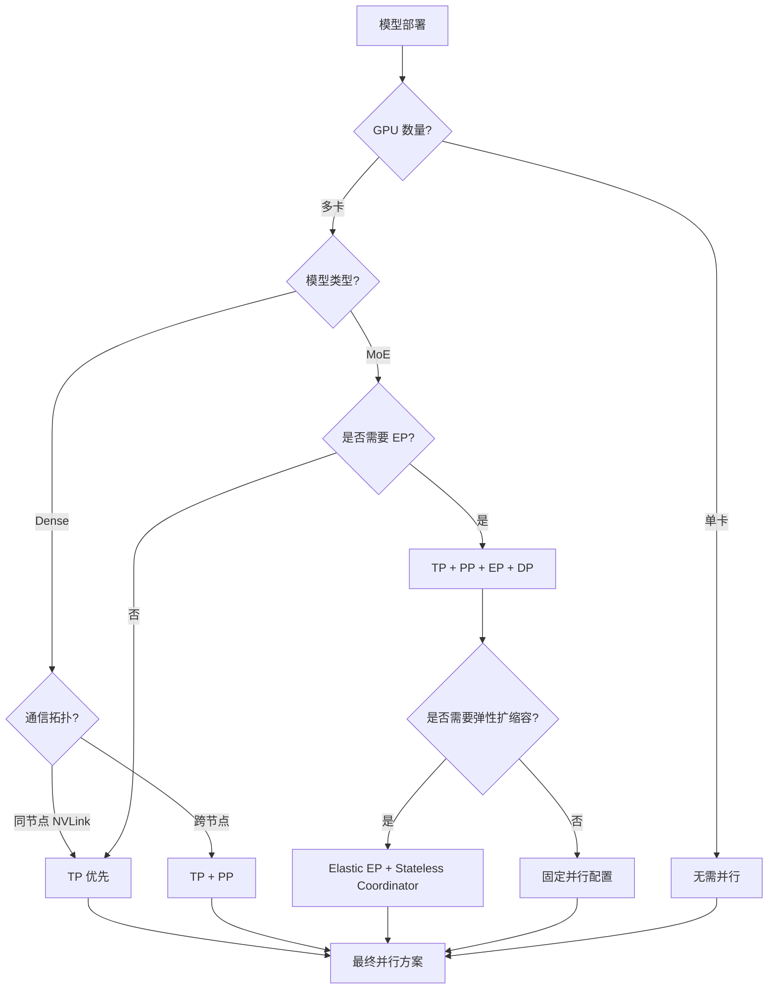
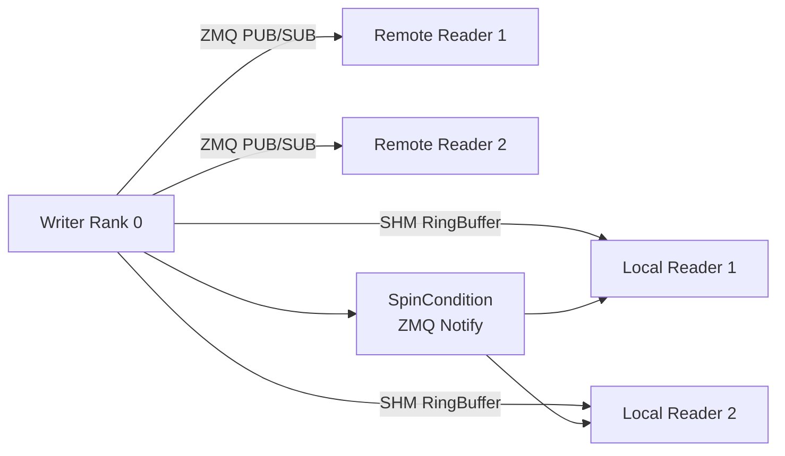
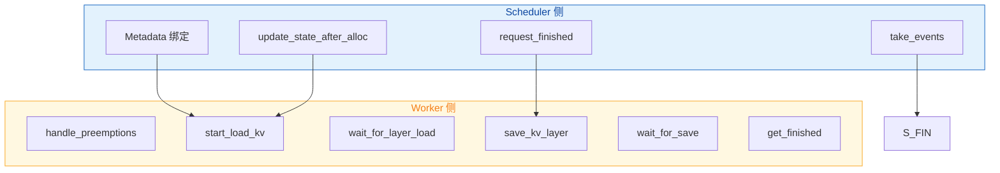
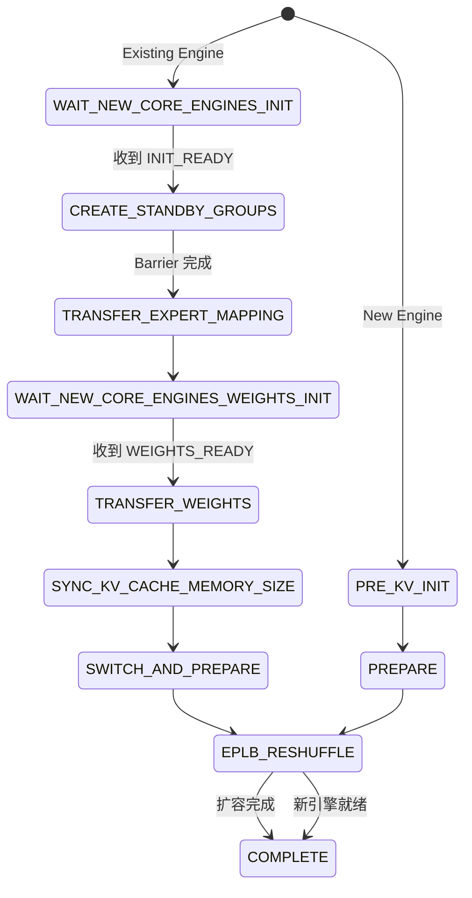
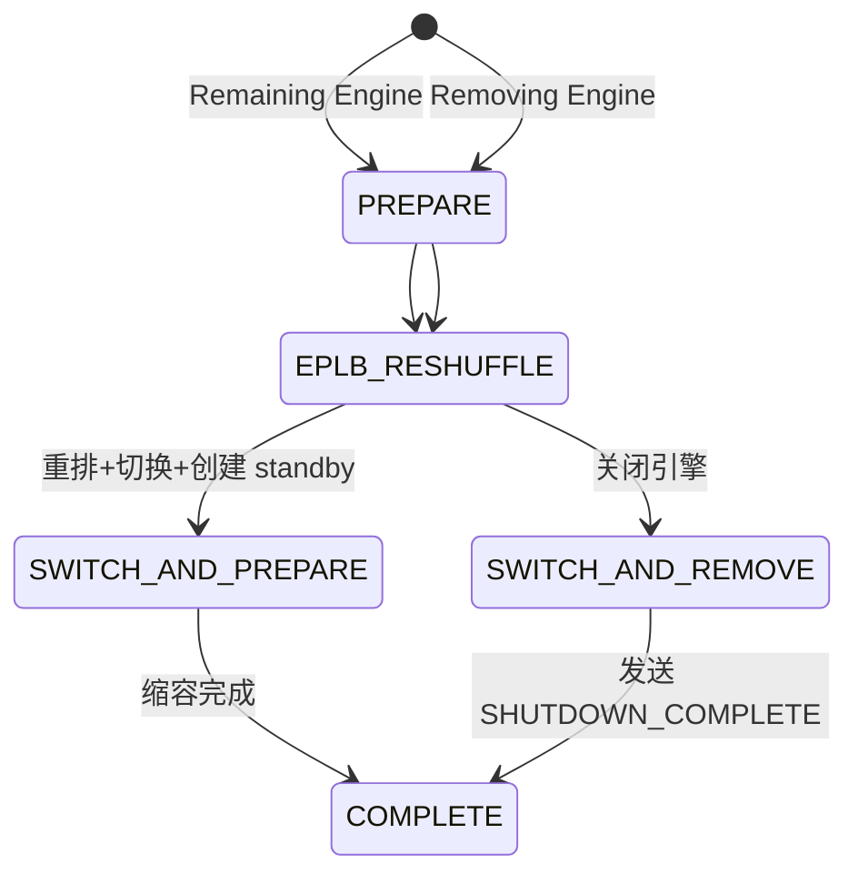
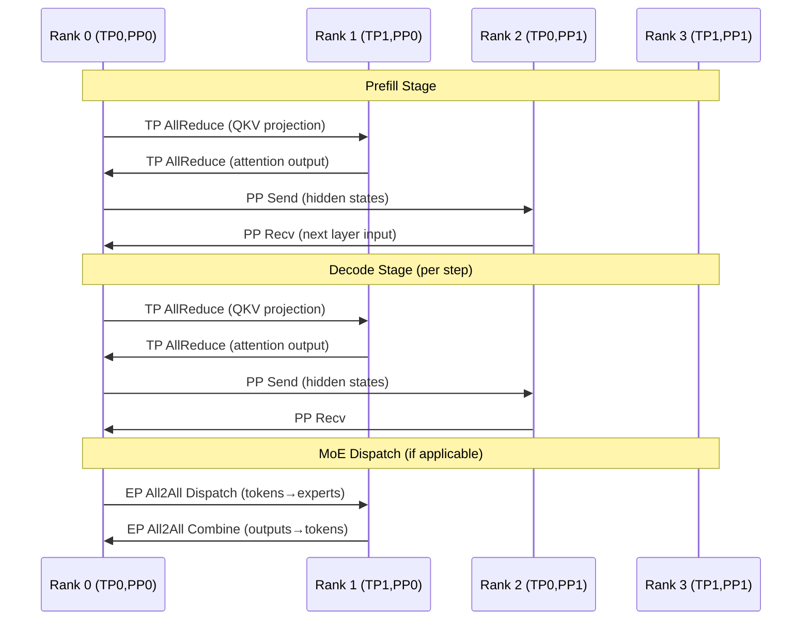
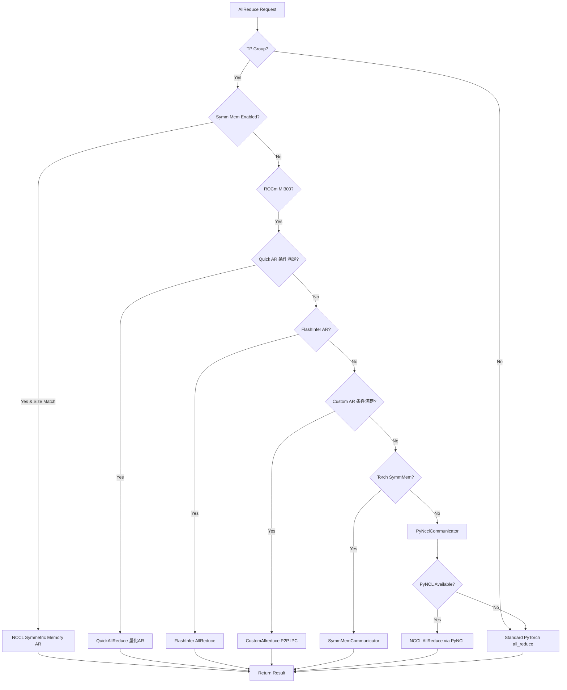

# vLLM 分布式计算分析

> **定位**：本文档深入分析 vLLM 分布式计算架构，涵盖并行策略、状态管理、通信原语、数据传输机制及高级弹性特性。

```mermaid
graph TB
    subgraph PS["并行策略 Parallel Strategies"]
        TP["Tensor Parallelism<br/>张量并行"]
        PP["Pipeline Parallelism<br/>流水线并行"]
        DP["Data Parallelism<br/>数据并行"]
        EP["Expert Parallelism<br/>专家并行 MoE"]
    end

    subgraph SM["并行状态管理 State Management"]
        GC["GroupCoordinator<br/>通信组协调器"]
        PG["ProcessGroup<br/>NCCL / Gloo 通信域"]
        SG["StatelessGroupCoordinator<br/>无状态协调器"]
    end

    subgraph DC["设备通信器 Device Communicators"]
        BASE["DeviceCommunicatorBase<br/>基类"]
        CUDA["CudaCommunicator<br/>CUDA 通信"]
        PYNCCL["PyNcclCommunicator<br/>PyNCL NCCL 包装"]
        CAR["CustomAllreduce<br/>自定义 AllReduce"]
        QAR["QuickAllReduce<br/>快速 AllReduce ROCm"]
        SHM["MessageQueue<br/>共享内存广播"]
        RAY["RayPPCommunicator<br/>Ray 通信"]
        CPU_COMM["CpuCommunicator<br/>CPU 通信"]
        XPU["XpuCommunicator<br/>XPU 通信"]
    end

    subgraph DT["数据传输 Data Transfer"]
        KV["KV Transfer<br/>KV 缓存跨节点传输"]
        WT["Weight Transfer<br/>权重分发 NCCL/IPC"]
        EC_T["EC Transfer<br/>纠删码传输"]
    end

    PS --> SM
    SM --> DC
    DC --> DT

    style PS fill:#e8eaf6,stroke:#5e35b1,color:#1a237e
    style SM fill:#fff3e0,stroke:#e65100,color:#bf360c
    style DC fill:#e0f2f1,stroke:#00695c,color:#004d40
    style DT fill:#fce4ec,stroke:#c62828,color:#880e4f
```



---

## 目录

- [一、并行策略](#一并行策略)
  - [1.1 Tensor Parallelism (TP) — 张量并行](#11-tensor-parallelism-tp--张量并行)
  - [1.2 Pipeline Parallelism (PP) — 流水线并行](#12-pipeline-parallelism-pp--流水线并行)
  - [1.3 Data Parallelism (DP) — 数据并行](#13-data-parallelism-dp--数据并行)
  - [1.4 Expert Parallelism (EP) — 专家并行](#14-expert-parallelism-ep--专家并行)
- [二、并行状态管理](#二并行状态管理)
  - [2.1 GroupCoordinator 通信组协调器](#21-groupcoordinator-通信组协调器)
  - [2.2 并行组初始化流程](#22-并行组初始化流程)
  - [2.3 NCCL 通信域建立](#23-nccl-通信域建立)
  - [2.4 StatelessGroupCoordinator 无状态协调器](#24-statelessgroupcoordinator-无状态协调器)
- [三、设备通信器 Device Communicators](#三设备通信器-device-communicators)
  - [3.1 基类 DeviceCommunicatorBase](#31-基类-devicecommunicatorbase)
  - [3.2 CudaCommunicator — CUDA 通信器](#32-cudacommunicator--cuda-通信器)
  - [3.3 PyNcclCommunicator — PyNCL NCCL 包装](#33-pynclcommunicator--pyncl-nccl-包装)
  - [3.4 CustomAllreduce — 自定义 AllReduce](#34-customallreduce--自定义-allreduce)
  - [3.5 QuickAllReduce — 快速 AllReduce (ROCm)](#35-quickallreduce--快速-allreduce-rocm)
  - [3.6 MessageQueue — 共享内存广播](#36-messagequeue--共享内存广播)
  - [3.7 Ray/CPU/XPU 通信器](#37-raycpuxpu-通信器)
  - [3.8 All2AllManager — MoE 全对全通信](#38-all2allmanager--moe-全对全通信)
- [四、数据传输机制](#四数据传输机制)
  - [4.1 KV Transfer — 跨节点 KV 缓存传输](#41-kv-transfer--跨节点-kv-缓存传输)
  - [4.2 Weight Transfer — 权重分发](#42-weight-transfer--权重分发)
  - [4.3 EC Transfer — 纠删码传输](#43-ec-transfer--纠删码传输)
- [五、高级特性](#五高级特性)
  - [5.1 Elastic EP — 弹性专家并行](#51-elastic-ep--弹性专家并行)
  - [5.2 EPLB — 弹性负载均衡](#52-eplb--弹性负载均衡)
  - [5.3 Stateless Coordinator — 无状态协调器](#53-stateless-coordinator--无状态协调器)
  - [5.4 NIXL Utils — NIXL 工具集](#54-nixl-utils--nixl-工具集)

---

## 一、并行策略

vLLM 采用多维混合并行策略，将模型计算分布到多个 GPU/节点上。其核心布局顺序为：

**`ExternalDP × DP × PP × PCP × TP`**

其中 ExternalDP 为外部数据并行（如 verl 集成），DP 为耦合数据并行，PP 为流水线并行，PCP 为 Prefill Context Parallel，TP 为张量并行。

### 1.1 Tensor Parallelism (TP) — 张量并行

**原理**：将模型参数沿行或列切分到多个 GPU 上，每个 GPU 只持有模型的一部分参数。前向传播时，各 GPU 通过 **AllReduce** 同步梯度/激活值。

**典型场景**：Attention 中的 Q/K/V 投影矩阵、MLP 中的线性层。

**关键特征**：
- 每个 GPU 持有模型的不同切片
- 每层前向传播后需要 AllReduce 同步
- 通信密集，要求 GPU 间高带宽互联（NVLink / XGMI）

**源码中的组构建** ([parallel_state.py:L1578-L1592](file:///workspace/vllm/distributed/parallel_state.py#L1578-L1592))：

```python
# Build the tensor model-parallel groups.
global _TP
assert _TP is None, "tensor model parallel group is already initialized"
group_ranks = all_ranks.view(-1, tensor_model_parallel_size).unbind(0)
group_ranks = [x.tolist() for x in group_ranks]
_TP = init_model_parallel_group(
    group_ranks,
    get_world_group().local_rank,
    backend,
    use_message_queue_broadcaster=True,
    group_name="tp",
)
```

### 1.2 Pipeline Parallelism (PP) — 流水线并行

**原理**：将模型的各层（layer）分配到不同 GPU 上，每个 GPU 负责连续的若干层。数据按 stage 顺序流经各 GPU。

**关键特征**：
- 各 GPU 持有不同层的完整参数（非切分）
- 相邻 GPU 间通过 P2P Send/Recv 传递隐藏状态
- 支持 1F1B、interleaved 等调度策略
- 显存占用随 GPU 数线性降低

**源码中的组构建** ([parallel_state.py:L1636-L1651](file:///workspace/vllm/distributed/parallel_state.py#L1636-L1651))：

```python
# Build the pipeline model-parallel groups.
global _PP
assert _PP is None, "pipeline model parallel group is already initialized"
group_ranks = (
    all_ranks.transpose(2, 4).reshape(-1, pipeline_model_parallel_size).unbind(0)
)
group_ranks = [x.tolist() for x in group_ranks]
_PP = init_model_parallel_group(
    group_ranks, get_world_group().local_rank, backend, group_name="pp"
)
```

### 1.3 Data Parallelism (DP) — 数据并行

**原理**：每个 GPU 持有完整的模型副本，不同 GPU 处理不同的输入数据（batch chunk）。通常用于多副本推理以提升吞吐。

**关键特征**：
- 各 GPU 独立执行前向传播
- 不需要层间通信同步（与 TP/PP 不同）
- 在 vLLM 中 DP 通常与 TP/PP 组合使用（即 `TP × PP × DP` 的 3D/4D 并行）

**源码中的组构建** ([parallel_state.py:L1653-L1668](file:///workspace/vllm/distributed/parallel_state.py#L1653-L1668))：

```python
global _DP
assert _DP is None, "data parallel group is already initialized"
group_ranks = all_ranks.transpose(1, 4).reshape(-1, data_parallel_size).unbind(0)
group_ranks = [x.tolist() for x in group_ranks]
if enable_elastic_ep:
    _DP = _init_stateless_group(group_ranks, "dp", ...)
else:
    _DP = init_model_parallel_group(
        group_ranks, get_world_group().local_rank, backend, group_name="dp"
    )
```

### 1.4 Expert Parallelism (EP) — 专家并行 (MoE 场景)

**原理**：针对 Mixture-of-Experts (MoE) 模型，将不同的专家（Expert）分配到不同 GPU 上。Router 决定 token 路由到哪些专家，通过 **All2All** 通信将 token 发送到对应专家所在的 GPU。

**关键特征**：
- 仅适用于 MoE 模型（如 Mixtral、DeepSeek、Qwen-MoE 等）
- EP 组由 DP 和 TP 组合并而来：`EP = DP × TP`
- 通信模式为 All2All（dispatch + combine）
- 支持冗余专家（redundant experts）实现负载均衡

**源码中的组构建** ([parallel_state.py:L1670-L1696](file:///workspace/vllm/distributed/parallel_state.py#L1670-L1696))：

```python
global _EP
assert _EP is None, "expert parallel group is already initialized"
if config.model_config is None or config.model_config.is_moe:
    group_ranks = (
        all_ranks.transpose(1, 2)
        .reshape(
            -1,
            data_parallel_size * prefill_context_model_parallel_size * tensor_model_parallel_size,
        )
        .unbind(0)
    )
    if enable_elastic_ep:
        _EP = _init_stateless_group(group_ranks, "ep", ...)
    else:
        _EP = init_model_parallel_group(
            group_ranks, get_world_group().local_rank, backend, group_name="ep"
        )
```

### 并行策略选择流程



---

## 二、并行状态管理

### 2.1 GroupCoordinator 通信组协调器

`GroupCoordinator` 是 vLLM 分布式系统的核心抽象，封装了 PyTorch 的 ProcessGroup，提供统一的通信接口。

**位置**：[parallel_state.py:L290-L1130](file:///workspace/vllm/distributed/parallel_state.py#L290-L1130)

**核心属性**：

| 属性 | 类型 | 说明 |
|------|------|------|
| `rank` | `int` | 全局 rank |
| `ranks` | `list[int]` | 组内所有全局 rank |
| `world_size` | `int` | 组大小 |
| `local_rank` | `int` | 本地 rank（用于绑定设备） |
| `rank_in_group` | `int` | 组内 rank |
| `cpu_group` | `ProcessGroup` | CPU 通信组（Gloo 后端） |
| `device_group` | `ProcessGroup` | 设备通信组（NCCL 后端） |
| `device_communicator` | `DeviceCommunicatorBase \| None` | 设备通信器 |
| `mq_broadcaster` | `MessageQueue \| None` | 共享内存广播器 |

**初始化逻辑** ([parallel_state.py:L319-L396](file:///workspace/vllm/distributed/parallel_state.py#L319-L396))：

```python
def __init__(
    self,
    group_ranks: list[list[int]],
    local_rank: int,
    torch_distributed_backend: str | Backend,
    use_device_communicator: bool,
    use_message_queue_broadcaster: bool = False,
    group_name: str | None = None,
):
    # 为每个 rank 列表创建 device_group (NCCL) 和 cpu_group (Gloo)
    for ranks in group_ranks:
        device_group = torch.distributed.new_group(ranks, backend=torch_distributed_backend)
        cpu_group = torch.distributed.new_group(ranks, backend="gloo")
        if self.rank in ranks:
            self.ranks = ranks
            self.world_size = len(ranks)
            self.rank_in_group = ranks.index(self.rank)
            self_device_group = device_group
            self_cpu_group = cpu_group

    # 根据平台选择设备
    if current_platform.is_cuda_alike():
        self.device = torch.device(f"cuda:{local_rank}")
    elif current_platform.is_xpu():
        self.device = torch.device(f"xpu:{local_rank}")

    # 初始化设备通信器
    if use_device_communicator and self.world_size > 1:
        device_comm_cls = resolve_obj_by_qualname(current_platform.get_device_communicator_cls())
        self.device_communicator = device_comm_cls(...)
```

**提供的通信操作**：

| 方法 | 说明 |
|------|------|
| `all_reduce(input_)` | 全归约（支持 custom op 分发） |
| `all_gather(input_, dim)` | 全收集 |
| `reduce_scatter(input_, dim)` | 归约散射 |
| `gather(input_, dst, dim)` | 收集到目标 rank |
| `broadcast(input_, src)` | 广播 |
| `send(tensor, dst)` / `recv(size, dtype, src)` | 点对点发送/接收 |
| `send_tensor_dict()` / `recv_tensor_dict()` | 字典形式的张量传输 |
| `broadcast_object(obj, src)` | 对象广播 |
| `barrier()` | 屏障同步 |

**Custom Op 机制**：vLLM 通过 PyTorch Custom Op 注册 all_reduce/reduce_scatter/all_gather，使得 Dynamo/tracing 能正确处理分布式调用 ([parallel_state.py:L262-L287](file:///workspace/vllm/distributed/parallel_state.py#L262-L287))：

```python
direct_register_custom_op(
    op_name="all_reduce",
    op_func=all_reduce,
    fake_impl=all_reduce_fake,
)
```

### 2.2 并行组初始化流程

**入口函数**：`initialize_model_parallel()` ([parallel_state.py:L1494-L1735](file:///workspace/vllm/distributed/parallel_state.py#L1494-L1735))

该函数按照 `ExternalDP × DP × PP × PCP × TP` 的顺序创建所有并行组。核心逻辑是将全局 rank 张量 reshape 后按维度转置和 unbind 来划分各组：

```python
def initialize_model_parallel(
    tensor_model_parallel_size: int = 1,
    pipeline_model_parallel_size: int = 1,
    prefill_context_model_parallel_size: int = 1,
    decode_context_model_parallel_size: int | None = 1,
    backend: str | None = None,
) -> None:
    # 布局: ExternalDP x DP x PP x PCP x TP
    all_ranks = torch.arange(world_size).reshape(
        -1,
        data_parallel_size,
        pipeline_model_parallel_size,
        prefill_context_model_parallel_size,
        tensor_model_parallel_size,
    )

    # TP 组: 取最后一个维度
    group_ranks = all_ranks.view(-1, tensor_model_parallel_size).unbind(0)
    _TP = init_model_parallel_group(..., group_name="tp")

    # PP 组: 将 PP 维度转到最后并 unbind
    group_ranks = all_ranks.transpose(2, 4).reshape(-1, pp_size).unbind(0)
    _PP = init_model_parallel_group(..., group_name="pp")

    # DP 组: 将 DP 维度转到最后并 unbind
    group_ranks = all_ranks.transpose(1, 4).reshape(-1, dp_size).unbind(0)
    _DP = init_model_parallel_group(..., group_name="dp")

    # EP 组: 合并 DP×PCP×TP 维度 (仅 MoE 模型)
    group_ranks = all_ranks.transpose(1, 2).reshape(
        -1, dp_size * pcp_size * tp_size
    ).unbind(0)
    _EP = init_model_parallel_group(..., group_name="ep")
```

**全局单例访问**：各并行组通过全局变量和 getter 函数访问：

```python
_TP: GroupCoordinator | None = None
def get_tp_group() -> GroupCoordinator:
    assert _TP is not None, "tensor model parallel group is not initialized"
    return _TP

# 同理: _PP, _DP, _EP, _EPLB, _DCP, _PCP, _WORLD
```

### 2.3 NCCL 通信域建立

**环境初始化**：`init_distributed_environment()` ([parallel_state.py:L1358-L1474](file:///workspace/vllm/distributed/parallel_state.py#L1358-L1474))

```python
def init_distributed_environment(
    world_size: int = -1,
    rank: int = -1,
    distributed_init_method: str = "env://",
    local_rank: int = -1,
    backend: str = "nccl",
    timeout: timedelta | None = None,
):
    # 多节点或多 DP 时调整 rank/world_size
    if parallel_config.nnodes > 1 or parallel_config.data_parallel_size > 1:
        rank = parallel_config.data_parallel_rank * world_size + rank
        world_size = parallel_config.world_size_across_dp

    # 初始化 PyTorch distributed
    torch.distributed.init_process_group(
        backend=backend,
        init_method=distributed_init_method,
        world_size=world_size,
        rank=rank,
        timeout=timeout,
    )

    # 创建 WORLD 组
    _WORLD = init_world_group(ranks, local_rank, backend)
```

**节点检测**：`_node_count()` 函数使用共享内存测试进程是否在同一节点 ([parallel_state.py:L2096-L2131](file:///workspace/vllm/distributed/parallel_state.py#L2096-L2131))：

```python
def _node_count(pg: ProcessGroup | StatelessProcessGroup) -> int:
    """Returns the total number of nodes in the process group."""
    node_assignment = [0] * world_size
    next_node_id = 0
    for current_rank in range(world_size):
        if node_assignment[current_rank] != 0:
            continue
        next_node_id += 1
        node_assignment[current_rank] = next_node_id
        same_node_flags = in_the_same_node_as(pg, current_rank)
        for other_rank, is_same_node in enumerate(same_node_flags):
            if is_same_node and node_assignment[other_rank] == 0:
                node_assignment[other_rank] = next_node_id
    return next_node_id
```

### 2.4 StatelessGroupCoordinator 无状态协调器

**位置**：[stateless_coordinator.py:L61-L365](file:///workspace/vllm/distributed/stateless_coordinator.py#L61-L365)

`StatelessGroupCoordinator` 是 `GroupCoordinator` 的扩展，用于创建**独立于 PyTorch WORLD 组**的通信域。这是 Elastic EP 等动态扩缩容场景的关键基础设施。

**核心特点**：
- 不依赖 PyTorch 默认的 WORLD ProcessGroup
- 使用 TCP Store 进行元数据交换
- 动态分配端口创建独立的 device/cpu/tcp_store 三组通信域
- 支持 Elastic EP 场景下运行时添加/移除 worker

**初始化过程** ([stateless_coordinator.py:L94-L148](file:///workspace/vllm/distributed/stateless_coordinator.py#L94-L148))：

```python
class StatelessGroupCoordinator(GroupCoordinator):
    def __init__(self, group_ranks, local_rank, torch_distributed_backend,
                 use_device_communicator, coord_store, ...):
        for idx, ranks in enumerate(group_ranks):
            if self.rank in ranks:
                key = f"{group_name}_{idx}"
                if self.rank_in_group == 0:
                    ports, socks = _allocate_group_ports(key, host, coord_store)
                else:
                    ports = _fetch_group_ports(key, coord_store)

                device_port, cpu_port, tcp_store_port = ports

                # 创建三个独立通信域
                device_group = stateless_init_torch_distributed_process_group(
                    host, port=device_port, rank=self.rank_in_group,
                    world_size=self.world_size, backend=backend, ...)
                cpu_group = stateless_init_torch_distributed_process_group(
                    host, port=cpu_port, ..., backend="gloo", ...)
                tcp_store_group = StatelessProcessGroup.create(
                    host, port=tcp_store_port, ...)
```

---

## 三、设备通信器 Device Communicators

### 3.1 基类 DeviceCommunicatorBase

**位置**：[base_device_communicator.py:L118-L373](file:///workspace/vllm/distributed/device_communicators/base_device_communicator.py#L118-L373)

所有设备通信器的抽象基类，定义了统一的通信接口规范：

```python
class DeviceCommunicatorBase:
    def __init__(self, cpu_group, device=None, device_group=None,
                 unique_name="", global_ranks=None, global_world_size=None):
        self.device = device or torch.device("cpu")
        self.cpu_group = cpu_group
        self.device_group = device_group
        self.unique_name = unique_name

        # 区分 stateless group 与普通 group
        is_stateless = _world.pg_map.get(cpu_group, None) is None
        if is_stateless:
            self.rank = cpu_group.rank()
            self.world_size = cpu_group.size()
        else:
            self.rank = dist.get_rank(cpu_group)
            self.world_size = dist.get_world_size(cpu_group)

        # EP 通信相关
        self.is_ep_communicator = unique_name.split(":")[0] == "ep"
        self.use_all2all = self.is_ep_communicator and use_ep
```

**核心通信方法**：

| 方法 | 默认实现 | 说明 |
|------|----------|------|
| `all_reduce(input_)` | `dist.all_reduce` | 全归约 |
| `all_gather(input_, dim)` | `dist.all_gather_into_tensor` + reshape | 全收集 |
| `reduce_scatter(input_, dim)` | `torch.distributed.reduce_scatter_tensor` | 归约散射 |
| `gather(input_, dst, dim)` | `dist.gather` + cat | 收集 |
| `send(tensor, dst)` | `dist.send` | 发送 |
| `recv(size, dtype, src)` | `dist.recv` | 接收 |
| `broadcast(tensor, src)` | `dist.broadcast` | 广播 |
| `dispatch(...)` | no-op | MoE token 分发 |
| `combine(hidden_states)` | no-op | MoE 结果合并 |

### 3.2 CudaCommunicator — CUDA 通信器

**位置**：[cuda_communicator.py:L25-L458](file:///workspace/vllm/distributed/device_communicators/cuda_communicator.py#L25-L458)

CUDA 平台的主要通信器实现，集成了多种 AllReduce 优化路径：

**初始化 — 多级 AllReduce 引擎** ([cuda_communicator.py:L36-L172](file:///workspace/vllm/distributed/device_communicators/cuda_communicator.py#L36-L172))：

```python
class CudaCommunicator(DeviceCommunicatorBase):
    def __init__(self, cpu_group, device, device_group, unique_name, ...):
        super().__init__(...)

        # 仅 TP 组启用自定义优化
        if "tp" not in unique_name:
            use_custom_allreduce = False
            use_torch_symm_mem = False
            use_flashinfer_allreduce = False
        else:
            use_custom_allreduce = _ENABLE_CUSTOM_ALL_REDUCE
            use_torch_symm_mem = envs.VLLM_ALLREDUCE_USE_SYMM_MEM
            use_flashinfer_allreduce = envs.VLLM_ALLREDUCE_USE_FLASHINFER

        # PyNCL: 直接 NCCL 调用
        self.pynccl_comm = PyNcclCommunicator(group, device)
        if is_symmetric_memory_enabled():
            register_nccl_symmetric_ops(self.pynccl_comm)

        # SymmMem: PyTorch 对称内存 AllReduce
        if use_torch_symm_mem and current_platform.is_cuda():
            self.symm_mem_comm = SymmMemCommunicator(group, device)

        # FlashInfer AllReduce
        if use_flashinfer_allreduce and self.world_size > 1:
            self.fi_ar_comm = FlashInferAllReduce(group, device)

        # Custom AllReduce: 基于 P2P 的自定义内核
        if use_custom_allreduce and self.world_size > 1:
            self.ca_comm = CustomAllreduce(group, device, symm_mem_enabled=...)
            # ROCm MI300 额外启用 QuickAllReduce
            if current_platform.is_rocm():
                self.qr_comm = QuickAllReduce(group, device)

        # MoE All2All 管理器
        if self.use_all2all:
            if self.all2all_backend == "deepep_high_throughput":
                self.all2all_manager = DeepEPHTAll2AllManager(...)
            elif self.all2all_backend == "flashinfer_nvlink_two_sided":
                self.all2all_manager = FlashInferNVLinkTwoSidedManager(...)
            # ... 其他 backend
```

**AllReduce 分发决策树** ([cuda_communicator.py:L174-L231](file:///workspace/vllm/distributed/device_communicators/cuda_communicator.py#L174-L231))：

```python
def all_reduce(self, input_):
    # 优先级 1: NCCL Symmetric Memory AllReduce
    if should_nccl_symm_mem_allreduce(self.pynccl_comm.world_size, input_):
        out = torch.ops.vllm.all_reduce_symmetric_with_copy(input_)
        if out is not None:
            return out

    # 优先级 2: QuickAllReduce (ROCm MI300 专用)
    if qr_comm and not qr_comm.disabled and qr_comm.should_quick_allreduce(input_):
        return qr_comm.quick_all_reduce(input_)

    # 优先级 3: FlashInfer AllReduce
    if fi_ar_comm and not fi_ar_comm.disabled and fi_ar_comm.should_use_fi_ar(input_):
        return fi_ar_comm.all_reduce(input_)

    # 优先级 4: Custom AllReduce (基于 P2P IPC)
    if ca_comm and not ca_comm.disabled and ca_comm.should_custom_ar(input_):
        return ca_comm.custom_all_reduce(input_)

    # 优先级 5: Torch SymmMem
    if symm_mem_comm and symm_mem_comm.should_use_symm_mem(input_):
        return symm_mem_comm.all_reduce(input_)

    # 优先级 6: PyNCL (标准 NCCL)
    if pynccl_comm and not pynccl_comm.disabled:
        return pynccl_comm.all_reduce(input_)

    # Fallback: 标准 PyTorch all_reduce
    out = input_.clone()
    torch.distributed.all_reduce(out, group=self.device_group)
    return out
```

### 3.3 PyNcclCommunicator — PyNCL NCCL 包装

**位置**：[pynccl.py:L58-L421](file:///workspace/vllm/distributed/device_communicators/pynccl.py#L58-L421)

直接封装 NCCL C API 的 Python 通信器，绕过 PyTorch 的 NCCL 封装以获得更精细的控制能力：

```python
class PyNcclCommunicator:
    def __init__(self, group, device, library_path=None):
        # 加载 NCCL 库
        self.nccl = NCCLLibrary(library_path)
        # 获取/broadcast NCCL UniqueId
        if self.rank == 0:
            self.unique_id = self.nccl.ncclGetUniqueId()
        else:
            self.unique_id = ncclUniqueId()
        # 广播 unique_id 到所有 rank
        tensor = torch.ByteTensor(list(self.unique_id.internal))
        dist.broadcast(tensor, src=ranks[0], group=group)
        # 初始化 NCCL communicator
        with torch.accelerator.device_index(device.index):
            self.comm = self.nccl.ncclCommInitRank(world_size, unique_id, rank)
```

**支持的通信原语**：

| 方法 | NCCL API | 说明 |
|------|----------|------|
| `all_reduce(in, out, op, stream)` | `ncclAllReduce` | 全归约 |
| `all_gather(out, in, stream)` | `ncclAllGather` | 全收集 |
| `all_gatherv(out, in, sizes, stream)` | `ncclBroadcast` 循环 | 变长全收集 |
| `reduce_scatter(out, in, op, stream)` | `ncclReduceScatter` | 归约散射 |
| `send(tensor, dst, stream)` | `ncclSend` | 发送 |
| `recv(tensor, src, stream)` | `ncclRecv` | 接收 |
| `broadcast(tensor, src, stream)` | `ncclBroadcast` | 广播 |
| `batch_isend_irecv(p2p_ops)` | `ncclGroupStart/End` | 批量异步 P2P |

### 3.4 CustomAllreduce — 自定义 AllReduce

**位置**：[custom_all_reduce.py:L50-L325](file:///workspace/vllm/distributed/device_communicators/custom_all_reduce.py#L50-L325)

基于 GPU P2P 互访的自定义 AllReduce 实现，利用 NVIDIA/NVLink 或 AMD XGMI 的高带宽直接内存访问来避免 NCCL 开销：

**适用条件检查链** ([custom_all_reduce.py:L71-L171](file:///workspace/vllm/distributed/device_communicators/custom_all_reduce.py#L71-L171))：

```python
class CustomAllreduce:
    _SUPPORTED_WORLD_SIZES = [2, 4, 6, 8]

    def __init__(self, group, device, max_size=8192*1024, symm_mem_enabled=False):
        # 1. 必须有自定义 AR 库
        if not custom_ar:
            return  # disabled

        # 2. 不能挂在 NCCL 组上
        assert dist.get_backend(group) != dist.Backend.NCCL

        # 3. 所有 rank 必须在同一节点
        if not all(in_the_same_node_as(group, source_rank=0)):
            return  # disabled

        # 4. world_size 必须在支持列表中
        if world_size not in CustomAllreduce._SUPPORTED_WORLD_SIZES:
            return

        # 5. 检查硬件全连接 (NVLink / XGMI)
        fully_connected = current_platform.is_fully_connected(physical_device_ids)
        if world_size > 2 and not fully_connected:
            return

        # 6. 测试实际 P2P 可达性
        if not current_platform.is_rocm() and not _can_p2p(rank, world_size):
            return

        # 分配 IPC 共享缓冲区
        self.meta_ptrs = self.create_shared_buffer(ops.meta_size() + max_size, group)
        self.buffer_ptrs = self.create_shared_buffer(max_size, group)
        self._ptr = ops.init_custom_ar(self.meta_ptrs, self.rank_data, rank, fully_connected)
        ops.register_buffer(self._ptr, self.buffer_ptrs)
        self.disabled = False
```

**大小限制**（按 GPU 架构和 world_size 分类）([all_reduce_utils.py:L31-L71](file:///workspace/vllm/distributed/device_communicators/all_reduce_utils.py#L31-L71))：

```python
CUSTOM_ALL_REDUCE_MAX_SIZES = {
    "9.0": {   # Volta (V100)
        2: 64 * MiB,   4: 32 * MiB,
        6: MiB // 2,   8: MiB // 4,
    },
    "10.0": {  # Ampere (A100)
        2: 2 * MiB,    4: 2 * MiB,
        6: 1 * MiB,     8: 1 * MiB,
    },
    "10.3": {  # Ada/Hopper (H100, H20)
        2: 4 * MiB,     4: 4 * MiB,
        6: 8 * MiB,      8: 4 * MiB,
    },
}
```

**P2P 可达性验证**：使用子进程进行真实的 IPC 内存读写测试 ([all_reduce_utils.py:L212-L294](file:///workspace/vllm/distributed/device_communicators/all_reduce_utils.py#L212-L294))：

```python
def can_actually_p2p(batch_src, batch_tgt):
    """通过真实 IPC 内存读写验证 P2P 可达性"""
    smp = mp.get_context("spawn")
    producer_queue, consumer_queue, result_queue = ...
    p_src = smp.Process(target=producer, args=(...))
    p_tgt = smp.Process(target=consumer, args=(...))
    p_src.start(); p_tgt.start(); p_src.join(); p_tgt.join()
```

### 3.5 QuickAllReduce — 快速 AllReduce (ROCm)

**位置**：[quick_all_reduce.py:L45-L289](file:///workspace/vllm/distributed/device_communicators/quick_all_reduce.py#L45-L289)

专为 AMD ROCm MI300 系列 (gfx94/gfx95) 设计的量化 AllReduce 实现：

**量化等级** ([quick_all_reduce.py:L34-L39](file:///workspace/vllm/distributed/device_communicators/quick_all_reduce.py#L34-L39))：

```python
class QuickReduceRegime(Enum):
    FP = 0       # float16/bfloat16 精度
    INT8 = 1     # INT8 量化
    INT6 = 2     # INT6 量化
    INT4 = 3     # INT4 量化
    NONE = 4     # 禁用
```

**触发条件判断** ([quick_all_reduce.py:L246-L268](file:///workspace/vllm/distributed/device_communicators/quick_all_reduce.py#L246-L268))：

```python
def should_quick_allreduce(self, inp):
    if self.disabled: return False
    if inp.dtype not in self._SUPPORTED_DTYPES: return False
    inp_size = inp.numel() * inp.element_size()
    if inp_size % 16 != 0: return False       # 字节对齐
    if not is_weak_contiguous(inp): return False
    return (
        inp_size <= self.qr_max_size
        and inp_size >= self._QR_MIN_SIZE[(dtype, self.world_size)][self.qr_quant_level.value]
    )
```

### 3.6 MessageQueue — 共享内存广播

**位置**：[shm_broadcast.py:L353-L917](file:////workspace/vllm/distributed/device_communicators/shm_broadcast.py#L353-L917)

基于共享内存环形缓冲区 + ZMQ PUB/SUB 的高性能广播系统，用于 TP 组内的对象广播（如 grammar bitmask 等）：

**架构组成**：



**ShmRingBuffer 内存布局** ([shm_broadcast.py:L204-L303](file:///workspace/vllm/distributed/device_communicators/shm_broadcast.py#L204-L303))：

```
+-------------------------------+----------------------------------------+
|         Data Region           |          Metadata Region              |
| chunk0 | chunk1 | ... | chunk | meta0 | meta1 | ... | metadata     |
| max_chunks x max_chunk_bytes  | max_chunks x (1 + n_reader) bytes   |
+-------------------------------+----------------------------------------+

Metadata per block:
+--------------+--------------+--------------+-----+--------------+
| written_flag | reader0_flag | reader1_flag | ... | readerN_flag |
+--------------+--------------+--------------+-----+--------------+
```

**SpinCondition 自旋条件变量**：结合忙等待（busy-spin）和 ZMQ 通知，高频读取时自旋，低频时阻塞等待通知 ([shm_broadcast.py:L92-L201](file:///workspace/vllm/distributed/device_communicators/shm_broadcast.py#L92-L201))。

**Memory Fence 内存屏障**：确保跨进程共享内存的可见性 ([shm_broadcast.py:L55-L73](file:///workspace/vllm/distributed/device_communicators/shm_broadcast.py#L55-L73))：

```python
def memory_fence():
    """Full memory barrier for shared memory synchronization."""
    with _memory_fence_lock:
        pass  # Lock acquire/release provides full memory barrier semantics
```

### 3.7 Ray/CPU/XPU 通信器

#### RayPPCommunicator — Ray 流水线通信

**位置**：[ray_communicator.py:L22-L259](file:///workspace/vllm/distributed/device_communicators/ray_communicator.py#L22-L259)

包装 vLLM `_PP GroupCoordinator` 以适配 Ray Compiled Graph 的 Communicator 接口：

```python
class RayPPCommunicator(Communicator):
    def __init__(self, world_size, comm_id, rank, actor_handles, ...):
        # 复用 vLLM 的 PP 设备通信器
        self._comm = get_pp_group().device_communicator
        self._rank = self._comm.rank_in_group
        self._build_actor_rank_mapping()  # actor_id -> rank 映射
```

#### CpuCommunicator — CPU 通信器

**位置**：[cpu_communicator.py:L20-L227](file:///workspace/vllm/distributed/device_communicators/cpu_communicator.py#L20-L227)

CPU 平台的通信器，可选启用基于共享内存 (`_CPUSHMDistributed`) 的高效路径：

```python
class CpuCommunicator(DeviceCommunicatorBase):
    def __init__(self, cpu_group, device, device_group, unique_name):
        super().__init__(...)
        # 当 X86/ARM 且 ranks 共享 SHM 组名时启用 SHM 通信
        if ((current_platform.get_cpu_architecture() in (CpuArchEnum.X86, CpuArchEnum.ARM))
            and hasattr(torch.ops._C, "init_shm_manager")
            and self._all_group_ranks_share_shm_group_name()):
            self.dist_module = _CPUSHMDistributed(self)
        self.supports_tensor_dict = isinstance(self.dist_module, _CPUSHMDistributed)
```

#### XpuCommunicator — XPU 通信器

**位置**：[xpu_communicator.py:L16-L60](file:///workspace/vllm/distributed/device_communicators/xpu_communicator.py#L16-L60)

Intel XPU 设备的通信器，AllReduce 回退到标准 `dist.all_reduce`，All2All 使用 AgRs 后端：

```python
class XpuCommunicator(DeviceCommunicatorBase):
    def all_reduce(self, input_):
        output = input_.clone()
        dist.all_reduce(output, group=self.device_group)
        return output
```

### 3.8 All2AllManager — MoE 全对全通信

**位置**：[all2all.py:L40-L80](file:///workspace/vllm/distributed/device_communicators/all2all.py#L40-L80)

MoE 专家并行的核心通信原语，负责 token → expert 的 dispatch 和 expert output → token 的 combine：

**AgRsAll2AllManager**（默认后端）：基于 AllGather + ReduceScatter 实现：

```python
class AgRsAll2AllManager(All2AllManagerBase):
    """All2All based on all-gather (dispatch) and reduce-scatter (combine)."""

    def dispatch(self, hidden_states, topk_weights, topk_ids, ...):
        # Gather from all DP ranks
        dp_metadata = get_forward_context().dp_metadata
        sizes = dp_metadata.get_chunk_sizes_across_dp_rank()
        gathered = get_ep_group().all_gatherv(
            [hidden_states, topk_weights, topk_ids], dim=0, sizes=sizes)
        # ... 本地 compute + scatter
```

**支持的后端列表**：

| 后端 | 特点 | 适用场景 |
|------|------|----------|
| `naive` / `allgather_reducescatter` | 基于 AllGather+RS | 通用/默认 |
| `deepep_high_throughput` | DeepEP 高吞吐 | 大规模 MoE |
| `deepep_low_latency` | DeepEP 低延迟 | 延迟敏感 |
| `flashinfer_nvlink_two_sided` | FlashInfer NVLink 双向 | NVLink 集群 |
| `flashinfer_nvlink_one_sided` | FlashInfer NVLink 单向 | NVLink 集群 |
| `mori` | MoriIO 定制 | MoriIO 硬件 |
| `nixl_ep` | NIXL 传输 | RDMA 网络 |

---

## 四、数据传输机制

### 4.1 KV Transfer — 跨节点 KV 缓存传输

**位置**：[kv_transfer/kv_transfer_state.py](file:///workspace/vllm/distributed/kv_transfer/kv_transfer_state.py)，连接器位于 `kv_transfer/kv_connector/v1/`

**架构设计**：分离 Scheduler 侧和 Worker 侧，支持多种传输后端：



**连接器基类 KVConnectorBase_V1** ([kv_connector/v1/base.py](file:///workspace/vllm/distributed/kv_transfer/kv_connector/v1/base.py)) 定义了完整的生命周期接口。

**支持的后端**：

| 连接器 | 文件 | 说明 |
|--------|------|------|
| `lmcache_connector` | [lmcache_connector.py](file:///workspace/vllm/distributed/kv_transfer/kv_connector/v1/lmcache_connector.py) | LMCache 集成 |
| `p2p_nccl_connector` | [p2p_nccl_connector.py](file:///workspace/vllm/distributed/kv_transfer/kv_connector/v1/p2p/p2p_nccl_connector.py) | P2P NCCL 直传 |
| `nixl_connector` | [connector.py](file:///workspace/vllm/distributed/kv_transfer/kv_connector/v1/nixl/connector.py) | NIXL/RDMA 传输 |
| `mooncake_connector` | [mooncake_connector.py](file:///workspace/vllm/distributed/kv_transfer/kv_connector/v1/mooncake/mooncake_connector.py) | Mooncake 分布式 |
| `hf3fs_connector` | [hf3fs_connector.py](file:///workspace/vllm/distributed/kv_transfer/kv_connector/v1/hf3fs/hf3fs_connector.py) | HDFS 分布式文件系统 |
| `offloading_connector` | [offloading_connector.py](file:///workspace/vllm/distributed/kv_transfer/kv_connector/v1/offloading_connector.py) | CPU 卸载 |
| `moriio_connector` | [moriio_connector.py](file:///workspace/vllm/distributed/kv_transfer/kv_connector/v1/moriio/moriio_connector.py) | MoriIO 传输 |

**工厂模式创建** ([kv_transfer_state.py:L51-L71](file:///workspace/vllm/distributed/kv_transfer/kv_transfer_state.py#L51-L71))：

```python
def ensure_kv_transfer_initialized(vllm_config, kv_cache_config):
    global _KV_CONNECTOR_AGENT
    if vllm_config.kv_transfer_config is None:
        return
    if vllm_config.kv_transfer_config.is_kv_transfer_instance and _KV_CONNECTOR_AGENT is None:
        _KV_CONNECTOR_AGENT = KVConnectorFactory.create_connector(
            config=vllm_config, role=KVConnectorRole.WORKER, kv_cache_config=kv_cache_config)
```

### 4.2 Weight Transfer — 权重分发

**位置**：`weight_transfer/` 目录

支持从 Trainer 到 Inference Worker 的增量权重传输，两种后端实现：

#### NCCL Weight Transfer Engine

**位置**：[nccl_engine.py](file:///workspace/vllm/distributed/weight_transfer/nccl_engine.py)

基于 NCCL Broadcast 的权重分发，支持 **packed broadcast** 优化（多张量打包批量传输）：

```python
class NCCLWeightTransferEngine(WeightTransferEngine[...]):
    def receive_weights(self, update_info, load_weights):
        if update_info.packed:
            # 打包批量接收
            packed_broadcast_consumer(
                iterator=state_dict_info_iterator(),
                group=self.model_update_group,
                src=0,
                post_unpack_func=load_weights,
                buffer_size_bytes=update_info.packed_buffer_size_bytes,
                num_buffers=update_info.packed_num_buffers,
            )
        else:
            # 逐个 broadcast
            for name, dtype_name, shape in zip(names, dtypes, shapes):
                weight = torch.empty(shape, dtype=dtype, device="cuda")
                self.model_update_group.broadcast(weight, src=0)
                load_weights([(name, weight)])
```

**StatelessProcessGroup 集成**：Trainer 和 Worker 通过 `StatelessProcessGroup` 建立独立于 vLLM WORLD 的 NCCL 通道 ([nccl_engine.py:L322-L340](file:///workspace/vllm/distributed/weight_transfer/nccl_engine.py#L322-L340))：

```python
@staticmethod
def _stateless_init_process_group(master_address, master_port, rank, world_size, device):
    pg = StatelessProcessGroup.create(host=master_address, port=master_port, ...)
    pynccl = PyNcclCommunicator(pg, device=device)
    return pynccl
```

#### IPC Weight Transfer Engine

**位置**：[ipc_engine.py](file:///workspace/vllm/distributed/weight_transfer/ipc_engine.py)

基于 CUDA IPC 的零拷贝权重传输，适用于同节点场景：

```python
class IPCWeightTransferEngine(WeightTransferEngine[...]):
    def receive_weights(self, update_info, load_weights):
        for name, shape, ipc_handle in zip(names, shapes, ipc_handles):
            device_index = torch.accelerator.current_device_index()
            props = torch.cuda.get_device_properties(device_index)
            physical_gpu_id = str(props.uuid)
            handle = ipc_handle[physical_gpu_id]
            func, args = handle
            list_args[6] = device_index  # 更新设备索引
            weight = func(*list_args)  # 通过 IPC handle 重建张量
            weights.append((name, weight))
        load_weights(weights)
```

支持 Ray RPC 和 HTTP POST 两种传输模式。

### 4.3 EC Transfer — 纠删码传输

**位置**：[ec_transfer/ec_transfer_state.py](file:///workspace/vllm/distributed/ec_transfer/ec_transfer_state.py)，连接器位于 `ec_transfer/ec_connector/`

用于 Encoder-only 模型的 encoder cache 分布式传输，采用纠删码（Erasure Coding）提高传输可靠性：

**ECConnectorBase 接口** ([ec_connector/base.py](file:///workspace/vllm/distributed/ec_transfer/ec_connector/base.py))：

```python
class ECConnectorBase(ABC):
    def __init__(self, vllm_config, role: ECConnectorRole):
        self._role = role  # SCHEDULER 或 WORKER
        self._is_producer = vllm_config.ec_transfer_config.is_ec_producer
        self._is_consumer = vllm_config.ec_transfer_config.is_ec_consumer
```

**Scheduler 侧操作**：`check_caches_exist()`, `update_state_after_alloc()`, `request_finished()`
**Worker 侧操作**：`start_load_ec()`, `wait_for_save()`, `get_finished()`

---

## 五、高级特性

### 5.1 Elastic EP — 弹性专家并行

**位置**：`elastic_ep/` 目录

允许运行时动态增减 EP（专家并行）worker 数量，实现 MoE 推理服务的弹性伸缩。

**核心状态机** ([elastic_state.py](file:///workspace/vllm/distributed/elastic_ep/elastic_state.py))：

#### Scale-Up（扩容）状态机



**两阶段 Barrier** ([elastic_state.py:L152-L225](file:///workspace/vllm/distributed/elastic_ep/elastic_state.py#L152-L225))：

```python
def _staged_barrier(self, use_new_group, barrier_name):
    """两阶段 barrier 解决 EngineCore 收到通知时序不一致问题"""
    dp_group = self.new_dp_group if use_new_group else self.old_dp_group
    # 第一阶段: 带 timeout 的 TCPStore barrier
    timeout = None if dp_store.check([sync_key]) else timedelta(seconds=5)
    try:
        self._execute_tcp_store_barrier(dp_group, group_rank, group_size, barrier_id, timeout)
        torch.distributed.barrier(dp_group)
        return True
    except _BarrierTimeoutError:
        # timeout 表示有 EngineCore 还没收到通知，跳过本次让它继续执行一步
        dp_store.compare_set(sync_key, "", b"1")
        return False  # 下次再试
```

**关键阶段说明**：

| 阶段 | 操作 | 说明 |
|------|------|------|
| `CREATE_STANDBY_GROUPS` | 创建新的 DP 通信组 | 使用 `stateless_init_dp_group` |
| `TRANSFER_EXPERT_MAPPING` | 广播 expert mapping | collective_rpc "broadcast_expert_mapping" |
| `TRANSFER_WEIGHTS` | 传输权重到新 worker | collective_rpc "transfer_weights" |
| `SYNC_KV_CACHE_MEMORY_SIZE` | 同步 KV cache 内存预算 | `ParallelConfig.sync_kv_cache_memory_size` |
| `SWITCH_AND_PREPARE` | 切换到新通信组 | 销毁旧组，替换为新组 |
| `EPLB_RESHUFFLE` | EPLB 专家重排 | 重新平衡专家负载 |

#### Scale-Down（缩容）状态机



### 5.2 EPLB — 弹性负载均衡

**位置**：`eplb/` 目录，核心状态 [eplb_state.py](file:///workspace/vllm/distributed/eplb/eplb_state.py)

Expert Parallelism Load Balancer，通过动态重排物理专家（Physical Experts）到 GPU 来均衡 MoE 负载。

**核心概念**：

| 术语 | 说明 |
|------|------|
| Logical Expert | 模型定义的逻辑专家（如 DeepSeek-R1 的 256 个） |
| Physical Expert | 实例化在具体设备上的专家副本 |
| Redundant Expert | 为热门逻辑专家创建的额外副本 |
| Local Physical Expert | 当前设备上的物理专家 |

**示例**：DeepSeek-R1 有 256 个 logical experts + 32 个 redundant experts = 288 个 physical experts，32 个 EP rank → 每个 GPU 9 个 physical experts。

**EplbModelState 核心数据结构** ([eplb_state.py:L90-L208](file:///workspace/vllm/distributed/eplb/eplb_state.py#L90-L208))：

```python
@dataclass
class EplbModelState:
    physical_to_logical_map: torch.Tensor   # [num_layers, num_physical_experts]
    logical_to_physical_map: torch.Tensor     # [num_layers, num_logical, max_replicas]
    logical_replica_count: torch.Tensor      # [num_layers, num_logical_experts]
    expert_load_pass: torch.Tensor           # [num_layers, num_physical_experts]
    expert_load_window: torch.Tensor         # [window, num_layers, num_physical_experts]
    expert_buffer: list[torch.Tensor]        # 权重传输中间缓冲
    communicator: EplbCommunicator            # 专家权重通信器
    rebalanced: bool                         # 异步模式下是否有待提交的结果
```

**EPLB 主循环** ([eplb_state.py:L473-L605](file:///workspace/vllm/distributed/eplb/eplb_state.py#L473-L605))：

```python
def step(self, is_dummy=False, is_profile=False, log_stats=False):
    # 1. 记录/更新 expert load sliding window
    if not is_dummy and should_record:
        eplb_model_state.expert_load_window[self.expert_load_window_step].copy_(expert_load_pass)
        self.expert_load_window_step += 1

    # 2. 异步模式: 检查 async worker 是否完成
    if self.is_async and eplb_model_state.rebalanced and self._all_ranks_result_ready(...):
        _move_to_workspace(model_state, ep_rank)

    # 3. 达到间隔 -> 触发重排
    self.expert_rearrangement_step += 1
    if self.expert_rearrangement_step >= self.expert_rearrangement_step_interval:
        self.expert_rearrangement_step = 0
        self.rearrange()

def rearrange(self, is_profile=False, rank_mapping=None):
    # 1. 收集全局 expert load (all-reduce)
    global_expert_load_windows = self._allreduce_list(global_expert_load_windows)

    # 2. 调用 policy 计算新的映射
    new_physical_to_logical_map = self.policy.rebalance_experts(
        global_expert_load_window.cpu(), num_replicas, num_groups, num_nodes, num_gpus, ...)

    # 3. 就地重排专家权重
    rearrange_expert_weights_inplace(old_map, new_map, weights, ep_group, communicator, ...)

    # 4. 提交新映射
    _commit_eplb_maps(model_state, new_physical_to_logical_map)
```

**同步 vs 异步模式**：
- **同步**：主线程完成重排（权重传输 + 映射更新）
- **异步**：主线程只计算新映射，后台线程 (`async_worker`) 执行权重传输；通过 `rebalanced` flag + `pending_result` 协调

### 5.3 Stateless Coordinator — 无状态协调器

已在 [2.4 节](#24-statelessgroupcontroller-无状态协调器) 详细描述。此处补充其在 Elastic EP 中的应用：

**Elastic EP 初始化** ([parallel_state.py:L1323-L1355](file:///workspace/vllm/distributed/parallel_state.py#L1323-L1355))：

```python
def _init_elastic_ep_world(config, local_rank, backend, rank, world_size):
    global _WORLD, _NODE_COUNT
    parallel_config = config.parallel_config
    global_rank = parallel_config.data_parallel_rank * world_size + rank
    global_world_size = parallel_config.world_size_across_dp
    coord_store = get_cached_tcp_store_client(parallel_config.data_parallel_master_ip, ...)
    world = StatelessGroupCoordinator(
        group_ranks=group_ranks,
        local_rank=local_rank,
        torch_distributed_backend=backend,
        use_device_communicator=False,
        group_name="world",
        host=parallel_config.data_parallel_master_ip,
        coord_store=coord_store,
        global_rank=global_rank,
        global_world_size=global_world_size,
    )
    _WORLD = world
```

### 5.4 NIXL Utils — NIXL 工具集

**位置**：[nixl_utils.py](file:///workspace/vllm/distributed/nixl_utils.py)

NVIDIA/AMD NIXL (Network Intercept eXchange Library) 的 Python 封装工具集，用于高性能 RDMA 数据传输：

```python
def _load_nixl_attr(name: str) -> Any:
    """懒加载 NIXL 模块，自动区分 CUDA (nixl) 和 ROCm (rixl)"""
    package_name = "rixl" if current_platform.is_rocm() else "nixl"
    module = importlib.import_module(f"{package_name}._api")
    value = getattr(module, attr_name, None)
    globals()[name] = value
    return value
```

**导出的符号**：

| 符号 | 来源 | 用途 |
|------|------|------|
| `NixlWrapper` | `nixl_agent` / `rixl_agent` | NIXL agent 封装 |
| `nixl_agent_config` | `nixl_agent_config` | Agent 配置 |
| `nixlXferTelemetry` | `_bindings` | 传输遥测 |

**UCX RCache 修复**：自动设置 `UCX_RCACHE_MAX_UNRELEASED=1024` 避免 UCX 内存泄漏。

---

## 六、通信流程总览

### 典型请求处理中的通信模式



### AllReduce 路径选择决策



---

## 七、文件索引

| 文件路径 | 核心内容 |
|----------|----------|
| [parallel_state.py](file:///workspace/vllm/distributed/parallel_state.py) | GroupCoordinator、并行组初始化、通信操作注册 |
| [stateless_coordinator.py](file:///workspace/vllm/distributed/stateless_coordinator.py) | StatelessGroupCoordinator、独立通信域 |
| [base_device_communicator.py](file:///workspace/vllm/distributed/device_communicators/base_device_communicator.py) | DeviceCommunicatorBase 基类、All2AllManagerBase |
| [cuda_communicator.py](file:///workspace/vllm/distributed/device_communicators/cuda_communicator.py) | CudaCommunicator、多级 AllReduce 调度 |
| [pynccl.py](file:///workspace/vllm/distributed/device_communicators/pynccl.py) | PyNcclCommunicator、NCCL C API 封装 |
| [custom_all_reduce.py](file:///workspace/vllm/distributed/device_communicators/custom_all_reduce.py) | CustomAllreduce、P2P IPC AllReduce |
| [quick_all_reduce.py](file:///workspace/vllm/distributed/device_communicators/quick_all_reduce.py) | QuickAllReduce、ROCm 量化 AR |
| [shm_broadcast.py](file:///workspace/vllm/distributed/device_communicators/shm_broadcast.py) | MessageQueue、ShmRingBuffer、SpinCondition |
| [ray_communicator.py](file:///workspace/vllm/distributed/device_communicators/ray_communicator.py) | RayPPCommunicator |
| [cpu_communicator.py](file:///workspace/vllm/distributed/device_communicators/cpu_communicator.py) | CpuCommunicator、_CPUSHMDistributed |
| [xpu_communicator.py](file:///workspace/vllm/distributed/device_communicators/xpu_communicator.py) | XpuCommunicator |
| [all2all.py](file:///workspace/vllm/distributed/device_communicators/all2all.py) | AgRsAll2AllManager 及变体 |
| [all_reduce_utils.py](file:///workspace/vllm/distributed/device_communicators/all_reduce_utils.py) | P2P 检测、size 配置表 |
| [kv_transfer_state.py](file:///workspace/vllm/distributed/kv_transfer/kv_transfer_state.py) | KV Transfer 初始化与生命周期 |
| [nccl_engine.py](file:///workspace/vllm/distributed/weight_transfer/nccl_engine.py) | NCCL Weight Transfer |
| [ipc_engine.py](file:///workspace/vllm/distributed/weight_transfer/ipc_engine.py) | IPC Weight Transfer |
| [ec_transfer_state.py](file:///workspace/vllm/distributed/ec_transfer/ec_transfer_state.py) | EC Transfer 初始化 |
| [elastic_state.py](file:///workspace/vllm/distributed/elastic_ep/elastic_state.py) | Elastic EP 状态机 |
| [eplb_state.py](file:///workspace/vllm/distributed/eplb/eplb_state.py) | EPLB 负载均衡状态与算法 |
| [nixl_utils.py](file:///workspace/vllm/distributed/nixl_utils.py) | NIXL 工具函数 |
