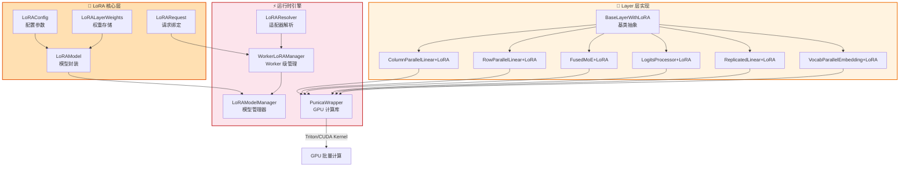
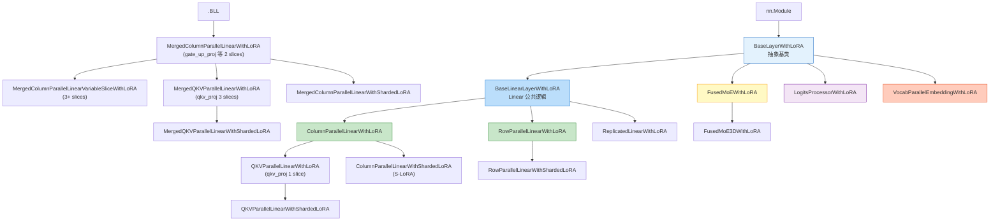
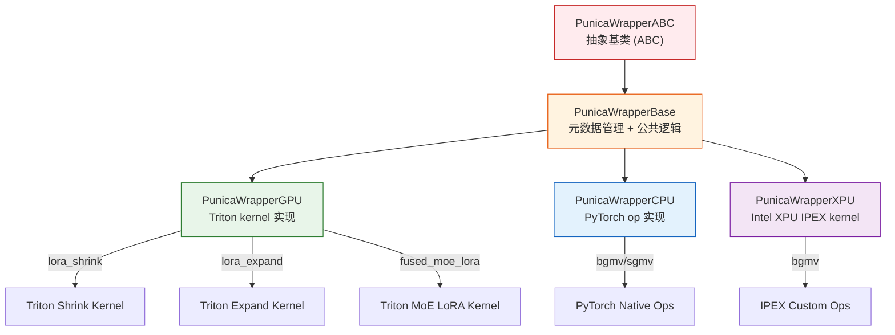
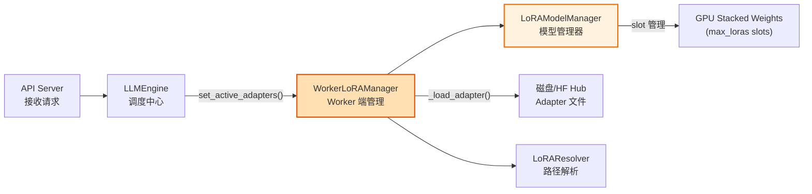
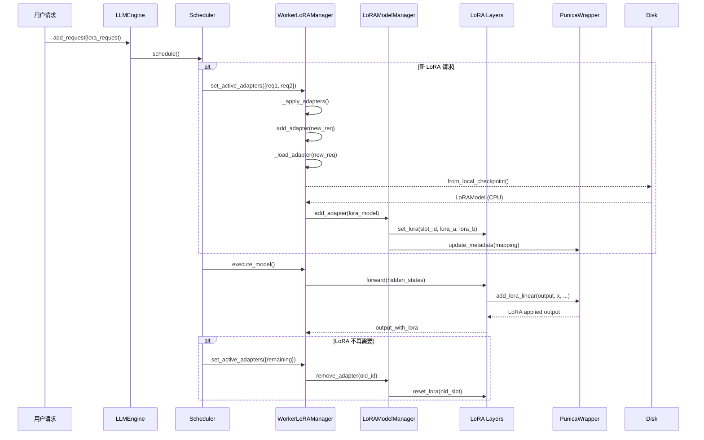

# vLLM LoRA 适配器系统深度解析

## 定位

LoRA（Low-Rank Adaptation）是 vLLM 中实现高效多租户适配器服务（Multi-Tenant LoRA Serving）的核心子系统。它基于 **Punica** 论文架构，支持在单次推理 batch 中同时运行多个不同的 LoRA 适配器，通过**低秩矩阵分解**和**批量 GEMM 融合计算**实现近乎零开销的 adapter 切换。本模块覆盖从配置、权重管理、请求绑定、层级替换到 GPU kernel 计算的完整链路。



---

## 一、LoRA 概述

### 1.1 Low-Rank Adaptation 原理

LoRA（Low-Rank Adaptation）是一种**参数高效微调方法**，其核心思想是将全量微调的大矩阵更新 $\Delta W$ 分解为两个低秩矩阵的乘积：

$$
\Delta W = B \times A \quad \text{其中 } A \in \mathbb{R}^{r \times k}, \; B \in \mathbb{R}^{d \times r}
$$

- **$A$ (lora_a)**: 降维投影矩阵，将输入从 $k$ 维投影到 $r$ 维（$r \ll \min(k, d)$）
- **$B$ (lora_b)**: 升维恢复矩阵，将 $r$ 维映射回 $d$ 维
- **rank ($r$)**: 低秩维度，典型值为 8, 16, 32, 64
- **scaling factor**: $\text{scaling} = \frac{\alpha}{r}$，其中 $\alpha$ 是 lora_alpha

**前向计算公式**：

$$
h = W_0 x + \Delta W x = W_0 x + B A x \cdot \frac{\alpha}{r}
$$

vLLM 的 LoRA 实现源自 [Punica: Multi-Tenant LoRA Serving](https://arxiv.org/abs/2310.18547) 论文，其关键创新在于：
- **Batched GEMM**: 将多个 LoRA adapter 的 $A$ 和 $B$ 矩阵堆叠为 4D 张量 `(max_loras, 1, rank, dim)`，利用 Triton/CUDA kernel 实现一次前向传播处理多个 adapter
- **Dynamic Dispatch**: 通过 `token_lora_indices` 映射每个 token 到对应的 LoRA slot index，实现 per-token 级别的 adapter 选择

---

## 二、LoRAConfig 配置参数

**源码位置**: [lora.py](file:///workspace/vllm/config/lora.py)

`LoRAConfig` 是 vLLM 中控制 LoRA 行为的核心配置类，使用 Pydantic 进行参数校验。

### 2.1 关键配置项

| 参数名 | 类型 | 默认值 | 说明 |
|--------|------|--------|------|
| `max_lora_rank` | `MaxLoRARanks` | `16` | 支持的最大 LoRA rank，可选值：1/8/16/32/64/128/256/320/512 |
| `max_loras` | `int` | `1` | 单个 batch 中同时存在的最大 LoRA adapter 数量 |
| `fully_sharded_loras` | `bool` | `False` | 是否对 LoRA 权重做完整 tensor parallel 分片（S-LoRA 策略） |
| `max_cpu_loras` | `int \| None` | `None` | CPU 内存中缓存的 LoRA 数量上限（默认等于 max_loras） |
| `lora_dtype` | `torch.dtype \| str` | `"auto"` | LoRA 权重的数据类型，`auto` 时继承基础模型 dtype |
| `target_modules` | `list[str] \| None` | `None` | 限制 LoRA 应用的目标模块后缀列表（如 `["o_proj", "qkv_proj"]`） |
| `default_mm_loras` | `dict[str, str] \| None` | `None` | 多模态模型中模态到 LoRA 路径的默认映射 |
| `enable_tower_connector_lora` | `bool` | `False` | 是否启用视觉编码器和 connector 的 LoRA（实验性功能） |
| `specialize_active_lora` | `bool` | `False` | 是否按活跃 LoRA 数量专门化 CUDA graph |

### 2.2 配置校验逻辑

```python
# /workspace/vllm/config/lora.py L101-L118
@model_validator(mode="after")
def _validate_lora_config(self) -> Self:
    if self.max_cpu_loras is None:
        self.max_cpu_loras = self.max_loras
    elif self.max_cpu_loras < self.max_loras:
        raise ValueError(
            f"max_cpu_loras ({self.max_cpu_loras}) must be >= "
            f"max_loras ({self.max_loras})."
        )
    if envs.VLLM_LORA_ENABLE_DUAL_STREAM and not current_platform.is_cuda_alike():
        raise ValueError("Dual CUDA streams are only supported on CUDA platforms.")
    ...
    return self
```

**关键约束**：
- `max_cpu_loras >= max_loras`: CPU 缓存容量必须不小于 GPU 并发容量
- Dual stream 仅在 CUDA 平台可用
- `fully_sharded_loras` 与 dual stream 不兼容

### 2.3 Hash 计算

`compute_hash()` 方法用于唯一标识影响计算图的配置组合，服务于 CUDA graph 缓存键：

```python
# /workspace/vllm/config/lora.py L75-L99
def compute_hash(self) -> str:
    factors: list[Any] = []
    factors.append(self.max_lora_rank)
    factors.append(self.max_loras)
    factors.append(self.fully_sharded_loras)
    factors.append(self.lora_dtype)
    factors.append(self.enable_tower_connector_lora)
    factors.append(
        tuple(sorted(self.target_modules)) if self.target_modules else None
    )
    hash_str = safe_hash(str(factors).encode(), usedforsecurity=False).hexdigest()
    return hash_str
```

---

## 三、LoRAModel 模型封装

**源码位置**: [lora_model.py](file:///workspace/vllm/lora/lora_model.py)

`LoRAModel` 是一个已加载 LoRA adapter 的完整表示，包含该 adapter 所有层的权重数据。

### 3.1 数据结构

```python
# /workspace/vllm/lora/lora_model.py L24-L46
class LoRAModel:
    """A LoRA fine-tuned model."""

    def __init__(
        self,
        lora_model_id: int,       # 全局唯一的 LoRA ID (>0)
        rank: int,                 # 该 adapter 的实际 rank
        loras: dict[str, LoRALayerWeights],  # module_name -> weights
    ) -> None:
        self.id = lora_model_id
        assert lora_model_id > 0, (
            f"a valid lora id should be greater than 0, got {self.id}"
        )
        self.rank = rank
        self.loras: dict[str, LoRALayerWeights] = loras
```

**核心属性**：
- `id`: 全局唯一整数标识符，用于索引 stacked 权重张量的第一维
- `rank`: 该 adapter 的实际 rank（必须 <= `max_lora_rank`）
- `loras`: 字典结构 `{module_name: LoRALayerWeights}`，key 为模型层名称（如 `model.layers.0.self_attn.qkv_proj`）

### 3.2 从 Tensor 构建

```python
# /workspace/vllm/lora/lora_model.py L73-L121
@classmethod
def from_lora_tensors(
    cls,
    lora_model_id: int,
    tensors: dict[str, torch.Tensor],   # 原始权重字典
    peft_helper: PEFTHelper,             # PEFT 配置信息
    device: str = "cuda",
    dtype: torch.dtype | None = None,
    model_vocab_size: int | None = None,
    weights_mapper: WeightsMapper | None = None,
    skip_prefixes: list[str] | None = None,
) -> "LoRAModel":
```

**构建流程**：
1. 遍历 `tensors` 中每个张量名称
2. 跳过 base embedding 权重和指定前缀的模块
3. 使用 `parse_fine_tuned_lora_name()` 解析出 `module_name` 和是否为 `lora_a`
4. 为每个 module 创建 `LoRALayerWeights` 对象并填入对应的 `lora_a` / `lora_b` 张量
5. 支持 pin_memory（CPU 端优化）

### 3.3 从本地 Checkpoint 加载

```python
# /workspace/vllm/lora/lora_model.py L123-L244
@classmethod
def from_local_checkpoint(
    cls,
    lora_dir: str,                          # LoRA 目录路径
    expected_lora_modules: set[str],         # 期望的目标模块集合
    peft_helper: PEFTHelper,
    *,
    lora_model_id: int | None = None,
    device: str = "cuda",
    ...
) -> "LoRAModel":
```

**支持的文件格式优先级**：
1. **Tensorizer 格式**: `adapter_model.tensors`（通过 TensorDeserializer）
2. **SafeTensors 格式**: `adapter_model.safetensors`（推荐）
3. **PyTorch 格式**: `adapter_model.bin` 或 `adapter_model.pt`

**模块校验机制**：加载时会检查 checkpoint 中的模块是否都在 `expected_lora_modules` 中，防止加载错误的 adapter。

### 3.4 Clone 与查询接口

```python
# /workspace/vllm/lora/lora_model.py L48-L63
def clone(self, lora_model_id: int) -> "LoRAModel":
    """返回共享底层张量的副本（不同 ID）"""
    return self.__class__(lora_model_id, rank=self.rank, loras=self.loras.copy())

def get_lora(self, module_name: str) -> LoRALayerWeights | None:
    """按模块名获取 LoRA 权重"""
    return self.loras.get(module_name, None)

def check_lora_name(self, lora_name: str) -> bool:
    return lora_name in self.loras
```

---

## 四、LoRAWeights 权重管理

**源码位置**: [lora_weights.py](file:///workspace/vllm/lora/lora_weights.py)

定义了 LoRA 权重的数据结构和打包逻辑。

### 4.1 LoRALayerWeights — 单层权重

```python
# /workspace/vllm/lora/lora_weights.py L13-L96
class LoRALayerWeights:
    """LoRA weights for a layer composed of two low rank matrixes."""

    def __init__(
        self,
        module_name: str,           # 模块名
        rank: int,                   # rank
        lora_alpha: int,             # alpha 值
        lora_a: torch.Tensor,        # A 矩阵 shape: (rank, input_dim)
        lora_b: torch.Tensor,        # B 矩阵 shape: (output_dim, rank)
        scaling: float | None = None,# 缩放因子
    ) -> None:
        ...
        if scaling is None:
            self.scaling = self.lora_alpha / self.rank  # 默认 scaling = alpha/rank
```

**关键属性与方法**：

| 属性/方法 | 返回值 | 说明 |
|-----------|--------|------|
| `input_dim` | `int` | `lora_a.shape[1]`，输入维度 |
| `output_dim` | `int` | `lora_b.shape[0]`，输出维度 |
| `is_packed` | `bool` | 是否为 packed 结构（基类返回 False） |
| `optimize()` | `self` | 将 scaling 合并入 lora_b（避免运行时乘法） |

**optimize 操作**：将 `scaling` 因子预乘到 `lora_b` 中，减少推理时的计算量：

```python
# /workspace/vllm/lora/lora_weights.py L36-L42
def optimize(self) -> "LoRALayerWeights":
    """Optimize the LoRA by merging the scaling into lora_b."""
    if self.scaling == 1:
        return self
    self.lora_b *= self.scaling
    self.scaling = 1
    return self
```

### 4.2 PackedLoRALayerWeights — 打包权重

用于 **packed layers**（如 `qkv_proj` 将 Q/K/V 合并为一个线性层），将多个子层的 LoRA 打包为一个对象：

```python
# /workspace/vllm/lora/lora_weights.py L99-L249
class PackedLoRALayerWeights(LoRALayerWeights):
    def __init__(
        self,
        module_name: str,
        rank: int,
        lora_alphas: list[int | None],     # 每个 sub-layer 的 alpha
        lora_a: list[torch.Tensor | None], # 每个 sub-layer 的 A
        lora_b: list[torch.Tensor | None], # 每个 sub-layer 的 B
        scaling: list[float] | None = None,
    ) -> None:
```

**pack 方法**：将多个 `LoRALayerWeights` 打包为一个 `PackedLoRALayerWeights`：

```python
@classmethod
def pack(cls, loras: GenericSequence["LoRALayerWeights | None"]) -> "PackedLoRALayerWeights":
    """Pack a list of LoRAs into a single LoRA.
    If LoRA is None, it signifies that the submodule does not have a LoRA.
    """
```

**pack_moe 方法**：专用于 MoE 层的打包，按 `(w1, w2, w3)` 三元组组织 expert 权重：

```python
# /workspace/vllm/lora/lora_weights.py L154-L228
@classmethod
def pack_moe(
    cls,
    loras: GenericSequence["LoRALayerWeights | None"],
    module_name: str,
    is_non_gated_moe: bool = False,
) -> "PackedLoRALayerWeights":
```

MoE 打包的关键细节：
- 按 `num_experts` 遍历，每个 expert 提取 `(w1_lora, w2_lora, w3_lora)`
- 使用 `torch.stack` 将同类型权重沿 expert 维度堆叠
- 对于 non-gated MoE（无 gate_proj），复用 w1 的权重作为 w3 并设置 `last_scaling=1.0` 避免双重缩放

### 4.3 Dummy 权重创建

用于 warmup 和 slot 占位：

```python
# /workspace/vllm/lora/lora_weights.py L72-L96
@classmethod
def create_dummy_lora_weights(
    cls,
    module_name: str,
    input_dim: int,
    output_dim: int,
    rank: int,
    dtype: torch.dtype,
    device: torch.types.Device,
) -> "LoRALayerWeights":
    pin_memory = str(device) == "cpu" and is_pin_memory_available()
    lora_a = torch.zeros([rank, input_dim], dtype=dtype, device=device, pin_memory=pin_memory)
    lora_b = torch.zeros([output_dim, rank], dtype=dtype, device=device, pin_memory=pin_memory)
    return cls(module_name, rank=rank, lora_alpha=1, lora_a=lora_a, lora_b=lora_b)
```

---

## 五、LoRA Request 请求级绑定

**源码位置**: [request.py](file:///workspace/vllm/lora/request.py)

`LoRARequest` 是用户请求与 LoRA adapter 之间的绑定契约。

### 5.1 数据结构

```python
# /workspace/vllm/lora/request.py L8-L66
class LoRARequest(
    msgspec.Struct,
    omit_defaults=True,
    array_like=True,
):
    """
    Request for a LoRA adapter.

    lora_int_id must be globally unique for a given adapter.
    """

    lora_name: str                    # LoRA 名称（人类可读）
    lora_int_id: int                  # 全局唯一整数 ID（> 0）
    lora_path: str = ""               # Adapter 文件路径或 HuggingFace repo ID
    base_model_name: str | None = None  # 基础模型名称
    tensorizer_config_dict: dict | None = None  # Tensorizer 反序列化配置
    load_inplace: bool = False        # 是否强制重新加载（覆盖已有）
```

### 5.2 关键设计决策

**msgspec.Struct**：使用 `msgspec` 而非 `dataclass`，原因包括：
- 高性能序列化/反序列化
- `array_like=True` 支持 NumPy-like 的数组语义
- `omit_defaults=True` 减少传输数据量

**唯一性保证**：

```python
# /workspace/vllm/lora/request.py L32-L37
def __post_init__(self):
    if self.lora_int_id < 1:
        raise ValueError(f"id must be > 0, got {self.lora_int_id}")
    assert self.lora_path, "lora_path cannot be empty"
```

**相等性与哈希**：基于 `lora_name` 实现，使得同名 adapter 在跨 engine 场景下可以正确去重：

```python
# /workspace/vllm/lora/request.py L51-L66
def __eq__(self, value: object) -> bool:
    return isinstance(value, self.__class__) and self.lora_name == value.lora_name

def __hash__(self) -> int:
    return hash(self.lora_name)
```

**便捷属性**：

```python
@property
def adapter_id(self):
    return self.lora_int_id

@property
def name(self):
    return self.lora_name

@property
def path(self):
    return self.lora_path
```

---

## 六、LoRA Layer 层实现

**源码目录**: [layers/](file:///workspace/vllm/lora/layers/)

vLLM 将原始模型中的 Linear/Embedding/MoE 层替换为带 LoRA 能力的版本，形成完整的层级继承体系。

### 6.1 类继承体系总览



### 6.2 BaseLayerWithLoRA — 抽象基类

**源码**: [base.py](file:///workspace/vllm/lora/layers/base.py)

定义所有 LoRA layer 必须实现的接口契约：

```python
# /workspace/vllm/lora/layers/base.py L16-L78
class BaseLayerWithLoRA(nn.Module):
    def slice_lora_a(self, lora_a): ...      # TP 分片 lora_a
    def slice_lora_b(self, lora_b): ...      # TP 分片 lora_b
    def create_lora_weights(...): ...        # 初始化 stacked 权重缓冲区
    def reset_lora(self, index: int): ...    # 重置某 slot 为零
    def set_lora(self, index, lora_a, lora_b): ...  # 写入权重到指定 slot
    def set_mapping(self, punica_wrapper): ...       # 绑定 PunicaWrapper
    @classmethod
    def can_replace_layer(cls, source_layer, lora_config, packed_modules_list, model_config): ...
```

### 6.3 BaseLinearLayerWithLoRA — Linear 公共基类

**源码**: [base_linear.py](file:///workspace/vllm/lora/layers/base_linear.py)

封装所有 Linear 类型 LoRA layer 的公共逻辑，包括权重缓冲区初始化、同步/异步 apply、dual-stream 支持等。

#### 6.3.1 权重缓冲区初始化

```python
# /workspace/vllm/lora/layers/base_linear.py L106-L157
def create_lora_weights(
    self,
    max_loras: int,
    lora_config: LoRAConfig,
    model_config: PretrainedConfig | None = None,
) -> None:
    self.lora_config = lora_config
    # 根据 base_layer 类型决定输出维度
    if isinstance(self.base_layer, ReplicatedLinear):
        lora_a_out_size = lora_config.max_lora_rank
        lora_b_out_size = self.output_size
    elif isinstance(self.base_layer, ColumnParallelLinear):
        lora_a_out_size = (
            lora_config.max_lora_rank
            if not lora_config.fully_sharded_loras
            else divide(lora_config.max_lora_rank, self.tp_size)
        )
        lora_b_out_size = self.output_size
    elif isinstance(self.base_layer, RowParallelLinear):
        lora_a_out_size = lora_config.max_lora_rank
        lora_b_out_size = (
            self.output_size
            if not lora_config.fully_sharded_loras
            else divide(self.output_size, self.tp_size)
        )

    # 创建 stacked 权重缓冲区
    # shape: (max_loras, 1, lora_out_size, input/output_size)
    self.lora_a_stacked = tuple(
        torch.zeros(max_loras, 1, lora_a_out_size, self.input_size,
                     dtype=lora_config.lora_dtype, device=self.device)
        for _ in range(self.n_slices)
    )
    self.lora_b_stacked = tuple(
        torch.zeros(max_loras, 1, lora_b_out_size, lora_config.max_lora_rank,
                     dtype=lora_config.lora_dtype, device=self.device)
        for _ in range(self.n_slices)
    )
```

**stacked 权重张量的形状设计**：
- 第 0 维 (`max_loras`): 不同 LoRA adapter 的 slot
- 第 1 维 (`1`): 为广播保留（Punica kernel 要求）
- 第 2-3 维: 实际权重矩阵维度

#### 6.3.2 同步与双流执行模式

```python
# /workspace/vllm/lora/layers/base_linear.py L192-236
def apply(self, x: torch.Tensor, bias: torch.Tensor | None = None) -> torch.Tensor:
    if self._enable_aux_cuda_stream and is_forward_context_available():
        # 双 CUDA 流模式：base layer 和 LoRA 在不同流上并行执行
        output_size = sum(self.output_slices)
        return torch.ops.vllm.lora_linear_async(
            self.layer_name, output_size, x, bias
        )
    else:
        # 同步模式：顺序执行
        return self._apply_sync(x, bias)

def _apply_sync(self, x, bias):
    output = self.base_layer.quant_method.apply(self.base_layer, x, bias)
    return self._apply_lora_to_output(x, output)
```

**Dual Stream 优化**（`VLLM_LORA_ENABLE_DUAL_STREAM=True`）：
- Base linear 在 default CUDA stream 上执行
- LoRA computation 在 auxiliary stream 上执行
- 两者通过 `torch.cuda.Event` 同步，实现流水线重叠

#### 6.3.3 LoRA 应用核心逻辑

```python
# /workspace/vllm/lora/layers/base_linear.py L213-236
def _apply_lora_to_output(self, x: torch.Tensor, output: torch.Tensor) -> torch.Tensor:
    original_shape = output.shape if output.ndim == 3 else None

    # transformers backend 需要 flatten batch 维度
    if x.ndim == 3 and output.ndim == 3:
        output = output.flatten(0, 1)
        x = x.flatten(0, 1)

    # 调用 PunicaWrapper 执行批量 LoRA GEMM
    lora_output: torch.Tensor | None = self.punica_wrapper.add_lora_linear(
        output, x, self.lora_a_stacked, self.lora_b_stacked, 1.0, self.output_slices
    )
    if not current_platform.can_update_inplace():
        output = lora_output

    if original_shape is not None:
        output = output.reshape(original_shape)
    return output
```

### 6.4 ColumnParallelLinearWithLoRA

**源码**: [column_parallel_linear.py](file:///workspace/vllm/lora/layers/column_parallel_linear.py)

适用于 `ColumnParallelLinear` 及其变体的 LoRA 包装。**核心特征是分片 lora_b**（沿输出维度分片以匹配 TP）。

```python
# /workspace/vllm/lora/layers/column_parallel_linear.py L102-L128
def slice_lora_b(self, lora_b: torch.Tensor) -> torch.Tensor:
    if self.is_merged_col_linear:
        # MergedColumnParallelLinear: 如 gate_up_proj，需要拆分为两半再分别分片
        shard_size = self.output_size // 2
        offset = lora_b.shape[0] // 2
        left_weight = lora_b[self.tp_rank * shard_size : (self.tp_rank + 1) * shard_size, :]
        right_weight = lora_b[offset + self.tp_rank * shard_size : offset + (self.tp_rank + 1) * shard_size, :]
        lora_b = torch.cat([left_weight, right_weight], dim=0)
    else:
        # 标准 ColumnParallelLinear
        shard_size = self.output_size
        start_idx = self.tp_rank * shard_size
        end_idx = (self.tp_rank + 1) * shard_size
        lora_b = lora_b[start_idx:end_idx, :]
    return lora_b
```

**子类族谱**：

| 类名 | 适用场景 | n_slices | 特殊逻辑 |
|------|----------|----------|----------|
| `ColumnParallelLinearWithLoRA` | 普通 ColumnParallelLinear | 1 | 分片 lora_b |
| `MergedColumnParallelLinearWithLoRA` | gate_up_proj 等 2-slice 合并层 | 2 | 分别处理两个 sub-lora |
| `QKVParallelLinearWithLoRA` | qkv_proj (单一 LoRA) | 1 | Q/K/V 分别按 head 数量分片 |
| `MergedQKVParallelLinearWithLoRA` | qkv_proj (三个独立 LoRA) | 3 | Q/K/V 各自独立的 slice 和 sharding |
| `MergedColumnParallelLinearVariableSliceWithLoRA` | 3+ slices 合并层 | 3+ | 动态切片数 |
| `*WithShardedLoRA` 变体 | S-LoRA fully-sharded 模式 | 同左 | 额外分片 lora_a |

**Fully-Sharded 变体**（S-LoRA 策略）：基于论文 [S-LoRA: Serving Thousands of Concurrent LoRA Adapters](https://arxiv.org/abs/2311.03285)，额外对 `lora_a` 沿 rank 维度进行分片，并在 `apply()` 中引入 `all_gather` + `add_expand` 两阶段计算：

```python
# /workspace/vllm/lora/layers/column_parallel_linear.py L24-L80 (辅助函数 _mcp_apply)
def _mcp_apply(x, bias, layer):
    output = layer.base_layer.quant_method.apply(layer.base_layer, x, bias)
    x = x.view(-1, x.shape[-1])
    output, out_orig_shape = output.view(-1, output.shape[-1]), output.shape

    # Stage 1: Shrink (local GEMM with sharded lora_a)
    buffers = torch.empty_strided(buffer_shape, ...)
    buffers.zero_()
    shrunk_buffers = layer.punica_wrapper.add_shrink(buffers, x, layer.lora_a_stacked, 1.0)

    # All-gather intermediate results
    buffers = tensor_model_parallel_all_gather(buffers)

    # Stage 2: Expand (GEMM with lora_b, add to output)
    lora_output = layer.punica_wrapper.add_expand(
        output, buffers, layer.lora_b_stacked, layer.output_slices,
        offset_start=0, add_input=True,
    )
    ...
```

### 6.5 RowParallelLinearWithLoRA

**源码**: [row_parallel_linear.py](file:///workspace/vllm/lora/layers/row_parallel_linear.py)

适用于 `RowParallelLinear` 的 LoRA 包装。**核心特征是分片 lora_a**（沿输入维度分片），且 lora_b 不分片（因为 RowParallel 的输出需要 all_reduce）。

```python
# /workspace/vllm/lora/layers/row_parallel_linear.py L32-40
def slice_lora_a(self, lora_a: torch.Tensor) -> torch.Tensor:
    shard_size = self.input_size
    start_idx = self.tp_rank * shard_size
    end_idx = (self.tp_rank + 1) * shard_size
    lora_a = lora_a[:, start_idx:end_idx]
    return lora_b
```

**Sharded 变体** (`RowParallelLinearWithShardedLoRA`) 额外分片 `lora_b`，采用类似 Column sharded 的 shrink + all_reduce + expand 模式。

### 6.6 FusedMoEWithLoRA

**源码**: [fused_moe.py](file:///workspace/vllm/lora/layers/fused_moe.py)

最复杂的 LoRA layer，为 MoE（Mixture of Experts）层添加 LoRA 支持。涉及 w1(gate_proj)、w2(down_proj)、w3(up_proj) 三组权重的 LoRA 管理。

#### 6.6.1 权重缓冲区结构

```python
# /workspace/vllm/lora/layers/fused_moe.py L84-144
def _create_lora_a_weights(self, max_loras, lora_config):
    # w13 (w1/w3) lora_a: (max_loras, num_experts, rank, hidden_size) × _w13_slices
    self.w13_lora_a_stacked: tuple[torch.Tensor, ...] = tuple(
        torch.zeros((max_loras, self.base_layer.local_num_experts,
                     lora_config.max_lora_rank if not self.fully_sharded
                     else divide(lora_config.max_lora_rank, self.tp_size),
                     self.base_layer.hidden_size),
                    dtype=lora_config.lora_dtype, device=self.device)
        for _ in range(self._w13_slices)  # gated MoE: 2 slices; non-gated: 1 slice
    )

    # w2 lora_a: (max_loras, num_experts, rank, intermediate_size_per_partition)
    self.w2_lora_a_stacked: tuple[torch.Tensor, ...] = (...)

def _create_lora_b_weights(self, max_loras, lora_config):
    # w13 lora_b: (max_loras, num_experts, intermediate_size_per_partition, rank)
    # w2 lora_b: (max_loras, num_experts, hidden_size[, //tp_size], rank)
```

**特殊设计点**：
- 引入 `adapter_enabled` 张量跟踪哪些 slot 有有效 adapter
- `_w13_slices`: gated MoE（如 Mixtral）为 2（gate_proj + up_proj），non-gated 为 1
- EP（Expert Parallelism）兼容性检查

#### 6.6.2 set_lora 中的 TP 分片逻辑

```python
# /workspace/vllm/lora/layers/fused_moe.py L282-344
def set_lora(self, index, lora_a, lora_b):
    assert isinstance(lora_a, list)  # [w1_lora_a, w2_lora_a, w3_lora_a]
    assert isinstance(lora_b, list)  # [w1_lora_b, w2_lora_b, w3_lora_b]

    self.reset_lora(index)
    self.adapter_enabled[index] = 1

    w1_lora_a, w2_lora_a, w3_lora_a = lora_a
    w1_lora_b, w2_lora_b, w3_lora_b = lora_b

    # 对 w1/w3 做 rank 维度分片 (if fully_sharded)
    slliced_w1_lora_a = self._slice_w13_a(w1_lora_a)
    slliced_w1_lora_b = self._slice_w13_b(w1_lora_b)

    # 对 w2 做相应分片
    sliced_w2_lora_a = self._slice_w2_a(w2_lora_a)
    sliced_w2_lora_b = self._slice_w2_b(w2_lora_b)

    # Copy to stacked buffers
    self.w13_lora_a_stacked[0][index, :, :, :].copy_(slliced_w1_lora_a, non_blocking=True)
    ...
```

#### 6.6.3 FusedMoE3DWithLoRA — 3D MoE 变体

适用于 DeepSeek 等 3D MoE 架构，将 w1 和 w3 的 lora_b 沿中间维度拼接：

```python
# /workspace/vllm/lora/layers/fused_moe.py L388-401
def _create_lora_b_weights(self, max_loras, lora_config):
    # w13 lora_b: intermediate_size * 2 (w1+w3 concatenated)
    self.w13_lora_b_stacked: tuple[torch.Tensor] = tuple(
        torch.zeros((max_loras, self.base_layer.local_num_experts,
                     self.base_layer.intermediate_size_per_partition * 2,
                     lora_config.max_lora_rank), ...)
    )
```

### 6.7 LogitsProcessorWithLoRA

**源码**: [logits_processor.py](file:///workspace/vllm/lora/layers/logits_processor.py)

为 LogitsProcessor（LM Head）添加 LoRA 支持，允许 LoRA adapter 修改词汇表分布。

**特殊之处**：
- vocab_size 上限限制为 258048
- 处理 sharded-to-full vocabulary 映射（TP 场景下的词表重排）
- 使用专门的 `add_lora_logits` Punica 接口

```python
# /workspace/vllm/lora/layers/logits_processor.py L141-190
def _get_logits(self, hidden_states, lm_head, embedding_bias=None):
    logits = actual_lm_head.quant_method.apply(actual_lm_head, hidden_states)
    if embedding_bias is not None:
        logits += embedding_bias

    logits = self.base_layer._gather_logits(logits)

    # Reindex for sharded vocab
    if self.sharded_to_full_mapping_gpu is not None:
        logits = logits[:, self.sharded_to_full_mapping_gpu]

    # Apply LoRA to logits
    lora_output = self.punica_wrapper.add_lora_logits(
        logits, hidden_states, self.lora_a_stacked, self.lora_b_stacked, 1.0
    )
    ...
```

### 6.8 ReplicatedLinearWithLoRA

**源码**: [replicated_linear.py](file:///workspace/vllm/lora/layers/replicated_linear.py)

适用于 `ReplicatedLinear`（如 GateLinear）。无需 TP 分片（因为权重本身是复制的）。

### 6.9 VocabParallelEmbeddingWithLoRA

**源码**: [vocal_parallel_embedding.py](file:///workspace/vllm/lora/layers/vocal_parallel_embedding.py)

为 Embedding 层添加 LoRA，支持新增 token 的嵌入扩展。

**关键实现**：

```python
# /workspace/vllm/lora/layers/vocal_parallel_embedding.py L96-126
def forward(self, x: torch.Tensor) -> torch.Tensor:
    num_tokens = x.shape[0]
    indices_1 = self.punica_wrapper._embeddings_indices[1][:num_tokens]

    # Lookup LoRA A embeddings (like an embedding table lookup)
    full_lora_a_embeddings = F.embedding(x + indices_1, self.lora_a_stacked_2d)

    full_output = self.base_layer.forward(x)

    # Apply LoRA: output += lora_A_embedding @ lora_B
    lora_output = self.punica_wrapper.add_lora_embedding(
        full_output, full_lora_a_embeddings, self.lora_b_stacked, add_input=True
    )
    return full_output.view_as(full_output_org)
```

**注意**：`lora_a` 在 Embedding 场景下的角色类似于一个额外的嵌入查找表，而非传统的矩阵乘法。

---

## 七、Punica Wrapper GPU LoRA 计算库集成

**源码目录**: [punica_wrapper/](file:///workspace/vllm/lora/punica_wrapper/)

Punica Wrapper 是 vLLM LoRA 系统的计算引擎抽象层，封装了底层的 Triton/CUDA/XPU kernel 调用。

### 7.1 架构层次



### 7.2 PunicaWrapperBase — 元数据中心

**源码**: [punica_base.py](file:///workspace/vllm/lora/punica_wrapper/punica_base.py)

维护 Multi-LoRA 推理所需的全部状态信息和映射数据。

#### 7.2.1 核心状态张量

```python
# /workspace/vllm/lora/punica_wrapper/punica_base.py L131-166
class PunicaWrapperBase(PunicaWrapperABC):
    def __init__(self, max_num_batched_tokens, max_batches, device, **kwargs):
        # Token 级别的 LoRA 索引映射 (decode 用)
        self._token_lora_indices = torch.empty(
            max_num_batched_tokens, dtype=torch.long, device=device)
        # Sampler 索引 (logits processor 用)
        self._sampler_indices = torch.empty(...)
        self._sampler_indices_padded = torch.empty(...)
        # Embedding 索引 (embedding layer 用)
        self._embeddings_indices = torch.empty(2, max_num_batched_tokens, ...)

        # Prefill 阶段专用元数据
        self._seq_start_locs = torch.empty(max_batches, ...)   # 序列起始位置
        self._seq_lengths = torch.empty(max_batches, ...)       # 序列长度
        self._lora_indices_per_batch = torch.empty(...)          # 每 batch 的 LoRA ID
```

#### 7.2.2 元数据更新流程

```python
# /workspace/vllm/lora/punica_wrapper/punica_base.py L284-299
def update_metadata(self, mapping, lora_index_to_id, max_loras, vocab_size, **kwargs):
    # 1. 更新基础映射（token → LoRA index）
    self._update_base_metadata(mapping, lora_index_to_id, max_loras, vocab_size)

    # 2. 如果是 prefill 阶段，额外计算 batch 级元数据
    if mapping.is_prefill:
        self._update_prefill_metadata(self.token_lora_indices)
        self.is_prefill = True
    else:
        self.is_prefill = False
```

#### 7.2.3 核心 Kernel 接口语义

| 方法 | 语义公式 | 用途 |
|------|----------|------|
| `add_shrink(y, x, lora_a, scale)` | `y[i] += (x @ lora_a[i]) * scale` | LoRA A 的 GEMM（降维） |
| `add_expand(y, x, lora_b, slices, offset)` | `y[:, offset:offset+slice] += x[i] @ lora_b[i]` | LoRA B 的 GEMM（升维） |
| `add_lora_linear(y, x, lora_a, lora_b, scale, slices)` | shrink + expand 组合 | 完整 LoRA linear |
| `add_lora_embedding(y, x, lora_b)` | `y += x @ lora_b` | Embedding LoRA |
| `add_lora_logits(y, x, lora_a, lora_b, scale)` | `buffer=(x@lora_a)*scale; y+=buffer@lora_b` | Logits LoRA |
| `add_lora_fused_moe(...)` | fused MoE LoRA forward | MoE LoRA |
| `add_lora_w13(...)` | w1/w3 LoRA + routing alignment | MoE gate/up proj |
| `add_lora_w2(...)` | w2 LoRA (reuses w13 routing) | MoE down proj |

### 7.3 PunicaWrapperGPU — Triton 实现

**源码**: [punica_gpu.py](file:///workspace/vllm/lora/punica_wrapper/punica_gpu.py)

使用 Triton 编写的自定义 kernel 实现，是生产环境的主要 backend。

#### 7.3.1 初始化与 CUDA Graph 专项化

```python
# /workspace/vllm/lora/punica_wrapper/punica_gpu.py L40-73
def __init__(self, max_num_batched_tokens, max_batches, device, **kwargs):
    PunicaWrapperBase.__init__(self, ...)
    self.lora_config = kwargs["lora_config"]
    self.max_loras = self.lora_config.max_loras

    # 计算 captured LoRA counts 用于 CUDA Graph 专项化
    captured_lora_counts = get_captured_lora_counts(
        self.max_loras, self.lora_config.specialize_active_lora)

    # Token 级映射 meta（用于 decode 阶段的 sgmv）
    self.token_mapping_meta = LoRAKernelMeta.make(
        self.max_loras, max_num_batched_tokens, device=device,
        captured_lora_counts=captured_lora_counts)

    # Prompt 级映射 meta（用于 prefill/logits 的 sgmv）
    self.prompt_mapping_meta = LoRAKernelMeta.make(
        self.max_loras, max_num_batched_tokens, device=device,
        captured_lora_counts=captured_lora_counts)
```

**CUDA Graph 专项化** (`specialize_active_lora`)：当启用时，会为不同数量的活跃 LoRA（2 的幂次，直到 max_loras）分别捕获 CUDA graph，以优化不同负载模式的性能。

#### 7.3.2 add_lora_linear 实现细节

```python
# /workspace/vllm/lora/punica_wrapper/punica_gpu.py L203-264
def add_lora_linear(self, y, x, lora_a_stacked, lora_b_stacked, scale, output_slices, *, buffer=None, **kwargs):
    assert len(lora_a_stacked) == len(lora_b_stacked) == len(output_slices)
    assert buffer is None, "buffer should be created internally"

    r = lora_b_stacked[0].size(-1)
    # 创建 float32 buffer（Triton kernel 内部 zero）
    buffer = torch.empty(
        (len(output_slices), x.size(0), r),
        dtype=torch.float32, device=x.device)

    add_inputs = kwargs.pop("add_inputs", True)
    # Stage 1: Shrink - x @ lora_a -> buffer
    self.add_shrink(buffer, x, lora_a_stacked, scale, **kwargs)
    # Stage 2: Expand - buffer @ lora_b -> y
    self.add_expand(y, buffer, lora_b_stacked, output_slices, add_inputs=add_inputs, **kwargs)
```

#### 7.3.3 MoE LoRA 计算

MoE LoRA 是最复杂的计算路径，涉及 token-expert routing 对齐和 fused GEMM：

```python
# /workspace/vllm/lora/punica_wrapper/punica_gpu.py L489-620
def add_lora_w13(self, y, x, lora_a_stacked, lora_b_stacked,
                 topk_ids, topk_weights, expert_map, w1, w2,
                 num_tokens, top_k_num, max_loras, adapter_enabled,
                 local_num_experts, top_k, num_slices, fully_sharded,
                 use_tuned_config, token_lora_mapping=None):

    # 1. 获取最优 kernel config（tuned 或 heuristic）
    if use_tuned_config:
        shrink_config = get_lora_op_configs(op_type="fused_moe_lora_w13_shrink", ...)
        expand_config = get_lora_op_configs(op_type="fused_moe_lora_w13_expand", ...)
    else:
        shrink_config = try_get_optimal_moe_lora_config(op_type="fused_moe_lora_w13_shrink", ...)
        ...

    # 2. 对齐 block size（将 tokens 和 experts 组织为 block-sized chunks）
    SPARSITY_FACTOR = 8
    naive_block_assignment = (
        expert_map is None
        and num_tokens * top_k * SPARSITY_FACTOR <= local_num_experts * max_loras
    )
    (token_lora_mapping, sorted_token_ids_lora,
     expert_ids_lora, num_tokens_post_padded_lora) = self.moe_lora_align_block_size(...)

    # 3. 执行 fused MoE LoRA forward
    self.add_lora_fused_moe(y.view(-1, top_k_num, y.shape[-1]), x,
                            lora_a_stacked, lora_b_stacked, topk_weights,
                            _sorted, _eids, num_tokens_post_padded_lora, ...)

    # 4. 返回 routing tensors 供 w2 复用
    return (sorted_token_ids_lora, expert_ids_lora, num_tokens_post_padded_lora, token_lora_mapping)
```

### 7.4 PunicaWrapperCPU — PyTorch Op 实现

**源码**: [punica_cpu.py](file:///workspace/vllm/lora/punica_wrapper/punica_cpu.py)

使用 PyTorch 原生操作实现，适用于无 GPU/Triton 环境。区分 **prefill** 和 **decode** 两种模式：

```python
# /workspace/vllm/lora/punica_wrapper/punica_cpu.py L38-163
class PunicaWrapperCPU(PunicaWrapperBase):
    # Decode: 使用 bgmv (batched GEMV) - per-token 粒度
    def _shrink_decode(self, y, x, w_t_all, scale):
        bgmv_shrink(x, w_t_all, y, self.token_lora_indices, scale)

    # Prefill: 使用 sgmv (segmented GEMV) - per-sequence 粒度
    def _shrink_prefill(self, y, x, w_t_all, scale):
        if self.no_lora:
            return
        sgmv_shrink(x, w_t_all, y, *self.prefill_metadata, scale)
```

**Prefill vs Decode 的区别**：
- **Decode**: 每个 token 可能有不同的 LoRA，使用 `token_lora_indices` 逐 token 索引
- **Prefill**: 同一 sequence 的所有 token 共享同一 LoRA，使用 `prefill_metadata`（seq_start_locs, seq_lengths）批量处理

### 7.5 PunicaWrapperXPU — Intel XPU 实现

**源码**: [punica_xpu.py](file:///workspace/vllm/lora/punica_wrapper/punica_xpu.py)

针对 Intel XPU（GPU）平台的实现，使用 IPEX 自定义 kernel（`bgmv_shrink`, `bgmv_expand`, `bgmv_expand_slice`），并标记动态 shape 以支持 `torch.compile`：

```python
# /workspace/vllm/lora/punica_wrapper/punica_xpu.py L46-48
def __init__(self, ...):
    ...
    torch._dynamo.mark_dynamic(self._token_lora_indices, 0)
    torch._dynamo.mark_dynamic(self._embeddings_indices, 1)
    torch._dynamo.mark_dynamic(self._sampler_indices_padded, 0)
```

---

## 八、LoRA Resolver 适配器解析

**源码**: [resolver.py](file:///workspace/vllm/lora/resolver.py)

定义 LoRA adapter 的发现与解析抽象接口，支持从不同来源（本地文件系统、HuggingFace Hub、云存储等）获取 adapter。

### 8.1 抽象接口

```python
# /workspace/vllm/lora/resolver.py L14-41
class LoRAResolver(ABC):
    @abstractmethod
    async def resolve_lora(
        self, base_model_name: str, lora_name: str
    ) -> LoRARequest | None:
        """Abstract method to resolve and fetch a LoRA model adapter.

        Args:
            base_model_name: The name/identifier of the base model.
            lora_name: The name/identifier of the LoRA model to resolve.

        Returns:
            Optional[LoRARequest]: The resolved LoRA request, or None if not found.
        """
        pass
```

### 8.2 注册中心

```python
# /workspace/vllm/lora/resolver.py L43-88
@dataclass
class _LoRAResolverRegistry:
    resolvers: dict[str, LoRAResolver] = field(default_factory=dict)

    def register_resolver(self, resolver_name: str, resolver: LoRAResolver) -> None: ...
    def get_resolver(self, resolver_name: str) -> LoRAResolver: ...
    def get_supported_resolvers(self) -> Set[str]: ...

LoRAResolverRegistry = _LoRAResolverRegistry()  # 全局单例
```

**注册中心设计**：采用插件式架构，允许第三方注册自定义 resolver（如 S3 resolver、数据库 resolver 等），通过名称字符串进行查找。

---

## 九、WorkerManager Worker 级管理

**源码**: [worker_manager.py](file:///workspace/vllm/lora/worker_manager.py)

`WorkerLoRAManager` 是 Worker 进程中 LoRA 生命周期的管理者，负责 adapter 的加载、卸载、激活和缓存。

### 9.1 架构角色



### 9.2 WorkerLoRAManager — 基础管理器

```python
# /workspace/vllm/lora/worker_manager.py L25-223
class WorkerLoRAManager:
    """WorkerLoRAManager that manages LoRA models on the worker side.

    Every request, the requested LoRAs will be loaded (unless they are already
    loaded), and every other LoRA will be unloaded."""
```

**核心生命周期方法**：

| 方法 | 功能 |
|------|------|
| `create_lora_manager(model, vllm_config)` | 初始化 LoRAModelManager，替换模型中的层 |
| `set_active_adapters(requests, mapping)` | **主入口**：根据当前请求设置活跃 adapters |
| `add_adapter(adapter_request)` | 加载单个 adapter 到 GPU |
| `remove_adapter(adapter_id)` | 卸载单个 adapter |
| `list_adapters()` | 列出当前已加载的 adapter IDs |
| `add_dummy_lora(lora_request, rank)` | 添加 dummy LoRA（warmup 用） |
| `pin_adapter(adapter_id)` | 固定 adapter 不被驱逐 |

#### 9.2.1 Adapter 加载流程

```python
# /workspace/vllm/lora/worker_manager.py L99-157
def _load_adapter(self, lora_request: LoRARequest) -> LoRAModel:
    # 1. 确定期望的目标模块列表
    supported_lora_modules = self._adapter_manager.supported_lora_modules
    packed_modules_mapping = self._adapter_manager.packed_modules_mapping
    expected_lora_lst = []
    for module in supported_lora_modules:
        if module in packed_modules_mapping:
            expected_lora_lst.extend(packed_modules_mapping[module])
        else:
            expected_lora_lst.append(module)

    # 2. 解析 adapter 绝对路径
    lora_path = get_adapter_absolute_path(lora_request.lora_path)

    # 3. 加载 PEFT 配置
    peft_helper = PEFTHelper.from_local_dir(lora_path, ...)

    # 4. 校验 LoRA 配置合法性
    peft_helper.validate_legal(self.lora_config)

    # 5. 获取模型特定的权重映射和跳过前缀
    hf_to_vllm_mapper = getattr(model, "hf_to_vllm_mapper", None)
    lora_skip_prefixes = getattr(model, "lora_skip_prefixes", None)

    # 6. 从 checkpoint 加载 LoRAModel（到 CPU）
    lora = self._lora_model_cls.from_local_checkpoint(
        lora_path, expected_lora_modules, peft_helper=peft_helper,
        lora_model_id=lora_request.lora_int_id, device="cpu", ...)
    return lora
```

#### 9.2.2 活跃 Adapter 应用策略

```python
# /workspace/vllm/lora/worker_manager.py L178-206
def _apply_adapters(self, adapter_requests: set[Any]) -> None:
    existing_adapters = self.list_adapters()
    models_map = {
        adapter_request.adapter_id: adapter_request
        for adapter_request in adapter_requests if adapter_request
    }
    # 容量检查
    if len(models_map) > self._adapter_manager.adapter_slots:
        raise RuntimeError(f"Requested models ({len(models_map)}) > slots ({self._adapter_manager.adapter_slots})")

    requested_ids = set(models_map)
    # 卸载不再需要的 adapters
    for adapter_id in existing_adapters - requested_ids:
        self.remove_adapter(adapter_id)
    # 加载新需要的 adapters
    for adapter_id in requested_ids - existing_adapters:
        self.add_adapter(models_map[adapter_id])
```

**策略特点**：精确匹配策略——只保留当前批次需要的 adapters，其余全部卸载。

### 9.3 LRUCacheWorkerLoRAManager — LRU 缓存管理器

继承 `WorkerLoRAManager`，增加 **LRU 缓存淘汰** 策略，适合频繁切换 adapter 的场景：

```python
# /workspace/vllm/lora/worker_manager.py L226-302
class LRUCacheWorkerLoRAManager(WorkerLoRAManager):
    """Uses an LRU Cache. Least recently used LoRAs will be unloaded
    if the cache is above capacity."""

    def add_adapter(self, lora_request: LoRARequest) -> bool:
        if (lora_request.lora_int_id not in self.list_adapters()
                or lora_request.load_inplace):
            # 先加载新 adapter（确保有效性）
            lora = self._load_adapter(lora_request)

            # 移除已有版本（支持 inplace 更新）
            self._adapter_manager.remove_adapter(lora.id)

            # 容量超限时驱逐最久未使用的 adapter
            if len(self._adapter_manager) + 1 > self._adapter_manager.capacity:
                self._adapter_manager.remove_oldest_adapter()

            # 添加新 adapter
            loaded = self._adapter_manager.add_adapter(lora)
        else:
            # 已缓存则 touch 更新 LRU 位置
            loaded = (self._adapter_manager.get_adapter(lora_request.lora_int_id) is not None)

        self._adapter_manager.activate_adapter(lora_request.lora_int_id)
        return loaded
```

**LRU 策略 vs 基础策略对比**：

| 特性 | WorkerLoRAManager | LRUCacheWorkerLoRAManager |
|------|-------------------|--------------------------|
| 卸载策略 | 精确匹配（不需要的全卸载） | LRU 淘汰（超容量时驱逐最旧的） |
| 已缓存命中 | 直接跳过 | touch 更新访问时间 |
| Inplace 更新 | 不支持 | 支持 (`load_inplace`) |
| 适用场景 | 固定 few-shot adapters | 大量 adapters 轮转 |

---

## 十、动态加载/卸载机制

### 10.1 完整请求处理流程



### 10.2 Slot-Based 权重管理

vLLM 采用 **pre-allocated slot** 策略管理 GPU 上的 LoRA 权重：

1. **初始化阶段**：`create_lora_weights(max_loras)` 预分配形状为 `(max_loras, 1, rank, dim)` 的零张量
2. **加载阶段**：`set_lora(slot_index, lora_a, lora_b)` 将权重 copy_ 到对应 slot
3. **激活阶段**：通过 `LoRAMapping` 建立 `token → slot_index` 的映射关系
4. **计算阶段**：Punica kernel 根据 `token_lora_indices` 从对应 slot 取权重计算
5. **卸载阶段**：`reset_lora(slot_index)` 将对应 slot 清零

### 10.3 LoRAMapping — Token 到 Adapter 的映射

`LoRAMapping` 是连接请求级 LoRA binding 和 kernel 级计算的桥梁数据结构：

- **Decode 阶段**：每个 token 对应一个 `lora_index`（-1 表示无 LoRA），组成 `token_lora_indices` 向量
- **Prefill 阶段**：每个 sequence 共享一个 `lora_index`，配合 `seq_start_locs` 和 `seq_lengths` 使用

### 10.4 性能优化要点

| 优化技术 | 说明 | 代码位置 |
|----------|------|----------|
| **Batched GEMM** | 多个 LoRA 的 A/B 矩阵堆叠为 4D 张量，单次 kernel 调用处理 | `lora_a/b_stacked` |
| **Scaling Pre-fusion** | `optimize()` 将 alpha/r 合入 lora_b，消除运行时乘法 | [lora_weights.py L36](file:///workspace/vllm/lora/lora_weights.py#L36-L42) |
| **Dual CUDA Stream** | Base linear 和 LoRA 在不同流上并行执行 | [base_linear.py L238](file:///workspace/vllm/lora/layers/base_linear.py#L238-L302) |
| **CUDA Graph Specialization** | 按活跃 LoRA 数量（2 的幂次）专门化 graph | `specialize_active_lora` |
| **Float32 Buffer** | Shrink 中间结果使用 float32，参考 Triton issue #1387 | [punica_gpu.py L246](file:///workspace/vllm/lora/punica_wrapper/punica_gpu.py#L246-L248) |
| **Dummy LoRA Reuse** | Warmup 阶段复用同一个 dummy LoRA 对象（clone 不同 ID） | [worker_manager.py L159](file:///workspace/vllm/lora/worker_manager.py#L159-L170) |
| **Non-blocking Copy** | `copy_(non_blocking=True)` 异步拷贝权重 | 各 `set_lora` 方法 |
| **S-LoRA Sharding** | Fully-sharded 模式下额外分片 lora_a，减少通信量 | `*WithShardedLoRA` 子类 |
| **MoE Routing Reuse** | w13 的 routing 结果（sorted_ids, expert_ids）直接供 w2 复用 | [punica_gpu.py L615](file:///workspace/vllm/lora/punica_wrapper/punica_gpu.py#L615-L620) |

---

## 附录：关键文件索引

| 文件 | 核心职责 |
|------|----------|
| [config/lora.py](file:///workspace/vllm/config/lora.py) | LoRAConfig 配置定义与校验 |
| [lora/lora_model.py](file:///workspace/vllm/lora/lora_model.py) | LoRAModel 封装与 checkpoint 加载 |
| [lora/lora_weights.py](file:///workspace/vllm/lora/lora_weights.py) | LoRALayerWeights / PackedLoRALayerWeights 数据结构 |
| [lora/request.py](file:///workspace/vllm/lora/request.py) | LoRARequest 请求绑定数据结构 |
| [lora/layers/base.py](file:///workspace/vllm/lora/layers/base.py) | BaseLayerWithLoRA 抽象基类 |
| [lora/layers/base_linear.py](file:///workspace/vllm/lora/layers/base_linear.py) | BaseLinearLayerWithLoRA 公共逻辑 |
| [lora/layers/column_parallel_linear.py](file:///workspace/vllm/lora/layers/column_parallel_linear.py) | Column Parallel Linear + LoRA（含 QKV/Merged/Sharded 变体） |
| [lora/layers/row_parallel_linear.py](file:///workspace/vllm/lora/layers/row_parallel_linear.py) | Row Parallel Linear + LoRA（含 Sharded 变体） |
| [lora/layers/fused_moe.py](file:///workspace/vllm/lora/layers/fused_moe.py) | FusedMoE + LoRA（含 3D MoE 变体） |
| [lora/layers/logits_processor.py](file:///workspace/vllm/lora/layers/logits_processor.py) | LogitsProcessor + LoRA |
| [lora/layers/replicated_linear.py](file:///workspace/vllm/lora/layers/replicated_linear.py) | ReplicatedLinear + LoRA |
| [lora/layers/vocal_parallel_embedding.py](file:///workspace/vllm/lora/layers/vocal_parallel_embedding.py) | VocabParallelEmbedding + LoRA |
| [lora/punica_wrapper/punica_base.py](file:///workspace/vllm/lora/punica_wrapper/punica_base.py) | PunicaWrapper 抽象基类与元数据管理 |
| [lora/punica_wrapper/punica_gpu.py](file:///workspace/vllm/lora/punica_wrapper/punica_gpu.py) | GPU/Triton kernel 实现 |
| [lora/punica_wrapper/punica_cpu.py](file:///workspace/vllm/lora/punica_wrapper/punica_cpu.py) | CPU PyTorch op 实现 |
| [lora/punica_wrapper/punica_xpu.py](file:///workspace/vllm/lora/punica_wrapper/punica_xpu.py) | Intel XPU/IPEX 实现 |
| [lora/resolver.py](file:///workspace/vllm/lora/resolver.py) | LoRA 适配器解析抽象接口与注册中心 |
| [lora/worker_manager.py](file:///workspace/vllm/lora/worker_manager.py) | Worker 级 LoRA 生命周期管理 |
