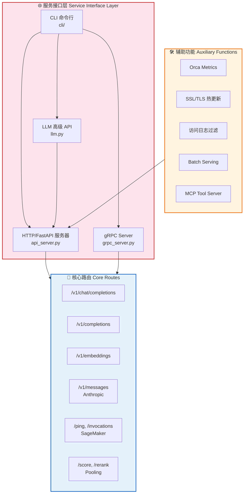
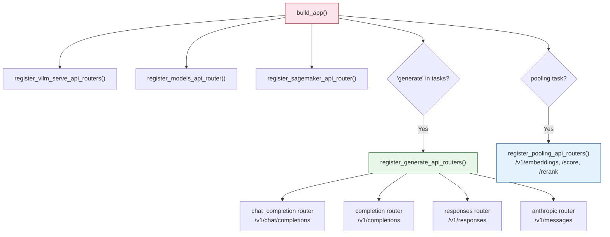
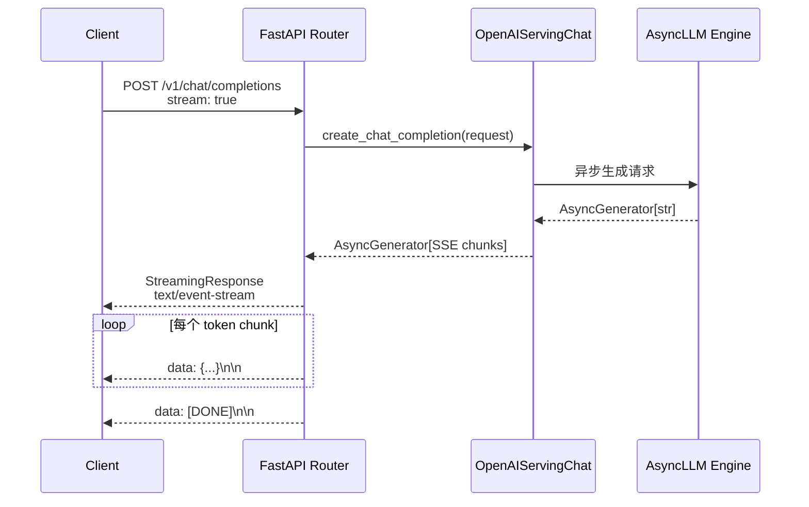
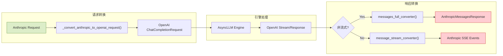
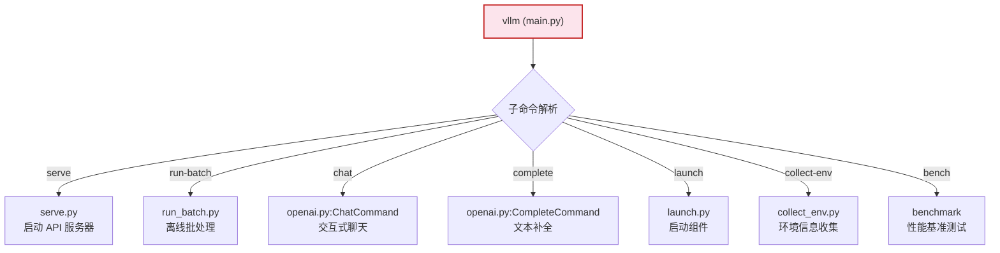
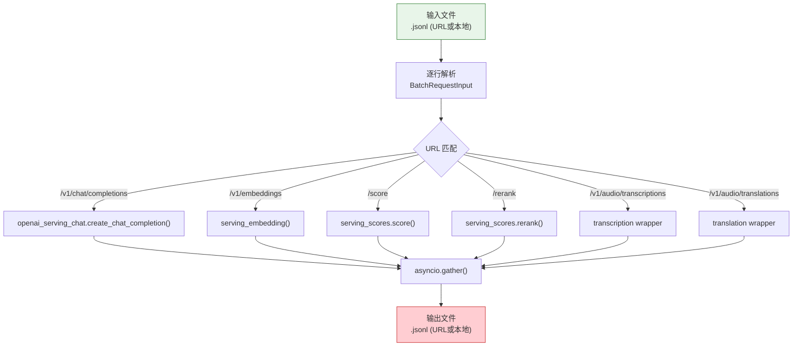
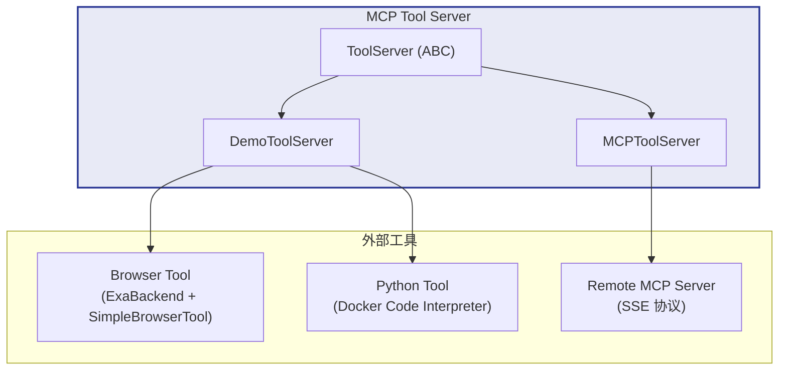
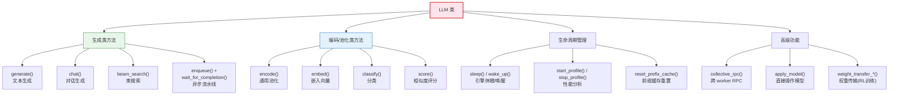
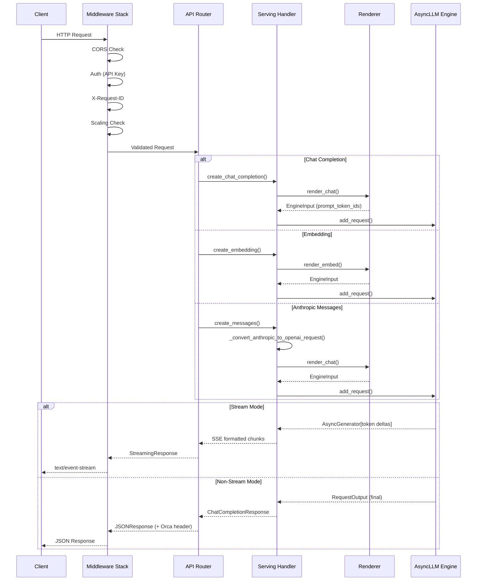
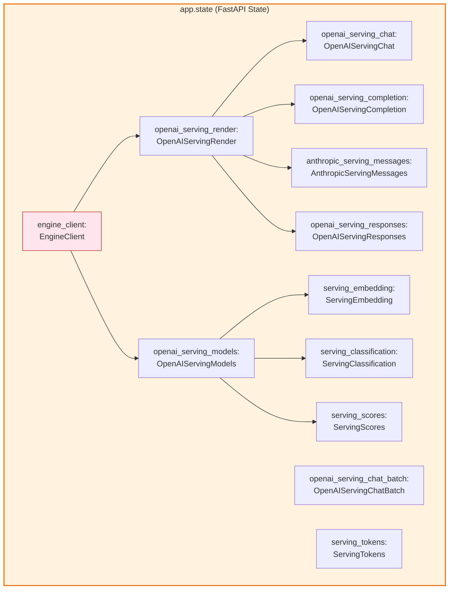

# vLLM 服务接口层（API Layer）源码分析

> **定位**：本文档分析 vLLM 的服务接口层（Service/API Layer），涵盖从 HTTP/gRPC 服务器入口、多协议 API 路由、CLI 命令到高级编程接口的完整链路。该层位于 Engine 层之上，负责将外部请求转化为引擎可处理的内部调用。



---

## 目录

- [一、OpenAI 兼容 API](#一openai-兼容-api)
  - [1.1 FastAPI 服务器入口](#11-fastapi-服务器入口)
  - [1.2 路由注册体系](#12-路由注册体系)
  - [1.3 核心端点定义](#13-核心端点定义)
  - [1.4 流式响应 SSE 实现](#14-流式响应-sse-实现)
  - [1.5 Orca Metrics](#15-orca-metrics)
- [二、Anthropic API](#二anthropic-api)
  - [2.1 协议模型 protocol.py](#21-协议模型-protocolpy)
  - [2.2 路由定义 api_router.py](#22-路由定义-apirouterpy)
  - [2.3 消息格式转换 serving.py](#23-消息格式转换-servingpy)
- [三、gRPC Server](#三grpc-server)
- [四、CLI 入口](#四cli-入口)
- [五、Batch Serving 离线批处理](#五batch-serving-离线批处理)
- [六、SageMaker 集成](#六sagemaker-集成)
- [七、MCP Tool Server 模型上下文协议工具服务](#七mcp-tool-server-模型上下文协议工具服务)
- [八、Pooling 端点 嵌入池化接口](#八pooling-端点-嵌入池化接口)
- [九、LLM 高级 API](#九llm-高级-api)
- [十、SSL/TLS 支持](#十ssltls-支持)
- [十一、请求日志与访问过滤](#十一请求日志与访问过滤)
- [十二、API 请求路由与处理流程总览](#十二api-请求路由与处理流程总览)

---

## 一、OpenAI 兼容 API

### 1.1 FastAPI 服务器入口

vLLM 的 OpenAI 兼容服务器入口位于 [api_server.py](file:///workspace/vllm/entrypoints/openai/api_server.py)，基于 FastAPI 框架构建。整个启动流程分为以下几个关键阶段：

#### 1.1.1 引擎客户端构建

```python
# file: vllm/entrypoints/openai/api_server.py
# line: 77-105

@asynccontextmanager
async def build_async_engine_client(
    args: Namespace,
    *,
    usage_context: UsageContext = UsageContext.OPENAI_API_SERVER,
    client_config: dict[str, Any] | None = None,
) -> AsyncIterator[EngineClient]:
    # 支持 forkserver 多进程预加载模式
    if os.getenv("VLLM_WORKER_MULTIPROC_METHOD") == "forkserver":
        multiprocessing.set_start_method("forkserver")
        multiprocessing.set_forkserver_preload(["vllm.v1.engine.async_llm"])
        forkserver.ensure_running()

    engine_args = AsyncEngineArgs.from_cli_args(args)
    # ... client_config 处理 ...

    async with build_async_engine_client_from_engine_args(
        engine_args,
        usage_context=usage_context,
        client_config=client_config,
    ) as engine:
        yield engine
```

核心引擎创建逻辑在 `build_async_engine_client_from_engine_args` 中（第 108-154 行），它通过 `AsyncLLM.from_vllm_config()` 创建 V1 版本的 AsyncLLM 引擎实例，支持**进程内直接使用**和 **multiprocess RPC** 两种模式。

#### 1.1.2 FastAPI 应用构建 — `build_app()`

[build_app()](file:///workspace/vllm/entrypoints/openai/api_server.py#L157-L314) 是整个 API 服务的核心装配函数，根据 `supported_tasks` 动态注册路由：

```python
# file: vllm/entrypoints/openai/api_server.py
# line: 157-314 (核心部分)

def build_app(args, supported_tasks=None, model_config=None) -> FastAPI:
    app = FastAPI(lifespan=lifespan)

    # 1. 注册 vLLM Serve 扩展路由（render/tokenize 等）
    register_vllm_serve_api_routers(app)

    # 2. 注册模型管理路由 (/v1/models)
    register_models_api_router(app)

    # 3. 注册 SageMaker 兼容路由
    register_sagemaker_api_router(app, supported_tasks, model_config)

    # 4. 根据 supported_tasks 条件注册各类生成路由
    if "generate" in supported_tasks:
        register_generate_api_routers(app)   # chat/completions/responses/anthropic
        attach_disagg_router(app)            # disaggregated serving
        attach_rlhf_router(app)              # RLHF
        elastic_ep_attach_router(app)         # Elastic EP
        register_generative_scoring_api_router(app)

    if any(task in POOLING_TASKS for task in supported_tasks):
        register_pooling_api_routers(app, supported_tasks, model_config)

    # 5. 中间件配置
    app.add_middleware(CORSMiddleware, ...)
    app.exception_handler(HTTPException)(http_exception_handler)
    # ... 认证中间件、X-Request-ID 中间件、ScalingMiddleware ...
```

关键设计要点：
- **条件化路由注册**：仅当 `supported_tasks` 包含对应能力时才注册路由，避免无功能端点暴露
- **多层中间件栈**：CORS → 认证 → RequestID → Scaling → WebSocket Metrics → 自定义中间件
- **异常处理分级**：HTTPException / ValidationError / EngineGenerateError / EngineDeadError / GenerationError / Exception 六级异常处理器

### 1.2 路由注册体系

vLLM 采用**模块化路由注册**策略，各子模块独立管理自己的路由：



所有路由注册器位于 [generate/api_router.py](file:///workspace/vllm/entrypoints/openai/generate/api_router.py#L19-L42)：

```python
def register_generate_api_routers(app: FastAPI):
    register_chat_api_router(app)       # Chat Completions
    register_responses_api_router(app)   # Responses API
    register_completion_api_router(app)  # Text Completions
    register_anthropic_api_router(app)   # Anthropic Messages
```

### 1.3 核心端点定义

#### 1.3.1 Chat Completions — `/v1/chat/completions`

定义于 [chat_completion/api_router.py](file:///workspace/vllm/entrypoints/openai/chat_completion/api_router.py#L40-L75)：

```python
@router.post(
    "/v1/chat/completions",
    dependencies=[Depends(validate_json_request)],
    responses={
        HTTPStatus.OK.value: {"content": {"text/event-stream": {}}},
        ...
    },
)
@with_cancellation
@load_aware_call
async def create_chat_completion(request: ChatCompletionRequest, raw_request: Request):
    metrics_header_format = raw_request.headers.get(
        ENDPOINT_LOAD_METRICS_FORMAT_HEADER_LABEL, ""
    )
    handler = chat(raw_request)
    generator = await handler.create_chat_completion(request, raw_request)

    if isinstance(generator, ErrorResponse):
        return JSONResponse(content=generator.model_dump(), status_code=generator.error.code)
    elif isinstance(generator, ChatCompletionResponse):
        return JSONResponse(content=generator.model_dump(),
            headers=metrics_header(metrics_header_format))
    return StreamingResponse(content=generator, media_type="text/event-stream")
```

此外还支持 **Batch Chat Completion** 端点 `/v1/chat/completions/batch`（同文件第 77-102 行）。

#### 1.3.2 Text Completions — `/v1/completions`

通过 `register_completion_api_router` 注册，处理传统文本补全请求。

#### 1.3.3 Embeddings — `/v1/embeddings` & `/v2/embed`

定义于 [pooling/embed/api_router.py](file:///workspace/vllm/entrypoints/pooling/embed/api_router.py#L22-L40)：

```python
@router.post("/v1/embeddings", ...)
@with_cancellation
@load_aware_call
async def create_embedding(request: EmbeddingRequest, raw_request: Request):
    handler = embedding(raw_request)
    if handler is None:
        raise NotImplementedError("The model does not support Embeddings API")
    return await handler(request, raw_request)
```

同时提供 Cohere 兼容的 `/v2/embed` 端点。

### 1.4 流式响应 SSE 实现

vLLM 的流式响应遵循 **Server-Sent Events (SSE)** 协议。以 Chat Completion 为例：



返回类型判断逻辑（[chat_completion/api_router.py](file:///workspace/vllm/entrypoints/openai/chat_completion/api_router.py#L63-L74)）：
- `ErrorResponse` → JSONResponse + 错误状态码
- `ChatCompletionResponse`（非流式完整响应）→ JSONResponse + Orca Metrics header
- `AsyncGenerator`（流式）→ `StreamingResponse(media_type="text/event-stream")`

### 1.5 Orca Metrics

[orca_metrics.py](file:///workspace/vllm/entrypoints/openai/orca_metrics.py) 实现了 **ORCA (Open Runtime Compute Architecture)** 端点负载报告标准。该机制允许服务端在 HTTP 响应头中向负载均衡器（如 Envoy）报告实时负载指标。

#### 核心数据流

```python
# file: vllm/entrypoints/openai/orca_metrics.py
# line: 100-120

def metrics_header(metrics_format: str) -> Mapping[str, str] | None:
    """创建 ORCA endpoint-load-metrics 响应头"""
    if not metrics_format:
        return None
    named_metrics = get_named_metrics_from_prometheus()
    return create_orca_header(metrics_format, named_metrics)
```

指标采集过程：
1. 从 Prometheus 快照获取 Gauge 类型指标
2. 映射 Prometheus 指标名到 ORCA 名称（如 `vllm:kv_cache_usage_perc` → `kv_cache_usage_perc`）
3. 支持两种输出格式：
   - **TEXT 格式**：`endpoint-load-metrics: TEXT named_metrics.kv_cache_utilization=0.4`
   - **JSON 格式**：`endpoint-load-metrics: JSON {"named_metrics": {...}}`

---

## 二、Anthropic API

vLLM 提供了 **Anthropic Messages API** 的兼容实现，使 Claude SDK 可以无缝对接 vLLM 后端。

### 2.1 协议模型 protocol.py

[protocol.py](file:///workspace/vllm/entrypoints/anthropic/protocol.py) 定义了完整的 Anthropic API 数据模型，核心类包括：

| Pydantic Model | 用途 |
|---|---|
| `AnthropicMessagesRequest` | Messages API 请求体（model, messages, max_tokens, stream, tools...） |
| `AnthropicMessagesResponse` | Messages API 响应体（id, content, stop_reason, usage...） |
| `AnthropicStreamEvent` | 流式事件（message_start/delta/stop/content_block_start/delta/stop） |
| `AnthropicContentBlock` | 内容块（text/image/tool_use/tool_result/thinking/redacted_thinking） |
| `AnthropicCountTokensRequest/Response` | Token 计数请求/响应 |
| `AnthropicTool / AnthropicToolChoice` | 工具定义和工具选择参数 |

关键设计——vLLM 扩展字段：

```python
# file: vllm/entrypoints/anthropic/protocol.py
# line: 120-130

class AnthropicMessagesRequest(BaseModel):
    # ... 标准 Anthropic 字段 ...
    kv_transfer_params: dict[str, Any] | None = Field(
        default=None,
        description="KVTransfer parameters used for disaggregated serving.",
    )
    chat_template_kwargs: dict[str, Any] | None = Field(
        default=None,
        description="Additional keyword args to pass to the chat template renderer.",
    )
```

### 2.2 路由定义 api_router.py

[api_router.py](file:///workspace/vllm/entrypoints/anthropic/api_router.py) 注册两个端点：

```python
# file: vllm/entrypoints/anthropic/api_router.py
# line: 48-92

@router.post("/v1/messages", ...)          # Messages API 主端点
@with_cancellation
@load_aware_call
async def create_messages(request: AnthropicMessagesRequest, raw_request: Request):
    handler = messages(raw_request)
    generator = await handler.create_messages(request, raw_request)
    # 返回: ErrorResponse | AnthropicMessagesResponse | StreamingResponse

@router.post("/v1/messages/count_tokens", ...)  # Token 计数端点
@load_aware_call
@with_cancellation
async def count_tokens(request: AnthropicCountTokensRequest, raw_request: Request):
    response = await handler.count_tokens(request, raw_request)
    return JSONResponse(content=response.model_dump(exclude_none=True))
```

错误响应通过 `translate_error_response()` 将 vLLM 的 `ErrorResponse` 转换为 Anthropic 格式的 `AnthropicErrorResponse`。

### 2.3 消息格式转换 serving.py

[serving.py](file:///workspace/vllm/entrypoints/anthropic/serving.py) 中的 `AnthropicServingMessages` 类继承自 `OpenAIServingChat`，核心职责是 **Anthropic ↔ OpenAI 消息格式互转**：



格式转换的核心方法 `_convert_anthropic_to_openai_request()`（第 121-133 行）依次执行：
1. **系统消息转换** (`_convert_system_message`)：处理字符串型和结构化 system prompt
2. **用户/助手消息转换** (`_convert_messages`)：遍历消息列表
3. **内容块转换** (`_convert_block`)：逐块处理 text/image/thinking/tool_use/tool_result/tool_reference
4. **基础请求构建** (`_build_base_request`)：组装 ChatCompletionRequest
5. **流式选项处理** (`_handle_streaming_options`)
6. **工具选择/工具定义转换** (`_convert_tool_choice`, `_convert_tools`)

流式响应转换器 `message_stream_converter()`（第 511-811 行）是一个复杂的状态机，维护 `_ActiveBlockState` 来追踪当前活跃的内容块（thinking/text/tool_use），将 OpenAI 的 delta chunks 转换为 Anthropic 的 `content_block_start → content_block_delta → content_block_stop` 事件序列。

---

## 三、gRPC Server

[gRPC Server](file:///workspace/vllm/entrypoints/grpc_server.py) 为需要高性能 RPC 通信的场景提供了基于 gRPC 的服务入口。

### 架构概要

```python
# file: vllm/entrypoints/grpc_server.py
# line: 56-165

async def serve_grpc(args: argparse.Namespace):
    # 1. 创建引擎
    engine_args = AsyncEngineArgs.from_cli_args(args)
    vllm_config = engine_args.create_engine_config(usage_context=UsageContext.OPENAI_API_SERVER)
    async_llm = AsyncLLM.from_vllm_config(vllm_config=vllm_config, ...)

    # 2. 创建 Servicer
    servicer = VllmEngineServicer(async_llm, start_time)

    # 3. 创建 gRPC Server 并配置
    server = grpc.aio.server(options=[
        ("grpc.max_send_message_length", -1),     # 无限消息大小
        ("grpc.max_receive_message_length", -1),
        ("grpc.http2.min_recv_ping_interval_without_data_ms", 10000),  # 宽松 keepalive
        ("grpc.keepalive_permit_without_calls", True),
    ])

    # 4. 注册服务
    vllm_engine_pb2_grpc.add_VllmEngineServicer_to_server(servicer, server)
    health_pb2_grpc.add_HealthServicer_to_server(health_servicer, server)
    reflection.enable_server_reflection(service_names, server)  # 启用反射

    # 5. 绑定端口并启动
    server.add_insecure_port(f"{host}:{args.port}")
    await server.start()
```

### 关键特性

| 特性 | 说明 |
|---|---|
| **Protobuf 定义** | 来自 `smg_grpc_proto` 包的 `vllm_engine.proto` |
| **Health Check** | 集成标准 gRPC Health Checking（Kubernetes 就绪探针） |
| **Server Reflection** | 启用 gRPC 反射，支持 `grpcurl` 等工具调试 |
| **无限消息大小** | `max_send/receive_message_length = -1`，适配大模型输出 |
| **宽松 Keepalive** | 最小 ping 间隔 10s（默认 300s），避免长生成超时 |
| **优雅关闭** | SIGTERM/SIGINT 处理 → NOT_SERVING → 5s grace period → shutdown |

---

## 四、CLI 入口

vLLM 的 CLI 系统采用**子命令架构**，入口为 [cli/main.py](file:///workspace/vllm/entrypoints/cli/main.py)。

### 4.1 命令分发架构



### 4.2 各命令详解

#### `vllm serve` — 启动 API 服务器

[serve.py](file:///workspace/vllm/entrypoints/cli/serve.py) 中的 `ServeSubcommand` 是最核心的命令，支持三种运行模式：

```python
# file: vllm/entrypoints/cli/serve.py
# line: 43-122

class ServeSubcommand(CLISubcommand):
    @staticmethod
    def cmd(args: argparse.Namespace) -> None:
        # --grpc 模式：启动 gRPC 服务器
        if getattr(args, "grpc", False):
            uvloop.run(serve_grpc(args))
            return

        # --headless 模式：无 API 服务器，纯引擎工作节点
        if args.headless:
            run_headless(args)
            return

        # 根据 api_server_count 选择运行模式
        if args.api_server_count < 1:
            run_headless(args)
        elif args.api_server_count > 1:
            run_multi_api_server(args)     # 多 API 服务器 + 负载均衡
        else:
            uvloop.run(run_server(args))   # 单 API 服务器（默认）
```

**运行模式矩阵**：

| 模式 | 触发条件 | 说明 |
|---|---|---|
| 单 API Server | 默认（`api_server_count=1`） | 当前进程同时运行引擎+API |
| 多 API Server | `api_server_count > 1` | 多个 API 进程 + 共享引擎后端 |
| Headless | `--headless` 或 `api_server_count=0` | 仅运行引擎，不启动 HTTP |
| gRPC | `--grpc` | 使用 gRPC 替代 HTTP |

**多 API 服务器模式** ([run_multi_api_server](file:///workspace/vllm/entrypoints/cli/serve.py#L231-L322)) 支持三种负载均衡策略：
- **Internal LB**（默认）：`api_server_count = data_parallel_size`
- **External LB**：`--data-parallel-external-lb`，单 API 服务器
- **Hybrid LB**：`--data-parallel-hybrid-lb`，`api_server_count = data_parallel_size_local`

#### `vllm run-batch` — 离线批处理

[run_batch.py](file:///workspace/vllm/entrypoints/cli/run_batch.py) 封装了批处理入口：

```python
class RunBatchSubcommand(CLISubcommand):
    name = "run-batch"
    @staticmethod
    def cmd(args: argparse.Namespace) -> None:
        from vllm.entrypoints.openai.run_batch import main as run_batch_main
        if args.enable_metrics:
            start_http_server(port=args.port, addr=args.url)
        asyncio.run(run_batch_main(args))
```

#### `vllm chat` / `vllm complete` — 交互式客户端

[openai.py](file:///workspace/vllm/entrypoints/cli/openai.py) 提供两个交互式子命令：

- **`vllm chat`**：交互式聊天，支持 `--quick` 单轮模式和 `--system-prompt`
- **`vllm complete`**：文本补全交互模式

两者都使用 OpenAI Python SDK 连接本地 vLLM 服务器（默认 `http://localhost:8000/v1`）。

#### `vllm launch` — 组件级启动

[launch.py](file:///workspace/vllm/entrypoints/cli/launch.py) 支持启动独立组件：

```python
class RenderSubcommand(LaunchSubcommandBase):
    name = "render"
    help = "Launch a GPU-less rendering server (preprocessing and postprocessing only)."
```

`vllm launch render` 启动一个**无 GPU 的渲染服务器**，仅做预处理/后处理（tokenization、chat template rendering 等），适用于 CPU-only 推理场景。

#### `vllm collect-env` — 环境诊断

[collect_env.py](file:///workspace/vllm/entrypoints/cli/collect_env.py) 直接委托给 `vllm.collect_env.main()` 收集环境信息用于问题排查。

---

## 五、Batch Serving 离线批处理

[run_batch.py](file:///workspace/vllm/entrypoints/openai/run_batch.py) 实现了类似 OpenAI Batch API 的离线批处理能力。

### 整体流程



### 请求/响应模型

```python
# file: vllm/entrypoints/openai/run_batch.py
# line: 145-166

class BatchRequestInput(OpenAIBaseModel):
    """每行输入对象"""
    custom_id: str          # 用户自定义 ID，用于匹配输入输出
    method: str             # HTTP 方法，目前仅支持 POST
    url: str                # API 路径
    body: BatchRequestInputBody  # 请求体（自动按 URL 分发到对应模型）

class BatchRequestOutput(OpenAIBaseModel):
    """每行输出对象"""
    id: str                 # vLLM 生成的唯一 ID
    custom_id: str          # 对应输入的 custom_id
    response: BatchResponseData | None  # 成功时的响应
    error: Any | None       # 失败时的错误信息
```

支持的端点及对应的 body 类型：

| URL | Body Type |
|---|---|
| `/v1/chat/completions` | `ChatCompletionRequest` |
| `/v1/embeddings` | `EmbeddingRequest` |
| `/{model}/score` | `ScoreRequest` |
| `/{model}/rerank` | `RerankRequest` |
| `/v1/audio/transcriptions` | `BatchTranscriptionRequest`（含 `file_url`） |
| `/v1/audio/translations` | `BatchTranslationRequest`（含 `file_url`） |

### 端点注册表机制

[build_endpoint_registry()](file:///workspace/vllm/entrypoints/openai/run_batch.py#L693-L785) 构建了一个统一的端点注册表，每个条目包含 `url_matcher`、`handler_getter` 和可选的 `wrapper_fn`：

```python
endpoint_registry = {
    "completions": {
        "url_matcher": lambda url: url == "/v1/chat/completions",
        "handler_getter": lambda: openai_serving_chat.create_chat_completion or None,
        "wrapper_fn": None,
    },
    "transcriptions": {
        "url_matcher": lambda url: url == "/v1/audio/transcriptions",
        "handler_getter": lambda: openai_serving_transcription.create_transcription or None,
        "wrapper_fn": make_transcription_wrapper(is_translation=False, ...),  # 下载音频+转换
    },
    # ...
}
```

音频转录的 `make_transcription_wrapper` 会先从 URL 下载音频数据，构造 mock `UploadFile`，再调用常规处理函数。

### 文件 I/O

支持多种输入输出方式：
- **本地文件**：直接读写 `.jsonl` 文件
- **HTTP URL**：通过 aiohttp GET 读取 / PUT 写入（带重试，最多 5 次）
- **Data URL**：base64 编码的内联数据

---

## 六、SageMaker 集成

[SageMaker 模块](file:///workspace/vllm/entrypoints/sagemaker/) 使 vLLM 可以作为 Amazon SageMaker 推理端点运行。

### 路由设计

[api_router.py](file:///workspace/vllm/entrypoints/sagemaker/api_router.py) 注册两个 SageMaker 标准端点：

```python
# file: vllm/entrypoints/sagemaker/api_router.py
# line: 48-98

@router.post("/ping", response_class=Response)
@router.get("/ping", response_class=Response)
@sagemaker_standards.register_ping_handler
async def ping(raw_request: Request) -> Response:
    """Ping check — SageMaker 必需的健康检查端点"""
    return await health(raw_request)

@router.post("/invocations", ...)
@sagemaker_standards.register_invocation_handler
@sagemaker_standards.stateful_session_manager()
@sagemaker_standards.inject_adapter_id(adapter_path="model")
async def invocations(raw_request: Request):
    """统一推理端点 — 根据请求体自动路由到对应 handler"""
    body = await raw_request.json()
    # 遍历已注册的 invocation type validators
    for request_validator, endpoint in valid_endpoints:
        try:
            request = request_validator.validate_python(body)
        except pydantic.ValidationError:
            continue
        return await endpoint(request, raw_request)
```

### 关键特性

- **`model_hosting_container_standards`**：使用 AWS 开源的 SageMaker 标准库确保容器规范合规
- **`/invocations` 统一路由**：单一端点接收所有推理请求，通过 Pydantic 验证自动分派到正确的 handler
- **Stateful Session Manager**：支持有状态会话管理
- **Adapter ID 注入**：支持多模型 adapter 路由
- **Bootstrap**：`sagemaker_standards_bootstrap(app)` 在应用最后做标准化引导配置

---

## 七、MCP Tool Server 模型上下文协议工具服务

vLLM 通过 MCP (Model Context Protocol) 协议集成外部工具服务，使 LLM 可以调用外部工具。

### 架构设计



### ToolServer 抽象基类

[tool_server.py](file:///workspace/vllm/entrypoints/mcp/tool_server.py#L74-L99) 定义了三个抽象方法：

```python
class ToolServer(ABC):
    @abstractmethod
    def has_tool(self, tool_name: str) -> bool: ...
    @abstractmethod
    def get_tool_description(self, tool_name: str, ...) -> ToolNamespaceConfig | None: ...
    @abstractmethod
    def new_session(self, tool_name: str, session_id: str, ...) -> AbstractAsyncContextManager[Any]: ...
```

### MCPToolServer — 远程 MCP 工具连接器

[MCPToolServer](file:///workspace/vllm/entrypoints/mcp/tool_server.py#L102-194) 通过 SSE 协议连接远程 MCP 工具服务器：

```python
class MCPToolServer(ToolServer):
    async def add_tool_server(self, server_url: str):
        tool_urls = server_url.split(",")
        for url in tool_urls:
            url = f"http://{url}/sse"
            initialize_response, list_tools_response = await list_server_and_tools(url)
            list_tools_response = post_process_tools_description(list_tools_response)
            # 构建 Harmony 兼容的工具描述
            self.harmony_tool_descriptions[server_name] = ToolNamespaceConfig(...)
```

Schema 后处理 `trim_schema()` 和 `post_process_tools_description()` 将 MCP 生成的 JSON Schema 转换为 Harmony 库兼容格式，并过滤不需要注入 prompt 的工具。

### DemoToolServer — 内置演示工具

[DemoToolServer](file:///workspace/vllm/entrypoints/mcp/tool_server.py#L197-234) 提供两种内置工具：

| 工具 | 类 | 依赖 | 说明 |
|---|---|---|---|
| Browser | `HarmonyBrowserTool` | `EXA_API_KEY` + `gpt_oss` | 基于 Exa API 的网页浏览工具 |
| Python | `HarmonyPythonTool` | `gpt_oss` | Docker 沙盒代码解释器 |

具体实现在 [tool.py](file:///workspace/vllm/entrypoints/mcp/tool.py)：

```python
# file: vllm/entrypoints/mcp/tool.py
# line: 59-81

class HarmonyBrowserTool(Tool):
    def __init__(self):
        self.enabled = True
        exa_api_key = os.getenv("EXA_API_KEY")
        if not exa_api_key:
            self.enabled = False
            return
        validate_gpt_oss_install()
        browser_backend = ExaBackend(source="web", api_key=exa_api_key)
        self.browser_tool = SimpleBrowserTool(backend=browser_backend)
```

---

## 八、Pooling 端点 嵌入池化接口

Pooling 模块为**非生成类模型**（embedding、classification、scoring、reranking）提供 API 接口。

### 目录结构

```
entrypoints/pooling/
├── factories.py           # 工厂函数：IO Processor 初始化 & 路由注册
├── base/                  # 基础抽象层
│   ├── protocol.py        # PoolingRequest / PoolingResponse
│   ├── serving.py         # PoolingServingBase
│   └── io_processor.py    # PoolingIOProcessor (ABC)
├── embed/                 # 嵌入向量
│   ├── api_router.py      # /v1/embeddings, /v2/embed
│   ├── protocol.py        # EmbeddingRequest/Response, CohereEmbedRequest
│   ├── serving.py         # ServingEmbedding
│   └── io_processor.py    # EmbedIOProcessor, TokenEmbedIOProcessor
├── classify/              # 分类任务
│   ├── api_router.py      # 分类端点
│   ├── protocol.py        # ClassificationRequest/Response
│   ├── serving.py         # ServingClassification
│   └── io_processor.py    # ClassifyIOProcessor, TokenClassifyIOProcessor
├── scoring/               # 评分/重排序
│   ├── api_router.py      # /score, /rerank
│   ├── protocol.py        # ScoreRequest/Response, RerankRequest/Response
│   ├── serving.py         # ServingScores
│   └── io_processor.py    # ScoringIOProcessors
└── pooling/               # 通用 pooling
    ├── api_router.py      # 通用 pooling 端点
    ├── protocol.py        # PoolingRequest/Response
    ├── serving.py         # ServingPooling
    └── io_processor.py    # Plugin IO Processors
```

### 工厂函数 — [factories.py](file:///workspace/vllm/entrypoints/pooling/factories.py)

#### IO Processor 初始化

[init_pooling_io_processors()](file:///workspace/vllm/entrypoints/pooling/factories.py#L38-L101) 根据 `pooling_task` 创建对应的 IO Processor：

```python
def init_pooling_io_processors(supported_tasks, vllm_config, renderer, chat_template_config):
    processors = {}
    pooling_task = model_config.get_pooling_task(supported_tasks)

    if pooling_task == "classify":
        processors["classify"] = ClassifyIOProcessor
    if pooling_task == "embed":
        processors["embed"] = EmbedIOProcessor
    if has_io_processor(vllm_config, ...):
        processors["plugin"] = PluginWithIOProcessorPlugins
    if enable_scoring_api(supported_tasks, model_config):
        processors[score_type] = ScoringIOProcessors[score_type]
    # Jina 特殊处理...
    return {task: processor_cls(...) for task, processor_cls in processors.items()}
```

#### API 路由注册

[register_pooling_api_routers()](file:///workspace/vllm/entrypoints/pooling/factories.py#L104-L134) 按 capability 注册路由：

```python
def register_pooling_api_routers(app, supported_tasks, model_config):
    pooling_task = model_config.get_pooling_task(supported_tasks)
    if pooling_task is not None:
        app.include_router(pooling_router)       # 通用 pooling
    if "classify" in supported_tasks:
        app.include_router(classify_router)      # 分类
    if "embed" in supported_tasks:
        app.include_router(embed_router)         # 嵌入
    if enable_scoring_api(supported_tasks, model_config):
        app.include_router(score_router)         # 评分/重排序
```

### 支持的任务类型映射

| pooling_task | IO Processor | API 端点 | 用途 |
|---|---|---|---|
| `embed` | EmbedIOProcessor | `/v1/embeddings` | 文本嵌入向量 |
| `token_embed` | TokenEmbedIOProcessor | `/v1/embeddings` | 多向量检索 |
| `classify` | ClassifyIOProcessor | classify 端点 | 分类 logits |
| `token_classify` | TokenClassifyIOProcessor | classify 端点 | Token 级分类 |
| `cross-encoder` | ScoringIOProcessors | `/score`, `/rerank` | 相似度评分/重排序 |
| `plugin` | Plugin IO Processor | 自定义 | 可扩展插件 |

---

## 九、LLM 高级 API

[llm.py](file:///workspace/vllm/entrypoints/llm.py) 提供了面向 Python 开发者的**高级编程接口**，适用于离线推理、批量处理等场景。

### 类概览

```python
# file: vllm/entrypoints/llm.py
# line: 106-211

class LLM:
    """
    An LLM for generating texts from given prompts and sampling parameters.
    This class includes a tokenizer, a language model (possibly distributed
    across multiple GPUs), and GPU memory space allocated for intermediate
    states (aka KV cache).

    Note: This class is intended to be used for offline inference.
    For online serving, use the AsyncLLMEngine class instead.
    """
```

### 核心方法体系



### 9.1 generate() — 文本生成

[generate()](file:///workspace/vllm/entrypoints/llm.py#L446-L509) 是最基本的文本生成接口：

```python
def generate(
    self,
    prompts: PromptType | Sequence[PromptType],
    sampling_params: SamplingParams | Sequence[SamplingParams] | None = None,
    *,
    use_tqdm: bool | Callable[..., tqdm] = True,
    lora_request: ...,
    priority: list[int] | None = None,
    tokenization_kwargs: dict[str, Any] | None = None,
    mm_processor_kwargs: dict[str, Any] | None = None,
) -> list[RequestOutput]:
```

内部调用链：`generate()` → `_run_completion()` → `_add_completion_requests()` → `_preprocess_cmpl()` → `_add_request()` → `LLMEngine.add_request()` → `_run_engine()` （step 循环）

### 9.2 encode() — 通用池化

[encode()](file:///workspace/vllm/entrypoints/llm.py#L1075-L1160) 是 pooling 模型的通用入口：

```python
def encode(
    self,
    prompts: PromptType | Sequence[PromptType] | DataPrompt,
    pooling_params: PoolingParams | Sequence[PoolingParams] | None = None,
    *,
    pooling_task: PoolingTask | None = None,  # 必须指定！
    ...
) -> list[PoolingRequestOutput]:
```

**必须显式指定 `pooling_task`**，支持的值包括：
- `"embed"` — 嵌入向量（推荐用 `embed()` 便捷方法）
- `"classify"` — 分类（推荐用 `classify()` 便捷方法）
- `"token_classify"` — Token 级分类
- `"token_embed"` — 多向量检索
- `"plugin"` — 自定义插件任务

### 9.3 chat() — 对话生成

[chat()](file:///workspace/vllm/entrypoints/llm.py#L981-L1073) 提供对话式生成接口，内部完成 conversation → prompt 的渲染：

```python
def chat(
    self,
    messages: list[ChatCompletionMessageParam] | Sequence[list[...]],
    sampling_params: ...,
    chat_template: str | None = None,
    chat_template_content_format: ... = "auto",
    add_generation_prompt: bool = True,
    tools: list[dict[str, Any]] | None = None,
    ...
) -> list[RequestOutput]:
```

### 9.4 异步流水线模式

`enqueue()` + `wait_for_completion()` 组合允许**异步提交 + 批量等待**的模式：

```python
# 先批量入队
request_ids = llm.enqueue(prompts, sampling_params)
# ... 做其他事情 ...
# 统一等待结果
outputs = llm.wait_for_completion()
```

### 9.5 束搜索 beam_search()

[beam_search()](file:///workspace/vllm/entrypoints/llm.py#L691-L846) 实现了完整的束搜索算法：

1. 初始化：每个 prompt 创建 `BeamSearchInstance`（包含 `beam_width` 个候选序列）
2. 迭代：每步对所有 beam 执行一次单 token 生成
3. 剪枝：保留 top-`beam_width` 个累积 logprob 最高的序列
4. 终止：遇到 EOS 或达到 `max_tokens` 时移入 completed 列表

### 9.6 权重传输（RL 训练支持）

一组用于在线 RL 训练的方法：

```python
init_weight_transfer_engine(request)  # 初始化权重传输
start_weight_update(is_checkpoint_format)  # 开始新的权重更新周期
update_weights(request)  # 更新权重
finish_weight_update()  # 结束权重更新
```

---

## 十、SSL/TLS 支持

[ssl.py](file:///workspace/vllm/entrypoints/ssl.py) 提供了 **SSL 证书热更新** 能力。

### SSLCertRefresher

```python
# file: vllm/entrypoints/ssl.py
# line: 15-76

class SSLCertRefresher:
    """监控 SSL 证书文件并在变更时自动重新加载"""

    def __init__(self, ssl_context, key_path=None, cert_path=None, ca_path=None):
        self.ssl = ssl_context
        # 监控证书链文件（key + cert）
        if self.key_path and self.cert_path:
            self.watch_ssl_cert_task = asyncio.create_task(
                self._watch_files([key_path, cert], update_ssl_cert_chain))
        # 监控 CA 证书文件
        if self.ca_path:
            self.watch_ssl_ca_task = asyncio.create_task(
                self._watch_files([ca_path], update_ssl_ca))
```

**工作机制**：
1. 使用 `watchfiles` 库的 `awatch()` 异步监控证书文件变化
2. 检测到变更时调用 `SSLContext.load_cert_chain()` 或 `load_verify_locations()` 热加载
3. 无需重启服务器即可完成证书轮换
4. 通过 `stop()` 方法取消监控任务

---

## 十一、请求日志与访问过滤

[access_log_filter.py](file:///workspace/vllm/logging_utils/access_log_filter.py) 提供 uvicorn 访问日志过滤功能。

### UvicornAccessLogFilter

```python
# file: vllm/logging_utils/access_log_filter.py
# line: 15-68

class UvicornAccessLogFilter(logging.Filter):
    """
    排除指定路径的 uvicorn 访问日志。
    
    uvicorn 日志格式: '%s - "%s %s HTTP/%s" %d'
    例: 127.0.0.1:12345 - "GET /health HTTP/1.1" 200
    """

    def filter(self, record: logging.LogRecord) -> bool:
        # 仅处理 uvicorn.access logger
        if record.name != "uvicorn.access":
            return True
        # 从 log args 元组提取 path（第3个元素）
        path = urlparse(log_args[2]).path
        if path in self.excluded_paths:
            return False  # 过滤掉
        return True
```

### 配置生成

[create_uvicorn_log_config()](file:///workspace/vllm/logging_utils/access_log_filter.py#L71-L144) 生成完整的 uvicorn logging configuration dict，将 `UvicornAccessLogFilter` 注入 access handler 的 filters 列表中。

**典型用途**：排除 `/health`、`/metrics` 等高频健康检查端点的日志，减少生产环境日志噪音。

---

## 十二、API 请求路由与处理流程总览

以下是 vLLM 从接收到返回一个完整请求的全链路：



### 中间件处理顺序


### EngineClient 与 Serving 层的关系



---

> **文档信息**：基于 vLLM 源码 `/workspace/vllm` 分析，覆盖 `entrypoints/` 目录下全部主要服务接口模块。各代码引用均标注了源文件路径和行号，便于交叉验证和深入阅读。
