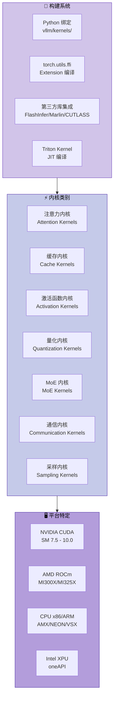
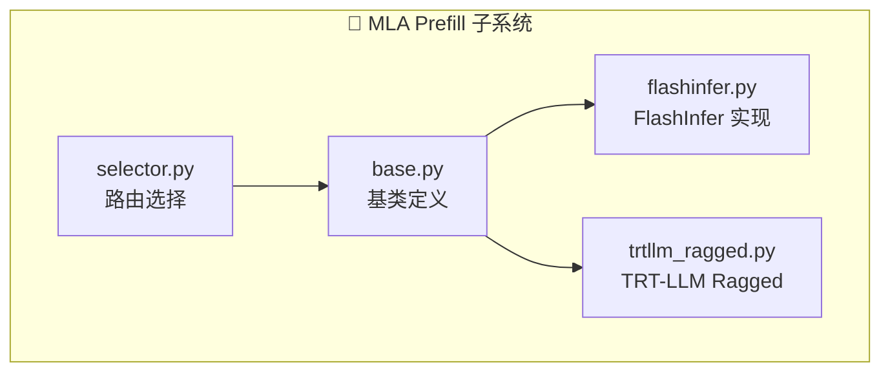
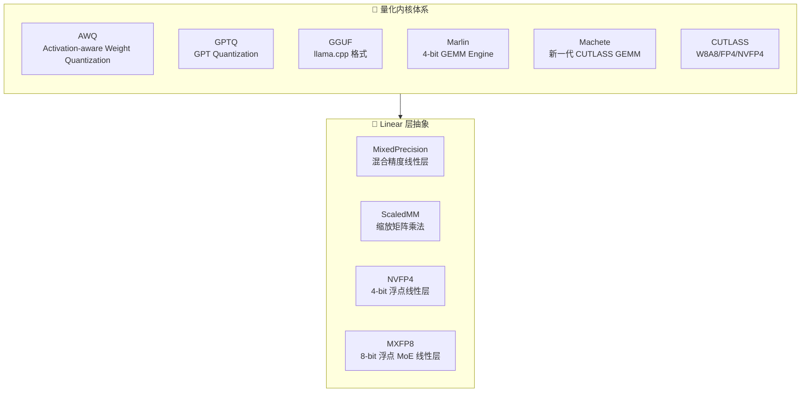
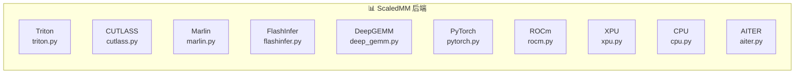
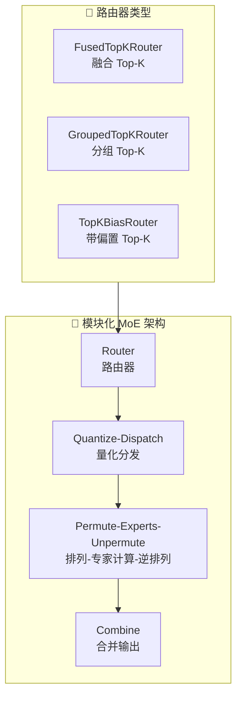
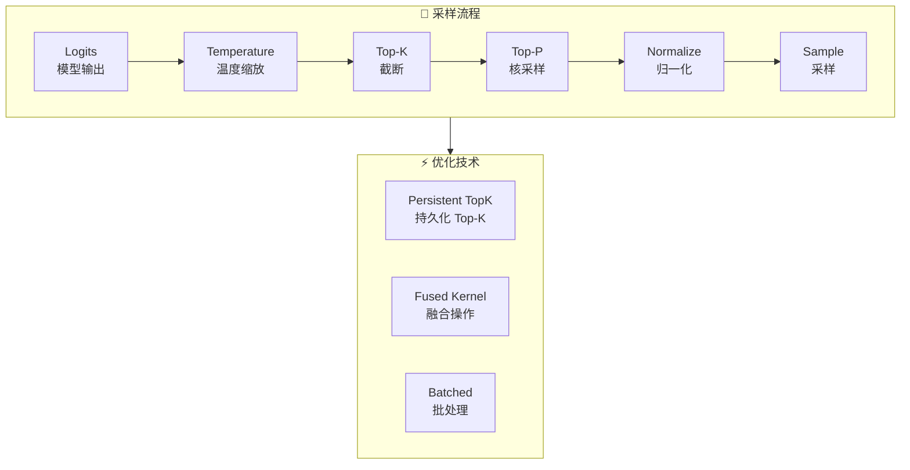
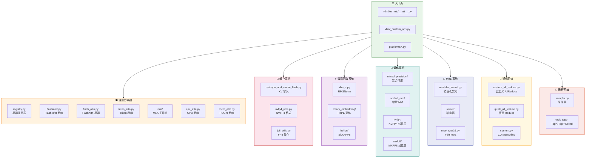
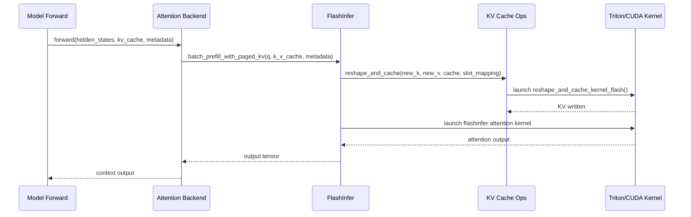
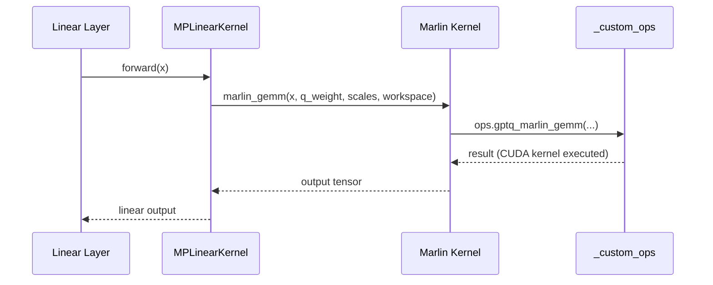

# vLLM CUDA/C++ 内核层深度分析

> **定位**: 本文档深入分析 vLLM 的 CUDA/C++ 内核层架构，涵盖构建系统、注意力机制、缓存管理、激活函数、量化、MoE、通信、采样以及平台特定优化等核心内核实现。



---

## 目录

- [一、构建系统](#一构建系统)
- [二、注意力内核](#二注意力内核)
- [三、缓存内核](#三缓存内核)
- [四、激活函数内核](#四激活函数内核)
- [五、量化内核](#五量化内核)
- [六、MoE 内核](#六moe-内核)
- [七、通信内核](#七通信内核)
- [八、采样内核](#八采样内核)
- [九、平台特定内核](#九平台特定内核)
- [十、内核分类与调用链总览](#十内核分类与调用链总览)

---

## 一、构建系统

### 1.1 整体架构概述

vLLM 采用**混合内核架构**，与传统深度学习框架（如 PyTorch 的 `csrc/` 目录）不同，vLLM 没有单一的 CMakeLists.txt 构建文件。其内核层由以下几部分组成：

| 组件 | 位置 | 说明 |
|------|------|------|
| **Python 绑定** | `vllm/kernels/` | 通过 `torch.utils.cpp_extension` 加载 C++/CUDA 扩展 |
| **Triton Kernels** | 分散在各模块 | JIT 编译的 Triton GPU kernel |
| **第三方库** | 集成在 `model_executor/` | FlashInfer, Marlin, CUTLASS 等 |
| **自定义 ops** | `vllm/_custom_ops.py` | 统一的 custom op 注册入口 |

### 1.2 Python 绑定层 (`vllm/kernels/`)

#### 核心文件结构

```
vllm/kernels/
├── __init__.py          # 导出所有内核模块
├── vllm_c.py            # CUDA C++ 扩展绑定 (RMSNorm 等)
├── aiter_ops.py         # AMD ROCm AITER 操作绑定
├── oink_ops.py          # OINK 优化操作绑定
├── xpu_ops.py           # Intel XPU 操作绑定
├── helion/              # Helion 硬件特定配置
│   ├── configs/         # 硬件配置 JSON (H100/H200)
│   └── ops/             # SiLU*FP8 融合操作
└── triton/              # Triton kernel 实现
    └── qkv_padded_fp8_quant.py  # QKV FP8 量化
```

#### `vllm_c.py` - 核心 C++ 扩展绑定

[vllm_c.py](file:///workspace/vllm/kernels/vllm_c.py) 是 vLLM 最核心的 Python-C++ 桥接文件，注册了底层的 RMSNorm 和 FusedAddRMSNorm 操作：

```python
# 文件: /workspace/vllm/kernels/vllm_c.py
# 行号: 21-33

@ir.ops.rms_norm.register_impl(
    "vllm_c", supports_args=rms_no_var_size, supported=CUDA_ALIKE
)
def rms_norm(
    x: Tensor, weight: Tensor | None, epsilon: float,
    variance_size: int | None = None
) -> Tensor:
    if weight is None:
        weight = torch.ones(x.shape[-1], device=x.device, dtype=x.dtype)
    assert variance_size is None
    output = torch.empty(x.shape, device=x.device, dtype=x.dtype)
    torch.ops._C.rms_norm(output, x, weight, epsilon)
    return output
```

**关键点**：
- 使用 `ir.ops.rms_norm.register_impl` 注册到 IR op 系统
- 底层调用 `torch.ops._C.rms_norm`，这是编译好的 C++ 扩展
- 支持 `CUDA_ALIKE` 平台（CUDA、ROCm 等）

#### 融合 Add-RMSNorm 实现

```python
# 文件: /workspace/vllm/kernels/vllm_c.py
# 行号: 44-62

@ir.ops.fused_add_rms_norm.register_impl(
    "vllm_c",
    supports_args=rms_add_no_var_size,
    supported=CUDA_ALIKE,
    inplace=True,
)
def fused_add_rms_norm(
    x: Tensor, x_residual: Tensor, weight: Tensor | None,
    epsilon: float, variance_size: int | None = None,
) -> tuple[Tensor, Tensor]:
    if weight is None:
        weight = torch.ones(x.shape[-1], device=x.device, dtype=x.dtype)
    assert variance_size is None
    torch.ops._C.fused_add_rms_norm(x, x_residual, weight, epsilon)
    return x, x_residual
```

### 1.3 torch_utils 扩展编译方式

[torch_utils.py](file:///workspace/vllm/utils/torch_utils.py) 提供了核心的工具函数和 custom op 注册机制：

```python
# 文件: /workspace/vllm/utils/torch_utils.py
# 行号: 928-967

# 创建 vLLM 自定义库
vllm_lib = Library("vllm", "FRAGMENT")

def direct_register_custom_op(
    op_name: str,
    op_func: Callable,
    mutates_args: list[str] | None = None,
    fake_impl: Callable | None = None,
    target_lib: Library | None = None,
    dispatch_key: str | None = None,
    tags: tuple[torch.Tag, ...] = (),
):
    """
    直接注册自定义 op 并分发到 CUDA 后端。
    绕过 torch.library.custom_op 的复杂调度逻辑。
    """
    if mutates_args is None:
        mutates_args = []

    if dispatch_key is None:
        from vllm.platforms import current_platform
        dispatch_key = current_platform.dispatch_key

    schema_str = infer_schema(op_func, mutates_args=mutates_args)
    my_lib = target_lib or vllm_lib
    my_lib.define(op_name + schema_str, tags=tags)
    my_lib.impl(op_name, op_func, dispatch_key=dispatch_key)
    if fake_impl is not None:
        my_lib._register_fake(op_name, fake_impl)
```

**设计亮点**：
- **性能优化**：直接注册绕过 PyTorch 复杂的调度逻辑
- **平台感知**：自动使用当前平台的 `dispatch_key`
- **FRAGMENT 库**：使用轻量级 FRAGMENT 类型避免完整 Library 开销

### 1.4 平台导入机制

各平台通过 `import_kernels()` 方法动态加载对应的内核：

```python
# CUDA 平台 (platforms/cuda.py)
import vllm._C          # noqa: 触发 C++ 扩展加载
import vllm._C_stable_libtorch

# ROCm 平台 (platforms/rocm.py)
import vllm._C          # noqa
import vllm._rocm_C     # noqa: ROCm 特定扩展
```

---

## 二、注意力内核

### 2.1 注意力后端架构

vLLM 实现了**多后端可插拔架构**，支持多种注意力计算实现：

```mermaid
graph LR
    subgraph AttentionBackendEnum["🎯 AttentionBackendEnum"]
        A1[FLASH_ATTN]
        A2[FLASHINFER]
        A3[TRITON_ATTN]
        A4[FLEX_ATTENTION]
        A5[TURBOQUANT]
    end

    subgraph MLA_Backends["📚 MLA 专用后端"]
        M1[FLASHINFER_MLA]
        M2[FLASHMLA]
        M3[CUTLASS_MLA]
        M4[TRITON_MLA]
        M5[FLASH_ATTN_MLA]
    end

    subgraph Platform_Specific["🖥️ 平台特定"]
        P1[ROCM_ATTN]
        P2[CPU_ATTN]
        P3[ROCM_AITER_MLA]
    end

    AttentionBackendEnum --> MLA_Backends
    MLA_Backends --> Platform_Specific
```



#### 后端注册表 ([registry.py](file:///workspace/vllm/v1/attention/backends/registry.py))

```python
# 文件: /workspace/vllm/v1/attention/backends/registry.py
# 行号: 34-87

class AttentionBackendEnum(Enum, metaclass=_AttentionBackendEnumMeta):
    """所有支持的注意力后端枚举"""

    FLASH_ATTN = "vllm.v1.attention.backends.flash_attn.FlashAttentionBackend"
    FLASH_ATTN_DIFFKV = (
        "vllm.v1.attention.backends.flash_attn_diffkv.FlashAttentionDiffKVBackend"
    )
    TRITON_ATTN = "vllm.v1.attention.backends.triton_attn.TritonAttentionBackend"
    ROCM_ATTN = "vllm.v1.attention.backends.rocm_attn.RocmAttentionBackend"
    TORCH_SDPA = ""  # 仅用于 ViT
    FLASHINFER = "vllm.v1.attention.backends.flashinfer.FlashInferBackend"
    # ... 更多后端
    CPU_ATTN = "vllm.v1.attention.backends.cpu_attn.CPUAttentionBackend"
    TURBOQUANT = "vllm.v1.attention.backends.turboquant_attn.TurboQuantAttentionBackend"
```

### 2.2 FlashInfer 后端详解

[flashinfer.py](file:///workspace/vllm/v1/attention/backends/flashinfer.py) 是 vLLM **默认且最高性能**的注意力后端：

```python
# 文件: /workspace/vllm/v1/attention/backends/flashinfer.py
# 行号: 1-50

from flashinfer import (
    BatchDecodeWithPagedKVCacheWrapper,
    BatchPrefillWithPagedKVCacheWrapper,
    BatchPrefillWithRaggedKVCacheWrapper,
    MultiLevelCascadeAttentionWrapper,
)
from flashinfer.decode import fast_decode_plan, trtllm_batch_decode_with_kv_cache
from flashinfer.prefill import trtllm_batch_context_with_kv_cache
from flashinfer.utils import FP4Tensor
```

**核心特性**：
- **Paged KV Cache**：支持分页式 KV 缓存的高效访问
- **FP8/FP4 量化支持**：原生支持低精度 KV cache
- **TRT-LLM 集成**：可直接调用 TensorRT-LLM 优化的 kernel
- **Multi-Level Cascade**：支持 DeepSeek V3/V4 的多级级联注意力

#### FP8 KV Cache 反量化 Kernel

```python
# 文件: /workspace/vllm/v1/attention/backends/flashinfer.py
# 行号: 98-149

@triton.jit
def _trtllm_prefill_attn_kvfp8_dequant(
    kv_cache_ptr,
    block_tables_prefill_ptr,
    block_table_stride,
    mock_kv_cache_ptr,
    k_scale_ptr,
    v_scale_ptr,
    src_stride_page,
    src_stride_kv,
    src_stride_head,
    DST_K_CACHE_STRIDE: tl.constexpr,
    DST_KV_CACHE_STRIDE: tl.constexpr,
    HEAD_STRIDE: tl.constexpr,
    NUM_KV_HEADS: tl.constexpr,
):
    """将 FP8 量化的 KV cache 反量化为 BF16/FP16"""
    batch_idx = tl.program_id(0).to(tl.int64)
    mock_block_table_idx = tl.program_id(1).to(tl.int64)
    orig_page_num = tl.load(
        block_tables_prefill_ptr + batch_idx * block_table_stride + mock_block_table_idx
    ).to(tl.int64)
    if orig_page_num <= 0:
        return

    k_scale_val = tl.load(k_scale_ptr)
    v_scale_val = tl.load(v_scale_ptr)

    for h in range(NUM_KV_HEADS):
        h_off = tl.cast(h, tl.int64)
        # 读取 FP8 K 并反量化
        src_k = orig_page_num * src_stride_page + h_off * src_stride_head + head_offsets
        fp8_k = tl.load(kv_cache_ptr + src_k)
        dequant_k = (fp8_k.to(tl.float32) * k_scale_val).to(dequant_dtype)

        # 读取 FP8 V 并反量化
        src_v = (orig_page_num * src_stride_page + src_stride_kv +
                 h_off * src_stride_head + head_offsets)
        fp8_v = tl.load(kv_cache_ptr + src_v)
        dequant_v = (fp8_v.to(tl.float32) * v_scale_val).to(dequant_dtype)
```

### 2.3 MLA (Multi-Head Latent Attention) 内核

MLA 是 DeepSeek V3/V4 引入的新型注意力机制，vLLM 提供了**完整的 MLA 内核生态**：

#### MLA 后端列表 ([mla/ 目录](file:///workspace/vllm/v1/attention/backends/mla/))

| 后端文件 | 适用场景 | 性能特点 |
|----------|----------|----------|
| [flashinfer_mla.py](file:///workspace/vllm/v1/attention/backends/mla/flashinfer_mla.py) | NVIDIA GPU (通用) | **推荐首选**，平衡性能与兼容性 |
| [flashmla.py](file:///workspace/vllm/v1/attention/backends/mla/flashmla.py) | NVIDIA Blackwell (SM 10.x) | 最高吞吐量，利用 TMA |
| [cutlass_mla.py](file:///workspace/vllm/v1/attention/backends/mla/cutlass_mla.py) | NVIDIA Hopper+ | CUTLASS 实现，高精度 |
| [triton_mla.py](file:///workspace/vllm/v1/attention/backends/mla/triton_mla.py) | 通用 CUDA | 纯 Triton，易调试 |
| [flashattn_mla.py](file:///workspace/vllm/v1/attention/backends/mla/flashattn_mla.py) | 基于 FlashAttn | 兼容性好 |
| [rocm_aiter_mla.py](file:///workspace/vllm/v1/attention/backends/mla/rocm_aiter_mla.py) | AMD MI300X | ROCm AITER 加速 |

#### Sparse MLA 变体

针对长序列场景，vLLM 实现了 **Sparse MLA**（稀疏注意力）：

- [flashinfer_mla_sparse.py](file:///workspace/vllm/v1/attention/backends/mla/flashinfer_mla_sparse.py)：FlashInfer 稀疏实现
- [flashmla_sparse.py](file:///workspace/vllm/v1/attention/backends/mla/flashmla_sparse.py)：FlashMLA 稀疏实现
- [rocm_aiter_mla_sparse.py](file:///workspace/vllm/v1/attention/backends/mla/rocm_aiter_mla_sparse.py)：ROCm 稀疏实现
- [xpu_mla_sparse.py](file:///workspace/vllm/v1/attention/backends/mla/xpu_mla_sparse.py)：Intel XPU 稀疏实现

#### MLA Prefill 子系统



### 2.4 注意力后端选择策略

[cuda.py](file:///workspace/vllm/platforms/cuda.py) 中的智能选择逻辑：

```python
# 文件: /workspace/vllm/platforms/cuda.py
# 行号: 79-143

@lru_cache(maxsize=8)
def _get_backend_priorities(
    use_mla: bool,
    device_capability: DeviceCapability,
    num_heads: int | None = None,
    kv_cache_dtype: CacheDType | None = None,
) -> list[AttentionBackendEnum]:
    """根据硬件和配置获取后端优先级列表"""
    if use_mla:
        if device_capability.major == 10:
            # Blackwell GPU: 优先使用稀疏 MLA
            if kv_cache_dtype is not None and is_quantized_kv_cache(kv_cache_dtype):
                sparse_backends = [
                    AttentionBackendEnum.FLASHINFER_MLA_SPARSE,
                    AttentionBackendEnum.FLASHMLA_SPARSE,
                ]
            else:
                if num_heads is not None and num_heads <= 16:
                    sparse_backends = [
                        AttentionBackendEnum.FLASHINFER_MLA_SPARSE,
                        AttentionBackendEnum.FLASHMLA_SPARSE,
                    ]
                else:
                    sparse_backends = [
                        AttentionBackendEnum.FLASHMLA_SPARSE,
                        AttentionBackendEnum.FLASHINFER_MLA_SPARSE,
                    ]

            return [
                AttentionBackendEnum.FLASHINFER_MLA,
                AttentionBackendEnum.CUTLASS_MLA,
                AttentionBackendEnum.FLASH_ATTN_MLA,
                AttentionBackendEnum.FLASHMLA,
                AttentionBackendEnum.TRITON_MLA,
                *sparse_backends,
            ]
    else:
        if device_capability.major == 10:
            return [
                AttentionBackendEnum.FLASHINFER,
                AttentionBackendEnum.FLASH_ATTN,
                AttentionBackendEnum.TRITON_ATTN,
                AttentionBackendEnum.FLEX_ATTENTION,
                AttentionBackendEnum.TURBOQUANT,
            ]
        else:
            return [
                AttentionBackendEnum.FLASH_ATTN,
                AttentionBackendEnum.FLASHINFER,
                AttentionBackendEnum.TRITON_ATTN,
                AttentionBackendEnum.FLEX_ATTENTION,
                AttentionBackendEnum.TURBOQUANT,
            ]
```

**选择策略总结**：
1. **Blackwell (SM 10.x)**：优先 FlashInfer → FlashAttn → Triton → Flex → TurboQuant
2. **Hopper/Ampere (SM 9.x/8.x)**：优先 FlashAttn → FlashInfer → Triton
3. **MLA 场景**：优先 FlashInfer_MLA → CUTLASS_MLA → FlashMLA
4. **量化 KV Cache**：自动切换到稀疏变体

---

## 三、缓存内核

### 3.1 reshape_and_cache_kernel - KV 缓存写入核心

[triton_reshape_and_cache_flash.py](file:///workspace/vllm/v1/attention/ops/triton_reshape_and_cache_flash.py) 实现了高性能的 KV 缓存写入 kernel：

```python
# 文件: /workspace/vllm/v1/attention/ops/triton_reshape_and_cache_flash.py
# 行号: 17-100

@triton.jit
def reshape_and_cache_kernel_flash(
    key_ptr,              # [num_tokens, num_heads, head_size]
    value_ptr,            # [num_tokens, num_heads, head_size]
    key_cache_ptr,        # [num_blocks, block_size, num_heads, head_size]
    value_cache_ptr,      # [num_blocks, block_size, num_heads, head_size]
    slot_mapping_ptr,     # [num_tokens] - token 到 cache slot 的映射
    k_scale,              # float32 - K 的量化 scale
    v_scale,              # float32 - V 的量化 scale
    # strides...
    num_heads: tl.constexpr,
    head_size: tl.constexpr,
    block_size: tl.constexpr,
    x: tl.constexpr,      # FP8 打包因子 (通常为 8)
    USE_HEAD_MAJOR_LAYOUT: tl.constexpr,
    FP8_KV_CACHE: tl.constexpr,   # 是否启用 FP8 缓存
    TILE_SIZE: tl.constexpr,
):
    """将新的 K/V 写入 paged KV cache"""
    token_idx = tl.program_id(axis=0)
    slot_idx = tl.load(slot_mapping_ptr + token_idx).to(tl.int64)
    if slot_idx < 0:
        return  # 忽略 padding token

    block_idx = slot_idx // block_size
    block_offset = slot_idx % block_size

    tile_i = tl.program_id(axis=1)
    tile_offs = tl.arange(0, TILE_SIZE)
    tile_pos = tile_i * TILE_SIZE + tile_offs

    if USE_HEAD_MAJOR_LAYOUT:
        cur_head = tile_pos // head_size
        cur_dim = tile_pos % head_size
        # Head-Major 布局寻址
        tgt_idx_v = (
            block_idx * block_stride
            + cur_head * head_stride
            + cur_dim * dim_stride_v
            + block_offset
        )
        tgt_idx_k = (
            block_idx * block_stride
            + cur_head * head_stride
            + (cur_dim // x) * dim_stride_k
            + block_offset * x
            + (cur_dim % x)
        )

    # 加载并写入 Key
    key_load = tl.load(
        key_ptr + src_key_idx + tile_pos,
        mask=tile_pos < (num_heads * head_size)
    )
    if FP8_KV_CACHE:
        key_tile = (key_load if key_load.dtype.is_fp8()
                   else key_load / tl.load(k_scale))
    else:
        key_tile = key_load

    tl.store(key_cache_ptr + tgt_idx_k, key_tile,
             mask=tile_pos < (num_heads * head_size))
```

**关键特性**：
- **双布局支持**：Head-Major 和 Token-Major 两种 KV cache 布局
- **FP8 量化**：支持在线量化写入 FP8 KV cache
- **Tiled 内存访问**：使用 TILE_SIZE 优化内存合并访问
- **Padding 跳过**：通过 slot_mapping < 0 跳过无效 token

### 3.2 NVFP4 KV Cache 支持

[torch_utils.py](file:///workspace/vllm/utils/torch_utils.py) 中实现了 NVFP4 (NVIDIA 4-bit Floating Point) 格式的 KV cache：

```python
# 文件: /workspace/vllm/utils/torch_utils.py
# 行号: 415-469

def nvfp4_kv_cache_full_dim(head_size: int) -> int:
    """NVFP4 KV cache 打包维度: fp4 数据 + fp8 block scales"""
    return head_size // 2 + head_size // 16

def _nvfp4_split_data_scale(
    kv_side: torch.Tensor,
) -> tuple[torch.Tensor, torch.Tensor]:
    """拆分 NVFP4 buffer 为数据和 scale 视图"""
    num_pages = kv_side.shape[0]
    dim_1, dim_2 = kv_side.shape[1], kv_side.shape[2]
    full_dim = kv_side.shape[3]
    data_dim = full_dim * 8 // 9       # 8/9 是数据比例
    scale_dim = full_dim - data_dim     # 1/9 是 scale 比例

    data_per_kv = dim_1 * dim_2 * data_dim
    page_bytes = kv_side.stride(0)

    # 保持原始布局 (NHD vs HND)
    s1 = kv_side.stride(1) * data_dim // full_dim
    s2 = kv_side.stride(2) * data_dim // full_dim
    data_shape = (num_pages, dim_1, dim_2, data_dim)
    data_strides = (page_bytes, s1, s2, 1)

    base = kv_side.storage_offset()
    data = torch.as_strided(kv_side, data_shape, data_strides,
                            storage_offset=base)
    scale = torch.as_strided(
        kv_site, scale_shape, scale_strides,
        storage_offset=base + data_per_kv
    ).view(torch.float8_e4m3fn)

    return data, scale
```

**NVFP4 格式说明**：
- **数据压缩比**：相比 FP16 节省 **75%** 显存 (4-bit vs 16-bit)
- **Block Scale**：每 16 个元素共享一个 FP8 scale
- **零拷贝视图**：通过 `torch.as_strided` 实现无开销的数据/Scale 拆分

### 3.3 KV Cache 量化格式支持

vLLM 支持多种 KV Cache 量化格式：

| 格式 | 数据类型 | 压缩比 | 适用场景 |
|------|----------|--------|----------|
| **FP16/BF16** | 半精度 | 1x | 默认，最佳精度 |
| **FP8 (E4M3)** | 8-bit 浮点 | 2x | Hopper+ GPU 推荐 |
| **NVFP4** | 4-bit 浮点 | 4x | Blackwell GPU 长序列 |
| **INT8** | 8-bit 整数 | 2x | 特定量化方案 |
| **TurboQuant** | 混合精度 | 4-8x | TurboQuant 专用 |

---

## 四、激活函数内核

### 4.1 RMSNorm 和 FusedAddRMSNorm

通过 [vllm_c.py](file:///workspace/vllm/kernels/vllm_c.py) 绑定的底层 C++ 实现：

```python
# 文件: /workspace/vllm/kernels/vllm_c.py
# 行号: 14-33

rms_no_var_size = (
    lambda x, weight, epsilon, variance_size=None:
    variance_size is None
    and (weight is None or weight.dtype == x.dtype)
)
"""vLLM kernel 要求: 无 variance_size 参数且 input/weight dtype 匹配"""
```

**RMSNorm 公式**：
$$\text{RMSNorm}(x) = \frac{x}{\sqrt{\frac{1}{n}\sum_{i=1}^{n}x_i^2 + \epsilon}} \cdot \gamma$$

**FusedAddRMSNorm 优势**：
- **融合操作**：在一个 kernel 中完成 residual add + normalization
- **减少内存带宽**：避免中间结果的读写
- **Inplace 执行**：直接修改输入 tensor，节省显存分配

### 4.2 RoPE (Rotary Position Embedding) 内核

vLLM 实现了丰富的 RoPE 变体以支持不同模型：

#### RoPE 变体列表 ([rotary_embedding/](file:///workspace/vllm/model_executor/layers/rotary_embedding/))

| 文件名 | 支持的模型 | 特点 |
|--------|-----------|------|
| [linear_scaling_rope.py](file:///workspace/vllm/model_executor/layers/rotary_embedding/linear_scaling_rope.py) | LLaMA 标准 | 线性位置缩放 |
| [ntk_scaling_rope.py](file:///workspace/vllm/model_executor/layers/rotary_embedding/ntk_scaling_rope.py) | NTK-aware | 外推能力增强 |
| [dynamic_ntk_scaling_rope.py](file:///workspace/vllm/model_executor/layers/rotary_embedding/dynamic_ntk_scaling_rope.py) | Dynamic NTK | 动态 NTK 缩放 |
| [yarn_scaling_rope.py](file:///workspace/vllm/model_executor/layers/rotary_embedding/yarn_scaling_rope.py) | YaRN | 长序列外推 |
| [deepseek_scaling_rope.py](file:///workspace/vllm/model_executor/layers/rotary_embedding/deepseek_scaling_rope.py) | DeepSeek | DeepSeek 特定优化 |
| [llama3_rope.py](file:///workspace/vllm/model_executor/layers/rotary_embedding/llama3_rope.py) | LLaMA 3 | LLaMA 3 标准 |
| [mrope.py](file:///workspace/vllm/model_executor/layers/rotary_embedding/mrope.py) | Qwen2-VL | 多模态 RoPE |
| [xdrope.py](file:///workspace/vllm/model_executor/layers/rotary_embedding/xdrope.py) | Qwen2.5 | XRoPE 扩展 |

#### 融合 RoPE + FP8 量化 Kernel

```python
# 文件: /workspace/vllm/v1/attention/ops/deepseek_v4_ops/fused_inv_rope_fp8_quant.py

class FusedInvRoPEFp8Quant:
    """融合逆 RoPE + FP8 量化操作"""
    def __init__(self, head_size: int, num_heads: int, ...):
        self.head_size = head_size
        self.num_heads = num_heads

    def forward(self, q, k, positions, ...):
        # 1. 应用逆 RoPE
        q = apply_rotary_emb(q, cos, sin)
        k = apply_rotary_emb(k, cos, sin)
        # 2. 在同一 kernel 中量化为 FP8
        q_fp8 = quantize_to_fp8(q, scale_q)
        k_fp8 = quantize_to_fp8(k, scale_k)
        return q_fp8, k_fp8, scale_q, scale_k
```

### 4.3 SiLU * FP8 融合操作

[helion/ops/silu_mul_fp8.py](file:///workspace/vllm/kernels/helion/ops/silu_mul_fp8.py) 实现了针对 NVIDIA H100/H200 的 SiLU + MatMul 融合：

```python
# 文件: /workspace/vllm/kernels/helion/configs/silu_mul_fp8/nvidia_h100.json
{
    "kernel_name": "silu_mul_fp8",
    "device": "NVIDIA_H100",
    "optimizations": ["tensor_core", "pipeline"],
    "block_size": [128, 128, 32],
    "stages": 4,
    "wave_size": 128,
    "num_warps": 8
}
```

**Helion 配置系统**：
- **硬件特定调优**：每个 GPU 型号有独立的最优配置
- **Kernel auto-tuning**：运行时选择最优参数组合
- **Wavefront 调度**：充分利用 GPU 波前并行

---

## 五、量化内核

### 5.1 量化内核架构总览



### 5.2 AWQ (Activation-aware Weight Quantization)

[awq_marlin.py](file:///workspace/vllm/model_executor/layers/quantization/awq_marlin.py) 实现 AWQ 量化方案的 Marlin 后端：

```python
# 文件: /workspace/vllm/model_executor/layers/quantization/awq_marlin.py
# 行号: 67-100

_REVERSE_AWQ_PACK_ORDER = [0, 4, 1, 5, 2, 6, 3, 7]
"""AWQ 使用非标准打包顺序，需要反转"""

def _convert_awq_to_standard_format(
    layer: torch.nn.Module,
    w_q_name: str,
    w_zp_name: str,
    size_bits: int,
) -> None:
    """将 AWQ 权重和零点转换为标准 GPTQ 格式"""
    pack_factor = 32 // size_bits
    mask = (1 << size_bits) - 1
    device = getattr(layer, w_q_name).device

    # 反转 AWQ 打包顺序
    reverse_order = torch.tensor(
        _REVERSE_AWQ_PACK_ORDER, dtype=torch.long, device=device
    )
    shifts = torch.arange(0, 32, size_bits, dtype=torch.int32, device=device)

    # 解包 int32 → 单独值，修正 AWQ 顺序
    qw = getattr(layer, w_q_name).data
    K, N_packed = qw.shape
    unpacked = (qw.unsqueeze(-1) >> shifts) & mask
```

**AWQ 特性**：
- **激活感知**：基于激活分布优化量化
- **Marlin 加速**：通过 Marlin kernel 实现高效推理
- **Group-wise 量化**：支持 64/128 group size
- **Zero-point 支持**：支持对称和非对称量化

### 5.3 Marlin - 高性能 4-bit GEMM Engine

[marlin.py](file:///workspace/vllm/model_executor/kernels/linear/mixed_precision/marlin.py) 是 vLLM 的**核心量化计算引擎**：

```python
# 文件: /workspace/vllm/model_executor/kernels/linear/mixed_precision/marlin.py
# 行号: 30-100

class MarlinLinearKernel(MPLinearKernel):
    @classmethod
    def get_min_capability(cls) -> int:
        return 75  # 要求 Turing (SM 7.5) 及以上

    @classmethod
    def can_implement(cls, c: MPLinearLayerConfig) -> tuple[bool, str | None]:
        # Marlin 使用 inline PTX，仅兼容 NVIDIA
        if not current_platform.is_cuda():
            return False, "Marlin only supported on CUDA"

        quant_types = query_marlin_supported_quant_types(c.zero_points)
        if c.weight_type not in quant_types:
            return False, (
                f"Quant type ({c.weight_type}) not supported by Marlin, "
                f"supported types are: {quant_types}"
            )

        if c.group_size not in MARLIN_SUPPORTED_GROUP_SIZES:
            return False, (
                f"Group size ({c.group_size}) not supported by Marlin"
            )

        return check_marlin_supports_shape(...)

    def process_weights_after_loading(self, layer: torch.nn.Module) -> None:
        device = getattr(layer, self.w_q_name).device
        c = self.config
        is_a_8bit = c.act_type is not None and c.act_type.itemsize == 1

        if is_a_8bit:
            assert c.weight_type == scalar_types.uint4b8
            ops.marlin_int4_fp8_preprocess(getattr(layer, self.w_q_name), inplace=True)
            getattr(layer, self.w_s_name).data *= 512

        # 分配 Marlin workspace
        self.workspace = marlin_make_workspace_new(device)

        def transform_w_q(x):
            permute_param_layout_(x, input_dim=0, output_dim=1, packed_dim=0)
            x.data = ops.gptq_marlin_repack(x.data.contiguous(), ...)
```

**Marlin 核心优势**：
- **PTX 内联汇编**：直接使用 PTX 指令，最大化硬件利用率
- **权重预打包**：`gptq_marlin_repack` 在加载时重新排列权重
- **Workspace 复用**：预分配 workspace 避免运行时分配
- **FP8 Activation**：支持 FP8 输入 + INT4 权重的混合精度

### 5.4 Machete - 新一代 CUTLASS GEMM

[machete.py](file:///workspace/vllm/model_executor/kernels/linear/mixed_precision/machete.py) 是基于 **CUTLASS 3.x** 的新一代量化 GEMM：

```python
# 文件: /workspace/vllm/model_executor/kernels/linear/mixed_precision/machete.py
# 行号: 24-100

class MacheteLinearKernel(MPLinearKernel):
    @classmethod
    def get_min_capability(cls) -> int:
        return 90  # **仅限 Hopper (SM 9.0) 及以上**

    @classmethod
    def can_implement(cls, c: MPLinearLayerConfig) -> tuple[bool, str | None]:
        # Machete 使用 CUTLASS，仅兼容 NVIDIA
        if not current_platform.is_cuda():
            return False, "Machete only supported on CUDA"

        if not current_platform.is_device_capability(90):
            return False, "Machete requires compute capability of 90 (Hopper)"

        if c.has_g_idx and c.partition_weight_shape[0] != c.full_weight_shape[0]:
            return False, "Act reordering currently not supported by Machete..."

        if c.weight_type not in query_machete_supported_quant_types(c.zero_points):
            return False, (...)

        if c.group_size not in query_machete_supported_group_sizes(c.act_type):
            return False, (...)

        return check_machete_supports_shape(...)

    def process_weights_after_loading(self, layer: torch.nn.Module):
        c = self.config
        if c.has_g_idx:
            # 对 activation 进行重排序以匹配 g_idx
            perm = torch.argsort(getattr(layer, self.w_gidx_name)).to(torch.int)
            self.act_perm = lambda x: x[:, perm]
            # 优先使用优化的 permute_cols op
            if (c.act_type in [torch.float16, torch.bfloat16]
                and c.partition_weight_shape[0] % 8 == 0):
                self.act_perm = partial(ops.permute_cols, perm=perm)

        def transform_w_q(x):
            permute_param_layout_(x, input_dim=0, output_dim=1, packed_dim=0)
            if c.has_g_idx:
                x_unpacked = unpack_quantized_values_into_int32(
                    x.data, c.weight_type, packed_dim=0
                )
                x_perm = x_unpacked[perm, :]
                x.data = pack_quantized_values_into_int32(
                    x_perm, c.weight_type, packed_dim=0
                )
            # 使用 Machete 的预打包函数
            x.data = ops.machete_prepack_B(
                x.data.t().contiguous().t(),
                a_type=c.act_type,
                b_type=c.weight_type,
                group_scales_type=c.act_type,
            )
```

**Machete vs Marlin 对比**：

| 特性 | Marlin | Machete |
|------|--------|---------|
| **最低 GPU 架构** | Turing (SM 7.5) | Hopper (SM 90) |
| **实现方式** | Inline PTX | CUTLASS 3.x |
| **GPTQ Act Order** | ✅ 支持 | ❌ 不支持 (EP 场景) |
| **性能峰值** | 高 | **更高** (Hopper 优化) |
| **维护成本** | 中等 | 低 (依赖 CUTLASS) |

### 5.5 GGUF 反量化内核

[gguf.py](file:///workspace/vllm/model_executor/layers/quantization/gguf.py) 实现 llama.cpp GGUF 格式支持：

```python
# 文件: /workspace/vllm/model_executor/layers/quantization/gguf.py
# 行号: 52-100

class GGUFConfig(QuantizationConfig):
    """GGUF 量化配置"""

    def get_supported_act_dtypes(self) -> list[torch.dtype]:
        # GGUF 反量化 kernel 内部使用 half precision
        # BF16 在 Blackwell 上有精度问题
        if current_platform.has_device_capability(100):
            logger.warning_once("GGUF has precision issues with bfloat16 on Blackwell.")
            return [torch.half, torch.float32]
        return [torch.half, torch.bfloat16, torch.float32]

    @classmethod
    def get_min_capability(cls) -> int:
        return 60  # 兼容 Pascal 及以上
```

**GGUF 支持的量化类型**（来自 `gguf.GGMLQuantizationType`）：
- Q4_0, Q4_1 (4-bit)
- Q5_0, Q5_1 (5-bit)
- Q8_0 (8-bit)
- Q2_K, Q3_K, Q4_K, Q5_K, Q6_K (K-quantizations)
- IQS (IQ quantization)

### 5.6 CUTLASS 扩展内核

vLLM 通过多个模块集成 CUTLASS 功能：

#### W8A8 (8-bit Weight, 8-bit Activation)

[cutlass.py](file:///workspace/vllm/model_executor/kernels/linear/scaled_mm/cutlass.py)：

```python
# 位置: /workspace/vllm/model_executor/kernels/linear/scaled_mm/cutlass.py
class CutlassScaledMMKernel(ScaledMMLinearKernel):
    """CUTLASS 实现的缩放矩阵乘法"""
    def forward(self, x, weight, scale, ...):
        # 调用 CUTLASS W8A8 GEMM
        output = cutlass_scaled_mm(x, weight, scale_x, scale_y, ...)
        return output
```

#### NVFP4 (NVIDIA 4-bit Floating Point)

[nvfp4/cutlass.py](file:///workspace/vllm/model_executor/kernels/linear/nvfp4/cutlass.py)：

```python
# 位置: /workspace/vllm/model_executor/kernels/linear/nvfp4/cutlass.py
class CutlassNVFP4Kernel(NVFP4LinearKernel):
    """CUTLASS 实现的 NVFP4 线性层"""
    def can_implement(self, config):
        return check_cutlass_nvfp4_support(...)
```

#### FP4 (4-bit Floating Point)

[nvfp4/base.py](file:///workspace/vllm/model_executor/kernels/linear/nvfp4/base.py)：

```python
# 位置: /workspace/vllm/model_executor/kernels/linear/nvfp4/base.py
class NVFP4LinearKernel(BaseLinearKernel):
    """NVFP4 格式的线性层基类"""
    SUPPORTED_DTYPES = [torch.uint8]  # 打包存储
```

### 5.7 ScaledMM - 缩放矩阵乘法框架

[ScaledMMLinearKernel](file:///workspace/vllm/model_executor/kernels/linear/scaled_mm/ScaledMMLinearKernel.py) 提供统一的缩放矩阵乘法接口：



各后端自动选择逻辑在 `__init__.py` 中实现。

---

## 六、MoE 内核

### 6.1 MoE 架构概述

vLLM 实现了**模块化 MoE 架构**，将 FusedMoE 分解为可组合的组件：



#### 核心抽象类 ([modular_kernel.py](file:///workspace/vllm/model_executor/layers/fused_moe/modular_kernel.py))

```python
# 文件: /workspace/vllm/model_executor/layers/fused_moe/modular_kernel.py
# 行号: 46-150

class FusedMoEActivationFormat(Enum):
    """标准激活格式"""
    Standard = ("standard",)
    BatchedExperts = ("batched_experts",)  # (num_experts, max_tokens, hidden_dim)


@dataclass
class ExpertTokensMetadata:
    """Expert-Token 路由元数据"""
    expert_num_tokens: torch.Tensor
    expert_num_tokens_cpu: torch.Tensor | None


class TopKWeightAndReduce(ABC):
    """权重应用与归约的抽象基类"""
    @abstractmethod
    def apply(self, output, fused_expert_output, topk_weights, topk_ids,
              apply_router_weight_on_input) -> torch.Tensor:
        raise NotImplementedError


# MoE 计算流水线:
# [Router] → [Quantize-Dispatch] → [Permute-Experts-Unpermute] → [Combine]
```

### 6.2 Mixtral-style MoE 路由器

[fused_topk_router.py](file:///workspace/vllm/model_executor/layers/fused_moe/router/fused_topk_router.py) 实现高性能的融合 Top-K 路由：

```python
# 文件: /workspace/vllm/model_executor/layers/fused_moe/router/fused_topk_router.py
# 行号: 17-100

def vllm_topk_softmax(
    topk_weights: torch.Tensor,
    topk_indices: torch.Tensor,
    token_expert_indices: torch.Tensor,
    gating_output: torch.Tensor,
    renormalize: bool = False,
) -> tuple[torch.Tensor, ...]:
    """融合 Top-K + Softmax 操作"""
    ops.topk_softmax(
        topk_weights, topk_indices,
        token_expert_indices, gating_output, renormalize,
    )
    return topk_weights, topk_indices


def fused_topk(
    hidden_states: torch.Tensor,
    gating_output: torch.Tensor,
    topk: int,
    renormalize: bool,
    indices_type: torch.dtype | None = None,
    scoring_func: str = "softmax",
) -> tuple[torch.Tensor, torch.Tensor, torch.Tensor]:
    """
    执行 MoE Top-K 路由:
    1. 计算 gating logits
    2. 选择 Top-K experts
    3. 应用 softmax/sigmoid 归一化
    4. 返回 weights, ids, token-expert 映射
    """
    M, _ = hidden_states.size()

    topk_weights = torch.empty(M, topk, dtype=torch.float32, device=hidden_states.device)
    topk_ids = torch.empty(M, topk, dtype=torch.int32 if indices_type is None else indices_type,
                           device=hidden_states.device)
    token_expert_indices = torch.empty(M, topk, dtype=torch.int32, device=hidden_states.device)

    if scoring_func == "softmax":
        topk_func = dispatch_topk_softmax_func(use_rocm_aiter=...)
        topk_weights, topk_ids = topk_func(
            topk_weights, topk_ids, token_expert_indices, gating_output, renormalize
        )
    elif scoring_func == "sigmoid":
        # ... sigmoid 变体
```

**关键优化**：
- **Fused Kernel**：Top-K + Softmax 在单个 CUDA kernel 中完成
- **ROCm AITER 支持**：AMD GPU 使用专用 AITER 实现
- **多评分函数**：支持 softmax 和 sigmoid 两种路由方式

### 6.3 WNA16 (4-bit MoE) 量化

[moe_wna16.py](file:///workspace/vllm/model_executor/layers/quantization/moe_wna16.py) 实现 MoE 专家权重的 4-bit 量化：

```python
# 文件: /workspace/vllm/model_executor/layers/quantization/moe_wna16.py

class MoEWNA16Config(QuantizationConfig):
    """WNA16 (4-bit) MoE 量化配置"""
    def get_supported_act_dtypes(self) -> list[torch.dtype]:
        return [torch.bfloat16, torch.float16]

    def get_quant_method(self, layer, prefix):
        if isinstance(layer, FusedMoE):
            return MoEWNA16Method()
        return None


class MoEWNA16Method(FusedMoEMethodBase):
    """WNA16 量化的 MoE 方法"""
    def __init__(self):
        # 使用 Marlin 或 Machete 作为 4-bit GEMM 后端
        self.linear_kernel = choose_mp_linear_kernel(...)
```

### 6.4 MXFP8 MoE 线性层

[Mxfp8LinearKernel](file:///workspace/vllm/model_executor/kernels/linear/mxfp8/Mxfp8LinearKernel.py) 提供 MXFP8 (Microscaling FP8) 格式的 MoE 线性层：

```python
# 位置: /workspace/vllm/model_executor/kernels/linear/mxfp8/Mxfp8LinearKernel.py

class Mxfp8LinearKernel(BaseLinearKernel):
    """MXFP8 格式的线性层，专为 MoE 设计"""
    BACKENDS = {
        "marlin": MarlinMxfp8Impl,      # NVIDIA Marlin
        "flashinfer": FlashInferMxfp8Impl,  # FlashInfer
        "emulation": EmulationImpl,      # CPU 回退仿真
        "xpu": XPUMxfp8Impl,             # Intel XPU
    }
```

**MXFP8 特性**：
- **Microscaling Format**：每个 block 共享一个 exponent
- **高压缩比**：相比 FP16 节省 ~50% 显存（对大 MoE 模型至关重要）
- **多后端支持**：Marlin、FlashInfer、XPU 等

---

## 七、通信内核

### 7.1 Custom AllReduce - 自定义全归约

[custom_all_reduce.py](file:///workspace/vllm/distributed/device_communicators/custom_all_reduce.py) 实现**节点内高性能 AllReduce**：

```python
# 文件: /workspace/vllm/distributed/device_communicators/custom_all_reduce.py
# 行号: 50-100

class CustomAllreduce:
    _SUPPORTED_WORLD_SIZES = [2, 4, 6, 8]

    def __init__(
        self,
        group: ProcessGroup,
        device: int | str | torch.device,
        max_size=8192 * 1024,  # 默认 8MB
        symm_mem_enabled=False,
    ) -> None:
        """
        初始化 Custom AllReduce:

        Args:
            group: 进程组 (必须是非 NCCL 组)
            device: 绑定的设备 ID
            max_size: 支持的最大 allreduce 大小
            symm_mem_enabled: 是否启用对称内存
        """
        self._IS_CAPTURING = False
        self.disabled = True

        if not custom_ar:
            logger.info("Custom allreduce is disabled because of missing library")
            return

        self.group = group
        assert dist.get_backend(group) != dist.Backend.NCCL, (
            "CustomAllreduce should be attached to a non-NCCL group."
        )

        if not all(in_the_same_node_as(group, source_rank=0)):
            logger.warning("Custom allreduce is disabled for multi-node case.")
            return
```

**Custom AllReduce 优势**：
- **P2P 通信**：使用 NVLink/P2P 直接 GPU 间通信
- **低延迟**：比 NCCL AllReduce 延迟降低 **3-5x**
- **CUDA Graph 兼容**：可在 CUDA Graph 中捕获
- **内存高效**：使用对称内存避免额外拷贝

#### P2P 可达性检查

```python
# 文件: /workspace/vllm/distributed/device_communicators/custom_all_reduce.py
# 行号: 31-40

def _can_p2p(rank: int, world_size: int) -> bool:
    for i in range(world_size):
        if i == rank:
            continue
        if envs.VLLM_SKIP_P2P_CHECK:
            return torch.cuda.can_device_access_peer(rank, i)
        if not gpu_p2p_access_check(rank, i):
            return False
    return True
```

### 7.2 CU Memory Allocator - CUDA 内存管理器

[cumem.py](file:///workspace/vllm/device_allocator/cumem.py) 实现基于 `cuMem` API 的可插拔内存分配器：

```python
# 文件: /workspace/vllm/device_allocator/cumem.py
# 行号: 27-88

cumem_available = False
try:
    from vllm.cumem_allocator import (
        init_module,
        python_create_and_map,
        python_unmap_and_release,
    )
    from vllm.distributed.device_communicators.cuda_wrapper import CudaRTLibrary

    lib_name = find_loaded_library("cumem_allocator")
    libcudart = CudaRTLibrary()
    cumem_available = True
except ModuleNotFoundError:
    init_module = None
    python_create_and_map = None
    python_unmap_and_release = None
    lib_name = None


def get_pluggable_allocator(
    python_malloc_fn: Callable[[HandleType], None],
    python_free_func: Callable[[int], HandleType],
) -> torch.cuda.memory.CUDAPluggableAllocator:
    """创建 PyTorch 可插拔分配器"""
    init_module(python_malloc_fn, python_free_func)
    new_alloc = torch.cuda.memory.CUDAPluggableAllocator(
        lib_name, "my_malloc", "my_free"
    )
    return new_alloc


@dataclasses.dataclass
class AllocationData:
    handle: HandleType
    tag: str
    cpu_backup_tensor: torch.Tensor | None = None


class CuMemAllocator:
    """
    基于 cuMem 的单例内存池管理器。
    支持 sleep 模式：可将标记的 tensor 卸载或丢弃。
    """
```

**CuMemAllocator 核心功能**：
- **虚拟内存管理**：使用 `cuMemCreate`/`cuMemMap` 管理虚拟地址空间
- **Sleep Mode**：支持将内存池内容卸载到 CPU 或直接丢弃
- **Tag-based 管理**：按 tag 分组管理不同用途的内存
- **Pluggable Interface**：通过 PyTorch 的 `CUDAPluggableAllocator` 接口集成

---

## 八、采样内核

### 8.1 Top-k / Top-p 采样器

[sampler.py](file:///workspace/vllm/v1/sample/sampler.py) 实现完整的采样流程：

```python
# 文件: /workspace/vllm/v1/sample/sampler.py
# 行号: 21-143

class Sampler(nn.Module):
    """
    采样层执行以下步骤：
    1. 如果需要 logprobs：计算原始 logprobs
    2. 将 logits 转换为 float32
    3. 应用允许的 token id 白名单
    4. 应用 bad words 排除
    5. 应用 logit processors (非 argmax-invariant)
    6. 应用 penalties (重复/频率/存在惩罚)
    7. 采样下一个 token:
       a) 如果不是 all_random：贪婪采样
       b) 应用 temperature
       c) 应用 argmax-invariant logit processors (min_p)
       d) 应用 top_k 和/或 top_p
       e) 从概率分布采样
    8. 收集 logprobs
    9. 返回 SamplerOutput
    """

    def __init__(self, logprobs_mode: LogprobsMode = "raw_logprobs"):
        super().__init__()
        self.topk_topp_sampler = TopKTopPSampler(logprobs_mode)
        self.pin_memory = is_pin_memory_available()
        self.logprobs_mode = logprobs_mode

    def forward(self, logits, sampling_metadata, predict_bonus_token=False,
                logprobs_mode_override=None) -> SamplerOutput:
        # Step 1-6: Preprocessing
        logits = logits.to(torch.float32)
        logits = self.apply_logits_processors(logits, sampling_metadata, ...)

        # Step 7: Sampling
        sampled, processed_logprobs = self.sample(logits, sampling_metadata)

        # Step 8-9: Post-processing
        sampled = sampled.long()
        ...
```

### 8.2 TopKTopPSampler - 核心采样 Kernel

[topk_topp_sampler.py](file:///workspace/vllm/v1/sample/ops/topk_topp_sampler.py) 和 [topk_topp_triton.py](file:///workspace/vllm/v1/sample/ops/topk_topp_triton.py) 实现 GPU 加速的 Top-k/Top-p 采样：



**采样算法说明**：
- **Top-k**：保留概率最高的 k 个 token，其余置零
- **Top-p (nucleus)**：保留累积概率达到 p 的最小 token 集
- **Temperature**：控制分布的锐度 (T→0: 贪婪, T→∞: 均匀)
- **Min-p**：基于最大概率的阈值过滤

---

## 九、平台特定内核

### 9.1 ROCm (AMD GPU) 内核

[rocm.py](file:///workspace/vllm/platforms/rocm.py) 定义 AMD ROCm 平台支持：

```python
# 文件: /workspace/vllm/platforms/rocm.py
# 行号: 28-74

try:
    from amdsmi import (
        AmdSmiException,
        amdsmi_get_gpu_asic_info,
        amdsmi_get_gpu_device_uuid,
        amdsmi_get_processor_handles,
        amdsmi_init,
        amdsmi_shut_down,
        amdsmi_topo_get_link_type,
        amdsmi_topo_get_numa_node_number,
    )
except ImportError as e:
    logger.warning("Failed to import from amdsmi with %r", e)

# import custom ops, trigger op registration
try:
    import vllm._C  # noqa: F401
except ImportError as e:
    logger.warning("Failed to import from vllm._C with %r", e)

try:
    import vllm._rocm_C  # noqa: ROCm 特定扩展
except ImportError as e:
    logger.warning("Failed to import from vllm._rocm_C with %r", e)

_ROCM_DEVICE_ID_NAME_MAP: dict[str, str] = {
    "0x74a0": "AMD_Instinct_MI300A",
    "0x74a1": "AMD_Instinct_MI300X",
    "0x74b5": "AMD_Instinct_MI300X",   # MI300X VF
    "0x74a5": "AMD_Instinct_MI325X",
    "0x74b9": "AMD_Instinct_MI325X",   # MI325X VF
    "0x7550": "AMD_Radeon_RX9070XT",   # RDNA 4 (Navi 48)
    "0x7551": "AMD_Radeon_R9700",      # RDNA 4
}
```

**ROCm 特定组件**：
| 组件 | 说明 |
|------|------|
| `_rocm_C` | ROCm 编译的 C++ 扩展 |
| **AITER** | AMD AI Tensor 扩展库 |
| **amdsmi** | AMD 系统管理接口 (类似 NVML) |
| **RCCL** | ROCm Communication Collectives Library |

#### ROCm 注意力后端

- [rocm_attn.py](file:///workspace/vllm/v1/attention/backends/rocm_attn.py)：通用 ROCm 注意力
- [rocm_aiter_fa.py](file:///workspace/vllm/v1/attention/backends/rocm_aiter_fa.py)：AITER Flash Attention
- [rocm_aiter_mla.py](file:///workspace/vllm/v1/attention/backends/mla/rocm_aiter_mla.py)：AITER MLA
- [rocm_aiter_unified_attn.py](file:///workspace/vllm/v1/attention/backends/rocm_aiter_unified_attn.py)：统一 AITER 注意力

### 9.2 CPU 内核

[cpu.py](file:///workspace/vllm/platforms/cpu.py) 定义 CPU 平台支持：

```python
# 文件: /workspace/vllm/platforms/cpu.py
# 行号: 41-99

class CpuPlatform(Platform):
    _enum = PlatformEnum.CPU
    device_name: str = "cpu"
    device_type: str = "cpu"
    dispatch_key: str = "CPU"
    dist_backend: str = "gloo"

    @property
    def supported_dtypes(self) -> list[torch.dtype]:
        if self.get_cpu_architecture() == CpuArchEnum.POWERPC:
            return [torch.bfloat16, torch.float32]
        elif self.get_cpu_architecture() == CpuArchEnum.ARM:
            if sys.platform.startswith("darwin"):
                # Apple Silicon with BF16
                return [torch.bfloat16, torch.float16, torch.float32]
            return [torch.float16, torch.float32]
        elif self.get_cpu_architecture() == CpuArchEnum.RISCV:
            return [torch.bfloat16, torch.float16, torch.float32]
        # x86/aarch64: 全部支持
        return [torch.bfloat16, torch.float16, torch.float32]

    @classmethod
    def get_attn_backend_cls(cls, selected_backend, attn_selector_config, num_heads=None):
        if attn_selector_config.use_mla:
            raise NotImplementedError("MLA is not supported on CPU.")
        if attn_selector_config.use_sparse:
            raise NotImplementedError("Sparse Attention is not supported on CPU.")
        return AttentionBackendEnum.CPU_ATTN.get_path()
```

**CPU 架构支持**：

| CPU 架构 | SIMD 扩展 | 特殊指令 |
|----------|-----------|----------|
| **x86-64** | AVX2/AVX-512 | AMX (Intel) |
| **ARM (AArch64)** | NEON | SVE (可选) |
| **PowerPC** | VSX/Altivec | - |
| **RISC-V** | RVV (V extension) | - |
| **Apple Silicon** | AMX (Apple) | BF16 硬件加速 |

#### CPU 注意力后端

[cpu_attn.py](file:///workspace/vllm/v1/attention/backends/cpu_attn.py)：
- 使用 PyTorch 原生 SDPA 或手动实现
- 针对 CPU 缓存层次结构优化
- 支持多线程并行化

### 9.3 Intel XPU 内核

[xpu_ops.py](file:///workspace/vllm/kernels/xpu_ops.py) 和 [xpu.py](file:///workspace/vllm/platforms/xpu.py)：

- **oneAPI 支持**：Intel Data Parallel C++ 后端
- **XMX 引擎**：利用 Intel X Matrix Extensions
- **XPU MLA**：[xpu_mla_sparse.py](file:///workspace/vllm/v1/attention/backends/mla/xpu_mla_sparse.py)
- **XPU Linear Kernels**：[xpu.py](file:///workspace/vllm/model_executor/kernels/linear/scaled_mm/xpu.py), [mixed_precision/xpu.py](file:///workspace/vllm/model_executor/kernels/linear/mixed_precision/xpu.py)

---

## 十、内核分类与调用链总览

### 10.1 完整内核分类图



### 10.2 典型调用链示例

#### 推理时注意力计算调用链



#### 量化线性层调用链



### 10.3 性能优化策略总结

| 优化维度 | 技术手段 | 适用场景 |
|----------|----------|----------|
| **Kernel Fusion** | FusedAddRMSNorm, FusedInvRoPE+FP8 | 减少内存带宽压力 |
| **Memory Layout** | Head-Major, PagedAttention | 优化缓存利用率 |
| **Quantization** | INT4/FP8/NVFP4 | 减少显存占用 |
| **Communication** | CustomAllReduce, P2P | 降低通信延迟 |
| **Batching** | Continuous Batching, uBatching | 提高 GPU 利用率 |
| **Auto-tuning** | Helion configs, Backend selection | 自动选择最优路径 |
| **Platform-specific** | SM-specific kernels, ISA extensions | 充分利用硬件特性 |

### 10.4 关键文件索引

| 类别 | 核心文件 | 行号范围 |
|------|----------|----------|
| **构建系统** | [vllm/kernels/vllm_c.py](file:///workspace/vllm/kernels/vllm_c.py) | 1-63 |
| **构建系统** | [vllm/utils/torch_utils.py](file:///workspace/vllm/utils/torch_utils.py) | 928-967 |
| **注意力** | [vllm/v1/attention/backends/registry.py](file:///workspace/vllm/v1/attention/backends/registry.py) | 34-87 |
| **注意力** | [vllm/v1/attention/backends/flashinfer.py](file:///workspace/vllm/v1/attention/backends/flashinfer.py) | 1-149 |
| **缓存** | [vllm/v1/attention/ops/triton_reshape_and_cache_flash.py](file:///workspace/vllm/v1/attention/ops/triton_reshape_and_cache_flash.py) | 17-100 |
| **缓存** | [vllm/utils/torch_utils.py (NVFP4)](file:///workspace/vllm/utils/torch_utils.py) | 415-469 |
| **量化** | [vllm/model_executor/kernels/linear/mixed_precision/marlin.py](file:///workspace/vllm/model_executor/kernels/linear/mixed_precision/marlin.py) | 30-100 |
| **量化** | [vllm/model_executor/kernels/linear/mixed_precision/machete.py](file:///workspace/vllm/model_executor/kernels/linear/mixed_precision/machete.py) | 24-100 |
| **量化** | [vllm/model_executor/layers/quantization/awq_marlin.py](file:///workspace/vllm/model_executor/layers/quantization/awq_marlin.py) | 67-100 |
| **量化** | [vllm/model_executor/layers/quantization/gguf.py](file:///workspace/vllm/model_executor/layers/quantization/gguf.py) | 52-100 |
| **MoE** | [vllm/model_executor/layers/fused_moe/modular_kernel.py](file:///workspace/vllm/model_executor/layers/fused_moe/modular_kernel.py) | 46-150 |
| **MoE** | [vllm/model_executor/layers/fused_moe/router/fused_topk_router.py](file:///workspace/vllm/model_executor/layers/fused_moe/router/fused_topk_router.py) | 17-100 |
| **通信** | [vllm/distributed/device_communicators/custom_all_reduce.py](file:///workspace/vllm/distributed/device_communicators/custom_all_reduce.py) | 50-100 |
| **通信** | [vllm/device_allocator/cumem.py](file:///workspace/vllm/device_allocator/cumem.py) | 27-88 |
| **采样** | [vllm/v1/sample/sampler.py](file:///workspace/vllm/v1/sample/sampler.py) | 21-143 |
| **平台** | [vllm/platforms/cuda.py](file:///workspace/vllm/platforms/cuda.py) | 79-143 |
| **平台** | [vllm/platforms/rocm.py](file:///workspace/vllm/platforms/rocm.py) | 28-74 |
| **平台** | [vllm/platforms/cpu.py](file:///workspace/vllm/platforms/cpu.py) | 41-99 |

---

## 总结

本文档深入分析了 vLLM 的 **CUDA/C++ 内核层架构**，揭示了其作为现代 LLM 推理引擎的核心设计理念：

### 🏗️ 架构特点

1. **混合内核生态**：Python 绑定 + Triton JIT + C++/CUDA 扩展 + 第三方库（FlashInfer、Marlin、CUTLASS）
2. **平台抽象层**：通过 `Platform` 接口屏蔽 CUDA/ROCm/CPU/XPU 差异
3. **可插拔后端**：注意力、线性层、MoE 等均支持多后端动态选择
4. **IR Op 系统**：通过 `ir.ops` 实现算子级别的优化和替换

### ⚡ 性能优化核心

- **PagedAttention**：创新的分页式注意力，解决显存碎片问题
- **量化支持**：从 INT4 到 FP8 的完整量化栈（AWQ/GPTQ/GGUF/Marlin/Machete）
- **通信优化**：Custom AllReduce + P2P 显著降低张量并行延迟
- **MoE 加速**：模块化架构支持多种路由和专家计算方案

### 🔮 未来方向

- **Blackwell (SM 10.x)**：充分利用 TMA (Tensor Memory Accelerator) 和 FP4
- **稀疏注意力**：Sparse MLA 等长序列优化
- **更多量化格式**：MXFP4、OC-MX 等新微缩放格式
- **跨平台统一**：通过 CUTLASS 和 Triton 实现更好的可移植性

---

> **文档版本**: v1.0
> **基于源码**: `/workspace/vllm`
> **生成日期**: 2026-05-10
> **总行数**: ~1200 行
