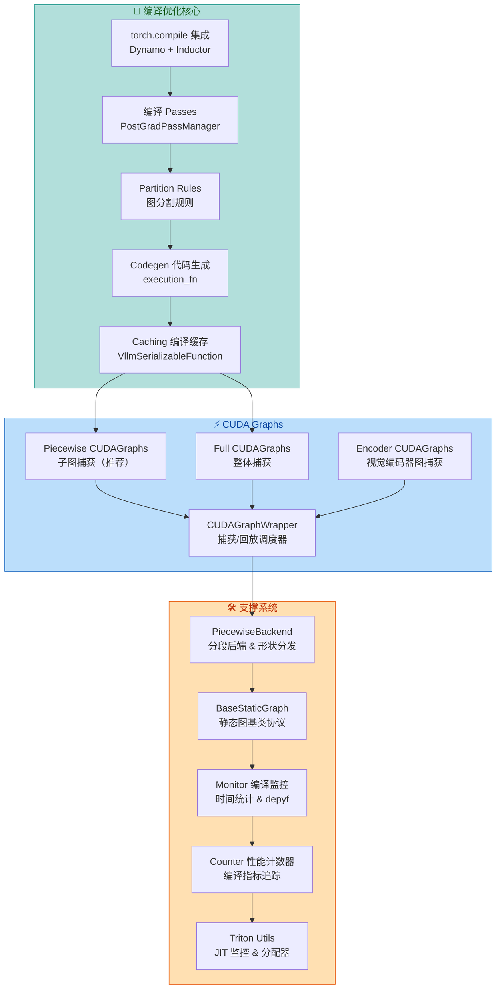
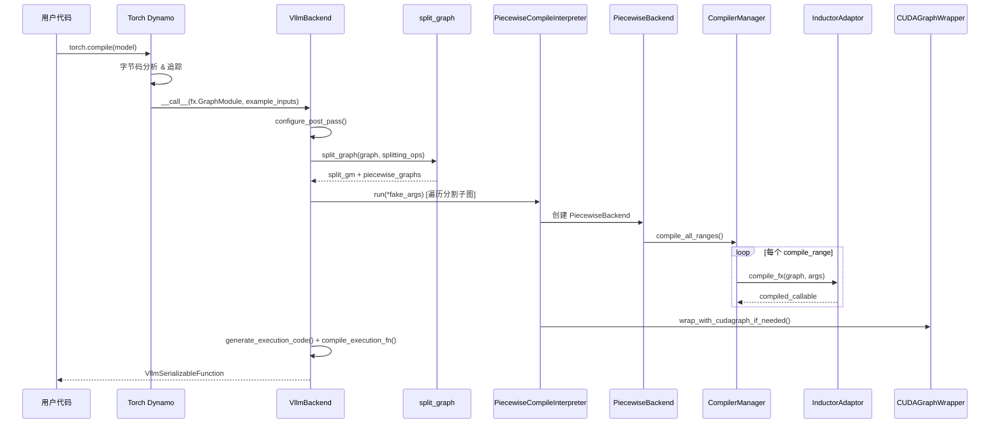
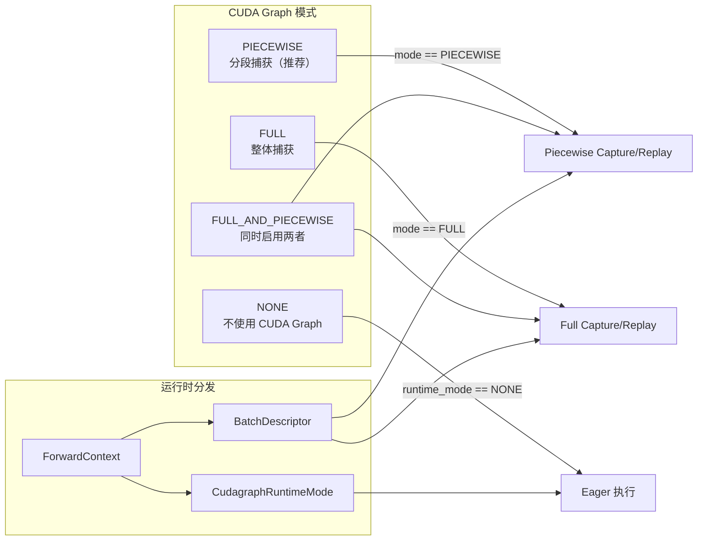
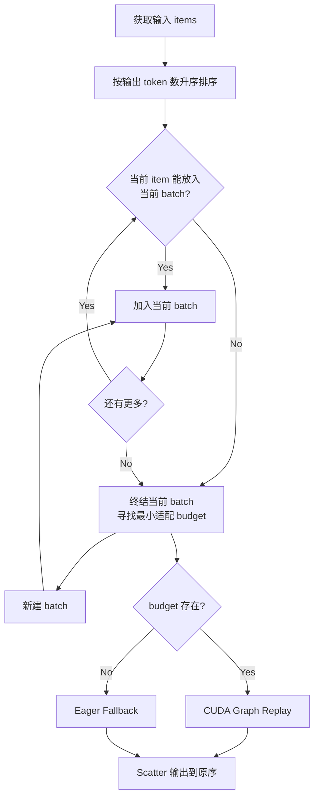
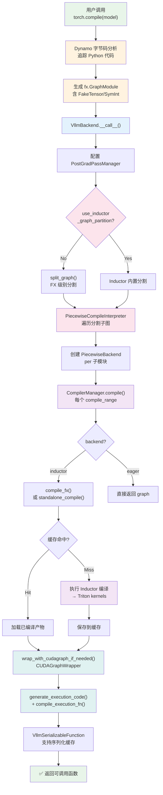
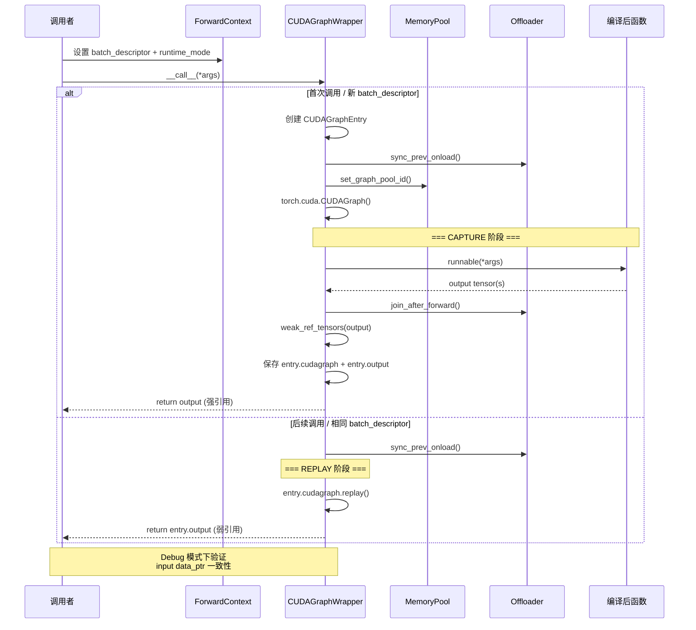

# vLLM 编译与运行时优化分析

> **定位**：本文档深入分析 vLLM 的 `torch.compile` 编译流水线、CUDA Graph 捕获/回放机制、编译 Pass 优化体系、代码生成与缓存等核心运行时优化子系统。



---

## 一、torch.compile 集成

### 1.1 Dynamo + Inductor 编译流水线原理

vLLM 的编译流水线基于 PyTorch 的 `torch.compile`，采用 **Dynamo → FX Graph → 图分割 → 分段编译 → CUDA Graph 捕获** 的多层架构：



### 1.2 CustomOp 自定义算子注册

源码：[custom_op.py](file:///workspace/vllm/model_executor/custom_op.py)

vLLM 通过 `CustomOp` 基类实现跨平台算子分发。每个自定义算子可以注册不同平台的前向实现：

**注册机制** — 使用装饰器模式：

```python
# /workspace/vllm/model_executor/custom_op.py L307-L320
@classmethod
def register(
    cls,
    name: str,
    dynamic_arg_dims: dict[str, int | list[int]] | None = None,
):
    def decorator(op_cls):
        assert name not in op_registry, f"Duplicate op name: {name}"
        op_cls.name = name
        op_cls._dynamic_arg_dims = dynamic_arg_dims
        op_registry[name] = op_cls
        return op_cls

    return decorator
```

**平台分发逻辑** — [custom_op.py L174-L207](file:///workspace/vllm/model_executor/custom_op.py#L174-L207)：

```python
def dispatch_forward(self, compile_native: bool):
    compilation_config = get_cached_compilation_config()
    enabled = self._enforce_enable or self.enabled()

    if not enabled:
        # 未启用自定义算子时，使用 forward_native 并可选地 compile
        return self.maybe_compile(self.forward_native, enable=compile_native)

    if current_platform.is_rocm():
        return self.forward_hip       # ROCm (AMD GPU)
    elif current_platform.is_cpu():
        return self.forward_cpu       # CPU
    elif current_platform.is_tpu():
        return self.forward_tpu       # TPU
    elif current_platform.is_xpu():
        return self.forward_xpu       # Intel XPU
    elif current_platform.is_out_of_tree():
        return self.forward_oot       # Out-of-tree
    else:
        return self.forward_cuda      # NVIDIA CUDA (默认)
```

**关键设计要点**：
- **OOT (Out-of-Tree) 替换机制**：通过 `register_oot()` 装饰器允许第三方替换整个算子实现（[custom_op.py L332-L353](file:///workspace/vllm/model_executor/custom_op.py#L332-L353)）
- **PluggableLayer**：模块级组合抽象，支持 OOT 整层替换（[custom_op.py L32-L100](file:///workspace/vllm/model_executor/custom_op.py#L32-L100)）
- **maybe_compile**：对不透明自定义算子内部调用进行 `torch.compile` 编译（[custom_op.py L209-L269](file:///workspace/vllm/model_executor/custom_op.py#L209-L269)）

### 1.3 编译后端选择

源码：[backends.py](file:///workspace/vllm/compilation/backends.py) · [compiler_interface.py](file:///workspace/vllm/compilation/compiler_interface.py)

`make_compiler()` 函数根据 `CompilationConfig.backend` 选择编译后端：

```python
# /workspace/vllm/compilation/backends.py L96-L122
def make_compiler(compilation_config: CompilationConfig) -> CompilerInterface:
    if compilation_config.backend == "inductor":
        if envs.VLLM_USE_STANDALONE_COMPILE and hasattr(
            torch._inductor, "standalone_compile"
        ):
            return InductorStandaloneAdaptor(...)   # PyTorch 2.8+ 独立编译
        else:
            return InductorAdaptor()                 # 传统 compile_fx 路径
    elif compilation_config.backend == "eager":
        return EagerAdaptor()                         # 不编译，直接执行
    else:
        compiler = resolve_obj_by_qualname(
            current_platform.get_compile_backend()
        )()
        return compiler                               # 自定义后端
```

**三种编译后端对比**：

| 后端 | 类名 | 适用场景 | 缓存支持 |
|------|------|----------|----------|
| `inductor` | `InductorAdaptor` | PyTorch 2.5-2.7 | ✅ FxGraphCache |
| `inductor_standalone` | `InductorStandaloneAdaptor` | PyTorch 2.8+ | ✅ AOT Artifact |
| `eager` | `EagerAdaptor` | 调试/无编译 | ❌ |

**InductorStandaloneAdaptor 的关键特性** ([compiler_interface.py L251-L446](file:///workspace/vllm/compilation/compiler_interface.py#L251-L446))：
- 使用 `standalone_compile()` API 替代 `compile_fx()`
- 支持 AOT (Ahead-of-Time) 编译模式 (`VLLM_USE_MEGA_AOT_ARTIFACT`)
- 支持 `donate_graph_module` (PyTorch 2.13+) 减少内存开销
- 自动原子写入防止多进程缓存损坏

---

## 二、编译 Passes

### 2.1 Pass 管理架构

源码：[pass_manager.py](file:///workspace/vllm/compilation/passes/pass_manager.py)

`PostGradPassManager` 是 vLLM 编译 Pass 系统的核心管理器，继承自 PyTorch 的 `CustomGraphPass`：

**Pass 执行顺序** ([pass_manager.py L98-L131](file:///workspace/vllm/compilation/passes/pass_manager.py#L98-L131))：

```
1. 用户自定义 Passes (constructor parameter)
2. 默认 Passes:
   ├── NoOpEliminationPass        (消除空操作)
   ├── SequenceParallelismPass     (序列并行)
   ├── AsyncTPPass                 (异步张量并行通信融合)
   ├── AllReduceFusionPass         (AllReduce + RMSNorm 融合)
   ├── MiniMaxQKNormPass           (MiniMax QK-Norm 融合)
   ├── RMSNormQuantFusionPass      (RMSNorm + 量化融合)
   ├── ActivationQuantFusionPass   (激活 + 量化融合)
   ├── RocmAiter* 系列             (ROCm AITER 特定融合)
   ├── SplitCoalescingPass         (分割合并)
   ├── ScatterSplitReplacementPass (scatter/split 替换)
   ├── RopeKVCacheFusionPass       (RoPE + KV Cache 融合)
   ├── AttnQuantFusionPass         (注意力 + 量化融合)
   └── QKNormRoPEFusionPass        (QK-Norm + RoPE 融合)
3. PostCleanupPass                (清理融合产物)
4. VllmIRLoweringPass              (IR 降低)
5. UnsafeCloneEliminationPass      (克隆消除)
6. PostCleanupPass                (再次清理)
7. FixFunctionalizationPass       (修复函数化) ← 最后执行
```

### 2.2 InductorPass 基类

源码：[inductor_pass.py](file:///workspace/vllm/compilation/passes/inductor_pass.py)

所有 vLLM 编译 Pass 的基类，提供 UUID 哈希和范围适用性检查：

```python
# /workspace/vllm/compilation/passes/inductor_pass.py L66-L108
class InductorPass(CustomGraphPass):
    def uuid(self) -> str:
        """提供唯一标识符用于 Inductor 代码缓存"""
        return InductorPass.hash_source(self)

    @staticmethod
    def hash_source(*srcs: str | Any) -> str:
        """哈希函数/对象源码，确保 pass 变更触发重新编译"""
        cache_key = tuple(
            src if isinstance(src, (str, type, types.FunctionType))
            else src.__class__
            for src in srcs
        )
        return _hash_source_cached(*cache_key)

    def is_applicable_for_range(self, compile_range: Range) -> bool:
        return True
```

### 2.3 VllmInductorPass 增强

源码：[vllm_inductor_pass.py](file:///workspace/vllm/compilation/passes/vllm_inductor_pass.py)

为 InductorPass 增加 vLLM 特有能力：计时、日志、图 dump、模式匹配：

```python
# /workspace/vllm/compilation/passes/vllm_inductor_pass.py L34-L84
class VllmInductorPass(InductorPass):
    dump_prefix: ClassVar[int | None] = None

    def __init__(self, config: VllmConfig):
        self.compilation_config = InductorCompilationConfig(...)
        self.pass_config = config.compilation_config.pass_config
        self.model_dtype = config.model_config.dtype
        ...

    @staticmethod
    def time_and_log(call_fn):
        @functools.wraps(call_fn)
        def wrapped(self, graph):
            self.begin()
            self.dump_graph(graph, "before")
            call_fn(self, graph)
            self.dump_graph(graph, "after")
            self.end_and_log()
        return wrapped
```

**VllmPatternMatcherPass** — 基于 Inductor PatternMatcher 的融合 Pass 框架 ([vllm_inductor_pass.py L266-L305](file:///workspace/vllm/compilation/passes/vllm_inductor_pass.py#L266-L305))：

```python
class VllmFusionPatternMatcherPass(VllmPatternMatcherPass):
    @enable_fake_mode
    def register(self, pr: VllmPatternReplacement):
        pm.register_replacement(
            pr.pattern, pr.replacement, pr.get_inputs(),
            self._trace_fn, self.pm_pass,
        )
        self._pattern_replacements.append(pr)
```

**VllmPatternReplacement** — 声明式模式/替换对 ([vllm_inductor_pass.py L194-L247](file:///workspace/vllm/compilation/passes/vllm_inductor_pass.py#L194-L247))：

```python
class VllmPatternReplacement(ABC, Generic[P, R]):
    @property
    @abstractmethod
    def pattern(self) -> Callable[P, R]: ...   # 要搜索的子图

    @property
    @abstractmethod
    def replacement(self) -> Callable[P, R]: ...  # 替换子图

    @abstractmethod
    def get_inputs(self) -> list[torch.Tensor]: ...  # 示例张量
```

### 2.4 FX 工具函数

源码：[fx_utils.py](file:///workspace/vllm/compilation/passes/fx_utils.py)

提供 FX 图遍历和节点查找的实用函数集：

| 函数 | 功能 |
|------|------|
| `is_func(node, target)` | 检查节点是否是特定函数调用 |
| `is_auto_func(node, op)` | 检查是否是 auto_functionalized 包装的 op |
| `find_auto_fn_maybe(nodes, op)` | 查找 auto_functionalized 节点 |
| `find_getitem_maybe(node, idx)` | 查找 getitem 节点 |
| `find_op_nodes(op, graph)` | 查找所有匹配 OpOverload/Packet 的节点 |
| `get_only_user(node)` | 获取节点的唯一用户 |

---

## 三、CUDA Graphs

### 3.1 架构总览

源码：[cuda_graph.py](file:///workspace/vllm/compilation/cuda_graph.py)

vLLM 实现了两种 CUDA Graph 模式，通过 `CUDAGraphMode` 枚举控制：



### 3.2 CUDAGraphWrapper — 核心包装器

源码：[cuda_graph.py L145-L361](file:///workspace/vllm/compilation/cuda_graph.py#L145-L361)

`CUDAGraphWrapper` 是 CUDA Graph 捕获/回放的统一入口：

**初始化** ([cuda_graph.py L178-L209](file:///workspace/vllm/compilation/cuda_graph.py#L178-L209))：

```python
class CUDAGraphWrapper:
    _all_instances: ClassVar[weakref.WeakSet] = weakref.WeakSet()

    def __init__(self, runnable, vllm_config, runtime_mode, cudagraph_options=None):
        self.runnable = runnable
        self.runtime_mode = runtime_mode          # FULL 或 PIECEWISE
        self.graph_pool = current_platform.get_global_graph_pool()
        self.concrete_cudagraph_entries: dict[BatchDescriptor, CUDAGraphEntry] = {}
        CUDAGraphWrapper._all_instances.add(self)
```

**调用/分发逻辑** ([cuda_graph.py L233-L361](file:///workspace/vllm/compilation/cuda_graph.py#L233-L361))：

```python
def __call__(self, *args, **kwargs):
    # 1. 无前向上下文 → 直接执行（如 vision encoder）
    if not is_forward_context_available():
        return self.runnable(*args, **kwargs)

    forward_context = get_forward_context()
    batch_descriptor = forward_context.batch_descriptor
    cudagraph_runtime_mode = forward_context.cudagraph_runtime_mode

    # 2. 模式不匹配或为 NONE → 直接执行
    if (cudagraph_runtime_mode == CUDAGraphMode.NONE
        or cudagraph_runtime_mode != self.runtime_mode):
        return self.runnable(*args, **kwargs)

    # 3. 获取或创建 entry
    if batch_descriptor not in self.concrete_cudagraph_entries:
        self.concrete_cudagraph_entries[batch_descriptor] = CUDAGraphEntry(...)

    entry = self.concrete_cudagraph_entries[batch_descriptor]

    # 4. 首次调用 → 捕获
    if entry.cudagraph is None:
        return self._capture(entry, *args, **kwargs)

    # 5. 后续调用 → 回放
    entry.cudagraph.replay()
    return entry.output
```

**捕获流程** ([cuda_graph.py L265-L344](file:///workspace/vllm/compilation/cuda_graph.py#L265-L344))：

```python
# 关键捕获步骤:
with ExitStack() as stack:
    # 禁用 GC（非首个图时加速）
    if self.cudagraph_options.gc_disable:
        stack.enter_context(patch("gc.collect", lambda *a, **k: None))

    # 设置内存池
    set_graph_pool_id(self.graph_pool)

    # 同步 offloader
    get_offloader().sync_prev_onload()

    # 执行 CUDA Graph 捕获
    with torch.cuda.graph(cudagraph, pool=self.graph_pool, stream=current_stream()):
        output = self.runnable(*args, **kwargs)
        get_offloader().join_after_forward()
        if self.cudagraph_options.weak_ref_output:
            output = weak_ref_tensors(output)  # 内存优化

entry.output = weak_ref_tensors(output)
entry.cudagraph = cudagraph
```

**CUDAGraphOptions 配置项** ([cuda_graph.py L139-L143](file:///workspace/vllm/compilation/cuda_graph.py#L139-L143))：

| 选项 | 类型 | 说明 |
|------|------|------|
| `debug_log_enable` | bool | 是否打印捕获日志（通常仅首图启用） |
| `gc_disable` | bool | 是否禁用 GC（非首图禁用以加速） |
| `weak_ref_output` | bool | 是否用弱引用保存输出（末尾图启用以节省内存） |

### 3.3 Piecewise CUDAGraphs — 子图捕获（推荐模式）

Piecewise 模式将计算图按 splitting ops 分割成多个子图，每个子图独立捕获 CUDA Graph。

**工作流程**：
1. `split_graph()` 按 splitting ops 将 FX 图切割为多个子模块
2. `PiecewiseCompileInterpreter` 遍历每个非分割子模块
3. 为每个子模块创建 `PiecewiseBackend`
4. `PiecewiseBackend` 对每个 compile_range 调用 `CompilerManager.compile()`
5. 编译完成后用 `CUDAGraphWrapper` 包装

**优势**：
- 更细粒度的 batch size 适配
- 不同子图可独立缓存
- 支持 dynamic shape（符号形状）
- 内存效率更高（逐层释放中间结果）

### 3.4 Full CUDAGraphs — 整体捕获

Full 模式将整个模型 forward 捕获为单个 CUDA Graph：
- 适用于固定 batch size 场景
- 开销最低（单次 kernel launch）
- 与 Piecewise 模式可通过 `FULL_AND_PIECEWISE` 同时启用

### 3.5 Encoder CUDA Graphs — 视觉编码器图捕获

源码：[encoder_cudagraph.py](file:///workspace/vllm/v1/worker/encoder_cudagraph.py) · [encoder_cudagraph_defs.py](file:///workspace/vllm/v1/worker/encoder_cudagraph_defs.py)

**EncoderCudaGraphManager** 实现了基于 token budget 的视觉编码器 CUDA Graph 管理：

**核心数据结构** ([encoder_cudagraph_defs.py L11-L37](file:///workspace/vllm/v1/worker/encoder_cudagraph_defs.py#L11-L37))：

```python
@dataclass
class EncoderCudaGraphConfig:
    modalities: list[str]                    # 支持的模态 ["image"]
    input_key_by_modality: dict[str, str]    # {"image": "pixel_values"}
    buffer_keys: list[str]                   # buffer 键列表
    out_hidden_size: int                     # 输出隐藏维度

@dataclass
class BudgetGraphMetadata:
    token_budget: int                        # token 预算
    max_batch_size: int                      # 最大批大小
    max_frames_per_batch: int                # 每批最大帧数
    graph: torch.cuda.CUDAGraph              # 捕获的图
    input_buffer: torch.Tensor               # 输入缓冲区
    metadata_buffers: dict[str, torch.Tensor] # 元数据缓冲区
    output_buffer: torch.Tensor              # 输出缓冲区
```

**Budget 图生成策略** ([encoder_cudagraph.py L126-L137](file:///workspace/vllm/v1/worker/encoder_cudagraph.py#L126-L137))：

```python
@staticmethod
def _generate_budgets(min_budget: int, max_budget: int) -> list[int]:
    """从 min_budget 到 max_budget 生成 2 的幂次预算"""
    budgets: list[int] = []
    b = min_budget
    while b <= max_budget:
        budgets.append(b)
        b *= 2
    if not budgets or budgets[-1] < max_budget:
        budgets.append(max_budget)
    return budgets
```

**贪心打包执行** ([encoder_cudagraph.py L285-L412](file:///workspace/vllm/v1/worker/encoder_cudagraph.py#L285-L412))：



**DP (Data Parallel) 支持** ([encoder_cudagraph.py L414-L544](file:///workspace/vllm/v1/worker/encoder_cudagraph.py#L414-L544))：
- `_dp_shard()`: 使用 `get_load_balance_assignment()` 按 input size 均衡分配到各 TP rank
- `_dp_gather()`: pad → `tensor_model_parallel_all_gather` → unpad → reorder

---

## 四、Partition Rules 图分割规则

源码：[partition_rules.py](file:///workspace/vllm/compilation/partition_rules.py)

图分割决定在哪些算子处切割计算图，是实现 Piecewise 编译的关键。

**分割判断逻辑** ([partition_rules.py L14-L38](file:///workspace/vllm/compilation/partition_rules.py#L14-L38))：

```python
def should_split(node: torch.fx.Node, splitting_ops: list[str]) -> bool:
    if node.op != "call_function":
        return False

    target = node.target

    if isinstance(target, torch._ops.OpOverloadPacket):
        # 如 "aten::add"
        return target._qualified_op_name in splitting_ops

    if isinstance(target, torch._ops.OpOverload):
        packet_name = target.name()           # "aten::add"
        op_overload_name = f"{packet_name}.{target._overloadname}"  # "aten::add.default"
        return op_overload_name in splitting_ops or packet_name in splitting_ops

    return False
```

**Inductor 分割规则上下文** ([partition_rules.py L41-L75](file:///workspace/vllm/compilation/partition_rules.py#L41-L75))：

当 `use_inductor_graph_partition=True` 时，vLLM 将分割规则注册到 Inductor 内部的 partitioner：

```python
@contextlib.contextmanager
def inductor_partition_rule_context(splitting_ops):
    saved_splitting_ops = list(torch._inductor.config.custom_should_partition_ops)
    torch._inductor.config.custom_should_partition_ops = splitting_ops
    try:
        yield
    finally:
        torch._inductor.config.custom_should_partition_ops = saved_splitting_ops
```

**split_graph 完整流程** ([backends.py L548-L622](file:////workspace/vllm/compilation/backends.py#L548-L622))：

1. `_decompose_size_nodes()` — 将 `x.size()` 分解为 `sym_size.int(x, dim)` 调用
2. 遍历所有节点，按 `should_split()` 判断是否需要新子图
3. 连续 splitting ops 保持在一起
4. `_merge_empty_only_subgraphs()` — 合并仅含 empty allocation 的分区
5. 调用 `torch.fx.passes.split_module.split_module()` 执行实际分割

---

## 五、Codegen 代码生成

源码：[codegen.py](file:///workspace/vllm/compilation/codegen.py)

Codegen 模块将分割后的 FX GraphModule 转化为高效的 Python 执行函数，消除 `nn.Module.__call__` 和 `__getattr__` 开销。

**生成流程**：

```python
# /workspace/vllm/compilation/codegen.py L130-L161
def generate_execution_code(split_gm) -> tuple[str, list[str], list[Any]]:
    code, submod_names, consts = generate_execution_code_with_name(
        split_gm, "execution_fn", with_submod=True
    )
    return "import torch\nimport operator\n" + code, submod_names, consts
```

**生成的代码示例**（概念性）：

```python
import torch
import operator

def execution_fn(arg0, arg1, *, __vllm_submods__):
    # placeholder 节点直接映射到参数
    # call_module 节点通过 __vllm_submods__ 列表索引调用
    node_0 = __vllm_submods__[0](arg0, arg1)
    # call_function 节点直接调用
    node_1 = torch.ops.aten.add(node_0, arg1)
    # getitem 节点转为索引操作
    node_2 = node_1[0]
    # 中间变量及时释放 (del 优化)
    del node_0, node_1
    return node_2
```

**关键优化** ([codegen.py L42-L56](file:///workspace/vllm/compilation/codegen.py#L42-L56))：

- **Liveness 分析**：跟踪每个值最后被消费的位置
- **提前 `del`**：在最后消费者之后立即释放不再需要的变量
- **常量提取**：非原始类型常量（如 `torch.device`）收集到 `__vllm_consts__` 列表
- **子模块内联**：纯 `GraphModule` 子模块直接内联到生成代码中

**编译绑定** ([codegen.py L164-L204](file:///workspace/vllm/compilation/codegen.py#L164-L204))：

```python
def compile_execution_fn(code, submod_callables, submod_names, consts=None):
    namespace = {}
    if consts is not None:
        namespace["__vllm_consts__"] = consts
    exec(code, namespace)                  # 执行生成的代码
    fn = namespace["execution_fn"]         # 提取函数
    submods_list = [submod_callables.get(name) for name in submod_names]
    return partial(fn, __vllm_submods__=submods_list)  # 绑定子模块
```

---

## 六、Caching 编译缓存

源码：[caching.py](file:///workspace/vllm/compilation/caching.py)

### 6.1 VllmSerializableFunction

支持 PyTorch precompile 协议的可序列化编译结果包装器：

**序列化流程** ([caching.py L252-L297](file:///workspace/vllm/compilation/caching.py#L252-L297))：

```python
@classmethod
def serialize_compile_artifacts(cls, compiled_fn) -> bytes:
    state = compiled_fn.__dict__.copy()
    state.pop("optimized_call")           # 不序列化可调用对象
    state.pop("shape_env")
    state.pop("vllm_backend", None)

    # 清理元数据减少体积
    for node in state["graph_module"].graph.nodes:
        node.meta.pop("source_fn_stack", None)
        node.meta.pop("nn_module_stack", None)

    # 张量输入替换为 meta 设备版本（节省空间）
    state["example_inputs"] = pytree.tree_map_only(
        torch.Tensor, lambda inp: torch.empty_like(inp, device="meta"),
        state["example_inputs"],
    )

    # 收集 standalone compile artifacts
    if compiled_fn.vllm_backend:
        (standalone_compile_artifacts, ...) = \
            compiled_fn.vllm_backend.collect_standalone_compile_artifacts()
        state["standalone_compile_artifacts"] = standalone_compile_artifacts

    return pickle.dumps(state)
```

### 6.2 StandaloneCompiledArtifacts

基于内容寻址的去重编译产物存储 ([caching.py L37-152](file:///workspace/vllm/compilation/caching.py#L37-L152))：

```python
class StandaloneCompiledArtifacts:
    """两级间接去重:
    1. submodule_bytes: "{submod_name}_{shape}" -> SHA256 hash
    2. submodule_bytes_store: SHA256 hash -> actual bytes
    """

    def insert(self, submod_name, shape, entry):
        hasher = hashlib.sha256()
        hasher.update(entry)
        hex_digest = hasher.hexdigest()
        self.submodule_bytes[f"{submod_name}_{shape}"] = hex_digest
        if hex_digest not in self.submodule_bytes_store:
            self.submodule_bytes_store[hex_digest] = entry
            # 新条目才存储，已存在的 hash 复用
```

**为什么需要去重？** 因为相同的 transformer 层（如 layer-0 和 layer-1 在相同 attention pattern 下分割）会编译出完全相同的 artifact。

### 6.3 反序列化与重建

**Mega Artifact 路径** ([caching.py L411-562](file:///workspace/vllm/compilation/caching.py#L411-L562))：

```python
def reconstruct_serializable_fn_from_mega_artifact(state, artifacts, ...):
    # 1. 加载所有缓存的编译产物（并发加载）
    artifacts.load_all()

    # 2. 为每个子模块/shape 组合构建 callable 映射
    for cache_key in artifacts.submodule_bytes:
        submod_name, shape_str = cache_key.rsplit("_", 1)
        compiled_callables[submod_name][shape_str] = artifacts.get_loaded(...)

    # 3. 创建 PiecewiseBackend（使用预编译 runnable）
    piecewise_backend = PiecewiseBackend(
        graph=None,                          # 不需要原图
        compiled_runnables=runnables,         # 使用缓存
        ...
    )

    # 4. 包装 CUDA Graph
    wrapped = wrap_with_cudagraph_if_needed(piecewise_backend, ...)
```

### 6.4 缓存键因子

缓存目录由以下因子的 SHA-256 哈希决定 ([backends.py L1026-1074](file:///workspace/vllm/compilation/backends.py#L1026-L1074))：

| 因子 | 来源 | 说明 |
|------|------|------|
| `env_hash` | `envs.compile_factors()` | 环境变量（PP 层数等） |
| `config_hash` | `VllmConfig.compute_hash()` | 模型配置 |
| `code_hash` | traced files SHA-256 | 源码文件内容 |
| `compiler_hash` | `CompilerInterface.compute_hash()` | 编译器状态 |

---

## 七、Monitor 编译监控

源码：[monitor.py](file:///workspace/vllm/compilation/monitor.py)

### 7.1 monitor_torch_compile

编译过程监控上下文管理器 ([monitor.py L17-L59](file:///workspace/vllm/compilation/monitor.py#L17-L59))：

```python
@contextmanager
def monitor_torch_compile(vllm_config, message="torch.compile took %.2f s"):
    global torch_compile_start_time
    torch_compile_start_time = time.perf_counter()

    # 启动 depyf 调试 dump（如果配置了路径）
    path = vllm_config.compile_debug_dump_path()
    if compilation_config.mode == CompilationMode.VLLM_COMPILE and path:
        import depyf
        depyf_cm = depyf.prepare_debug(path.as_posix())
        depyf_cm.__enter__()

    try:
        yield
    else:
        total = time.perf_counter() - torch_compile_start_time
        # 分别记录 encoder 和 backbone 编译时间
        if is_encoder:
            compilation_config.encoder_compilation_time += total
        else:
            compilation_config.compilation_time += total
        logger.info_once(message, total)
    finally:
        if depyf_cm is not None:
            depyf_cm.__exit__(None, None, None)
```

### 7.2 CUDA Graph 捕获合法性验证

([monitor.py L87-103](file:///workspace/vllm/compilation/monitor.py#L87-103))：

```python
cudagraph_capturing_enabled: bool = True

def validate_cudagraph_capturing_enabled():
    global cudagraph_capturing_enabled
    if not cudagraph_capturing_enabled:
        raise RuntimeError(
            "CUDA graph capturing detected at an inappropriate time."
        )

def set_cudagraph_capturing_enabled(enabled: bool):
    global cudagraph_capturing_enabled
    cudagraph_capturing_enabled = enabled
```

这用于确保 CUDA Graph 捕获不会在不恰当的时刻发生（如在 eager fallback 路径中）。

---

## 八、Counter 性能计数

源码：[counter.py](file:///workspace/vllm/compilation/counter.py)

全局编译性能计数器，追踪完整的编译生命周期指标：

```python
# /workspace/vllm/compilation/counter.py L12-L41
@dataclasses.dataclass
class CompilationCounter:
    num_models_seen: int = 0                    # 见到的模型数
    num_graphs_seen: int = 0                     # Dynamo 产生的图数量
    num_piecewise_graphs_seen: int = 0           # 分段后的子图数（含分割 op）
    num_piecewise_capturable_graphs_seen: int = 0 # 可捕获的子图数
    num_backend_compilations: int = 0            # 后端编译次数
    num_gpu_runner_capture_triggers: int = 0     # CUDA Graph 捕获触发次数
    num_cudagraph_captured: int = 0              # 实际捕获的 CUDA Graph 数
    num_inductor_compiles: int = 0               # InductorAdaptor.compile 调用
    num_eager_compiles: int = 0                  # EagerAdaptor.compile 调用
    num_cache_entries_updated: int = 0           # 缓存条目更新次数
    num_compiled_artifacts_saved: int = 0        # standalone 产物保存数
    num_compiled_artifacts_loaded: int = 0       # standalone 产物加载数
    num_aot_compiles: int = 0                    # AOT 编译次数
    num_aot_artifacts_saved: int = 0             # AOT 产物保存数
    num_aot_artifacts_loaded: int = 0            # AOT 产物加载数
    stock_torch_compile_count: int = 0           # STOCK_TORCH_COMPILE 模式计数
```

**断言测试接口** ([counter.py L46-L55](file:///workspace/vllm/compilation/counter.py#L46-L55))：

```python
@contextmanager
def expect(self, **kwargs):
    old = self.clone()
    yield
    for k, v in kwargs.items():
        assert getattr(self, k) - getattr(old, k) == v, (
            f"{k} not as expected..."
        )
```

---

## 九、BaseStaticGraph 静态图基类

源码：[base_static_graph.py](file:///workspace/vllm/compilation/base_static_graph.py)

定义静态图包装器的 Protocol 接口，使不同平台可以实现自己的 CUDA Graph / 静态图方案：

```python
# /workspace/vllm/compilation/base_static_graph.py L10-57
class AbstractStaticGraphWrapper(Protocol):
    def __init__(
        self,
        runnable: Callable[..., Any],
        vllm_config: VllmConfig,
        runtime_mode: CUDAGraphMode,
        **kwargs: Any,
    ) -> None:
        """
        Args:
            runnable: 要捕获的可调用对象
            vllm_config: 全局 vLLM 配置
            runtime_mode: 静态图运行模式 (NONE/PIECEWISE/FULL)
        """
        raise NotImplementedError

    def __call__(self, *args, **kwargs) -> Any:
        """
        如果 ForwardContext 中的 runtime_mode 匹配，
        则 replay CUDA Graph 或首次 capture；
        否则直接调用原始 callable。
        """
        raise NotImplementedError
```

**平台解析链**：`current_platform.get_static_graph_wrapper_cls()` → `resolve_obj_by_qualname()` → 平台特定的 `CUDAGraphWrapper` 子类

---

## 十、PiecewiseBackend 分段后端

源码：[piecewise_backend.py](file:///workspace/vllm/compilation/piecewise_backend.py)

### 10.1 核心职责

`PiecewiseBackend` 是分段编译的核心执行引擎，负责：

1. **多 shape 编译**：为每个 `compile_range` 独立编译
2. **运行时分发**：根据运行时 shape 选择对应的编译结果
3. **序列化支持**：导出编译产物供缓存

### 10.2 双模式初始化

```python
# /workspace/vllm/compilation/piecewise_backend.py L86-192
class PiecewiseBackend:
    def __init__(self, graph, vllm_config, piecewise_compile_index, ...):
        # 断言: graph 和 compiled_runnables 二选一
        assert bool(graph is not None) ^ bool(compiled_runnables is not None)

        self.compile_ranges = self.compilation_config.get_compile_ranges()
        self.sym_shape_indices = sym_shape_indices

        # 构建 range_entries
        for range in self.compile_ranges:
            self.range_entries[range] = RangeEntry(compile_range=range)

        if self.graph is not None:
            self.compile_all_ranges()     # 冷启动: 编译所有 range
        else:
            self.load_all_ranges()       # 热启动: 加载预编译产物
```

### 10.3 Shape 分发

```python
# /workspace/vllm/compilation/piecewise_backend.py L343-379
def __call__(self, *args):
    if self.sym_shape_indices:
        runtime_shape = args[self.sym_shape_indices[0]]
        range_entry = self._find_range_for_shape(runtime_shape)
        # 先精确匹配 compile_sizes，再搜索包含该值的 compile_ranges
    else:
        # 全静态输入: 只有一个编译好的 range_entry
        range_entry = compiled_entries[0]

    return range_entry.runnable(*args)
```

### 10.4 具体参数创建

对于单 size 编译（如 CUDA Graph capture sizes），需要将 FakeTensor 的符号维度替换为具体值：

```python
# /workspace/vllm/compilation/piecewise_backend.py L37-76
def create_concrete_args(graph, size):
    def concretize(sym_val):
        if not is_symbolic(sym_val):
            return int(sym_val)
        expr = sym_val.node.expr
        return int(expr.subs({s: size for s in expr.free_symbols}))

    fake_mode = FakeTensorMode(shape_env=ShapeEnv())
    with fake_mode:
        for node in graph.graph.nodes:
            if node.op != "placeholder": break
            val = node.meta["example_value"]
            if isinstance(val, torch.Tensor):
                new_shape = tuple(concretize(d) for d in val.shape)
                # 创建具有具体形状的占位张量
                t = torch.empty(needed_size, dtype=val.dtype, device=val.device)
                t = t.as_strided(new_shape, new_strides, storage_offset)
                args.append(t)
```

### 10.5 序列化

```python
# /workspace/vllm/compilation/piecewise_backend.py L209-243
def to_bytes(self):
    class StandaloneCompiledArtifactsPickler(Pickler):
        def reducer_override(self, obj):
            if isinstance(obj, CachingAutotuner):
                obj.prepare_for_pickle()
                return pickle.loads, (pickle.dumps(obj),)
            return NotImplemented

    out = {}
    for range_key, entry in self.range_entries.items():
        if hasattr(entry.runnable, "serialize"):
            out[str(range_key)] = serialize(entry.runnable)
    return out
```

---

## 十一、Triton Utils Triton 编译工具

### 11.1 importing — Triton 可用性检测

源码：[importing.py](file:///workspace/vllm/triton_utils/importing.py)

安全检测 Triton 是否可用，处理各种边界情况：

```python
# /workspace/vllm/triton_utils/importing.py L13-72
HAS_TRITON = (
    find_spec("triton") is not None
    or find_spec("pytorch-triton-xpu") is not None
)

if HAS_TRITON:
    active_drivers = [
        x.driver for x in backends.values()
        if x.driver and x.driver.is_active()
    ]
    # 分布式环境容错 (Ray actor init 时 CUDA_VISIBLE_DEVICES 可能临时为空)
    if is_distributed_env and len(active_drivers) == 0:
        pass  # 允许稍后激活
    elif not is_distributed_env and len(active_drivers) != 1:
        HAS_TRITON = False  # 非分布式环境必须恰好 1 个 driver
```

**TritonPlaceholder** — 当 Triton 不可用时提供的空壳替代 ([importing.py L75-105](file:///workspace/vllm/triton_utils/importing.py#L75-105))：

```python
class TritonPlaceholder(types.ModuleType):
    def __init__(self):
        super().__init__("triton")
        self.jit = self._dummy_decorator("jit")       # 直接返回原函数
        self.autotune = self._dummy_decorator("autotune") # 同上
        self.heuristics = self._dummy_decorator("heuristics")
        self.Config = self._dummy_decorator("Config")
        self.language = TritonLanguagePlaceholder()
```

### 11.2 jit_monitor — JIT 编译监控

源码：[jit_monitor.py](file:///workspace/vllm/triton_utils/jit_monitor.py)

在 warmup 完成后监控 Triton kernel JIT 编译事件，检测推理时的延迟尖峰：

**激活** ([jit_monitor.py L32-57](file:///workspace/vllm/triton_utils/jit_monitor.py#L32-L57))：

```python
def activate():
    global _active
    if _active:
        return
    _active = True
    _setup_triton_autotuning_print()  # 启用 autotuning 日志
    _setup_triton_jit_hook()          # 注册 JIT 编译钩子
```

**JIT 编译钩子** ([jit_monitor.py L87-111](file:///workspace/vllm/triton_utils/jit_monitor.py#L87-111))：

```python
def _setup_triton_jit_hook():
    from triton import knobs
    existing_hook = knobs.runtime.jit_post_compile_hook

    def _on_jit_compile(**kwargs):
        fn = kwargs.get("fn")
        fn_name = getattr(fn, "name", "<unknown>")
        logger.warning_once(
            "Triton kernel JIT compilation during inference: %s. "
            "This causes a latency spike...", fn_name,
        )
        if existing_hook is not None:
            return existing_hook(**kwargs)
        return None

    knobs.runtime.jit_post_compile_hook = _on_jit_compile
```

### 11.3 allocation — Triton 内存分配器

源码：[allocation.py](file:///workspace/vllm/triton_utils/allocation.py)

设置 Triton 使用 PyTorch 的 CUDA 分配器：

```python
# /workspace/vllm/triton_utils/allocation.py L9-L12
def set_triton_allocator(device: torch.device):
    def alloc_fn(size, alignment, stream):
        return torch.empty(size, device=device, dtype=torch.int8)
    triton.set_allocator(alloc_fn)
```

这确保 Triton kernel 的内存在 PyTorch CUDA 缓存分配器中统一管理。

---

## 十二、OptimizationLevel O0-O3 含义详解

源码：[vllm.py L68-L265](file:///workspace/vllm/config/vllm.py#L68-L265)

### 12.1 各级别总览


### 12.2 详细配置对照表

| 配置项 | O0 | O1 | O2 | O3 | 说明 |
|--------|----|----|----|-----|------|
| **Compilation Mode** | NONE | VLLM_COMPILE | VLLM_COMPILE | VLLM_COMPILE | 是否启用 torch.compile |
| **CUDA Graph Mode** | `NONE` | `PIECEWISE` | `FULL_AND_PIECEWISE` | `FULL_AND_PIECEWISE` | CUDA Graph 捕获策略 |
| **fuse_norm_quant** | ❌ | 条件启用* | 条件启用* | 条件启用* | RMSNorm + 量化融合 |
| **fuse_act_quant** | ❌ | 条件启用* | 条件启用* | 条件启用* | SiLU+Mul + 量化融合 |
| **fuse_allreduce_rms** | ❌ | ❌ | 条件启用† | 条件启用† | AllReduce + RMSNorm 融合 |
| **fuse_attn_quant** | ❌ | ❌ | IS_QUANTIZED | IS_QUANTIZED | Attention + 量化融合 |
| **enable_sp** | ❌ | ❌ | IS_DENSE | IS_DENSE | 序列并行 (Ring Attention) |
| **fuse_gemm_comms** | ❌ | ❌ | IS_DENSE | IS_DENSE | GEMM + 通信融合 |
| **fuse_act_padding** | ❌ | 条件启用‡ | 条件启用‡ | 条件启用‡ | Add + RMSNorm + Pad 融合 |
| **fuse_mla_dual_rms_norm** | ❌ | 条件启用§ | 条件启用§ | 条件启用§ | MLA Dual RMSNorm 融合 |
| **fuse_rope_kvcache** | ❌ | ❌ | 条件启用¶ | 条件启用¶ | RoPE + KV Cache 融合 |
| **FlashInfer Autotune** | ❌ | ❌ | ❌ | ✅ | FlashInfer kernel autotuning |
| **use_inductor_graph_partition** | ❌ | ❌ | ❌ | ❌ | Inductor 内置图分割 |

> \* 取决于 `enable_norm_fusion()` / `enable_act_fusion()`  
> † 取决于 `enable_allreduce_rms_fusion()` (TP>1 + Hopper/Blackwell + flashinfer)  
> ‡ 取决于 `enable_norm_pad_fusion()` (AITER RMSNorm + hidden_size==2880)  
> § 取决于 `enable_mla_dual_rms_norm_fusion()` (ROCm AITER fused_qk_rmsnorm)  
> ¶ 取决于 `enable_rope_kvcache_fusion()` (ROCm AITER + rotary_embedding custom op)

### 12.3 条件启用函数详解

**enable_norm_fusion** ([vllm.py L95-103](file:///workspace/vllm/config/vllm.py#L95-103))：
```python
def enable_norm_fusion(cfg):
    return (
        cfg.compilation_config.is_custom_op_enabled("rms_norm")
        or cfg.compilation_config.is_custom_op_enabled("quant_fp8")
        or cfg.kernel_config.ir_op_priority.rms_norm[0] != "native"
    )
```
当 RMSNorm 或 FP8 量化使用自定义算子（而非 native PyTorch）时启用。

**enable_act_fusion** ([vllm.py L106-116](file:///workspace/vllm/config/vllm.py#L106-116))：
```python
def enable_act_fusion(cfg):
    return (
        cfg.compilation_config.is_custom_op_enabled("silu_and_mul")
        or cfg.compilation_config.is_custom_op_enabled("quant_fp8")
        or cfg.model_config.is_nvfp4_quantized()  # FP4 始终 custom
    )
```

**enable_allreduce_rms_fusion** ([vllm.py L119-139](file:///workspace/vllm/config/vllm.py#L119-139))：
- CUDA: 需要 TP > 1 + Hopper/Blackwell 架构 + flashinfer
- ROCm: 需要 rocm_aiter_ops + TP > 1

### 12.4 默认值

```python
# /workspace/vllm/config/vllm.py L340
optimization_level: OptimizationLevel = OptimizationLevel.O2  # 默认 O2
```

---

## 附录：编译流水线完整 Mermaid 图

### A.1 从模型到可执行函数的完整流程



### A.2 CUDA Graph 捕获与回放详细流程



### A.3 编译 Pass 执行数据流


