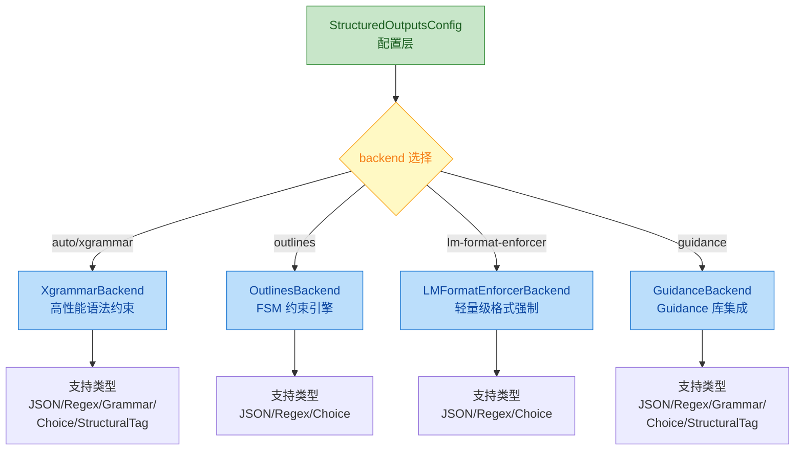
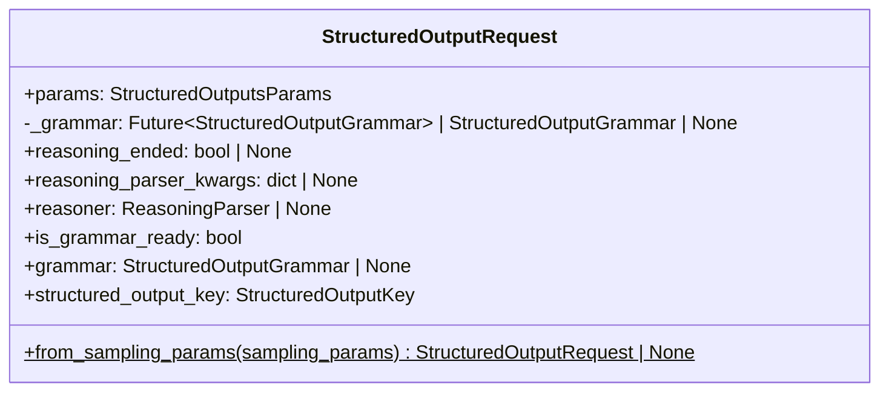
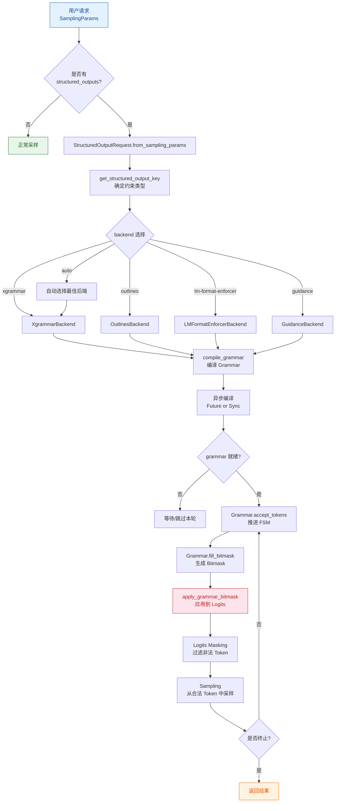
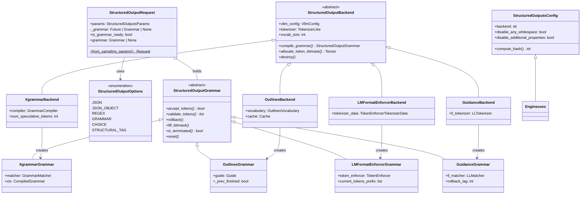

# vLLM 结构化输出约束分析文档

## 📌 定位

本文档深入分析 vLLM 的**结构化输出（Structured Output）**系统架构与实现细节。结构化输出是 LLM 推理中的关键技术，通过在 token 生成阶段施加语法约束（JSON Schema、正则表达式、Grammar 等），确保模型输出符合预定义的结构规范。



---

## 一、StructuredOutputsConfig 配置

### 📍 源码位置
[structured_outputs.py](file:///workspace/vllm/config/structured_outputs.py)

### 核心配置类

`StructuredOutputsConfig` 是引擎级别的结构化输出配置类，定义了后端选择和行为控制参数。

#### 配置参数说明

| 参数名 | 类型 | 默认值 | 说明 |
|--------|------|--------|------|
| `backend` | `Literal["auto", "xgrammar", "guidance", "outlines", "lm-format-enforcer"]` | `"auto"` | 选择结构化输出后端。`"auto"` 会根据请求内容和库支持自动选择 |
| `disable_any_whitespace` | `bool` | `False` | 禁止 JSON 输出中的空白字符（紧凑格式）。仅 xgrammar 和 guidance 支持 |
| `disable_additional_properties` | `bool` | `False` | guidance 后端不使用 `additionalProperties`。仅 guidance 后端支持 |
| `reasoning_parser` | `str` | `""` | 推理内容解析器选择 |
| `reasoning_parser_plugin` | `str` | `""` | 动态加载的推理解析器插件路径 |
| `enable_in_reasoning` | `bool` | `False` | 是否在推理阶段使用结构化输入 |

### 关键源码片段

**1. 后端类型定义** ([structured_outputs.py:12-14](file:///workspace/vllm/config/structured_outputs.py#L12-L14))

```python
StructuredOutputsBackend = Literal[
    "auto", "xgrammar", "guidance", "outlines", "lm-format-enforcer"
]
```

**2. 配置验证逻辑** ([structured_outputs.py:62-73](file:///workspace/vllm/config/structured_outputs.py#L62-L73))

```python
@model_validator(mode="after")
def _validate_structured_output_config(self) -> Self:
    if self.disable_any_whitespace and self.backend not in ("xgrammar", "guidance"):
        raise ValueError(
            "disable_any_whitespace is only supported for "
            "xgrammar and guidance backends."
        )
    if self.disable_additional_properties and self.backend != "guidance":
        raise ValueError(
            "disable_additional_properties is only supported "
            "for the guidance backend."
        )
    return self
```

**3. Hash 计算** ([structured_outputs.py:44-60](file:///workspace/vllm/config/structured_outputs.py#L44-L60))

该 config **不影响计算图**（computation graph），因此 hash 计算返回空因子列表：

```python
def compute_hash(self) -> str:
    factors: list[Any] = []
    hash_str = safe_hash(str(factors).encode(), usedforsecurity=False).hexdigest()
    return hash_str
```

---

## 二、后端实现（四种后端逐一深入分析）

### 类型系统基础

在分析各后端之前，先理解抽象基类定义：

📍 [backend_types.py](file:///workspace/vllm/v1/structured_output/backend_types.py)

#### StructuredOutputOptions 枚举 ([backend_types.py:19-25](file:///workspace/vllm/v1/structured_output/backend_types.py#L19-L25))

```python
class StructuredOutputOptions(enum.Enum):
    JSON = enum.auto()
    JSON_OBJECT = enum.auto()
    REGEX = enum.auto()
    GRAMMAR = enum.auto()
    CHOICE = enum.auto()
    STRUCTURAL_TAG = enum.auto()
```

#### StructuredOutputGrammar 抽象基类 ([backend_types.py:31-95](file:///workspace/vllm/v1/structured_output/backend_types.py#L31-L95))

请求级别的 Grammar 实现，必须实现以下方法：

| 方法 | 功能说明 |
|------|----------|
| `accept_tokens(request_id, tokens)` | 接受 token 列表并推进 FSM，返回是否成功 |
| `validate_tokens(tokens)` | 验证 token 是否被接受（不推进 FSM） |
| `rollback(num_tokens)` | 回滚指定数量的 token |
| `fill_bitmask(bitmask, idx)` | 填充 bitmask 用于 logits masking |
| `is_terminated()` | 检查是否终止 |
| `reset()` | 重置状态 |

#### StructuredOutputBackend 抽象基类 ([backend_types.py:98-136](file:///workspace/vllm/v1/structured_output/backend_types.py#L98-L136))

引擎级别的后端实现，必须实现：

| 方法 | 功能说明 |
|------|----------|
| `compile_grammar(request_type, grammar_spec)` | 编译 grammar 规范为 StructuredOutputGrammar |
| `allocate_token_bitmask(max_num_seqs)` | 分配 token bitmask 内存 |
| `destroy()` | 清理资源 |

---

### 2.1 XgrammarBackend - 高性能语法约束

📍 [backend_xgrammar.py](file:///workspace/vllm/v1/structured_output/backend_xgrammar.py)

#### 核心原理

**Xgrammar** 是 MLC-AI 开发的高性能语法约束库，基于 **LLAMA.cpp 的 GBNF (Grammar-Based Normal Form)** 语法格式。其核心优势在于：

1. **原生 C++ 实现**：编译和匹配性能极高
2. **直接 Bitmask 操作**：通过 `fill_next_token_bitmask` 直接操作 GPU tensor
3. **Jump-forward 解码**：支持跳过确定性 token 加速生成
4. **Speculative Decoding 支持**：内置回滚机制

#### 初始化流程 ([backend_xgrammar.py:36-75](file:///workspace/vllm/v1/structured_output/backend_xgrammar.py#L36-L75))

```python
@dataclass
class XgrammarBackend(StructuredOutputBackend):
    def __post_init__(self):
        self.disable_any_whitespace = (
            self.vllm_config.structured_outputs_config.disable_any_whitespace
        )

        # 特殊处理 Mistral tokenizer（Tekken 编码）
        if is_mistral_tokenizer(self.tokenizer):
            stop_token_ids = [self.tokenizer.eos_token_id]
            self.vocab_size = len(self.tokenizer.vocab)
            tokenizer_info = xgr.TokenizerInfo(
                encoded_vocab=self.tokenizer.vocab,
                vocab_type=xgr.VocabType.RAW if self.tokenizer.is_tekken
                else xgr.VocabType.BYTE_FALLBACK,
                vocab_size=self.vocab_size,
                stop_token_ids=stop_token_ids,
                add_prefix_space=True,
            )
        else:
            tokenizer_info = xgr.TokenizerInfo.from_huggingface(
                self.tokenizer, vocab_size=self.vocab_size
            )

        # 创建 GrammarCompiler（带缓存）
        self.compiler = xgr.GrammarCompiler(
            tokenizer_info,
            max_threads=8,
            cache_enabled=True,
            cache_limit_bytes=vllm.envs.VLLM_XGRAMMAR_CACHE_MB * 1024 * 1024,
        )

        # Speculative decoding 支持
        self.num_speculative_tokens = 0
        if self.vllm_config.speculative_config is not None:
            self.num_speculative_tokens = (
                self.vllm_config.speculative_config.num_speculative_tokens
            )
```

**关键特性**：
- **TokenizerInfo 构建**：区分 Mistral/Tekken tokenizer 和标准 HF tokenizer
- **GrammarCompiler 缓存**：避免重复编译相同 grammar
- **Speculative tokens 回滚**：设置 `max_rollback_tokens`

#### Grammar 编译逻辑 ([backend_xgrammar.py:77-122](file:///workspace/vllm/v1/structured_output/backend_xgrammar.py#L77-L122))

```python
def compile_grammar(
    self, request_type: StructuredOutputOptions, grammar_spec: str
) -> StructuredOutputGrammar:
    if request_type == StructuredOutputOptions.JSON:
        ctx = self.compiler.compile_json_schema(
            grammar_spec, any_whitespace=not self.disable_any_whitespace
        )
    elif request_type == StructuredOutputOptions.JSON_OBJECT:
        ctx = self.compiler.compile_json_schema(
            '{"type": "object"}', any_whitespace=not self.disable_any_whitespace
        )
    elif request_type == StructuredOutputOptions.GRAMMAR:
        ctx = self.compiler.compile_grammar(grammar_spec)
    elif request_type == StructuredOutputOptions.REGEX:
        ctx = self.compiler.compile_regex(grammar_spec)
    elif request_type == StructuredOutputOptions.STRUCTURAL_TAG:
        # 处理 structural tag（工具调用场景）
        s_tag = json.loads(grammar_spec)
        if "structures" in s_tag:
            tags = [
                xgr.StructuralTagItem(
                    begin=s["begin"],
                    schema=json.dumps(s["schema"]),
                    end=s["end"],
                )
                for s in s_tag["structures"]
            ]
            ctx = self.compiler.compile_structural_tag(tags, s_tag["triggers"])
        else:
            ctx = self.compiler.compile_structural_tag(grammar_spec)
    else:
        raise ValueError(...)

    return XgrammarGrammar(
        matcher=xgr.GrammarMatcher(ctx, max_rollback_tokens=self.num_speculative_tokens),
        vocab_size=self.vocab_size,
        ctx=ctx,
    )
```

**支持的编译类型映射**：

| Request Type | 编译方法 | 说明 |
|--------------|----------|------|
| JSON | `compile_json_schema()` | JSON Schema → Grammar |
| JSON_OBJECT | `compile_json_schema('{"type": "object"}')` | 任意 JSON 对象 |
| GRAMMAR | `compile_grammar()` | EBNF/Grammar 字符串 |
| REGEX | `compile_regex()` | 正则表达式 → Grammar |
| STRUCTURAL_TAG | `compile_structural_tag()` | 结构化标签（工具调用） |

#### XgrammarGrammar - Token 级别操作 ([backend_xgrammar.py:131-199](file:///workspace/vllm/v1/structured_output/backend_xgrammar.py#L131-L199))

```python
@dataclass
class XgrammarGrammar(StructuredOutputGrammar):
    vocab_size: int
    matcher: xgr.GrammarMatcher
    ctx: xgr.CompiledGrammar
    num_processed_tokens: int = field(default_factory=lambda: 0, ...)
    _is_terminated: bool = field(default=False, ...)

    def accept_tokens(self, request_id: str, tokens: list[int]) -> bool:
        """推进 FSM 状态机"""
        if self._is_terminated:
            return False
        for token in tokens:
            if not self.matcher.accept_token(token):
                logger.error("Failed to advance FSM for request %s", request_id)
                return False
            self.num_processed_tokens += 1
        self._is_terminated = self.matcher.is_terminated()
        return True

    def validate_tokens(self, tokens: list[int]) -> list[int]:
        """验证 token 但不推进状态"""
        accepted_tokens = []
        for token in tokens:
            if self.matcher.accept_token(token):
                accepted_tokens.append(token)
            else:
                break
        if len(accepted_tokens) > 0:
            self.matcher.rollback(len(accepted_tokens))  # 回滚到初始状态
        return accepted_tokens

    def rollback(self, num_tokens: int) -> None:
        """回滚状态"""
        self.matcher.rollback(num_tokens)
        self.num_processed_tokens -= num_tokens
        self._is_terminated = self.matcher.is_terminated()

    def fill_bitmask(self, bitmask: torch.Tensor, idx: int) -> None:
        """填充下一轮允许的 token bitmask"""
        self.matcher.fill_next_token_bitmask(bitmask, idx)
```

**核心机制**：
- **FSM（有限状态机）**：每个 token 推进状态机一步
- **Bitmask 填充**：直接告诉 GPU 哪些 token 是合法的
- **回滚支持**：用于 speculative decoding 场景

#### 验证函数 - 不支持的 JSON Schema 特性检测 ([backend_xgrammar.py:221-265](file:///workspace/vllm/v1/structured_output/backend_xgrammar.py#L221-L265))

```python
STRING_SUPPORTED_FORMATS = {
    "email", "date", "time", "date-time", "duration",
    "ipv4", "ipv6", "hostname", "uuid", "uri",
    "uri-reference", "uri-template", "json-pointer", "relative-json-pointer"
}

def has_xgrammar_unsupported_json_features(schema: dict[str, Any]) -> bool:
    """递归检查 JSON schema 是否包含 xgrammar 不支持的特性"""

    def check_object(obj: dict[str, Any]) -> bool:
        # 1. 数值类型的 multipleOf 不支持
        if obj.get("type") in ("integer", "number") and ("multipleOf" in obj):
            return True

        # 2. 数组的 uniqueItems/contains/minContains/maxContains 不支持
        if obj.get("type") == "array" and any(
            key in obj for key in ("uniqueItems", "contains", "minContains", "maxContains")
        ):
            return True

        # 3. 字符串 format 仅支持特定集合
        if obj.get("type") == "string" and "format" in obj \
           and obj["format"] not in STRING_SUPPORTED_FORMATS:
            return True

        # 4. 对象的 patternProperties/propertyNames 不支持
        if obj.get("type") == "object" and any(
            key in obj for key in ("patternProperties", "propertyNames")
        ):
            return True

        # 5. 递归检查嵌套对象
        for value in obj.values():
            ...
        return False

    return check_object(schema)
```

---

### 2.2 OutlinesBackend - 基于 FSM 的约束引擎

📍 [backend_outlines.py](file:///workspace/vllm/v1/structured_output/backend_outlines.py)

#### 核心原理

**Outlines** 库（现 outlines_core）的核心思想是：

1. **Regex → DFA 转换**：将正则表达式转换为确定性有限自动机（DFA）
2. **Vocabulary 映射**：将 DFA 状态映射到 token vocabulary
3. **Index 构建**：构建高效的查找索引加速 mask 计算
4. **Guide 引擎**：通过 Guide 对象管理状态转换

#### 初始化流程 ([backend_outlines.py:52-55](file:///workspace/vllm/v1/structured_output/backend_outlines.py#L52-L55))

```python
@dataclass
class OutlinesBackend(StructuredOutputBackend):
    def __post_init__(self):
        self.vocabulary = get_outlines_vocabulary(self.tokenizer)
        self.cache = get_outlines_cache()  # LRU 或 disk cache
```

**Vocabulary 构建过程**（详见 utils.py）：
- 从 tokenizer 提取词汇表
- 处理特殊 token（如 `<0xXX>` byte token）
- 构建 bytes → token_ids 映射
- 计算 hash 用于缓存键

#### Grammar 编译逻辑 ([backend_outlines.py:69-93](file:///workspace/vllm/v1/structured_output/backend_outlines.py#L69-L93))

```python
def compile_grammar(
    self, request_type: StructuredOutputOptions, grammar_spec: str
) -> StructuredOutputGrammar:
    if request_type == StructuredOutputOptions.JSON:
        regex = json_schema.build_regex_from_schema(grammar_spec)
    elif request_type == StructuredOutputOptions.REGEX:
        regex = grammar_spec
    elif request_type == StructuredOutputOptions.CHOICE:
        choices = ast.literal_eval(grammar_spec)
        choices = [regex_escape(c) for c in choices]
        regex = "(" + "|".join(choices) + ")"
    else:
        raise ValueError(...)

    index = self._compile_index(regex, self.vocabulary)
    max_rollback_tokens = (
        self.vllm_config.speculative_config.num_speculative_tokens
        if self.vllm_config.speculative_config is not None else 0
    )
    return OutlinesGrammar(
        vocab_size=self.vocab_size,
        guide=oc.Guide(index, max_rollback=max_rollback_tokens),
    )
```

**关键特点**：
- **JSON Schema → Regex**：通过 `json_schema.build_regex_from_schema()` 转换
- **Choice → Regex**：将选项列表转换为 `(choice1|choice2|...)` 格式
- **不支持 Grammar 类型**：Outlines 后端不支持原始 Grammar 规范

#### Index 编译与缓存 ([backend_outlines.py:57-67](file:///workspace/vllm/v1/structured_output/backend_outlines.py#L57-L67))

```python
def _compile_index(self, regex_string: str, vocabulary: OutlinesVocabulary) -> oc.Index:
    cache_key = f"{vocabulary._hash}_{regex_string}"
    if cache_key in self.cache:
        return self.cache[cache_key]

    index = oc.Index(regex_string, vocabulary.inner)
    self.cache[cache_key] = index
    return index
```

缓存策略：
- **LRU Cache**（默认）：内存缓存，最多 128 条目
- **Disk Cache**（可选）：通过 `VLLM_V1_USE_OUTLINES_CACHE=1` 启用

#### OutlinesGrammar - Guide 状态管理 ([backend_outlines.py:107-164](file:///workspace/vllm/v1/structured_output/backend_outlines.py#L107-L164))

```python
@dataclass
class OutlinesGrammar(StructuredOutputGrammar):
    vocab_size: int
    guide: oc.Guide
    num_processed_tokens: int = field(default_factory=lambda: 0, ...)
    _prev_finished: bool = field(default=False, ...)  # 延迟 finished 信号

    def accept_tokens(self, request_id: str, tokens: list[int]) -> bool:
        """
        两阶段检查：
        1. accepts_tokens(): 检查当前 token 是否可接受
        2. advance(): 实际推进状态（可能到达 dead state）
        """
        if self.guide.accepts_tokens(tokens):
            for t in tokens:
                self.guide.advance(t)
                self.num_processed_tokens += 1
            return True
        return False

    def is_terminated(self) -> bool:
        """延迟 finished 信号：DFA accept 后再等一轮让 EOS 可发出"""
        curr = self.guide.is_finished()
        prev = self._prev_finished
        self._prev_finished = curr
        return prev

    def fill_bitmask(self, bitmask: torch.Tensor, idx: int) -> None:
        """通过 Guide 写入 mask 到 GPU memory"""
        mask = bitmask[idx]
        self.guide.write_mask_into(mask.data_ptr(), mask.numel(), mask.element_size())
```

**特殊设计 - `_prev_finished` 延迟机制**：
- Outlines_core 在 DFA 到达 accept 状态时立即标记 finished
- 但 vLLM 需要在 finished 后还能发出 EOS token
- 因此延迟一周期返回 terminated 信号

#### 正则表达式验证 ([backend_outlines.py:299-330](file:///workspace/vllm/v1/structured_output/backend_outlines.py#L299-330))

Outlines 后端对正则表达式有严格限制：

```python
def validate_regex_is_buildable(pattern: str) -> None:
    """
    验证正则表达式是否符合 regex-automata 的要求：
    1. 无 backreferences（反向引用）
    2. 无 look-around assertions（前瞻/后瞻断言）
    3. 无 Unicode word boundaries（\b, \B）
    4. 必须有 universal start state（无锚定前缀）
    """
    parsed = sre_parse.parse(pattern)
    _check_unsupported(parsed)  # 检查不支持的特性
    if _prefix_needs_context(parsed):  # 检查是否有锚定前缀
        raise ValueError("Regex does not have a anchored universal start state...")
```

**不支持的正则特性**：
| 特性 | 示例 | 原因 |
|------|------|------|
| Backreferences | `\1`, `\k<name>` | DFA 无法处理 |
| Look-ahead | `(?=...)`, `(?!...)` | 需要 context |
| Look-behind | `(?<=...)`, `(?<!...)` | 需要 context |
| Word boundary | `\b`, `\B` | Unicode 边界复杂 |

---

### 2.3 LMFormatEnforcerBackend - 轻量级格式强制

📍 [backend_lm_format_enforcer.py](file:///workspace/vllm/v1/structured_output/backend_lm_format_enforcer.py)

#### 核心原理

**lm-format-enforcer** 是一个轻量级的格式强制库，采用**字符级别解析器**（CharacterLevelParser）方式工作：

1. **Parser 定义**：定义字符级别的输出约束规则
2. **Token 允许集计算**：根据当前已生成的 prefix 计算下一个合法 token 集合
3. **TokenEnforcer**：封装 tokenizer 和 parser，提供高效查询接口

#### 初始化流程 ([backend_lm_format_enforcer.py:94-98](file:///workspace/vllm/v1/structured_output/backend_lm_format_enforcer.py#L94-L98))

```python
@dataclass
class LMFormatEnforcerBackend(StructuredOutputBackend):
    def __post_init__(self):
        # 使用 LRU cache 缓存 tokenizer_data 构建结果
        self.tokenizer_data = _cached_build_vllm_token_enforcer_tokenizer_data(
            self.tokenizer, self.vocab_size
        )
```

**Tokenizer Data 构建**（cached）：
```python
@lru_cache
def _cached_build_vllm_token_enforcer_tokenizer_data(
    tokenizer: PreTrainedTokenizerBase, vocab_size: int
) -> "lmfe_vllm.TokenEnforcerTokenizerData":
    return lmfe_vllm.build_vllm_token_enforcer_tokenizer_data(
        tokenizer, use_bitmask=True, vocab_size=vocab_size
    )
```

#### Grammar 编译 - CharacterLevelParser 选择 ([backend_lm_format_enforcer.py:100-135](file:///workspace/vllm/v1/structured_output/backend_lm_format_enforcer.py#L100-L135))

```python
def compile_grammar(
    self, request_type: StructuredOutputOptions, grammar_spec: str
) -> StructuredOutputGrammar:
    character_level_parser: lmformatenforcer.CharacterLevelParser

    if request_type == StructuredOutputOptions.JSON:
        spec_dict = json.loads(grammar_spec)
        character_level_parser = lmformatenforcer.JsonSchemaParser(spec_dict)
    elif request_type == StructuredOutputOptions.JSON_OBJECT:
        character_level_parser = lmformatenforcer.JsonSchemaParser(None)
    elif request_type == StructuredOutputOptions.REGEX:
        character_level_parser = lmformatenforcer.RegexParser(grammar_spec)
    elif request_type == StructuredOutputOptions.CHOICE:
        choices = ast.literal_eval(grammar_spec)
        character_level_parser = lmformatenforcer.UnionParser(
            [lmformatenforcer.StringParser(choice) for choice in choices]
        )
    else:
        raise ValueError(...)

    # ⚠️ 不支持 speculative decoding
    if max_rollback_tokens > 0:
        raise ValueError(
            "LM Format Enforcer backend does not support speculative tokens"
        )

    token_enforcer = lmformatenforcer.TokenEnforcer(
        tokenizer_data=self.tokenizer_data,
        parser=character_level_parser,
    )
    return LMFormatEnforcerGrammar(token_enforcer)
```

**Parser 类型对应关系**：

| Request Type | Parser 类 | 说明 |
|--------------|-----------|------|
| JSON | `JsonSchemaParser(schema_dict)` | JSON Schema 约束 |
| JSON_OBJECT | `JsonSchemaParser(None)` | 任意 JSON 对象 |
| REGEX | `RegexParser(pattern)` | 正则表达式约束 |
| CHOICE | `UnionParser([StringParser(...)])` | 多选一约束 |

#### LMFormatEnforcerGrammar - Prefix 追踪机制 ([backend_lm_format_enforcer.py:43-90](file:///workspace/vllm/v1/structured_output/backend_lm_format_enforcer.py#L43-L90))

```python
@dataclass
class LMFormatEnforcerGrammar(StructuredOutputGrammar):
    token_enforcer: lmformatenforcer.TokenEnforcer
    current_tokens_prefix: list[int] = field(default_factory=list)

    def accept_tokens(self, request_id: str, tokens: list[int]) -> bool:
        """逐个检查 token 是否在允许集中"""
        original_len = len(self.current_tokens_prefix)
        for token in tokens:
            if not self.token_enforcer.get_allowed_tokens(
                self.current_tokens_prefix
            ).is_token_allowed(token):
                # 原子性操作：失败时回滚部分更新
                del self.current_tokens_prefix[original_len:]
                return False
            self.current_tokens_prefix.append(token)
        return True

    def fill_bitmask(self, bitmask: torch.Tensor, batch_index: int) -> None:
        """获取当前 prefix 的允许 token 集合并写入 bitmask"""
        allowed_tokens = self.token_enforcer.get_allowed_tokens(
            self.current_tokens_prefix
        )
        bitmask[batch_index] = allowed_tokens.allowed_tokens

    def is_terminated(self) -> bool:
        """当最后一个 token 是 EOS 时认为终止"""
        return (
            len(self.current_tokens_prefix) > 0
            and self.current_tokens_prefix[-1] == self.token_enforcer.eos_token_id
        )
```

**核心特点**：
- **Prefix 追踪**：维护已生成的 token 序列作为上下文
- **原子性操作**：accept 失败时完整回滚
- **不支持 Speculative Decoding**：明确抛出异常

---

### 2.4 GuidanceBackend - Guidance 库集成

📍 [backend_guidance.py](file:///workspace/vllm/v1/structured_output/backend_guidance.py)

#### 核心原理

**Guidance**（通过 llguidance 库集成）是微软开发的约束生成框架，特点包括：

1. **高级 Grammar 表示**：支持复杂的结构化标签（Structural Tag）
2. **Flexible Whitespace**：可配置空白字符处理
3. **Additional Properties 控制**：精细控制 JSON Schema 行为
4. **LLMatcher**：高性能的 token 级别匹配器

#### 初始化流程 ([backend_guidance.py:87-101](file:///workspace/vllm/v1/structured_output/backend_guidance.py#L87-L101))

```python
@dataclass
class GuidanceBackend(StructuredOutputBackend):
    def __post_init__(self):
        self.disable_any_whitespace = (
            self.vllm_config.structured_outputs_config.disable_any_whitespace
        )
        self.disable_additional_properties = (
            self.vllm_config.structured_outputs_config.disable_additional_properties
        )

        # 特殊处理 Mistral tokenizer
        if is_mistral_tokenizer(self.tokenizer):
            self.ll_tokenizer = self.tokenizer.llg_tokenizer
        else:
            self.ll_tokenizer = llguidance_hf.from_tokenizer(
                self.tokenizer, max(self.vocab_size, len(self.tokenizer))
            )
```

#### Grammar 序列化 - 统一入口 ([backend_guidance.py:219-285](file:///workspace/vllm/v1/structured_output/backend_guidance.py#L219-L285))

```python
def serialize_guidance_grammar(
    request_type: StructuredOutputOptions,
    grammar_spec: str | dict[str, Any],
    disable_any_whitespace: bool = False,
    disable_additional_properties: bool = False,
) -> str:

    def _process_schema(grammar_spec) -> str:
        if disable_additional_properties:
            grammar_spec = process_for_additional_properties(grammar_spec)
        return llguidance.LLMatcher.grammar_from_json_schema(
            grammar_spec,
            defaults={"whitespace_flexible": not disable_any_whitespace},
        )

    if request_type == StructuredOutputOptions.JSON:
        return _process_schema(grammar_spec)
    elif request_type == StructuredOutputOptions.REGEX:
        tp = "regex"
    elif request_type == StructuredOutputOptions.GRAMMAR:
        tp = "grammar"
    elif request_type == StructuredOutputOptions.CHOICE:
        tp = "choice"
    elif request_type == StructuredOutputOptions.STRUCTURAL_TAG:
        # 处理结构化标签（复杂工具调用场景）
        s_tag = json.loads(grammar_spec) if isinstance(grammar_spec, str) else grammar_spec
        triggers = s_tag["triggers"]
        tags = []
        for s in s_tag["structures"]:
            begin = s["begin"]
            trig = next((t for t in triggers if begin.startswith(t)), None)
            tags.append(llguidance.StructTag(
                trigger=trig,
                begin=s["begin"],
                grammar=_process_schema(s["schema"]),
                end=s["end"],
            ))
        return llguidance.StructTag.to_grammar(tags)

    return llguidance.grammar_from(tp, grammar_spec)
```

**Additional Properties 处理** ([backend_guidance.py:35-46](file:///workspace/vllm/v1/structured_output/backend_guidance.py#L35-L46))：

```python
def _walk_json_for_additional_properties(data: object):
    """递归遍历 JSON schema，为包含 properties 的对象添加 additionalProperties: false"""
    if isinstance(data, dict):
        for value in data.values():
            _walk_json_for_additional_properties(value)
        if "additionalProperties" not in data and (
            "properties" in data or "patternProperties" in data
        ):
            data["additionalProperties"] = False
    elif isinstance(data, list):
        for item in data:
            _walk_json_for_additional_properties(item)
```

#### GuidanceGrammar - LLMatcher 封装 ([backend_guidance.py:137-217](file:///workspace/vllm/v1/structured_output/backend_guidance.py#L137-L217))

```python
@dataclass
class GuidanceGrammar(StructuredOutputGrammar):
    ll_matcher: llguidance.LLMatcher
    ll_tokenizer: llguidance.LLTokenizer
    vocab_size: int
    printed_error: bool = False
    terminated: bool = False
    rollback_lag: int = 0  # EOS 延迟计数器

    def accept_tokens(self, request_id: str, tokens: list[int]) -> bool:
        # 检测 EOS token
        if self.ll_tokenizer.eos_token in tokens:
            if self.ll_matcher.is_stopped() and not self.terminated:
                self.rollback_lag = 1  # 延迟终止信号
            self.terminated = True

        if self.ll_matcher.is_stopped():
            return True

        # 消费 token 并推进解析器
        r = self.ll_matcher.consume_tokens(tokens)
        self.check_error()
        return r

    def fill_bitmask(self, bitmask: torch.Tensor, idx: int) -> None:
        """自动处理 stopped/error 状态下的 mask"""
        llguidance_torch.fill_next_token_bitmask(self.ll_matcher, bitmask, idx)
        self.check_error()

    def rollback(self, num_tokens: int) -> None:
        if num_tokens > 0:
            self.ll_matcher.rollback(num_tokens - self.rollback_lag)
            self.terminated = False
            self.rollback_lag = 0
            self.check_error()
```

**特殊设计 - rollback_lag**：
- 与 Outlines 类似，Guidance 也需要延迟终止信号以允许 EOS 发出
- 通过 `rollback_lag` 计数器实现精确控制

#### 不支持的 JSON Schema 特性 ([backend_guidance.py:48-71](file:////workspace/vllm/v1/structured_output/backend_guidance.py#L48-L71))

```python
def has_guidance_unsupported_json_features(schema: dict[str, Any]) -> bool:
    def check_object(obj: dict[str, Any]) -> bool:
        # patternProperties 不被 llguidance 支持
        if "patternProperties" in obj:
            return True
        # 递归检查嵌套对象
        for value in obj.values():
            ...
        return False
    return check_object(schema)
```

---

## 三、支持的结构类型对比

### 3.1 各后端支持矩阵

| 结构类型 | Xgrammar | Outlines | LM Format Enforcer | Guidance |
|----------|----------|----------|-------------------|----------|
| **JSON Schema** | ✅ 完整支持 | ✅ (转 Regex) | ✅ | ✅ 完整支持 |
| **JSON Object** | ✅ | ❌ | ✅ | ✅ |
| **正则表达式** | ✅ | ✅ (有限制) | ✅ | ✅ |
| **Grammar (EBNF)** | ✅ | ❌ | ❌ | ✅ |
| **Choice** | ✅ (转 Grammar) | ✅ (转 Regex) | ✅ | ✅ |
| **Structural Tag** | ✅ | ❌ | ❌ | ✅ |
| **Speculative Decoding** | ✅ | ✅ | ❌ | ✅ |
| **Jump-forward** | ✅ | ❌ | ❌ | ⚠️ TODO |

### 3.2 详细说明

#### JSON Schema 约束

**用途**：确保输出符合 JSON Schema 定义的数据结构

**示例**：
```python
sampling_params = SamplingParams(
    structured_outputs=StructuredOutputsParams(
        json='{"type": "object", "properties": {"name": {"type": "string"}, "age": {"type": "integer"}}}'
    )
)
```

**各后端差异**：
- **Xgrammar**：直接编译 JSON Schema 为 Grammar，性能最优
- **Outlines**：先转换为正则表达式，再构建 DFA
- **LM Format Enforcer**：使用 JsonSchemaParser 字符级解析
- **Guidance**：通过 LLMatcher.grammar_from_json_schema() 处理

#### 正则表达式约束

**用途**：通过正则表达式限制输出格式

**示例**：
```python
sampling_params = SamplingParams(
    structured_outputs=StructuredOutputsParams(regex=r"\d{3}-\d{4}")
)
```

**限制**：
- Outlines 不支持：backreference、look-around、word boundary
- 其他后端基本无限制

#### Grammar (EBNF/CFG) 约束

**用途**：使用形式语法定义复杂输出结构

**示例**：
```python
ebnf_grammar = """
root ::= expression
expression ::= term ("+" term)*
term ::= factor ("*" factor)*
factor ::= number | "(" expression ")"
number ::= [0-9]+
"""
sampling_params = SamplingParams(
    structured_outputs=StructuredOutputsParams(grammar=ebnf_grammar)
)
```

**Lark ↔ EBNF 转换** ([utils.py:289-448](file:///workspace/vllm/v1/structured_output/utils.py#L289-L448))：

Xgrammar 仅支持 EBNF 格式，但用户可能提供 Lark 格式的 grammar。utils.py 提供 `convert_lark_to_ebnf()` 函数进行转换：

```python
def convert_lark_to_ebnf(grammar_str: str) -> str:
    """
    Lark 格式: rule: 'hello'
    EBNF 格式: root ::= rule\nrule ::= "hello"

    主要转换：
    1. 添加 root 规则指向第一个规则
    2. 单引号 → 双引号
    3. : → ::=
    4. | alternatives 处理
    """
```

#### Choice 约束

**用途**：从预定义选项中选择输出

**示例**：
```python
sampling_params = SamplingParams(
    structured_outputs=StructuredOutputsParams(choice=["positive", "negative", "neutral"])
)
```

**内部转换**：
- **Xgrammar**：转换为 `"root ::= "positive" | "negative" | "neutral"` EBNF grammar
- **Outlines**：转换为 `"(positive|negative|neutral)"` 正则表达式
- **LM Format Enforcer**：使用 UnionParser([StringParser(...)])
- **Guidance**：直接传递 choice 类型

#### 工具调用格式约束（Structural Tag）

**用途**：OpenAI 函数调用 / 工具调用的结构化输出

**示例**：
```python
structural_tag = {
    "triggers": ["<function_call>"],
    "structures": [
        {
            "begin": "<function_call>",
            "schema": {"type": "object", "properties": {"name": {"type": "string"}}},
            "end": "</function_call>"
        }
    ]
}
```

**支持情况**：
- **Xgrammar**：✅ 通过 `compile_structural_tag()` 支持
- **Guidance**：✅ 通过 `StructTag.to_grammar()` 支持
- **其他后端**：❌ 不支持

---

## 四、Request 级别配置

📍 [request.py](file:///workspace/vllm/v1/structured_output/request.py)

### StructuredOutputRequest 类



#### 核心功能 ([request.py:22-75](file:///workspace/vllm/v1/structured_output/request.py#L22-L75))

```python
@dataclasses.dataclass
class StructuredOutputRequest:
    params: StructuredOutputsParams
    _grammar: Future[StructuredOutputGrammar] | StructuredOutputGrammar | None = None
    reasoning_ended: bool | None = None
    reasoning_parser_kwargs: dict[str, Any] | None = None
    reasoner: "ReasoningParser | None" = None

    @staticmethod
    def from_sampling_params(
        sampling_params: SamplingParams | None,
    ) -> "StructuredOutputRequest | None":
        """从 SamplingParams 创建请求，如果无约束则返回 None"""
        if sampling_params is None:
            return None
        params = sampling_params.structured_outputs
        if not params or params.all_constraints_none():
            return None
        return StructuredOutputRequest(params=params)

    @property
    def is_grammar_ready(self) -> bool:
        """检查异步编译的 grammar 是否就绪（100μs 超时）"""
        return self._check_grammar_completion()

    @property
    def grammar(self) -> StructuredOutputGrammar | None:
        """获取已编译的 grammar（如果就绪）"""
        completed = self._check_grammar_completion()
        return cast(StructuredOutputGrammar | None, self._grammar) if completed else None
```

**关键设计 - 异步 Grammar 编译**：
- `_grammar` 可以是 `Future` 对象（异步编译中）或已完成的 `StructuredOutputGrammar`
- `is_grammar_ready` 属性非阻塞检查（100μs 超时）
- 支持并发编译多个 grammar 而不阻塞调度循环

#### Structured Output Key 生成 ([request.py:77-98](file:///workspace/vllm/v1/structured_output/request.py#L77-L98))

```python
def get_structured_output_key(params: StructuredOutputsParams) -> StructuredOutputKey:
    """根据优先级确定请求的类型和规范字符串"""
    if params.json is not None:
        if not isinstance(params.json, str):
            json_str = json.dumps(params.json)
        else:
            json_str = params.json
        return StructuredOutputOptions.JSON, json_str
    if params.json_object:
        return StructuredOutputOptions.JSON_OBJECT, ""
    if params.regex is not None:
        return StructuredOutputOptions.REGEX, params.regex
    if params.choice is not None:
        if not isinstance(params.choice, str):
            json_str = json.dumps(params.choice)
        else:
            json_str = params.choice
        return StructuredOutputOptions.CHOICE, json_str
    if params.grammar is not None:
        return StructuredOutputOptions.GRAMMAR, params.grammar
    if params.structural_tag is not None:
        return StructuredOutputOptions.STRUCTURAL_TAG, params.structural_tag
    raise ValueError("No valid structured output parameter found")
```

**优先级顺序**：JSON > JSON_OBJECT > REGEX > CHOICE > GRAMMAR > STRUCTURAL_TAG

---

## 五、工具函数与辅助模块

### 5.1 Utils 工具函数

📍 [utils.py](file:///workspace/vllm/v1/structured_output/utils.py)

#### apply_grammar_bitmask - Bitmask 应用 ([utils.py:44-135](file:///workspace/vllm/v1/structured_output/utils.py#L44-L135))

这是结构化输出的**核心函数**，负责将 grammar bitmask 应用到模型输出 logits 上：

```python
def apply_grammar_bitmask(
    scheduler_output: SchedulerOutput,
    grammar_output: GrammarOutput,
    input_batch: InputBatch,
    logits: torch.Tensor,
) -> None:
    """
    应用 grammar bitmask 到模型输出 logits

    流程：
    1. 从 scheduler 获取 compacted bitmask
    2. 根据 batch index 重新排序（因为 scheduler 和 runner 的顺序可能不同）
    3. 处理 speculative decode tokens 的 offset
    4. 将 numpy array 转换为 torch tensor 并复制到 GPU
    5. 调用 xgr.apply_token_bitmask_inplace() 修改 logits
    """

    # 1. 获取结构化输出请求的 batch indices
    struct_out_req_batch_indices: dict[str, int] = {}
    cumulative_offset = 0
    spec_tokens = scheduler_output.scheduled_spec_decode_tokens
    struct_out_req_ids = set(grammar_output.structured_output_request_ids)

    for batch_index, req_id in enumerate(input_batch.req_ids):
        logit_index = batch_index + cumulative_offset
        cumulative_offset += len(spec_tokens.get(req_id, ()))
        if req_id in struct_out_req_ids:
            struct_out_req_batch_indices[req_id] logit_index

    # 2. 重新排序 bitmask 以匹配 batch 顺序
    sorted_bitmask = np.full(
        shape=(logits.shape[0], grammar_bitmask.shape[1]),
        fill_value=-1,
        dtype=grammar_bitmask.dtype,
    )
    # ... 排序逻辑 ...

    # 3. 应用 bitmask 到 logits
    grammar_bitmask = torch.from_numpy(sorted_bitmask).to(logits.device, non_blocking=True)

    if not logits.is_cpu:
        xgr.apply_token_bitmask_inplace(logits, grammar_bitmask, indices=index_tensor)
    else:
        # CPU 情况需要 float32 转换
        if logits.dtype != torch.float32:
            logits_fp32 = logits.to(torch.float32)
            xgr.apply_token_bitmask_inplace(logits_fp32, grammar_bitmask, indices=indices)
            logits.copy_(logits_fp32.to(logits.dtype))
        else:
            xgr.apply_token_bitmask_inplace(logits, grammar_bitmask, indices=indices)
```

**关键点**：
- **Batch reorder**：scheduler 和 runner 的请求顺序可能不同，需要重新排序
- **Speculative offset**：speculative decode tokens 会增加 logit index 偏移
- **CPU fallback**：CPU 模式下需要 float32 转换（老版本 xgrammar kernel 限制）
- **Non-blocking copy**：使用 `non_blocking=True` 避免 CPU-GPU 同步

#### Vocabulary 管理 ([utils.py:138-286](file:///workspace/vllm/v1/structured_output/utils.py#L138-L286))

**OutlinesVocabulary 包装类** ([utils.py:138-151](file:///workspace/vllm/v1/structured_output/utils.py#L138-L151))：

```python
class OutlinesVocabulary:
    """包装 outlines_core.Vocabulary，附带 hash 用于缓存"""

    def __init__(self, vocabulary: oc.Vocabulary) -> None:
        self.inner = vocabulary
        # 使用 SHA256 hash 作为缓存键（避免 Python hash 的随机性）
        hex_str = hashlib.sha256(vocabulary.__repr__().encode("utf-8")).hexdigest()
        hash_int = int(hex_str, 16)
        self._hash = hash_int
```

**Reduced Vocabulary 构建** ([utils.py:206-272](file:///workspace/vllm/v1/structured_output/utils.py#L206-L272))：

```python
def _reduced_vocabulary(tokenizer: TokenizerLike) -> dict[bytes, list[int]]:
    """
    创建精简词汇表：token bytes → equivalent token ids 列表

    处理特殊情况：
    - 特殊 token（EOS, PAD 等）排除
    - SPIECE_UNDERLINE 前缀（Llama tokenizer）→ 添加空格
    - <0xXX> byte token（Llama tokenizer）→ 直接转换为字节
    - Unicode replacement 字符（GPT2 tokenizer）→ 使用 bytes_to_unicode 映射
    """
    vocabulary: dict[bytes, list[int]] = {}
    for token, token_idx in tokenizer.get_vocab().items():
        if token in tokenizer.all_special_tokens:
            continue

        token_str = convert_token_to_string(token)
        if token_str:
            # 处理各种编码格式的 token
            token_bytes = encode_token_to_bytes(token_str, token)
            if token_idx != eos_token_id:
                vocabulary.setdefault(token_bytes, []).append(token_idx)
        else:
            empty_token_ids.append(token_idx)

    return vocabulary
```

**Cache 管理** ([utils.py:154-199](file:///workspace/vllm/v1/structured_output/utils.py#L154-L199))：

```python
def get_outlines_cache():
    """获取 Index 缓存实例"""
    cache_dir = get_outlines_cache_path()

    if envs.VLLM_V1_USE_OUTLINES_CACHE:
        # Disk cache（持久化，适合生产环境但有磁盘空间风险）
        from diskcache import Cache
        logger.warning(
            "Enabling outlines cache. This is an unbounded on-disk "
            "cache. It may consume a lot of disk space..."
        )
        cache = Cache(cache_dir, eviction_policy="none", cull_limit=0)
        # 版本检查：版本变化时清空缓存
        cached_version = cache.get("__version__", None)
        if cached_version != outlines_version:
            cache.clear()
        cache.set("__version__", outlines_version)
        return cache

    # Default: LRU Cache（内存缓存，最多 128 条目）
    return LRUCache(maxsize=128)
```

#### Grammar 格式转换工具 ([utils.py:289-458](file:///workspace/vllm/v1/structured_output/utils.py#L289-L458))

**Lark → EBNF 转换器**：

```python
def grammar_is_likely_lark(grammar_str: str) -> bool:
    """检测 grammar 是否使用 Lark 语法（通过检查是否包含 '::='）"""
    for line in grammar_str.split("\n"):
        line = re.sub(r"(#|//).*$", "", line).strip()
        if not line:
            continue
        if "::=" in line:
            return False  # 已经是 EBNF 格式
    return True  # 可能是 Lark 格式

def convert_lark_to_ebnf(grammar_str: str) -> str:
    """
    完整的 Lark → EBNF 转换实现

    转换规则：
    1. 第一个规则成为 root 规则
    2. '...' → "..." （引号转换）
    3. : → ::= （定义符号）
    4. | alternatives 保持不变
    5. 注释（# 和 //）移除
    6. 验证所有引用的规则都已定义
    """
```

**Choice → Grammar 转换** ([utils.py:451-458](file:///workspace/vllm/v1/structured_output/utils.py#L451-458))：

```python
def choice_as_grammar(choice: list[str]) -> str:
    """将 choice 列表转换为 EBNF grammar 字符串"""
    def escape_ebnf_string(s: str) -> str:
        return re.sub(r'(["\\])', r"\\\1", s)

    escaped_choices = (escape_ebnf_string(c) for c in choice)
    grammar = "root ::= " + " | ".join(f'"{c}"' for c in escaped_choices)
    return grammar
```

---

## 六、结构化输出处理流程



### 流程详解

#### 1️⃣ 请求初始化阶段
```
User Request → SamplingParams.structured_outputs
    ↓
StructuredOutputRequest.from_sampling_params()
    ↓
提取 StructuredOutputsParams（json/regex/choice/grammar/structural_tag）
    ↓
get_structured_output_key() → (StructuredOutputOptions, grammar_spec)
```

#### 2️⃣ Grammar 编译阶段
```
Backend.compile_grammar(request_type, grammar_spec)
    ↓
┌─────────────────────────────────────────────────────┐
│  Xgrammar:   GrammarCompiler.compile_xxx()           │
│              → GrammarMatcher (C++ FSM)               │
│                                                     │
│  Outlines:   build_regex_from_schema() (if JSON)     │
│              → oc.Index (DFA)                        │
│              → oc.Guide (state machine)              │
│                                                     │
│  LMFE:       JsonSchemaParser / RegexParser / ...    │
│              → TokenEnforcer                         │
│                                                     │
│  Guidance:   serialize_guidance_grammar()             │
│              → LLMatcher                             │
└─────────────────────────────────────────────────────┘
    ↓
返回 StructuredOutputGrammar 实例
```

#### 3️⃣ 推理循环阶段（每步解码）
```
┌─────────────────────────────────────────────┐
│ Step 1: Grammar.accept_tokens(new_tokens)    │
│         - 推进 FSM 状态                       │
│         - 验证 token 合法性                   │
│                                             │
│ Step 2: Grammar.fill_bitmask(bitmask, idx)  │
│         - 填充下一轮合法 token mask           │
│                                             │
│ Step 3: apply_grammar_bitmask()             │
│         - Batch reorder                      │
│         - GPU tensor 操作                   │
│         - xgr.apply_token_bitmask_inplace() │
│                                             │
│ Step 4: Logits Masking                      │
│         - 非法 token logit → -∞             │
│                                             │
│ Step 5: Sampling                            │
│         - 从合法 token 中概率采样            │
│                                             │
│ Step 6: Check termination                   │
│         - Grammar.is_terminated()?          │
│         - Yes → 返回结果                     │
│         - No → 继续 Step 1                  │
└─────────────────────────────────────────────┘
```

#### 4️⃣ Speculative Decoding 支持
```
Normal Path:  accept_tokens → fill_bitmask → sample
                ↓
Speculative:  validate_tokens (不推进状态)
                ↓
            如果验证失败 → rollback(num_tokens)
                ↓
            重新生成 candidate tokens
```

---

## 七、后端选择策略与建议

### Auto 模式选择逻辑

当 `backend="auto"` 时，vLLM 会根据以下启发式规则选择：

| 场景 | 推荐后端 | 原因 |
|------|----------|------|
| JSON Schema + 高性能需求 | **xgrammar** | 原生 C++，最快 |
| 正则表达式 + 简单模式 | **outlines** | DFA 高效 |
| 快速原型开发 | **lm-format-enforcer** | 轻量级，易调试 |
| 复杂工具调用 | **guidance** | Structural Tag 支持 |
| 需要最大兼容性 | **guidance** | 支持最多种类 |

### 性能特征对比

| 维度 | Xgrammar | Outlines | LMFE | Guidance |
|------|----------|----------|------|----------|
| **编译速度** | ⭐⭐⭐⭐⭐ | ⭐⭐⭐ | ⭐⭐⭐⭐⭐ | ⭐⭐⭐ |
| **运行时开销** | ⭐⭐⭐⭐⭐ | ⭐⭐⭐⭐ | ⭐⭐⭐ | ⭐⭐⭐⭐ |
| **内存占用** | 低 | 中（Index 缓存） | 低 | 中 |
| **GPU 利用率** | 最高（native kernel） | 高 | 中 | 高 |
| **灵活性** | 中 | 中 | 低 | 最高 |

### 兼容性注意事项

1. **Speculative Decoding**：LM Format Enforcer 不支持
2. **JSON Schema 复杂度**：
   - Xgrammar：不支持 `multipleOf`、`uniqueItems`、`patternProperties`
   - Guidance：不支持 `patternProperties`
3. **正则表达式限制**：Outlines 不支持 look-around 和 backreference
4. **Grammar 格式**：Xgrammar 仅支持 EBNF（需转换 Lark 格式）

---

## 八、关键设计模式总结

### 8.1 抽象工厂模式

```
StructuredOutputBackend (ABC)
    ├── XgrammarBackend
    ├── OutlinesBackend
    ├── LMFormatEnforcerBackend
    └── GuidanceBackend

每个 Backend 负责：
- compile_grammar() → 返回具体的 Grammar 实现
- allocate_token_bitmask() → 内存管理
- destroy() → 资源清理
```

### 8.2 Strategy 模式

运行时可通过配置切换后端：
```python
# engine 启动时
config = StructuredOutputsConfig(backend="xgrammar")  # 或 "auto"
engine = LLMEngine(config=config)

# 请求时无需关心具体后端
sampling_params = SamplingParams(
    structured_outputs=StructuredOutputsParams(json=schema)
)
```

### 8.3 Observer 模式（Bitmask 更新）

Grammar 作为 Observer 监控 token 生成过程：
- `accept_tokens()`：通知新 token
- `fill_bitmask()`：查询下一步约束
- `rollback()`：响应 speculative decoding 回滚

### 8.4 Lazy Initialization & Async Compilation

```python
# Grammar 可以是 Future（异步编译中）
_grammar: Future[StructuredOutputGrammar] | StructuredOutputGrammar | None

# 非阻塞检查
@property
def is_grammar_ready(self) -> bool:
    return self._check_grammar_completion()  # 100μs timeout
```

这避免了首次请求时的冷启动延迟。

---

## 九、扩展指南

### 添加新的结构化输出后端

如果要添加自定义后端（例如基于新库），需要：

1. **继承 `StructuredOutputBackend`**
```python
@dataclass
class MyCustomBackend(StructuredOutputBackend):
    def compile_grammar(self, request_type, grammar_spec):
        # 实现编译逻辑
        pass

    def allocate_token_bitmask(self, max_num_seqs):
        # 分配内存
        pass

    def destroy(self):
        # 清理资源
        pass
```

2. **继承 `StructuredOutputGrammar`**
```python
@dataclass
class MyCustomGrammar(StructuredOutputGrammar):
    def accept_tokens(self, request_id, tokens):
        # 推进状态机
        pass

    def fill_bitmask(self, bitmask, idx):
        # 填充 bitmask
        pass

    # ... 实现其他必需方法
```

3. **注册到 `StructuredOutputsBackend` 类型**
```python
StructuredOutputsBackend = Literal[
    "auto", "xgrammar", "guidance", "outlines", "lm-format-enforcer", "my-custom"
]
```

4. **实现验证函数**
```python
def validate_my_custom_grammar(sampling_params: SamplingParams):
    # 验证请求参数是否被后端支持
    pass
```

---

## 十、常见问题排查

### 问题 1：ValueError - Unsupported JSON Schema features

**错误信息**：
```
The provided JSON schema contains features not supported by xgrammar.
```

**解决方案**：
- 移除 `multipleOf`、`uniqueItems`、`contains`、`patternProperties`
- 或者切换到 `guidance` 后端

### 问题 2：Regex does not have universal start state

**错误信息**：
```
Regex does not have a anchored universal start state...
```

**原因**：使用了 `^` 锚定或 look-around 断言

**解决方案**：
- 移除开头的 `^` 和 `$`
- 替换 `(?=...)` 为普通匹配
- 切换到 `xgrammar` 或 `guidance` 后端（对正则限制更少）

### 问题 3：LM Format Enforcer 不支持 Speculative Decoding

**错误信息**：
```
LM Format Enforcer backend does not support speculative tokens
```

**解决方案**：
- 禁用 speculative decoding：`--speculative-model ""`
- 或切换到 `xgrammar`/`outlines`/`guidance` 后端

### 问题 4：Grammar 编译超时

**现象**：首请求延迟高

**原因**：Complex JSON Schema 或 Grammar 首次编译耗时

**优化方案**：
- 启用 Xgrammar 缓存：`VLLM_XGRAMMAR_CACHE_MB=256`
- 启用 Outlines disk cache：`VLLM_V1_USE_OUTLINES_CACHE=1`
- 预热常用 schema

---

## 附录：核心数据结构关系图



---

## 参考资源

### 源码文件索引
| 文件 | 路径 | 功能 |
|------|------|------|
| Config | `/workspace/vllm/config/structured_outputs.py` | 配置定义 |
| Backend Types | `/workspace/vllm/v1/structured_output/backend_types.py` | 抽象基类 |
| Xgrammar | `/workspace/vllm/v1/structured_output/backend_xgrammar.py` | Xgrammar 后端 |
| Outlines | `/workspace/vllm/v1/structured_output/backend_outlines.py` | Outlines 后端 |
| LMFE | `/workspace/vllm/v1/structured_output/backend_lm_format_enforcer.py` | LM Format Enforcer 后端 |
| Guidance | `/workspace/vllm/v1/structured_output/backend_guidance.py` | Guidance 后端 |
| Request | `/workspace/vllm/v1/structured_output/request.py` | 请求级配置 |
| Utils | `/workspace/vllm/v1/structured_output/utils.py` | 工具函数 |

### 外部依赖
- **xgrammar**: https://github.com/mlc-ai/xgrammar
- **outlines_core**: https://github.com/outlines-dev/outlines
- **lm-format-enforcer**: https://github.com/noamgat/lm-format-enforcer
- **llguidance**: https://github.com/guidance-ai/guidance

---

*文档版本：v1.0 | 基于 vLLM 最新源码分析 | 生成日期：2026-05-10*
