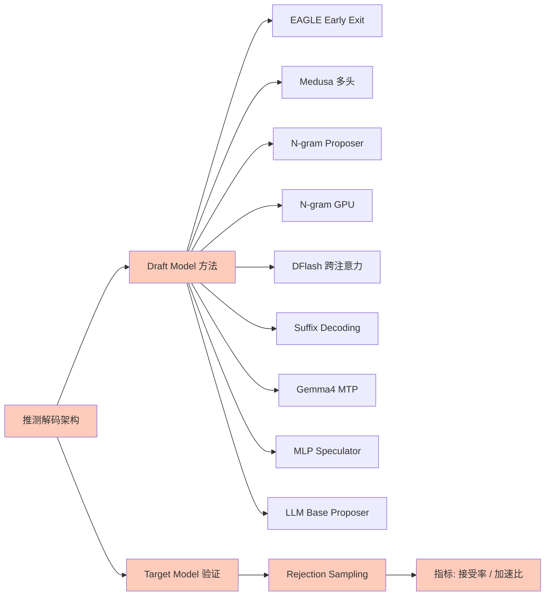
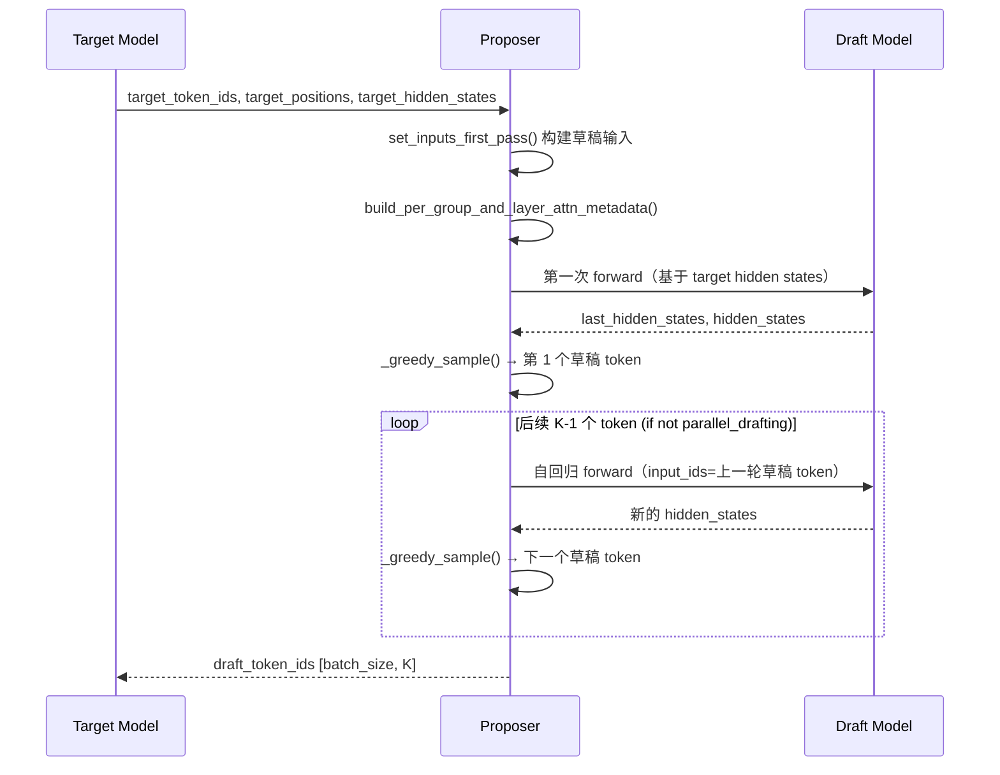
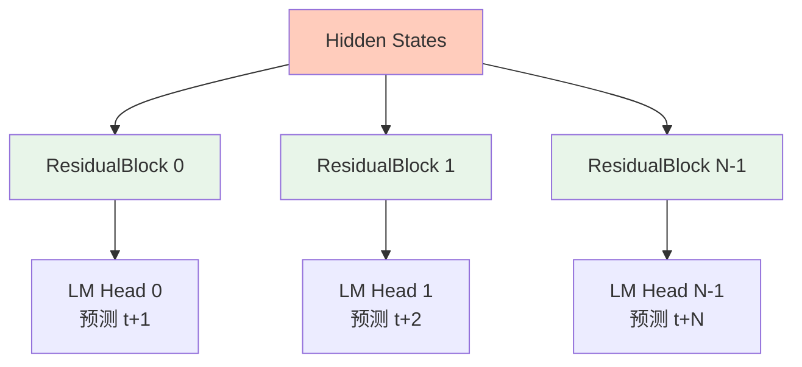
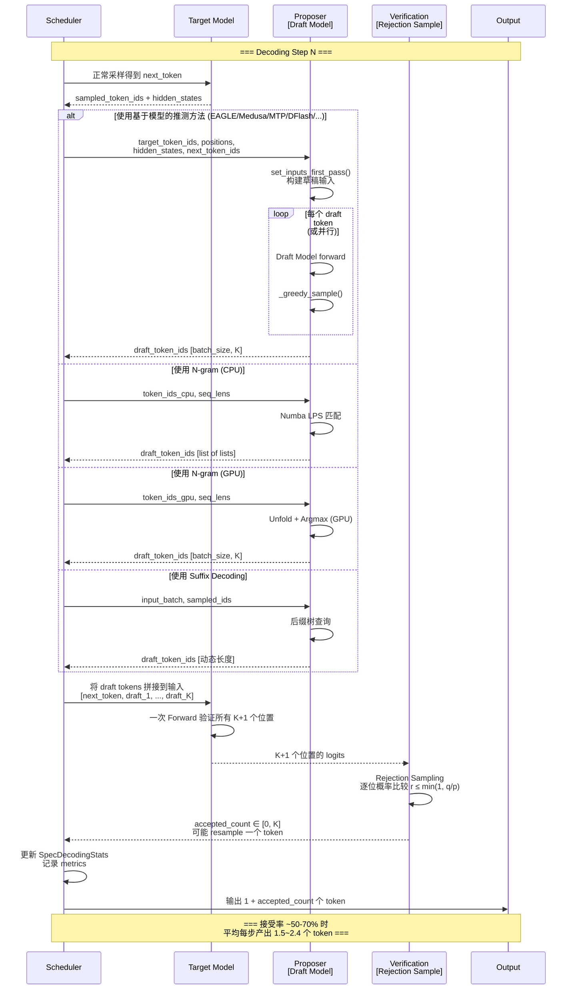

# vLLM 推测解码（Speculative Decoding）加速技术分析

> **定位**：vLLM 推测解码（Speculative Decoding）是一种利用小型 Draft Model 快速生成候选 token，再由大型 Target Model 验证接受的加速技术，典型加速比 2-4x。



---

## 一、推测解码原理

### 1.1 Draft Model + Target Model 架构

推测解码的核心思想是**用小模型"猜"，大模型"验"**：

- **Draft Model（草稿模型）**：轻量级模型，快速生成 K 个候选 token（`num_speculative_tokens`）
- **Target Model（目标模型）**：完整的大模型，一次性验证所有 K 个草稿 token
- **Rejection Sampling（拒绝采样）**：以概率接受/拒绝每个草稿 token

关键优势：Target Model 的前向传播只需执行 **1 次**（验证所有 K 个 token），而非普通自回归的 K 次。即使 Draft Model 的接受率不高，总体计算量仍可大幅降低。

### 1.2 Rejection Sampling 算法

标准拒绝采样流程如下：

```
输入: Draft tokens [x₁, x₂, ..., x_K], Draft 概率分布 p, Target 概率分布 q
输出: 接受的 token 数量 n (0 ≤ n ≤ K)

对 i = 1, 2, ..., K:
  1. 从均匀分布 U(0,1) 中采样 r
  2. 若 r ≤ min(1, q(x_i) / p(x_i)) → 接受 x_i，继续检查下一个
  3. 否则 → 拒绝 x_i 及其后续所有 token
     以 q 分布重新采样一个 token 作为最终输出

若全部 K 个 token 都被接受：
  再以 Target Model 的分布采样第 K+1 个 bonus token
```

vLLM 支持两种 rejection sampling 方式（见 [speculative.py#L190-L208](../vllm/config/speculative.py#L190-L208)）：

| 方法 | 说明 |
|------|------|
| `standard` | 标准概率拒绝采样 |
| `synthetic` | 合成拒绝采样，使用预定义衰减概率 |

### 1.3 典型加速比 2-4x 分析

加速比的理论上界取决于：

$$\text{Speedup} = \frac{K + 1}{1 + \text{Target\_Cost} / \text{Draft\_Cost}}$$

其中 `K = num_speculative_tokens`。实际加速比受以下因素影响：

- **接受率（Acceptance Rate）**：Draft Model 与 Target Model 输出分布越接近，接受率越高
- **Draft Model 计算开销**：EAGLE/Medusa 几乎零额外开销；N-gram 无模型开销；独立 Draft Model 有一定计算成本
- **并行度**：Parallel drafting（DFlash、EAGLE parallel）可一次生成所有草稿 token
- **典型值**：接受率 50%-70% 时，加速比约 2-3x

### 1.4 与普通自回归解码对比

| 维度 | 普通自回归 | 推测解码 |
|------|-----------|---------|
| 每 step 生成 token 数 | 1 | 1~K+1 |
| 大模型前向次数/step | 1 | 1 |
| 小模型前向次数/step | 0 | 1~K（或 0 for N-gram） |
| 内存开销 | 基线 | +Draft Model 参数 + 额外 slot |
| 延迟确定性 | 确定 | 不确定（依赖接受率） |

---

## 二、SpeculativeConfig 配置

配置类位于 [speculative.py](../vllm/config/speculative.py)，是所有推测解码方法的统一入口。

### 2.1 核心参数

```python
# speculative.py L73-L107
@config
class SpeculativeConfig:
    # --- 基本控制 ---
    num_speculative_tokens: int = Field(default=None, gt=0)
    """推测 token 数量，决定每次推测的最大候选数"""
    model: str | None = None
    """Draft model 名称或方法标识"""
    method: SpeculativeMethod | None = None
    """推测方法: "ngram"/"medusa"/"mlp_speculator"/"draft_model"/"suffix"
       /"eagle"/"eagle3"/"dflash"/"mtp"/"ngram_gpu"/..."""

    # --- Draft Model 配置 ---
    draft_tensor_parallel_size: int | None = Field(default=None, ge=1)
    """Draft model 的 TP 大小，只能为 1 或与 target 相同"""
    quantization: me_quant.QuantizationMethods | str | None = None
    """Draft model 量化方式"""
    max_model_len: int | None = Field(default=None, ge=1)
    """Draft model 最大序列长度"""
```

### 2.2 N-gram 配置

```python
# speculative.py L139-L144
prompt_lookup_max: int | None = Field(default=None, ge=1)
"""N-gram 最大窗口大小"""
prompt_lookup_min: int | None = Field(default=None, ge=1)
"""N-gram 最小窗口大小，默认等于 prompt_lookup_max"""
```

### 2.3 Suffix Decoding 配置

```python
# speculative.py L166-L184
suffix_decoding_max_tree_depth: int = 24
"""后缀树最大深度"""
suffix_decoding_max_cached_requests: int = 10000
"""最大缓存请求数"""
suffix_decoding_max_spec_factor: float = 1.0
"""推测因子：max_spec_tokens = spec_factor * prefix_match_length"""
suffix_decoding_min_token_prob: float = 0.1
"""最小 token 概率阈值"""
```

### 2.4 Rejection Sampling 配置

```python
# speculative.py L190-L261
rejection_sample_method: RejectionSampleMethod = "standard"
"""'standard': 概率拒绝采样; 'synthetic': 合成拒绝采样"""
draft_sample_method: DraftSampleMethod = "greedy"
"""'greedy': argmax; 'gumbel': Gumbel 噪声随机采样"""
synthetic_acceptance_rates: list[float] | None = None
"""合成采样的逐位置无条件接受率（单调非递增）"""
synthetic_acceptance_length: float | None = None
"""目标平均接受长度，内部转换为 rates"""
parallel_drafting: bool = False
"""是否启用并行草稿（一次 forward 生成所有 token）"""
```

### 2.5 支持的方法类型汇总

```python
# speculative.py L34-L67
MTPModelTypes = Literal[
    "deepseek_mtp", "mimo_mtp", "mimo_v2_mtp", "glm4_moe_mtp",
    "glm4_moe_lite_mtp", "glm_ocr_mtp", "ernie_mtp",
    "nemotron_h_mtp", "exaone_moe_mtp", "exaone4_5_mtp",
    "qwen3_next_mtp", "qwen3_5_mtp", "longcat_flash_mtp",
    "mtp", "pangu_ultra_moe_mtp", "step3p5_mtp",
    "hy_v3_mtp", "gemma4_mtp",
]

SpeculativeMethod = Literal[
    "ngram", "medusa", "mlp_speculator", "draft_model",
    "suffix", EagleModelTypes, NgramGPUTypes,
]
# EagleModelTypes 包含: "eagle", "eagle3", "extract_hidden_states",
#                          所有 MTPModelTypes, "dflash"
# NgramGPUTypes = "ngram_gpu"
```

### 2.6 自动检测逻辑

在 [`__post_init__`](../vllm/config/speculative.py#L504-L765) 中，vLLM 会根据 `model` 名称自动推断 `method` 类型：

- 含 `"eagle-"` → `eagle`
- 含 `"eagle3"` → `eagle3`
- 含 `"dflash"` → `dflash`
- `model_type == "medusa"` → `medusa`
- `model_type == "mlp_speculator"` → `mlp_speculator`
- 属于 MTPModelTypes → `mtp`
- 默认 → `draft_model`

---

## 三、Draft Model 接口体系

### 3.1 抽象基类：SpecDecodeBaseProposer

核心基类位于 [llm_base_proposer.py](../vllm/v1/spec_decode/llm_base_proposer.py)，是所有基于模型的推测方法的父类。

```python
# llm_base_proposer.py L55-L62
class SpecDecodeBaseProposer:
    def __init__(
        self,
        vllm_config: VllmConfig,
        device: torch.device,
        pass_hidden_states_to_model: bool,  # 是否传递 hidden states 给 draft model
        runner=None,
    ):
```

**关键成员变量**：

| 变量 | 类型 | 说明 |
|------|------|------|
| `num_speculative_tokens` | `int` | 每次 step 生成的草稿 token 数 |
| `pass_hidden_states_to_model` | `bool` | 是否将 target hidden states 传入 draft model（EAGLE/DFlash 需要） |
| `parallel_drafting` | `bool` | 是否使用并行草稿模式 |
| `constant_draft_positions` | `bool` | 草稿位置是否恒定（Gemma4 使用） |
| `hidden_states` | `Tensor[max_num_tokens, hidden_size]` | 目标模型 hidden states 缓冲区 |
| `input_ids` | `Tensor[max_num_tokens]` | 草稿模型 input IDs 缓冲区 |
| `model` | `nn.Module` | 实际加载的草稿模型 |

### 3.2 核心 propose() 方法

[`propose()`](../vllm/v1/spec_decode/llm_base_proposer.py#L392-L592) 是推测生成的入口，完整流程：



**关键实现细节**：

1. **第一次 forward**（[L427-L467](../vllm/v1/spec_decode/llm_base_proposer.py#L427-L467)）：接收 target model 的 hidden states 作为输入，生成第一个草稿 token
2. **自回归循环**（[L500-L591](../vllm/v1/spec_decode/llm_base_proposer.py#L500-L591)）：对于 `num_speculative_tokens > 1` 且非并行模式，逐个生成剩余草稿 token
3. **位置更新**（[`_update_positions_dependent_metadata()`](../vllm/v1/spec_decode/llm_base_proposer.py#L594-L644)）：每步更新 positions 和 slot_mapping
4. **Greedy sampling**（[`_greedy_sample()`](../vllm/v1/spec_decode/llm_base_proposer.py#L386-L391)）：默认 argmax，支持 local argmax reduction 优化

### 3.3 set_inputs_first_pass() 输入构建

[`set_inputs_first_pass()`](../vllm/v1/spec_decode/llm_base_proposer.py#L646-L778) 负责 target model 输出到 draft model 输入的转换：

- **简单模式**（`needs_extra_input_slots=False`）：直接 shift input_ids，在末尾插入 next_token_id
- **扩展模式**（`needs_extra_input_slots=True`）：调用 Triton kernel `copy_and_expand_eagle_inputs_kernel` 进行高效数据重排

### 3.4 权重共享机制

[`_maybe_share_embeddings()`](../vllm/v1/spec_decode/llm_base_proposer.py#L1220-L1287) 和 [`_maybe_share_lm_head()`](../vllm/v1/spec_decode/llm_base_proposer.py#L1289-L1393) 实现 draft model 与 target model 的权重共享：

- **Embedding 共享**：EAGLE model 通常无自己的 embed_tokens，复用 target model
- **LM Head 共享**：MTP model 复用 target model 的 lm_head
- **条件**：仅在 PP size == 1 时允许共享

### 3.5 DraftModelProposer

[DraftModelProposer](../vllm/v1/spec_decode/draft_model.py#L17-L88) 是使用独立小模型作为 drafter 的具体实现：

```python
# draft_model.py L17-L31
class DraftModelProposer(SpecDecodeBaseProposer):
    def __init__(self, vllm_config, device, runner=None):
        super().__init__(
            vllm_config=vllm_config,
            device=device,
            pass_hidden_states_to_model=False,  # 不需要 hidden states
            runner=runner,
        )
        self._raise_if_vocab_size_mismatch()   # 校验 vocab 一致性
        self._raise_if_draft_tp_mismatch()      # 校验 TP 一致性
```

特点：
- `pass_hidden_states_to_model=False`：独立 draft model 不需要 target hidden states
- 强制要求 vocab_size 与 target model 一致
- 要求 TP size 与 target model 一致（避免 compile cache 冲突）

---

## 四、推测解码方法详解

### 4.1 EAGLE Early Exit Layer

#### 原理

EAGLE（Early Exit of Large Language Models via Grouped Attention）通过在 Transformer 中间层添加轻量的 **预测头（prediction head）** 来提前预测下一个 token。相比运行完整的 Transformer，只运行部分层即可输出预测，大幅降低计算量。

[EagleProposer](../vllm/v1/spec_decode/eagle.py#L10-L22) 继承自 `SpecDecodeBaseProposer`：

```python
# eagle.py L10-L22
class EagleProposer(SpecDecodeBaseProposer):
    def __init__(self, vllm_config, device, runner=None):
        super().__init__(
            vllm_config,
            device,
            pass_hidden_states_to_model=True,  # 关键！需要 target hidden states
            runner=runner,
        )
```

**核心特征**：
- `pass_hidden_states_to_model=True`：将 target model 的中间层 hidden states 直接传入 EAGLE head
- EAGLE head 本质是一个小型 MLP（或 Attention 层），接收 hidden states 并预测下一个 token
- 支持 EAGLE（单辅助层）、EAGLE3（多辅助层 + aux hidden states）两种变体

**EAGLE3 特殊处理**（[llm_base_proposer.py#L413-L425](../vllm/v1/spec_decode/llm_base_proposer.py#L413-L425)）：

```python
if self.method in ("eagle3", "dflash"):
    assert isinstance(self.model, (
        Eagle3LlamaForCausalLM,
        Eagle3DeepseekV2ForCausalLM,
        DFlashQwen3ForCausalLM,
    ))
    # EAGLE3: 将多个辅助层的 hidden states 组合
    target_hidden_states = self.model.combine_hidden_states(target_hidden_states)
```

#### 工作流程

1. Target model 运行到某个中间层时，提取 hidden states
2. Hidden states 传入 EAGLE prediction head
3. EAGLE head 输出 logits，argmax 得到草稿 token
4. 对后续 token，EAGLE head 在自身 hidden states 上继续自回归

---

### 4.2 Medusa 多头预测

#### 原理

Medusa 通过在同一 hidden state 上并联 **多个独立的预测头（heads）**，每个头负责预测不同偏移位置的 token。一次 forward 即可同时获得 K 个草稿 token。

[Medusa 模型](../vllm/model_executor/models/medusa.py#L41-L138) 结构：



#### ResidualBlock 设计

```python
# medusa.py L19-L38
class ResidualBlock(nn.Module):
    def __init__(self, config, hidden_size, num_layers):
        self.layers = nn.ModuleList([
            nn.Linear(hidden_size, hidden_size, bias=...)
            for _ in range(num_layers)
        ])
        self.act = nn.SiLU()

    def forward(self, x):
        for layer in self.layers:
            x = x + self.act(layer(x))
        return x
```

残差连接 + SiLU 激活，多层堆叠形成轻量预测器。

#### Medusa 主类

```python
# medusa.py L41-L96
class Medusa(nn.Module):
    def __init__(self, *, vllm_config, prefix=""):
        config = vllm_config.speculative_config.draft_model_config.hf_config
        # num_heads 个并行的 ResidualBlock
        self.blocks = nn.ModuleList([
            ResidualBlock(config=config, hidden_size=config.hidden_size,
                         num_layers=config.num_hidden_layers)
            for _ in range(config.num_heads)
        ])
        # 每个 block 对应一个 LM Head
        self.lm_heads = nn.ModuleList([
            ParallelLMHead(config.vocab_size, config.hidden_size, ...)
            for i in range(config.num_heads)
        ])
```

**forward 流程**：

```python
# medusa.py L105-L137
def forward(self, hidden_states):
    return [block(hidden_states) for block in self.blocks]

def compute_logits(self, hidden_states):
    logits_lst = []
    for hs, lm_head in zip(hidden_states, self.lm_heads):
        _logits = self.logits_processor(lm_head, hs)
        if self.token_map is not None:
            # 截断词汇表优化：仅在高频 token 上预测
            ...
        logits_lst.append(_logits)
    return logits_lst
```

**截断词汇表优化**：支持 `token_map` 将预测限制在最频繁的 k 个 token 上，减少采样开销而不显著降低接受率。

---

### 4.3 N-gram Proposer（CPU 版）

#### 原理

N-gram proposer 是一种**无模型**的推测方法。它利用输入序列中已出现的 n-gram 模式来推测接下来的 token。如果上下文中出现过相同的 n-gram 序列，则复制其后续 token 作为草稿。

优势：**零模型开销**，纯统计匹配，适合重复性高的文本生成场景。

[NgramProposer](../vllm/v1/spec_decode/ngram_proposer.py#L12-L166) 实现：

```python
# ngram_proposer.py L12-L33
class NgramProposer:
    def __init__(self, vllm_config):
        self.min_n = vllm_config.speculative_config.prompt_lookup_min  # 最小 n-gram
        self.max_n = vllm_config.speculative_config.prompt_lookup_max  # 最大 n-gram
        self.k = vllm_config.speculative_config.num_speculative_tokens  # 草稿数量
        self.max_model_len = vllm_config.model_config.max_model_len
```

#### 核心算法：LPS 最长匹配

N-gram 匹配使用 **LPS（Longest Prefix which is also a Suffix）** 算法，即 KMP 算法的预处理阶段思想：

```python
# ngram_proposer.py L199-L285
@jit(nopython=True)
def _find_longest_matched_ngram_and_propose_tokens(
    origin_tokens, min_ngram, max_ngram, max_model_len, k
) -> np.ndarray:
    """
    在 origin_tokens 后缀中查找最长的 [min_ngram, max_ngram] 范围内的 n-gram，
    该 n-gram 在之前的位置出现过。找到后提取其后的 k 个 token。
    """
    total_token = origin_tokens.shape[0]
    if total_token < min_ngram:
        return np.empty((0,))

    # 反转 token 序列，将后缀匹配问题转为前缀匹配问题
    tokens = origin_tokens[::-1]

    lps = np.zeros(max_ngram, dtype=np.int32)
    longest_ngram = 0
    position = 0
    prev_lps = 0
    i = 1
    while i < total_token:
        if tokens[prev_lps] == tokens[i]:
            prev_lps += 1
            if prev_lps >= longest_ngram:
                longest_ngram = prev_lps
                position = i
            if i < max_ngram:
                lps[i] = prev_lps
            if prev_lps == max_ngram:
                prev_lps = lps[max_ngram - 1]
            i += 1
        elif prev_lps != 0:
            prev_lps = lps[prev_lps - 1]
        else:
            i += 1

    if longest_ngram < min_ngram:
        return np.empty((0,))

    # 提取匹配 n-gram 之后的 k 个 token
    start_position = total_token - 1 - position + longest_ngram
    return origin_tokens[start_position : start_position + k]
```

**算法要点**：
1. 反转序列 → 后缀匹配变前缀匹配
2. 利用 LPS 数组在线性时间内找到最长重复 n-gram
3. Numba JIT 编译加速（`@njit(parallel=True)` 用于 batch 版本）

#### Batch 处理

[`batch_propose()`](../vllm/v1/spec_decode/ngram_proposer.py#L63-L129) 使用 Numba 并行加速批量请求：

```python
# ngram_proposer.py L169-L195
@njit(parallel=True)
def batch_propose_numba(valid_ngram_requests, num_tokens_no_spec,
                        token_ids_cpu, min_n, max_n, ...):
    for i in prange(len(valid_ngram_requests)):
        idx = valid_ngram_requests[i]
        context_token_ids = token_ids_cpu[idx, :num_tokens_no_spec[idx]]
        drafter_output = _find_longest_matched_ngram_and_propose_tokens(
            context_token_ids, min_n, max_n, max_model_len, k
        )
        ...
```

---

### 4.4 N-gram GPU Proposer（GPU 加速版）

#### 原理

[NgramGPUKernel](../vllm/v1/spec_decode/ngram_proposer_gpu.py#L27-L212) 将 N-gram 匹配完全搬到 GPU 上，使用 PyTorch tensor 操作替代 CPU/Numba 实现，避免 CPU-GPU 数据传输瓶颈。

```python
# ngram_proposer_gpu.py L27-L44
@support_torch_compile()
class NgramGPUKernel(nn.Module):
    """GPU-accelerated N-gram proposer using fully async tensor operations."""
    def __init__(self, vllm_config, prefix="", device="cuda"):
        self.min_n = ...
        self.max_n = ...
        self.k = ...
```

#### 核心算法：Unfold + Argmax

```python
# ngram_proposer_gpu.py L46-L158
def _find_first_and_extract_all_n_parallel(
    self, token_ids, seq_lengths, min_ngram_len, max_ngram_len, num_draft_tokens
) -> torch.Tensor:
    batch_size = token_ids.shape[0]
    ngram_lengths = torch.arange(min_ngram_len, max_ngram_len + 1, device=device)

    # 对每种 n-gram 长度分别搜索
    first_match_positions = torch.full(
        (batch_size, num_ngram_sizes), -1, dtype=torch.long, device=device
    )

    for i, ngram_len in enumerate(range(min_ngram_len, max_ngram_len + 1)):
        # unfold 创建滑动窗口 O(1) view
        search_windows = token_ids.unfold(1, ngram_len, 1)

        # 提取后缀
        suffix_indices = seq_lengths.unsqueeze(1) + torch.arange(ngram_len, device=device)
        suffix = torch.gather(token_ids, 1, suffix_indices.clamp(min=0))

        # 全局匹配
        matches = (search_windows == suffix.unsqueeze(1)).all(dim=-1)
        # 找最早匹配
        first_match_idx = torch.argmax(final_matches.int(), dim=1)
        has_match = final_matches[batch_indices, first_match_idx]
        first_match_positions[:, i] = torch.where(has_match, first_match_idx, -1)

    # 选择最长匹配的 n-gram
    best_ngram_idx = (first_match_positions >= 0).int().flip(dims=[1]).argmax(dim=1)
    # 提取后续 k 个 token
    ...
```

**关键技术点**：
- `torch.unfold()` 创建滑动窗口视图，O(1) 时间复杂度
- 向量化 batch 操作，所有 sequence 并行处理
- `torch.compile` 支持（`@support_torch_compile()`）
- 异步 D2H copy（[`copy_num_valid_draft_tokens()`](../vllm/v1/spec_decode/ngram_proposer_gpu.py#L639-L661)）

#### 增量更新机制

[`update_ngram_gpu_tensors_incremental()`](../vllm/v1/spec_decode/ngram_proposer_gpu.py#L509-L603) 实现增量更新 token_ids，避免全量拷贝：

```python
def update_ngram_gpu_tensors_incremental(input_batch, token_ids_gpu_tensor,
                                          num_tokens_no_spec_gpu, new_reqs, ...):
    # 仅对新请求/resumed 请求做全量拷贝
    for req_state in new_reqs:
        token_ids_gpu_tensor[new_req_idx, :num_tokens].copy_(...)
    # 检测 reorder（index 变化），局部交换
    if reorder_src:
        token_ids_gpu_tensor[dst_tensor] = temp_token_ids
    # 批量同步 sequence lengths（CPU → GPU via pinned memory）
    _sync_num_tokens(...)
```

---

### 4.5 DFlash 推测解码

#### 原理

DFlash（DeepSeek Flash Speculation）是一种基于**跨注意力（Cross-Attention）**的推测解码方法。它将 target model 的 context KV cache 作为 Key/Value，Draft model 只需对 query tokens（bonus token + mask tokens）做 attention，无需重新计算 context 部分。

[DFlashProposer](../vllm/v1/spec_decode/dflash.py#L21-L300) 核心设计：

```python
# dflash.py L21-L35
class DFlashProposer(SpecDecodeBaseProposer):
    def __init__(self, vllm_config, device, runner=None):
        super().__init__(
            vllm_config, device,
            pass_hidden_states_to_model=True,
            runner=runner,
        )
        # 只有 next_token_ids 和 mask tokens 是 query tokens
        self.max_query_tokens = self.max_batch_size * (1 + self.num_speculative_tokens)
        # Context 和 Query 使用分离的缓冲区（保证 CUDA graph 地址稳定）
        self._context_slot_mapping_buffer = torch.zeros(...)
        self._slot_mapping_buffer = torch.zeros(...)
```

#### DFlash 独特之处

1. **Non-Causal Attention**（[L72-L80](../vllm/v1/spec_decode/dflash.py#L72-L80)）：

```python
def _create_draft_vllm_config(self) -> VllmConfig:
    base = super()._create_draft_vllm_config()
    return replace(base,
        attention_config=replace(base.attention_config, use_non_causal=True),
    )
```

2. **Context KV 预计算**（[L262-L267](../vllm/v1/spec_decode/dflash.py#L262-L267)）：

```python
def build_model_inputs_first_pass(self, num_tokens, num_input_tokens, mm_embed_inputs):
    # 将 context hidden states 预插入 KV cache
    self.model.precompute_and_store_context_kv(
        self._dflash_hidden_states,
        self._context_positions_buffer[:num_context],
        self._context_slot_mapping_buffer[:num_context],
    )
```

3. **强制 Parallel Drafting**：DFlash 始终使用 `parallel_drafting=True`（[L712](../vllm/config/speculative.py#L712)），一次 forward 生成所有草稿 token

4. **Fused Triton Kernel**：使用 `copy_and_expand_dflash_inputs_kernel` 同时准备 context/query 的 input_ids、positions、slot_mapping

#### 数据流示意

```
Target Model Forward → hidden_states [context_len, hidden_dim]
                              ↓
              ┌───────────────┴───────────────┐
              ↓                               ↓
    Context KV Precompute             Query Tokens
    (GEMM + RoPE + Norm)              [bonus, mask, mask, ...]
              ↓                               ↓
              └───────────┬───────────────────┘
                          ↓
              Cross-Attention (non-causal)
                          ↓
                  Output logits → K draft tokens
```

---

### 4.6 Suffix Decoding（后缀解码）

#### 原理

Suffix Decoding 基于 Arctic Inference 库实现（论文：[arXiv:2411.04975](https://arxiv.org/pdf/2411.04975)）。它维护一个全局的后缀树（Suffix Tree），缓存历史请求的输出模式，当新请求的模式与缓存匹配时进行推测。

[SuffixDecodingProposer](../vllm/v1/spec_decode/suffix_decoding.py#L9-L101)：

```python
# suffix_decoding.py L9-L34
class SuffixDecodingProposer:
    def __init__(self, vllm_config):
        config = vllm_config.speculative_config
        self.num_speculative_tokens = config.num_speculative_tokens
        self.max_tree_depth = config.suffix_decoding_max_tree_depth
        self.max_spec_factor = config.suffix_decoding_max_spec_factor
        self.min_token_prob = config.suffix_decoding_min_token_prob

        from arctic_inference.suffix_decoding import SuffixDecodingCache
        self.suffix_cache = SuffixDecodingCache(
            max_tree_depth=config.suffix_decoding_max_tree_depth,
            max_cached_requests=config.suffix_decoding_max_cached_requests,
        )
```

#### 工作流程

```python
# suffix_decoding.py L35-97
def propose(self, input_batch, sampled_token_ids, slot_mappings=None):
    draft_token_ids = []
    for i, sampled_ids in enumerate(sampled_token_ids):
        req_id = input_batch.req_ids[i]

        # 启动新请求：构建 prompt 后缀树
        if req_id not in self.suffix_cache.active_requests:
            prompt_token_ids = input_batch.token_ids_cpu[index, :num_prompt_tokens]
            self.suffix_cache.start_request(req_id, prompt_token_ids)

        # 追加最新采样的 token
        self.suffix_cache.add_active_response(req_id, sampled_ids)

        # 从序列末尾提取 pattern（最长 max_tree_depth 个 token）
        start = max(0, num_tokens - self.max_tree_depth)
        pattern = input_batch.token_ids_cpu[i, start:num_tokens]

        # 基于后缀树推测
        draft = self.suffix_cache.speculate(
            req_id, pattern,
            max_spec_tokens=min(...),
            max_spec_factor=self.max_spec_factor,
            min_token_prob=self.min_token_prob,
        )
        draft_token_ids.append(draft.token_ids)

    # 停止不在当前 batch 中的请求
    for req_id in (self.suffix_cache.active_requests - input_batch.req_id_to_index.keys()):
        self.suffix_cache.stop_request(req_id)

    return draft_token_ids
```

**特点**：
- 动态推测数量：每个 request 可能返回不同长度的草稿
- 基于 frequency count 估算 token 概率
- FIFO 淘汰旧缓存
- 需要安装 `arctic-inference` 库

---

### 4.7 Gemma4 MTP（Multi-Token Prediction）

#### 原理

Gemma4 的 MTP 模式让 assistant model 运行**所有 decoder layers** 来产生一个 draft token（而非 EAGLE 的轻量 head）。其注意力层通过 **cross-model KV sharing** 与 target model 共享 KV cache。

[Gemma4Proposer](../vllm/v1/spec_decode/gemma4.py#L31-L335)：

```python
# gemma4.py L31-48
class Gemma4Proposer(SpecDecodeBaseProposer):
    def __init__(self, vllm_config, device, runner=None):
        super().__init__(vllm_config, device,
            pass_hidden_states_to_model=True, runner=runner)
        # 所有 draft 步从同一位置预测（不递进 position）
        self.constant_draft_positions = True
```

#### 核心特性

1. **Constant Draft Positions**（[L47](../vllm/v1/spec_decode/gemma4.py#L47)）：所有 draft steps 重用相同 position，因为 Gemma4 draft model 使用 Q-only attention 共享 target 的 KV cache

2. **多 KV Cache Group 支持**（[L70-L97](../vllm/v1/spec_decode/gemma4.py#L70-L97)）：Gemma4 有 sliding window attention 和 full attention 两种 layer type，各自属于不同 KV cache group：

```python
def build_per_group_and_layer_attn_metadata(self, common_attn_metadata, draft_index=0):
    per_group_attn_metadata = []
    per_layer_attn_metadata = {}
    for attn_group in self.draft_attn_groups:
        gid = attn_group.kv_cache_group_id
        if gid in self._per_group_block_tables:
            cm = copy(common_attn_metadata)
            cm.block_table_tensor = self._per_group_block_tables[gid]
        ...
```

3. **KV Sharing 设置**（[`_setup_gemma4_kv_sharing()`](../vllm/v1/spec_decode/gemma4.py#L275-L335)）：

```python
def _setup_gemma4_kv_sharing(self, target_attn_layer_names):
    # 每个 draft layer 映射到同类型的最后一个 non-KV-shared target layer
    for draft_idx, layer in enumerate(self.model.model.layers):
        draft_layer_type = draft_layer_types[draft_idx]
        candidates = type_to_target_indices.get(draft_layer_type, [])
        target_idx = candidates[-1]  # 取最后一个同类 layer
        attn.kv_sharing_target_layer_name = f"{target_prefix}.{target_idx}.self_attn.attn"
```

4. **Centroids CUDA Graphs**（[`_setup_centroids_cuda_graphs()`](../vllm/v1/spec_decode/gemma4.py#L110-L140)）：当使用 ordered embeddings 时，为 get_top_tokens 预捕获多种 batch size 的 CUDA graph

5. **Tuple Return**（[L64-L68](../vllm/v1/spec_decode/gemma4.py#L64-L68)）：

```python
def model_returns_tuple(self) -> bool:
    # forward() 返回 (draft_hidden_states, backbone_hidden_states)
    return True
```

---

### 4.8 MLP Speculator（MLP 草稿模型）

#### 原理

MLP Speculator 来自论文 ["Accelerating Production LLMs with Combined Token/Embedding Speculators"](https://arxiv.org/pdf/2404.19124)。它是一个纯 MLP 结构的轻量级草稿模型，由多级串联的 Embedding→Projection→LayerNorm→Head 组成。

[MLPSpeculator](../vllm/model_executor/models/mlp_speculator.py#L60-L171)：

```mermaid
graph LR
    subgraph "Stage 0"
        E0[Embedding] --> P0[Linear Projection]
    end
    subgraph "Stage 1..K-1 (tied weights)"
        E1[Embedding] --> PT[Tied Linear]
    end
    P0 --> LN0[LayerNorm] --> H0[LM Head → token_{t+1}]
    PT --> LN1[LayerNorm] --> H1[LM Head → token_{t+2}]
    LNK[LN_K] --> HK[LM Head → token_{t+K}]

    style E0 fill:#e8f5e9
    style E1 fill:#e8f5e9
    style PT fill:#fff3e0
```

#### 结构细节

```python
# mlp_speculator.py L60-L171
class MLPSpeculator(nn.Module):
    def __init__(self, *, vllm_config, prefix=""):
        config = vllm_config.model_config.hf_config
        self.n_predict = config.n_predict          # 预测步数
        self.vocab_size = config.vocab_size
        self.emb_dim = config.emb_dim               # 输入嵌入维度
        self.inner_dim = config.inner_dim           # 内部维度
        self.max_speculative_tokens = config.num_lookahead_tokens
        self.tie_weights = config.tie_weights       # 是否权重共享
        self.scale_input = config.scale_input       # 是否缩放输入

        if self.tie_weights:
            # 共享 embedding 和 projection 权重
            self.emb = nn.ModuleList([embedding] * self.max_speculative_tokens)
            self.proj = nn.ModuleList(
                [proj_first] + [proj_tied] * (self.max_speculative_tokens - 1)
            )
        else:
            # 每个阶段独立参数
            self.emb = nn.ModuleList([...])
            self.proj = nn.ModuleList([...])

        # 每个 stage 一个 LM Head 和 LayerNorm
        self.head = nn.ModuleList([ParallelLMHead(...) for _ in range(...)])
        self.ln = nn.ModuleList([MLPSpeculatorLayerNorm(...) for _ in range(...)])

        # 特殊的状态/嵌入混合权重
        self.state_weight = 0.5 ** (0.5 / config.n_predict)
        self.emb_weight = math.sqrt((1 - self.state_weight**2) * (self.inner_dim / 2))
        self.activation = nn.GELU()
```

#### LayerNorm 变体

```python
# mlp_speculator.py L21-57
class MLPSpeculatorLayerNorm(nn.Module):
    """L2 Normalization（而非标准 LayerNorm 的均值归一化）"""
    def forward(self, x):
        xf = x
        xf = xf * torch.rsqrt(xf.pow(2).mean(-1, keepdim=True) + self.eps)
        x = xf.type_as(x)
        if self.elementwise_scale_and_shift:
            x = self.weight * x + self.bias
        return x
```

---

### 4.9 LLM Base Proposer（基于 LLM 的草稿）

`SpecDecodeBaseProposer` 本身就是 LLM-based proposer 的完整实现。除了上述专门的子类外，以下方法都通过此基类工作：

- **`method="draft_model"`**：使用任意小模型作为 draft model（[DraftModelProposer](../vllm/v1/spec_decode/draft_model.py)）
- **`method="mtp"`**：MTP（Multi-Token Prediction）模型，如 DeepSeek-MTP、MiMo-MTP 等
- **`method="eagle"`**：EAGLE prediction head
- **`method="eagle3"`**：EAGLE3 多辅助层
- **`method="dflash"`**：DFlash cross-attention（[DFlashProposer](../vllm/v1/spec_decode/dflash.py)）

这些方法的差异主要体现在：
1. `_get_model()` 返回不同的模型结构
2. `pass_hidden_states_to_model` 的设置
3. `model_returns_tuple()` 的返回值
4. `parallel_drafting` 的开关

---

## 五、Extract Hidden States（隐藏状态提取）

### 5.1 用途

[ExtractHiddenStatesProposer](../vllm/v1/spec_decode/extract_hidden_states.py#L26-L382) 是一种特殊的 proposer，其目的**不是推测 token**，而是从 target model 的指定中间层提取 hidden states 并存入 KV cache。

主要用途：
- **KV Transfer**：跨实例/跨节点传输 KV cache 时需要的中间状态缓存
- **Debug/Analysis**：获取模型中间层表示

### 5.2 核心特性

```python
# extract_hidden_states.py L26-L66
class ExtractHiddenStatesProposer:
    def __init__(self, vllm_config, device):
        # 固定 num_speculative_tokens == 1
        assert vllm_config.speculative_config.num_speculative_tokens == 1

        # 从配置获取要提取的层 ID 列表
        self.hf_config = vllm_config.speculative_config.draft_model_config.hf_config
        layer_ids = getattr(self.hf_config, "eagle_aux_hidden_state_layer_ids", None)
        self.num_hidden_states = len(layer_ids)

        # hidden states 缓冲区: [max_num_tokens, num_layers, hidden_size]
        self.hidden_states = torch.zeros(
            (self.max_num_tokens, self.num_hidden_states, self.hidden_size),
            dtype=self.dtype, device=device,
        )
```

### 5.3 propose() 行为

```python
# extract_hidden_states.py L72-L151
def propose(self, sampled_token_ids, target_hidden_states,
             common_attn_metadata, slot_mappings=None):
    # 1. 堆叠各层的 hidden states: [num_tokens, num_layers, hidden_size]
    stacked_hidden_states = torch.stack(target_hidden_states, dim=1)

    # 2. 存入缓冲区
    self.hidden_states[:num_tokens] = stacked_hidden_states

    # 3. 通过 ExtractHiddenStatesModel 写入 KV cache（cache-only attention）
    self.model(hidden_states=self.hidden_states[:num_input_tokens])

    # 4. 返回原始 sampled tokens（不做任何推测，确保"总是被接受"）
    return sampled_token_ids[:, :1]
```

**关键**：返回的 draft tokens 就是原始 sampled tokens，因此 rejection sampling 总是接受——这保证了该方法不会改变生成结果。

---

## 六、Metrics（指标体系）

### 6.1 SpecDecodingStats

[metrics.py](../vllm/v1/spec_decode/metrics.py#L17-L47) 定义了每步统计数据：

```python
# metrics.py L17-L47
@dataclass
class SpecDecodingStats:
    num_spec_tokens: int                    # 配置的推测 token 数 K
    num_drafts: int = 0                     # 累计 draft 次数
    num_draft_tokens: int = 0               # 累计生成的草稿 token 总数
    num_accepted_tokens: int = 0            # 累计被接受的 token 总数
    num_accepted_tokens_per_pos: list[int]  # 各位置累计接受次数 [K]

    def observe_draft(self, num_draft_tokens, num_accepted_tokens):
        self.num_drafts += 1
        self.num_draft_tokens += num_draft_tokens
        self.num_accepted_tokens += num_accepted_tokens
        for i in range(num_accepted_tokens):
            self.num_accepted_tokens_per_pos[i] += 1
```

### 6.2 日志指标

[SpecDecodingLogging](../vllm/v1/spec_decode/metrics.py#L48-L118) 定期聚合输出：

```python
# metrics.py L74-L117
def log(self, log_fn=logger.info):
    # 核心指标计算
    draft_acceptance_rate = num_accepted_tokens / num_draft_tokens * 100
    mean_acceptance_length = 1 + (num_accepted_tokens / num_drafts)
    # 含义：平均每次 draft 产生 1（bonus）+ accepted 个有效 token

    acceptance_rates = np.sum(pos_matrix, axis=0) / num_drafts
    # 逐位置接受率向量，用于分析哪个位置的接受率最低

    log_fn(
        "SpecDecoding metrics: "
        "Mean acceptance length: %.2f, "       # 平均接受长度（含 bonus）
        "Accepted throughput: %.2f tok/s, "    # 有效 token 吞吐
        "Drafted throughput: %.2f tok/s, "     # 草稿 token 吞吐
        "Avg Draft acceptance rate: %.1f%%",   # 平均接受率
        ...
    )
```

### 6.3 Prometheus 指标

[SpecDecodingProm](../vllm/v1/spec_decode/metrics.py#L121-L215) 导出 Prometheus Counter：

| 指标名 | 说明 |
|--------|------|
| `vllm:spec_decode_num_drafts` | 累计 draft 次数 |
| `vllm:spec_decode_num_draft_tokens` | 累计草稿 token 数 |
| `vllm:spec_decode_num_accepted_tokens` | 累计接受 token 数 |
| `vllm:spec_decode_num_accepted_tokens_per_pos` | 分位置接受 token 数（label: `position`） |

**PromQL 查询示例**：

```promql
-- 接受率
rate(vllm:spec_decode_num_accepted_tokens_total[$interval])
/ rate(vllm:spec_decode_num_draft_tokens_total[$interval])

-- 平均接受长度（含 bonus token）
1 + (
  rate(vllm:spec_decode_num_accepted_tokens_total[$interval])
  / rate(vllm:spec_decode_num_drafts[$interval])
)
```

---

## 七、辅助模块

### 7.1 utils.py — Triton Kernels 与工具函数

[utils.py](../vllm/v1/spec_decode/utils.py) 包含推测解码的核心 Triton kernels 和工具函数：

#### Triton Kernels 汇总

| Kernel | 位置 | 功能 |
|--------|------|------|
| `eagle_step_slot_mapping_metadata_kernel` | [L29-L86](../vllm/v1/spec_decode/utils.py#L29-L86) | EAGLE 单步 fused 更新：position/slot_mapping/seq_lens |
| `eagle_prepare_inputs_padded_kernel` | [L137-L177](../vllm/v1/spec_decode/utils.py#L137-L177) | 计算 padded 模式下的 token_indices_to_sample 和 rejected counts |
| `eagle_prepare_next_token_padded_kernel` | [L180-L240](../vllm/v1/spec_decode/utils.py#L180-L240) | 计算 next_token_id 和 valid_sampled_tokens_count |
| `copy_and_expand_eagle_inputs_kernel` | [L309-L455](../vllm/v1/spec_decode/utils.py#L309-L455) | EAGLE 输入复制/扩展：处理 padding/rejected/masked regions |
| `copy_and_expand_dflash_inputs_kernel` | [L459-L563](../vllm/v1/spec_decode/utils.py#L459-L563) | DFlash 输入准备：context/query 分离处理 |

#### 工具函数

| 函数 | 功能 |
|------|------|
| `next_power_of_2(n)` | 向上取整到最近的 2 的幂 |
| `compute_new_slot_mapping()` | 基于新位置和 reject mask 计算 slot mapping |
| `extend_all_queries_by_N()` | 将 CommonAttentionMetadata 的查询长度扩展 N |
| `unconditional_to_conditional_rates()` | 无条件率转条件率（用于 synthetic rejection sampling） |
| `update_num_computed_tokens_for_batch_change()` | 异步 spec decode drift 修正（torch.compile） |

### 7.2 metadata.py — SpecDecodeMetadata

[metadata.py](../vllm/v1/spec_decode/metadata.py#L9-L66) 定义推测解码的元数据容器：

```python
# metadata.py L9-L25
@dataclass
class SpecDecodeMetadata:
    draft_token_ids: torch.Tensor          # [num_tokens] 展平的草稿 token IDs
    num_draft_tokens: list[int]             # [batch_size] 每个 request 的草稿数
    cu_num_draft_tokens: torch.Tensor       # [batch_size] 草稿数的 cumsum
    cu_num_sampled_tokens: torch.Tensor     # [batch_size] 采样数的 cumsum
    target_logits_indices: torch.Tensor     # [num_tokens] target logits 索引
    bonus_logits_indices: torch.Tensor      # [batch_size] bonus token logits 索引
    logits_indices: torch.Tensor            # [num_tokens + batch_size] 完整 logits 索引
```

`make_dummy()` 工厂方法用于创建测试用的 dummy metadata。

---

## 八、推测解码完整工作流



---

## 九、方法选型指南

| 方法 | Draft 开销 | 接受率 | 适用场景 | 依赖 |
|------|-----------|--------|---------|------|
| **N-gram (CPU)** | 极低（纯统计） | 中等（依赖重复模式） | 高重复文本 | 无 |
| **N-gram (GPU)** | 低（GPU tensor ops） | 同上 | 高重复文本 + 低延迟需求 | 无 |
| **EAGLE** | 低（lightweight head） | 高 | 通用场景 | EAGLE checkpoint |
| **EAGLE3** | 低（multi-head） | 更高 | 通用场景 | EAGLE3 checkpoint |
| **Medusa** | 低（MLP heads） | 高 | 通用场景 | Medusa checkpoint |
| **MLP Speculator** | 低（pure MLP） | 高 | 通用场景 | IBM Speculator ckpt |
| **Draft Model** | 中（小模型 forward） | 高 | 有合适小模型 | 任意小模型 |
| **MTP** | 中（shared backbone） | 高 | DeepSeek/Qwen 等原生 MTP 模型 | MTP checkpoint |
| **DFlash** | 中低（cross-attn） | 高 | Qwen3.5 等兼容模型 | DFlash checkpoint |
| **Suffix Decoding** | 低（后缀树查询） | 变动（依赖缓存命中） | 多相似请求 | arctic-inference |
| **Gemma4 MTP** | 中（full decoder） | 高 | Gemma4 模型 | Gemma4-assistant |
| **ExtractHiddenStates** | 低（cache-only） | 100%（不推测） | KV Transfer/debug | 特定 config |

---

## 十、关键源码文件索引

| 文件路径 | 核心内容 |
|---------|---------|
| [config/speculative.py](../vllm/config/speculative.py) | SpeculativeConfig 配置类，所有参数定义与方法检测 |
| [v1/spec_decode/llm_base_proposer.py](../vllm/v1/spec_decode/llm_base_proposer.py) | SpecDecodeBaseProposer 基类，propose() 核心流程 |
| [v1/spec_decode/draft_model.py](../vllm/v1/spec_decode/draft_model.py) | DraftModelProposer 独立小模型实现 |
| [v1/spec_decode/eagle.py](../vllm/v1/spec_decode/eagle.py) | EagleProposer EAGLE/EAGLE3 实现 |
| [model_executor/models/medusa.py](../vllm/model_executor/models/medusa.py) | Medusa 多头预测模型 |
| [v1/spec_decode/ngram_proposer.py](../vllm/v1/spec_decode/ngram_proposer.py) | N-gram CPU proposer（Numba JIT） |
| [v1/spec_decode/ngram_proposer_gpu.py](../vllm/v1/spec_decode/ngram_proposer_gpu.py) | N-gram GPU proposer（向量化） |
| [v1/spec_decode/dflash.py](../vllm/v1/spec_decode/dflash.py) | DFlash 跨注意力推测解码 |
| [v1/spec_decode/suffix_decoding.py](../vllm/v1/spec_decode/suffix_decoding.py) | Suffix Decoding 后缀解码 |
| [v1/spec_decode/gemma4.py](../vllm/v1/spec_decode/gemma4.py) | Gemma4 MTP proposer |
| [model_executor/models/mlp_speculator.py](../vllm/model_executor/models/mlp_speculator.py) | MLP Speculator 轻量草稿模型 |
| [v1/spec_decode/extract_hidden_states.py](../vllm/v1/spec_decode/extract_hidden_states.py) | 隐藏状态提取 proposer |
| [v1/spec_decode/metrics.py](../vllm/v1/spec_decode/metrics.py) | 指标统计（Stats/Logging/Prometheus） |
| [v1/spec_decode/utils.py](../vllm/v1/spec_decode/utils.py) | Triton Kernels + 工具函数 |
| [v1/spec_decode/metadata.py](../vllm/v1/spec_decode/metadata.py) | SpecDecodeMetadata 数据容器 |
