# vLLM 可观测性分析：Metrics & Monitoring

> **定位**：vLLM 的可观测性（Observability）体系，涵盖**指标收集 → 日志系统 → 追踪与性能分析 → 使用情况追踪 → 配置管理**的全链路架构。

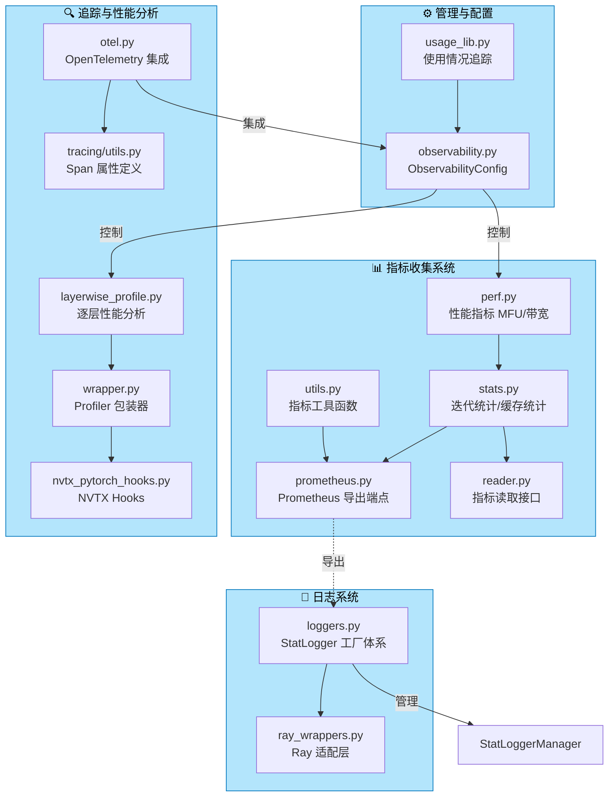

---

## 一、指标收集系统

### 1.1 性能指标 — `perf.py`（MFU / 带宽估算）

**文件**: [perf.py](file:///workspace/vllm/v1/metrics/perf.py)

该模块是 vLLM 性能指标的核心，负责计算 **Model FLOPs Utilization (MFU)** 和内存带宽利用率。其设计采用了组件化的 Parser Chain 模式，将模型拆分为 Attention / FFN / Unembed 三个可独立计算的组件。

#### 1.1.1 核心数据结构

**ExecutionContext** — 执行上下文，聚合一个 batch 中所有请求的统计信息：

```python
# perf.py:104-169
@dataclass
class ExecutionContext:
    """代表一个 batch 的执行上下文，分别追踪 prefill 和 decode 阶段。"""
    num_prefill_requests: int = 0
    prefill_num_tokens: int = 0       # prefill 阶段的 token 总数
    prefill_context_len: int = 0      # prefill 阶段的 context 长度总和
    prefill_token_context_product: int = 0  # Σ(num_tokens × context_len)

    num_decode_requests: int = 0
    decode_num_tokens: int = 0
    decode_context_len: int = 0
    decode_token_context_product: int = 0
```

**PerfStats** — 每个 step 的性能快照：

```python
# perf.py:96-101
@dataclass
class PerfStats:
    num_flops_per_gpu: int = 0      # 每 GPU 浮点运算次数
    num_read_bytes_per_gpu: int = 0 # 每 GPU 内存读取字节数
    num_write_bytes_per_gpu: int = 0# 每 GPU 内存写入字节数
```

#### 1.1.2 组件化 Parser Chain 架构

vLLM 采用 **Chain of Responsibility + Registry** 模式来解析模型配置并推导 FLOPs：

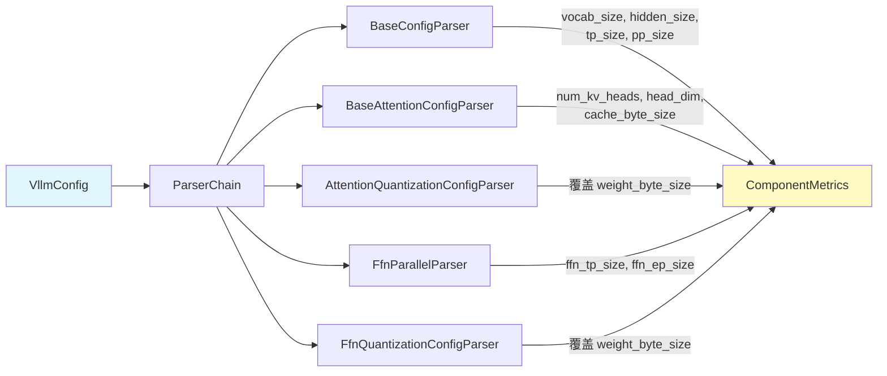

每个 `ComponentMetrics` 子类通过 `__init_subclass__` 自动注册到全局注册表：

```python
# perf.py:226-258
_COMPONENT_METRICS_REGISTRY: dict[str, type["ComponentMetrics"]] = {}

class ComponentMetrics(BaseModel, ABC):
    def __init_subclass__(cls):
        _COMPONENT_METRICS_REGISTRY[cls.component_type()] = cls

    @classmethod
    def from_vllm_config(cls, vllm_config: VllmConfig) -> Self:
        parser = cls.get_parser()
        parsed_args = parser.parse(vllm_config)
        return cls.model_validate(parsed_args.model_dump())
```

#### 1.1.3 三大组件的 FLOPs 计算

| 组件 | 类名 | 关键 FLOPs 公式 | 文件位置 |
|------|------|-----------------|----------|
| Attention | `AttentionMetrics` | `qkv_proj: 2·T·D·(q+2kv)·d·L` | [L432-456](file:///workspace/vllm/v1/metrics/perf.py#L432-L456) |
| FFN | `FfnMetrics` | 含 Dense/MoE routed/MoE shared 三类 | [L716-757](file:///workspace/vllm/v1/metrics/perf.py#L716-L757) |
| Unembed | `UnembedMetrics` | `unembed: 2·T·D·V` | [L938-950](file:///workspace/vllm/v1/metrics/perf.py#L938-L950) |

其中 FFN 组件完整支持 MoE（Mixture of Experts）模型，包括：
- **Dense FFN**: `flops = 2 · D · 3 · DI · T · Ld`
- **MoE Routed**: `flops = 2 · D · 3 · MI · (T · E) · Lm`
- **MoE Shared**: `flops = 2 · D · 3 · MI · S · T · Lm`

> **注意**: 所有公式均考虑了 Tensor Parallelism (`tp_size`)、Pipeline Parallelism (`pp_size`) 和 Expert Parallelism (`ep_size`)。

#### 1.1.4 ModelMetrics — 聚合入口

```python
# perf.py:985-1116
class ModelMetrics:
    def __init__(self, vllm_config: VllmConfig):
        self.metrics: list[ComponentMetrics] = []
        for metric_cls in ComponentMetrics.registered_metrics():
            try:
                metric = metric_cls.from_vllm_config(vllm_config)
                self.metrics.append(metric)
            except InvalidComponent as e:
                logger.debug("Failed to instantiate %s", ...)

    def get_step_perf_stats_per_gpu(self, scheduler_output) -> PerfStats:
        """基于 SchedulerOutput 计算当前 step 的性能统计。"""
        ctx = ExecutionContext()
        for new_req in scheduler_output.scheduled_new_reqs:
            ctx.add(num_tokens, context_len, is_prefill=True)
        for req_id in cached_reqs.req_ids:
            ctx.add(num_tokens, context_len, is_prefill=num_tokens > 1)
        ...
```

#### 1.1.5 Prometheus 集成 — PerfMetricsProm

```python
# perf.py:1265-1332
class PerfMetricsProm:
    """将性能指标记录到 Prometheus Counter。"""
    _counter_cls = prometheus_client.Counter

    def __init__(self, vllm_config, labelnames, per_engine_labelvalues):
        self.counter_flops = create_metric_per_engine(
            Counter(name="vllm:estimated_flops_per_gpu_total", ...),
            per_engine_labelvalues)
        self.counter_read_bytes = create_metric_per_engine(...)
        self.counter_write_bytes = create_metric_per_engine(...)

    def observe(self, perf_stats, engine_idx=0):
        self.counter_flops[engine_idx].inc(perf_stats.num_flops_per_gpu)
        self.counter_read_bytes[engine_idx].inc(perf_stats.num_read_bytes_per_gpu)
        self.counter_write_bytes[engine_idx].inc(perf_stats.num_write_bytes_per_gpu)
```

通过 PromQL 可计算平均 TFLOPS：
```promql
rate(vllm:estimated_flops_per_gpu_total[1m]) / 1e12
```

---

### 1.2 统计数据 — `stats.py`

**文件**: [stats.py](file:///workspace/vllm/v1/metrics/stats.py)

这是 vLLM 运行时统计数据的核心数据结构定义文件，定义了从 Scheduler 到 Request 全链路的统计信息。

#### 1.2.1 缓存命中率统计 — CachingMetrics

```python
# stats.py:35-112
class CachingMetrics:
    """基于滑动窗口的缓存命中率统计（默认最近 N=1000 个请求）。"""

    def __init__(self, max_recent_requests: int = 1000):
        self.query_queue = deque[tuple[int, int, int]]()  # (requests, queries, hits)

    @property
    def hit_rate(self) -> float:
        if self.aggregated_query_total == 0:
            return 0.0
        return self.aggregated_query_hit / self.aggregated_query_total
```

支持三种缓存统计类型：

| 类型 | 类名 | 用途 |
|------|------|------|
| Prefix Cache | `PrefixCacheStats` | KV Cache 自动前缀复用命中率 |
| Multi-Modal Cache | `MultiModalCacheStats` | 多模态数据（图片等）缓存命中 |
| External KV Transfer | `PrefixCacheStats` | 跨实例 KV 传输缓存命中 |

#### 1.2.2 调度器统计 — SchedulerStats

```python
# stats.py:171-199
@dataclass
class SchedulerStats:
    num_running_reqs: int = 0           # 正在运行的请求数
    num_waiting_reqs: int = 0           # 排队等待的请求数
    num_skipped_waiting_reqs: int = 0   # 被跳过的等待请求
    kv_cache_usage: float = 0.0         # KV Cache 使用率 (0~1)
    prefix_cache_stats: PrefixCacheStats
    spec_decoding_stats: SpecDecodingStats | None = None
    cudagraph_stats: CUDAGraphStat | None = None
    perf_stats: PerfStats | None = None  # 来自 perf.py 的性能统计
```

#### 1.2.3 请求生命周期统计

**RequestStateStats** — 追踪单个请求的状态时间戳：

```python
# stats.py:202-221
@dataclass
class RequestStateStats:
    arrival_time: float          # 到达时间 (frontend timestamp)
    queued_ts: float             # 进入排队队列时间
    scheduled_ts: float          # 被调度时间
    first_token_ts: float        # 首个 token 生成时间
    last_token_ts: float         # 最后一个 token 生成时间
    first_token_latency: float   # TTFT (Time To First Token)
```

**FinishedRequestStats** — 完成请求的详细延迟分解：

```python
# stats.py:224-239
@dataclass
class FinishedRequestStats:
    e2e_latency: float              # 端到端延迟
    queued_time: float              # 排队等待时间
    prefill_time: float             # Prefill 阶段时间
    inference_time: float           # 推理总时间
    decode_time: float              # Decode 阶段时间
    mean_time_per_output_token: float  # TPOT (Time Per Output Token)
```

这些字段构成了完整的 **延迟分解链路**：

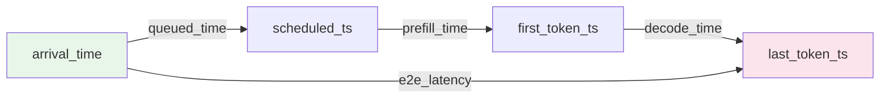

#### 1.2.4 IterationStats — 单次迭代统计

```python
# stats.py:325-481
class IterationStats:
    """单次 EngineCore 输出的统计集合。"""
    def __init__(self):
        self.num_generation_tokens = 0
        self.prompt_token_stats = PromptTokenStats()
        self.time_to_first_tokens_iter: list[float] = []     # TTFT 列表
        self.inter_token_latencies_iter: list[float] = []    # ITL (Inter-Token Latency) 列表
        self.finished_requests: list[FinishedRequestStats] = []
```

`update_from_output()` 方法是核心的数据采集逻辑，负责：
1. 区分 prefill / decode 阶段并分别记录 TTFT 和 ITL
2. 处理 EngineCoreEvent（QUEUED / SCHEDULED / PREEMPTED）
3. 在请求完成时计算所有延迟指标

---

### 1.3 Prometheus 导出端点 — `prometheus.py`

**文件**: [prometheus.py](file:///workspace/vllm/v1/metrics/prometheus.py)

提供 Prometheus 多进程支持的基础设施：

```python
# prometheus.py:17-36
def setup_multiprocess_prometheus():
    """设置多进程 Prometheus 目录。
    创建临时目录供多进程 Collector 写入各自进程的指标，
    并设置 PROMETHEUS_MULTIPROC_DIR 环境变量。"""
    global _prometheus_multiproc_dir
    if "PROMETHEUS_MULTIPROC_DIR" not in os.environ:
        _prometheus_multiproc_dir = tempfile.TemporaryDirectory()
        os.environ["PROMETHEUS_MULTIPROC_DIR"] = _prometheus_multiproc_dir.name

def get_prometheus_registry() -> CollectorRegistry:
    """根据是否启用多进程返回对应的 Registry。"""
    if os.getenv("PROMETHEUS_MULTIPROC_DIR") is not None:
        registry = CollectorRegistry()
        multiprocess.MultiProcessCollector(registry)
        return registry
    return REGISTRY
```

关键点：
- **多进程模式**下，每个 worker 进程将指标写入独立的临时文件，由 `MultiProcessCollector` 聚合
- **shutdown_prometheus()** 在进程退出时调用 `mark_process_dead()` 清理

---

### 1.4 指标读取接口 — `reader.py`

**文件**: [reader.py](file:///workspace/vllm/v1/metrics/reader.py)

提供编程方式访问内存中 Prometheus 指标的 API，支持四种指标类型：

```python
# reader.py:12-68
@dataclass
class Counter(Metric):     value: int       # 单调递增计数器
@dataclass
class Vector(Metric):       values: list[int] # 有序整数数组（spec_decode 专用）
@dataclass
class Gauge(Metric):        value: float     # 可增减的数值
@dataclass
class Histogram(Metric):    count: int; sum: float; buckets: dict[str, int]
```

核心 API `get_metrics_snapshot()` 从 Prometheus Registry 中提取所有 `vllm:` 前缀的指标：

```python
# reader.py:70-143
def get_metrics_snapshot() -> list[Metric]:
    collected: list[Metric] = []
    for metric in REGISTRY.collect():
        if not metric.name.startswith("vllm:"):
            continue
        if metric.type == "gauge":
            ...  # 提取为 Gauge
        elif metric.type == "counter":
            ...  # 提取为 Counter 或 Vector（特殊处理 spec_decode）
        elif metric.type == "histogram":
            ...  # 提取为 Histogram（处理 DP 场景下的 bucket 聚合）
    return collected
```

特殊处理：
- **Vector 类型**: 专用于 `vllm:spec_decode_num_accepted_tokens_per_pos`，按 position 维度聚合成数组
- **Histogram 聚合**: 处理 Data Parallel 下 per-engine-per-bucket 的计数合并

---

### 1.5 指标工具函数 — `utils.py`

**文件**: [utils.py](file:///workspace/vllm/v1/metrics/utils.py)

轻量级工具函数，为每个引擎索引创建带标签的 Prometheus 指标子实例：

```python
# utils.py:11-19
def create_metric_per_engine(
    metric: PromMetric,
    per_engine_labelvalues: dict[int, list[object]],
) -> dict[int, PromMetric]:
    """为每个引擎索引创建带标签的 metric child。"""
    return {
        idx: metric.labels(*labelvalues)
        for idx, labelvalues in per_engine_labelvalues.items()
    }
```

这是实现**多引擎（Data Parallel）指标隔离**的关键函数——每个引擎拥有独立的带 `engine` 标签的指标实例。

---

## 二、日志系统

### 2.1 StatLogger 工厂体系 — `loggers.py`

**文件**: [loggers.py](file:///workspace/vllm/v1/metrics/loggers.py)

这是整个日志系统的核心，实现了完整的 **StatLogger 层次结构**：

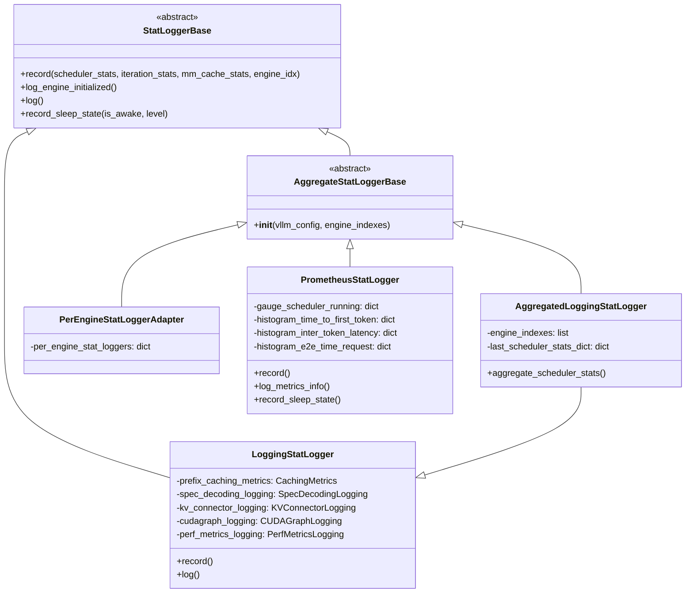

#### 2.1.1 LoggingStatLogger — 标准输出日志

核心方法 `log()` 输出的典型格式：

```
Engine 000: Avg prompt throughput: 1500.2 tokens/s, Avg generation throughput: 85.3 tokens/s,
Running: 32 reqs, Waiting: 5 reqs, GPU KV cache usage: 78.5%,
Prefix cache hit rate: 42.3%
```

关键实现细节 ([L217-281](file:///workspace/vllm/v1/metrics/loggers.py#L217-L281)):

```python
def log(self):
    self._update_stats()
    self.aggregate_scheduler_stats()
    # 空闲生产环境用 debug 级别避免噪音
    log_fn = logger.debug if self.engine_is_idle else logger.info
    log_fn(self.log_prefix + ", ".join(log_parts), *log_args)
```

吞吐量计算使用**实际计算 token 数**（排除 cached/transferred tokens），确保反映真实算力消耗：

```python
# loggers.py:143-148
def _track_iteration_stats(self, iteration_stats):
    self.num_prompt_tokens += iteration_stats.prompt_token_stats.computed  # 仅 computed
    self.num_generation_tokens += iteration_stats.num_generation_tokens
```

#### 2.1.2 PrometheusStatLogger — Prometheus 指标记录

这是最复杂的 Logger，定义了完整的 **vLLM Prometheus 指标体系**：

**Gauge 类指标（瞬时状态）：**

| 指标名 | 说明 | 标签 |
|--------|------|------|
| `vllm:num_requests_running` | 运行中的请求数 | model_name, engine |
| `vllm:num_requests_waiting` | 等待中的请求数 | model_name, engine |
| `vllm:num_requests_waiting_by_reason` | 按原因分类的等待数 | model_name, engine, reason |
| `vllm:kv_cache_usage_perc` | KV Cache 使用百分比 | model_name, engine |
| `vllm:engine_sleep_state` | 引擎休眠状态 | model_name, engine, sleep_state |
| `vllm:lora_requests_info` | LoRA 适配器状态 | max_lora, waiting_lora_adapters, running_lora_adapters |

**Counter 类指标（累积计数）：**

| 指标名 | 说明 |
|--------|------|
| `vllm:prompt_tokens` | 处理的 prefill token 总数 |
| `vllm:generation_tokens` | 生成的 decode token 总数 |
| `vllm:prompt_tokens_by_source` | 按 source 分类的 prompt tokens |
| `vllm:request_success` | 按完成原因分类的成功请求数 |
| `vllm:num_preemptions` | 累计抢占次数 |
| `vllm:prefix_cache_queries/hits` | 前缀缓存查询/命中数 |
| `vllm:estimated_flops_per_gpu_total` | 估计 FLOPS (MFU 用) |

**Histogram 类指标（延迟分布）：**

| 指标名 | 说明 | 典型 buckets |
|--------|------|-------------|
| `vllm:time_to_first_token_seconds` | TTFT 分布 | 0.001 ~ 2560s |
| `vllm:inter_token_latency_seconds` | ITL 分布 | 0.01 ~ 80s |
| `vllm:e2e_request_latency_seconds` | 端到端延迟分布 | 0.3 ~ 7680s |
| `vllm:request_prefill_time_seconds` | Prefill 时间分布 | 同 e2e |
| `vllm:request_decode_time_seconds` | Decode 时间分布 | 同 e2e |
| `vllm:request_queue_time_seconds` | 排队时间分布 | 同 e2e |
| `vllm:request_params_max_tokens` | max_tokens 参数分布 | 1-2-5 buckets |

#### 2.1.3 StatLoggerManager — 统一管理入口

```python
# loggers.py:1268-1359
class StatLoggerManager:
    """
    抽象了 DP 场景下的 logger 实现差异：
    - DP >1 个 EngineCore 时，每个 EngineCore 各自记录
    - Local Logger: 为 N 个 EngineCore 创建 N 个副本
    - Prometheus: 单个 logger 带 N 个 label
    """

    def __init__(self, vllm_config, engine_idxs, custom_stat_loggers,
                 enable_default_loggers=True, aggregate_engine_logging=False, client_count=1):
        # 1. 加载自定义插件 logger
        # 2. 根据 aggregate_engine_logging 选择 AggregatedLoggingStatLogger 或 LoggingStatLogger
        # 3. 如果没有自定义 Prometheus logger，自动添加默认 PrometheusStatLogger
        ...

    def record(self, scheduler_stats, iteration_stats, mm_cache_stats, engine_idx=None):
        for stat_logger in self.stat_loggers:
            stat_logger.record(...)

    def log(self):
        for logger in self.stat_loggers:
            logger.log()
```

`StatLoggerManager` 是 AsyncLLMEngine 与底层日志系统之间的唯一接口，屏蔽了单引擎 vs 多引擎（DP）的实现差异。

---

### 2.2 Ray 日志适配 — `ray_wrappers.py`

**文件**: [ray_wrappers.py](file:///workspace/vllm/v1/metrics/ray_wrappers.py)

当 vLLM 运行在 Ray 上时，需要将 Prometheus 指标桥接到 Ray 的 metrics 系统。该模块提供了三组 Wrapper 类：

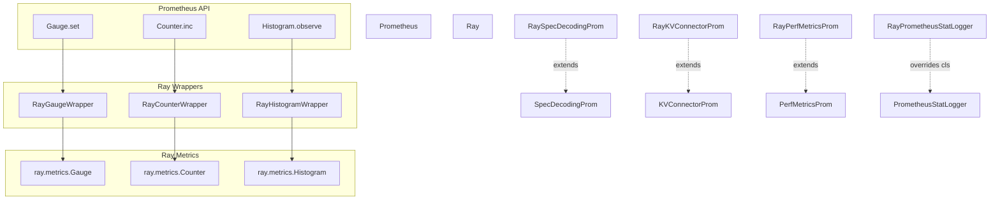

关键实现特点：

1. **名称清洗** — OpenTelemetry 要求 metric 名只含 `[a-zA-Z0-9_]`，Ray Wrapper 自动替换非法字符：
   ```python
   # ray_wrappers.py:70-82
   @staticmethod
   def _get_sanitized_opentelemetry_name(name: str) -> str:
       return re.sub(r"[^a-zA-Z0-9_]", "_", name)
   ```

2. **ReplicaId 自动注入** — 每个 Ray Serve replica 自动附加 ReplicaId 标签用于区分

3. **完整继承体系** — `RayPrometheusStatLogger` 通过覆写 `_gauge_cls`, `_counter_cls`, `_histogram_cls` 将所有指标切换为 Ray 实现

---

## 三、StatLoggerFactory / StatLoggerManager 详解

### 3.1 类型别名体系

```python
# loggers.py:39-41
PerEngineStatLoggerFactory = Callable[[VllmConfig, int], "StatLoggerBase"]
AggregateStatLoggerFactory = type["AggregateStatLoggerBase"]
StatLoggerFactory = AggregateStatLoggerFactory | PerEngineStatLoggerFactory
```

两种 Factory 的区别：
- **PerEngineStatLoggerFactory**: 接收 `(config, engine_index)`，创建单引擎 logger
- **AggregateStatLoggerFactory**: 接收 `(config, engine_indexes)`，创建跨引擎聚合 logger

### 3.2 插件加载机制

```python
# loggers.py:74-88
def load_stat_logger_plugin_factories() -> list[StatLoggerFactory]:
    """通过 entry_points 加载第三方 StatLogger 插件。"""
    factories: list[StatLoggerFactory] = []
    for name, plugin_class in load_plugins_by_group(STAT_LOGGER_PLUGINS_GROUP).items():
        if not issubclass(plugin_class, StatLoggerBase):
            raise TypeError(f"Stat logger plugin {name!r} must be a subclass of StatLoggerBase")
        factories.append(plugin_class)
    return factories
```

用户可通过 Python entry_points 注册自定义 StatLogger，实现指标导出到任意后端（如 Datadog、CloudWatch 等）。

### 3.3 StatLoggerManager 初始化流程

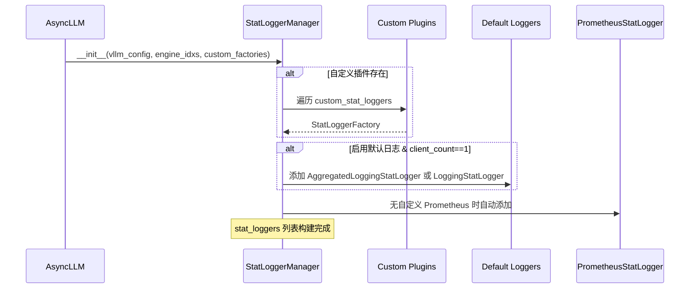

---

## 四、OpenTelemetry 集成

### 4.1 OTel 初始化 — `otel.py`

**文件**: [otel.py](file:///workspace/vllm/tracing/otel.py)

vLLM 通过 OpenTelemetry 实现分布式追踪（Distributed Tracing），支持 gRPC 和 HTTP/protobuf 两种协议：

```python
# otel.py:60-91
def init_otel_tracer(
    instrumenting_module_name: str,
    otlp_traces_endpoint: str,
    extra_attributes: dict[str, str] | None = None,
) -> Tracer:
    os.environ["OTEL_EXPORTER_OTLP_TRACES_ENDPOINT"] = otlp_traces_endpoint
    resource_attrs = {
        "vllm.instrumenting_module_name": instrumenting_module_name,
        "vllm.process_id": str(os.getpid()),
    }
    resource = Resource.create(resource_attrs)
    trace_provider = TracerProvider(resource=resource)
    span_exporter = get_span_exporter(otlp_traces_endpoint)
    trace_provider.add_span_processor(BatchSpanProcessor(span_exporter))
    set_tracer_provider(trace_provider)
    atexit.register(trace_provider.shutdown)
    return trace_provider.get_tracer(instrumenting_module_name)
```

**协议选择** ([L94-102](file:///workspace/vllm/tracing/otel.py#L94-L102)):
```python
def get_span_exporter(endpoint):
    protocol = os.environ.get(OTEL_EXPORTER_OTLP_TRACES_PROTOCOL, "grpc")
    if protocol == "grpc":
        return OTLPGrpcExporter(endpoint=endpoint, insecure=True)
    elif protocol == "http/protobuf":
        return OTLPHttpExporter(endpoint=endpoint)
```

### 4.2 自动化 Instrumentation

`instrument_otel()` 函数提供装饰器方式的自动埋点：

```python
# otel.py:134-180
def instrument_otel(func, span_name, attributes, record_exception):
    code_attrs = {
        LoadingSpanAttributes.CODE_FUNCTION: func.__qualname__,
        LoadingSpanAttributes.CODE_NAMESPACE: func.__module__,
        LoadingSpanAttributes.CODE_FILEPATH: func.__code__.co_filename,
        LoadingSpanAttributes.CODE_LINENO: str(func.__code__.co_firstlineno),
    }
    # 同时支持 sync 和 async 函数
    async_wrapper / sync_wrapper:
        with tracer.start_as_current_span(final_span_name, ..., propagate_trace_to_env()):
            return await/call func(*args, **kwargs)
```

### 4.3 Trace Context 传播

vLLM 实现了**智能 Context 传播**机制，解决跨进程追踪问题：

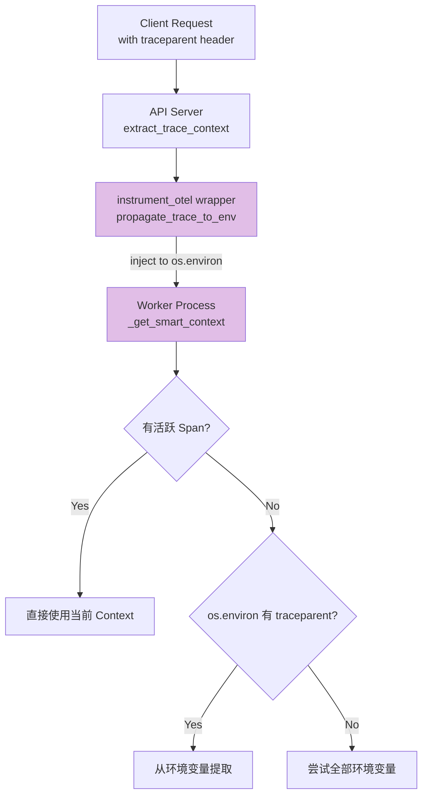

关键实现 ([L216-237](file:///workspace/vllm/tracing/otel.py#L216-L237)):

```python
def _get_smart_context() -> Context | None:
    current_span = trace.get_current_span()
    if current_span.get_span_context().is_valid:
        return None  # 已有活跃 Span，无需额外 context
    carrier = {}
    if tp := os.environ.get("traceparent", os.environ.get("TRACEPARENT")):
        carrier["traceparent"] = tp
    if ts := os.environ.get("tracestate", os.environ.get("TRACESTATE")):
        carrier["tracestate"] = ts
    return TraceContextTextMapPropagator().extract(carrier)
```

`propagate_trace_to_env()` context manager 确保**子进程继承正确的 traceparent** ([L240-263](file:///workspace/vllm/tracing/otel.py#L240-L263))。

### 4.4 Span 属性标准 — `tracing/utils.py`

**文件**: [tracing/utils.py](file:///workspace/vllm/tracing/utils.py)

定义了符合 **OpenTelemetry Semantic Conventions** 的 Span 属性常量：

```python
# tracing/utils.py:15-46
class SpanAttributes:
    # GenAI 标准属性
    GEN_AI_USAGE_COMPLETION_TOKENS = "gen_ai.usage.completion_tokens"
    GEN_AI_USAGE_PROMPT_TOKENS = "gen_ai.usage.prompt_tokens"
    GEN_AI_REQUEST_ID = "gen_ai.request.id"
    GEN_AI_RESPONSE_MODEL = "gen_ai.response.model"

    # 延迟细分属性
    GEN_AI_LATENCY_TIME_TO_FIRST_TOKEN = "gen_ai.latency.time_to_first_token"
    GEN_AI_LATENCY_E2E = "gen_ai.latency.e2e"
    GEN_AI_LATENCY_TIME_IN_QUEUE = "gen_ai.latency.time_in_queue"
    GEN_AI_LATENCY_TIME_IN_MODEL_PREFILL = "gen_ai.latency.time_in_model_prefill"
    GEN_AI_LATENCY_TIME_IN_MODEL_DECODE = "gen_ai.latency.time_in_model_decode"
    GEN_AI_LATENCY_TIME_IN_MODEL_FORWARD = "gen_ai.latency.time_in_model_forward"
    GEN_AI_LATENCY_TIME_IN_MODEL_EXECUTE = "gen_ai.latency.time_in_model_execute"

class LoadingSpanAttributes:
    CODE_NAMESPACE = "code.namespace"
    CODE_FUNCTION = "code.function"
    CODE_FILEPATH = "code.filepath"
    CODE_LINENO = "code.lineno"
```

支持的 W3C Trace Context Headers: `traceparent`, `tracestate`。

---

## 五、Profiling 性能分析

### 5.1 Profiler 包装器体系 — `wrapper.py`

**文件**: [wrapper.py](file:///workspace/vllm/profiler/wrapper.py)

vLLM 提供了两层 Profiler 抽象，均继承自 `WorkerProfiler` 基类：

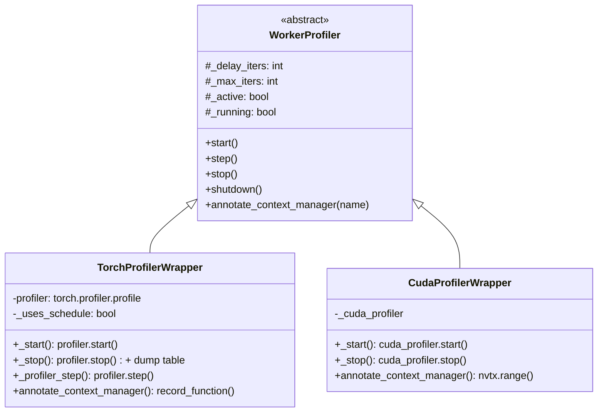

**WorkerProfiler 生命周期状态机**：

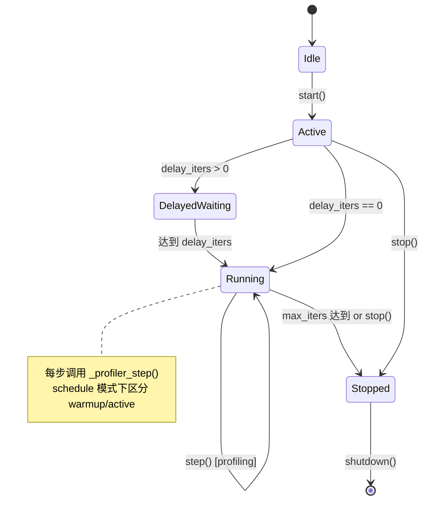

**TorchProfilerWrapper** 支持的关键功能：
- **Schedule-based profiling**: 配置 wait/warmup/active 循环 ([L201-209](file:///workspace/vllm/profiler/wrapper.py#L201-L209))
- **TensorBoard 导出**: 默认使用 `tensorboard_trace_handler` ([L192-196](file:///workspace/vllm/profiler/wrapper.py#L192-L196))
- **表格输出**: 停止时自动 dump CUDA/CPU time 表格 ([L269-287](file:///workspace/vllm/profiler/wrapper.py#L269-L287))

### 5.2 逐层性能分析 — `layerwise_profile.py`

**文件**: [layerwise_profile.py](file:///workspace/vllm/profiler/layerwise_profile.py)

基于 PyTorch Kineto 的**模型层级性能剖析器**，生成两种视图：

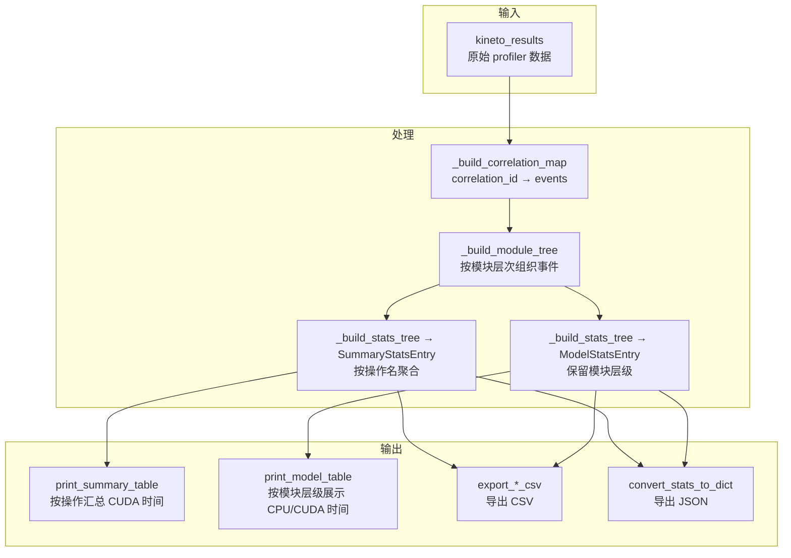

**LayerwiseProfileResults** 继承自 `torch.profiler.profile`，在 `__exit__` 时自动构建结果：

```python
# layerwise_profile.py:373-400
class layerwise_profile(profile):
    def __init__(self, num_running_seqs=None):
        super().__init__(
            activities=[ProfilerActivity.CPU, ProfilerActivity.CUDA],
            record_shapes=True,
            with_stack=True,
            with_modules=True,
            experimental_config=_ExperimentalConfig(verbose=True),
        )

    def __exit__(self, exc_type, exc_val, exc_tb):
        super().__exit__(exc_type, exc_val, exc_tb)
        self.results = LayerwiseProfileResults(
            self.profiler.kineto_results,
            num_running_seqs=self.num_running_seqs,
        )
```

**SummaryStatsEntry** — 按操作名去重聚合：

```python
# layerwise_profile.py:55-60
@dataclass
class SummaryStatsEntry:
    name: str              # 操作名称 (如 "aten::matmul")
    cuda_time_us: float    # 累积 CUDA 时间 (微秒)
    pct_cuda_time: float   # 占总 CUDA 时间百分比
    invocations: int       # 调用次数
```

**ModelStatsEntry** — 保留模块层级信息：

```python
# layerwise_profile.py:63-69
@dataclass
class ModelStatsEntry:
    name: str              # 模块名称 (如 "LlamaDecoderLayer(idx=12)")
    cpu_time_us: float     # CPU 时间
    cuda_time_us: float    # CUDA 时间
    pct_cuda_time: float   # 占比
    trace: str             # PyTorch 操作调用栈
```

### 5.3 Profiler 工具函数 — `utils.py`

**文件**: [utils.py](file:///workspace/vllm/profiler/utils.py)

提供事件分析和表格打印的工具函数集：

| 函数 | 功能 |
|------|------|
| `event_has_module(event)` | 判断事件是否关联到 Python 模块 |
| `event_is_torch_op(event)` | 判断事件是否为 PyTorch 原生操作 |
| `event_module_repr(event)` | 格式化为 `ClassName(param=val, ...)` |
| `event_torch_op_repr(event)` | 格式化为 `op_name(args)` |
| `event_torch_op_stack_trace(event)` | 向上遍历获取 PyTorch 操作调用链 |
| `TablePrinter` | 通用的 dataclass 表格打印机 |

### 5.4 NVTX Hooks — `nvtx_pytorch_hooks.py`

**文件**: [nvtx_pytorch_hooks.py](file:///workspace/vllm/utils/nvtx_pytorch_hooks.py)

利用 NVIDIA NVTX (NVIDIA Tools Extension) 在 PyTorch 模型的每一层自动插入 **range marker**，使得在 Nsight Systems / Nsight Compute 中可以清晰看到每层的执行情况。

**PytHooks 类** — 自动注册 forward hook：

```python
# nvtx_pytorch_hooks.py:216-286
class PytHooks:
    def register_hooks(self, network_model, module_prefix="top"):
        skip_types = (torch.nn.Identity, torch.nn.Dropout, ...)
        for name, module in network_model.named_modules(prefix=module_prefix):
            if isinstance(module, skip_types):
                continue
            module.register_forward_pre_hook(self.module_fwd_pre_hook, with_kwargs=True)
            module.register_forward_hook(self.module_fwd_hook)
```

**Marker 信息内容** — 每次 push 包含丰富的调试信息：

```python
# nvtx_pytorch_hooks.py:138-170
def construct_marker_dict_and_push(module_name, module_obj, in_tensor, kwargs, out_tensor):
    marker_dict = {
        "Module": module_name,
        "TrainableParams": {name: list(size) for name, param in ...},
        "Inputs": tensor_dims_list,       # 输入张量形状
        "Outputs": tensor_dims_list,      # 输出张量形状
        "StaticParams": {                 # 层参数 (如 Linear 的 in/out_features)
            "in_features": ...,
            "out_features": ...,
        },
        **kwargs,                         # 顶层额外参数 (如 input_ids)
    }
    nvtx.range_push("{}".format(marker_dict))
```

**Context Manager 方式** — 也支持手动包裹单次前向传播：

```python
# nvtx_pytorch_hooks.py:179-213
@contextmanager
def layerwise_nvtx_marker_context(module_name, module_obj, in_tensor=None, kwargs=None):
    holder = ResultHolder()
    construct_marker_dict_and_push(...)  # push input marker
    try:
        yield holder                      # 用户在此执行 forward
    finally:
        nvtx.range_pop()                  # pop input marker
        construct_marker_dict_and_push(output_name, ..., out_tensor=holder.result)  # push output
        nvtx.range_pop()                  # pop output marker
```

> ⚠️ 注意：NVTX tracing 与 CUDA graphs 不兼容（`enable_layerwise_nvtx_tracing` 在 CUDA graph 启用时无效）。

---

## 六、Usage Context & Usage Lib

### 6.1 使用情况追踪 — `usage_lib.py`

**文件**: [usage_lib.py](file:///workspace/vllm/usage/usage_lib.py)

vLLM 内置匿名的**使用情况统计**（Usage Stats）系统，用于了解社区如何使用 vLLM。

#### 6.1.1 启用/禁用控制

```python
# usage_lib.py:51-69
def is_usage_stats_enabled():
    """三个维度的禁用方式（任一即禁用）：
    1. 环境变量 VLLM_DO_NOT_TRACK=1
    2. 环境变量 DO_NOT_TRACK=1
    3. 环境变量 VLLM_NO_USAGE_STATS=1
    4. 文件 $HOME/.config/vllm/do_not_track 存在
    """
```

#### 6.1.2 UsageContext 枚举

```python
# usage_lib.py:112-119
class UsageContext(str, Enum):
    UNKNOWN_CONTEXT = "UNKNOWN_CONTEXT"
    LLM_CLASS = "LLM_CLASS"                    # 直接使用 LLM 类
    API_SERVER = "API_SERVER"                  # 通用 API Server
    OPENAI_API_SERVER = "OPENAI_API_SERVER"    # OpenAI 兼容 Server
    OPENAI_BATCH_RUNNER = "OPENAI_BATCH_RUNNER"# Batch 推理
    ENGINE_CONTEXT = "ENGINE_CONTEXT"          # 纯引擎模式
```

#### 6.1.3 收集的信息维度

**UsageMessage** 收集的信息包括：

| 类别 | 字段 | 示例 |
|------|------|------|
| **平台** | provider, architecture, platform | AWS, x86_64, Linux |
| **硬件** | gpu_count, gpu_type, gpu_memory_per_device | 8, H100, 80GB |
| **CPU** | num_cpu, cpu_type | 128, AMD EPYC 9534 |
| **运行时** | cuda_runtime, xpu_runtime | 12.4 |
| **模型** | model_architecture, vllm_version | llama3_8b, 0.6.3 |
| **环境变量** | env_var_json | VLLM_USE_FLASHINFER_SAMPLER 等 |
| **上下文** | context, source | API_SERVER |

#### 6.1.4 上报机制

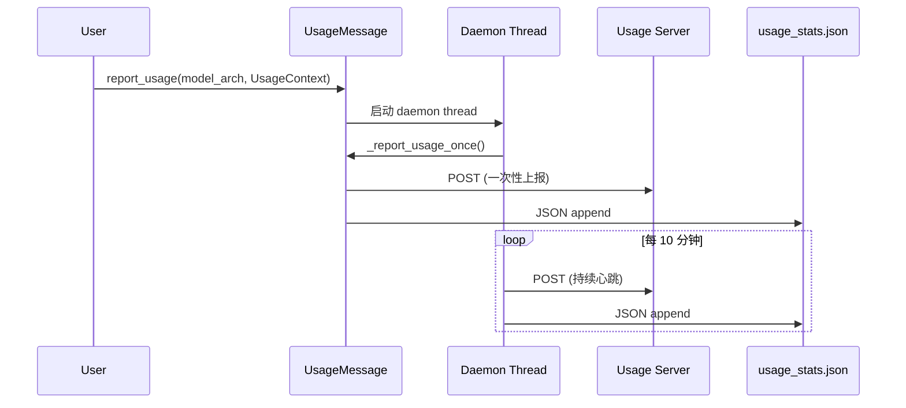

**云平台检测** ([L76-109](file:///workspace/vllm/usage/usage_lib.py#L76-L109)) 通过 DMI 文件和环境变量识别 AWS/Azure/GCP/OCI/RUNPOD。

---

## 七、Observability Config

### 7.1 配置定义 — `observability.py`

**文件**: [observability.py](file:///workspace/vllm/config/observability.py)

`ObservabilityConfig` 是所有可观测性功能的**统一配置入口**：

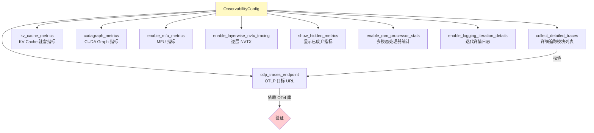

#### 7.1.1 配置项详解

| 配置项 | 类型 | 默认值 | 影响范围 | 开销 |
|--------|------|--------|----------|------|
| `otlp_traces_endpoint` | `str \| None` | `None` | OpenTelemetry 追踪 | 低（异步导出） |
| `collect_detailed_traces` | `list \| None` | `None` | 请求级延迟细分 | 中（需 otlp endpoint） |
| `kv_cache_metrics` | `bool` | `False` | KV Cache 生命周期直方图 | 低（采样 1%） |
| `cudagraph_metrics` | `bool` | `False` | CUDA Graph 效率统计 | 极低 |
| `enable_mfu_metrics` | `bool` | `False` | MFU / 内存带宽 | 低 |
| `enable_layerwise_nvtx_tracing` | `bool` | `False` | NVTX range markers | 中（每层 hook） |
| `show_hidden_metrics_for_version` | `str \| None` | `None` | Prometheus 废弃指标恢复 | 无 |
| `kv_cache_metrics_sample` | `float` | `0.01` | KV Cache 采样率 | 控制开销 |

#### 7.1.2 校验规则

1. **版本号校验**: `show_hidden_metrics_for_version` 必须是合法语义化版本
2. **OTel 依赖校验**: 设置 `otlp_traces_endpoint` 时必须已安装 OpenTelemetry 库
3. **联动校验**: `collect_detailed_traces` 要求 `otlp_traces_endpoint` 已设置
4. **兼容性处理**: `collect_detailed_traces` 支持逗号分隔字符串的旧格式

#### 7.1.3 衍生属性

```python
# observability.py:79-93
@cached_property
def collect_model_forward_time(self) -> bool:
    """是否收集 model forward 时间（影响请求级别 Span）。"""
    return self.collect_detailed_traces is not None and (
        "model" in self.collect_detailed_traces or "all" in self.collect_detailed_traces
    )

@cached_property
def collect_model_execute_time(self) -> bool:
    """是否收集 model execute 时间（worker 级别）。"""
    return self.collect_detailed_traces is not None and (
        "worker" in self.collect_detailed_traces or "all" in self.collect_detailed_traces
    )
```

---

## 八、指标收集与导出架构全景

```mermaid
graph TB
    subgraph 数据源["📥 数据采集层"]
        S1[SchedulerOutput<br/>调度结果]
        S2[EngineCoreOutput<br/>引擎输出]
        S3[PrefillStats<br/>Prefill 细分]
        S4[KVCacheEvictionEvent<br/>驱逐事件]
        S5[ModelMetrics<br/>FLOPs/带宽估算]
    end

    subgraph 聚合["🔄 聚合层"]
        IS[IterationStats<br/>迭代统计]
        SS[SchedulerStats<br/>调度统计]
        PS[PerfStats<br/>性能快照]
        CS[CachingMetrics<br/>缓存命中率]
    end

    subgraph 记录["📝 记录层"]
        LSL[LoggingStatLogger<br/>标准输出]
        ALSL[AggregatedLoggingStatLogger<br/>聚合日志]
        PSL[PrometheusStatLogger<br/>Prometheus 导出]
        RAY[RayPrometheusStatLogger<br/>Ray 适配]
        PLUGIN[Custom Plugins<br/>第三方插件]
    end

    subgraph 导出["📤 导出层"]
        STDOUT[Console / File]
        PROM[/metrics 端点]
        RAY_METRICS[Ray Metrics System]
        EXTERNAL[外部监控系统]
    end

    S1 --> SS
    S2 --> IS
    S3 --> IS
    S4 --> SS
    S5 --> PS

    IS & SS & PS & CS --> LSL
    IS & SS & PS & CS --> ALSL
    IS & SS & PS & CS --> PSL
    IS & SS & PS & CS --> RAY
    IS & SS & PS & CS --> PLUGIN

    LSL & ALSL --> STDOUT
    PSL --> PROM
    RAY --> RAY_METRICS
    PLUGIN --> EXTERNAL

    SLM[StatLoggerManager] -.->|统一调度| LSL & ALSL & PSL & RAY & PLUGIN

    style 数据源 fill:#e3f2fd
    style 聚合 fill:#e8f5e9
    style 记录 fill:#fff3e0
    style 导出 fill:#fce4ec
```

### 核心数据流路径

**路径 1: 延迟指标（TTFT / ITL / E2E）**

```
EngineCoreOutput → IterationStats.update_from_output()
  → time_to_first_tokens_iter[] (TTFT)
  → inter_token_latencies_iter[] (ITL)
  → FinishedRequestStats (e2e_latency, prefill_time, decode_time)
  → PrometheusStatLogger.record() → histogram_ttft / histogram_itl / histogram_e2e
```

**路径 2: 吞吐量指标（Prompt/Generation tokens/s）**

```
IterationStats → LoggingStatLogger._track_iteration_stats()
  → num_prompt_tokens (仅 computed tokens)
  → num_generation_tokens
  → LoggingStatLogger.log() → throughput = tokens / delta_time
```

**路径 3: MFU / 带宽指标**

```
SchedulerOutput → ModelMetrics.get_step_perf_stats_per_gpu()
  → ExecutionContext (prefill/decode 分类)
  → ComponentMetrics.get_num_flops/get_read_bytes/get_write_bytes
  → PerfStats (flops, read_bytes, write_bytes)
  → PerfMetricsProm.observe() → counter_flops/read/write
  → PerfMetricsLogging.observe() → TFLOPS/s, GB/s
```

**路径 4: 缓存命中率**

```
SchedulerOutput.prefix_cache_stats → CachingMetrics.observe()
  → 滑动窗口 (最近 N 请求) → hit_rate
  → LoggingStatLogger.log() → "Prefix cache hit rate: X%"
  → PrometheusStatLogger.record() → counter_prefix_cache_queries/hits
```

---

## 附录：关键文件索引

| 文件路径 | 核心职责 | 行数 |
|----------|---------|------|
| [v1/metrics/perf.py](file:///workspace/vllm/v1/metrics/perf.py) | MFU/FLOPs/带宽估算，组件化 Parser Chain | ~1351 |
| [v1/metrics/stats.py](file:///workspace/vllm/v1/metrics/stats.py) | 运行时统计数据结构定义 | ~539 |
| [v1/metrics/prometheus.py](file:///workspace/vllm/v1/metrics/prometheus.py) | Prometheus 多进程基础设施 | ~82 |
| [v1/metrics/reader.py](file:///workspace/vllm/v1/metrics/reader.py) | 编程式指标读取 API | ~257 |
| [v1/metrics/utils.py](file:///workspace/vllm/v1/metrics/utils.py) | 多引擎指标创建工具 | ~19 |
| [v1/metrics/loggers.py](file:///workspace/vllm/v1/metrics/loggers.py) | StatLogger 工厂体系与管理器 | ~1359 |
| [v1/metrics/ray_wrappers.py](file:///workspace/vllm/v1/metrics/ray_wrappers.py) | Ray Metrics 适配层 | ~216 |
| [tracing/otel.py](file:///workspace/vllm/tracing/otel.py) | OpenTelemetry 初始化与 Instrumentation | ~263 |
| [tracing/utils.py](file:///workspace/vllm/tracing/utils.py) | Span 属性常量与 Context 工具 | ~72 |
| [profiler/layerwise_profile.py](file:///workspace/vllm/profiler/layerwise_profile.py) | 逐层性能分析 (Kineto) | ~400 |
| [profiler/wrapper.py](file:///workspace/vllm/profiler/wrapper.py) | Torch/CUDA Profiler 包装器 | ~328 |
| [profiler/utils.py](file:///workspace/vllm/profiler/utils.py) | Profiler 事件分析与表格打印 | ~150 |
| [utils/nvtx_pytorch_hooks.py](file:///workspace/vllm/utils/nvtx_pytorch_hooks.py) | NVTX 自动 Hook 注入 | ~286 |
| [usage/usage_lib.py](file:///workspace/vllm/usage/usage_lib.py) | 匿名使用情况统计 | ~282 |
| [config/observability.py](file:///workspace/vllm/config/observability.py) | 可观测性统一配置 | ~152 |
