# vLLM 设计模式汇总与架构洞察

> **定位**：本文档是 vLLM 源码分析系列的收官之作，从设计模式与架构视角对前 20 个分模块文档进行归纳提升。旨在揭示 vLLM 代码库中蕴含的工程智慧，为理解其架构决策、扩展机制和性能优化策略提供系统性总结。

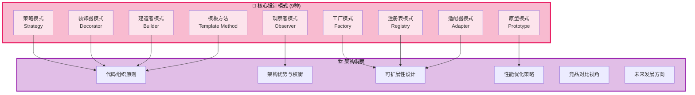

---

## 一、设计模式清单（9 种核心模式）

### 1. 策略模式 (Strategy Pattern)

**核心思想**：定义一系列算法，将每个算法封装到具有共同接口的独立类中，使它们可以相互替换。

#### 1.1 注意力后端选择

vLLM 最典型的策略模式应用。根据硬件能力和模型配置，在运行时动态选择最优的注意力计算实现。

**源码位置**：[selector.py](file:///workspace/vllm/v1/attention/selector.py#L53-L137)

```python
def get_attn_backend(
    head_size: int,
    dtype: torch.dtype,
    kv_cache_dtype: str | None,
    use_mla: bool = False,
    has_sink: bool = False,
    use_sparse: bool = False,
    # ... 更多参数
) -> type[AttentionBackend]:
    """Selects which attention backend to use and lazily imports it."""

    vllm_config = get_current_vllm_config()
    attn_selector_config = AttentionSelectorConfig(
        head_size=head_size,
        dtype=dtype,
        # ... 构建配置
    )

    return _cached_get_attn_backend(
        backend=vllm_config.attention_config.backend,
        attn_selector_config=attn_selector_config,
        num_heads=num_heads,
    )
```

**策略接口定义**：[backend.py](file:///workspace/vllm/v1/attention/backend.py#L55-L80)

```python
class AttentionBackend(ABC):
    """Abstract class for attention backends."""

    supported_dtypes: ClassVar[list[torch.dtype]] = [torch.float16, torch.bfloat16]

    @staticmethod
    @abstractmethod
    def get_name() -> str:
        raise NotImplementedError

    @staticmethod
    @abstractmethod
    def get_impl_cls() -> type["AttentionImplBase"]:
        raise NotImplementedError
```

**具体策略实现包括**：
- `FlashAttentionBackend` - NVIDIA GPU 上的 Flash Attention 实现
- `XFormersBackend` - 基于 xformers 的注意力实现
- `TorchNaiveBackend` - PyTorch 原生实现（fallback）
- `RopeAttentionBackend` - 支持 RoPE 的变体

#### 1.2 调度策略选择

Scheduler 支持多种调度算法（FCFS vs PRIORITY），通过配置切换：

**相关文档**：[04_scheduler.md](./04_scheduler.md) 中详细描述了调度器的策略选择机制。

#### 1.3 线性层后端选择

量化 GEMM 的不同内核选择（Marlin、GPTQ、AWQ 等），根据量化类型自动选择最优内核实现。

---

### 2. 工厂模式 (Factory Pattern)

**核心思想**：将对象的创建逻辑封装起来，客户端不需要知道具体的创建细节。

#### 2.1 Executor 创建工厂

**源码位置**：[abstract.py](file:///workspace/vllm/v1/executor/abstract.py#L47-L92)

```python
class Executor(ABC):
    """Abstract base class for vLLM executors."""

    uses_ray: bool = False
    supports_pp: bool = False

    @staticmethod
    def get_class(vllm_config: VllmConfig) -> type["Executor"]:
        executor_class: type[Executor]
        parallel_config = vllm_config.parallel_config
        distributed_executor_backend = parallel_config.distributed_executor_backend

        if isinstance(distributed_executor_backend, type):
            executor_class = distributed_executor_backend
        elif distributed_executor_backend == "ray":
            if envs.VLLM_USE_RAY_V2_EXECUTOR_BACKEND:
                from vllm.v1.executor.ray_executor_v2 import RayExecutorV2
                executor_class = RayExecutorV2
            else:
                from vllm.v1.executor.ray_executor import RayDistributedExecutor
                executor_class = RayDistributedExecutor
        elif distributed_executor_backend == "mp":
            from vllm.v1.executor.multiproc_executor import MultiprocExecutor
            executor_class = MultiprocExecutor
        elif distributed_executor_backend == "uni":
            from vllm.v1.executor.uniproc_executor import UniProcExecutor
            executor_class = UniProcExecutor
        # ... 更多分支
        return executor_class
```

**工厂创建的产品层级**：
| 配置值 | 创建的 Executor 类 | 用途 |
|--------|-------------------|------|
| `"ray"` | `RayDistributedExecutor` / `RayExecutorV2` | Ray 分布式执行 |
| `"mp"` | `MultiprocExecutor` | 多进程执行 |
| `"uni"` | `UniProcExecutor` | 单进程执行 |

#### 2.2 Weight Transfer 连接器工厂

**源码位置**：[factory.py](file:///workspace/vllm/distributed/weight_transfer/factory.py#L19-L105)

```python
class WeightTransferEngineFactory:
    """Factory for creating weight transfer engines with lazy loading."""

    _registry: dict[str, Callable[[], type[WeightTransferEngine]]] = {}

    @classmethod
    def register_engine(cls, name, module_path_or_cls, class_name=None):
        if isinstance(module_path_or_cls, str):
            def loader() -> type[WeightTransferEngine]:
                module = importlib.import_module(module_path)
                return getattr(module, class_name)
            cls._registry[name] = loader
        else:
            engine_cls = module_path_or_cls
            cls._registry[name] = lambda: engine_cls

    @classmethod
    def create_engine(cls, config, parallel_config):
        backend = config.backend
        engine_cls = cls._registry[backend]()
        return engine_cls(config, parallel_config)


# 注册内置引擎
WeightTransferEngineFactory.register_engine(
    "nccl", "vllm.distributed.weight_transfer.nccl_engine", "NCCLWeightTransferEngine"
)
WeightTransferEngineFactory.register_engine(
    "ipc", "vllm.distributed.weight_transfer.ipc_engine", "IPCWeightTransferEngine"
)
```

#### 2.3 KV Offload 工厂

**源码位置**：[factory.py](file:///workspace/vllm/v1/kv_offload/factory.py#L17-L57)

```python
class OffloadingSpecFactory:
    _registry: dict[str, Callable[[], type[OffloadingSpec]]] = {}

    @classmethod
    def register_spec(cls, name, module_path, class_name):
        def loader() -> type[OffloadingSpec]:
            module = importlib.import_module(module_path)
            return getattr(module, class_name)
        cls._registry[name] = loader

    @classmethod
    def create_spec(cls, config, kv_cache_config):
        spec_name = extra_config.get("spec_name", "CPUOffloadingSpec")
        spec_cls = cls._registry[spec_name]()
        return spec_cls(config, kv_cache_config)


OffloadingSpecFactory.register_spec(
    "CPUOffloadingSpec", "vllm.v1.kv_offload.cpu.spec", "CPUOffloadingSpec"
)
```

#### 2.4 Worker 创建

根据设备类型（GPU/CPU/TPU/XPU）和运行模式创建不同的 Worker 实现：
- `GPUWorker` - GPU 设备 worker
- `CPUWorker` - CPU 设备 worker
- `TPUWorker` - TPU 设备 worker
- `XPUWorker` - XPU 设备 worker

---

### 3. 观察者模式 (Observer Pattern)

**核心思想**：定义对象间一对多的依赖关系，当一个对象状态改变时，所有依赖它的对象都会收到通知并自动更新。

#### 3.1 指标收集系统

**源码位置**：[loggers.py](file:///workspace/vllm/v1/metrics/loggers.py#L44-L1359)

```python
class StatLoggerBase(ABC):
    """Interface for logging metrics."""

    @abstractmethod
    def __init__(self, vllm_config: VllmConfig, engine_index: int = 0): ...

    @abstractmethod
    def record(
        self,
        scheduler_stats: SchedulerStats | None,
        iteration_stats: IterationStats | None,
        mm_cache_stats: MultiModalCacheStats | None = None,
        engine_idx: int = 0,
    ): ...

    @abstractmethod
    def log_engine_initialized(self): ...
```

**观察者层级结构**：

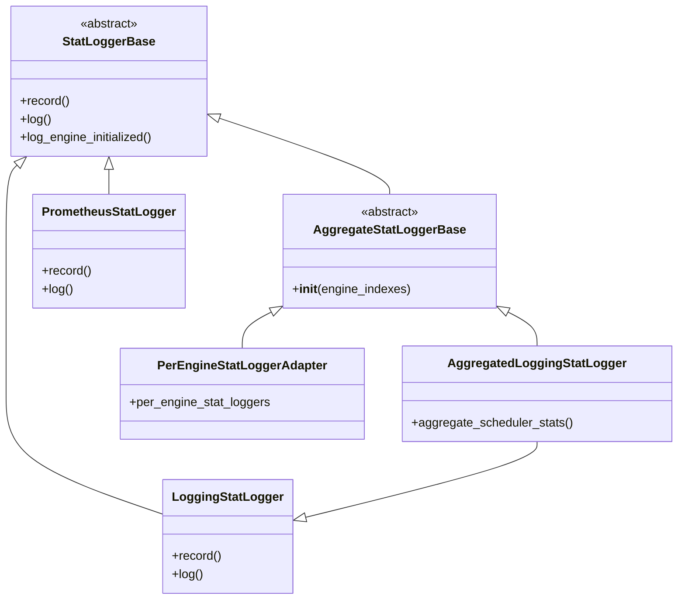

**具体观察者实现**：
- `LoggingStatLogger` - 输出到标准日志（控制台）
- `PrometheusStatLogger` - 输出到 Prometheus metrics 端点
- `AggregatedLoggingStatLogger` - 多引擎聚合日志
- `PerEngineStatLoggerAdapter` - 按引擎分别记录

**Subject（被观察者）- StatLoggerManager**：[loggers.py#L1268-L1359](file:///workspace/vllm/v1/metrics/loggers.py#L1268-L1359)

```python
class StatLoggerManager:
    def __init__(self, vllm_config, engine_idxs, custom_stat_loggers=None, ...):
        self.stat_loggers: list[AggregateStatLoggerBase] = []
        # ... 初始化多个 logger

    def record(self, scheduler_stats, iteration_stats, mm_cache_stats, engine_idx):
        for stat_logger in self.stat_loggers:
            stat_logger.record(scheduler_stats, iteration_stats, mm_cache_stats, engine_idx)

    def log(self):
        for logger in self.stat_loggers:
            logger.log()
```

#### 3.2 KV Event Publisher/Subscriber

KV Cache 相关事件的发布订阅机制，用于跨实例协调和状态同步。

---

### 4. 注册表模式 (Registry Pattern)

**核心思想**：维护一个全局或局部的注册表，通过键值映射来查找和获取对象实例。vLLM 大量使用此模式实现可扩展架构。

#### 4.1 模型注册表

**源码位置**：[registry.py](file:///workspace/vllm/model_executor/models/registry.py#L932-L1327)

这是 vLLM 最核心的注册表之一，支持 **200+ 模型架构**的自动发现和加载。

```python
@dataclass
class _ModelRegistry:
    models: dict[str, _BaseRegisteredModel] = field(default_factory=dict)

    def register_model(self, model_arch: str, model_cls: type[nn.Module] | str):
        """Register an external model to be used in vLLM."""
        if isinstance(model_cls, str):
            model = _LazyRegisteredModel(*model_cls.split(":"))
        elif isinstance(model_cls, type) and issubclass(model_cls, nn.Module):
            model = _RegisteredModel.from_model_cls(model_cls)
        self.models[model_arch] = model

    def resolve_model_cls(self, architectures, model_config):
        """Resolve model class from architecture names."""
        for arch in architectures:
            normalized_arch = self._normalize_arch(arch, model_config)
            model_cls = self._try_load_model_cls(normalized_arch)
            if model_cls is not None:
                return (model_cls, arch)


# 全局模型注册表实例
ModelRegistry = _ModelRegistry({
    model_arch: _LazyRegisteredModel(
        module_name=f"vllm.model_executor.models.{mod_relname}",
        class_name=cls_name,
    )
    for model_arch, (mod_relname, cls_name) in _VLLM_MODELS.items()
})
```

**支持的模型类别**（7大类）：

| 类别 | 字典变量 | 示例模型 |
|------|----------|----------|
| 文本生成 | `_TEXT_GENERATION_MODELS` | Llama, Qwen, Mistral, DeepSeek... |
| Embedding | `_EMBEDDING_MODELS` | BERT, GTE, Jina, Voyage... |
| Late Interaction | `_LATE_INTERACTION_MODELS` | ColBERT, ColPali... |
| Reward Model | `_REWARD_MODELS` | InternLM2, Qwen2-RM... |
| Token Classification | `_TOKEN_CLASSIFICATION_MODELS` | BertForTokenClassification... |
| Sequence Classification | `_SEQUENCE_CLASSIFICATION_MODELS` | BertForSequenceClassification... |
| Multimodal | `_MULTIMODAL_MODELS` | LLaVA, Qwen2-VL, Phi3V... |
| Speculative Decoding | `_SPECULATIVE_DECODING_MODELS` | Medusa, Eagle, Eagle3... |

#### 4.2 多模态处理器注册表

**源码位置**：[registry.py](file:///workspace/vllm/multimodal/registry.py#L98-L231)

```python
class MultiModalRegistry:
    """A registry that dispatches data processing according to the model."""

    def register_processor(self, processor, *, info, dummy_inputs):
        """Register a multi-modal processor to a model class."""
        def wrapper(model_cls: N) -> N:
            model_cls._processor_factory = _ProcessorFactories(
                info=info, dummy_inputs=dummy_inputs, processor=processor,
            )
            return model_cls
        return wrapper

    def create_processor(self, model_config, *, tokenizer=None, cache=None):
        """Create a multi-modal processor for a specific model."""
        model_cls = self._get_model_cls(model_config)
        factories = model_cls._processor_factory
        ctx = self._create_processing_ctx(model_config, tokenizer)
        return factories.build_processor(ctx, cache=cache)
```

**使用装饰器语法注册**：
```python
@MULTIMODAL_REGISTRY.register_processor(
    MyImageProcessor,
    info=MyProcessingInfoFactory(),
    dummy_inputs=MyDummyInputsBuilderFactory(),
)
class MyVisionModel(nn.Module):
    ...
```

#### 4.3 Tokenizer 注册表

**源码位置**：[registry.py](file:///workspace/vllm/tokenizers/registry.py#L56-L93)

```python
@dataclass
class _TokenizerRegistry:
    tokenizers: dict[str, tuple[str, str]] = field(default_factory=dict)

    def register(self, tokenizer_mode: str, module: str, class_name: str):
        self.tokenizers[tokenizer_mode] = (module, class_name)

    def load_tokenizer_cls(self, tokenizer_mode: str) -> type[TokenizerLike]:
        module, class_name = self.tokenizers[tokenizer_mode]
        return resolve_obj_by_qualname(f"{module}.{class_name}")


TokenizerRegistry = _TokenizerRegistry({
    mode: (f"vllm.tokenizers.{mod_relname}", cls_name)
    for mode, (mod_relname, cls_name) in _VLLM_TOKENIZERS.items()
})
# 内置 Tokenizer: deepseek_v32, deepseek_v4, fastokens, grok2, hf, kimi_audio, mistral, qwen_vl
```

#### 4.4 渲染器注册表

**源码位置**：[registry.py](file:///workspace/vllm/renderers/registry.py#L36-L88)

```python
@dataclass
class RendererRegistry:
    renderers: dict[str, tuple[str, str]] = field(default_factory=dict)

    def register(self, renderer_mode: str, module: str, class_name: str):
        self.renderers[renderer_mode] = (module, class_name)

    def load_renderer_cls(self, renderer_mode: str) -> type[BaseRenderer]:
        module, class_name = self.renderers[renderer_mode]
        return resolve_obj_by_qualname(f"{module}.{class_name}")


RENDERER_REGISTRY = RendererRegistry({
    mode: (f"vllm.renderers.{mod_relname}", cls_name)
    for mode, (mod_relname, cls_name) in _VLLM_RENDERERS.items()
})
# 内置 Renderer: deepseek_v32, deepseek_v4, fastokens, grok2, hf, kimi_audio, mistral, qwen_vl, terratorch
```

#### 4.5 Chat Template 注册表

**源码位置**：[registry.py](file:///workspace/vllm/transformers_utils/chat_templates/registry.py#L32-L75)

```python
_MODEL_TYPE_TO_CHAT_TEMPLATE_FALLBACK: dict[str, ChatTemplatePath] = {
    "blip-2": CHAT_TEMPLATES_DIR / "template_blip2.jinja",
    "chameleon": CHAT_TEMPLATES_DIR / "template_basic.jinja",
    "deepseek_ocr": CHAT_TEMPLATES_DIR / "template_deepseek_ocr.jinja",
    "fuyu": CHAT_TEMPLATES_DIR / "template_fuyu.jinja",
    "qwen": _get_qwen_chat_template_fallback,  # 支持函数作为 fallback
    # ...
}

def register_chat_template_fallback_path(model_type: str, chat_template: ChatTemplatePath):
    _MODEL_TYPE_TO_CHAT_TEMPLATE_FALLBACK[model_type] = chat_template
```

**注册表模式汇总图**：

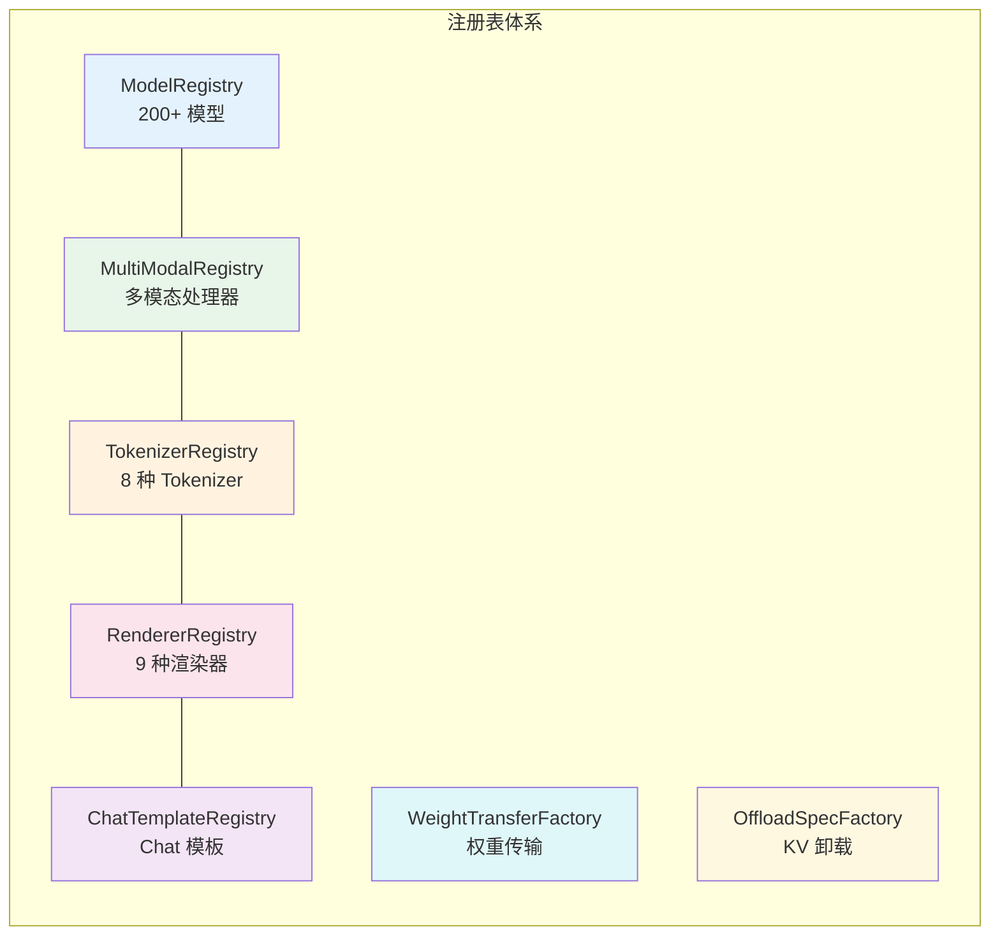

---

### 5. 装饰器模式 (Decorator Pattern)

**核心思想**：动态地给对象添加额外的职责，比生成子类更为灵活。

#### 5.1 模型注册装饰器

虽然 vLLM 使用显式字典注册而非传统 Python 装饰器语法进行模型注册，但多模态处理器的注册使用了经典的装饰器模式：

**源码位置**：[multimodal/registry.py#L142-L174](file:///workspace/vllm/multimodal/registry.py#L142-L174)

```python
def register_processor(self, processor, *, info, dummy_inputs):
    def wrapper(model_cls: N) -> N:
        if "_processor_factory" in model_cls.__dict__:
            logger.warning("Model class %s already has a multi-modal processor...")
        model_cls._processor_factory = _ProcessorFactories(
            info=info, dummy_inputs=dummy_inputs, processor=processor,
        )
        return model_cls
    return wrapper
```

#### 5.2 自定义 Op 注册

`@CustomOp.register` 装饰器用于注册自定义算子，支持插件扩展 CUDA kernel。

#### 5.3 配置验证装饰器

多处使用装饰器进行参数验证、缓存、性能追踪等横切关注点的处理。

---

### 6. 适配器模式 (Adapter Pattern)

**核心思想**：将一个类的接口转换成客户期望的另一个接口，使原本因接口不兼容而不能一起工作的类可以协同工作。

#### 6.1 API 协议转换 - Anthropic API

**源码位置**：[protocol.py](file:///workspace/vllm/entrypoints/anthropic/protocol.py)

Anthropic API 模块实现了完整的协议适配层，将 Anthropic 格式的请求/响应转换为 vLLM 内部格式：

```python
class AnthropicMessagesRequest(BaseModel):
    """Anthropic Messages API request - 适配外部 API 格式"""
    model: str
    messages: list[AnthropicMessage]
    max_tokens: int
    temperature: float | None = None
    top_k: int | None = None
    top_p: float | None = None
    tool_choice: AnthropicToolChoice | None = None
    tools: list[AnthropicTool] | None = None
    # vLLM 特有字段（桥接内部系统）
    kv_transfer_params: dict[str, Any] | None = Field(default=None)
    chat_template_kwargs: dict[str, Any] | None = Field(default=None)


class AnthropicMessagesResponse(BaseModel):
    """Anthropic Messages API response - 适配响应格式"""
    id: str
    type: Literal["message"] = "message"
    role: Literal["assistant"] = "assistant"
    content: list[AnthropicContentBlock]
    stop_reason: Literal["end_turn", "max_tokens", "stop_sequence", "tool_use"] | None
```

**适配器工作流程**：
```
Anthropic Request → Protocol Adapter → OpenAI Internal Format → Engine → Response Adapter → Anthropic Response
```

#### 6.2 渲染器适配

不同模型使用不同的输入渲染器（HuggingFace、Mistral、DeepSeek 等），渲染器作为适配层统一不同模型的输入格式差异：

**源码位置**：[renderers/registry.py](file:///workspace/vllm/renderers/registry.py#L82-L88)

```python
def renderer_from_config(config: "VllmConfig", **kwargs):
    model_config = config.model_config
    tokenizer = cached_tokenizer_from_config(model_config, **kwargs)
    renderer_mode, *_ = tokenizer_args_from_config(model_config, **kwargs)
    return RENDERER_REGISTRY.load_renderer(renderer_mode, config, tokenizer)
```

---

### 7. 建造者模式 (Builder Pattern)

**核心思想**：将复杂对象的构建过程与其表示分离，使得同样的构建过程可以创建不同的表示。

#### 7.1 VllmConfig 配置构建

`VllmConfig` 是 vLLM 最复杂的配置对象，聚合了 **28+ 个子配置模块**，采用逐步构建方式组装：

**配置模块列表**（来自 [config/](file:///workspace/vllm/config/) 目录）：

| 配置模块 | 文件 | 职责 |
|----------|------|------|
| `VllmConfig` | `vllm.py` | 顶层聚合配置 |
| `ModelConfig` | `model.py` | 模型相关配置 |
| `CacheConfig` | `cache.py` | KV Cache 配置 |
| `ParallelConfig` | `parallel.py` | 并行配置 (TP/PP/DP) |
| `SchedulerConfig` | `scheduler.py` | 调度器配置 |
| `DeviceConfig` | `device.py` | 设备配置 |
| `LoadConfig` | `load.py` | 模型加载配置 |
| `LoRAConfig` | `lora.py` | LoRA 适配器配置 |
| `QuantizationConfig` | `quantization.py` | 量化配置 |
| `AttentionConfig` | `attention.py` | 注意力后端配置 |
| `SpeculativeConfig` | `speculative.py` | 推测解码配置 |
| `ObservabilityConfig` | `observability.py` | 可观测性配置 |
| `CompilationConfig` | `compilation.py` | 编译优化配置 |
| `MultimodalConfig` | `multimodal.py` | 多模态配置 |
| `StructuredOutputsConfig` | `structured_outputs.py` | 结构化输出配置 |
| ... | ... | 共 28 个模块 |

**构建流程**：
```python
@dataclass
class VllmConfig:
    model_config: ModelConfig
    cache_config: CacheConfig
    parallel_config: ParallelConfig
    scheduler_config: SchedulerConfig
    device_config: DeviceConfig
    load_config: LoadConfig
    lora_config: LoRAConfig | None
    # ... 20+ 其他配置字段

    def __post_init__(self):
        # 验证配置一致性
        # 推导依赖配置
        # 设置默认值
```

#### 7.2 SamplingParams 链式构建

**源码位置**：[sampling_params.py](file:///workspace/vllm/sampling_params.py)

`SamplingParams` 使用 Pydantic dataclass 支持灵活的参数组合：

```python
@dataclass
class SamplingParams:
    n: int = 1
    temperature: float = 1.0
    top_p: float = 1.0
    top_k: int = -1
    max_tokens: int = 16
    stop: list[str] | None = None
    seed: int | None = None
    # ... 30+ 参数字段
    structured_output_params: StructuredOutputsParams | None = None
    repetition_detection_params: RepetitionDetectionParams | None = None
```

支持嵌套建造：
- `StructuredOutputsParams` - JSON/Regex/Grammar 约束
- `RepetitionDetectionParams` - 重复检测参数

---

### 8. 原型模式 (Prototype Pattern)

**核心思想**：通过复制现有对象来创建新对象，而不是通过实例化。

#### 8.1 Parallel Sampling 中的请求复制

**源码位置**：[parallel_sampling.py](file:///workspace/vllm/v1/engine/parallel_sampling.py#L13-L95)

当用户设置 `n > 1`（并行采样）时，vLLM 通过复制原始请求来创建多个子请求：

```python
class ParentRequest:
    """Info, state & processing for parallel sampling request."""

    request_id: str
    external_req_id: str
    sampling_params: SamplingParams
    child_requests: set[str]
    output_aggregator: list[CompletionOutput]

    def __init__(self, request: EngineCoreRequest) -> None:
        self.sampling_params = request.params
        self.child_requests = set()
        self.output_aggregator = (
            [cast(CompletionOutput, None)] * sampling_params.n
            if (sampling_params.output_kind == RequestOutputKind.FINAL_ONLY)
            else []
        )

    def _get_child_sampling_params(self, index: int) -> SamplingParams:
        """Efficiently obtain child sampling_params via copy."""
        seed = self.sampling_params.seed
        if self.cached_child_sampling_params:
            return self.cached_child_sampling_params
        # 关键：复制父请求的采样参数
        child_sampling_params = copy(self.sampling_params)
        child_sampling_params.n = 1
        if seed is not None:
            child_sampling_params.seed = seed + index  # 每个子请求唯一种子
        else:
            self.cached_child_sampling_params = child_sampling_params  # 缓存复用
        return child_sampling_params
```

**原型复制的工作流**：

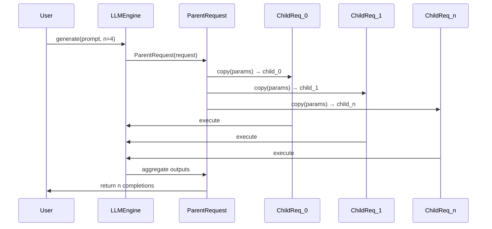

#### 8.2 Sequence 状态快照

Sequence 对象的状态快照机制，用于 preempt 后恢复执行。

---

### 9. 模板方法模式 (Template Method Pattern)

**核心思想**：在操作中定义算法的骨架，将一些步骤延迟到子类中实现。

#### 9.1 WorkerBase 执行骨架

**源码位置**：[worker_base.py](file:///workspace/vllm/v1/worker/worker_base.py#L38-L100)

```python
class WorkerBase:
    """Worker interface that allows vLLM to cleanly separate implementations
    for different hardware."""

    def __init__(self, vllm_config, local_rank, rank, distributed_init_method, is_driver_worker=False):
        # 通用的初始化逻辑
        self.vllm_config = vllm_config
        self.model_config = vllm_config.model_config
        # ... 提取所有子配置
        self.rank = rank
        self.local_rank = local_rank

    def get_kv_cache_spec(self) -> dict[str, KVCacheSpec]:
        """子类必须实现的抽象方法"""
        raise NotImplementedError

    def compile_or_warm_up_model(self) -> CompilationTimes:
        """子类必须实现的抽象方法"""
        raise NotImplementedError

    def determine_available_memory(self) -> list[int]:
        raise NotImplementedError

    def execute_model(self, ...):
        raise NotImplementedError
```

**模板方法的类层次**：

| 基类方法 | GPUWorker | CPUWorker | TPUWorker | XPUWorker |
|---------|-----------|-----------|-----------|----------|
| `__init__()` | ✓ 继承 | ✓ 继承 | ✓ 继承 | ✓ 继承 |
| `get_kv_cache_spec()` | GPU 实现 | CPU 实现 | TPU 实现 | XPU 实现 |
| `compile_or_warm_up_model()` | CUDA warmup | CPU warmup | TPU warmup | XPU warmup |
| `execute_model()` | CUDA 执行 | CPU 执行 | TPU 执行 | XPU 执行 |

#### 9.2 AttentionBackend 骨架方法

**源码位置**：[backend.py](file:///workspace/vllm/v1/attention/backend.py#L55-L80)

```python
class AttentionBackend(ABC):
    @staticmethod
    @abstractmethod
    def get_name() -> str: ...

    @staticmethod
    @abstractmethod
    def get_impl_cls() -> type["AttentionImplBase"]: ...

    @staticmethod
    def get_supported_kernel_block_sizes() -> list[int | MultipleOf]:
        return [MultipleOf(1)]  # 默认实现，子类可覆盖
```

#### 9.3 ModelForCausalLM 基类骨架

模型基类定义了 `forward()` 的算法骨架，各模型子类实现特定的注意力、FFN 等组件：

**源码位置**：[interfaces.py](file:///workspace/vllm/model_executor/models/interfaces.py#L94-L98)

```python
@runtime_checkable
class SupportsMultiModal(Protocol):
    """The interface required for all multi-modal models."""
    supports_multimodal: ClassVar[Literal[True]] = True
    # 定义多模态模型的接口契约
```

---

## 二、代码组织原则

### 2.1 分层职责分离（六层架构）

vLLM 采用清晰的分层架构，每一层有明确的职责边界：

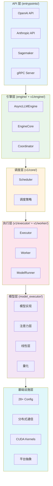

### 2.2 接口抽象（Protocol/ABC 大量使用）

vLLM 广泛使用 Python 的 `ABC`（抽象基类）、`Protocol`（结构化子类型）和 `TypeAlias` 来定义接口契约：

| 抽象类型 | 使用场景 | 示例 |
|----------|----------|------|
| `ABC` | 强制子类实现方法 | `AttentionBackend`, `WorkerBase`, `Executor` |
| `Protocol` | 结构化鸭子类型 | `SupportsMultiModal`, `VllmModel`, `TokenizerLike` |
| `TypeAlias` | 类型别名增强可读性 | `MultiModalEmbeddings`, `ChatTemplatePath` |

**关键接口定义位置**：
- [interfaces.py](file:///workspace/vllm/model_executor/models/interfaces.py) - 模型能力接口
- [interfaces_base.py](file:///workspace/vllm/model_executor/models/interfaces_base.py) - 模型基础接口
- [worker_base.py](file:///workspace/vllm/v1/worker/worker_base.py#L38-L42) - Worker 接口
- [abstract.py](file:///workspace/vllm/v1/executor/abstract.py#L37-L42) - Executor 接口
- [protocol.py](file:///workspace/vllm/tokenizers/protocol.py) - Tokenizer 接口

### 2.3 配置驱动开发（28+ 配置模块控制行为）

vLLM 的行为几乎完全由配置驱动，而非硬编码：

```mermaid
graph TB
    VC[VllmConfig<br/>顶级配置] --> MC[ModelConfig]
    VC --> CC[CacheConfig]
    VC --> PC[ParallelConfig]
    VC --> SC[SchedulerConfig]
    VC --> DC[DeviceConfig]
    VC --> LC[LoadConfig]
    VC --> LoC[LoRAConfig]
    VC --> QC[QuantizationConfig]
    VC --> AC[AttentionConfig]
    VC --> SpC[SpeculativeConfig]
    VC --> OC[ObservabilityConfig]
    VC --> CoC[CompilationConfig]
    VC --> MMC[MultimodalConfig]
    VC --> SOC[StructuredOutputsConfig]
    VC --> RC[ReasoningConfig]
    VC --> KTC[KVTransferConfig]
    VC --> WC[WeightTransferConfig]
    VC --> OFC[OffloadConfig]
    VC --> PrC[ProfilerConfig]
    VC --> KC[KernelConfig]
    VC --> MaC[MambaConfig]
    VC --> ECC[ECConfig]
    VC --> STC[SpeechToTextConfig]
    VC --> PoC[PoolerConfig]
    VC --> MAC[ModelArchConfig]
    VC --> KVC[KVEventsConfig]

    style VC fill:#e91e63,color:#fff
    style MC fill:#e3f2fd
    style CC fill:#e3f2fd
    style PC fill:#e3f2fd
    style SC fill:#e3f2fd
```

**配置驱动的好处**：
1. **可测试性**：可以通过注入不同配置测试各种场景
2. **可扩展性**：新增功能只需添加新的配置模块
3. **灵活性**：同一份代码支持多种部署模式

### 2.4 错误处理层次

vLLM 定义了清晰的异常层次结构：

| 异常类 | 层级 | 触发场景 |
|--------|------|----------|
| `EngineDeadError` | 致命 | Engine 进程崩溃不可恢复 |
| `EngineGenerateError` | 可恢复 | 单次生成失败，可重试 |
| `ValidationError` | 用户错误 | 参数校验失败 |
| `ValueError` | 配置错误 | 不支持的配置组合 |
| `NotImplementedError` | 开发错误 | 调用了未实现的方法 |

---

## 三、架构优势与权衡

### 3.1 性能 vs 灵活性的权衡

| 决策点 | 选择 | 权衡 |
|--------|------|------|
| PagedAttention | 固定 block size | 内存效率 ↑ 但可能内部碎片 |
| Continuous Batching | 动态 batching | 吞吐 ↑ 但调度复杂度 ↑ |
| CUDA Graphs | 静态 shape 捕获 | 延迟 ↓ 但灵活性 ↓（需要 padding） |
| Async Engine | 异步事件循环 | 并发 ↑ 但调试难度 ↑ |
| Lazy Import | 延迟导入 | 启动速度 ↑ 但首次调用有开销 |

### 3.2 抽象开销 vs 可维护性的平衡

**vLLM 在以下方面选择了适度抽象**：

1. **不过度设计**：没有引入 DI 容件、AOP 框架等重量级设施
2. **实用主义**：使用 Python 原生的 ABC/Protocol 而非第三方接口库
3. **渐进式复杂度**：简单场景用字典注册，复杂场景用类继承

**抽象带来的开销**：
- 虚函数调用开销（Python 层面可忽略）
- 间接寻址开销（通过 registry 查找）
- 类型检查和转换开销（`isinstance`, `cast`）

**收益**：
- 200+ 模型的统一管理
- 多硬件后端的无缝切换
- 新功能的最小侵入式添加

### 3.3 同步 vs 异步的选择

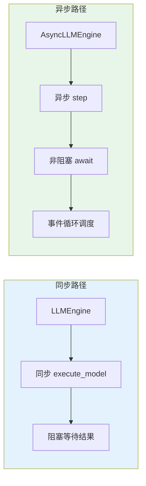

| 场景 | 选择 | 原因 |
|------|------|------|
| API Server | 异步 (`AsyncLLMEngine`) | 高并发、低延迟要求 |
| Offline Batch | 同步 (`LLMEngine`) | 简单直接、易调试 |
| Worker 内部 | 同步 | GPU 操作本身是同步的 |
| RPC 通信 | 异步可选 | `non_block=True` 时返回 Future |

---

## 四、可扩展性设计

### 4.1 如何添加新模型

**步骤**：

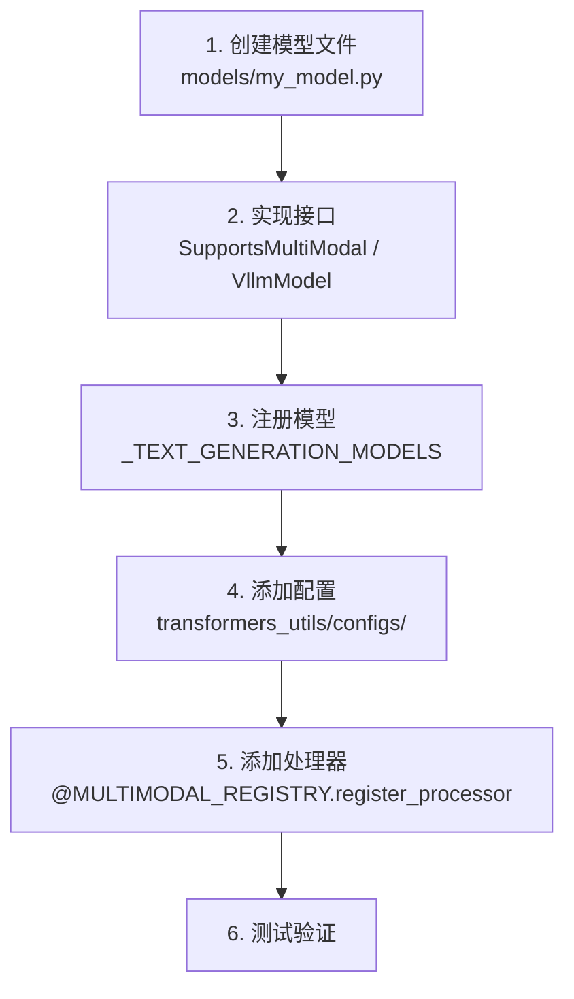

**最小代码示例**：
```python
# vllm/model_executor/models/my_model.py
from vllm.model_executor.models.interfaces import SupportsMultiModal

@ModelRegistry.register_model("MyModelForCausalLM")
class MyModelForCausalLM(nn.Module, SupportsMultiModal):
    supports_multimodal: ClassVar[Literal[True]] = True

    def forward(self, input_ids, positions, ...):
        # 实现前向传播
        pass

    def embed_input_ids(self, ...):
        # 实现嵌入
        pass
```

然后在 [registry.py](file:///workspace/vllm/model_executor/models/registry.py#L70-L221) 中添加映射即可。

### 4.2 如何添加新硬件后端

**通过平台抽象接口**：

**源码位置**：[platforms/interface.py](file:///workspace/vllm/platforms/interface.py)

```python
# 平台接口定义关键方法
class Platform:
    def get_device_name(self) -> str: ...
    def get_attn_backend_cls(self, backend, ...) -> type[AttentionBackend]: ...
    def is_cuda(self) -> bool: ...
    # ... 其他平台特定方法
```

**已支持的硬件平台**：
| 平台 | 实现文件 | 状态 |
|------|----------|------|
| NVIDIA CUDA | [cuda.py](file:///workspace/vllm/platforms/cuda.py) | 成熟 |
| AMD ROCm | [rocm.py](file:///workspace/vllm/platforms/rocm.py) | 成熟 |
| Intel XPU | [xpu.py](file:///workspace/vllm/platforms/xpu.py) | 发展中 |
| Google TPU | [tpu.py](file:///workspace/vllm/platforms/tpu.py) | 实验性 |
| CPU | [cpu.py](file:///workspace/vllm/platforms/cpu.py) | 成熟 |
| ZenDNN CPU | [zen_cpu.py](file:///workspace/vllm/platforms/zen_cpu.py) | 实验性 |

### 4.3 如何添加新量化方案

**步骤**：

1. **创建 QuantizationConfig 子类**
   ```python
   # config/quantization.py 或独立文件
   @dataclass
   class MyQuantizationConfig(QuantizationConfig):
       quant_method: str = "my_quant"
       # 量化特有参数
   ```

2. **创建量化 Linear 层**
   ```python
   # model_executor/layers/quantization/
   class MyQuantizedLinear(LinearMethodBase):
       def create_weights(self, ...): ...
       def apply(self, ...): ...
   ```

3. **注册量化方法**
   在量化 linear 层工厂中注册新的量化方法。

### 4.4 如何添加新注意力后端

**步骤**：

1. **实现 AttentionBackend 抽象类**

```python
# v1/attention/backends/my_backend.py
class MyAttentionBackend(AttentionBackend):
    @staticmethod
    def get_name() -> str:
        return "my_attention"

    @staticmethod
    def get_impl_cls():
        return MyAttentionImpl

    @staticmethod
    def get_supported_kernel_block_sizes():
        return [16, 32, 64]  # 支持的 block size
```

2. **实现 AttentionImplBase**

```python
class MyAttentionImpl(AttentionImplBase):
    def forward(self, query, key, value, ...):
        # 实现注意力计算
        pass
```

3. **在平台中注册**

```python
# platforms/my_platform.py
class MyPlatform(Platform):
    def get_attn_backend_cls(self, backend, ...):
        if backend == "my_attention":
            return MyAttentionBackend
        # ...
```

**可扩展性设计总览**：

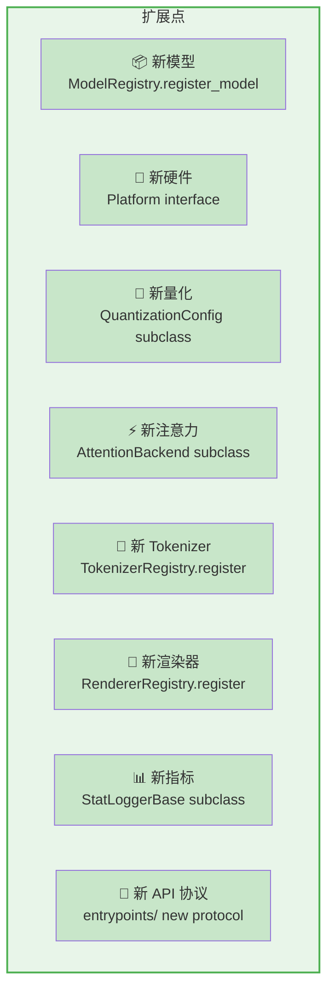

---

## 五、性能优化策略总结

### 5.1 六大核心优化技术

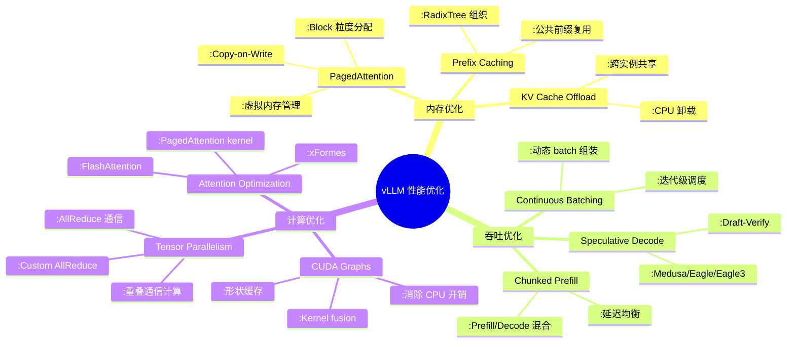

### 5.2 各优化技术的设计模式支撑

| 优化技术 | 涉及的设计模式 | 关键代码位置 |
|----------|----------------|--------------|
| PagedAttention | 模板方法 + 建造者 | [core/kv_cache_manager.py](file:///workspace/vllm/v1/core/kv_cache_manager.py) |
| Continuous Batching | 策略模式 | [scheduler](file:///workspace/vllm/v1/core/) |
| CUDA Graphs | 工厂 + 原型 | [compilation/cuda_graph.py](file:///workspace/vllm/compilation/cuda_graph.py) |
| Speculative Decode | 策略 + 注册表 | [spec_decode/](file:///workspace/vllm/v1/spec_decode/) |
| Tensor Parallelism | 适配器 | [distributed/](file:///workspace/vllm/distributed/) |
| Multi-Modal | 注册表 + 适配器 | [multimodal/](file:///workspace/vllm/multimodal/) |

### 5.3 性能优化的分层实现

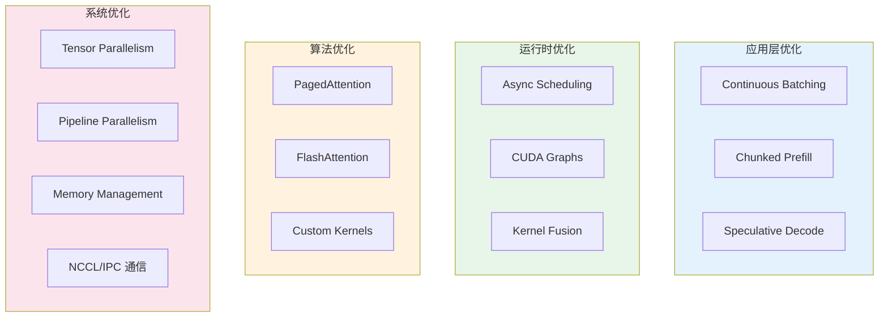

---

## 六、与竞品对比视角（架构层面）

### 6.1 vs HuggingFace Transformers

| 维度 | HuggingFace Transformers | vLLM |
|------|-------------------------|------|
| **定位** | 训练 + 推理通用框架 | 推理专用引擎 |
| **架构理念** | 模型为中心 | 服务为中心 |
| **内存管理** | 全量序列分配 | PagedAttention 虚拟内存 |
| **Batching** | 静态 pad 到固定长度 | Continuous Batching 动态调度 |
| **注意力** | 标准 PyTorch 实现 | FlashAttention + PagedAttention Kernel |
| **并行** | 基础 TP/PP | TP/PP/DP + Custom AllReduce |
| **扩展性** | AutoModel + Config | Registry + Plugin 系统 |
| **性能目标** | 易用性优先 | 吞吐/延迟优先 |

**架构差异的本质**：Transformers 追求通用性和易用性，vLLM 追求极致推理性能。这导致 vLLM 在内存管理、调度、kernel 层面做了大量深度优化。

### 6.2 vs Text Generation Inference (TGI)

| 维度 | TGI | vLLM |
|------|-----|------|
| **KV Cache 管理** | 连续内存分配 | **PagedAttention** (差异化核心) |
| **注意力实现** | FlashAttention v1/v2 | FlashAttention + xFormes + 自研 kernels |
| **Batching** | 连续 batching | Continuous Batching + Chunked Prefill |
| **推测解码** | 有限支持 | Medusa + Eagle + Eagle3 + MLA + DFlash |
| **多模态** | 基础支持 | 深度集成 (图像/音频/视频) |
| **量化** | GPTQ/AWQ/FP8 | GPTQ/AWQ/FP8/FP4/Marlin + 更多 |
| **生态活跃度** | 中等 | **极高** (社区贡献主导) |

**PagedAttention 的战略价值**：这是 vLLM 相对于 TGI 的核心差异化技术，使其在 memory-bound 场景（长上下文、大 batch）下具有显著优势。

### 6.3 vLLM v0 → v1 架构演进

| 方面 | v0 | v1 | 改进动机 |
|------|----|-----|----------|
| **Engine** | 单体 `LLMEngine` | 分离 `AsyncLLM` + `EngineCore` + `Coordinator` | 解耦调度与执行 |
| **Worker** | 直接通信 | `Executor` 抽象层 | 支持多种部署模式 |
| **Metrics** | 硬编码日志 | `StatLogger` 插件系统 | 可扩展的指标收集 |
| **Attention** | 后端选择分散 | 统一 `AttentionSelector` | 更清晰的策略模式 |
| **KV Cache** | 单一实现 | `KVCacheManager` + Interface | 支持异构 KV Cache |
| **Config** | 扁平配置 | 层次化 `VllmConfig` | 更好的组织性 |
| **Sampling** | 耦合在 Engine | 独立采样器组件 | 关注点分离 |

**v1 架构改进的核心趋势**：从"能跑"到"优雅"，提升可维护性的同时不牺牲性能。

---

## 七、未来发展方向推断

基于当前代码结构和社区趋势，推断可能的演进方向：

### 7.1 架构层面

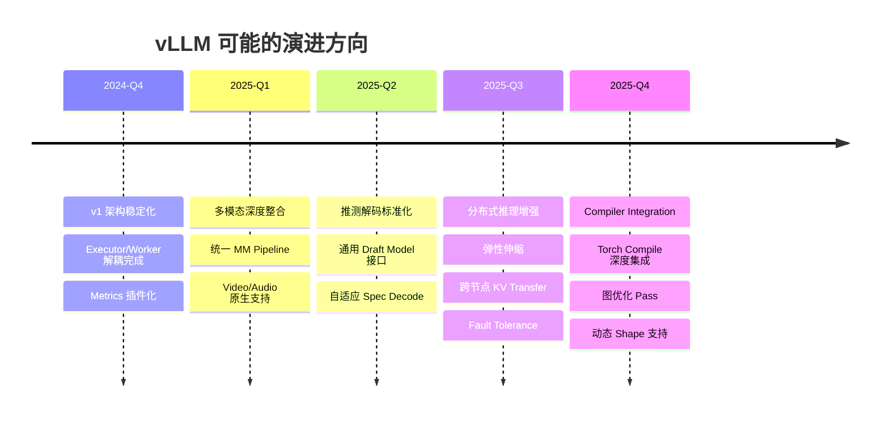

### 7.2 从代码结构推测的具体方向

**1. Compiler-Native Architecture**

当前 [compilation/](file:///workspace/vllm/compilation/) 目录已经包含 `passes/`、`backends.py`、`codegen.py` 等编译器基础设施。预计未来会：
- 更深度集成 `torch.compile`
- 自定义 Triton/CUDA graph optimization passes
- 运行时 JIT 编译支持

**2. 弹性分布式推理**

[v1/executor/ray_executor_v2.py](file:///workspace/vllm/v1/executor/ray_executor_v2.py) 和 [distributed/elastic_ep/](file:///workspace/vllm/distributed/elastic_ep/) 已有弹性执行的初步实现：
- 节点动态加入/退出
- 故障自动恢复
- 负载感知调度

**3. Multimodal First-Class Citizen**

[multimodal/](file:///workspace/vllm/multimodal/) 已经具备完整的注册和处理框架，但视频原生支持仍在发展中。预计：
- 统一的 multimodal pipeline
- 跨模态 attention 优化
- 模态感知的 scheduling

**4. Structured Output 深度集成**

[structured_output/](file:///workspace/vllm/v1/structured_output/) 已支持 xgrammar、lm-format-enforcer、outlines 等后端，未来可能：
- 与 sampling 深度融合
- Constraint-aware KV cache
- 并行 decoding with constraints

**5. Observability 增强**

[observability_config](file:///workspace/vllm/config/observability.py) 和 [tracing/](file:///workspace/vllm/tracing/) 已有 OpenTelemetry 集成基础，预计：
- 更细粒度的 tracing span
- 自动化 profiling
- Performance regression detection

### 7.3 长期架构挑战

| 挑战 | 当前状态 | 可能方向 |
|------|----------|----------|
| **Long Context** | 支持 1M+ tokens | Hierarchical Attention, Sparse Attention |
| **MoE Scaling** | DeepSeek-V3/V4, Mixtral | Expert-level Parallelism, Load Balancing |
| **Edge Deployment** | 基础 CPU/XPU 支持 | 模型压缩 + 量化一体化 |
| **Serving at Scale** | 多实例部署 | Global Scheduler, Request Routing |
| **Safety & Governance** | 基础支持 | Input/Output Guardrails, Audit Logging |

---

## 附录：设计模式快速参考

| 模式 | vLLM 应用 | 核心文件 | 复杂度 |
|------|-----------|----------|--------|
| Strategy | 注意力后端/调度策略 | `v1/attention/selector.py` | ★★★★☆ |
| Factory | Executor/Worker/Connector | `v1/executor/abstract.py` | ★★★☆☆ |
| Observer | Metrics 收集/KV Events | `v1/metrics/loggers.py` | ★★★☆☆ |
| Registry | 模型/Tokenizer/渲染器 | `models/registry.py` | ★★★★★ |
| Decorator | 处理器注册/Op 注册 | `multimodal/registry.py` | ★★☆☆☆ |
| Adapter | API 协议/渲染器 | `entrypoints/anthropic/` | ★★★☆☆ |
| Builder | VllmConfig/SamplingParams | `config/vllm.py` | ★★★★☆ |
| Prototype | Parallel Sampling | `v1/engine/parallel_sampling.py` | ★★☆☆☆ |
| Template Method | Worker/Attention Backend | `v1/worker/worker_base.py` | ★★★☆☆ |

---

## 总结

vLLM 的架构体现了**实用主义的工程设计哲学**：

1. **不过度抽象**：使用 Python 原生特性（ABC、Protocol、dataclass）而非引入重型框架
2. **注册表驱动**：通过 6 大注册表体系实现 200+ 模型和多硬件后端的统一管理
3. **配置驱动**：28+ 配置模块精确控制系统行为的每一个维度
4. **性能优先**：PagedAttention、CUDA Graphs、Continuous Batching 等核心技术构成竞争壁垒
5. **渐进式演进**：从 v0 到 v1 的重构展示了清晰的架构升级路径

这套设计使得 vLLM 在保持**高性能**的同时，具备了**良好的可维护性**和**极强的可扩展性**，成为 LLM 推理领域的事实标准。
