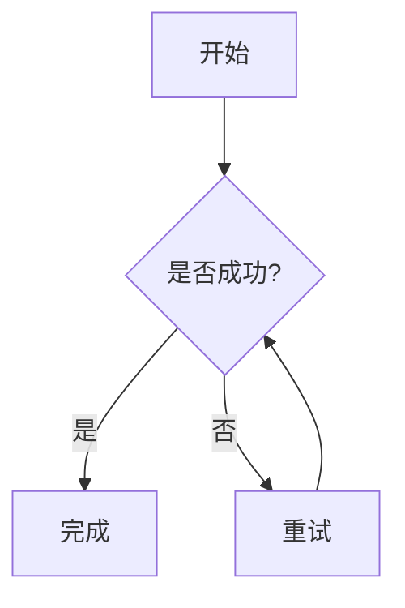
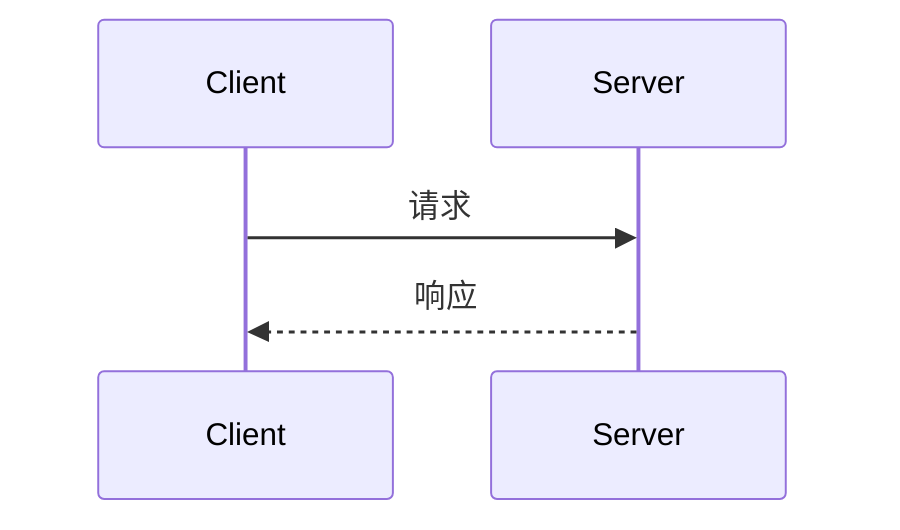
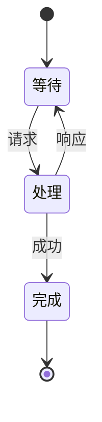

# Mermaid 渲染测试页面

## 简单图表测试

### 1. 流程图

```mermaid
graph TD
    A[开始] --> B{是否成功?}
    B -->|是| C[完成]
    B -->|否| D[重试]
    D --> B
```

### 2. 序列图

```mermaid
sequenceDiagram
    participant Client
    participant Server
    Client->>Server: 请求
    Server-->>Client: 响应
```

### 3. 状态图

```mermaid
stateDiagram-v2
    [*] --> 等待
    等待 --> 处理: 请求
    处理 --> 等待: 响应
    处理 --> 完成: 成功
    完成 --> [*]
```
