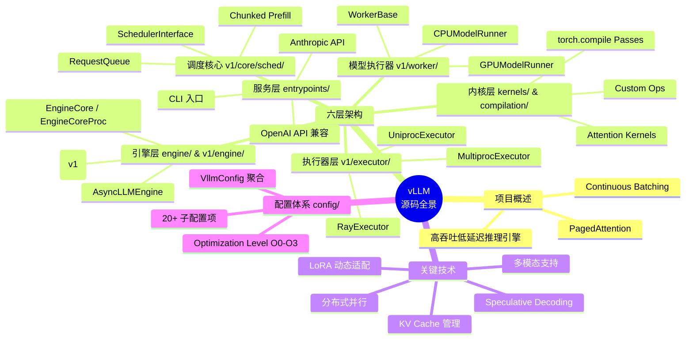
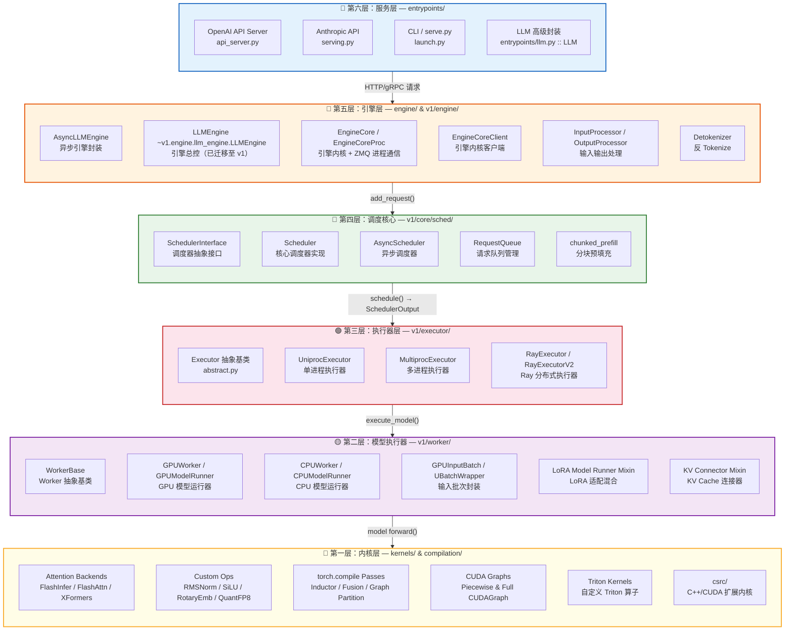
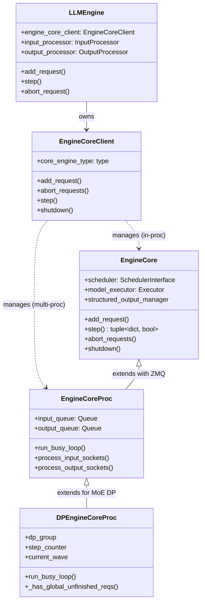

# vLLM 源码结构分析 — 总览导航

> **定位**：本文档是 vLLM 源码分析系列（共 22 篇）的**总览导航入口与宏观概览**，旨在为读者建立对 vLLM 整体架构的全局认知地图。建议首次阅读时按顺序浏览本文档的全部章节，之后可作为快速查阅索引使用。

---

## 📌 全局知识图谱



---

## 一、项目概述

### 1.1 基本信息

| 属性 | 值 |
|------|-----|
| **项目名称** | vLLM |
| **定位** | 高吞吐、内存高效的大语言模型（LLM）推理与服务引擎 |
| **开源协议** | Apache-2.0 |
| **核心口号** | *"a high-throughput and memory-efficient inference engine for LLMs"*（见 [`__init__.py`](file:///workspace/vllm/__init__.py#L3)） |
| **版本管理** | 通过 [`version.py`](file:///workspace/vllm/version.py) → `_version.py` 管理，开发版显示 `dev` |

### 1.2 核心价值主张

vLLM 的核心竞争力源于两项奠基性技术创新：

- **PagedAttention**：将操作系统虚拟内存的分页（Paging）思想引入注意力计算中的 KV Cache 管理。将 KV Cache 按固定大小的 Block 组织，实现非连续内存分配，极大减少内存碎片和浪费。
- **Continuous Batching（连续批处理）**：突破传统静态批处理的限制，在一个迭代步（iteration step）内动态地混排处于不同阶段（prefill / decode）的请求，实现 GPU 利用率的最大化。

### 1.3 生态地位

vLLM 已成为 LLM 推理服务的事实标准之一：
- 提供 **OpenAI 兼容 API** 服务端（[`entrypoints/openai/api_server.py`](file:///workspace/vllm/entrypoints/openai/api_server.py)）
- 支持 **Anthropic 兼容协议**（[`entrypoints/anthropic/`](file:///workspace/vllm/entrypoints/anthropic/)）
- 支持 **200+ 模型架构**（见 [`model_executor/models/`](file:///workspace/vllm/model_executor/models/) 目录下的模型文件）
- 支持 **多模态**（视觉、音频、视频）、**LoRA**、**Speculative Decoding**、**前缀缓存**、**分布式并行**（TP/PP/DP/EP）等企业级特性

---

## 二、整体架构图

vLLM 采用清晰的**六层分层架构**，自上而下依次为：



### 各层职责速查

| 层级 | 核心目录 | 核心职责 | 关键类/模块 |
|------|----------|----------|-------------|
| **L6 服务层** | `entrypoints/` | 对外提供 API 服务、CLI 入口、高级 SDK 封装 | `LLM`, `ApiServer`, `OpenAIServing` |
| **L5 引擎层** | `engine/`, `v1/engine/` | 引擎生命周期管理、请求编排、进程通信 | `LLMEngine`, `EngineCore`, `EngineCoreProc`, `AsyncLLMEngine` |
| **L4 调度核心** | `v1/core/sched/` | 请求排队、策略调度、Chunked Prefill、KV Cache 分配 | `Scheduler`, `SchedulerInterface`, `RequestQueue` |
| **L3 执行器层** | `v1/executor/` | 多进程/多节点分布式执行策略 | `UniprocExecutor`, `MultiprocExecutor`, `RayExecutor` |
| **L2 模型执行器** | `v1/worker/` | 模型加载、前向传播、采样、CUDA Graph 管理 | `GPUModelRunner`, `WorkerBase`, `GPUWorker` |
| **L1 内核层** | `kernels/`, `compilation/`, `csrc/` | 底层算子、注意力后端、编译优化、CUDA/C++ 扩展 | FlashInfer, CustomOps, InductorPasses |

---

## 三、版本演进路线：v0 → v1 迁移策略

### 3.1 迁移背景

vLLM 经历了一次重大的架构重构——从 v0 架构迁移到 **v1 架构**。这次重构的核心目标是：

1. **解耦 Engine Core**：将引擎的核心调度循环（`EngineCore`）从对外接口中分离出来，支持跨进程部署
2. **引入 ZMQ 进程通信**：通过 ZeroMQ 实现 EngineCore 与前端的高效 IPC
3. **支持 Data Parallel（DP）**：原生支持数据并行和弹性扩缩容（Elastic EP）
4. **统一 Async Scheduling**：内置异步调度能力

### 3.2 向后兼容机制

vLLM 在迁移过程中采用了精巧的**向后兼容策略**，确保现有用户代码无需修改即可升级：

#### （1）`LLMEngine` 别名重定向

在 [`engine/llm_engine.py`](file:///workspace/vllm/engine/llm_engine.py) 中，原来的 `LLMEngine` 类已被替换为一个简单的别名重定向：

```python
from vllm.v1.engine.llm_engine import LLMEngine as V1LLMEngine
LLMEngine = V1LLMEngine  # type: ignore
"""The `LLMEngine` class is an alias of [vllm.v1.engine.llm_engine.LLMEngine][]."""
```

这意味着所有 `from vllm import LLMEngine` 的导入都会自动指向 v1 版本。

#### （2）`__getattr__` 延迟导入

在 [`__init__.py`](file:///workspace/vllm/__init__.py#L65-L73) 中，使用了 Python 3.7+ 的 `__getattr__` 延迟导入机制：

```python
def __getattr__(name: str) -> typing.Any:
    from importlib import import_module
    if name in MODULE_ATTRS:
        module_name, attr_name = MODULE_ATTRS[name].split(":")
        module = import_module(module_name, __package__)
        return getattr(module, attr_name)
    else:
        raise AttributeError(f"module {__package__} has no attribute {name}")
```

配合 `MODULE_ATTRS` 字典映射表（[第16-39行](file:///workspace/vllm/__init__.py#L16-L39)），实现了：
- **按需加载**：只有当用户实际访问某个属性时才触发对应模块的导入
- **零成本兼容**：不增加启动时的导入开销
- **统一入口**：`from vllm import LLMEngine, SamplingParams, LLM` 等写法全部生效

#### （3）v1 引擎内部结构

v1 引擎的核心组件关系如下：



### 3.3 v0 vs v1 核心差异

| 维度 | v0 架构 | v1 架构 |
|------|---------|---------|
| **引擎位置** | `engine/llm_engine.py` | `v1/engine/llm_engine.py` + `v1/engine/core.py` |
| **调度器位置** | `core/scheduler.py` | `v1/core/sched/scheduler.py` |
| **进程模型** | 单进程为主 | 支持 Uniproc / Multiproc / Ray / DP |
| **通信方式** | 直接方法调用 | ZMQ IPC（`msgpack` 序列化） |
| **调度模式** | 同步调度 | 支持同步 + 异步调度（Async Scheduling） |
| **KV Cache 管理** | CacheEngine | `v1/core/kv_cache_manager.py` + Hybrid Manager |
| **Speculative Decode** | 内嵌于 Scheduler | `v1/spec_decode/` 独立模块化 |
| **DP 支持** | 不支持 | 原生 Data Parallel + Elastic EP |

---

## 四、目录结构全景图

以下是 `/workspace/vllm` 的主要目录树及其职责说明：

```
vllm/                              # 项目根目录
├── __init__.py                    # 包入口：MODULE_ATTRS + __getattr__ 延迟导入
├── version.py / _version.py       # 版本号管理
├── envs.py                        # 环境变量集中定义
├── env_override.py                # 环境变量覆盖机制
│
├── config/                         # 🔧 配置体系（20+ 子配置聚合）
│   ├── vllm.py                    # VllmConfig：全局配置聚合容器（Pydantic model）
│   ├── model.py                   # ModelConfig：模型名称、架构、dtype、量化
│   ├── cache.py                   # CacheConfig：KV Cache 大小、block_size、prefix caching
│   ├── parallel.py                # ParallelConfig：TP/PP/DP/EP 并行配置
│   ├── scheduler.py               # SchedulerConfig：调度策略、max_num_seqs/tokens
│   ├── device.py                  # DeviceConfig：设备类型（cuda/xpu/cpu）
│   ├── load.py                    # LoadConfig：权重加载格式、下载路径
│   ├── attention.py               # AttentionConfig：注意力后端选择
│   ├── lora.py                    # LoRAConfig：LoRA 适配器配置
│   ├── speculative.py             # SpeculativeConfig：推测解码配置
│   ├── compilation.py             # CompilationConfig：torch.compile + CUDAGraph
│   ├── kernel.py                  # KernelConfig：自定义算子优先级
│   ├── quantization/              # 各量化方案的配置（AWQ/GPTQ/FP8 等）
│   └── ...                        # reasoning/offload/profiler/observability 等
│
├── engine/                         # 🚀 引擎层（v0 兼容入口）
│   ├── llm_engine.py              # LLMEngine → v1 LLMEngine 的别名重定向
│   ├── async_llm_engine.py        # AsyncLLMEngine 异步引擎
│   ├── arg_utils.py               # EngineArgs / AsyncEngineArgs 参数解析
│   └── protocol.py                # 引擎协议定义
│
├── v1/                            # 🆕 V1 架构（当前主力架构）
│   ├── engine/                    # 引擎核心
│   │   ├── llm_engine.py          # LLMEngine：对外总控接口
│   │   ├── core.py                # EngineCore：引擎内核（调度+执行主循环）
│   │   ├── core_client.py         # EngineCoreClient：内核客户端（IPC 代理）
│   │   ├── async_llm.py           # AsyncLLMEngine：异步引擎
│   │   ├── coordinator.py         # DPCoordinator：数据并行协调器
│   │   ├── input_processor.py     # InputProcessor：请求预处理
│   │   ├── output_processor.py    # OutputProcessor：响应后处理
│   │   ├── detokenizer.py         # Detokenizer：流式反 Tokenize
│   │   ├── tensor_ipc.py          # TensorIpcReceiver：张量跨进程传输
│   │   └── utils.py               # 引擎工具类
│   │
│   ├── core/                      # 调度核心
│   │   ├── sched/                 # 调度器
│   │   │   ├── scheduler.py       # Scheduler：FIFO/双调度的核心实现
│   │   │   ├── interface.py       # SchedulerInterface：调度器抽象接口
│   │   │   ├── async_scheduler.py # AsyncScheduler：异步调度器
│   │   │   ├── request_queue.py   # RequestQueue：请求排队与优先级
│   │   │   └── output.py          # SchedulerOutput：调度输出数据结构
│   │   ├── kv_cache_manager.py    # KV Cache 管理器
│   │   ├── kv_cache_coordinator.py# KV Cache 跨节点协调器
│   │   ├── block_pool.py          # Block 内存池管理
│   │   └── encoder_cache_manager.py # 编码器缓存管理
│   │
│   ├── executor/                  # 执行器（分布式策略）
│   │   ├── abstract.py            # Executor：执行器抽象基类
│   │   ├── uniproc_executor.py    # UniprocExecutor：单进程执行器
│   │   ├── multiproc_executor.py  # MultiprocExecutor：多进程执行器
│   │   ├── ray_executor.py        # RayExecutor：Ray 部署执行器
│   │   └── ray_executor_v2.py     # RayExecutorV2：Ray 执行器 v2
│   │
│   ├── worker/                    # 模型执行器（Worker）
│   │   ├── worker_base.py         # WorkerBase：Worker 抽象基类
│   │   ├── gpu_worker.py          # GPUWorker：GPU Worker
│   │   ├── cpu_worker.py          # CPUWorker：CPU Worker
│   │   ├── gpu_model_runner.py    # GPUModelRunner：GPU 模型前向传播
│   │   ├── cpu_model_runner.py    # CPUModelRunner：CPU 模型前向传播
│   │   ├── gpu_input_batch.py     # GPUInputBatch：GPU 输入批次封装
│   │   ├── gpu_ubatch_wrapper.py  # UBatchWrapper：Micro-batch 封装
│   │   ├── ubatching.py           # Micro-batching 调度逻辑
│   │   ├── block_table.py         # Block Table 管理
│   │   ├── workspace.py           # 工作空间（显存分配）
│   │   ├── lora_model_runner_mixin.py   # LoRA 模型适配
│   │   ├── kv_connector_model_runner_mixin.py  # KV 连接器适配
│   │   └── encoder_cudagraph.py   # 编码器 CUDA Graph
│   │
│   ├── spec_decode/               # 推测解码
│   │   ├── eagle.py               # EAGLE 推测解码
│   │   ├── medusa.py              # MEDUSA 推测解码
│   │   ├── ngram_proposer.py      # N-Gram 草稿模型
│   │   ├── draft_model.py         # Draft Model 管理
│   │   └── ...
│   │
│   ├── structured_output/         # 结构化输出
│   │   ├── backend_outlines.py    # Outlines 后端
│   │   ├── backend_lm_format_enforcer.py  # LMFEnforcer 后端
│   │   ├── backend_xgrammar.py    # XGrammar 后端
│   │   └── backend_guidance.py    # Guidance 后端
│   │
│   ├── sample/                    # 采样模块
│   │   ├── sampler.py             # 采样器（softmax/top-k/top-p）
│   │   ├── rejection_sampler.py   # 拒绝采样（Speculative Decode 用）
│   │   └── metadata.py            # 采样元数据
│   │
│   ├── metrics/                   # 可观测性指标
│   │   ├── stats.py               # 统计数据结构
│   │   ├── prometheus.py          # Prometheus 指标导出
│   │   ├── loggers.py             # 日志记录器
│   │   └── perf.py                # 性能计数器
│   │
│   ├── attention/                 # 注意力后端选择
│   │   ├── backend.py             # 后端枚举与选择逻辑
│   │   └── selector.py            # 选择器实现
│   │
│   ├── kv_offload/                # KV Cache 卸载
│   │   └── simple_kv_offload/     # 简单 KV 卸载实现
│   │
│   ├── outputs.py                 # ModelRunnerOutput 等输出数据结构
│   ├── request.py                 # Request / RequestStatus 数据结构
│   ├── kv_cache_interface.py      # KVCacheConfig 接口定义
│   └── cudagraph_dispatcher.py    # CUDA Graph 分发器
│
├── model_executor/                 # 🤖 模型执行框架
│   ├── models/                    # 200+ 模型架构实现
│   │   ├── llama.py               # LLaMA 系列
│   │   ├── deepseek_v2.py         # DeepSeek-V2/V3 (MLA)
│   │   ├── qwen3.py               # Qwen3 系列
│   │   ├── mistral.py             # Mistral 系列
│   │   ├── gpt_neox.py            # GPT-NeoX
│   │   ├── interfaces.py          # 模型接口抽象（ForCausalLM 等）
│   │   ├── interfaces_base.py     # 基础接口定义
│   │   ├── registry.py            # ModelRegistry：模型注册表
│   │   └── ...                    # 其余 170+ 模型文件
│   ├── custom_op.py               # 自定义算子注册与管理
│   ├── parameter.py               # 参数管理（sharding 等）
│   ├── utils.py                   # 模型工具函数
│   └── warmup/                    # 模型预热（kernel warmup）
│
├── multimodal/                     # 🖼️ 多模态支持
│   ├── registry.py                # MultiModalRegistry：多模态注册中心
│   ├── image.py / audio.py / video.py  # 各模态输入处理
│   ├── processing/                # 处理流水线
│   │   ├── processor.py           # 处理器基类
│   │   ├── inputs.py              # 输入数据结构
│   │   └── context.py             # 处理上下文
│   ├── media/                     # 媒体类型定义
│   ├── cache.py                   # 多模态特征缓存
│   └── hasher.py                  # 输入哈希（用于缓存 key）
│
├── lora/                          # 🔗 LoRA 适配器系统
│   ├── lora_model.py              # LoRA 模型管理
│   ├── lora_weights.py            # LoRA 权重管理
│   ├── model_manager.py           # LoRA 模型管理器
│   ├── layers/                    # LoRA 层实现
│   │   ├── base.py                # LoRA 层基类
│   │   ├── column_parallel_linear.py  # 列并行线性层+LoRA
│   │   ├── row_parallel_linear.py     # 行并行线性层+LoRA
│   │   └── fused_moe.py           # MoE + LoRA 融合
│   ├── punica_wrapper/            # Punica GPU 库封装（高效 LoRA 计算）
│   └── request.py                 # LoRARequest 请求数据
│
├── distributed/                   # 🌐 分布式通信
│   ├── parallel_state.py          # 并行状态（TP/PP/DP group 管理）
│   ├── device_communicators/      # 设备通信后端
│   │   ├── base_device_communicator.py  # 通信基类
│   │   ├── cuda_communicator.py         # CUDA 通信（NCCL/PYNCLL）
│   │   ├── custom_all_reduce.py          # 自定义 AllReduce
│   │   ├── flashinfer_all_reduce.py      # FlashInfer AllReduce
│   │   └── all2all.py                     # All2All 通信
│   ├── kv_transfer/               # KV Cache 跨节点传输
│   │   └── kv_connector/          # KV 连接器工厂与实现
│   ├── elastic_ep/                # 弹性并行（Elastic EP）
│   │   ├── elastic_state.py       # 弹性状态机
│   │   └── elastic_execute.py     # 弹性执行逻辑
│   ├── weight_transfer/           # 权重传输（RLHF 训练场景）
│   └── stateless_coordinator.py   # 无状态协调器
│
├── entrypoints/                    # 🌐 服务入口
│   ├── llm.py                     # LLM 类（面向用户的 Python SDK）
│   ├── api_server.py              # API Server 主入口
│   ├── openai/                    # OpenAI 兼容服务
│   │   ├── api_server.py          # OpenAI API Server
│   │   └── cli_args.py            # OpenAI CLI 参数
│   ├── anthropic/                 # Anthropic 兼容服务
│   ├── cli/                       # 命令行入口
│   │   ├── main.py                # vllm 命令入口
│   │   └── serve.py               # vllm serve 命令
│   ├── pooling/                   # Pooling 任务（embedding/classification）
│   └── mcp/                       # MCP (Model Context Protocol) 支持
│
├── compilation/                    # ⚡ 编译优化体系
│   ├── compiler_interface.py      # torch.compile 接口封装
│   ├── backends.py                # 编译后端选择
│   ├── cuda_graph.py              # CUDA Graph 捕获与管理
│   ├── piecewise_backend.py       # Piecewise CUDA Graph 后端
│   ├── base_static_graph.py       # 静态图基础
│   ├── decorators.py              # @support_torch_compile 装饰器
│   ├── counter.py                 # 编译计数器
│   ├── caching.py                 # 编译结果缓存
│   ├── codegen.py                 # 代码生成
│   ├── wrapper.py                 # 编译包装器
│   └── passes/                    # 编译优化 Pass
│       ├── pass_manager.py        # Pass 管理器
│       ├── inductor_pass.py       # Inductor Pass
│       ├── vllm_inductor_pass.py  # vLLM 自定义 Inductor Pass
│       └── fx_utils.py            # FX 图工具
│
├── kernels/                        # 🔺 自定义算子内核
│   ├── __init__.py / vllm_c.c     # C++/CUDA 扩展入口
│   ├── aiter_ops.py               # AITer 算子（ROCm 平台）
│   ├── xpu_ops.py                 # Intel XPU 算子
│   ├── oink_ops.py                # Oink 算子
│   ├── triton/                    # Triton 自定义内核
│   └── helion/                    # Helion 配置
│
├── tokenizers/                     # 📝 Tokenizer 系统
│   ├── hf.py                      # HuggingFace Tokenizer
│   ├── registry.py                # TokenizerRegistry
│   ├── fastokens.py               # FastTokenizer
│   └── ...                        # 特殊 tokenizer（DeepSeek/Grok/Qwen-VL 等）
│
├── renderers/                      # 🎨 输入渲染器（Prompt 构建）
│   ├── base.py                    # 渲染器基类
│   ├── hf.py                      # HuggingFace 渲染器
│   ├── registry.py                # 渲染器注册表
│   ├── deepseek_v32.py            # DeepSeek-V3/V32 特殊渲染
│   └── ...
│
├── reasoning/                      # 🧠 推理（Reasoning）解析
│   ├── abs_reasoning_parsers.py   # 解析器抽象基类
│   ├── deepseek_r1_reasoning_parser.py  # DeepSeek-R1 推理解析
│   └── ...                        # 其他模型的推理解析器
│
├── tool_parsers/                   # 🔧 工具调用（Function Calling）解析
│   ├── abstract_tool_parser.py    # 工具解析器基类
│   ├── openai_tool_parser.py      # OpenAI 格式解析
│   └── ...                        # 各厂商工具调用解析
│
├── platforms/                      # 💻 平台抽象层
│   ├── interface.py               # 平台接口定义
│   ├── cuda.py                    # NVIDIA CUDA 平台
│   ├── rocm.py                    # AMD ROCm 平台
│   ├── xpu.py                     # Intel XPU 平台
│   ├── cpu.py                     # CPU 平台
│   └── tpu.py                     # Google TPU 平台
│
├── transformers_utils/             # 🔄 Transformers 工具
│   ├── config.py                  # HF Config 工具
│   ├── tokenizer.py               # Tokenizer 工具
│   ├── configs/                   # 各模型 HF Config 映射
│   └── processors/                # 图像处理器映射
│
├── inputs/                         # 📥 输入处理
│   ├── __init__.py                # PromptType, TextPrompt, TokensPrompt
│   ├── engine.py                  # EngineInput 数据结构
│   ├── llm.py                     # LLM 输入数据结构
│   └── preprocess.py              # 预处理管道
│
├── outputs/                        # 📤 输出数据结构
│   ├── __init__.py                # RequestOutput, CompletionOutput 等
│   └── ...
│
├── utils/                          # 🛠️ 通用工具库
│   ├── torch_utils.py             # PyTorch 工具
│   ├── mem_utils.py               # 内存管理工具
│   ├── hashing.py                 # 哈希工具（用于 prefix caching）
│   ├── serial_utils.py            # 序列化工具（msgpack）
│   ├── network_utils.py           # 网络/ZMQ 工具
│   ├── profiler.py                # 性能分析工具
│   └── ...
│
├── benchmarks/                     # 📊 性能基准测试
├── profiler/                       # 📈 层级性能分析器
├── tracing/                        # 🔍 OpenTelemetry 集成
├── logging_utils/                  # 日志工具
├── plugins/                        # 插件系统
├── device_allocator/               # 设备内存分配器（CuMem）
├── parser/                         # 输出解析器
├── usage/                          # 使用统计
├── assets/                         # 静态资源
├── third_party/                    # 第三方依赖
├── ir/                            # 中间表示（IR）
└── csrc/                           # C++/CUDA 源码
```

---

## 五、快速导航索引

以下表格链接到本系列的其余 21 个分模块文档，按推荐阅读顺序排列：

| 序号 | 文档名 | 文件路径 | 核心内容 | 建议阅读顺序 |
|:----:|--------|----------|----------|:------------:|
| 01 | 架构总览 | `01_architecture_overview.md` | 六层架构、v0→v1演进、核心数据结构、设计原则 | 第 1 篇 |
| 02 | 配置系统 | `02_config_system.md` | VllmConfig 及 20+ 子配置、环境变量覆盖、OptimizationLevel O0-O3 | 第 2 篇 |
| 03 | 引擎核心 | `03_engine_core.md` | LLMEngine / AsyncLLM / EngineCore / InputProcessor / OutputProcessor | 第 3 篇 |
| 04 | 调度器 | `04_scheduler.md` | Scheduler.schedule() 完整逻辑、Continuous Batching、Chunked Prefill、抢占机制 | 第 4 篇 |
| 05 | PagedAttention | `05_pagedattention.md` | 页式 KV Cache 管理、BlockPool/BlockTable、Copy-on-Write、Prefix Caching | 第 5 篇 |
| 06 | 注意力后端 | `06_attention_backends.md` | FlashAttention / FlashInfer / MLA / Triton / ROCm / CPU 后端选择与实现 | 第 6 篇 |
| 07 | 模型执行器 | `07_model_executor.md` | ModelRegistry（200+ 模型）、模型接口、主要模型家族、Transformer 层组件 | 第 7 篇 |
| 08 | Worker 与执行器 | `08_worker_and_executor.md` | UniProc/MultiProc/Ray Executor、WorkerBase/GPUWorker/GPUModelRunner | 第 8 篇 |
| 09 | KV 缓存系统 | `09_kv_cache.md` | KVCacheManager 层次、Offload/Transfer/Prefix Caching、Block Table 管理 | 第 9 篇 |
| 10 | 采样系统 | `10_sampling.md` | SamplingParams / Sampler 核心 / RejectionSampler / ParallelSampling / Logprobs | 第 10 篇 |
| 11 | 多模态处理 | `11_multimodal.md` | MultiModalRegistry、图像/音频/视频管线、CLIP/SigLIP/Whisper 编码器 | 第 11 篇 |
| 12 | 量化支持 | `12_quantization.md` | FP8 / INT4 / GPTQ / AWQ / GGUF / NVFP4 / Marlin / Machete 量化方案 | 第 12 篇 |
| 13 | 分布式计算 | `13_distributed.md` | TP / PP / DP / EP 并行策略、通信原语、Elastic EP / EPLB | 第 13 篇 |
| 14 | LoRA 系统 | `14_lora.md` | LoRA Layer 实现、Punica Wrapper、动态加载/卸载、Resolver 解析 | 第 14 篇 |
| 15 | API 服务层 | `15_api_layer.md` | OpenAI / Anthropic / gRPC API、Batch Serving、MCP Tool Server、Pooling | 第 15 篇 |
| 16 | CUDA 内核 | `16_cuda_kernels.md` | 注意力/缓存/激活/量化/MoE/通信/采样内核、CPU/ROCm 平台内核 | 第 16 篇 |
| 17 | 编译优化 | `17_compilation_and_optimization.md` | torch.compile / CUDA Graphs (Piecewise+Full) / Inductor Passes / Triton Utils | 第 17 篇 |
| 18 | 结构化输出 | `18_structured_output.md` | xgrammar / outlines / lm-format-enforcer / guidance 四种后端实现 | 第 18 篇 |
| 19 | 推测解码 | `19_speculative_decode.md` | EAGLE / Medusa / N-gram / DFlash / Suffix Decoding / Gemma4 草稿方法 | 第 19 篇 |
| 20 | 监控指标 | `20_metrics_and_monitoring.md` | Prometheus 指标 / 日志系统 / OpenTelemetry / Profiling (Kineto/NVTX) | 第 20 篇 |
| 21 | 设计模式 | `21_design_patterns.md` | 9 种设计模式、可扩展性设计、性能优化策略、竞品对比与未来方向 | 第 21 篇 |

> 💡 **阅读路径建议**：
> - **快速上手路径**：01 → 02 → 07 → 15（了解如何从配置到 API 调用）
> - **深度研究路径**：01 → 03 → 04 → 05 → 06 → 07 → 08 → 12（深入理解核心算法）
> - **工程实践路径**：01 → 07 → 14 → 15 → 18 → 20（关注功能集成与运维）

---

## 六、关键技术特性一览表

| 特性名 | 核心位置 | 原理一句话 | 影响一句话 |
|--------|----------|-----------|-----------|
| **PagedAttention** | `v1/core/block_pool.py`, `v1/core/kv_cache_manager.py` | 将 KV Cache 按固定大小 Block 分页存储，类似 OS 虚拟内存管理 | 将 GPU 显存利用率从 ~20% 提升至 ~90%+，支持更大并发量 |
| **Continuous Batching** | `v1/core/sched/scheduler.py` | 每个 iteration 动态混排 prefill 和 decode 请求，消除 batch 边界等待 | 将 TTFT（首字延迟）和 TPOT（每词延迟）同时优化到极致 |
| **Chunked Prefill** | `v1/core/sched/scheduler.py` | 将长 prompt 拆分为多个 chunk 分批处理，避免长请求阻塞短请求 | 保证短请求的延迟 SLA，提升整体公平性和吞吐 |
| **Prefix Caching** | `v1/core/kv_cache_manager.py` | 对相同前缀的请求复用已计算的 KV Cache Block | 对重复前缀场景（如 system prompt）实现接近零开销 |
| **CUDA Graphs** | `compilation/cuda_graph.py`, `v1/cudagraph_dispatcher.py` | 捕获 kernel 执行图为可重放对象，消除 Python/CUDA launch 开销 | decode 阶段延迟降低 50%+，高吞吐场景收益显著 |
| **torch.compile** | `compilation/compiler_interface.py`, `compilation/passes/` | 通过 TorchDynamo + Inductor 对模型进行 JIT 编译和算子融合 | 减少 kernel launch 次数和内存 I/O，融合 Norm/Act/Quant 算子 |
| **Speculative Decoding** | `v1/spec_decode/` | 用小草案模型（draft model）生成候选 token，大目标模型并行验证 | 在保持完全一致性的前提下，加速 2-4 倍 |
| **LoRA 动态适配** | `lora/` | 运行时动态注入/卸载 LoRA 适配器权重，共享基础模型 | 单实例服务数百个微调模型，大幅降低部署成本 |
| **Attention Backend 选择** | `v1/attention/backend.py`, `selector.py` | 根据 GPU 架构和模型特性自动选择最优注意力后端 | 自动适配 FlashInfer/FlashAttention/XFormers 等 |
| **异步调度（Async Scheduling）** | `v1/core/sched/async_scheduler.py` | 将采样操作与模型前向传播解耦，重叠执行 | 减少每个 iteration 的气泡，提升 GPU 利用率 |
| **Data Parallel (DP)** | `v1/engine/core.py` (DPEngineCoreProc), `distributed/` | 多副本间通过 all-reduce 协调请求波次（wave），MoE 场景下路由专家 | 线性扩展吞吐量，支持弹性扩缩容 |
| **Pipeline Parallelism (PP)** | `v1/worker/worker_base.py`, `sequence.py` (IntermediateTensors) | 将模型层切分到多个 GPU，阶段间通过 IntermediateTensors 传递 | 支持超大模型（70B+）在有限 GPU 上部署 |
| **Tensor Parallelism (TP)** | `model_executor/`, `distributed/device_communicators/` | 将单层矩阵运算切分到多卡，通过 AllReduce 同步 | 减少单卡显存需求，几乎无损的线性加速 |
| **KV Cache Offload** | `v1/kv_offload/`, `config/kv_transfer.py` | 将不活跃序列的 KV Cache 卸载到 CPU 或远端内存 | 支持超长上下文和超大并发，降低 GPU 显存压力 |
| **Multi-Modal Support** | `multimodal/` | 统一的输入处理 pipeline，将图像/音频/视频编码为特征向量注入模型 | 一个引擎同时服务文本和多模态任务 |
| **Structured Output** | `v1/structured_output/` | 通过 grammar bitmask 约束采样过程，保证输出符合 JSON Schema | 实现可靠的工具调用和结构化数据提取 |
| **Elastic EP (弹性并行)** | `distributed/elastic_ep/` | 运行时动态增减 DP 副本数，无状态协调器管理扩缩容 | 根据负载自动调整资源，云原生场景下降本增效 |
| **Optimization Levels (-O0~-O3)** | `config/vllm.py` (OPTIMIZATION_LEVEL_*) | 四级预设优化级别，控制编译/CUDAGraph/fusion 的组合 | 用户可在启动速度和推理性能间灵活权衡 |
| **Hybrid KV Cache Manager** | `v1/core/kv_cache_coordinator.py` | 同时管理 full-attention 和 sliding-window/Mamba 类型 cache | 统一管理混合注意力模型（如 Jamba、Hybrid-Transformer-Mamba） |

---

## 七、数据流总览

以下 Mermaid 图展示了一个 HTTP 请求从接收到返回响应的完整数据流：

```mermaid
flowchart LR
    subgraph Client["客户端"]
        R1["HTTP POST<br/>/v1/completions<br/>或 /v1/chat/completions"]
    end

    subgraph L6_Entry["服务层 entrypoints/openai/"]
        R2["OpenAIServing<br/>路由分发"]
        R3["请求校验 &<br/>参数解析"]
        R4["构建 RequestOutput<br/>回调 Future"]
    end

    subgraph L5_Engine["引擎层 v1/engine/"]
        R5["LLMEngine.add_request()<br/>→ EngineCoreClient.add_request()"]
        R6["InputProcessor.preprocess()<br/>Tokenize + Multimodal Encode"]
        R7["EngineCore.step()<br/>调度循环"]
    end

    subgraph L4_Sched["调度核心 v1/core/sched/"]
        R8["Scheduler.schedule()<br/>ChunkedPrefill 策略"]
        R9["Block 分配 &<br/>Copy-on-Write"]
        R10["构建 SchedulerOutput<br/>→ scheduled_chunks"]
    end

    subgraph L3_Exec["执行器层 v1/executor/"]
        R11["Executor.execute_model()<br/>序列化 & 发送"]
    end

    subgraph L2_Worker["模型执行器 v1/worker/"]
        R12["GPUModelRunner.execute_model()<br/>输入组装"]
        R13["模型 Forward<br/>Attention + FFN + ..."]
        R14["Sampling<br/>softmax → top-k/p → sample"]
        R15["返回 ModelRunnerOutput<br/>hidden_states + logits"]
    end

    subgraph L1_Kernel["内核层 kernels/ + compilation/"]
        R16["FlashInfer Attention<br/>+ CustomOps<br/>+ CUDA Graph"]
    end

    subgraph ResponsePath["响应回传路径"]
        R17["scheduler.update_from_output()<br/>更新 KV Cache / 生成 token"]
        R18["OutputProcessor.process()<br/>组装输出"]
        R19["Detokenizer.detokenize()<br/>token ID → 文本"]
        R20["流式 SSE / 非流式 JSON<br/>返回给客户端"]
    end

    Client -->|"① HTTP Request"| L6_Entry
    L6_Entry --> R2 --> R3 --> R4
    R4 -->|"② add_request()"| L5_Engine
    R5 --> R6
    R6 -->|"③ EngineCoreRequest (ZMQ/msgpack)"| R7
    R7 -->|"④ schedule()"| L4_Sched
    R8 --> R9 --> R10
    R10 -->|"⑤ SchedulerOutput"| L3_Exec
    R11 -->|"⑥ execute_model()"| L2_Worker
    R12 --> R13 --> R14 --> R15
    R13 -->|"⑦ kernel launch"| L1_Kernel
    R15 -->|"⑧ ModelRunnerOutput"| L4_Sched
    L4_Sched -->|"⑨ EngineCoreOutputs"| L5_Engine
    L5_Engine --> ResponsePath
    R17 --> R18 --> R19 --> R20
    R20 -->|"⑩ HTTP Response"| Client

    style Client fill:#e3f2fd,stroke:#1565c0
    style L6_Entry fill:#fff3e0,stroke:#e65100
    style L5_Engine fill:#fce4ec,stroke:#c62828
    style L4_Sched fill:#e8f5e9,stroke:#2e7d32
    style L3_Exec fill:#f3e5f5,stroke:#7b1fa2
    style L2_Worker fill:#fffde7,stroke:#f9a825
    style L1_Kernel fill:#ffebee,stroke:#d32f2f
    style ResponsePath fill:#e0f2f1,stroke:#00796b
```



### 关键数据结构流转

```
用户输入 (prompt/text)
    ↓ InputProcessor.preprocess()
EngineCoreRequest (request_id, prompt_token_ids, mm_features, sampling_params, ...)
    ↓ EngineCore.add_request()
Request (internal, with block_hashes, grammar_state, ...)
    ↓ Scheduler.schedule()
SchedulerOutput (num_scheduled_tokens, scheduled_chunks, ...)
    ↓ Executor.execute_model() → GPUModelRunner.execute_model()
ModelRunnerOutput (logits, hidden_states, sampled_token_ids, ...)
    ↓ Scheduler.update_from_output()
EngineCoreOutputs (outputs per request, finished_requests, ...)
    ↓ OutputProcessor.process()
CompletionOutput / RequestOutput (text, token_ids, logprobs, finish_reason, ...)
    ↓ Detokenizer + SSE/JSON encode
HTTP Response (流式/非流式)
```

---

## 八、设计哲学总结

### 8.1 配置驱动（Configuration-Driven）

**核心理念**：所有行为通过配置对象驱动，避免硬编码散落各处。

vLLM 的 [`VllmConfig`](file:///workspace/vllm/config/vllm.py#L269-L269) 是一个 Pydantic model，聚合了 **20+ 子配置项**（`ModelConfig`, `CacheConfig`, `ParallelConfig`, `SchedulerConfig`, `CompilationConfig` 等）。每个子配置负责一个维度的决策：

- **为什么这样做**：配置集中使得：
  - 新增特性只需新增配置字段，无需修改核心逻辑
  - 配置间的交叉验证集中在 `__post_init__` 中（[`VllmConfig.__post_init__`](file:///workspace/vllm/config/vllm.py#L758-L758) 有 **500+ 行**验证逻辑）
  - `compute_hash()` 方法基于配置自动计算唯一哈希，用于编译缓存失效判定
  - 四级优化级别（O0-O3）通过 `OPTIMIZATION_LEVEL_TO_CONFIG` 字典一键切换全部编译选项

### 8.2 注册表模式（Registry Pattern）

**核心理念**：通过全局注册表实现可扩展的组件发现与绑定。

vLLM 中广泛使用的注册表包括：

| 注册表 | 位置 | 用途 |
|--------|------|------|
| `ModelRegistry` | [`model_executor/models/registry.py`](file:///workspace/vllm/model_executor/models/registry.py) | 模型架构 → 实现类的映射 |
| `MultiModalRegistry` | [`multimodal/registry.py`](file:///workspace/vllm/multimodal/registry.py) | 模态类型 → 处理器的映射 |
| `TokenizerRegistry` | [`tokenizers/registry.py`](file:///workspace/vllm/tokenizers/registry.py) | 模型 → Tokenizer 实现的映射 |
| `RendererRegistry` | [`renderers/registry.py`](file:///workspace/vllm/renderers/registry.py) | 模型 → Prompt 渲染器的映射 |
| `StatLoggerFactory` | [`v1/metrics/loggers.py`](file:///workspace/vllm/v1/metrics/loggers.py) | 日志类型 → Logger 实现的映射 |
| `Scheduler` 选择 | [`config/scheduler.py`](file:///workspace/vllm/config/scheduler.py) | 配置 → 调度器实现类的映射 |
| `Executor` 选择 | [`v1/executor/abstract.py`](file:///workspace/vllm/v1/executor/abstract.py) | backend 名称 → 执行器实现类的映射 |

**为什么这样做**：第三方开发者可以通过装饰器 `@register_xxx("name")` 注册新组件，**零修改核心代码**即可扩展 vLLM 支持新的模型架构/模态/平台。

### 8.3 策略模式（Strategy Pattern）

**核心理念**：将算法族封装为可互换的策略对象。

典型应用：

- **Attention Backend**：[`v1/attention/backend.py`](file:///workspace/vllm/v1/attention/backend.py) 定义了多种注意力后端（FlashInfer, FlashAttention, RoCmFlashAttn, XFormers 等），根据设备能力和模型需求在运行时选择。
- **Executor Backend**：[`v1/executor/`](file:///workspace/vllm/v1/executor/) 中 `UniprocExecutor` / `MultiprocExecutor` / `RayExecutor` 互为策略变体，通过 `Executor.get_class(vllm_config)` 工厂方法选择。
- **KV Cache Manager**：不同类型的模型（full-attn / sliding-window / Mamba / hybrid）使用不同的 KV Cache 管理策略。
- **Speculative Decode**：[`v1/spec_decode/`](file:///workspace/vllm/v1/spec_decode/) 下 EAGLE / Medusa / N-Gram 等不同推测策略共享统一的验证接口。

**为什么这样做**：策略可以在运行时切换（甚至通过配置热更新），便于 A/B 测试和渐进式优化。

### 8.4 关注点分离（Separation of Concerns）

**核心理念**：EngineCore（调度+执行循环）与 EngineCoreClient（IPC 代理）的解耦。

v1 架构最显著的设计决策是将 [`EngineCore`](file:///workspace/vllm/v1/engine/core.py#L91-L91) 作为纯计算内核：
- 它不知道自己运行在哪个进程中（同进程 / 子进程 / Ray Actor）
- 它只通过 `SchedulerInterface` 和 `Executor` 抽象交互
- 进程通信（ZMQ socket / Ray call）由 [`EngineCoreProc`](file:///workspace/vllm/v1/engine/core.py#L806-L806) 包装层处理

**为什么这样做**：
- 同一套调度逻辑可以复用在单机、多机、Ray 集群等多种部署模式
- 单元测试可以直接构造 `EngineCore` 进行测试，无需模拟网络
- 未来可以替换 IPC 机制（如改为 gRPC）而不影响核心逻辑

### 8.5 异步优先（Async-First）

**核心理念**：默认启用异步调度，最大化 GPU 利用率。

v1 引入了 **Async Scheduling**（[`config/scheduler.py`](file:///workspace/vllm/config/scheduler.py) 中的 `async_scheduling` 配置项），其核心思想是：
- 将采样（sampling）操作从模型前向传播的关键路径中解耦
- 在模型执行当前 batch 时，调度器同时准备下一个 batch
- 通过 `Future` 对象协调两个并发的操作

**为什么这样做**：传统同步调度在每个 iteration 中存在「调度 → 执行 → 采样 → 更新」的串行瓶颈，异步调度将这些步骤部分重叠，减少了 GPU 空闲时间。

### 8.6 渐进式复杂度（Progressive Complexity）

**核心理念**：提供从简单到复杂的多种优化级别。

vLLM 的 `-O` 优化级别（[`config/vllm.py`](file:///workspace/vllm/config/vllm.py#L175-L258)）体现了这一哲学：

| 级别 | 编译 | CUDAGraph | Fusion | 适用场景 |
|------|------|-----------|--------|----------|
| **-O0** | 关闭 | NONE | 无 | 最快启动、调试 |
| **-O1** | Dynamo+Inductor | Piecewise | Norm/Act | 快速启动 + 基础加速 |
| **-O2** | 全量编译 | Full+Piecewise | 全部融合（含 SP/AllReduce） | 默认选项、平衡性能 |
| **-O3** | 全量编译 | Full+Piecewise | 全部融合 + FlashInfer autotune | 最大性能、可接受较长启动时间 |

**为什么这样做**：用户可以根据自己的延迟/启动时间偏好灵活选择，而不需要理解底层每一个优化开关。

### 8.7 平台抽象（Platform Abstraction）

**核心理念**：通过 `Platform` 接口屏蔽硬件差异。

[`platforms/`](file:///workspace/vllm/platforms/) 目录定义了统一的平台接口（`current_platform`），各平台（CUDA / ROCm / XPU / TPU / CPU）实现各自的：
- 设备能力查询（`get_device_capability()`）
- 注意力后端选择
- 自定义算子注册
- 内存分配策略
- 编译配置调整（`apply_config_platform_defaults()`）

**为什么这样做**：确保 vLLM 的核心算法代码与硬件无关，新增硬件支持只需实现 Platform 接口。

---

## 附录：关键文件速查

| 文件 | 角色 | 一句话说明 |
|------|------|-----------|
| [`__init__.py`](file:///workspace/vllm/__init__.py) | 包入口 | MODULE_ATTRS + `__getattr__` 延迟导入，向后兼容的枢纽 |
| [`engine/llm_engine.py`](file:///workspace/vllm/engine/llm_engine.py) | 兼容层 | `LLMEngine = V1LLMEngine` 别名重定向，v0→v1 迁移的见证 |
| [`v1/engine/core.py`](file:///workspace/vllm/v1/engine/core.py) | 引擎内核 | `EngineCore` / `EngineCoreProc` / `DPEngineCoreProc`，调度+执行主循环 |
| [`v1/engine/llm_engine.py`](file:///workspace/vllm/v1/engine/llm_engine.py) | 引擎总控 | `LLMEngine` v1 版本，管理 EngineCoreClient + IO Processor |
| [`config/vllm.py`](file:///workspace/vllm/config/vllm.py) | 配置中枢 | `VllmConfig` 聚合 20+ 子配置，500+ 行验证逻辑 |
| [`v1/core/sched/scheduler.py`](file:///workspace/vllm/v1/core/sched/scheduler.py) | 调度器 | Chunked Prefill / 双调度 / 请求排队核心实现 |
| [`v1/worker/gpu_model_runner.py`](file:///workspace/vllm/v1/worker/gpu_model_runner.py) | 模型运行器 | 模型前向传播、CUDA Graph 执行、采样触发 |
| [`v1/executor/abstract.py`](file:///workspace/vllm/v1/executor/abstract.py) | 执行器基类 | Executor 抽象接口，定义 execute_model/shutdown 等契约 |
| [`model_executor/models/registry.py`](file:///workspace/vllm/model_executor/models/registry.py) | 模型注册表 | `@ModelRouter.register("name")` 装饰器的定义 |
| [`entrypoints/llm.py`](file:///workspace/vllm/entrypoints/llm.py) | 高级 SDK | `LLM` 类，面向最终用户的 Python API |
| [`sequence.py`](file:///workspace/vllm/sequence.py) | 数据结构 | `IntermediateTensors` 用于 Pipeline Parallel 阶段间数据传递 |
| [`compilation/cuda_graph.py`](file:///workspace/vllm/compilation/cuda_graph.py) | CUDA Graph | CUDA Graph 捕获、缓存、分派的核心逻辑 |
