# vLLM 使用文档详细解读与可视化图表讲解

本文档基于 vLLM 官方文档（`docs/` 目录），通过可视化图表深入讲解 vLLM 的架构、核心概念、功能特性、部署方式和使用方法。

---

# 第一章 文档总览与导航结构

## 1.1 文档导航全景图

vLLM 文档按照用户角色和使用场景进行组织，主要分为用户指南、开发者指南、基准测试、API 参考和社区五大板块。以下思维导图展示了完整的导航结构：

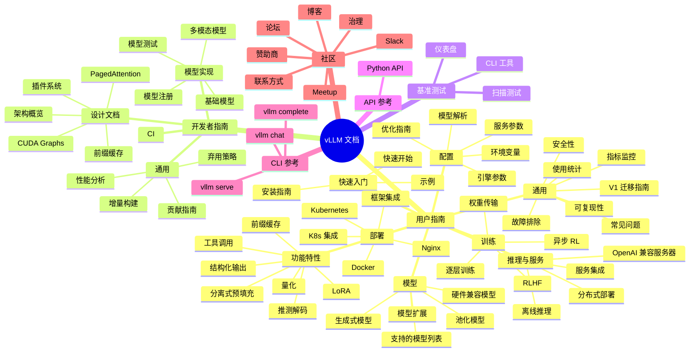

## 1.2 按用户角色的导航路径

vLLM 文档根据用户角色提供了不同的推荐入口：

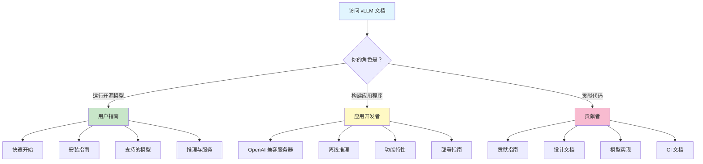

### 快速安装

```bash
# 推荐使用 uv（快速 Python 环境管理器）
uv venv --python 3.12 --seed
source .venv/bin/activate
uv pip install vllm --torch-backend=auto

# 或使用 conda
conda create -n myenv python=3.12 -y
conda activate myenv
pip install --upgrade uv
uv pip install vllm --torch-backend=auto
```

> **注意**：vLLM 支持 NVIDIA CUDA、AMD ROCm、Google TPU 等多种硬件平台，安装方式略有不同，详见安装指南。

---

# 第二章 架构总览（Architecture Overview）

## 2.1 V1 多进程架构

vLLM V1 采用多进程架构来分离关注点并最大化吞吐量。理解这一架构对于正确配置 CPU 资源至关重要。系统包含以下核心进程：

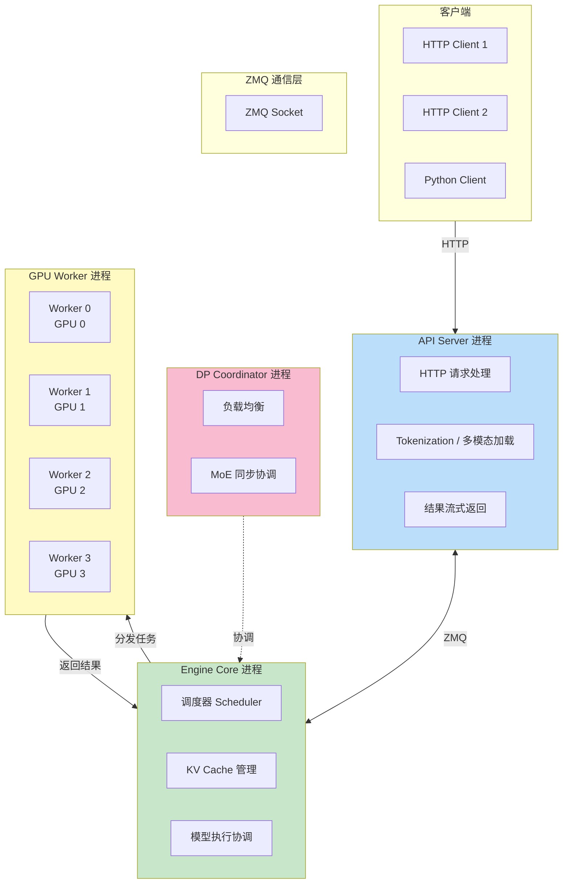

### 进程类型与数量

| 进程类型 | 数量 | 说明 |
|---------|------|------|
| API Server | `A`（默认 `DP`） | 处理 HTTP 请求和输入处理 |
| Engine Core | `DP`（默认 1） | 调度器和 KV Cache 管理 |
| GPU Worker | `N`（= `DP × PP × TP`） | 每个 GPU 一个，执行模型前向传播 |
| DP Coordinator | 1（仅当 `DP > 1`） | 跨 DP 秩的负载均衡 |
| **总计** | **`A + DP + N`（+1 if DP>1）** | |

### 部署示例

**单节点 4 GPU（TP=4）**：1 API Server + 1 Engine Core + 4 GPU Workers = **6 个进程**

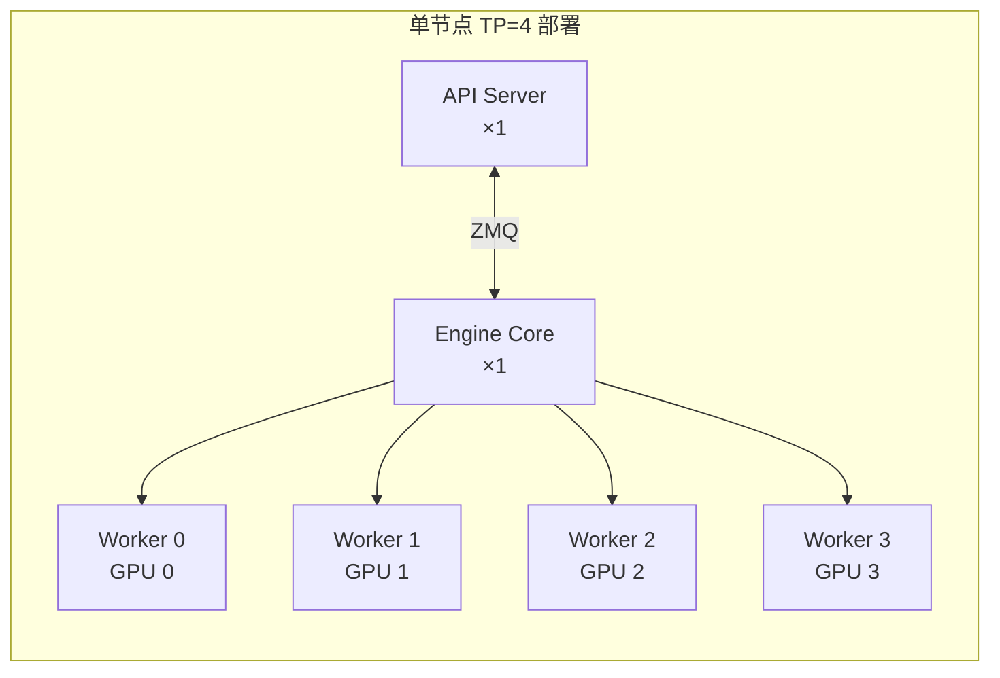

**8 GPU 数据并行（TP=2, DP=4）**：4 API Servers + 4 Engine Cores + 8 GPU Workers + 1 DP Coordinator = **17 个进程**

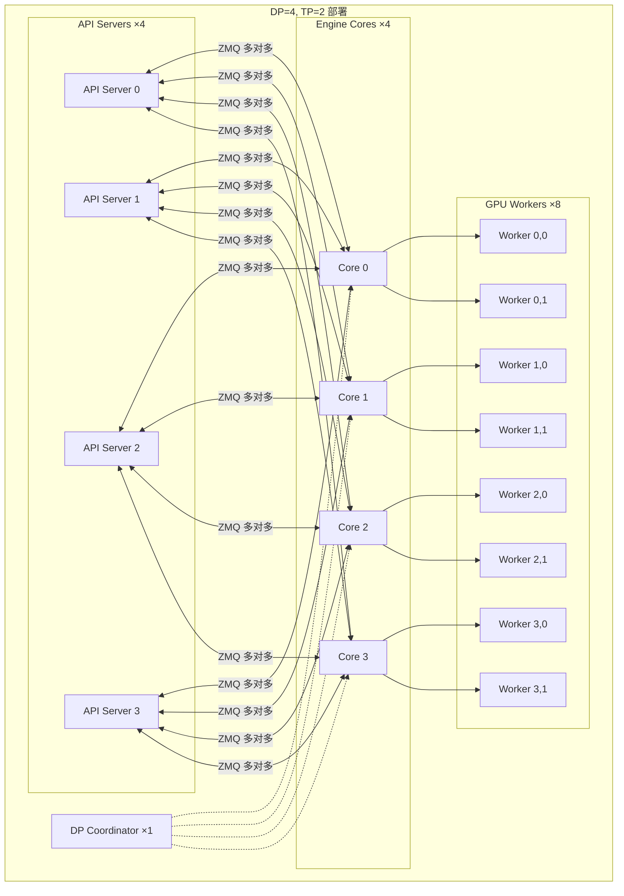

## 2.2 入口点关系

vLLM 提供了多种入口点与系统交互：

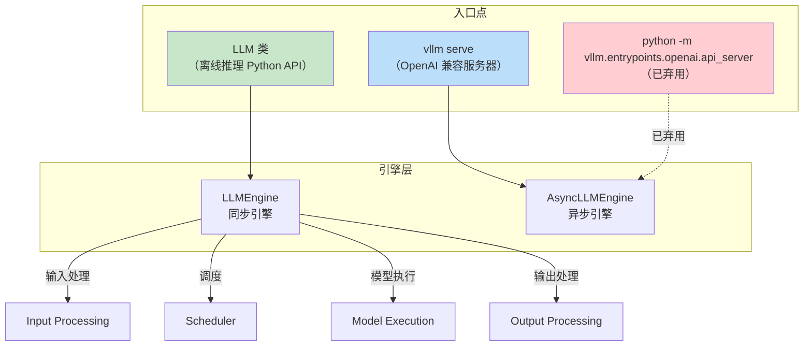

### LLM 类（离线推理）

```python
from vllm import LLM, SamplingParams

prompts = ["Hello, my name is", "The capital of France is"]
sampling_params = SamplingParams(temperature=0.8, top_p=0.95)

llm = LLM(model="facebook/opt-125m")
outputs = llm.generate(prompts, sampling_params)

for output in outputs:
    print(f"Prompt: {output.prompt!r}, Generated: {output.outputs[0].text!r}")
```

### vllm serve（在线服务）

```bash
vllm serve Qwen/Qwen2.5-1.5B-Instruct
```

> **注意**：`python -m vllm.entrypoints.openai.api_server` 已弃用，请使用 `vllm serve` 替代。

## 2.3 类层次结构

vLLM 的类层次结构遵循以下设计原则：

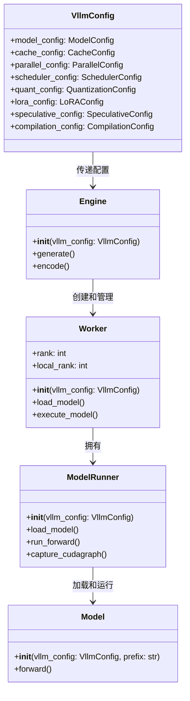

### 三大设计选择

1. **可扩展性**：`VllmConfig` 作为全局状态对象传递给所有类。添加新功能时只需在 `VllmConfig` 中增加配置项，无需修改 Engine、Worker、Model 的构造函数。

2. **统一性**：所有模型使用统一的构造函数签名：
   ```python
   def __init__(self, *, vllm_config: VllmConfig, prefix: str = ""):
   ```
   这使得 ModelRunner 无需知道具体模型类型即可创建和初始化模型。

3. **初始化时分片与量化**：权重分片和量化在模型初始化时完成，而非初始化后。例如运行 405B 模型（约 810GB 权重）在 16 个 H100 80GB GPU 上：
   - ❌ 初始化后分片：每个 GPU 需加载完整 810GB → 巨大内存开销
   - ✅ 初始化时分片：每层只创建所需分片 → 每个 GPU 仅约 50GB

---

# 第三章 PagedAttention 核心机制

## 3.1 传统连续内存 vs 分页内存管理

PagedAttention 是 vLLM 的核心创新，灵感来自操作系统的虚拟内存分页机制：

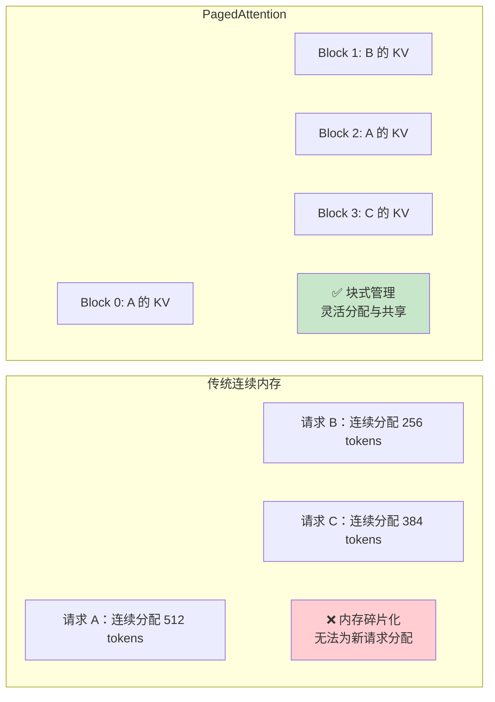

**核心优势**：
- **消除内存碎片**：KV Cache 以固定大小的块存储，无需连续内存
- **支持内存共享**：不同请求可共享相同的 KV Cache 块（如系统提示词）
- **动态内存分配**：按需分配和释放块，提高 GPU 内存利用率

## 3.2 KV Cache 分块存储

KV Cache 在 GPU 内存中以分块方式存储：

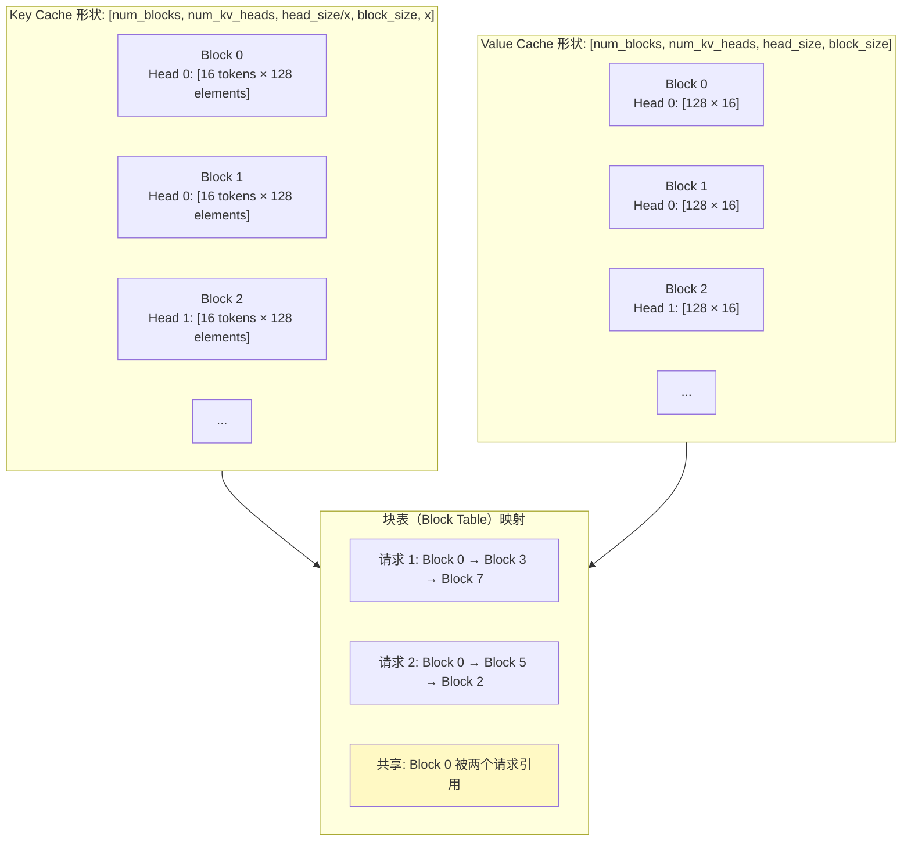

**关键参数**：
- `BLOCK_SIZE`：每个块存储的 token 数量（通常为 16）
- `HEAD_SIZE`：每个注意力头的维度（通常为 128）
- `num_blocks`：KV Cache 总块数，取决于 GPU 可用内存
- `x`：每个线程组处理的元素数

## 3.3 Q/K/V 计算流程

PagedAttention 内核的计算流程如下：

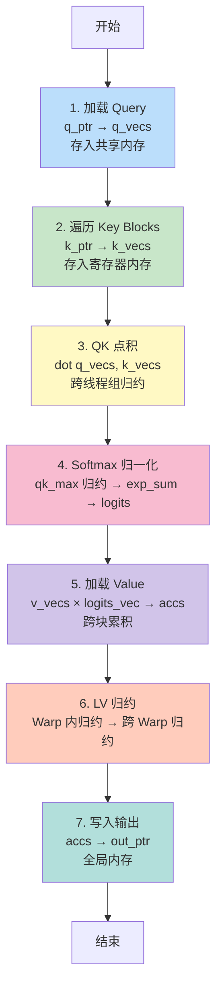

### 各步骤详解

**步骤 1 - Query 加载**：
- 每个线程组从全局内存读取一个 Query token 数据到共享内存
- `q_vecs` 存储在共享内存，因为会被多个线程多次访问
- 相邻线程读取相邻内存，实现内存合并访问

**步骤 2 - Key 遍历**：
- 每个线程组在多次迭代中处理多个 Key token
- 每个 Warp 处理一个完整 Block 的 Key token
- `k_vecs` 存储在寄存器内存（只被一个线程访问一次）

**步骤 3 - QK 点积**：
- 对 `q_vecs` 和 `k_vecs` 执行点积运算
- 跨线程组归约得到完整的 QK 结果（而非部分结果）

**步骤 4 - Softmax 归一化**：
- 先在 Warp 内归约得到 `qk_max`
- 再跨 Warp 归约得到全局 `qk_max`
- 计算 `exp(qk - qk_max)` 和 `exp_sum`
- 最终 `logits[i] *= inv_sum` 完成归约

**步骤 5 - Value 加权**：
- 每个线程读取 `V_VEC_SIZE` 个 Value 元素
- 与对应的 `logits_vec` 做点积
- 结果累积在 `accs` 数组中

**步骤 6 - LV 归约**：
- Warp 内归约：每个线程累积一个 Block 的结果
- 跨 Warp 归约：通过共享内存交换中间结果

**步骤 7 - 输出写入**：
- 将累积结果从寄存器写入全局内存

## 3.4 关键概念解释

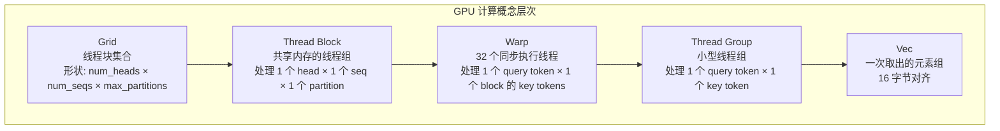

| 概念 | 大小 | 职责 |
|------|------|------|
| **Sequence** | — | 代表一个客户端请求 |
| **Context** | — | 序列中已生成的 token 集合 |
| **Vec** | 16 字节对齐 | 一次取出和计算的元素组 |
| **Thread Group** | `THREAD_GROUP_SIZE`（通常 2） | 处理一个 Q token 和一个 K token |
| **Block** | `BLOCK_SIZE`（通常 16） | KV Cache 的基本存储单元，存储一个 head 的 BLOCK_SIZE 个 token |
| **Warp** | 32 线程 | 处理一个 Q token 与一个 Block 的 K token 的计算 |
| **Thread Block** | `NUM_THREADS` | 处理一个 Q token 与整个 Context 的计算 |
| **Grid** | `(num_heads, num_seqs, max_partitions)` | 定义所有线程块的集合 |

> **注意**：此文档基于 vLLM 原始论文中的 PagedAttention 内核描述。当前 vLLM 已使用多种优化的注意力后端（FlashAttention、FlashInfer、FlashMLA 等），但分页 KV Cache 的核心思想保持不变。


---

# 第四章 前缀缓存（Prefix Caching / Automatic Prefix Caching）

## 4.1 核心思想

前缀缓存（Prefix Caching，也称 Automatic Prefix Caching / APC）是 LLM 推理中一种重要的优化手段。其核心思想是：**缓存已处理请求的 KV-cache 块，当新请求与已缓存请求共享相同前缀时，直接复用这些 KV-cache 块，避免重复计算。**

由于前缀缓存几乎是"免费的午餐"——不会改变模型输出，且能显著降低延迟、提升吞吐量——它已被 OpenAI、Anthropic 等公共端点以及 SGLang 等开源推理框架广泛采用。

### 哈希链机制

vLLM 采用基于哈希（hash-based）的方法实现前缀缓存。每个 KV-cache 块的哈希值由以下分量决定：

- **父块哈希值（Parent hash value）**：父块的哈希值，构成链式依赖
- **块内词元（Block tokens）**：该块中包含的词元元组，用于降低哈希碰撞概率
- **额外哈希（Extra hashes）**：其他使块唯一标识所需的值，如 LoRA ID、多模态输入哈希、缓存盐值（cache_salt）等

这种链式哈希设计确保：只有前缀完全一致时，哈希值才会匹配，从而保证缓存复用的正确性。

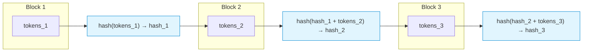

> **注意**：vLLM 仅缓存**已满的块**（full blocks），部分填充的块不会被缓存。

> **哈希算法**：自 v0.11 起，默认使用 `sha256` 算法，解决了之前版本的碰撞风险。可通过 `--prefix-caching-hash-algo` 控制哈希算法：
> - `sha256`（默认）：使用 Python `pickle` 序列化，跨版本可能不兼容
> - `sha256_cbor`：使用 `cbor2` 序列化，跨语言兼容、可复现
> - `xxhash`：使用 `xxHash`（128位）快速非加密哈希，需安装 `xxhash` 包
> - `xxhash_cbor`：CBOR 序列化 + xxHash，兼顾可复现性与速度

## 4.2 数据结构

### KVCacheBlock 类

前缀缓存的核心数据结构是 `KVCacheBlock`，定义在 [kv_cache_utils.py](file:///workspace/vllm/v1/core/kv_cache_utils.py#L113) 中：

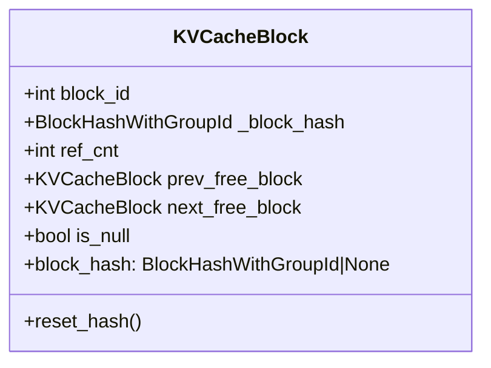

```python
@dataclass(slots=True)
class KVCacheBlock:
    block_id: int
    ref_cnt: int = 0
    _block_hash: BlockHashWithGroupId | None = None
    prev_free_block: "KVCacheBlock | None" = None
    next_free_block: "KVCacheBlock | None" = None
    is_null: bool = False
```

两个关键设计要点：

1. **预分配所有 KVCacheBlock**：初始化 KV cache 管理器时一次性创建所有块对象，避免 Python 对象创建开销，且便于随时追踪所有块的状态。
2. **内嵌双向链表指针**：直接在 `KVCacheBlock` 中维护 `prev_free_block` 和 `next_free_block`，无需额外引入 `deque` 等容器，实现了 O(1) 的中间元素移动操作。

### 四大组件关系

KV cache 管理器初始化后，包含以下四个核心组件：

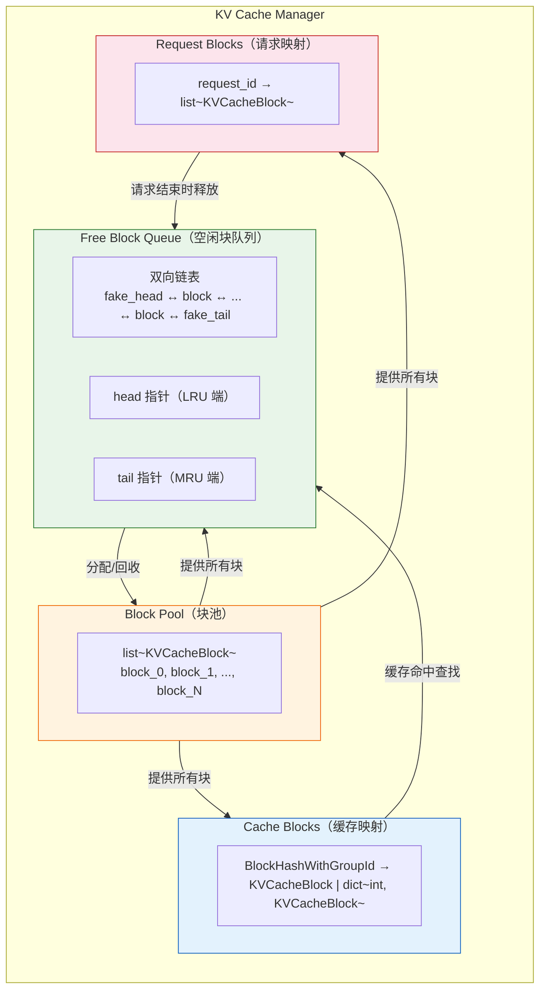

- **Block Pool**：所有 `KVCacheBlock` 的列表，初始化时一次性创建
- **Free Block Queue**：双向链表，仅存储 head 和 tail 指针，按 LRU 顺序排列空闲块
- **Cache Blocks**：从哈希键到块 ID 的映射，用于缓存命中查找
- **Request Blocks**：从请求 ID 到已分配块 ID 的映射，用于追踪每个请求的块

### FreeKVCacheBlockQueue

空闲块队列（[kv_cache_utils.py](file:///workspace/vllm/v1/core/kv_cache_utils.py#L162)）使用虚拟头尾节点简化链表操作：

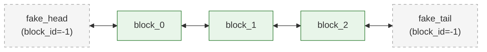

队列排序规则：
1. **LRU 块在队头**：最近最少使用的块最先被驱逐
2. **同请求块逆序排列**：同一请求释放的块按逆序（尾部块在前），因为尾部块哈希了更多词元，被其他请求复用的可能性更低

## 4.3 Block 操作流程

### 新请求分配

当调度器调度一个新请求时，块分配流程如下：

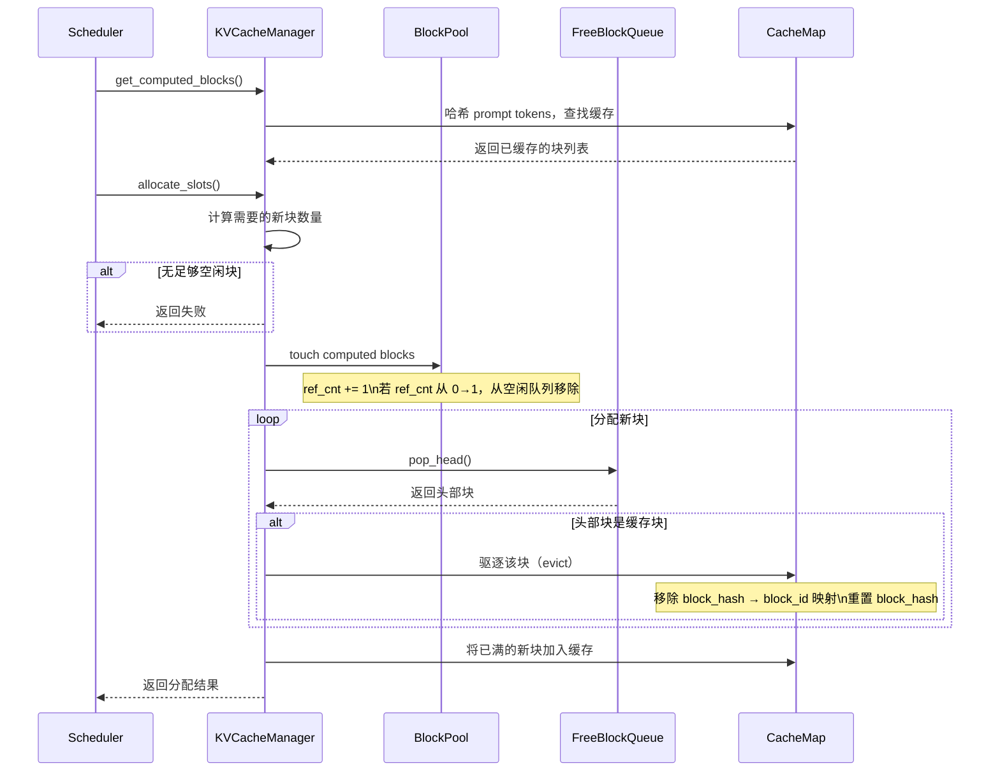

### 运行请求分配

对于正在运行（生成中）的请求，块分配流程更简单：

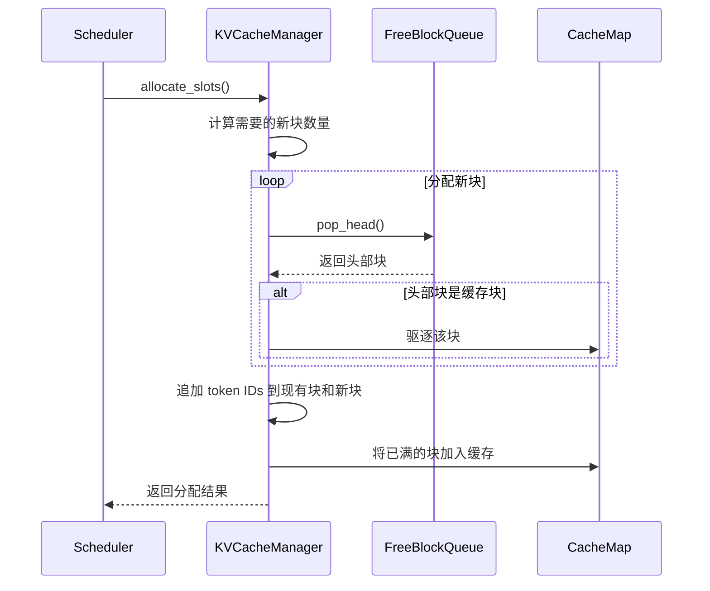

### 释放（Free）

当请求完成时，释放所有 `ref_cnt == 0` 的块：

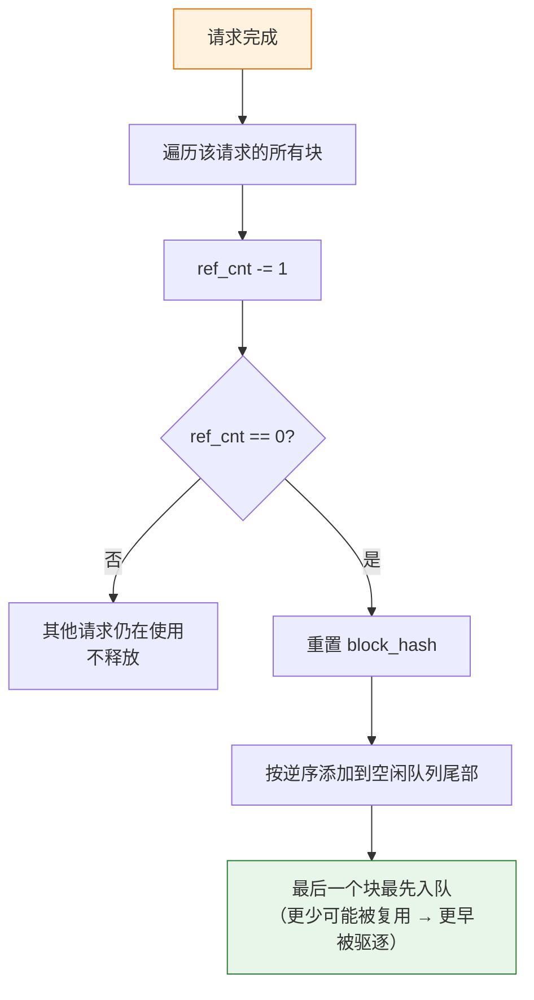

> **关键细节**：释放的块以**逆序**（最后一个块最先）添加到空闲队列尾部。这是因为请求的最后一个块哈希了最多的词元，被其他请求复用的可能性最低，因此应该最先被驱逐。

### 驱逐（Eviction / LRU）

当空闲队列头部的块是缓存块时，需要驱逐它：

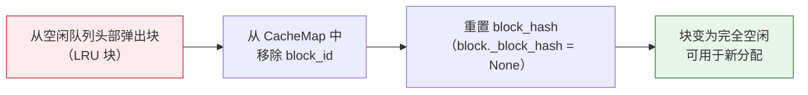

## 4.4 缓存命中示例

以下通过一个完整的时间序列示例说明前缀缓存的工作过程。假设 **block_size = 4**，总共 **10 个块**。

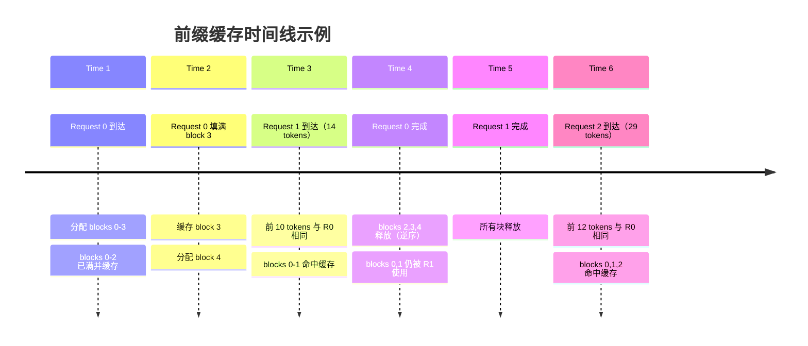

### 逐步详解

**Time 1**：缓存为空，Request 0 到达，分配 blocks 0-3。其中 blocks 0-2 已满并缓存。

```
Block Table: [0, 1, 2, 3(partial)]
Cache:       {hash_0: 0, hash_1: 1, hash_2: 2}
Free Queue:  4 ↔ 5 ↔ 6 ↔ 7 ↔ 8 ↔ 9
```

**Time 2**：Request 0 填满 block 3 并缓存，同时分配 block 4 用于继续解码。

```
Block Table: [0, 1, 2, 3, 4(partial)]
Cache:       {hash_0: 0, hash_1: 1, hash_2: 2, hash_3: 3}
Free Queue:  5 ↔ 6 ↔ 7 ↔ 8 ↔ 9
```

**Time 3**：Request 1 到达，14 个 prompt tokens，前 10 个与 Request 0 相同。由于 block_size=4，前 8 个 tokens（blocks 0-1）完全命中缓存，第 3 个 block 只有 2/4 tokens 匹配，不命中。

```
Block Table: [0(hit), 1(hit), 5, 6, 7(partial)]
Cache:       {hash_0: 0, hash_1: 1, hash_2: 2, hash_3: 3}
Free Queue:  8 ↔ 9
```

**Time 4**：Request 0 完成。Blocks 2, 3, 4 以逆序添加到空闲队列尾部。Blocks 0, 1 因被 Request 1 使用（ref_cnt > 0），不释放。

```
Free Queue:  8 ↔ 9 ↔ 4 ↔ 3 ↔ 2
（blocks 2, 3 仍被缓存，block 4 未缓存）
```

**Time 5**：Request 1 完成，所有块释放。

```
Free Queue:  7 ↔ 8 ↔ 9 ↔ 4 ↔ 3 ↔ 6 ↔ 5 ↔ 1 ↔ 0
（blocks 0, 1 仍被缓存）
```

**Time 6**：Request 2 到达，29 个 prompt tokens，前 12 个与 Request 0 相同。Blocks 0, 1, 2 命中缓存（touch 操作将它们从空闲队列移除），然后分配新块。

```
命中缓存后 Free Queue: 7 ↔ 8 ↔ 9 ↔ 4 ↔ 3 ↔ 6 ↔ 5
分配: blocks 0(cached), 1(cached), 2(cached), 7, 8, 9, 4, 3(evicted!)
```

> **注意**：block 3 在分配时被驱逐（evict），因为它在空闲队列头部且是缓存块。

## 4.5 多模态前缀缓存

当请求包含多模态输入（如图片）时，前缀缓存需要特殊处理。以图片输入为例：

### 问题

`[IMG]` token 在分词后会被替换为一系列占位符 token（placeholder tokens），这些占位符在 prefill 阶段被替换为图片嵌入。不同图片可能产生相同的占位符序列，因此需要区分。

### 解决方案

将图片哈希（image hash）作为 `extra_hash` 注入到每个包含占位符的块中：

```mermaid
flowchart TB
    subgraph Prompt["原始 Prompt"]
        pt["What's in this image?\n[IMG]"]
    end

    subgraph Tokenized["分词后"]
        tk["1, 3, 7493, 1681, 1294, 1593, 3937, 9551, 10, 4"]
    end

    subgraph Placeholders["替换占位符后"]
        ph["1, 3, 7493, ..., 9551, &lt;P&gt;, &lt;P&gt;, ..., &lt;P&gt;, 4\n（41 个占位符）"]
    end

    Prompt --> Tokenized --> Placeholders

    subgraph Blocks["块哈希计算（block_size=16）"]
        direction TB
        B0["Block 0\nParent: None\nTokens: 1,3,...,9551,&lt;P&gt;,...,&lt;P&gt;\nExtra: image_hash"]
        B1["Block 1\nParent: hash_0\nTokens: &lt;P&gt;,...,&lt;P&gt;\nExtra: image_hash"]
        B2["Block 2\nParent: hash_1\nTokens: &lt;P&gt;,...,&lt;P&gt;\nExtra: image_hash"]
        B3["Block 3\nParent: hash_2\nTokens: &lt;P&gt;,...,&lt;P&gt;, 4\nExtra: image_hash"]
    end

    Placeholders --> Blocks

    style B0 fill:#e3f2fd,stroke:#1565c0
    style B1 fill:#e3f2fd,stroke:#1565c0
    style B2 fill:#e3f2fd,stroke:#1565c0
    style B3 fill:#e3f2fd,stroke:#1565c0
```

通过将 `image_hash` 作为 `extra_hash` 注入，即使两个不同的图片产生了相同数量的占位符 token，它们的块哈希值也会不同，从而正确区分不同图片的缓存。

## 4.6 安全性：缓存隔离

在多租户环境中，前缀缓存可能带来安全隐患：攻击者可以通过观察延迟差异（timing-based attack）推断其他用户的缓存内容。

### cache_salt 机制

vLLM 支持通过可选的 `cache_salt` 实现缓存隔离：

```mermaid
flowchart LR
    subgraph 请求A["请求 A（salt='secret_a'）"]
        a1["hash(salt_a + tokens_1) → hash_a1"]
        a2["hash(hash_a1 + tokens_2) → hash_a2"]
    end

    subgraph 请求B["请求 B（salt='secret_a'）"]
        b1["hash(salt_a + tokens_1) → hash_a1"]
        b2["hash(hash_a1 + tokens_2) → hash_a2"]
    end

    subgraph 请求C["请求 C（salt='secret_c'）"]
        c1["hash(salt_c + tokens_1) → hash_c1 ≠ hash_a1"]
        c2["hash(hash_c1 + tokens_2) → hash_c2"]
    end

    a1 -.->|"命中"| b1
    c1 x-"不命中"-x a1

    style a1 fill:#e8f5e9,stroke:#2e7d32
    style b1 fill:#e8f5e9,stroke:#2e7d32
    style c1 fill:#ffebee,stroke:#c62828
```

- `cache_salt` 被注入到第一个块的哈希计算中
- 只有具有相同 `salt` 的请求才能复用缓存的 KV 块
- 这防止了时序攻击：攻击者无法通过观察延迟差异推断缓存内容

### 使用示例

```json
{
  "messages": [
    {"role": "system", "content": "You are a helpful assistant."},
    {"role": "user", "content": "Here is a document with details about the world series: ..."},
    {"role": "user", "content": "Who won the world series in 2020?"}
  ],
  "cache_salt": "your-cache-salt"
}
```

### 启用前缀缓存

```python
from vllm import LLM

model = LLM(
    model="meta-llama/Llama-3.1-8B-Instruct",
    enable_prefix_caching=True,
)
```

```bash
vllm serve --model meta-llama/Llama-3.1-8B-Instruct --enable-prefix-caching
```

### 适用场景

- **长文档查询**：用户反复查询同一长文档（如软件手册、年报），APC 只需处理一次长文档
- **多轮对话**：在同一会话中多次对话，APC 可复用聊天历史的处理结果

### 局限性

- APC 仅减少 prefill 阶段的时间，不影响 decode 阶段
- 当新请求与已有请求无共同前缀时，无法获得性能提升
- 当 vLLM 大部分时间用于生成长回答时，APC 带来的收益有限

---

# 第五章 CUDA Graphs

## 5.1 动机

### 为什么需要 CUDA Graphs？

在 GPU 推理中，每次 kernel 启动都涉及 CPU 端的开销（kernel launch overhead）。对于小批量、低延迟场景，这些开销可能占据总延迟的显著比例。CUDA Graphs 通过将多个 GPU 操作录制（capture）为一个图，然后一次性重放（replay），从而消除重复的 CPU 端启动开销。

### 旧设计的问题

vLLM 早期的 CUDA Graphs 实现存在以下问题：

1. **编译与 CUDA Graph 捕获紧耦合**：piecewise 编译和 cudagraph 捕获逻辑交织在 `PiecewiseBackend` 中
2. **缺乏细粒度控制**：无法区分 prefill/mixed 批次和 decode 批次的 CUDA Graphs
3. **注意力后端兼容性混乱**：不同后端对 CUDA Graphs 的支持程度不同（如 FlashAttention 3 支持全量 CUDA Graphs，而 FlashInfer 仅支持纯 decode），导致性能/兼容性权衡混乱

### 新设计目标

```mermaid
flowchart TB
    A["新设计目标"] --> B["显式区分 prefill/mixed\n与 decode 批次"]
    A --> C["分离 CUDA Graph 捕获\n与编译逻辑"]
    A --> D["运行时动态调度\nfull 与 piecewise"]
    A --> E["集中控制\n降低代码复杂度"]

    style A fill:#e1f5fe,stroke:#0288d1
    style B fill:#e8f5e9,stroke:#2e7d32
    style C fill:#e8f5e9,stroke:#2e7d32
    style D fill:#e8f5e9,stroke:#2e7d32
    style E fill:#e8f5e9,stroke:#2e7d32
```

## 5.2 CUDA Graphs 模式

vLLM 定义了 5 种 CUDA Graphs 模式，通过 [CUDAGraphMode](file:///workspace/vllm/config/compilation.py#L53) 枚举控制：

```mermaid
stateDiagram-v2
    [*] --> NONE
    [*] --> PIECEWISE
    [*] --> FULL
    [*] --> FULL_DECODE_ONLY
    [*] --> FULL_AND_PIECEWISE

    state NONE {
        note1: 关闭 CUDA Graphs\n适合调试
    }

    state PIECEWISE {
        note2: 单模式\n注意力保持 eager\n其余操作进入 CUDA Graph\n需要 piecewise 编译
    }

    state FULL {
        note3: 单模式\n全量 CUDA Graph\n非均匀批次捕获\ndecode 复用同一图
    }

    state FULL_DECODE_ONLY {
        note4: 双模式\ndecode → FULL\nprefill/mixed → NONE\n适合 P/D 分离部署
    }

    state FULL_AND_PIECEWISE {
        note5: 双模式（默认）\ndecode → FULL\nprefill/mixed → PIECEWISE\n性能最佳但内存最多
    }

    FULL_DECODE_ONLY --> FULL: decode 批次
    FULL_DECODE_ONLY --> NONE: prefill/mixed 批次
    FULL_AND_PIECEWISE --> FULL: decode 批次
    FULL_AND_PIECEWISE --> PIECEWISE: prefill/mixed 批次
```

### 模式详解

| 模式 | 值 | 类型 | decode 路径 | prefill/mixed 路径 | 说明 |
|------|-----|------|------------|-------------------|------|
| `NONE` | 0 | 单模式 | eager | eager | 关闭 CUDA Graphs，适合调试 |
| `PIECEWISE` | 1 | 单模式 | piecewise | piecewise | 注意力保持 eager，其余进 CUDA Graph |
| `FULL` | 2 | 单模式 | full | full | 全量 CUDA Graph，decode 复用 prefill 图 |
| `FULL_DECODE_ONLY` | (2, 0) | 双模式 | full | eager | 仅 decode 用 CUDA Graph，省内存 |
| `FULL_AND_PIECEWISE` | (2, 1) | 双模式 | full | piecewise | **默认模式**，性能最佳 |

### 双模式调度

```mermaid
flowchart TB
    Input["输入批次"] --> Check{是否为\nuniform decode?}

    Check -->|"是"| DecodeMode{cudagraph_mode?}
    Check -->|"否"| MixedMode{cudagraph_mode?}

    DecodeMode -->|"FULL_DECODE_ONLY"| FULL_D["FULL 模式\n全量 CUDA Graph"]
    DecodeMode -->|"FULL_AND_PIECEWISE"| FULL_P["FULL 模式\n全量 CUDA Graph"]
    DecodeMode -->|"FULL"| FULL_S["FULL 模式"]
    DecodeMode -->|"PIECEWISE"| PW_D["PIECEWISE 模式"]
    DecodeMode -->|"NONE"| NONE_D["NONE 模式\neager 执行"]

    MixedMode -->|"FULL_DECODE_ONLY"| NONE_M["NONE 模式\neager 执行"]
    MixedMode -->|"FULL_AND_PIECEWISE"| PW_M["PIECEWISE 模式\n分段 CUDA Graph"]
    MixedMode -->|"FULL"| FULL_M["FULL 模式"]
    MixedMode -->|"PIECEWISE"| PW_M2["PIECEWISE 模式"]
    MixedMode -->|"NONE"| NONE_M2["NONE 模式\neager 执行"]

    style FULL_D fill:#c8e6c9,stroke:#2e7d32
    style FULL_P fill:#c8e6c9,stroke:#2e7d32
    style FULL_S fill:#c8e6c9,stroke:#2e7d32
    style PW_D fill:#bbdefb,stroke:#1565c0
    style PW_M fill:#bbdefb,stroke:#1565c0
    style PW_M2 fill:#bbdefb,stroke:#1565c0
    style NONE_D fill:#ffecb3,stroke:#ff8f00
    style NONE_M fill:#ffecb3,stroke:#ff8f00
    style NONE_M2 fill:#ffecb3,stroke:#ff8f00
```

> **术语说明**：
> - **uniform decode**：纯 decode（`max_query_len=1`）或投机 decode（`max_query_len=1+num_spec_tokens`）
> - **non-uniform**：prefill 或混合 prefill-decode 批次

> **默认值**：v1 + piecewise 编译时默认 `FULL_AND_PIECEWISE`；pooling 模型默认 `PIECEWISE`；无 piecewise 编译时默认 `NONE`。

## 5.3 CudagraphDispatcher 调度流程

[CudagraphDispatcher](file:///workspace/vllm/v1/cudagraph_dispatcher.py#L15) 是 CUDA Graphs 的中央控制器，维护两组有效的调度键（分别对应 FULL 和 PIECEWISE 模式），并在模型前向传播前进行调度。

### BatchDescriptor

[BatchDescriptor](file:///workspace/vllm/forward_context.py#L31) 是调度的核心数据结构，作为运行时调度键：

```python
class BatchDescriptor(NamedTuple):
    num_tokens: int
    num_reqs: int | None = None
    uniform: bool = False
    has_lora: bool = False
    num_active_loras: int = 0
```

### 调度流程

```mermaid
flowchart TB
    Input["输入\nnum_tokens, uniform_decode, has_lora, num_active_loras"]

    Input --> Pad["创建 padded BatchDescriptor\nnum_tokens → padded_size\n计算 num_reqs"]

    Pad --> Search["搜索有效调度键\n优先级: FULL > PIECEWISE > NONE"]

    Search --> CheckFull{FULL 键集中\n存在匹配?}
    CheckFull -->|"是"| ReturnFull["返回 (FULL, batch_descriptor)"]
    CheckFull -->|"否"| CheckPW{PIECEWISE 键集中\n存在匹配?}

    CheckPW -->|"是"| ReturnPW["返回 (PIECEWISE, batch_descriptor)"]
    CheckPW -->|"否"| ReturnNone["返回 (NONE, BatchDescriptor(num_tokens))"]

    ReturnFull --> SetCtx["设置 ForwardContext\nruntime_mode + batch_descriptor"]
    ReturnPW --> SetCtx
    ReturnNone --> SetCtx

    SetCtx --> Execute["模型执行\nCUDAGraphWrapper 根据\nruntime_mode 决定行为"]

    style ReturnFull fill:#c8e6c9,stroke:#2e7d32
    style ReturnPW fill:#bbdefb,stroke:#1565c0
    style ReturnNone fill:#ffecb3,stroke:#ff8f00
```

### 调度代码示例

```python
# 在 GPUModelRunner 中
batch_descriptor = BatchDescriptor(
    num_tokens=num_input_tokens,
    uniform_decode=...,
)
runtime_mode, batch_descriptor = cudagraph_dispatcher.dispatch(batch_descriptor)

with set_forward_context(
    ...,
    cudagraph_runtime_mode=runtime_mode,
    batch_descriptor=batch_descriptor,
):
    output = self.model(...)
```

## 5.4 嵌套 Wrapper 设计

[CUDAGraphWrapper](file:///workspace/vllm/compilation/cuda_graph.py#L145) 是实现 CUDA Graphs 捕获和重放的核心类。vLLM 采用**嵌套 Wrapper 设计**，使 FULL 和 PIECEWISE 模式可以共存且互不冲突：

```mermaid
flowchart TB
    subgraph Model["模型结构"]
        direction TB

        OuterWrapper["CUDAGraphWrapper\n(FULL 模式)\n包裹整个模型"]

        subgraph InnerModel["模型内部"]
            Piece0["Piece 0"]
            PW0["CUDAGraphWrapper\n(PIECEWISE 模式)\n包裹 Piece 0"]

            Piece1["Piece 1"]
            PW1["CUDAGraphWrapper\n(PIECEWISE 模式)\n包裹 Piece 1"]

            Attn["注意力操作\n(eager 执行)"]
        end

        OuterWrapper --> PW0
        OuterWrapper --> PW1
        OuterWrapper --> Attn
        PW0 --> Piece0
        PW1 --> Piece1
    end

    style OuterWrapper fill:#c8e6c9,stroke:#2e7d32
    style PW0 fill:#bbdefb,stroke:#1565c0
    style PW1 fill:#bbdefb,stroke:#1565c0
    style Attn fill:#ffecb3,stroke:#ff8f00
```

### 三种运行时行为

```mermaid
flowchart TB
    subgraph FULL_Runtime["FULL 运行时模式"]
        direction LR
        FW1["外层 Wrapper\n捕获/重放 FULL Graph"]
        FW2["内层 Wrapper\n不激活（pass through）"]
        FW3["注意力操作\n包含在 FULL Graph 中"]
        FW1 --> FW2 --> FW3
    end

    subgraph PIECEWISE_Runtime["PIECEWISE 运行时模式"]
        direction LR
        PW1["外层 Wrapper\npass through"]
        PW2["内层 Wrapper\n捕获/重放 PIECEWISE Graph"]
        PW3["注意力操作\neager 执行"]
        PW1 --> PW2 --> PW3
    end

    subgraph NONE_Runtime["NONE 运行时模式"]
        direction LR
        NW1["外层 Wrapper\npass through"]
        NW2["内层 Wrapper\npass through"]
        NW3["所有操作\neager 执行"]
        NW1 --> NW2 --> NW3
    end

    style FW1 fill:#c8e6c9,stroke:#2e7d32
    style PW2 fill:#bbdefb,stroke:#1565c0
    style NW3 fill:#ffecb3,stroke:#ff8f00
```

**核心机制**：

1. **FULL 模式激活时**：外层 Wrapper 捕获/重放全量 CUDA Graph，内层 Wrapper 不激活
2. **PIECEWISE 模式激活时**：外层 Wrapper pass through，内层 Wrapper 捕获/重放分段 CUDA Graph
3. **NONE 模式时**：两层 Wrapper 都 pass through，直接 eager 执行

> **设计优势**：CUDAGraphWrapper 直接信任 ForwardContext 中的调度结果（由 Dispatcher 控制），无需自行判断，简化了 Wrapper 代码并降低了状态不一致的风险。

## 5.5 注意力后端兼容性

不同注意力后端对 CUDA Graphs 的支持程度不同，vLLM 引入 [AttentionCGSupport](file:///workspace/vllm/v1/attention/backend.py#L499) 枚举来标识：

```python
class AttentionCGSupport(Enum):
    ALWAYS = 3                      # 始终支持，包括混合 prefill-decode
    UNIFORM_BATCH = 2               # 仅支持均匀批次（query 长度相同）
    UNIFORM_SINGLE_TOKEN_DECODE = 1 # 仅支持纯 decode（query_len==1）
    NEVER = 0                       # 不支持 CUDA Graphs
```

能力排序：`ALWAYS > UNIFORM_BATCH > UNIFORM_SINGLE_TOKEN_DECODE > NEVER`

### 各后端支持情况

| 注意力后端 | cudagraph_support | 备注 |
|:----------|:------------------|:-----|
| FlashAttention v2 | `UNIFORM_BATCH` | 实际支持 `ALWAYS`，但为性能回退到 `FULL_AND_PIECEWISE` |
| FlashAttention v3 | `ALWAYS` | 统一内核，`FULL` 模式适用 |
| Triton Attention | `ALWAYS` | 偏好 `FULL_AND_PIECEWISE`，prefill/decode 使用不同内核 |
| AITER FlashAttention | `UNIFORM_BATCH` | |
| FlashInfer | `UNIFORM_SINGLE_TOKEN_DECODE` | Blackwell + TRTLLM 时升级为 `UNIFORM_BATCH` |
| FlashMLA | `UNIFORM_BATCH` | |
| FlashInferMLA | `UNIFORM_BATCH` | |
| FlashInferMLASparse | `UNIFORM_BATCH` | |
| AITER MLA | `UNIFORM_SINGLE_TOKEN_DECODE` | |
| CUTLASS MLA | `UNIFORM_SINGLE_TOKEN_DECODE` | |
| Mamba attention | `UNIFORM_SINGLE_TOKEN_DECODE` | |

> 未列出的后端均声明为 `NEVER`。

### 模式降级策略

当注意力后端不支持当前配置的 CUDA Graphs 模式时，vLLM 会自动降级：

```mermaid
flowchart TB
    Config["用户配置 cudagraph_mode"] --> Check{检查注意力后端\n最小支持级别}

    Check -->|"ALWAYS"| OK1["所有模式可用"]
    Check -->|"UNIFORM_BATCH"| Down1{"mixed_mode == FULL?"}
    Check -->|"UNIFORM_SINGLE_TOKEN_DECODE"| Down2{"mixed_mode == FULL?"}
    Check -->|"NEVER"| Down3["不支持任何 FULL 模式"]

    Down1 -->|"是 + piecewise 编译"| Fix1["降级为 FULL_AND_PIECEWISE"]
    Down1 -->|"是 + 无 piecewise"| Fix2["降级为 FULL_DECODE_ONLY"]
    Down1 -->|"否"| OK2["FULL_DECODE_ONLY 可用"]

    Down2 -->|"是 + piecewise 编译"| Fix3["降级为 FULL_AND_PIECEWISE"]
    Down2 -->|"是 + 无 piecewise"| Fix4["降级为 FULL_DECODE_ONLY"]

    Down3 -->|"有 piecewise 编译"| Fix5["降级为 PIECEWISE"]
    Down3 -->|"无 piecewise"| Fix6["降级为 NONE"]

    style OK1 fill:#c8e6c9,stroke:#2e7d32
    style Fix1 fill:#fff3e0,stroke:#ef6c00
    style Fix2 fill:#fff3e0,stroke:#ef6c00
    style Fix3 fill:#fff3e0,stroke:#ef6c00
    style Fix4 fill:#fff3e0,stroke:#ef6c00
    style Fix5 fill:#ffebee,stroke:#c62828
    style Fix6 fill:#ffebee,stroke:#c62828
```

## 5.6 使用示例

### CLI 方式

```bash
# 默认模式（FULL_AND_PIECEWISE）
vllm serve --model meta-llama/Llama-3.1-8B-Instruct \
    --compilation-config '{"cudagraph_mode": "FULL_AND_PIECEWISE"}'

# 仅 decode 使用 CUDA Graphs
vllm serve --model meta-llama/Llama-3.1-8B-Instruct \
    --compilation-config '{"cudagraph_mode": "FULL_DECODE_ONLY"}'

# 关闭 CUDA Graphs（调试用）
vllm serve --model meta-llama/Llama-3.1-8B-Instruct \
    --compilation-config '{"cudagraph_mode": "NONE"}'

# 全量 CUDA Graphs
vllm serve --model meta-llama/Llama-3.1-8B-Instruct \
    --compilation-config '{"cudagraph_mode": "FULL"}'

# 分段 CUDA Graphs
vllm serve --model meta-llama/Llama-3.1-8B-Instruct \
    --compilation-config '{"cudagraph_mode": "PIECEWISE"}'
```

### Python 方式

```python
import os
os.environ.setdefault("VLLM_LOGGING_LEVEL", "DEBUG")

import vllm
from vllm.config import CUDAGraphMode

compilation_config = {"mode": 3, "cudagraph_mode": "FULL_AND_PIECEWISE"}
model = vllm.LLM(
    model="meta-llama/Llama-3.1-8B-Instruct",
    dtype="auto",
    compilation_config=compilation_config,
)
sampling_params = vllm.SamplingParams(
    temperature=0,
    max_tokens=1024,
)
outputs = model.generate(
    ["My name is John and"],
    sampling_params=sampling_params,
)
```

### 模式选择建议

| 场景 | 推荐模式 | 原因 |
|:-----|:---------|:-----|
| 通用推理（默认） | `FULL_AND_PIECEWISE` | 性能最佳，decode 用 FULL，prefill 用 PIECEWISE |
| P/D 分离部署的 decode 实例 | `FULL_DECODE_ONLY` | 无需 prefill CUDA Graphs，节省内存 |
| 小模型或 MoE | `FULL_AND_PIECEWISE` | 低延迟收益最大 |
| 调试 | `NONE` | 关闭 CUDA Graphs，便于定位问题 |
| 注意力后端不支持 FULL | `PIECEWISE` | 仅使用分段 CUDA Graphs |

### 注意事项

1. 所有 `PIECEWISE` 相关模式需要 piecewise 编译支持
2. 所有 `FULL` 相关模式需要注意力后端支持 CUDA Graphs
3. 某些自定义编译 pass（如注意力融合 `AttnQuantFusionPass`、序列并行 `SequenceParallelismPass`）需要看到完整图，与 piecewise 编译不兼容，此时会自动禁用 piecewise 编译并使用 `FULL` 或 `FULL_DECODE_ONLY`
4. Cascade Attention 不兼容 CUDA Graphs，但与所有 cudagraph_mode 配置兼容——使用 cascade attention 的批次会被调度到 `PIECEWISE` 模式（若可用），否则 `NONE`
# 第六章 功能特性矩阵

## 6.1 Feature × Feature 兼容性

vLLM 的各功能特性之间存在兼容性约束。以下是关键发现：

```mermaid
flowchart TD
    Start[我想同时使用两个功能] --> Check{检查兼容性}
    Check -->|Chunked Prefill| CP[CP 与几乎所有功能兼容 ✅]
    Check -->|LoRA + Speculative Decoding| Incompatible1[❌ 不兼容]
    Check -->|Multi-step + LoRA| Incompatible2[❌ 不兼容]
    Check -->|Multi-step + CP| Incompatible3[❌ 不兼容]
    Check -->|Speculative Decoding + Beam Search| Incompatible4[❌ 不兼容]
    Check -->|Pooling + CP| Partial1[🟠 部分兼容<br/>仅限 last-token/all pooling]
    Check -->|Multimodal + LoRA| Partial2[🟠 部分兼容<br/>仅限语言骨干]

    style CP fill:#c8e6c9
    style Incompatible1 fill:#ffcdd2
    style Incompatible2 fill:#ffcdd2
    style Incompatible3 fill:#ffcdd2
    style Incompatible4 fill:#ffcdd2
    style Partial1 fill:#fff9c4
    style Partial2 fill:#fff9c4
```

### 关键兼容性规则

| 功能组合 | 兼容性 | 说明 |
|---------|--------|------|
| CP + APC | ✅ | 完全兼容 |
| CP + LoRA | ✅ | 完全兼容 |
| CP + SD | ✅ | 完全兼容 |
| LoRA + SD | ❌ | 不兼容 |
| SD + Beam Search | ❌ | 不兼容 |
| SD + Best-of | ❌ | 不兼容 |
| Multi-step + CP | ❌ | 不兼容 |
| Multi-step + LoRA | ❌ | 不兼容 |
| Multi-step + SD | ❌ | 不兼容 |
| Pooling + CP | 🟠 | 仅限 causal attention 的 last-token/all pooling |
| Multimodal + LoRA | 🟠 | LoRA 仅适用于语言骨干 |

## 6.2 Feature × Hardware 兼容性

```mermaid
flowchart LR
    subgraph NVIDIA[NVIDIA GPU]
        FA[Volta / Turing / Ampere / Ada / Hopper]
    end
    subgraph Others[其他平台]
        CPU[x86 CPU]
        AMD[AMD GPU]
        Intel[Intel GPU]
    end

    NVIDIA -->|全部支持| CG[CUDA Graphs ✅]
    CPU -->|不支持| CG
    Intel -->|不支持| CG

    CPU -->|不支持| SD[Speculative Decoding ❌]
    AMD -->|支持| SD

    CPU -->|不支持| Async[Async Output ❌]
    AMD -->|不支持| Async

    style NVIDIA fill:#c8e6c9
    style CPU fill:#ffcdd2
    style AMD fill:#fff9c4
```

| 功能 | Volta | Turing | Ampere | Ada | Hopper | CPU | AMD | Intel GPU |
|------|-------|--------|--------|-----|--------|-----|-----|-----------|
| Chunked Prefill | ❌ | ✅ | ✅ | ✅ | ✅ | ✅ | ✅ | ✅ |
| Prefix Caching | ❌ | ✅ | ✅ | ✅ | ✅ | ✅ | ✅ | ✅ |
| LoRA | ✅ | ✅ | ✅ | ✅ | ✅ | ✅ | ✅ | ✅ |
| Speculative Decoding | ✅ | ✅ | ✅ | ✅ | ✅ | ❌ | ✅ | ✅ |
| CUDA Graphs | ✅ | ✅ | ✅ | ✅ | ✅ | ❌ | ✅ | ❌ |
| Multimodal | ✅ | ✅ | ✅ | ✅ | ✅ | ✅ | ✅ | ✅ |
| Async Output | ✅ | ✅ | ✅ | ✅ | ✅ | ❌ | ❌ | ✅ |

## 6.3 量化方案全景

vLLM 支持 14 种量化方案，覆盖不同精度和硬件平台：

```mermaid
mindmap
  root((量化方案))
    W4A16 4-bit 权重
      AutoAWQ
      GPTQModel
      INT4 W4A16
      GGUF
    W8A8 8-bit 权重+激活
      FP8 W8A8
      INT8 W8A8
    其他方案
      BitsAndBytes
      Intel Neural Compressor
      NVIDIA ModelOpt
      Online Quantization
      AMD Quark
      TorchAO
      FP8 ViT Attention
    KV Cache 量化
      Quantized KV Cache
```

### 硬件兼容性表

| 方案 | Volta | Turing | Ampere | Ada | Hopper | AMD GPU | Intel GPU | x86 CPU |
|------|-------|--------|--------|-----|--------|---------|-----------|---------|
| AWQ | ❌ | ✅ | ✅ | ✅ | ✅ | ❌ | ✅ | ✅ |
| GPTQ | ✅ | ✅ | ✅ | ✅ | ✅ | ❌ | ✅ | ✅ |
| Marlin | ❌ | ✅* | ✅ | ✅ | ✅ | ❌ | ❌ | ❌ |
| FP8 | ❌ | ❌ | ❌ | ✅ | ✅ | ✅ | ❌ | ❌ |
| BitsAndBytes | ✅ | ✅ | ✅ | ✅ | ✅ | ❌ | ❌ | ❌ |
| GGUF | ✅ | ✅ | ✅ | ✅ | ✅ | ✅ | ❌ | ❌ |

> *Turing 不支持 Marlin MXFP4

### 量化选择决策流程

```mermaid
flowchart TD
    Start[选择量化方案] --> Q1{目标精度？}
    Q1 -->|4-bit| W4[INT4 / AWQ / GPTQ / GGUF]
    Q1 -->|8-bit| Q2{权重+激活还是仅权重？}
    Q2 -->|权重+激活| W8A8[FP8 或 INT8 W8A8]
    Q2 -->|仅权重| BnB[BitsAndBytes]

    W4 --> Q3{硬件平台？}
    Q3 -->|Hopper/Ada| Marlin[Marlin 内核<br/>最优性能]
    Q3 -->|Ampere 及以下| AWQ_GPTQ[AWQ 或 GPTQ]
    Q3 -->|AMD GPU| GGUF_OPT[GGUF]
    Q3 -->|CPU| AWQ_CPU[AWQ / GPTQ]

    W8A8 --> Q4{硬件平台？}
    Q4 -->|Hopper/Ada/AMD| FP8[FP8 W8A8]
    Q4 -->|Ampere/Turing/CPU| INT8[INT8 W8A8]

    style Marlin fill:#c8e6c9
    style FP8 fill:#c8e6c9
```

## 6.4 推测解码方法选择

推测解码（Speculative Decoding）可在中低 QPS 场景下降低 token 间延迟：

```mermaid
flowchart TD
    Start[选择推测解码方法] --> QPS{工作负载类型？}

    QPS -->|低 QPS 延迟优先| Low[延迟优先场景]
    QPS -->|高 QPS 吞吐优先| High[吞吐优先场景]

    Low --> Q1{模型是否原生支持 MTP？}
    Q1 -->|是| MTP[MTP<br/>高收益 🚀]
    Q1 -->|否| Q2{需要通用方案？}
    Q2 -->|是| EAGLE[EAGLE<br/>高收益 🚀]
    Q2 -->|有独立草稿模型| Draft[Draft Model<br/>高收益 🚀]
    Q2 -->|有 MLP speculator| MLP[MLP Speculator<br/>中高收益]

    High --> Q3{需要轻量级方案？}
    Q3 -->|是| NGram[N-gram<br/>中等收益<br/>最易启用]
    Q3 -->|无需额外模型| Suffix[Suffix Decoding<br/>中等收益<br/>动态推测深度]
    Q3 -->|仍需低延迟| EAGLE_H[EAGLE/MTP<br/>中高收益]

    style MTP fill:#c8e6c9
    style EAGLE fill:#c8e6c9
    style Draft fill:#c8e6c9
    style NGram fill:#fff9c4
    style Suffix fill:#fff9c4
```

### 方法对比

| 方法 | 低 QPS 延迟 | 高 QPS 吞吐 | 特点 |
|------|------------|------------|------|
| EAGLE | 高 | 中高 | 通用性最强的模型方法 |
| MTP | 高 | 中高 | 需模型原生支持 MTP |
| Draft Model | 高 | 中 | 需要独立草稿模型 |
| PARD | 高 | 中高 | 草稿模型延迟低 |
| MLP | 中高 | 中 | 需兼容的 MLP speculator |
| N-gram | 低中 | 中 | 轻量级，最易启用 |
| Suffix | 低中 | 中 | 无需额外模型，动态深度 |

### 使用示例

```bash
# EAGLE 推测解码
vllm serve <model> --speculative-config '{
  "method": "eagle3",
  "num_speculative_tokens": 5
}'

# N-gram 推测解码
vllm serve <model> --speculative-config '{
  "method": "ngram",
  "num_speculative_tokens": 4,
  "prompt_lookup_min": 2,
  "prompt_lookup_max": 5
}'
```

> **注意**：推测解码在理论上是无损的（up to 浮点精度），但 vLLM 不保证跨运行的 logprobs 稳定性。

---

# 第七章 部署方式

## 7.1 部署架构选择决策树

```mermaid
flowchart TD
    Start[选择部署方式] --> GPU{GPU 配置？}

    GPU -->|单 GPU| Single[Docker / pip install]
    GPU -->|多 GPU 单节点| MultiGPU{需要什么？}
    GPU -->|多节点| MultiNode{需要自动扩缩容？}

    MultiGPU -->|更高吞吐| DP[Data Parallelism]
    MultiGPU -->|更大模型| TP[Tensor Parallelism]
    MultiGPU -->|两者都要| DP_TP[DP + TP 组合]

    MultiNode -->|是| Ray[Ray Serve / K8s HPA]
    MultiNode -->|否| K8s[Kubernetes + KubeRay]

    Single --> Framework{需要框架集成？}
    Framework -->|Dify / LiteLLM / BentoML| FW[查看 frameworks/ 文档]
    Framework -->|KServe / KubeRay / LLM-D| K8sInt[查看 integrations/ 文档]
    Framework -->|无需| Basic[直接使用 vllm serve]

    style Single fill:#c8e6c9
    style DP fill:#bbdefb
    style TP fill:#fff9c4
    style Ray fill:#d1c4e9
```

## 7.2 Data Parallel 部署架构

vLLM 支持三种数据并行负载均衡模式：

### 内部负载均衡

```mermaid
flowchart LR
    Client[客户端] -->|HTTP| APIServer[API Server<br/>内部负载均衡]
    APIServer --> EC0[Engine Core 0]
    APIServer --> EC1[Engine Core 1]
    APIServer --> EC2[Engine Core 2]
    APIServer --> EC3[Engine Core 3]
    EC0 --> W00[GPU 0]
    EC0 --> W01[GPU 1]
    EC1 --> W10[GPU 2]
    EC1 --> W11[GPU 3]
    EC2 --> W20[GPU 4]
    EC2 --> W21[GPU 5]
    EC3 --> W30[GPU 6]
    EC3 --> W31[GPU 7]

    style APIServer fill:#bbdefb
```

```bash
# 单节点 DP=4, TP=2
vllm serve $MODEL --data-parallel-size 4 --tensor-parallel-size 2
```

### 混合负载均衡

```mermaid
flowchart LR
    Client[客户端] --> LB[上游负载均衡器]
    LB --> AS0[Node 0 API Server]
    LB --> AS1[Node 1 API Server]
    AS0 --> EC0[Engine Core 0-1]
    AS1 --> EC1[Engine Core 2-3]
```

```bash
# 启用混合负载均衡
vllm serve $MODEL --data-parallel-size 4 --data-parallel-hybrid-lb \
                  --data-parallel-size-local 2 --data-parallel-start-rank 0
```

### 外部负载均衡

```mermaid
flowchart LR
    Client[客户端] --> ExtLB[外部路由器]
    ExtLB --> Rank0["Rank 0<br/>vllm serve :8000"]
    ExtLB --> Rank1["Rank 1<br/>vllm serve :8001"]

    Rank0 -.->|RPC 同步| Rank1
```

```bash
# Rank 0
CUDA_VISIBLE_DEVICES=0 vllm serve $MODEL --data-parallel-size 2 --data-parallel-rank 0 --port 8000
# Rank 1
CUDA_VISIBLE_DEVICES=1 vllm serve $MODEL --data-parallel-size 2 --data-parallel-rank 1 --port 8001
```

### 三种模式对比

| 特性 | 内部负载均衡 | 混合负载均衡 | 外部负载均衡 |
|------|------------|------------|------------|
| HTTP 端点 | 单一 | 每节点一个 | 每秩一个 |
| 负载均衡 | API Server 内部 | 上游 LB + 本地调度 | 完全外部 |
| 跨节点流量 | 较多 | 较少 | 取决于路由 |
| 适用规模 | 中小规模 | 中大规模 | 大规模 MoE |
| 配置复杂度 | 低 | 中 | 高 |

## 7.3 分离式预填充（Disaggregated Prefilling）

分离式预填充将 prefill 和 decode 阶段放在不同的 vLLM 实例中：

```mermaid
flowchart LR
    Client[客户端] --> Prefill[Prefill 实例<br/>处理长 prompt]
    Prefill -->|KV Cache 传输| Connector[Connector<br/>连接器]
    Connector --> Decode[Decode 实例<br/>生成 token]
    Decode -->|流式返回| Client

    style Prefill fill:#bbdefb
    style Connector fill:#fff9c4
    style Decode fill:#c8e6c9
```

### 核心抽象

```mermaid
classDiagram
    class Connector {
        +insert(kv_cache)
        +drop_select(condition)
    }
    class LookupBuffer {
        +insert(kv_cache)
        +drop_select(condition) KVCache
    }
    class Pipe {
        +send_tensor(tensor)
        +recv_tensor() tensor
    }

    Connector --> LookupBuffer : 使用
    LookupBuffer --> Pipe : 使用
```

### 支持的连接器

| 连接器 | 特点 | 适用场景 |
|--------|------|---------|
| ExampleConnector | 简单示例 | 学习和测试 |
| NixlConnector | 全异步 send/recv | 高性能生产环境 |
| P2pNcclConnector | P2P NCCL 传输 | NVIDIA GPU 集群 |
| MooncakeConnector | Mooncake 传输 | 特定基础设施 |
| LMCacheConnectorV1 | NIXL 底层 | LMCache 集成 |
| MultiConnector | 组合多个连接器 | 复杂场景 |
| OffloadingConnector | 卸载到 CPU 内存 | GPU 内存受限 |
| FlexKVConnectorV1 | 分布式 KV 存储 | 超大规模推理 |

### 为什么需要分离式预填充？

1. **独立调优 TTFT 和 ITL**：可以为 prefill 和 decode 分配不同的并行策略
2. **控制尾部 ITL**：避免 prefill 任务中断 decode，导致高尾部延迟
3. **注意**：分离式预填充 **不会** 提高吞吐量

```bash
# 使用 NixlConnector
vllm serve $MODEL --kv-transfer-config '{
  "kv_connector": "NixlConnector",
  "kv_role": "kv_both",
  "kv_buffer_device": "cuda"
}'
```

## 7.4 并行策略组合

vLLM 支持 5 种并行策略：

```mermaid
flowchart TD
    subgraph Parallelism[五种并行策略]
        TP["Tensor Parallelism (TP)<br/>切分模型层到多个 GPU"]
        PP["Pipeline Parallelism (PP)<br/>切分模型阶段到多个 GPU"]
        DP["Data Parallelism (DP)<br/>复制模型处理独立批次"]
        EP["Expert Parallelism (EP)<br/>切分 MoE 专家到多个 GPU"]
        CP["Context Parallelism (CP)<br/>切分长上下文到多个 GPU"]
    end

    Total["GPU 总数 = DP × PP × TP"]

    Parallelism --> Total
```

### 并行策略选择指南

```mermaid
flowchart TD
    Start[选择并行策略] --> Q1{单 GPU 能放下模型？}
    Q1 -->|是| None[无需并行]
    Q1 -->|否| Q2{能否切分层？}

    Q2 -->|能| TP[Tensor Parallelism]
    Q2 -->|模型太大| TP_PP[TP + Pipeline Parallelism]

    None --> Q3{需要更高吞吐？}
    Q3 -->|是| DP[Data Parallelism]
    Q3 -->|否| Done[完成]

    DP --> Q4{MoE 模型？}
    Q4 -->|是| EP[+ Expert Parallelism]
    Q4 -->|否| Done2[完成]

    Q1 -->|上下文太长| CP[Context Parallelism]

    style TP fill:#bbdefb
    style DP fill:#c8e6c9
    style EP fill:#fff9c4
    style CP fill:#d1c4e9
```

### 典型配置示例

| 场景 | GPU 数 | 配置 | 命令 |
|------|--------|------|------|
| Llama-70B | 4 | TP=4 | `--tensor-parallel-size 4` |
| Llama-405B | 16 | TP=8, PP=2 | `--tensor-parallel-size 8 --pipeline-parallel-size 2` |
| 高吞吐 8 GPU | 8 | DP=4, TP=2 | `--data-parallel-size 4 --tensor-parallel-size 2` |
| DeepSeek-V3 MoE | 8 | DP=4, TP=2, EP | `--data-parallel-size 4 --tensor-parallel-size 2 --enable-expert-parallel` |

---

# 第八章 服务模式

## 8.1 离线推理 vs 在线服务

```mermaid
flowchart LR
    subgraph Offline[离线推理 - LLM 类]
        O1[Python API] --> O2[批量处理 prompts]
        O2 --> O3[llm.generate / llm.chat]
        O3 --> O4[返回完整结果]
    end

    subgraph Online[在线服务 - vllm serve]
        On1[HTTP 服务器] --> On2[OpenAI 兼容 API]
        On2 --> On3[流式输出]
        On3 --> On4[多客户端并发]
    end

    style Offline fill:#c8e6c9
    style Online fill:#bbdefb
```

### 离线推理

```python
from vllm import LLM, SamplingParams

llm = LLM(model="facebook/opt-125m")
sampling_params = SamplingParams(temperature=0.8, top_p=0.95)

# generate 方式
outputs = llm.generate(["Hello, my name is"], sampling_params)

# chat 方式（适用于 Instruct/Chat 模型）
outputs = llm.chat(
    [[{"role": "user", "content": "Hello!"}]],
    sampling_params=sampling_params
)
```

### 在线服务

```bash
vllm serve Qwen/Qwen2.5-1.5B-Instruct
```

```python
from openai import OpenAI
client = OpenAI(base_url="http://localhost:8000/v1", api_key="EMPTY")

completion = client.chat.completions.create(
    model="Qwen/Qwen2.5-1.5B-Instruct",
    messages=[{"role": "user", "content": "Hello!"}],
)
```

## 8.2 OpenAI 兼容 API 端点全景

```mermaid
mindmap
  root((API 端点))
    OpenAI 兼容
      /v1/completions
        文本补全
        仅生成式模型
      /v1/chat/completions
        聊天补全
        需要 chat template
      /v1/responses
        Responses API
        仅生成式模型
      /v1/embeddings
        文本嵌入
        仅嵌入模型
      /v1/audio/transcriptions
        语音转文字
        仅 ASR 模型
      /v1/audio/translations
        音频翻译
        仅 ASR 模型
      /v1/realtime
        实时 WebSocket 转录
        仅 ASR 模型
    自定义 API
      /tokenize /detokenize
        分词器 API
      /pooling
        池化 API
      /classify
        分类 API
      /v2/embed
        Cohere Embed API
      /score /v1/score
        评分 API
      /generative_scoring
        生成式评分 API
      /rerank /v1/rerank /v2/rerank
        重排序 API
```

## 8.3 请求处理流水线

```mermaid
sequenceDiagram
    participant C as 客户端
    participant AS as API Server
    participant ZMQ as ZMQ 通信
    participant EC as Engine Core
    participant W as GPU Worker

    C->>AS: 1. HTTP 请求
    AS->>AS: 2. 输入处理（分词、多模态加载）
    AS->>EC: 3. 通过 ZMQ 发送请求
    EC->>EC: 4. 调度（选择处理哪些请求）
    EC->>W: 5. 分发任务到 Worker
    W->>W: 6. 模型前向传播
    W->>EC: 7. 返回输出
    EC->>AS: 8. 通过 ZMQ 流式返回结果
    AS->>AS: 9. 输出处理（反分词）
    AS->>C: 10. HTTP 流式响应
```

---

# 第九章 配置与优化

## 9.1 EngineArgs 配置层级

```mermaid
flowchart TD
    VllmConfig["VllmConfig<br/>全局配置状态"]

    VllmConfig --> ModelConfig["ModelConfig<br/>模型、dtype、max_model_len"]
    VllmConfig --> CacheConfig["CacheConfig<br/>block_size、gpu_memory_utilization"]
    VllmConfig --> ParallelConfig["ParallelConfig<br/>TP、PP、DP 大小"]
    VllmConfig --> SchedulerConfig["SchedulerConfig<br/>max_num_seqs、max_num_batched_tokens"]
    VllmConfig --> QuantConfig["QuantizationConfig<br/>量化方法和参数"]
    VllmConfig --> LoRAConfig["LoRAConfig<br/>max_loras、max_lora_rank"]
    VllmConfig --> SpecConfig["SpeculativeConfig<br/>方法、num_speculative_tokens"]
    VllmConfig --> CompConfig["CompilationConfig<br/>mode、cudagraph_mode"]
    VllmConfig --> KVConfig["KVTransferConfig<br/>kv_connector、kv_role"]
    VllmConfig --> LoadConfig["LoadConfig<br/>权重加载策略"]
    VllmConfig --> DecodingConfig["DecodingConfig<br/>解码策略"]
    VllmConfig --> TokenizerConfig["TokenizerPoolConfig<br/>分词器池"]

    EngineArgs["EngineArgs<br/>离线推理参数"] --> VllmConfig
    AsyncEngineArgs["AsyncEngineArgs<br/>在线服务参数"] --> VllmConfig

    style VllmConfig fill:#bbdefb
    style EngineArgs fill:#c8e6c9
    style AsyncEngineArgs fill:#c8e6c9
```

## 9.2 内存优化策略

```mermaid
flowchart TD
    Start[遇到内存问题] --> Q1{何时 OOM？}

    Q1 -->|模型加载时| Load[减少 max_model_len<br/>或使用量化]
    Q1 -->|推理过程中| Inference[降低 gpu_memory_utilization<br/>或减少 max_num_seqs]
    Q1 -->|长上下文| LongCtx[启用 Chunked Prefill]
    Q1 -->|重复 prompt| Prefix[启用前缀缓存<br/>--enable-prefix-caching]
    Q1 -->|大模型| LargeModel[使用 TP 或量化]
    Q1 -->|KV Cache 过大| KVQuant[使用量化 KV Cache<br/>--kv-cache-dtype fp8_e5m2]

    style Load fill:#ffcdd2
    style Inference fill:#fff9c4
    style LongCtx fill:#bbdefb
    style Prefix fill:#c8e6c9
    style LargeModel fill:#d1c4e9
    style KVQuant fill:#ffccbc
```

### 关键配置选项

| 配置项 | 默认值 | 说明 |
|--------|--------|------|
| `--gpu-memory-utilization` | 0.9 | GPU 内存使用比例 |
| `--max-model-len` | 自动 | 最大上下文长度 |
| `--max-num-seqs` | 256 | 最大并发序列数 |
| `--enable-prefix-caching` | False | 启用前缀缓存 |
| `--quantization` | None | 量化方法 |
| `--kv-cache-dtype` | auto | KV Cache 数据类型 |
| `--swap-space` | 4 (GB) | CPU 交换空间大小 |

## 9.3 并行策略组合决策指南

```mermaid
flowchart TD
    Start[选择并行策略] --> Q1{单 GPU 能放下模型？}
    Q1 -->|是| NoParallel[无需并行<br/>直接使用]
    Q1 -->|否| Q2{能否通过切分层解决？}

    Q2 -->|能| TP["TP (Tensor Parallelism)<br/>--tensor-parallel-size N"]
    Q2 -->|模型极大| Q3{单节点够吗？}

    Q3 -->|够| TP_PP["TP + PP<br/>--tensor-parallel-size N<br/>--pipeline-parallel-size M"]
    Q3 -->|不够| MultiNode["多节点 TP + PP<br/>需要 Ray 或 MPI"]

    NoParallel --> Q4{需要更高吞吐？}
    Q4 -->|是| DP["DP (Data Parallelism)<br/>--data-parallel-size N"]
    Q4 -->|否| Done[完成]

    DP --> Q5{MoE 模型？}
    Q5 -->|是| EP["+ EP (Expert Parallelism)<br/>--enable-expert-parallel"]
    Q5 -->|否| Done2[完成]

    Q1 -->|上下文太长| CP["CP (Context Parallelism)<br/>--context-parallel-size N"]

    style TP fill:#bbdefb
    style DP fill:#c8e6c9
    style EP fill:#fff9c4
    style CP fill:#d1c4e9
    style TP_PP fill:#ffccbc
```

### GPU 总数公式

```
Total GPUs = DP × PP × TP
```

### 典型配置

| 场景 | GPU 数 | 配置 |
|------|--------|------|
| Llama-8B 单 GPU | 1 | 无需并行 |
| Llama-70B | 4 | `--tensor-parallel-size 4` |
| Llama-405B | 16 | `--tensor-parallel-size 8 --pipeline-parallel-size 2` |
| 高吞吐 8 GPU | 8 | `--data-parallel-size 4 --tensor-parallel-size 2` |
| DeepSeek-V3 MoE | 8 | `--data-parallel-size 4 --tensor-parallel-size 2 --enable-expert-parallel` |

---

# 第十章 训练集成

## 10.1 RLHF 训练集成架构

vLLM 可作为 RLHF 训练循环中的推理引擎：

```mermaid
flowchart TD
    subgraph TrainingLoop[RLHF 训练循环]
        Policy[vLLM Policy Model<br/>生成响应]
        Reward[Reward Model<br/>评分响应]
        Trainer[Training Framework<br/>更新策略]
    end

    Policy -->|生成文本| Reward
    Reward -->|计算奖励| Trainer
    Trainer -->|更新权重| Policy

    subgraph WeightTransfer[权重传输方式]
        IPC[IPC 共享内存<br/>同节点 最快]
        NCCL[NCCL<br/>多节点 分布式]
        HTTP[HTTP<br/>最灵活 可远程]
    end

    Trainer -->|选择传输方式| WeightTransfer
    WeightTransfer -->|热更新权重| Policy

    style Policy fill:#bbdefb
    style Reward fill:#c8e6c9
    style Trainer fill:#fff9c4
```

### 权重传输方式对比

| 特性 | IPC | NCCL | HTTP |
|------|-----|------|------|
| 延迟 | 极低 | 中等 | 较高 |
| 范围 | 同节点 | 多节点 | 任意位置 |
| 配置 | 简单 | 需 NCCL 初始化 | 需 HTTP 服务 |
| 适用场景 | 单节点训练 | 分布式训练 | 远程推理 |

### 使用示例

```python
# IPC 模式（同节点，最快）
# rlhf_ipc.py

# NCCL 模式（多节点）
# rlhf_nccl.py

# HTTP + IPC 混合模式
# rlhf_http_ipc.py

# Sleep Mode（按需加载权重）
llm = LLM(model="...", enable_sleep_mode=True)
```

## 10.2 逐层训练（Layerwise）

逐层训练通过一次只加载一层权重来降低峰值内存使用：

```mermaid
flowchart LR
    subgraph Traditional[传统方式]
        T1[加载全部权重<br/>810GB] --> T2[前向传播<br/>高内存峰值]
    end

    subgraph Layerwise[逐层方式]
        L1[加载 Layer 0<br/>~50GB] --> L2[处理 Layer 0]
        L2 --> L3[卸载 Layer 0<br/>加载 Layer 1]
        L3 --> L4[处理 Layer 1]
        L4 --> L5[... 重复]
        L5 --> L6[低内存峰值 ✅]
    end

    style T1 fill:#ffcdd2
    style L6 fill:#c8e6c9
```

**适用场景**：
- 超大模型（405B+）
- GPU 内存有限
- RLHF 中的权重更新和同步

## 10.3 路由专家回放（Routed Experts Replay）

对于 MoE 模型的 RLHF 训练，路由专家回放只重放实际被路由到的专家：

```mermaid
flowchart TD
    Start[推理阶段] --> Route[路由器选择 Top-K 专家]
    Route --> Execute[仅执行被选中的专家]
    Execute --> Record[记录被路由的专家 ID]
    Record --> Replay[训练阶段<br/>仅回放被路由的专家]

    style Execute fill:#bbdefb
    style Replay fill:#c8e6c9
```

**优势**：
- 比回放所有专家更高效
- 减少训练循环中的计算量
- 特别适合专家数量多的 MoE 模型（如 DeepSeek-V3）
