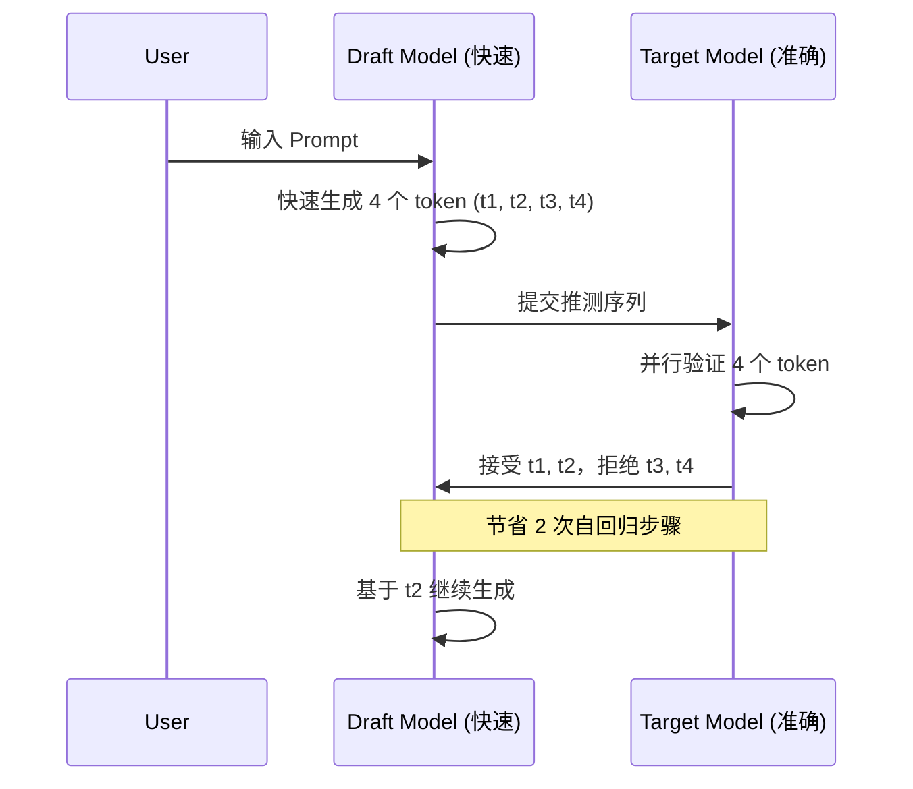

# vLLM 指南 6：推测解码加速

本指南介绍如何使用 vLLM 的推测解码（Speculative Decoding）技术加速大模型推理。

## 6.1 推测解码原理

推测解码通过"预测-验证"机制加速自回归生成。

### 核心思想

传统自回归生成：每个 token 都必须等待前一个 token 生成后才能开始计算。

```
Token 1 → Token 2 → Token 3 → Token 4 → Token 5
   ↓         ↓         ↓         ↓         ↓
  [1步]    [1步]    [1步]    [1步]    [1步]
           总计: 5 步
```

推测解码：使用轻量级模型快速生成多个 token，然后用主模型并行验证。

```
Draft Model:  Token 1 → Token 2 → Token 3 → Token 4  (快速)
Target Model: 验证全部 4 个 token (并行)
               ✓    ✓    ✓    ✗
               接受 接受 接受 拒绝
           总计: 2 步 (加速 2.5x)
```

### 架构图

```
┌─────────────────┐
│   输入 Prompt   │
└────────┬────────┘
         │
         ▼
┌─────────────────┐
│  Draft Model    │ ◀── 小型快速模型
│  (投机生成)      │
└────────┬────────┘
         │ 生成 K 个 token
         ▼
┌─────────────────┐
│  Target Model   │ ◀── 大型准确模型
│  (并行验证)      │
└────────┬────────┘
         │ 接受前 N 个，拒绝后续
         ▼
┌─────────────────┐
│   输出结果       │
└─────────────────┘
```

### 序列图



### 性能收益

| 场景 | 接受率 | 加速比 | 说明 |
|------|--------|--------|------|
| 代码生成 | 70-85% | 2-3x | token 重复率高 |
| 对话生成 | 60-80% | 1.5-2.5x | 自然语言 |
| 摘要生成 | 65-80% | 1.8-2.5x | 取决于风格 |
| 创意写作 | 50-70% | 1.5-2x | 多样性高 |

## 6.2 EAGLE 推测解码

EAGLE 是 vLLM 推荐的高效推测解码方法。

### EAGLE 特点

- 不需要额外的 draft model
- 使用自回归模型的隐藏状态
- 高接受率（通常 > 80%）
- 开箱即用

### CLI 启用 EAGLE

```bash
vllm serve Qwen/Qwen2.5-7B-Instruct \
    --speculative-config '{
        "method": "eagle3",
        "num_speculative_tokens": 5
    }'
```

### Python 配置

```python
from vllm import LLM

llm = LLM(
    model="Qwen/Qwen2.5-7B-Instruct",
    speculative_config={
        "method": "eagle3",
        "num_speculative_tokens": 5,  # 每次推测 5 个 token
    }
)
```

### EAGLE 参数说明

| 参数 | 默认值 | 说明 |
|------|--------|------|
| method | eagle3 | 推测方法 |
| num_speculative_tokens | 5 | 每次推测的 token 数 |
| rejection_sample_method | default | 拒绝采样方法 |
| temperature | 0.0 | 采样温度 |

### 调整推测数量

```python
# 少量推测 - 延迟更低
llm = LLM(
    model="Qwen/Qwen2.5-7B-Instruct",
    speculative_config={
        "method": "eagle3",
        "num_speculative_tokens": 3,  # 更少推测，更快响应
    }
)

# 大量推测 - 吞吐更高
llm = LLM(
    model="Qwen/Qwen2.5-7B-Instruct",
    speculative_config={
        "method": "eagle3",
        "num_speculative_tokens": 10,  # 更多推测，吞吐更高
    }
)
```

## 6.3 N-gram 推测解码

轻量级方法，无需额外模型，利用 n-gram 匹配进行推测。

### N-gram 原理

1. 在输入 prompt 中查找已有的 n-gram
2. 如果匹配，预测下一个 token
3. 验证预测的正确性

### CLI 配置

```bash
vllm serve Qwen/Qwen2.5-7B-Instruct \
    --speculative-config '{
        "method": "ngram",
        "num_speculative_tokens": 4,
        "prompt_lookup_min": 2,
        "prompt_lookup_max": 5
    }'
```

### Python 配置

```python
from vllm import LLM

llm = LLM(
    model="Qwen/Qwen2.5-7B-Instruct",
    speculative_config={
        "method": "ngram",
        "num_speculative_tokens": 4,  # 每次最多推测 4 个 token
        "prompt_lookup_min": 2,  # 最小 n-gram 长度
        "prompt_lookup_max": 5,  # 最大 n-gram 长度
    }
)
```

### 参数说明

| 参数 | 说明 | 建议值 |
|------|------|--------|
| num_speculative_tokens | 推测 token 数量 | 2-6 |
| prompt_lookup_min | 最小匹配长度 | 2-3 |
| prompt_lookup_max | 最大匹配长度 | 5-10 |

### 适用场景

- 代码补全（高重复模式）
- 模板化文本生成
- 术语密集的专业文本

## 6.4 Draft Model 推测解码

使用专门的草稿模型进行推测。

### 配置方式

```bash
vllm serve meta-llama/Llama-3.1-70B-Instruct \
    --speculative-config '{
        "method": "draft_model",
        "model": "meta-llama/Llama-3.1-8B-Instruct",
        "num_speculative_tokens": 5
    }'
```

### Python 配置

```python
from vllm import LLM

llm = LLM(
    model="meta-llama/Llama-3.1-70B-Instruct",
    speculative_config={
        "method": "draft_model",
        "model": "meta-llama/Llama-3.1-8B-Instruct",  # 草稿模型
        "num_speculative_tokens": 5,
    }
)
```

### 草稿模型选择原则

| 条件 | 推荐草稿模型 |
|------|-------------|
| 同系列模型 | 使用 8B 作为 70B 的草稿 |
| 相似架构 | Llama-3-8B 用于 Llama-3-70B |
| 无合适草稿 | 考虑使用 EAGLE |

### 模型组合示例

```python
# Llama 系列组合
speculative_config = {
    "method": "draft_model",
    "model": "meta-llama/Llama-3.1-8B-Instruct",
    "num_speculative_tokens": 5,
}

# Qwen 系列组合
speculative_config = {
    "method": "draft_model",
    "model": "Qwen/Qwen2.5-7B-Instruct",
    "num_speculative_tokens": 4,
}
```

## 6.5 方法选择

### 对比表

| 方法 | 加速比 | 显存开销 | 额外依赖 | 适用场景 |
|------|-------|---------|---------|---------|
| N-gram | 1.5-2x | 0 | 无 | 快速启用，任何模型 |
| EAGLE | 2-4x | 中等 | 无 | 通用场景，推荐 |
| MTP | 2-4x | 中等 | 需 MTP 支持 | 原生 MTP 模型 |
| Draft Model | 2-6x | 较大 | 需要草稿模型 | 有合适草稿时 |

### 选择决策树

```
开始
  │
  ├─ 需要快速启用?
  │    └─ 是 → 使用 N-gram
  │
  ├─ 有合适的草稿模型?
  │    ├─ 是 → 使用 Draft Model (最高加速)
  │    └─ 否 → 继续
  │
  ├─ 模型支持 MTP?
  │    ├─ 是 → 使用 MTP
  │    └─ 否 → 使用 EAGLE
```

### 场景推荐

| 场景 | 推荐方法 | 理由 |
|------|---------|------|
| 代码补全 | N-gram / EAGLE | 代码重复模式多 |
| 对话系统 | EAGLE | 平衡速度和质量 |
| 实时交互 | N-gram | 延迟最低 |
| 批量推理 | EAGLE / Draft | 吞吐优先 |
| 长文本生成 | EAGLE | 接受率高 |

## 6.6 配置调优

### 推测 token 数量调优

```python
# 低延迟场景
speculative_config = {
    "method": "eagle3",
    "num_speculative_tokens": 3,  # 减少延迟
}

# 高吞吐场景
speculative_config = {
    "method": "eagle3",
    "num_speculative_tokens": 8,  # 增加吞吐
}
```

### 拒绝采样策略

```python
# 严格模式 - 只接受高置信度
speculative_config = {
    "method": "eagle3",
    "num_speculative_tokens": 5,
    "rejection_sample_method": "strict",  # 严格验证
}

# 概率模式 - 基于概率接受
speculative_config = {
    "method": "eagle3",
    "num_speculative_tokens": 5,
    "rejection_sample_method": "probabilistic",  # 概率采样
}

# 综合模式 - 平衡速度和准确性
speculative_config = {
    "method": "eagle3",
    "num_speculative_tokens": 5,
    "rejection_sample_method": "synthetic",  # 综合评估
}
```

### 动态调整

```python
# 根据序列长度调整
def get_speculative_config(seq_len_hint):
    if seq_len_hint < 100:
        # 短序列，减少推测
        return {"method": "eagle3", "num_speculative_tokens": 3}
    elif seq_len_hint < 500:
        # 中等序列
        return {"method": "eagle3", "num_speculative_tokens": 5}
    else:
        # 长序列，增加推测
        return {"method": "eagle3", "num_speculative_tokens": 8}
```

### EAGLE 版本选择

| 版本 | 特点 | 适用场景 |
|------|------|---------|
| eagle | 基础版 | 通用 |
| eagle2 | 改进版 | 高接受率 |
| eagle3 | 最新版 | 推荐，默认使用 |

## 6.7 性能监控

### 启用日志

```bash
# 查看推测解码统计
VLLM_LOGGING_LEVEL=DEBUG vllm serve Qwen/Qwen2.5-7B-Instruct \
    --speculative-config '{"method": "eagle3", "num_speculative_tokens": 5}'
```

### 日志输出示例

```
# 推测解码统计
# [INFO] Speculative decoding enabled: method=eagle3, num_tokens=5
# [INFO] Acceptance rate: 0.85 (17/20 tokens accepted)
# [INFO] Draft speed: 150 tokens/s, Target speed: 45 tokens/s
# [INFO] Speedup: 3.2x
```

### 接受率计算

```python
# 接受率 = 接受的 token 数 / 总推测 token 数
acceptance_rate = accepted_tokens / total_speculative_tokens
```

### 性能指标

| 指标 | 说明 | 理想值 |
|------|------|--------|
| 接受率 | 被接受的推测 token 比例 | > 70% |
| 加速比 | 推测解码 vs 纯自回归 | > 1.5x |
| 吞吐提升 | tokens/s 提升比例 | > 1.5x |

### 常见问题排查

#### 接受率过低 (<50%)

```python
# 降低推测 token 数量
speculative_config = {
    "method": "eagle3",
    "num_speculative_tokens": 3,  # 从 5 降到 3
}
```

#### 延迟增加

```python
# 检查：
# 1. num_speculative_tokens 是否过大
# 2. 是否适合当前场景

# 调整为更小的值
speculative_config = {
    "method": "eagle3",
    "num_speculative_tokens": 2,
}
```

#### 显存不足

```python
# 降低 gpu_memory_utilization
llm = LLM(
    model="Qwen/Qwen2.5-7B-Instruct",
    speculative_config={"method": "eagle3", "num_speculative_tokens": 3},
    gpu_memory_utilization=0.7,  # 降低显存使用
)
```

### Benchmark 脚本

```python
from vllm import LLM, SamplingParams
import time

def benchmark_speculative(model_name, num_tokens_list):
    """测试不同推测 token 数量的性能"""
    results = []
    
    for num_tokens in num_tokens_list:
        llm = LLM(
            model=model_name,
            speculative_config={
                "method": "eagle3",
                "num_speculative_tokens": num_tokens,
            }
        )
        
        sampling_params = SamplingParams(
            temperature=0.0,
            max_tokens=200,
        )
        
        messages = [{"role": "user", "content": "写一首关于春天的诗"}]
        
        # warmup
        llm.chat(messages, sampling_params=sampling_params)
        
        # benchmark
        start = time.time()
        for _ in range(10):
            llm.chat(messages, sampling_params=sampling_params)
        elapsed = time.time() - start
        
        results.append({
            "num_tokens": num_tokens,
            "time": elapsed,
            "throughput": 2000 / elapsed,  # tokens/s
        })
    
    return results
```

### 生产环境配置建议

```python
# 高吞吐服务
llm = LLM(
    model="Qwen/Qwen2.5-7B-Instruct",
    speculative_config={
        "method": "eagle3",
        "num_speculative_tokens": 8,
    },
    gpu_memory_utilization=0.85,
    max_model_len=4096,
)

# 低延迟服务
llm = LLM(
    model="Qwen/Qwen2.5-7B-Instruct",
    speculative_config={
        "method": "ngram",
        "num_speculative_tokens": 3,
        "prompt_lookup_min": 2,
        "prompt_lookup_max": 4,
    },
    gpu_memory_utilization=0.9,
    max_model_len=2048,
)
```
